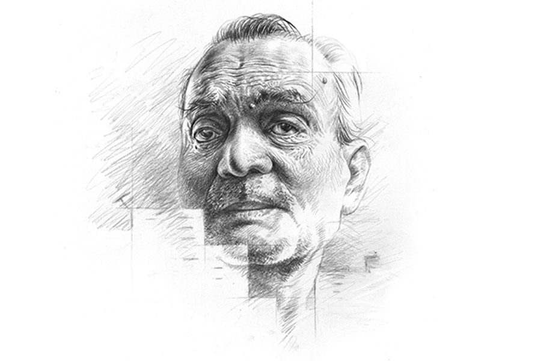

 
 <h1 align=center>পিতৃদিবস</h1>
<h2 align=center>শ্রীপর্ণা বন্দ্যোপাধ্যায়</h2> অবসরের পরেও নিজের পরিবার নিয়ে গিয়ে পৈতৃক বাড়িতে উঠতে পারেননি দিব্যেন্দুবাবু। কারণ ভাইদের প্রবল বাধা ও অসহযোগিতা। পড়ে আছেন ইস্টার্ন কোলফিল্ডের ঘুপচি কোয়ার্টারে। প্রায় জবরদখল করেই। তাও প্রায় ন’বছর হতে চলল। ও দিকে প্রকাণ্ড শরিকি বাড়িটা ভাইরা প্রোমোটারকে দিয়ে ফ্ল্যাট বানাচ্ছে। কানে এসেছে, দুই ভাই ও এক বোন একটা করে আড়াই কামরার ফ্ল্যাট, সঙ্গে বেশ ভাল টাকাও পাচ্ছে। অথচ বাড়িটা তৈরির সময় বড় ছেলে হিসেবে টাকা দিয়ে বাবার পাশে দাঁড়িয়েছিলেন দিব্যেন্দুবাবুই।

যার যেখানে জোর। যে কোম্পানি আজীবনের যাবতীয় দায়িত্ব পালনে সহায় হয়েছে, যে কোয়ার্টারে তিনি সপরিবার এতগুলো বছরের আশ্রয় পেয়েছেন, সেই কোম্পানির কোয়ার্টারই নীতিবিরুদ্ধ ভাবে আটকে রাখতে বাধ্য হচ্ছেন দিব্যেন্দুবাবু। আর যাঁরা লাভের গুড় চেটেপুটে আত্মসাৎ করেছে, তারা ঢিল ছোঁড়া দূরত্বে দিব্যেন্দুবাবুর বৈধ বসত বেদখল করে এত দিন ভাড়া খাটিয়ে রোজগার করেছে, আর এখন বিক্রি করে দাদাকে বঞ্চিত করে সব ভাগ বাঁটোয়ারা করে নিচ্ছে। অবসরের কয়েক বছর আগে কিছুটা জমি বিক্রি ও সংস্কারের জন্য সরল বিশ্বাসে মেজ ভাই কুন্তলকে পাওয়ার অব অ্যাটর্নি দেওয়াই তাঁর কাল হয়েছে। ওই সব খটমট কাগজপত্র পড়ে বোঝার পরিবর্তে ভাইকে বিশ্বাস করাই তাঁর সহজ মনে হয়েছিল। সেটা যে পরে অপরিশোধ্য জটিলতার জন্ম দেবে, তা দিব্যেন্দুবাবু আঁচ করতে পারেননি। দুই ভাই তো বটেই, বোনও প্রোমোটারের কাছ থেকে ফ্ল্যাট আর মোটা টাকা পাচ্ছে, কিন্তু তাদের একদা প্রতিপালক বড় দাদা আজ জবরদখলকারী রিফিউজি, যাঁকে বার বার কোম্পানির নোটিশ অমান্য করে এর-তার হাতেপায়ে ধরে বেআইনি ভাবে অফিসের ফ্ল্যাটে পড়ে থাকতে হচ্ছে।

শরণার্থী শিবির কখনও সুন্দর হয় না। মেরামতির অভাবে দিব্যেন্দুবাবুর আস্তানাও জরাজীর্ণ। কোনও কিছু বিগড়োলে কোম্পানির ইলেকট্রিশিয়ান বা প্লাম্বার এসে সারায় না, টাকা দিয়েও মিস্ত্রি মেলা ভার হয়ে যায়। টাকার জোরই বা কতটুকু? কোম্পানি পেনশন মন্দ দেয় না, কিন্তু কোয়ার্টার না ছাড়ায় সেটা দিব্যেন্দু তো সেটা পাচ্ছেন না। পেনশনের ভরসায় নিজের সঞ্চয়ের অনেকটাই পৈতৃক বাড়ির দেওয়ালে গেঁথে ফেলেছেন। গৃহঋণের সুবিধে থাকলেও সময় থাকতে কাজে লাগাননি।

জয়া বেঁচে থাকতে অনেক চোখের জল ফেলেছেন। দিব্যেন্দুবাবু বরাবর স্ত্রীর ওপরেই চোটপাট করেছেন। ভাগ্যিস প্রভিডেন্ড ফান্ড, গ্র্যাচুইটি এগুলো অবসরের পরেই পেয়ে গিয়েছিলেন, না হলে গভীর দৈন্যের মধ্যে পড়ে যেতেন দিব্যেন্দুবাবু। সেই টাকা ব্যাঙ্কে সুদে খাটিয়ে আর ছেলে রাতুলের আমেরিকা থেকে পাঠানো টাকায়, একা মানুষের জল ও বিদ্যুৎভোগ এক রকম করে হয়েই যায়। কিন্তু জীবনসঙ্গিনী চলে যাওয়ার পর থেকে একদা বৈধ, কিন্তু বর্তমানে অবৈধ আস্তানায় সবই দুর্বিষহ লাগে। কাজের মেয়েরা কাজের চেয়ে চুরি করে বেশি। একাই পড়ে আছেন দিব্যেন্দু। বয়সের চেয়ে বেশি অথর্ব। শরীরে ভার্টিগো, মধুমেহসহ নানা ব্যাধি। চলতে গিয়ে কখনও-সখনও পড়ে যান। দেখার মানুষ না থাকলে সব কি টাকা দিয়ে কেনা যায়?

ঠেকায় পড়ে সেদ্ধপোড়া রাঁধতে শিখেছেন। তবে সেটাও রোজ পেরে ওঠেন না। নদীঘাটে যে পাইস হোটেলগুলোয় অটো আর মিনিবাসের ড্রাইভাররা খায়, সেখান থেকেই প্রায় দিন খাবার আনান। মাছে বড্ড তেল-মশলা দেয় বলে সপ্তাহে এক দিন মাছ খান। মাংস কদাচিৎ। পাশের কোয়ার্টারের মেয়ে তমালিকা মাঝে মাঝে এটা-সেটা রান্না করে দিয়ে যায়, ওষুধপত্র, টুকটাক জিনিস এনে দেয়। ব্যাঙ্ক, পোস্ট অফিসে টাকা বা চেক জমা ও তোলার কাজ লাইন দিয়ে নিজেকেই করতে হয়, যদিও তমালিকাকে বললে আপত্তি করে না। কিন্তু পরের মেয়েকে দিয়ে কতটাই বা করানো যায়? তা ছাড়া যে টাকা ভবিষ্যতে নিজের ছেলের প্রাপ্য, তার সমস্ত হদিশ পরের মেয়েকে দিয়ে দেন কী করে? এ দিকে তমালিকাকে না হলে চলেও না।

ছেলের কাছে আমেরিকা গিয়ে কাটিয়ে আসার ইচ্ছে একাধিক বার ব্যক্ত করেছিলেন জয়া, ছেলে ঘাড় পাতেনি। আর এখন অসহায়তার জন্য বাকি জীবনটা পাকাপাকি সেখানেই থাকার ইচ্ছে ঠারেঠোরে প্রকাশ করেন দিব্যেন্দু। রাতুল এড়িয়ে যায়। অগত্যা ভগ্নস্বাস্থ্য ও একাকিত্ব সম্বল করে বেআইনি জবরদখলকারীর কলঙ্ক মাথায় নিয়ে থাকার বদলে বৃদ্ধাশ্রমে যাওয়ার কথাও বলেছেন দিব্যেন্দুবাবু। যা সঞ্চয়ে আছে, আর রাতুল যদি কিছু দেয়, ভদ্রস্থ বৃদ্ধাশ্রমে গিয়ে শেষ জীবনটা একটু আনন্দে কাটবে, অসুখে বিসুখে সেবাও পাবেন। ভেবেছিলেন, এমন প্রস্তাবে ছেলের বুঝি বিবেকে লাগবে। বলবে, ‘চলে এসো’। বরং রাতুল ফোন করাই প্রায় ছেড়ে দিল। যৎসামান্য টাকা যে এখনও পাঠাচ্ছে, এই অনেক।

বন্ধুস্থানীয়রা এখনও অনেকে বেশ শক্তপোক্ত। তারা স্মার্টফোন ও তাতে সোশ্যাল মিডিয়ার ব্যবহারেও অভ্যস্ত। কিন্তু সময়ের সঙ্গে পাল্লা দেওয়ার ইচ্ছে বা সঙ্গতি কোনওটাই দিব্যন্দুর নেই। দিনাতিপাত করতেই দ্বিধাদ্বন্দ্বে জর্জরিত— এত বছরের আস্তানা, নাকি আয়ত্তের মধ্যে কোনও বৃদ্ধাশ্রম, হোটেলই চলবে নাকি নিজে ভাতে-ভাত চেষ্টা করবেন, রাতুলের পাঠানো টাকাগুলো জমিয়ে রাখবেন, নাকি বাকি ক’টা দিন হাত খুলে চলবেন ইত্যাদি। সস্তার বেসিক ফোন ছেড়ে নতুন যুগের মোবাইল বা ফেসবুকের মাধ্যমে বন্ধুবৃত্ত প্রসারিত করার বিলাসিতা মনে কখনও ঠাঁই দেন না দিব্যেন্দুবাবু।

“কী হে, অনেক দিন পর দেখছি হাঁটতে বেরিয়েছ? শরীর ভাল আছে তো?” বললেন একদা সহকর্মী অমিয়। তিনি এই পূর্বাচলেই ছেলের কোয়ার্টারে থাকেন।

“চলছে ভাই। শুগারের ওষুধ ফুরিয়ে এসেছে। কিন্তু পরনির্ভর হলে যা হয়, আজ আনব কাল আনব করে এনে আর দেয় না।”

“রাতুল কবে আসছে? ওর কাছে গিয়ে তো থাকতে পারো। অত বড় চাকরি করে আমেরিকায়।”

অনেক দিন পর সকাল সকাল হাঁটতে বেরিয়ে বেশ ভাল লাগছিল। অমিয়র কথায় মুখটা তেতো হয়ে গেল। নিজের ডলার-রোজগেরে ছেলের পিতৃভক্তি নিয়ে যথেষ্ট বক্রোক্তি শুনে আসছেন। তাই ইদানীং আড্ডায় যাওয়াও কমিয়ে দিয়েছেন। তমালিকাও বার দুই ওষুধ আনার কাজ এড়িয়ে গেছে। গোপালকে বলে দেখতে হবে। নাঃ, দুর্গাপুরে একটা বৃদ্ধাশ্রমের সন্ধান পেয়েছেন যখন, চলেই যাবেন।

পুজো পেরিয়ে গেল, বাতাসে এবার হিমের পরশ নেই। বিছানায় শুয়ে কাগজ পড়তে পড়তে দেখলেন পক্ষিরাজ ঘোড়ার ছবি। পক্ষিরাজ চড়ে উড়ে চলেছেন। টুইন টাওয়ারের মধ্যে দিয়ে ঝাঁ করে ওড়ার সময় ঢকঢক শব্দ। ঘোড়ার খুরের ধ্বনি একটু নতুন ধরনের ঠেকল। হতে পারে। এমনি ঘোড়া তো নয়, পক্ষিরাজ। শব্দটা জোরালো হতে হতে টের পাওয়া গেল, ওটা ঘোড়ার খুর নয়, দরজায় করাঘাত। দুপুরে খাওয়ার পর চোখ লেগে গিয়েছিল। মনে হয় তমালিকা এসেছে। বেলা পড়ে এসেছে।

“যাচ্ছি...” বলে টলমল করতে করতে এসে দরজা খুলে দিব্যেন্দুবাবু হাঁ! নিজের চোখকে বিশ্বাস করতে পারছেন না। রাতুল!

“আয় আয়! খবর না দিয়ে চলে এলি? আমি তো কিছুই প্রিপারেশন করে রাখিনি। নিজেও দুপুরে খেয়ে ফেললাম একটু আগে। বোস বোস, দাঁড়িয়ে কেন? এই চেয়ারটায় বোস। সঙ্গে কে?” নিজের দুঃস্থ গৃহস্থালিতে এনআরআই ছেলেকে কোথায় বসতে দেবেন, কী খাওয়াবেন, কিছুতেই ভেবে পান না দিব্যেন্দুবাবু। নিজের দীনহীন পরনির্ভর দশায় নিজের কোনও রকমে চলে যায়, বাড়িতে অতিথি এলে বিড়ম্বনার শেষ থাকে না। বাড়ির ছেলে দীর্ঘ দিন হস্টেলে ও তার পর চাকরিসূত্রে বিদেশে থাকলে অতিথিই হয়ে যায় সম্ভবত।

“ঠিক আছে, অত ব্যস্ত হতে হবে না। আমরা খাবার আর ড্রিঙ্কস নিয়ে এসেছি। বিকেলে তাই খাব। ডায়েট সফ্ট ড্রিঙ্ক হলে তো তোমারও ভাল। শুগার আছে যখন। বাবা, এ হল চেলসি। চেলসি, মিট মাই ফাদার।”

চেলসি প্রথমে হাত বাড়িয়ে করমর্দন করলেও রাতুলের ইশারায় পা ছুঁয়ে প্রণাম করল। রাতুল ছবি তুলল পটাপট। দিব্যেন্দু অভিভূত। কিন্তু ছেলে না জানিয়েই বিয়ে করে ফেলল? তাই কি ফোন করছিল না?

রাতুল নিজেও ঝুঁকে প্রণাম করল। বাবাকে বলল, “মাথায় হাত রেখে আশীর্বাদ করো।”

চেলসি সেই মুহূর্তগুলো ছবিতে ধরে রাখল এ বার। দিব্যেন্দু কী বলবেন ভেবে পেলেন না।

রাতুল বলল, “এখানে কী করছ? নাও তৈরি হও।”

দিব্যেন্দুর অবাক চোখে আলোর ঝিলিক। বললেন, “হুট করে কি তৈরি হওয়া যায়? আমার পাসপোর্টের ভ্যালিডিটি এখনও আছে। কিন্তু ভিসার কী হবে? আর প্যাকিং-ও তো কিছুই হয়নি।”

রাতুল হেসে উঠল, “ঝটপট তোমার রংচটা লুঙ্গি ফতুয়া ছেড়ে এই পাজামা পাঞ্জাবিটা পরে নাও দেখি।”

রাতুল দরজা দিয়ে বেরিয়ে ডাকতেই একটা ছেলে এল একগাদা খাবারের প্যাকেট আর কয়েক ক্যান নরম পানীয়ের ক্যারিব্যাগ হাতে ঝুলিয়ে। ছেলেটা বোঝা গেল গাড়ির চালক। মানে রাতুল গাড়ি ভাড়া করে এসেছে। কোথা থেকে? কলকাতা থেকে নাকি? রাতুল ছেলেটার হাতে মোবাইল ধরিয়ে ছবি তুলে দিতে বলল। সামনের টেবিলে খাবারগুলো সাজিয়ে ফেলল চেলসি। দু’জনে দু’পাশ থেকে বাবাকে জড়িয়ে ধরে রইল হাসিমুখে। ছবি উঠতে লাগল।

দিব্যেন্দুবাবুর বিশ্বাস হচ্ছে না। ছেলের ওপর জমানো অভিমান সব গলে জল হয়ে যাচ্ছে। আবার নিজের দরিদ্র অগোছালো ঘরকন্নার জন্য লজ্জাও হচ্ছে খুব। বলছেন, “তোরা আসবি জানলে ঘরদোর ঠিকঠাক করিয়ে রাখতাম। সব ডামাডোল হয়ে আছে। একা থাকি তো…”

চেলসির কাছে বাবা পরিবারের জন্য কত আত্মত্যাগ করেছে, ছোটবেলায় রাতুল কত কষ্ট করে কত দূর যাতায়াত করে লেখাপড়া করেছে, উপযুক্ত টিউশন ছাড়াই নিজের চেষ্টায় আর বাবার নির্দেশেই তৈরি হয়ে আইআইটি ক্র্যাক করেছে— এ সব ইংরেজিতে বলে যেতে লাগল রাতুল। চেলসি পুরোটা ভিডিয়ো করল। ওর কথা ওর বাবার কথা। ইংরেজিটা দিব্যেন্দুবাবু ভালই বলেন। ছেলের মান রাখতে পেরে বেশ লাগল।

রাতুল বলল, “বাবা, তোমার মাইক্রোওয়েভ তো নেই। খাবারগুলো এখনও একটু গরম আছে। আগে খাওয়া যাক বরং। অনেকটা পথ।”

“ঠিক ঠিক। কতটা পথ পেরিয়ে এসেছিস। জেট ল্যাগ বলে কথা। কোথায় শুতে দিই বল তো? ও ঘরের খাটে একটা পরিষ্কার চাদর বিছিয়ে… কিন্তু বালিশ আর কভার? আচ্ছা অত দূর থেকে এত দিন পর আসছিস, তাও বৌকে সঙ্গে নিয়ে, বুড়ো বাপকে একটু তৈরি থাকার সুযোগ দিবি না? মেয়েটা প্রথম বার বাড়িতে এল। বৌ বরণও করা হল না। এ দিকে আমার ভিসা— কত দিন আছিস? ভাগ্যিস পাসপোর্টটা করা ছিল।”

তিনটে কাঁটাচামচ আর গ্লাস খুঁজে পেতেই হিমশিম অবস্থা। দিব্যেন্দুবাবু রান্নাঘর থেকে বসার ঘরে ফিরতে রাতুল একটা খাবারের প্যাকেট আর একটা কোল্ড ড্রিঙ্কের ক্যান টেবিলে নামিয়ে বলল, “বাবা তুমি খেয়ে নিয়ো। আমাদের অনেকটা রাস্তা ফিরতে হবে। আসানসোল ইন্টারন্যাশনালে উঠেছি। একটু সময় ছিল, তাই দেখা করতে এলাম। এই সুযোগে চেলসির সঙ্গে তোমার দেখাও করিয়ে দিলাম, ওকে বিয়েও করতে পারি।”

“মানে? তোরা থাকবি না? ওই হোটেল থেকে রোজ যাতায়াত করবি নাকি? কেন? এখনও বিয়ে করিসনি বলে? আরে এখন এখানকার মানুষ অনেক লিবারাল হয়ে গেছে…”

“ও সব নিয়ে ভাবি না। এখানে থাকব কোথায়? নিজের সর্বস্ব কাকা-পিসিদের জন্য বিলিয়ে, নিজের হকের পাওনা কম্প্রোমাইজ় করে এক সময় মাকে নিয়ে আর এখন একা এই কোয়ার্টার ইললিগ্যালি অকুপাই করে রেখেছ। স্যরি, এখানে এই অব্যবস্থার মধ্যে আমি এক-আধ বেলা অ্যাডজাস্ট করতে পারি, কিন্তু চেলসিকে কী করে রাখব? আমরা থাকব বলে আসিনি। আমার স্কুলের রিইউনিয়নে আমি স্পেশালি ইনভাইটেড। ফাদার এত করে বললেন, এড়াতে পারলাম না। আর এসে দেখলাম, ইনসিডেন্টালি দিনটা ফাদার্স ডে, তাই দেখা করতে এলাম। চলি। টেক কেয়ার।”

“আর আমি?” প্রায় আর্তনাদ করে উঠলেন দিব্যেন্দুবাবু। গত ঘণ্টাখানেকে তিনি যে অনেক স্বপ্ন দেখে ফেলেছেন। তা যে আকাশকুসুম, বুঝতে পারেননি।

“তুমি কী? জমানো টাকা আছে তো কিছু? আমিও তো পাঠাই। ওতেই চলে যাবে। এ বার বেরোই। উই আর অলরেডি লেট। চেলসি গেট অন।”

বাংলা না বুঝলেও বাবার কাতর অভিব্যক্তি দেখে চেলসির চোখ ছলছল করে এল। আর এক বার ঝুঁকে প্রণামের ভঙ্গি করে “বাই বাবা, টেক কেয়ার!” বলে সিঁড়ি দিয়ে নেমে গেল ত্বরিত পায়ে।

ওরা চলে যেতে বৃদ্ধ নিজেকে আর ধরে রাখতে পারলেন না। চিৎকার করে উঠলেন, “চাই না তোর টাকা। খবরদার আর পাঠাবি না। চাই না আমার বাড়ির ভাগ। আমি ভিক্ষে করব। তোদের কাউকে চাই না। আমি আমার বাপের ব্যাটা নই… মায়ের ছেলেও নই! কারও বাপ নই। শুধু ভুল, শুধু ভুলে ভরা এক যমের অরুচি বুড়ো ভাম… আমি রিফিউজি, ইললিগ্যাল মাইগ্রেন্ট, ভিখিরি...”

হু হু করে কেঁদে ফেললেন দীর্ঘকায় মানুষটা। জীবনসঙ্গিনী চলে যাওয়ার সময়ও চোখে এত জল আসেনি তাঁর।

দরজায় টোকা। ওফ্‌! এখন আবার কে এল জ্বালাতে? রাতুল ফিরে আসেনি তো? হয়তো বাবার জন্য খারাপ লেগেছে। দিব্যেন্দুবাবু উঠলেন, আপনমনে বিড়বিড় করে বলতে লাগলেন, “নিয়ে যেতে হবে না বাবা, শুধু একটা রাত এই বুড়োটার কাছে, এই হতশ্রী বাড়িটাতেই না হয় থেকে যা...”

দরজায় আবার ঠকঠক। খুলে দেখেন অমিয়।

“কী হে? ছেলে এসেছে শুনলাম বৌ নিয়ে? ফেসবুকে দেখলাম। রাতুল তো আমার ফ্রেন্ডলিস্টে আছে। তোমার সঙ্গে তোলা অনেকগুলো ছবি পোস্ট করেছে দেখলাম– ‘হ্যাপি ফাদার্স ডে’ ক্যাপশন দিয়ে। সে সব দেখেই তো দেখা করতে এলাম! কোথায় ওরা? ডাকো, একটু কথা বলে যাই...”