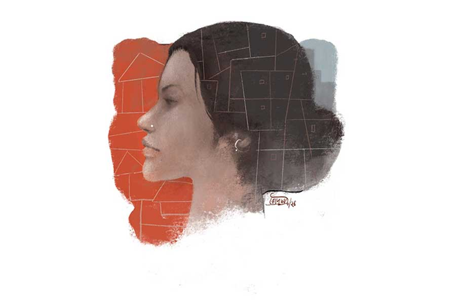

 
 <h1 align=center>পিপলপোতার প্রভা</h1>
<h2 align=center>কিশলয় জানা</h2> আমি পিপলপোতা যাচ্ছিলাম প্রভাকে ছাড়তে। ট্রেন থেকে নেমে ট্রেকার ধরতে হল। আরও দেড় ঘণ্টার নরকযন্ত্রণা। ট্রেকারটায় অসম্ভব ভিড়। আমাকে শহুরে লোক, বড় চাকুরে বলে পরিচয় দিয়ে আমার জন্য প্রভা একটু ভাল সিট ম্যানেজ করেছিল। প্রভা নিজে বসেছে ভিতরে। আমি মাঝে মাঝে আড়চোখে তার দিকে তাকিয়ে বুঝতে চেষ্টা করছিলাম, সে কী ভাবছে। কিন্তু তার মুখে ভাবনার লেশমাত্র ছিল না।

প্রভা আমাদের নিজেদের কেউ নয়, বহু দূরের আত্মীয়। আমার মায়ের এক মাসতুতো দিদির জ্ঞাতিগুষ্টির কারও মেয়ে প্রভা। কোনও একটি বিবাহ উপলক্ষে মা সেই মাসতুতো দিদির বাড়িতে গিয়েছিলেন। সেখানেই বাপ-মা হারা প্রভাকে দেখেন। অল্প বয়সে মাকে হারিয়েছিল সে, আর আমার মায়ের সঙ্গে দেখা হওয়ার কিছু দিন আগে তার বাবাকে।

বিয়েবাড়ির নানা গোলমাল, অনিয়ম সত্ত্বেও প্রভা নাকি মায়ের খুব খেয়াল রেখেছিল। তাতেই মা গলে জল। কলকাতায় ফেরার সময় প্রভাকে সঙ্গে নিয়ে আসেন। প্রভার তখন বছর আঠারো-উনিশ। আমার চেয়ে বছর তিনেকের ছোট। আমি তখন ইউনিভার্সিটিতে। শুনেছিলাম ক্লাস টেনের পর আর লেখাপড়া করেনি প্রভা। সেই থেকে প্রায় পনেরো বছর সে আমাদের বাড়িতেই থাকত।

‘থাকত’ বলছি কারণ, আজ থেকে প্রভা আর ও-বাড়িতে থাকবে না। তাকে আমাদের বাড়ি থেকে পিপলপোতায় তার বাড়িতে বরাবরের জন্য দিয়ে যেতেই আমার আসা। আমাদের অবশ্য বাড়ি না বলে ফ্ল্যাট বলাই সঙ্গত। বছর তিনেক আগে বাবার মৃত্যুর পর চার কাঠা জমির উপর তৈরি সেই পেল্লায় বাড়িটা প্রোমোটারের হাতে তুলে দিয়ে আমি এই দু’হাজার স্কোয়ার ফুটের ফ্ল্যাটটা পেয়েছি। সঙ্গে ক্যাশও। ফলে প্রভা যে বাড়িতে এসে উঠেছিল, সে বাড়ি বাবা-মায়ের সঙ্গে সঙ্গে অতীত। ভাগ্যিস মা আগেই মারা গিয়েছিলেন, না হলে তিনি বাড়িটা ভাঙতেও দিতেন না, প্রভাকেও পিপলপোতায় ফিরতেও দিতেন না। আমাদের পুরনো বাড়িটায় অনেক ঘর ছিল, তারই একটায় প্রভা থাকত। প্রভা সংসারের হাজারো কাজ করত, তাকে কেউ বিশ্রাম নিতে দেখত না। রাতেও সকলের খাওয়া শেষ হলে মা আর প্রভা খেতে বসত। মায়ের এক মুহূর্ত তাকে ছাড়া চলত না। আজ পিপলপোতায় প্রভাকে রেখে গেলে আমাদের সঙ্গে তার দীর্ঘ পনেরো বছরের সম্পর্কের ইতি ঘটবে।

এই ইতি ঘটত না, যদি না সোমা, আমার স্ত্রী, প্রভাকে রাখার ব্যাপারে আপত্তি তুলত। দু’হাজার স্কোয়ার ফুটের ফ্ল্যাটে তিনটে বেডরুম, ড্রয়িং কাম ডাইনিং, অ্যাটাচড বাথের সঙ্গে এক চিলতে একটা সারভেন্ট রুমও আছে। প্রভার সেখানেই জায়গা হয়েছিল, এবং এ ব্যাপারে তাকে কখনও অভিযোগ-অনুযোগ করতে শুনিনি। আমাদের সংসারে আগেও যেমন, আমার বিয়ের পরও, প্রভাই হয়ে উঠেছিল সংসারের অল-ইন-ওয়ান। কুক-মেড সারভেন্ট-বাজার সরকার— সব। সোমা প্রথম প্রথম দু’-এক বার আপত্তি তুললেও আমি তাকে বুঝিয়েছিলাম, আজকের দিনে প্রভার মতো এক জন হাউসকিপার রাখতে গেলে অনেক খরচ। তার চেয়ে প্রায় বিনা বেতনে প্রভাকে রাখা আমাদের পক্ষে অনেকটা লাভজনক। আমার শ্বশুরের এক্সপোর্ট-ইমপোর্টের ব্যবসা। তাঁর মেয়ে লাভ-লোকসান বুঝবে না, তা হয় না। ফলে সোমা আর উচ্চবাচ্য করেনি। কিন্তু সমস্যা তৈরি হল অন্য দিক দিয়ে।   

গত পনেরো বছরে মায়ের প্রশ্রয়ে প্রভা এ বাড়ির প্রায় গৃহকর্ত্রীতে পরিণত হয়েছিল। সে যে কিছু অসঙ্গত দাবি করত তা নয়, কিন্তু বাজার থেকে কী কী আসবে, কোন দিন কী রান্না হবে, বিছানার চাদর কবে কাচা হবে ইত্যাদি গেরস্থালির ব্যাপারে তার সিদ্ধান্তই ছিল চূড়ান্ত। এ ব্যাপারে মা কখনও মাথা ঘামায়নি, আমি বা বাবাও নয়। বরং পরে আমার মনে হয়েছে, বাবাও প্রভাকে এ ব্যাপারে প্রশ্রয় দেন। তাতে আমার কোনও অসুবিধে হচ্ছিল না। এ জাতীয় তুচ্ছ ঘর-সংসারের ব্যাপারে মাথা ঘামানোর কোনও ইচ্ছে আমার ছিল না। আমি আমার মতো চলতাম। ঠিক সময়ে টেবিলে খাবার দেওয়া হলে, বাইরে বেরোনোর জুতো পালিশ করা থাকলে, জামাকাপড় ইস্ত্রি করা হলে, আর আমার কী চাই? প্রভার দিকে আমি ফিরেও তাকাতাম না। চওড়া কপাল, ঘোড়ার মতো চিবুকের ছাঁদ, কালো কুষ্টি একটি মেয়ে— তার দিকে ফিরে তাকাব আমি? যাকে ইউনিভার্সিটির মেয়েরা ‘গ্রিক গড’, ‘অ্যাডোনিস’, ‘লাভার্স বয়’—আরও কত কী বলে ডাকে!

মনে আছে, প্রভা প্রথম যখন আমাদের বাড়িতে এসেছিল, তখন অপুষ্টিতে ভোগা লিকপিকে দেহ আর ওই ঘোড়ার মতো মুখমণ্ডল দেখে তাকে আমি ভূত ভেবেছিলাম। শুনেছি বাবা প্রথমে আপত্তি তুলেছিলেন, “ঘরে সোমত্ত ছেলে তোমার। প্রভার বয়সটাও কাঁচা। এ অবস্থায় তাকে বাড়িতে রাখবে? যদি বিপদ-আপদ কিছু হয়ে যায়? বুঝতেই তো পারছ, আগুন আর ঘি… ”

মা তাতে বলেছিলেন, “আমি আমার ছেলেকে সেই শিক্ষা দিইনি। প্রভা ওর বোনের মতো। বোন হিসেবেই সে দেখবে, এ আমার কথার কথা নয়, দৃঢ় বিশ্বাস।”   

মা আমায় পরে এ কথা জানিয়েছিল। যদিও আমার সততার উপর মায়ের অটুট আস্থা— এ কথা জানাতেই কথাটা আমায় বলা হয়েছিল, তা আমি বিশ্বাস করি না। মা এক ঢিলে দুই পাখি মারতে চেয়েছিল। প্রভাকে আমায় বোন হিসেবে দেখতে হবে, অতএব তাকে কুনজরে দেখা যাবে না, এই নির্দেশও এর পিছনে ছিল। আমি মনে মনে হেসেছিলাম। প্রভা যদি খুব সুন্দরী হত, তা হলে মায়ের নির্দেশ আমি নর্দমায় বিসর্জন দিতে দ্বিধা করতাম না। কিন্তু প্রভার মতো কুশ্রী এবং স্টেটাসহীন মেয়ের সঙ্গে আমি অন্য কোনও কারণে জড়িয়ে পড়ছি, এটা আমার ডিগনিটির পক্ষে খুব ক্ষতিকর।

মা যতই মুখে বলুক, কিন্তু মনে মনে তারও যে দুর্ভাবনা আছে, তা বুঝতে পারতাম, যখন মা প্রভাকে আগলে আগলে রাখত; আমার উপস্থিতিতে তাকে আমার ঘরে যেতে দিত না। প্রভা আমাকে ‘দাদা’ বলে ডাকত এবং প্রয়োজনের বাইরে কোনও কথা বলত না। এখন মা নেই, কিন্তু আজও সে প্রয়োজনের বাইরে কোনও কথা বলে না। এমনকি, নিজের জন্য কোনও দাবিদাওয়া করেনি কখনও। সে যেন মনেপ্রাণে বিশ্বাস করে নিয়েছিল, এই সংসারে সে বহিরাগত এক জন। যত দিন কাজে লাগবে, তত দিনই তার দাম। ফলে মুখ বুজে সে কাজটাই করত।

পিপলপোতায় প্রভার কিছু পৈতৃক জমিজমা ছিল। শুনেছি, বাবা, মায়ের ওই মাসতুতো দিদির বরকে ধরে সে-সবের রক্ষণাবেক্ষণের একটা সুষ্ঠু ব্যবস্থা করে রেখেছিল। প্রভার পৈতৃক ভিটেটাও তাঁদেরই জিম্মায় ছিল। বিক্রি হতে দেয়নি। বছর বছর লোক দিয়ে তার জমিতে চাষ করানো হত। ফসল হলে বিক্রিবাটা করে প্রভার প্রাপ্য অর্থ তার নামে জমা হত ব্যাঙ্কে। বাবাই পিপলপোতায় দু’তিন বার যাতায়াত করে তার নামে অ্যাকাউন্ট খুলে দিয়েছিলেন। এখন আমার মনে হয়, বাবা সম্ভবত তাঁর দূরদর্শিতার কারণে বুঝতে পারেছিলেন, আকাশ সব সময় ঝকঝকে নীল থাকে না, তাতে ঘন কালো মেঘ জমে, বজ্রবিদ্যুৎ-সহ ঝড়বৃষ্টিও হয়।

ঈশান কোণে যে মেঘ জমছে, তা আমার তখনই টের পাওয়া উচিত ছিল, যে দিন সোমার মা আমাদের ফ্ল্যাটে প্রথম বার থাকতে এসে জিজ্ঞেস করেছিলেন, “এই প্রভা মেয়েটি তোমার কে হয় সুবীর?”

আমি উত্তাপহীন গলায় জবাব দিয়েছিলাম, “ওই বোনের মতো। অনেক দিন ধরে আছে এ বাড়িতে। মা নিয়ে এসেছিলেন, সেই থেকে।”

“তা এখন তো উনি নেই, ও আছে কেন? তা ছাড়া শুনলাম মেয়েটি অবিবাহিত। এই রকম একটি মেয়েকে কি তোমাদের রাখা ঠিক হচ্ছে! এত দিন ওঁরা ছিলেন, কেউ কিছু বলেনি। আজকাল কত কী হচ্ছে! কোথায় কী না কী করে বসে, শেষে তোমায় না ফাঁসিয়ে দেয়! সোমা তো সর্বক্ষণ আমায় তার ভয়ের কথা বলে!”

শুনে আশ্চর্য হয়ে গিয়েছিলাম। সোমা আমাকে কখনও কিছু বলেনি। বরং প্রভা যা সার্ভিস দিয়েছে তা আয়েস করে উপভোগ করেছে। আমি কাষ্ঠ হেসে বলেছিলাম, “কী যে বলেন মা? প্রভার মতো মেয়ের দিকে আমি ফিরেও তাকাব না, সে কথা সোমা ভাল ভাবেই জানে।”

“তবুও পুরুষমানুষের মনকে বিশ্বাস নেই। তুমি ভাল হলেও মেয়েটি যে ভাল হবে, তারই বা কী মানে? আমার মনে হয়, মেয়েটিকে এ বার বিদায় দেওয়া উচিত।”

সোমাকে আমি পরে এ নিয়ে প্রশ্ন করেও কোনও সদুত্তর পাইনি। তবে সে বলেছিল, প্রভার খবরদারি দিন দিন তার কাছে অসহ্য হয়ে উঠছে। এ সংসার তার, অথচ সেখানে কর্তৃত্ব করবে প্রভা, এটা সে আর বরদাস্ত করবে না। তা ছাড়া সেন্টার থেকে লোক নিলে, তারা নির্দিষ্ট সময়ে আসবে, কাজ করে দিয়ে চলে যাবে। তাতে যা খরচ হবে, প্রভাকে খাওয়া-পরা দিয়ে রাখায় তার চেয়ে বেশি খরচ হয়। তার উপর একটা ঘর, যতই ছোট হোক, সে দখল করে রেখেছে। সোমার মা ওই ঘরটাকে ঠাকুরঘর করতে বলে গিয়েছেন। এতে নাকি সংসারেরই মঙ্গল।

অবস্থা ক্রমেই হাতের নাগালের বাইরে চলে যাচ্ছিল। তাকে আমার কাছাকাছি দেখলেই সোমা নানা নোংরা মন্তব্য করতে লাগল। এত কাল আমাদের বাচ্চা বুকুনকে প্রভাই দেখে এসেছে, সোমা এখন তার জন্য এক জন গভর্নেস রেখেছে। প্রভাকে বুকুনের কাছে ঘেঁষতে দেয় না। তার ধারণা, প্রভা সুযোগ পেলেই বুকুনকে বিষ খাওয়াতে পারে বা অন্য কোনও ভাবে ক্ষতি করতে পারে। আমি বুঝতে পারছিলাম, প্রভা আর সব মেনে নিতে পেরেছিল, কিন্তু বুকুনের কাছে তাকে যেতে না দেওয়াটা মানতে পারছিল না কিছুতেই। আমি অসহায় বোধ করছিলাম। প্রভাকে কী ভাবে চলে যেতে বলব, সেটা আমি বুঝে উঠতে পারছিলাম না।

আমাকে স্বস্তি দিয়ে প্রভা নিজেই এল এক দিন। শনিবারের বিকেলে বারান্দায় বসে আমি আর সোমা, চা দিতে এসে প্রভা বলল, “দাদা, একটা কথা ছিল।”

সোমা কঠিন মুখে ভুরু কুঁচকে তাকাল। আমি মিনমিনে গলায় বললাম, “কী?”

প্রভা বলল, “কত দিন হয়ে গেল পিপলপোতায় যাইনি। আমার আজকাল বড্ড মন কেমন করে। আমাকে পিপলপোতায় যাওয়ার একটা ব্যবস্থা করে দেবে?”

আমি বললাম, “কিন্তু সেখানে গিয়ে উঠবে কোথায়?”

“আমার বাপের বাড়ি তো আছেই দাদা। খুড়িরা দেখেশুনে রেখেছে। অসুবিধে হবে না।”  

“কত দিনের জন্য যেতে চাও?”

“এখনই কী করে বলব দাদা, আগে তো যাই। যেখান থেকে এসেছি, সেখানে ফিরলে সহজে কি আসা যায়?”

আমার হয়ে সোমা বলল, “তা ও যখন যেতে চাইছে, তুমি আটকাচ্ছ কেন? তোমার কি ওকে আটকানোর পিছনে কোনও ভেস্টেড ইন্টারেস্ট আছে? ও যেতে চাইছে যাক। না হলে বলবে, আমরা ওকে বিনি মাগনায় খাটানোর জন্য ধরে-বেঁধে রেখেছি। যা-ই বলো, কাজের লোককে মাথায় তোলার এই কালচার তোমাদের বাড়ির বড় দোষ!”

প্রভা কোনও কথা না বলে আমার দিকে তাকিয়ে রইল। আমি কোনও রকমে বললাম, “কবে যেতে চাও?”

“যত তাড়াতাড়ি পাঠাতে পারো।”

সোমা যদিও আপত্তি করেছিল, কিন্তু পিপলপোতায় আসতে রাজি, এমন কাউকে জোগাড় করতে পারিনি বলে নিজেই দিতে এসেছি।

যখন পিপলপোতায় পৌঁছলাম, তখন প্রায় বিকেল। মায়ের মাসতুতো দিদি আর বেঁচে নেই, তাঁর বরও না। তবে তাঁদের ছেলেপুলে, নাতি-নাতনিরা ছিল। ফোন নম্বর ছিল না বলে প্রভার যেতে চাওয়ার কথা জানিয়ে তাদের স্পিড পোস্ট করেছিলাম। দেখলাম তাঁরা চিঠি পেয়েছেন এবং সেই অনুযায়ী প্রভার ঘরদোর পরিষ্কার করে রেখেছেন যথাসাধ্য। উঠোনে কুয়ো থেকে তোলা জল বালতিতে রাখা ছিল। আমি হাত-পা ধুয়ে বসলাম। ও-বাড়ি থেকে মুড়ি, নারকেল কোরা আর গুড়ের পাটালি দিয়ে গেল। খুব খিদে পেয়েছিল। খেয়ে নিলাম।

আমার আর সে দিন ফেরার উপায় ছিল না। কোনও রকমে রাতটুকু কাটিয়ে ফিরতে পারলে বাঁচি। প্রভাদের ঘরে দু’খানি কামরা। আমার মনে হয়েছিল, তার একটাতেই প্রভা থাকার ব্যবস্থা করবে। কিন্তু প্রভা বলল, “গাঁ-গঞ্জ মোটে ভাল জায়গা নয় দাদা। শহুরে মানুষদের মতো তাদের অত বড় মন নয় যে, অজানা-অচেনা কাউকে ঘরে নিয়ে গিয়ে রেখে দেবে! তুমি রাতে এখানে থাকলে কে জানে কী দুর্নাম রটাবে! আমার নামে কিছু রটলে আমি তার তোয়াক্কা করি না, কিন্তু তোমার নামে কেউ কিছু বললে খারাপ লাগবে খুব। আর কেউ না জানুক, আমি তো জানি, যা রটবে, তা কত বড় মিথ্যে!”

আমি কী জবাব দেব? নির্বাক হয়ে বসে রইলাম। প্রভা আবার বলল, “রান্নাঘরে কোথায় কী আছে, তার ঠিক নেই। এই সাঁঝবেলায় আর তোমায় খাওয়াতে পারলাম না। আজ ও-বাড়ি খেয়ো, ওখানেই থেকে যেয়ো। কাল ভাতে-ভাত ফুটিয়ে দেব, এখানেই যা হোক কিছু খেয়ে ফিরো।”

আমি কিছু টাকা বার করলাম। হাজার দশেক। সোমাই বলেছিল, “দিয়ে দাও। না হলে আবার ঝামেলা করবে। এখানেই না আবার এসে হাজির হয়!”

প্রভা মৃদু হেসে বলল, “লাগবে না দাদা। এখানে ব্যাঙ্কে টাকাকড়ি নিশ্চয়ই জমে আছে। আগে দেখি। দরকার হলে তোমায় জানাব। তখন না-হয় কিছু পাঠিয়ো।” 

পরের দিন মাসির বাড়ি থেকে প্রভার বাড়ি যেতে উচ্ছে-আলু ভাজা, মুগের ডাল, মাছের ঝোল আর আমড়ার টক দিয়ে ভাত খাইয়ে ট্রেকারে তুলে দিল আমায় সে। ওই মাসির বাড়ি থেকেও দু’জন এসেছিল। তারা বলেছিল, “চিন্তা করবেন না। প্রভা আমাদের বোনের মতো। দাদারা থাকতে বোনের আর চিন্তা কী?”

কথাটা কেমন যেন বুকে এসে ঘা দিল। প্রভা বলল, “বৌদিকে, বুকুনকে খুব মনে পড়বে দাদা। পারলে শীতের সময় এসো ওদের নিয়ে। ঘরদোর তত দিনে সারিয়ে-সুরিয়ে রাখব। ভাল লাগবে দু’-চার দিন কাটিয়ে গেলে।” 

আমি একটু ইতস্তত করে বললাম, “প্রভা, তুমি সাবধানে থেকো। আসলে একা এক জন মেয়ের থাকা…”

আমায় কথা শেষ করতে না দিয়ে প্রভা বলল, “হাসালে দাদা! আমায় যা দেখতে, কারও কখনও কোনও ইচ্ছে জাগবে বলে মনে হয় তোমার? আর জাগলে তো বুঝব, এত দিনে নারীজন্ম সার্থক হল আমার। ও সব নিয়েতুমি ভেবো না। সাবধানে ফেরো। দুগ্‌গা দুগ্‌গা।” 

ট্রেকার এসে পড়েছিল। উঠলাম। আবার আমার অনন্যতার কথা বলে প্রভা আমার বসার সুবন্দোবস্ত করে দিল। আমার কানে তখন প্রভার শেষ কথাগুলি বাজছিল। আমি ভেবেছিলাম আমাকে নিয়ে ট্রেকার চলে না যাওয়া পর্যন্ত ও আমার দিকে তাকিয়ে থাকবে।

কিন্তু তার কিছুই হল না। প্রভা আর দাঁড়াল না। পিছু ফিরেও দেখল না। পিপলপোতার প্রভা আমাকে সব দিক দিয়েই ছোট করে কেমন দৃপ্ত ভঙ্গিতে চলে গেল। ট্রেকারের চাকায় ওড়া ধুলোয় আমার চোখ দুটো কেমন জ্বালা-জ্বালা করতে লাগল। আমি আর তাকিয়ে থাকতে পারলাম না।