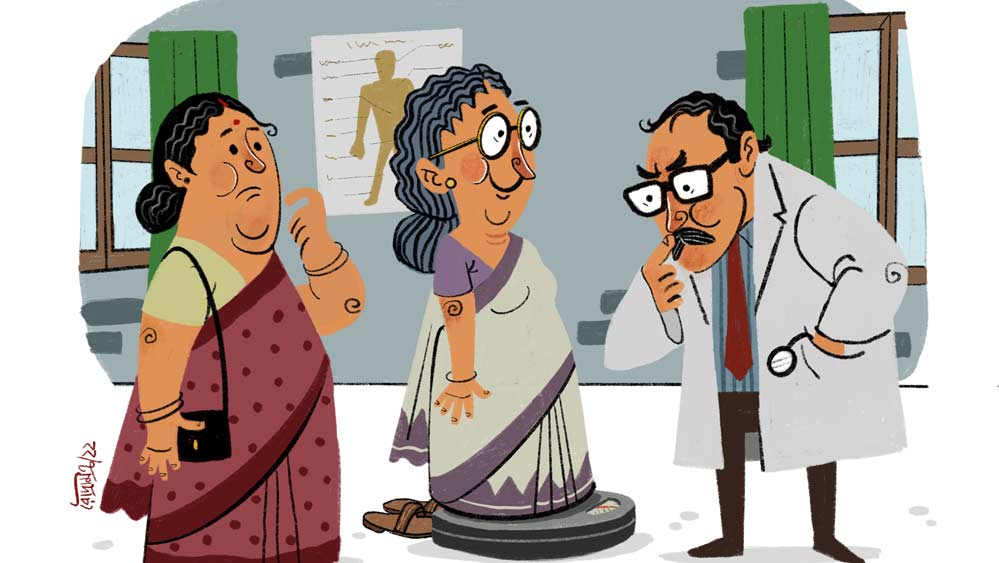

 
 <h1 align=center>পিসিমার স্বাস্থ্যোদ্ধার</h1>
<h2 align=center>কিঙ্কি চট্টোপাধ্যায়</h2> আমার পিসিমা শ্রীমতী রত্নমালা দেবী, পিতা রাসবিহারী চট্টোপাধ্যায়, সাকিন উত্তর কলকাতার রামধন মিত্র লেন, অত্যন্ত সম্ভাবনাময়ী এবং মহীয়সী রমণী ছিলেন। তাঁর গুণের অবধি ছিল না। এক মাথা কোঁকড়াচুল টুকটুকে ফর্সা মেয়েটির ঠোঁটদু’টি ছিল টুকটুকে লাল। এহেন সুন্দরীকে তাঁর বাবা, শ্যামবাজার এ ভি স্কুলের মাস্টারমশাই আট হাতি শাড়ি পরিয়ে সেলেটপেন্সিল-সহ ভর্তি করিয়ে দিলেন বেথুন স্কুলে। বাবাই তাঁকে দিয়ে আসতেন ও নিয়ে আসতেন। ক্লাস ফোর অবধি প্রতি ক্লাসে সে প্রথম হল। তখন ১৯২৬ কি ’২৭ সাল হবে। দেশে ইংরেজ সাহেবদের প্রবল প্রতাপ। স্কুলে নিয়ম হল, স্কুলে মেয়েদের জুতো পরে আসতে হবে। বাবা রাজি হলেন না। প্রকাশ্যে মেয়েরা জুতো পরে হাঁটবে? মামদোবাজি নাকি! কভি নেহি। তাকে স্কুল ছাড়িয়ে বাড়িতে এনে নিজেই পড়াতে শুরু করলেন।

তখনকার দিনে মেয়েদের সেলাইফোঁড়াই রান্নাবান্না হাতের কাজ না শিখলে চলত না। লেখাপড়ার সঙ্গে সঙ্গে সেগুলোও শেখা হতে লাগল। পিসিমার মন ছিল সরল সুন্দর মানবিক। বাড়িতে আসা ভিখারীদের বসিয়ে রেখে তিনি মন দিয়ে তাঁদের সুখদুঃখের কথা শুনতেন, সাধ্যমতো সাহায্যও করতেন।

মাত্র তেরো বছর বয়সে তাঁর বিয়ে হয়ে যায়।

বিয়ের পর শ্বশুরবাড়ি গিয়ে তিনি এমন সব কাণ্ড করতে লাগলেন যে, শ্বশুরবাড়ির লোকেরা বেশ বিরক্তই হল। এক দিন তাঁর উপর দায়িত্ব দেওয়া হল বাড়ির সব খবরের কাগজ বিক্রি করার। নতুন বৌকে দেওয়ার পক্ষে এর চেয়ে সোজা কাজ আর পাওয়া গেল না। পানুদাদা পুরনো ভাঙাচোরা জিনিস লোহালক্কড় খবরের কাগজ কিনত বাড়ি বাড়ি ঘুরে। একটা অদ্ভুত সুরে হাঁক পাড়ত “কাও-ও-ও-জ, পেপার, লোহা ভাঙা, টিন ভাঙা বিক্কিরি...” নতুন বৌ লালটুকটুকে ঘোমটা টেনে একটা টুল নিয়ে বসল কাগজ বিক্রি করতে। বিক্রি করতে করতে শুরু হল গল্প। পানুদাদার বাড়ির কথা এত আন্তরিকতার সঙ্গে জিজ্ঞেস করেনি কেউ কোনও দিন। জানা গেল, তার বাড়িতে ছ’বছরের ছোট মেয়ে সবে জ্বর থেকে উঠেছে। শরীর খুব দুর্বল। ক্ষমতা নেই তাকে মাছ-মাংস-দুধ-ডিম খাওয়ানোর। কাগজ বিক্রি করে হল সাকুল্যে আট টাকা চার আনা পয়সা।

পিসিমা বললেন, “এর পুরোটাই তোমাকে দিলুম, মেয়েকে দুধ ডিম কিনে খাইয়ো।”

পিসিমার খড়দহের শ্বশুরবাড়ির পিছনে ছিল খিড়কি পুকুর। দুপুরের দ্বিপ্রাহরিক ভোজনের পর পুকুরে বাসন ভেজাতে এসেছিলেন তিনি। তখনকার দিনে অনেকের বাড়িতেই একটা করে নিজস্ব পুকুর থাকত। এমন সময় শুনশান দুপুরে কাঁদতে কাঁদতে এলো ঠিকে-ঝি পদ্মর মা। আজ সে তাড়াতাড়ি এসেছে। কোলের ছেলেটার বড্ড জ্বর জলপটি দিয়েও কমছে না। বিকেলে ডাক্তারের কাছে নিয়ে যাবে। গিন্নিমার কাছে দশটা টাকা চাইতে তিনি সোজা বলে দিয়েছেন, গেরস্থের একটা আয়পয় আছে তো! ভাত খাওয়া সগড়ি কাপড়ে তিনি আলমারি খুলে টাকা দিতে পারবেন না, তার জন্যে সন্ধেবেলা আসতে হবে। শুনে পিসিমার চোখে জল এসে গেল। পুকুরের জলে ভেজানো ভরনের কাঁসার ভারী জামবাটিটা পদ্মর মাকে দিয়ে বললেন, “এইটে বাঁধা দিয়ে যা পাবি তাতে তোর ডাক্তার ওষুধ সব হয়ে যাবে।”

পদ্মর মা চেঁচিয়ে উঠে নাক মলে কান মলে বলে, “না না, এ আমি নিতে পারবনি বড়বৌ, আমার জন্যে শেষে তুমি কথা শুনবে?”

পিসিমা বিরক্ত হয়ে বললেন, “মেলা চেঁচাসনি তো, এই নিঝুম দুপুরে! শাশুড়ি মার ভাতঘুম ভাঙলে সব্বোনাশ হব। আমার কথা ভাবতে হবে না, সে আমি বুঝে নেব’খন। মাইনে পেয়ে বন্ধকি ছাড়িয়ে আমাকে চুপি চুপি এনে দিস। তাড়া নেই।”

জামবাটির খোঁজ পড়তে পিসিমা অম্লান বদনে বললেন, পুকুরের ঘাটে পা পিছলে জামবাটি জলে পড়ে গেছে। সময় করে ডুবসাঁতারে পরে তুলে আনলেই হবে।

ছেলেরা একটু বড় হলে ওঁরা শ্যামবাজার টাউন স্কুলের কাছে শিকদারবাগানে বাড়ি কিনে চলে আসেন। পিসেমশাইয়ের ধর্মতলার সরকারি আপিসে যাওয়ার সুবিধের জন্য। উনি বরাবর সাইকেলে করে আপিস যেতেন। পিসেমশাইয়ের সামান্য চাকরি কিন্তু পিসিমার নয় নয় করে পাঁচ ছেলে, সঙ্গে বিধবা মা। সবার স্বাস্থ্যের খেয়াল রাখতে গিয়ে নাভিশ্বাস। সকালে সব ছেলেরা স্কুল কলেজে বেরিয়ে গেলে তবে টিফিন খাওয়ার ফুরসত। নিজের জন্যে টিফিন তৈরি এক্কেবারে বিলাসিতা, তাই কোনও কোনও দিন গুড় আর আটা জল দিয়ে মেখে সিন্নি বা ছেলেদের পাতেই চাট্টি ডাল আর ডালমুট বা বাদামভাজা দিয়ে ভাত। তরকারি তোলা রইল আর সকলের জন্যে। অল্প আয়ে সংসার চালানো চাট্টিখানি কথা নয়।

পিসেমশাই চাকরির অবসরে অসাধারণ ছবি আঁকতেন। সংসারের কোনও কিছুতে মাথা ঘামাতেন না। কর্তার হার্টের ব্যামো, তার ওষুধ আছে। মায়ের সন্ধেবেলায় একটু আফিম খাওয়ার অভ্যেস। তাঁকে একটু দুধ দিতে হয়।

এক দিন এল জনার্দন ধোপা। সে সপ্তাহে সপ্তাহে গাঁটরি বেঁধে বাড়ির ছাড়া জামাকাপড় কাচতে নিয়ে যায়। ছটপুজোয় এ বার সে দেশে যাবে। দেশে তার বাচ্চাদের জন্যে কিছু নতুন জামাকাপড় কিনে নিয়ে যেতে হবে তাকে কিন্তু টাকার টানাটানি। কিছু উধার পেলে ভাল হয়। জনার্দনের দুঃখের কথা শুনে পিসিমার হৃদয় টনটন করে উঠল। আহা! বচ্ছরকার দিনে বাচ্চাগুলো নতুন জামা পরে আনন্দ করতে পারবে না? কিন্তু হাতে তো নগদ টাকা নেই! জমানো যা টাকা ছিল তা সেজ ছেলেকে ল’ কলেজে ভর্তি করতে খরচ হয়ে গিয়েছে। নজর পড়ল হাতের চুনির আংটিতে। কিন্তু এটা তো বাবার দেওয়া চিহ্ন! তিনি তাঁর একমাত্র রুণুমা-কে শখ করে গড়িয়ে দিয়েছিলেন। তা হলে?

পিসিমা সরলমনে সব লোককে বিশ্বাস করতেন। সরলমনে সেই আংটিটি জনার্দনকে দেওয়া হল এই কড়ারে যে, এক বছরের মধ্যে তা ফেরত দিতে হবে, এবং কেউ যেন তা না জানে। দিন যায় মাস যায় বছর যায়, জনার্দন আর আসে না। কেউ আংটির কথা জিজ্ঞেস করলেই পিসিমা বলেন, “কাজেকম্মের হাত, কোথায় পড়ে যায়, কি নষ্ট হয়ে যায়, তাই খুলে রেখেছি। বাবার ভালবাসার চিহ্ন তো!”

এক দিন বড় ছেলে আর তার মাকে চেপে ধরায় সব খোলসা হল। টেনেহিঁচড়ে খুঁজে বাড়িতে আনা হল সেই ব্যাটা জনার্দনকে। সে এক নাটক! তাকে সত্যি-মিথ্যে মিশিয়ে বেদম ভয় দেখানো হল। এই নাটকের সাক্ষী ছিলুম আমি। তখন ক্লাস ফাইভ। মায়ের সঙ্গে বেড়াতে গিয়েছিলুম পিসিমার বাড়ি। প্রায় পাঁচ বছর পর, জনার্দনের ঘাড় ধরে সেই সোনার আংটি আদায় হল। কিন্তু আসল চুনির বদলে সেখানে ছিল ঝুটা পাথর!

 এক দিন পিসিমা মাথা ঘুরে পড়ে গেলেন রান্নাঘরে। বাড়িতে ডাক্তার আনা হল। দেখা গেল, ব্লাড প্রেশার খুব কম। সঙ্গে মারাত্মক রক্তাল্পতা। সেই লাল টুকটুকে ঠোঁট একেবারে ফ্যাকাশে। নাড়ির গতিও খুব ধীর। এ হল নিজের প্রতি ধারাবাহিক অযত্নের ফল। বাড়িতে কান্নাকাটি পড়ে গেল। ডাক্তার নিদান দিলেন, রোজ অন্তত হাফ লিটার দুধ, একটি করে মুরগির ডিমসেদ্ধ, আপেল বেদানা, টেংরির জুস ইত্যাদি খেতে হবে। এক মাসে কম করে দু’কিলো ওজন বাড়াতেই হবে, না হলে অসুখ সারা মুশকিল। খসখস করে লিখে দিলেন পরের মাসে তাঁর চেম্বারে চেকআপে যাওয়ার দিন। রাশভারী ডাক্তার তার বেশি কোনও কথা বললেন না।

পিসিমা পড়লেন বেজায় ফাঁপরে। গোঁসাই বাড়ির বৌ, তিনি কি না খাবেন মুরগির ডিম? টেংরির জুস? রাধাগোবিন্দ! বাড়িতে নিত্যদিন কৃষ্ণের পুজো, ফি-বছর শ্যামসুন্দরের মন্দিরে পুজোর পালা পড়ে। এখন কী করা যায়? হপ্তাখানেক শরীর আর খাওয়াদাওয়া নিয়ে নজরদারি করার পর করার পর পিসিমা আবার যে কে সেই। সংসারের মায়া বড় বিষম বস্তু। এক মাস যায়, দু’মাস যায়, তিন মাস যায়— তিনি আর ডাক্তারখানায় যাওয়ার নাম করেন না। তার পর এক দিন বললেন মেজ ছেলেকে, “আচ্ছা, মরে গেলে আমার এই শরীরটা আগুনে পুড়িয়ে নষ্ট না করে পবিত্র মা গঙ্গার বুকে ফেলে দিলে কেমন
হয়? মাছেরা কেমন ঠুকরে ঠুকরে খাবে! ওদের পেট ভরবে! পুড়িয়ে দিলে তো এ দেহ কাজেই লাগল না, নষ্ট হয়ে গেল।”

ভাবলে অবাক লাগে। কারণ তখন দেহদান কিংবা অঙ্গদানের কথা এত আলোচিত বা প্রচলিত ছিল না, কিন্তু অল্পশিক্ষিত এক জন সাধারণ গৃহবধূ এই কথা ভেবেছিলেন। কিন্তু মৃত্যুর কথা শুনে দাদারা বেজায় ভয় পেয়ে গেল।

দাদারা এসে পড়ল আমার মায়ের কাছে, “মামিমা, তুমি যদি বুঝিয়ে মাকে রাজি করাতে পারো ডাক্তারের কাছে যেতে!”

এক দিন মা জবরদস্তি পিসিমাকে ডাক্তারখানায় নিয়ে গেল। পাটভাঙা কড়া মাড় দেওয়া কস্তাপাড় তাঁতের শাড়ি আর সোনালি ফ্রেমের চশমা পরা ফর্সা টুকটুকে ছোটখাটো কোঁকড়াচুলো পিসিমাকে একেবারে বিদেশি পুতুলের মতো দেখাচ্ছিল। শুধু মায়ের খটকা লাগছিল, দিদির চেহারা তেমন না ফিরলেও পেটটা অমন মোটা কেন? এ কি চোখের ভুল? না মাড় দেওয়া শাড়ি ফুলে আছে বলে ও রকম মনে হচ্ছে?

যাই হোক, ডাক্তার ভাল করে দেখলেন। নাহ! ব্লাড পেশার একটু কমের দিকেই, নাড়ির গতিও তেমন চনমনে নয়। চোখের পাতা টেনে দেখে মুখটা ব্যাজার করলেন, আর আরও ক’টি ভিটামিন ও পুষ্টিবর্ধক ওষুধ লিখে দিলেন। ওজন না বাড়লে ডাক্তার আর দেখবেন না। রোগীকে ওজনযন্ত্রের ওপর উঠতে বলা হল। মায়ের বুক দুরুদুরু কিন্তু পিসিমা সপ্রতিভ ভাবে গটগট করে চটি খুলে ওজনযন্ত্রের ওপর দাঁড়ালেন। ডাক্তার চশমাটি নাকের ওপরে একটি আঙুল দিয়ে তুলে দিয়ে তীক্ষ দৃষ্টিতে কাঁটার দিকে তাকিয়ে রইলেন। মায়ের নিঃশ্বাস বন্ধ, নিজের বুকের ধুকপুকও শুনতে পারছে। পিসিমা তখন নির্বিকার মুখে আত্মবিশ্বাসের সঙ্গে মাথা উঁচু করে দাঁড়িয়ে। কিছু ক্ষণ গভীর নিস্তব্ধতা।

ভাল করে দেখে শুনে ডাক্তার বললেন, “এ বার নেমে আসুন মা। আপনার ওজন দু’কিলো বেড়েছে। ভালই উন্নতি। এ ভাবেই খাওয়া দাওয়া করে যাবেন।” ওজন বেড়েছে দেখে ডাক্তারের কঠিন মুখে সামান্য প্রসন্নতা খেলা করে গেল, তিনি বললেন, “আবার পরের মাসে আসবেন। নিজের যত্ন নেবেন। নিজে সুস্থ না থাকলে সংসারের সবাইকে সুস্থ রাখবেন কী করে? বাঙালি মায়েরা এগুলো একেবারেই বুঝতে চায় না...”

হাতে টানা রিকশায় ননদ-ভাজে গল্প করতে করতে বাড়ি ফেরা হল। মায়েরা তখন থাকতেন কাছেই অক্রূর দত্ত লেনে।

মা আগেই চলে যেতে চাইছিলেন, কিন্তু পিসিমা আটকালেন। বললেন, “দাঁড়া একটু চা খেয়ে যা। আমি স্টোভ জ্বালিয়ে চটপট করে দিচ্ছি।
তার আগে এই খড়খড়ে কাপড়টা ছেড়ে আসি।”

রাস্তার শাড়ি জামা ছেড়ে বাড়ির কাপড় করে পিসিমা মাকে শোবার ঘরে ডাকলেন, “বৈঠকখানা নয়, আয় শোবার ঘরে বসে চা খাই।”

শোবার ঘরে ঢুকে মায়ের চোখ ছানাবড়া। শোবার ঘরের টেবিলের ওপর হামানদিস্তার ডান্ডা আর বাটনাবাটা নোড়াটা।

“দিদি, এগুলো এখানে এই টেবিলের ওপর কেন?”

“এই হামানদিস্তের ডান্ডা আর নোড়াটা দড়ি দিয়ে পেটে বেঁধে নিয়ে গেসলুম। নইলে দু’কিলো ওজন বাড়বে কী করে?”

“আরে, ডাক্তার যদি তোমার পেটে হাত দিত?”

“উত্তর কলকাতার বনেদি বাড়ির বৌ আমি, ডাক্তার পেটে হাত দিলেই হল? ওর কি প্রাণের ভয় নেই? আমি তাই নিশ্চিন্ত ছিলুম!”

মা জিজ্ঞেস করল, “কিন্তু ওজন নেওয়ার সময় তুমি যে রকম বীরদর্পে ওজনযন্ত্রের ওপর টপ করে উঠে পড়লে, তখন যদি পেট থেকে ওগুলো খসে পড়ত, কী লজ্জার যে হত! আমি তো ভাবতেও পারছি না।”

পিসিমা অমনি তোরঙ্গ থেকে একটা লম্বাটে পাশবালিশের ঢাকনার মতো কাপড় বের করলেন যেটা পরিপাটি হাতে রানস্টিচ দিয়ে মোড়া আর তার ভিতরটা ফাঁকা। দু’পাশে দুটি সায়ার দড়ি। অর্থাৎ ওর ভিতরে যা কিছু ভরে পেটকোঁচড়ে বেঁধে নেওয়া যাবে, খুলবে না। মায়ের মুখে রা-টি নেই, কী সব্বোনেশে কাণ্ড!

পিসিমার সতর্কবাণী, “যা দেখলি দেখলি, খবরদার! এই কথা আমার মা, ছেলেরা বা তোর দাদাবাবুর
কানে যেন না ওঠে!”

কিন্তু হা হতোস্মি!

বলাই বাহুল্য এই কথাটি ঝড়ের বেগে চারিদিকে ছুটিয়া বেড়াইতে লাগিল এবং এই প্রথম আমার মা তার অকপট সত্যকথনের জন্য দিকে দিকে প্রশংসিত হইতে লাগিলেন।

ছোটবেলায় পিসিমার জিনিসপত্র হারিয়ে ফেলা এবং এই ধরনের গল্পগুলোয় খুব মজা পেতাম। আজ দীর্ঘ কয়েক দশক পেরিয়ে এসে যখন টাকার উল্টো পিঠটাও দেখতে শিখেছি, তখন বুঝতে পেরেছি— আমার পিসিমা বড় সাধারণ মানুষ ছিলেন না। নিজের লোকই হোক
বা বাইরের, তার জন্য কিছু করতে তাঁকে কখনও দু’বার ভাবতে হয়নি। কিন্তু নিজের ওজন বাড়াতে তাঁর ভরসা ছিল সেই নোড়া কিংবা হামানদিস্তার ডান্ডা।

পিসিমার কথা মনে পড়লে আজ আর মজা হয় না, কষ্ট হয়।