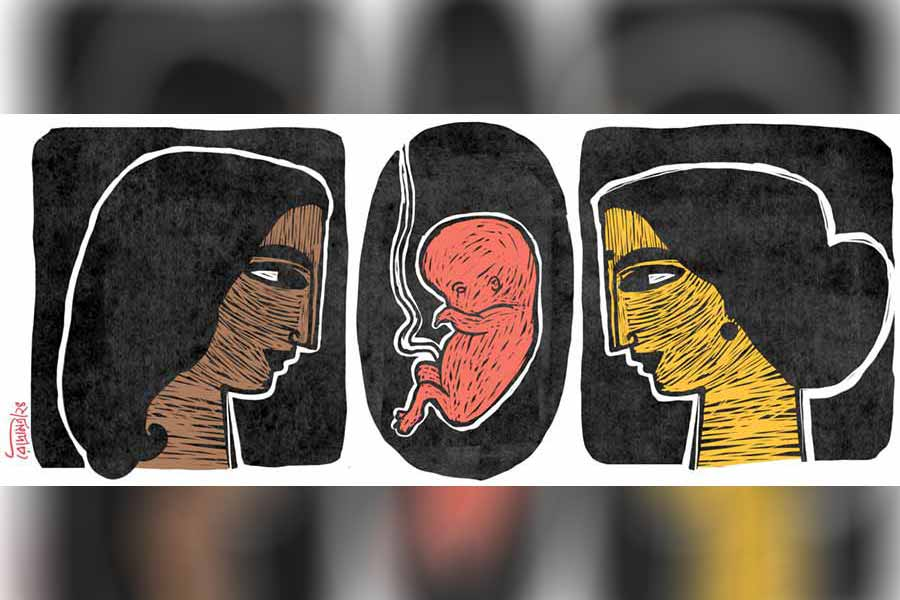

 
 <h1 align=center>প্রক্সি</h1>
<h2 align=center>ছন্দা বিশ্বাস</h2> 

বেরিয়ে পড়লাম বাতাসপুরের উদ্দেশ্যে। মনে অনেক দ্বিধা, অনেক দ্বন্দ্ব, তবু উপায় ছিল না।

অনেক কষ্টে খোঁজখবর করে একটা ঠিকানা জোগাড় করেছি ধৃতির। ধৃতি আমার ছোটবেলার ইশকুলের বান্ধবী। ওর সঙ্গে আমার পরিচয় হাই স্কুলে আসার পরে। ক্লাস ফাইভের বি সেকশনে আমি আর ধৃতি রোজ সেকেন্ড বেঞ্চের দেওয়ালের দিকে পাশাপাশি বসতাম। আস্তে আস্তে সেটাই আমাদের স্থায়ী জায়গা হয়ে গেল। ধৃতির গায়ের রং কালো ছিল, কিন্তু ওর চোখ দুটোতে ছিল গভীর মায়া। ঘন আঁখিপল্লবে ঢাকা চোখ দুটোর দিকে তাকালে মনে হত শান্ত ছায়াঘন এক দিঘি।

খুব আস্তে আস্তে কথা বলত ধৃতি। আমি যতটা ছটফটে, ও ততটাই ধীরস্থির। কী ভাবে যে অসম চরিত্রের দু’জনের এমন বন্ধুত্ব গড়ে উঠল, স্বয়ং ঈশ্বরই জানেন। টিফিনে একটাই আইসক্রিম কিংবা আলুকাবলি ভাগ করে খাওয়া শুধু নয়, কখনও-সখনও স্কুল কামাই করলে রোলকলের সময়ে ও আমার হয়ে প্রক্সি দিত। সকলের চোখ বাঁচিয়ে, যথেষ্ট ঝুঁকি নিয়ে।

আমাদের মফস্সল শহরটার গায়ে তখন একটু একটু করে আধুনিকতার ছোঁয়াচ লাগছে। তা সত্ত্বেও সে সময়ে লুকিয়ে প্রেম করা ছিল চরম অপরাধ। প্রেমের পথে তখন নানা বাধা। জাতপাত, বিত্ত, স্টেটাস কত রকমের বাধা যে পেরোতে হত, তার হিসেব নেই।

আমি তখন ক্লাস নাইন। সেই মধ্যযুগীয় আবহাওয়ার ভিতরে হঠাৎ খবরের শিরোনামে উঠে এলাম আমি, সবাই জানল গাঙ্গুলিবাড়ির ছেলে বাঁধনের সঙ্গে সাহাবাড়ির মেয়ে রতির, অর্থাৎ আমার, প্রেম চলছে। সেই সংক্রান্ত আলোচনা ছড়িয়ে পড়ল প্রায় সমস্ত চেনাজানা মহলেই। ছোট জায়গা, আলোচনার মুখ অনেক, কিন্তু উপযুক্ত রসালো খবরের সংখ্যা তুলনায় কম, ফলে যা হয়!

আমাদের প্রতিবেশী রুমাকাকিমা মায়ের কাছে বলে দিলেন ব্রিজের নীচে আমাদের দু’জনকে দাঁড়িয়ে কথা বলতে দেখেছেন।

মা প্রশ্ন করলেন, “ছেলেটা কে?”

মায়ের কপালে ভাঁজ স্পষ্ট হচ্ছে দেখে কাকিমা ব্যাখ্যা করতে আরম্ভ করলেন, “আরে চিনতে পারছ না, ওই যে ভাল ফুটবল খেলে, গেল বার আমাদের ক্লাবের হয়ে খেলে শিল্ড নিয়ে এল বারাসাত সম্মিলনী ক্লাব থেকে, ওই যে গো, যাদের বাড়িতে প্রথম টিভি এসেছে, মহাভারত দেখার জন্যে বাড়ির উঠোনে লোকের ঢল নামত, আকাশবাণীতে গান গায় শিল্পী রুমেলা গাঙ্গুলি... সেই ওদের বাড়ির ছেলে বাঁধন।”

প্রতিবেশী রুমাকাকিমা তাঁর কাজ সেরে চলে গেলেন। মা অপেক্ষা করতে লাগলেন আমার টিউশনি থেকে আর বাবার অফিস থেকে ফেরার জন্য। মেঘের পরে মেঘ জমেছে বুঝতে পারিনি সে দিন। আমার বাড়ি থেকে কঠোর অনুশাসনের খাঁড়া নেমে এল।

আমাকে সরাসরি কেউ কিছু বলল না। মা আর বাবার রুদ্ধদ্বার বৈঠকের শেষে আমার অজান্তেই নানা ব্যবস্থা গৃহীত হল।

এর পরে বাড়িতেই গৃহশিক্ষক রাখা হল। স্কুলে মায়ের সঙ্গে যাই আর আসি। বাড়িতে এমন ভাব করে থাকি, যেন সব চুকেবুকে গেছে।

কিন্তু যে নদী এক বার সাগরের ডাক পেয়েছে, তাকে ঠেকিয়ে রাখে কার সাধ্য। নদীর স্রোত বহু পাথরের বাধাবিঘ্ন এড়িয়ে বইতে শুরু করল।

এমন একটা পরিস্থিতিতে ধৃতি আমার হয়ে বড়াইবুড়ির কাজ করত। চিঠিপত্রের আদানপ্রদান থেকে শুরু করে বাঁধনের সঙ্গে দেখা করা, ওর কাছ থেকে কিছু জিনিস নেওয়া বা পৌঁছে দেওয়া ইত্যাদি।

আমি মায়ের সঙ্গে স্কুল থেকে রিকশায় বাড়ি ফিরছি, দেখি বাঁধন রাস্তার এক পাশে দঁড়িয়ে ধৃতির সঙ্গে সাবলীল ভঙ্গিতে কথা বলছে।

মা মুখ বেঁকিয়ে সটান বলে দিল, “নিজের চোখে দেখ এই সব ছেলেদের চরিত্র! আজ তোকে, তো কাল অন্য মেয়েকে প্রস্তাব দিচ্ছে! যত সব লক্ষ্মীছাড়ার দল!”

আমি যে ধৃতির হাতে দীর্ঘ চিঠি লিখে পাঠিয়েছি, সেটা মায়ের জানার কথা নয়। আজ দেখা করার কথা ছিল, পারলাম না।

সেই কারণে ধৃতি আজ আমার হয়ে প্রক্সি দিচ্ছে।

ধৃতির সফল দৌত্যের ফলস্বরূপ আমি চিরজীবনের জন্যে বাঁধনের বাহুডোরে বাঁধা পড়লাম। আমি তখন সবে কলেজে বিএ ক্লাসে ভর্তি হয়েছি, বাঁধন ব্যাঙ্কিং সার্ভিস কমিশন এগজ়াম ক্র্যাক করেছে। বাড়ির লোক আর তেমন সমস্যা করল না, যখন বুঝতে পারল যে অনেক চেষ্টা সত্ত্বেও নদীস্রোতে বাঁধ দেওয়া সম্ভব হয়নি।

কিছু দিনের ভিতরে ওর পোস্টিং হল আলতাগঞ্জে। বিয়ের পর সেখানেই আমরা সংসার পাতলাম। কেটে গেল পাঁচটা বছর। বাঁধন দেখলাম, একটা বাচ্চার জন্য বড্ড উতলা হয়ে পড়েছে।

আমাদের জীবনের সুখের চাবি হারিয়ে গেল সে দিন, যে দিন শুনলাম আমি আর কখনও মা হতে পারব না। ডাক্তারের চেম্বার থেকে টলোমলো পায়ে বেরিয়ে এলাম। বর্ষার কিউমুলোনিম্বাস মেঘে ঢেকে গেল আমার আকাশ।

এর পরে আরও চার-পাঁচটা বছর লোকে যে যা বলেছে, তাই করেছি। কিন্তু কাজের কাজ কিছুই হল না। আমার যখন পাগলপারা অবস্থা, এমন সময়ে এক দিন গঙ্গার ঘাটে এসে বসেছি আমি আর বাঁধন। মরুঝড়ে যখন বিপর্যস্ত, বাঁধন বলল, “আজ ডা. মাইতির চেম্বারে গিয়েছিলাম, উনি খুঁটিয়ে খুঁটিয়ে সমস্ত রিপোর্ট দেখে জিজ্ঞেস করলেন, আমাদের সারোগেসিতে আপত্তি আছে কি না।”

আজকাল সারোগেসির মাধ্যমে বহু দম্পতি সন্তানের মুখ দেখছেন।

শান্ত নিরিবিলি গঙ্গার ঘাট। আশপাশে তেমন কেউই নেই এই পৌষের সন্ধ্যায়। তার উপরে আজ ভরা পূর্ণিমা। গর্ভবতী নারীর মতো সুডৌল গঙ্গা। পূর্ণ নদীটা যেন আমার নিঃস্বতা আরও গভীর ভাবে চোখে আঙুল দিয়ে দেখাতে লাগল।

নিরুপায় আমি প্রবল বেগে বৃষ্টি হয়ে ঝরে পড়তে পড়তে বললাম, “আমি রাজি।”

গর্ভ ভাড়া নেওয়ার জন্যে এ বারে উপযুক্ত মহিলার খোঁজ শুরু হল। অনেকের সঙ্গে ইন্টারভিউ হল। কাউকেই আমার পছন্দ হচ্ছে না। বাঁধন বুঝতে পারছে আমার ভিতরে মানসিক সমস্যা চলছে। সেটা স্বাভাবিক ধরে নিয়ে ও আমার উপরেই এই দায়িত্বটা ছেড়ে দিল।

জীবনের এই চরম সন্ধিক্ষণে আজ আবার ধৃতির কথা মনে পড়ে গেল। বিয়ের পর থেকে তো আর ওর সঙ্গে যোগাযোগ রাখা হয়নি!

এমনই একটা সময়ে খবরের কাগজে বাতাসপুরের খবরটা পড়লাম। খবরের কাগজে ফোন করে বিস্তর অনুরোধ করে ঠিকানাটুকু জোগাড় হল। সেইটুকু সম্বল করে এক দিন বেরিয়ে পড়লাম।

ধূসর রঙের এসইউভি ছুটে চলল মহানন্দা অভয়ারণ্য, সেবক বাজার, কালীবাড়ি, করোনেশন ব্রিজ ছাড়িয়ে কালিম্পং-এর দিকে। ঘুরে ঘুরে ক্রমশ উপরের দিকে উঠছি। মাইলের পর মাইল জনহীন অঞ্চল পেরিয়ে অবশেষে বাতাসপুরে পা রাখলাম। পাহাড়চুড়োয় উঠে আবার কিছুটা নীচের দিকে নামতে হল। একটা ছোট্ট জনবসতি। মূলত আদিবাসী মানুষের বাস। পথের পাশে পাইন গাছে ঘেরা ছোট্ট একটা কাঠের বাড়ি। গেটের ঠিক সামনে দু’টি লম্বা কাঠের উপরে টিনের রংচটা একটা সাইন বোর্ড। আশ্রমের নামটা পড়তে পারলাম না। আমাকে দেখে এক জন মহিলা এগিয়ে এলেন। এই আশ্রম আর ধৃতির নাম ও ছবি খবরের কাগজে দেখেই এখানে আসা।

ধৃতি আমাকে দেখে ছুটে এসে জড়িয়ে ধরল।

আশ্রমের ব্যালকনিতে বসে কত জমানো কথা উপচে পড়ছে তখন। প্রায় বারো বছর বাদে দু’জনের সাক্ষাত হল। ধৃতির মুখে শুনলাম, বিএ পাশ করার পরে ওর বিয়ে হয়েছিল বাড়ি থেকে সম্বন্ধ করে। পাত্র বেনারসের প্রবাসী বাঙালি, রেলে চাকরি করে। বিয়ের দু’মাস বাদে এক দিন জানতে পারল ছেলেটি লিউকোমিয়ার পেশেন্ট। কোনও এক জন জ্যোতিষী বলেছিলেন, বিয়ের পরে এ রোগ ভাল হয়ে যাবে। তাই রোগ গোপন করে এই বিয়ে। তিন মাসের মাথায় ছেলেটি মারা যায়। রেলে চাকরিটা পেলেও ও করেনি। সব ছেড়ে দিয়ে এক দিন ঘুরতে ঘুরতে এই জায়গায় থিতু হয়েছে।

ধৃতি বলল, এই সব শিশুদের নিয়ে ও বেশ আছে।

এ কথা-সে কথার পরে আসল কথাটা বলে ফেললাম।

ধৃতি কঠিন দৃষ্টিতে আমার মুখের দিকে তাকিয়ে বলল, “হঠাৎ আমাকেই বেছে নিলি কেন? আমি কি সারা জীবন, সব জায়গায় তোর হয়ে প্রক্সি দিয়েই যাব?”

আমি ধৃতির হাত দুটো ধরে বললাম, “আজ আমি তোর কাছে ভিক্ষে চাইতে এসেছি ধৃতি। আমাকে তুই ফিরিয়ে দিস না। তুই তো ধরিত্রীমা, পারবি না আমাদের বীজ তোর গর্ভে ধারণ করতে, জল-মাটি-বাতাস দিয়ে তাকে পৃথিবীর আলো দেখাতে? আমি চাই তোর মতো সুন্দর একটা সন্তান। আমাকে ফিরিয়ে দিস না ধৃতি। মাত্র তো একটা বছর...”

অনেকটা সময় কেটে গেল নীরবে। এক সময়ে কিছু না বলে ধৃতি উঠে গেল।

আমি বুঝতে পারলাম, খুব কঠিন পরীক্ষা আমাদের সামনে। আমার চেয়ে ধৃতির পরীক্ষা অনেক বেশি কঠিন। বেশ কিছু সময় পর দেখি ধৃতি ধীর পায়ে আমার কাছে এসে আমার কাঁধে একটা হাত রাখল। আমি শ্রাবণের ধারার মতো আছড়ে পড়লাম ওর বুকে।

তার পর ধৃতিকে নিয়ে আমরা ফিরে এলাম কলকাতায়।

ইনফার্টিলিটি সেন্টারে নিয়ে গেলাম ওকে। সঙ্গে বাঁধনও ছিল।

সব ঠিকমতোই হল। বছর খানেকের মাথায় আমাদের একটা ফুটফুটে কন্যাসন্তান হল। নাম রাখা হল মাহিরা।

বাঁধন খুব খুশি। কয়েক মাস পর মেয়ের মুখেভাত হলে ধৃতি বলল, “এ বারে আমাকে ছেড়ে দে...” বলতে গিয়ে ওর ঠোঁট কেঁপে উঠল। ছুটে চলে গেল ওয়াশরুমে।

যাওয়ার আগের দিন সন্ধ্যায় আমি ধৃতির জন্য কিছু জিনিসপত্র কিনতে শপিং মলে গেছিলাম। এসে দেখি ছোট্ট মাহিরাকে জড়িয়ে ধরে কাঁদছে। আমি এই ভয়টাই পাচ্ছিলাম। খুব বেশি দিন হয়ে গেলে আরও বেশি মায়ার বাঁধনে জড়িয়ে যাবে বুঝতে পারছি। আমার ভিতরেও একটা ঝড় চলছে। ভয় হচ্ছে, এর পরে আরও খারাপ কিছু না ঘটে যায় আমার আর বাঁধনের জীবনে।

ধৃতিকে আজকাল আর খুব বেশি সময় মাহিরাকে কোলে নিতে দিই না। ব্রেস্টফিডিং কমিয়ে দেওয়া হয়েছে ইচ্ছে করেই। কারণ এর পরে ওকে তো বাইরের খাবার খেতে হবে।

কিন্তু ধৃতি দেখি সুযোগ পেলে মাহিরাকে কোলে নিয়ে ব্রেস্টফিড করাচ্ছে। মাহিরা ওর নরম হাত দিয়ে ধৃতির বুক আর মুখ ছুঁয়ে ছুঁয়ে খেলা করে। তখন ধৃতির চোখেমুখে অপার্থিব বিভা ছড়িয়ে পড়ে। সেই দৃশ্য দেখে আমার ভিতরে দারুণ জ্বালা শুরু হয়। আমি ওর কোল থেকে জোর করে মাহিরাকে টেনে নিয়ে আসি। মাহিরা ঠোঁট ফুলিয়ে কাঁদে। চিৎকার করে। ধৃতিও।

“কী করছিস তুই রতি? ওর খিদে পেয়েছে, দে আমার কাছে।”

“ও খাবে”, “ও এখন ঘুমোবে” ধৃতির মুখে এই সব কথা শুনলে আমার গা জ্বালা করে।

এমনই এক দিন, মাহিরার কান্না শুনে বাঁধন পাশের ঘর থেকেছুটে এল।

ধৃতির দিকে চোখ পড়ে গেল বাঁধনের। ও সেই সময়ে হাউসকোটের ফিতে লাগাচ্ছিল। ওর বুকের কাছটা দুধে ভিজে যাচ্ছে। বাঁধন সে দিকে তাকিয়ে চোখ সরিয়ে নিল। আমার মাথার ভিতরে আগুন জ্বলছে সেই দৃশ্য দেখে। আমি বন্ধ্যা, তাই আমার স্তনও বন্ধ্যা। কোনও দিন জানতেই পারলাম না মাতৃত্বের স্বাদ কেমন।

মাহিরা চুপ করছে না দেখে ধৃতির সে কী কাতর অভিব্যক্তি, “দে না রে এক বার...”

আমি বললাম, “ধৃতি, এ বারে তোর চলে যাওয়া দরকার বুঝতে পারছি। আমাদের সম্পর্ক ভাল থাকতে থাকতে তুই চলে যা।”

প্রতিবাদ করে ধৃতি, “আমি এখন কিছুতেই যাব না। আরও কিছু দিন আমায় এখানে থাকতে হবে মাহিরার জন্য। আমাকে না পেলে ও খুব কান্নাকাটি করবে, তুই থামাতেপারবি না।”

ধৃতি দৃঢ় স্বরে জানিয়ে দিল ওর সিদ্ধান্ত। তবুও আমি চুপ করে আছি দেখে বাঁধন এসে বলল, “থাকুক না আরও কিছু দিন। বুঝতেই পারছ, মাহিরাকে ছেড়ে চলে যেতে মন চাইছে না। হাজার হোক, মা তো...”

বাঁধনের কথায় আমার ধৈর্যের বাঁধ ভেঙে গেল। আমি সমস্ত কৃতজ্ঞতা ভুলে ধৃতিকে বললাম, “দেখ, আমি শুধু তোর গর্ভ ভাড়া নিতে চেয়েছিলাম। বিনামূল্যে নয়, রীতিমতো টাকা দিয়ে নিয়েছি। তোর আশ্রমের নামে পাঁচ লাখ টাকা পাঠিয়ে দিয়েছে বাঁধন, দেখে নিস।”

হতবাক দৃষ্টিতে তাকিয়ে ছিল ধৃতি, “টাকার বিনিময়ে আমি এ কাজ করলাম! তুই এ কথা বলতে পারলি?” কান্না ভুলে বিস্ফারিত চোখে ও আমার দিকে তাকিয়ে থাকল বেশ কিছু ক্ষণ।

আমি নিজের ভুল বুঝতে পেরে কী করব ভেবে না পেয়ে ঘর থেকে নিঃশব্দে বেরিয়ে এলাম।

আমার বাদলদিনের গল্প কিন্তু এখানেই শেষ হয়নি। এর পরে আরও দশ বছর কেটে গেছে। মাহিরা এখন ক্লাস ফাইভে পড়ছে কলকাতার একটা নামী স্কুলে।

কিছু দিন বাদে আমাদের জীবনে আবার একটা ঝড় উঠল। সুনামি আছড়ে পড়ল, সংসার-তট ক্ষতবিক্ষত। মারণ রোগ তলে তলে বাসা বেঁধেছে আমার শরীরে, একটুও টের পাইনি এত দিন।

সে দিন ব্যালকনিতে দাঁড়িয়ে আছি। বাঁধন তখনও ফেরেনি। কয়েক দিন বাদেই দীপাবলি। সমস্ত শহর সেজে উঠেছে আলোকমালায়। শুধু আমার ভিতরে জমাট বেঁধে আছে গাঢ় অন্ধকার। আর মাত্র কয়েক মাসহাতে আছে আমার। তার পরে এই পৃথিবীর রূপ রস বর্ণ গন্ধ ফেলে চলে যেতে হবে।

ভাবছি, আমি তো চলে যাব, কিন্তু মাহিরার কী হবে?

কে দেখবে ওকে? আমি মারা গেলে বাঁধন যদি আর কাউকে ঘরে নিয়ে আসে মাহিরাকে দেখাশোনার জন্য, সে কি মাহিরাকে যত্নে রাখবে?

সংশয়ের মেঘ ঘনীভূত হচ্ছে ক্রমে। মাহিরার কথা ভাবতেই প্রবল একটা ঢেউ আছড়ে পড়ল পায়ের উপরে। চলে যেতে যেতে বলে গেল, মায়ের মতো আর কেউ পারে না রে।

মুহূর্তে আমার ধৃতির কথা মনে এল। সত্যি তো! ধৃতির মতো আর কেউ পারবে না মাহিরাকে ভালবাসতে! পারার কথাও নয়! এক বার চেষ্টা করে দেখব? কী ভাবে প্রস্তাবটা রাখব, বুঝতে পারছি না। ধৃতি কি এখনও বাতাসপুরেই আছে? সেটাও তো জানা নেই। আমার কথায় আঘাত পেয়ে সেই যে ও চলে গেল, তার পর তো আর ওর খোঁজ রাখা হয়নি! ও-ও আর যোগাযোগ করেনি!

কাল সারা রাত দু’চোখের পাতা এক করতে পারিনি। ভোরের দিকে একটু তন্দ্রামতো এসেছিল। স্বপ্নে দেখলাম একটা উত্তাল নদীর পাড়ে আমি আর ধৃতি দাঁড়িয়ে আছি।

আমি ধৃতির হাত ধরে বললাম, “শেষ বারের মতো আমার হয়ে প্রক্সি দিতে পারবি না?”

ধৃতি শান্ত চোখে আমার দিকে তাকাল। কিন্তু ও কিছু বলার আগেই প্রচণ্ড শব্দে নদীর পাড় ভেঙে পড়ল জলে, সেই সঙ্গে যেন চোখের পলকে তলিয়ে গেল ধৃতিও।

আমি চিৎকার করে উঠলাম, “ফিরে আয় ধৃতি, হারিয়ে যাস না, শুধু এ বারের মতো, এই শেষ বার...”

