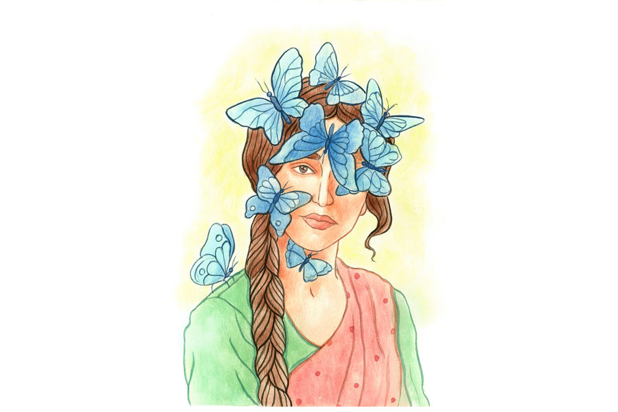

 
 <h1 align=center>প্রজাপতি ডট কম</h1>
<h2 align=center>প্রিয়ঙ্কর চক্রবর্তী</h2> এই যে শুনুন, আপনিই কি সন্দীপনবাবু?” 

“হ্যাঁ, স্যান্ডি। দাঁড়ান, দাঁড়ান… আপনি নিশ্চয়ই স্মিতা!”

“শুচিস্মিতা।”

“হ্যাঁ হ্যাঁ, ওই। প্লিজ় টেক ইয়োর সিট। আজকাল এত বড় নাম তো চলে না, তাই... অবশ্য আপনাকে দেখে ততটা আজকালকার বলে মনে হচ্ছে না! এমন লম্বা বিনুনি, মোটা ফ্রেমের চশমা, তাঁতের শাড়ি— এ সব তো আজকাল দেখাই যায় না।”

“আপনার বোধহয় এ রকমটা খুব একটা পছন্দ নয়, তাই না!” 

“না না, আসলে ওই প্রজাপতি ম্যাট্রিমনিয়াল সাইটে আপনার প্রোফাইল ছবিটা দেখে... মানে, আপনার মধ্যে যে এমন একটা প্রাচীন রাবীন্দ্রিক ব্যাপার আছে, সেটা বোঝা যায়নি। তা হলে এই পশ কাফের বদলে না হয় ওই রবীন্দ্র সদন-ফদনে ডেটটা ফিক্স করা যেত!”

“রবীন্দ্রভারতী থেকেই আমার পড়াশোনা, বাংলা নিয়ে। আপনি বুঝি রবীন্দ্রনাথ খুব অপছন্দ করেন!”

“না না, ছোটবেলায় রবীন্দ্রনাথের কবিতাই তো আবৃত্তি করতাম। বল বীর, বল চির উন্নত মম শির...”

“নজরুল।”

“অ্যাঁ! কিছু বললেন!”

“এই কবিতাটা কাজী নজরুল ইসলামের লেখা।” 

“বলেন কী! আমি সেই ছোটবেলা থেকে জানি রবীন্দ্রনাথের লেখা। অবশ্য ওই রবীন্দ্রনাথ, নজরুল সব একই। রসুন জানেন তো!” 

“হ্যাঁ, রান্নায় দিই তো। আমি কিন্তু অনেক রান্নাও জানি, বলব?”

“ওই রসুন নয়। আগে গরমকালে পাড়ায় পাড়ায় রবীন্দ্র-সুকান্ত-নজরুল সন্ধ্যা হত না! ওটাকেই আমরা শর্টে বলতাম ‘রসুন সন্ধ্যা’।”

“ইশশ! কী বাজে!” 

“হা হা! কী খাবেন বলুন...”

“আমি! আপনিই বলুন বরং। আমি ঠিক জানি না এ সব... আসলে আমি এত বড় জায়গায় বিশেষ আসিনি। আপনি নেহাত জোর করলেন তাই... নইলে এ রকম বাইরে বেরিয়ে কারও সঙ্গে দেখাও কখনও করিনি। ছেলেদের সঙ্গে মেলামেশা পছন্দ করে না বাড়িতে। আমার সব বন্ধুই মেয়ে। নেহাত বিয়ের ব্যাপার বলে আজ নিমরাজি হয়েছে। তাও বাবা সঙ্গে আসতে চেয়েছিলেন। দিদি বলেকয়ে আটকেছে। আমাদের বাড়ি একটু কনজ়ারভেটিভ আর কী।”     

“হ্যাঁ, সেটা আপনাকে দেখলেই... আচ্ছা, দুটো মোচা বলি... ওয়েটার!”

“না না, আমি ভাত খেয়ে এসেছি। শুধু একটু চা বা কফি বলুন প্লিজ়।”

“তাই তো বললাম! ওঃ হো, আপনি ওই থোড়-মোচা ভেবেছেন নাকি! আরে এটা কাফে মোচা। মানে এক রকম কফি। আপনি কলকাতায় থাকেন তো! নাকি বনগাঁ বর্ডারে!”

“এত হাসছেন কেন! বললাম তো বাইরে বেশি বেরোই না। এ সব জায়গায় আসিইনি সে রকম।” 

“আজকালকার দিনে আপনার বয়সি একটা মেয়ে যে এ রকম সাদাসিধে হতে পারে ভাবা যায় না। তাও আবার এ রকম চোখধাঁধানো সুন্দরী। ডেডলি কম্বিনেশন!”

“যাঃ, কী যে বলেন!”

“বাঃ, ব্লাশ করলে আপনাকে আরও মিষ্টি দেখায় তো! না না, ফ্লার্ট করছি না মোটেই। সত্যিই আপনাকে টেরিফিক দেখতে। শুধু এই ওল্ড ফ্যাশন্‌ড চশমা, তেল চুপচুপে বিনুনি আর এই শাড়িটাড়ি বাদ দিয়ে একটু মেকওভার করে নিলে মডেলিং কোম্পানিগুলোর লাইন পড়ে যেত আপনার পিছনে।”

“আপনি তো ভারী ইয়ে দেখছি।”

“এই যে ভুরুটা বেঁকিয়ে তাকালেন না, এতেই কত হৃদয় যে তোলপাড় হয়ে যাবে! নাঃ, আমাকেই দেখছি উঠতি মডেল প্রোমোট করার ব্যবসায় নামতে হবে এবার।”  

“ও হো, ভুলেই গিয়েছিলাম! ভাগ্যিস ব্যবসার কথা তুললেন! আচ্ছা, আপনার কিসের ব্যবসা? প্রজাপতি ডট কম সাইটে তো শুধু বিজ়নেস লেখা ছিল।” 

“অর্ডার সাপ্লাই। নানা রকম মেটিরিয়ালের অর্ডার আসে আমার কাছে। সেগুলো কাস্টমারদের সাপ্লাই‌ করাই আমার‌ ব্যবসা।”

“ও আচ্ছা। আমি অতশত বুঝি না। আপনি কিছু মনে করবেন না প্লিজ়। আসলে বাড়ি থেকে আমাকে বলে দিয়েছিল এটা জিজ্ঞেস করতে।” 

“হা হা! টিপিক্যাল বাঙালি মধ্যবিত্তসুলভ ম্যাচমেকিং কোয়েশ্চেনেয়ার। আপনিও নিশ্চয়ই ভেবেছেন, আমি আপনাকে রান্নাবান্না কী পারেন সে সব জিজ্ঞেস করব!”

“হ্যাঁ হ্যাঁ, আমি সব শিখে এসেছি মায়ের কাছে। বলব? মাছের ঝোলে কী ফোড়ন দিতে হয়, শুক্তোয় ঝাল দিতে হয় কি না... বলি?” 

“আপনি তো সিরিয়াসলি বলতে শুরু করে দিলেন দেখছি। ও সব আজকাল খায় কে! বাইরে বাইরেই তো খাই কাজের মধ্যে। রাতে পিৎজ়া বা তন্দুরি চিকেন আনিয়ে দু’পেগ হুইস্কি দিয়ে মেরে দিই।” 

“আ... আপনি মদ খান?” 

“অ্যাঁ! মদ খাব না কেন! মানে, মদ‌ না খেলে খাবটা কী! ওঃ হো, আপনি তো আবার সেই রবীন্দ্রনাথের যুগে পড়ে আছেন। হে হে...” 

“দেখুন, আপনি কথায় কথায় এ রকম রবীন্দ্রনাথ নিয়ে অকারণে খোঁচা দিলে কিন্তু…”

“আচ্ছা আচ্ছা, আর বলব না। কিন্তু ম্যাডাম, একটু আধটু নেশাভাঙ করে না, এমন বর আপনি আজকাল পাবেন কোথায় বলুন তো! আপনার রবি ঠাকুরের আমলে হয়তো… হোঃ হোঃ… আচ্ছা, রবিবাবুও তো জমিদার ছিলেন! তা উনিও নিশ্চয়ই...”

“রবীন্দ্রনাথ সকালে উঠে এক গেলাস নিমপাতার  রস খেতেন। যাকগে, আপনাকে এ সব বলে লাভ নেই। আমি বরং উঠি। আপনারও আমাকে পছন্দ নয় বোঝাই যাচ্ছে। প্রথম আলাপেই ক্রমাগত বিদ্রুপ করে কথা বলে যাচ্ছেন। আর...”

“আর আমাকেও আপনার মোটেই সুবিধের লোক বলে মনে হচ্ছে না, তাই তো? আরে, ব্লাইন্ড ডেটে তো এ রকম হতেই পারে। দু’মিনিট বসুন‌ না। কফিটা অন্তত শেষ করে নিই। তার পর এক সঙ্গে উঠব।”

“হুঁ।”

“আপনি তো ভয়ানক খেপে গেছেন দেখছি ড্রিঙ্ক করি শুনে। আচ্ছা, আপনি তো না হয় রবিদাদুর আমলের। তা আপনার বন্ধুবান্ধবরাও কেউ নেশাভাঙ করে না নাকি!” 

“কী বলছেন! নেশা করবে আমার বন্ধুরা! দেখুন, আমার বন্ধু বলতে চন্দনা, সুপ্রিয়া, রোমিতা, শালিনী এই চার জনই। আর এরা প্রত্যেকেই অত্যন্ত ভদ্র পরিবারের, রুচিশীল এবং মার্জিত।”

“আচ্ছা, আপনারা এক সঙ্গে হলে এনজয় করেন কী করে! নেশাটেশা তো করেন না বলছেন। তা হলে কী গম্ভীর মুখে নিমপাতার রসে চুমুক দিতে দিতে রবিদাদুর কবিতা আওড়ান! মানে, সিরিয়াসলি?”

“আজ্ঞে হ্যাঁ, তাই-ই। এনজয় করার জন্য আমাদের নেশা করার প্রয়োজন হয় না। আমরা এক সঙ্গে গল্প করি, গান করি, আবৃত্তি করি। সুপ্রিয়া আবৃত্তি শেখে। কী সুন্দর যে লাগে ওর কবিতাপাঠ শুনতে! চন্দনা ভরতনাট্যম ডান্সার। আর আগরওয়াল ফ্যামিলির মেয়ে হয়েও রোমিতার গলায় শুদ্ধ বাংলা উচ্চারণে রবীন্দ্রসঙ্গীত শুনলে মুগ্ধ হয়ে যেতে হয়। এ সব নিয়েই আমাদের সময় কেটে যায়। এই আমাদের নেশা। ও সব আজেবাজে জিনিসের প্রয়োজন পড়ে না।”

“দাঁড়ান দাঁড়ান। কী বললেন! রোমিতা! আগরওয়াল! বাই এনি চান্স ইনি কি যোধপুর পার্কে থাকেন?”

“হ্যাঁ। আপনি চেনেন নাকি! অবশ্য ওদের অনেকেই চেনে। ওর বাবা মস্ত ইন্ডাস্ট্রিয়ালিস্ট তো। রোমিতার মতো ইনোসেন্ট, সফ্টস্পোকেন, ডিসেন্ট... এ কী! আপনি এ রকম অসভ্যের মতো হাসছেন কেন! এ রকম পাগলের মতো হাসির মানেটা কী!... আমি চললাম। আপনি একা বসে হাসুন যত খুশি।”

“আরেঃ... আরে, দাঁড়ান না... হোঃ হোঃ... উফফ... হাসতে হাসতে চোখে জল এসে গেল। ইনোসেন্ট! হা হা! রোমিতা আগরওয়াল যার বন্ধু, সে আবার নেশা করা লোক দেখলে নাক সিঁটকোয়। হোয়াট আ জোক!” 

“মানে! আপনি কী বলতে চাইছেন বলুন তো!” 

“মানে আবার কী! রোমিতা আগরওয়ালের মতো ড্রাগ অ্যাডিক্ট কলকাতায় হাতে গোনা। মদ, গাঁজা, চরসে ওর আর এখন কিস্যু হয়না। পুরিয়া লাগে। পুরিয়া বোঝেন! তাও রেগুলার। পয়সার তো অভাব নেই। মাসে কত লাখ টাকার মাল যে ঢোকে ওর পকেটে! ওই মেয়ে কি না আপনার বন্ধু! অবাক পৃথিবী মাইরি।” 

“দেখুন, আপনি লোক ভাল নয় সেটা বুঝতে পারছিলাম, কিন্তু এতটা অসভ্য সেটা বুঝিনি। একটা ভাল, ভদ্র মেয়ের নামে এ সব কী মিথ্যে কথা বলে চলেছেন! ছিঃ! নোংরা লোক একটা। আমি আর এক মুহূর্ত এখানে থাকব না।”

“নোংরা! আমি নোংরা! মিথ্যে বলছি! দাঁড়ান। এই... এই দেখুন ছবি। রোমিতাকে মাল সাপ্লাই দিচ্ছি আমি নিজে। কান খুলে শুনুন মিস রবীন্দ্রনাথ, ড্রাগ পেডলার বোঝেন! এটাই আমার অর্ডার সাপ্লাইয়ের ব্যবসা। সাপ্লাই দেওয়ার সময় কাস্টমারদের সঙ্গে গোপনে নিজের ছবি তুলিয়ে রাখি অ্যাসিস্ট্যান্টকে দিয়ে, যাতে কেউ ফাঁসাতে গেলে নিজেও ফেঁসে যায়। এই যেমন আপনি এ সব কথা কাউকে বলতে গেলে আপনার রুচিশীল, সভ্য, ইনোসেন্ট বন্ধুটিও ফেঁসে যাবে। রুচি দেখাচ্ছে! শুনুন, রোমিতা আগরওয়াল আমার প্রাইম কাস্টমার। আমি নোংরা লোক, না? আর আপনার বান্ধবী খুব ভদ্র, ইনোসেন্ট! গান, কবিতা এসবই তার একমাত্র নেশা! দেখুন, দেখুন নিজের চোখে। আর আমাকে কেউ ছুঁতে পারবে না। এখান থেকে বেরিয়ে আমি হাওয়া হয়ে যাব।”     

“না না, এ সব আমি বিশ্বাস করি না। আপনি মিথ্যেবাদী। রোমিতার ও রকম কোনও ছবি থাকতেই পারে না... আপনি শুধুশুধু একটা মেয়েকে বদনাম দেওয়ার চেষ্টা করছেন... কই, দেখি কী ছবি!”  

“এ কী! এ কী! ছবি দেখতে নিয়ে আমার মোবাইলটা আবার নিজের ব্যাগে ঢোকাচ্ছেন কেন! আরে, ওটা ফেরত দিন শিগগির।” 

“উঁহু, নড়বেন না। টেবিলের নীচে তাকালে দেখতে পাবেন আমার হাতের নাইন এমএম পিস্তলটা আপনার দিকেই তাক করা। আমার টার্গেট ফসকায় না, আর এ রকম পয়েন্ট ব্ল্যাঙ্ক রেঞ্জে তো কথাই নেই। তা ছাড়া গেটের ঠিক বাইরেই যে তিন-চার জন দাঁড়িয়ে গল্প করছে দেখছেন, ওরা আমারই লোক।” 

“মানে... আ... আপনি...”   

“সাব-ইন্সপেক্টর ঋদ্ধিমা চ্যাটার্জি, নারকোটিক সেল। রোমিতা আগরওয়াল অ্যারেস্ট হয়েছে ক’দিন আগে। তার পর থেকেই আপনাকে শ্যাডো করছি আমরা। কিন্তু আপনার স্বীকারোক্তি বা সলিড প্রমাণ ছাড়া অ্যারেস্ট করে তো লাভ কিছুই হত না। আপনার ওই পপুলার ‘পাতা স্যান্ডি’ নামের আড়ালে ঢাকা পড়ে যাওয়া আসল নামটা জোগাড় করে ইন্টারনেটে আপনার ডিটেল সার্চ করি। তখনই প্রজাপতি ডট কমে আপনার প্রোফাইলটা দেখে এই প্ল্যানটা মাথায় আসে। বিয়ের শখটাই কাল হল আপনার। তাও আবার সেই রবীন্দ্রনাথের আমলের অ্যারেঞ্জড ম্যারেজ। এ সব আপনাকে মানায় নাকি! ছ্যাঃ। আর আপনি তো নাকি খুব ধূর্ত শুনেছিলাম! অনেক দিন ধরেই বারবার পুলিশের জাল কেটে বেরিয়ে যাচ্ছেন। ফোনের রেকর্ডিং অন করে রেখেছিলাম বটে, কিন্তু এত তাড়াতাড়ি ফাঁদে পা দিয়ে হড়হড় করে নিজেই সব উগরে দেবেন ভাবিইনি। নিজের ফোনটাও কী সহজে বোকার মতো আমার হাতে তুলে দিলেন! আপনার পাস্ট রেকর্ড তো এ রকম বলছে না। স্ট্রেঞ্জ ইনডিড!”    

“না, আসলে... আপনাকে... ”

“আমাকে একেবারে সরল, বোকাসোকা গাঁইয়া ভেবে গার্ডটা আলগা করে ফেলেছিলেন, তাই তো! ওভার কনফিডেন্সের জন্যই বনগাঁ-বর্ডারটা পেরনো হল না। অভিনয়টা ভালই করি তা হলে, কী বলুন! তার ওপর এ রকম একটা আলুভাতে মার্কা ব্যাকডেটেড বোগাস মেয়ে নোংরা লোক বলে অপমান‌ করায়, নেশাখোর বলে রিজেক্ট করায় মেল ইগো প্রবল আহত হয়ে গেল। আলগা গার্ড আর হার্ট হওয়া মেল ইগো— ডেডলি কম্বিনেশন, তাই না! আচ্ছা, আজ তা হলে উঠি। আপনাদের খিদিরপুরের গোডাউনে রেড শুরু হয়ে গেছে এত ক্ষণে। আমাকে ওখানে যেতে হবে। আমার লোকেরা আপনাকে অত্যন্ত যত্নসহকারে লক আপে নিয়ে যাবে। হ্যাপি জার্নি, মিস্টার সন্দীপন... স্যরি, পাতা স্যান্ডি। টেক কেয়ার।”