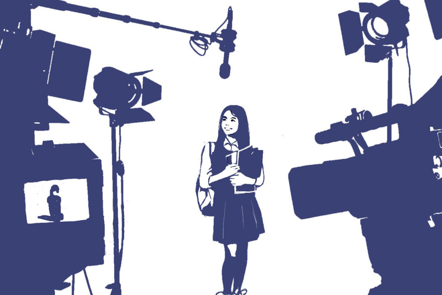

 
 <h1 align=center>প্রথমা</h1>
<h2 align=center>অম্লানকুসুম চক্রবর্তী</h2> 

খাবার গলা দিয়ে নামছিল না প্রকাশ মণ্ডলের। থম মেরে বসে ছিলেন খবরটা দেখে। মাধ্যমিকে এ বার যে প্রথম হয়েছে, সে এই শহরেরই মেয়ে। টিভিতে ফলাফল দেখামাত্র কাজ বেড়ে যায় প্রকাশের। ‘টপার’ প্রকাশনীর কর্ণধার বলে কথা। তাঁর টিম কৃতীদের ফোন নম্বর জোগাড়ে লেগে পড়ে ঝটপট। কৃতী মানে ফার্স্ট। বড়জোর সেকেন্ড। স্কুলের সঙ্গে যোগাযোগ করা হয়। ভিডিয়ো ক্যামেরা নিয়ে সেই রাতের মধ্যেই কৃতীদের বাড়িতে পৌঁছে যেতে হয়। না হলে জাগরণ মাইতি ঢুকে পড়েন যুদ্ধে। ‘সেরার সেরা’ প্রকাশনীর মালিক তিনি।

টপারের এই ইন্ডাস্ট্রিতে চোদ্দো বছর হল। জাগরণের ব্যবসা সবে চার বছরের শিশু। তবে টপারকে একঘরে করে দেওয়ার জন্য এর মধ্যেই কয়েক কদম এগিয়ে গিয়েছেন তিনি। চটজলদি কোনও কৃতীর বাড়ি পৌঁছনোর পরে প্রকাশের টিম দেখেছে, ইতিমধ্যেই দাঁড়িয়ে পড়েছে সেরার সেরা প্রকাশনীর গাড়ি। শহরের মধ্যে হলে জাগরণ এ সব জায়গায় নিজে যান। প্রকাশের টিমকে দেখে তির্যক হাসেন। খবর কানে এলে প্রকাশ মণ্ডলের গা রি-রি করে।

পরীক্ষায় ফার্স্ট হল যে, তাকে তিরে গাঁথতে পারাটাই জ্যাকপট। এ দুনিয়ায় দ্বিতীয়-তৃতীয়র কোনও গুরুত্ব নেই। দশ-পনেরো-কুড়ি-পঁচিশ হাজার উড়িয়ে সোনার হাঁস সেই কৃতীকে দিয়ে বলিয়ে নিতে হয়, “এ বারের মাধ্যমিকে আমি প্রথম হয়েছি। আমার এই সাফল্যের নেপথ্যে টপার প্রকাশনীর প্রশ্নোত্তরমালা ও সহায়িকার অবদান অপরিসীম।”

প্রকাশের আগে জাগরণের টিম ঢুকে গেলে ফার্স্ট গার্ল কিংবা ফার্স্ট বয়ের মুখ থেকে ‘টপার’-এর বদলে ‘সেরার সেরা’ বেরিয়ে যাবে। বাকি খাঁচা পুরো এক। বাজারে এই কথাগুলো প্রবাদ হয়ে গিয়েছে। এর জন্ম দিয়েছেন প্রকাশ মণ্ডলই।

এ বারের মাধ্যমিকে দক্ষিণ কলকাতার একটা স্কুল থেকে যে মেয়েটা ফার্স্ট হয়েছে, তার মুখটা অ্যাসিডে পোড়া। একটা চোখও খারাপ। টিভিতে দেখাচ্ছিল। প্রশংসার বন্যা বইছিল। মনোবিদরা চ্যানেলে চ্যানেলে বলে বেড়াচ্ছিলেন, “এই অসম্ভব জেদকে কুর্নিশ।” এক জন এক কাঠি এগিয়ে বলে দিয়েছিলেন, “তুমি এ যুগের দুর্গা।”

এই মুখ দেখে ভয় করছিল প্রকাশ মণ্ডলের। কত মাধ্যমিক এল গেল, এমন হয়নি কখনও। প্রকাশের তেমন কিছু মনে পড়ে না, অন্তত তাঁর ব্যবসাকালে। অ্যাসিস্ট্যান্ট ফোন করে বলল, “দেখেছেন স্যর?”

প্রকাশের গলা দিয়ে খাবার নামছিল না। গলার কাছে পাথরের টুকরোর মতো আটকে ছিল লং গ্রেন বাসমতী রাইস।

অ্যাসিস্ট্যান্ট ফের জিজ্ঞেস করল, “যাব তো স্যর?”

প্রকাশ দু’বার মৃদু হুঁ বলে মিনমিন করে জুড়ে দিলেন, “আমাকেও পিক আপ করে নিয়ো।”

টপার না পৌঁছলে কি জাগরণের দল তুলে নেবে মেয়েটাকে? এটা কোনও ভাবেই হতে দেওয়া যায় না।

পৌঁছলেন প্রকাশ, দলবল ও ক্যামেরা-সহ। টালিগঞ্জ ট্রাম ডিপোর পিছনে একটা অন্ধ, বন্ধ গলির শেষে মেয়েটার বাড়ি। জাগরণের গাড়ি দেখতে পেলেন না আশপাশে। প্রকাশের মনে হল, জাগরণ ব্যবসাটা বোঝে! ঠিকই করেছে না এসে। মেয়েটার নাম রূপসা। রূপসা দাস। নামের কী বাহার! বিরক্তি নিয়ে আকাশের দিকে সিগারেটের ধোঁয়া ছুড়ে দিলেন প্রকাশ। ওই মেয়েটা আর যা-ই হোক, টপারের মডেল হয় না। বিক্রি পড়ে যাবে।

কিন্তু হল উল্টো।

পেটের জন্য, ব্যবসার জন্য কত কিছুই না করতে হয়! চোদ্দো বছরের মধ্যে বারো বছর পরীক্ষায় প্রথমকে দিয়ে টপারের নাম বলিয়েছেন। ধারাবাহিকতা বজায় রাখাটা প্রকাশের ব্যবসায়িক এথিক্সের মধ্যে পড়ে।

মুখের উপর না করে দিল রূপসা। এ ভাবে না বলার সাহস পায়নি কেউ, এত বছরে। মেয়েটার অসুস্থ মা শুয়ে ছিলেন ঘুপচি ঘরের বিছানায়। কাতরানির সঙ্গেও মুখে ঝিলিক দিচ্ছিল মেয়ের জন্য গর্ব। টিউবলাইটের পাশে, ছবিতে মধ্য-চল্লিশের লোকটা কে? রূপসার বাবা?

মেয়েটা বলল, “আপনাদের বই তো পড়িইনি আমি, খামোখা এ সব শেখানো কথা বলতে যাব কেন?”

এই সময় দশ হাজারের অফারটা বাড়িয়ে পনেরো করতে হয়। এক কোটিপতির ছেলের জন্য এক লক্ষ অবধি টেনে দিয়েছিলেন প্রকাশ। বাজারের খবর, পঁয়ষট্টির বেশি যেতে রাজি হননি সেরার সেরার জাগরণ।

দাঁড়িয়ে ছিলেন প্রকাশ মণ্ডল। কত কৃতীকে প্রকাশ করেছেন তিনি। বিখ্যাত করে দিয়েছেন রাতারাতি। অ্যাসিডের দাগ মাখা, বিকৃত মুখের মেয়েটা বলল, “আমার সহায়িকা আমি নিজেই। আমি যুদ্ধ করে বাঁচি প্রতিদিন। আপনারা আসুন প্লিজ়।”

সামনে আয়না থাকলে প্রকাশ মণ্ডল দেখতে পেতেন, তাঁর গালের চামড়া কুঁচকে যাচ্ছে ক্রমশ, বিকৃত হয়ে যাচ্ছে মুখ। দরাদরি করার ইচ্ছেটাকেই গলা টিপে মেরে দিল রূপসা। বলল, “কী হল? আর কিছু না বলার থাকলে অনুগ্রহ করে বেরিয়ে যান।” ও হাত জোড় করেছিল। ওর মায়ের সারা শরীর থেকে ঠিকরে পড়ছিল জ্যোৎস্না। না না, ফ্লাডলাইট।

এ বারে মেয়েদের জয়জয়কার। পরীক্ষায় দ্বিতীয় যে হয়েছে, সেও মেয়ে। বারাসতে বাড়ি। রূপসার থেকে মাত্র দু’নম্বর কম। অসাধারণ সুন্দরী। টিভিতে দেখাচ্ছিল।

গালের চামড়া আরও কুঁচকে যাচ্ছিল প্রকাশের। খড়খড়ে। বিদ্যুতের মতো বুদ্ধি খেলে গেল হঠাৎ। নিজেরই নিজেকে আদর করতে, পিঠ চাপড়ে দিতে ইচ্ছে হচ্ছিল। দ্বিতীয়াকে বলবেন, “স্ক্রুটিনির জন্য অ্যাপ্লাই করে ফেলো। সম্ভব হলে আজই, এখনই। ফার্স্ট তোমাকে হতেই হবে। এই রইল পঁচিশ হাজার অ্যাডভান্স। শুটটা আজই করে নিয়ে যাই, কেমন? প্রথম হয়েছি বলতে হবে কিন্তু।”

কিছু জ্যাক কাজে লাগাতে হবে উপরমহলে। এত বছর তো হল ইন্ডাস্ট্রিতে। ঠিক জায়গায় ঠিক দাম ফেলতে পারলে কেনা যায় না এমন কিছু নেই— বিশ্বাস করেন প্রকাশ। এক বার চেষ্টা করে দেখতে ক্ষতি কী!

প্রকাশ জানেন, বাজারে সেকেন্ড আর থার্ডের কোনও জায়গা নেই।

বারাসত। রাত সাড়ে ন’টা।

দ্বিতীয়ার বাড়ির রাস্তার মুখ বন্ধ করে দাঁড়িয়েছিল জাগরণের গাড়ি। ‘সিভিক ভলান্টিয়ার’ লেখা জামা পরে গাড়ির পাশে ঘুরঘুর করছিল তিনটে লোক। মুখে প্রশান্তি।

ওরা কি পাহারাদার?

(নিছক একটি গল্প। কৃতী ছাত্রী, প্রকাশক, প্রকাশনার নাম কাল্পনিক)

