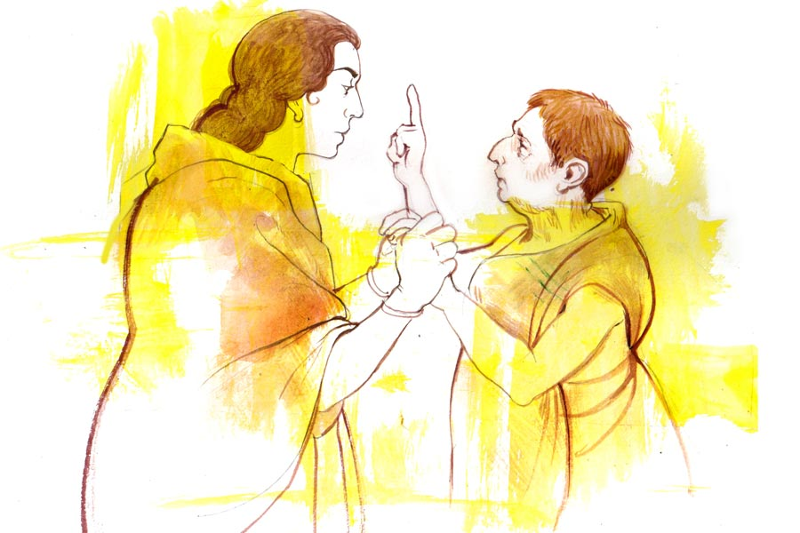

 
 <h1 align=center>প্রধানের বোধোদয়</h1>
<h2 align=center>অর্ঘ্য ঘোষ</h2> সে দিন ভরসন্ধেয় স্ত্রী অর্চনার সঙ্গে তুমুল বচসা হল মনোরঞ্জন প্রধানের। প্রধান তাঁর পদবি নয়, পদ। পদবি দাস। পদটাও নিজের নয়, অর্চনার। অর্চনা শ্যামনগর পঞ্চায়েতের প্রধান। কিন্তু বকলমে মনোরঞ্জনই সব। বিশেষ মিটিং-টিটিং থাকলে অর্চনাকে হাজির থাকতে হয়। মতামত মনোরঞ্জনই দেন। কাগজপত্রে সইসাবুদটুকু অর্চনা করেন। ফলে এলাকায় প্রধান বলতে মনোরঞ্জনই। অর্চনা হাতে-কলমে প্রধানের কাজ না করলেও প্রধান হিসেবে স্বামীর কৃতকর্মের দায় তাঁর উপরেই বর্তায়। তাই ভোটে দাঁড়ানোর জন্য যখন প্রস্তাব আসে তখন প্রথমে ‘না’ বলে দিয়েছিলেন। পার্টির নেতারা এসে ধরেছিলেন মনোরঞ্জনকে। ব্লক সভাপতি বিনয় রায় বলেছিলেন, “আমাদের দল ক্ষমতায় আছে। তালগাছ কিংবা কলাগাছ দাঁড় করালেও ড্যাংডেঙিয়ে জিতে যাবে। প্রার্থীর অভাব হবে না। নেহাত ভাল মানুষ হিসেবে এলাকায় তোমাদের সুনাম আছে, আবার প্রধানের পদটা মহিলাদের জন্য সংরক্ষিত তাই...”

অর্চনা তবুও রাজি হতে পারেনি। মনোরঞ্জন সমানে জপিয়ে গিয়েছিল, “আজকালকার দিনে একটা বুড়ি ছুঁয়ে থাকতে হয়। না হলে কে কখন কোন দিক থেকে চিক দিয়ে চলে যাবে, কে বলতে পারে?”

অগত্যা নিমরাজি হতে হয় অর্চনাকে। অনায়াসেই ভোট বৈতরণি পেরিয়ে সর্বসম্মতিক্রমে প্রধানও মনোনীত হন। লালপাড় তাঁতের শাড়ি পরে প্রধান হিসেবে শপথ নিয়ে আবির মেখে স্লোগান মুখরিত কর্মী-সমর্থক পরিবৃত হয়ে বাড়ি ফিরে আসেন। তার পর থেকে বিশেষ কোনও কারণ ছাড়া পঞ্চায়েতে যেতে হয় না তাঁকে। মনোরঞ্জনই সব।

দুই ছেলেমেয়ে আর স্বামীকে নিয়ে অর্চনার সুখের সংসার। পঞ্চায়েত পরিচালনার ভার মনোরঞ্জনই সামলান। মাস ছয়েক পর থেকেই হাওয়ায় উড়তে থাকে নানা কথা। মনোরঞ্জন নাকি ঠিকাদারদের থেকে দু’হাতে কমিশন খাচ্ছেন। কলমিস্ত্রিরা পর্যন্ত রেহাই পাচ্ছে না। আত্মসম্মানে লাগে অর্চনার। এরই মধ্যে ধর্মভীরু মানুষটার ধর্মাধর্ম বোধ চলে গেল! এক দিন আর থাকতে না পেরে জবাবদিহি চেয়ে বসেন, “হ্যাঁ গো! কী সব শুনছি তোমার নামে?”

অর্চনা কী জানতে চাইছেন, সেটা তাঁর মুখচোখের ভাব দেখেই বুঝে যান মনোরঞ্জন। ভালমানুষের মতো মুখ করে বলেন, “কী শুনেছ?”

“তুমি না কি সবার কাছে থেকেই টাকা নিচ্ছ?”

স্ত্রীর প্রশ্নে মনোরঞ্জন অস্বস্তিতে পড়ে যান। তবুও  তাচ্ছিল্যের সঙ্গে অভিযোগ উড়িয়ে দেন, “বাজে কথা। সব বিরোধীদের অপপ্রচার।”

অর্চনা বিশ্বাস করেন। রাজনৈতিক আক্রোশে কাদা-ছোড়াছুড়ি তো হতেই পারে। মনে স্বস্তি অনুভব করেন।

কিন্তু বেশি দিন স্বস্তিতে থাকতে পারেন না। পাড়ারই সাবিত্রীবালা কেঁদে এসে পড়েন, “ও মা অর্চু, তুই একটা উপায় করে দে মা।”

সাবিত্রীবালা বাল্যবিধবা মানুষ। স্বামীকে হারিয়ে দুই ছেলেকে নিয়ে বাপের বাড়িতে আশ্রিত। মুড়ি ভেজে, ধান সেদ্ধ করে ছেলেদের বড় করেছেন। এখন তাদের আলাদা সংসার। মাকে দেখে না। অর্চনা জিজ্ঞেস করেন, “কী হল গো পিসি?”

“দুঃখের কথা আর কী বলব মা, আমার নামে পঞ্চায়েতে একটা বাড়ির টাকা এসেছে। জামাই বলছে, টাকাটা পেতে হলে পঁচিশ হাজার টাকা দিতে হবে। সবাইকেই নাকি দিতে হচ্ছে। অনুদান পাওয়ার আগেই টাকাটা মিটিয়ে দিতে হবে। আমি কত করে বললাম, আগে টাকাটা পাওয়ার ব্যবস্থা করে দাও। তার পর দেব। তা মুখের উপর না করে দিল।”

রাগে অর্চনার গা জ্বলে ওঠে।

“আচ্ছা, বল তো মা, আমি অত টাকা কোথায় পাব? টাকা থাকলে কি এত দুর্দশা হয়? তাও জটু দাসের কাছে শতকরা মাসিক দশ টাকা সুদে দশ হাজার টাকা এনে দিয়েছি। ভেবেছিলাম টাকাটা পেলে বাকি পনেরো হাজার আর জটু দাসের টাকাটা মিটিয়ে দিয়ে যা থাকবে তা দিয়ে মাথা গোঁজার একটা ঠাঁই করব। কিন্তু কোথায় কী! মাস পেরিয়ে গেল। অনুদানের টাকা পেলাম না। জটু দাস টাকার জন্য বাড়ি খাল করে দিচ্ছে। তুই এক বার জামাইকে বলে দেখ না, অনুদান না হোক আমার টাকাটা যেন ফিরিয়ে দেয়।”

অর্চনা সাবিত্রীবালাকে আশ্বস্ত করেন, “বেশ পিসি, তুমি বাড়ি যাও। কী করা যায় দেখছি।”

সেই থেকে মনে একটা অপরাধবোধ ঘুরপাক খায়। সন্ধেয় মনোরঞ্জন পঞ্চায়েত থেকে ফিরতেই ক্ষোভ উগরে দেন, “তোমার জন্য তো লোকের কাছে মুখ দেখানোর উপায় রইল না। এত দিন লোকেরা তা হলে সত্যি কথাই বলত?”

সমস্যার গন্ধ পান মনোরঞ্জন, আমতা আমতা করে বলেন, “কেন, কী হয়েছে?”

“তুমি সাবিপিসির কাছেও টাকা নিয়েছ? বিবেকে একটুও বাধল না?”

শুনেই মনোরঞ্জনের মেজাজ খিঁচড়ে যায়। মনে মনে বলেন, ‘তোর ব্যবস্থা হচ্ছে দাঁড়া। অনুদান তো পাবিই না। দশ হাজার টাকাও যাবে।’

মুখে অবশ্য বলেন, “ও সব তুমি বুঝবে না। পার্টির নির্দেশে সবার কাছ থেকেই টাকা নেওয়া হয়।”

“লোকে তো তোমাকে দুষছে।”

“প্রধান থাকতে হলে ও সব শুনতে গেলে চলে না।”

“তা হলে অমন প্রধান থাকার দরকার নেই। সাবিপিসির টাকাটা ফিরিয়ে দিয়ে চলো কালই ইস্তফা দিয়ে আসি।”

“পাগল না কি! সবাই দু’হাতে লুটবে আর আমি আঙুল চুষব? টাকা ফেরত দাও বললেই হল? টাকা সব ভাগ হয়ে গেছে। তোমাকে অত মাথা ঘামাতে হবে না। তুমি মেয়েছেলে মেয়েছেলের মতো থাকো।”

দাবড়ানি দিয়ে স্ত্রীকে চুপ করিয়ে দেন মনোরঞ্জন। তখনকার মতো চুপ করে গেলেও ব্যাপারটা মন থেকে মুছতে পারেন না অর্চনা। মনের কষ্টে এক সময় অসুস্থ হয়ে পড়েন। বকাবকি করলেও স্ত্রীর অসুস্থতা উদ্বিগ্ন করে তোলে মনোরঞ্জনকে। অর্চনাকে লাভপুরের বিশু ডাক্তারের চেম্বারে নিয়ে যান। চেম্বার লাগোয়া বিশু ডাক্তারের নার্সিং হোম এবং প্যাথোলজি ল্যাবও আছে। চিকিৎসক হিসেবে খুব সুখ্যাতি। বিশু ডাক্তার অর্চনার বাবার বিশেষ পরিচিত। অর্চনার রোগের উপসর্গ শুনে একান্তে আলাচনার জন্য মনোরঞ্জনকে বাইরে পাঠিয়ে দেন। ঘণ্টাখানেকের মধ্যে বেশ কিছু টেস্ট করিয়ে আর ওষুধপত্র দিয়ে দু’জনকে বাড়ি পাঠিয়ে দেন।

সেই শুরু। তার পর থেকে স্বামীর দুর্নীতির খবর কানে এলেই অসুস্থ হয়ে পড়েন অর্চনা। ফের তাঁকে নিয়ে বিশু ডাক্তারের কাছে ছুটতে হয় মনোরঞ্জনকে। আবার এক গাদা টেস্ট করিয়ে ওষুধপত্র নিয়ে ফেরেন। সাময়িক সুস্থতা ফিরলেও অর্চনার অসুখটা পুরোপুরি সারে না। মাঝখান থেকে জলের মতো টাকা বেরিয়ে যায়। এক-এক বার শরীরের এক-এক জায়গার এমআরআই স্ক্যান, সিটি স্ক্যান, কখনও নার্ভ ইমপালস, কখনও ব্রেনের নানা পরীক্ষা করতে দেন ডাক্তার, আর এক এক বারে চল্লিশ-পঞ্চাশ হাজার  টাকা করে বিল হয়। মাঝে মাঝে সপ্তাহখানেক করে ভর্তিও হতে হয়েছে নার্সিং হোমে। খরচ হয়েছে জলের মতো। মনোরঞ্জন খুব দুশ্চিন্তায় পড়ে যান। পার্টির নেতারা অর্চনাকে বাইরে নিয়ে গিয়ে চিকিৎসা করানোর পরামর্শ দেন। মনোরঞ্জনও সেই সিদ্ধান্ত নেন। অর্চনা বেঁকে বসেন। সাফ জানিয়ে দেন, “বাঁচতে হলে বিশুকাকার হাতে বাঁচব। মরতে হলেও তাঁর হাতেই মরব।”

মনোরঞ্জন জোর করতে পারেন না। স্ত্রীকে নিয়ে দুশ্চিন্তাটাও যায় না। প্রধান তো আর স্বাধীন নেতা নয়, পার্টির নির্দেশ শুনেই টাকাপয়সা নিতে হয়। তা থেকে মনোরঞ্জন যে অনেক ভাগ পান তাও নয়, আবার পার্টির ইচ্ছের বিরুদ্ধে আপত্তির জায়গাটুকুও নেই। মনোরঞ্জনের মনটা খারাপ হয়। স্ত্রীকে তিনি ভালবাসেন। তাই তাঁর অসুস্থতায় কাজকর্ম টাকাপয়সার আমদানিতেও মন বসাতে পারেন না মনোরঞ্জন। এক দিন একাই বিশু ডাক্তারের চেম্বারে হাজির হন। দুর্ভাবনার কথাটা বলেন তাঁকে, “কাকাবাবু, অর্চনাকে নিয়ে খুব উদ্বেগে রয়েছি। অসুখটা নির্মূল হচ্ছে না। খারাপ কিছু হবে না তো?”

বিশু ডাক্তার শান্ত গলায় বলতে শুরু করেন, “সব সময় ওর মনে একটা অপরাধবোধ কাজ করে। সেখান থেকেই নানা পার্শ্বপ্রতিক্রিয়া। পরীক্ষানিরীক্ষায় এক-এক বার এক-এক রকম রিপোর্ট আসছে। তাই তো প্রতি বারই পরীক্ষা করতে হচ্ছে। বুঝতে পারছি, তোমার অনেকগুলো টাকা... কিন্তু জানোই তো আজকের দিনে ডাক্তারি পরীক্ষানিরীক্ষা খুবই ব্যয়সাপেক্ষ... তবে বিভিন্ন জটিলতাও তো পাওয়া যাচ্ছে...”

মনোরঞ্জন শঙ্কিত হন। কারও অভিসম্পাত কিংবা দীর্ঘশ্বাসের কারণেই এমন হচ্ছে না তো! এখন শুধু অর্চনার হচ্ছে, ভগবান না করুন ছেলেমেয়ে দুটোর যদি কিছু... ঈশ্বর তো অনেক সময় প্রিয়জনকে কষ্ট দিয়েই পাপের শাস্তি দেন! মনের মধ্যে একটা দোলাচল নিয়ে বাড়ি অভিমুখে রওনা দেন মনোরঞ্জন। মনে মনে হিসেব করে দেখেন, যে দিনই ঘুষ নিয়ে বাড়ি ফিরেছেন, তার দু’-চার দিন পরেই কাকতালীয় ভাবে অর্চনা অসুস্থ হয়ে পড়েছে। আর তার চিকিৎসা করাতে গিয়ে ঘুষের টাকা তো গিয়েছেই, নিজের গাঁটের কড়িও কম খসেনি। গত কয়েক মাসে বেরিয়ে গেছে প্রায় লাখ দুয়েকের মতো। এই রকম ভাবে চললে সত্যিই সংসার রসাতলে যেতে দেরি হবে না। উপরি বদনাম তো থাকবেই।

তার পর থেকে সব সময় বিমর্ষ থাকেন প্রধান। অর্চনা জিজ্ঞেস করেন, “কী হয়েছে গো তোমার? কী অত ভাবো সব সময়?”

“ভাবছি বিঘে কয়েক জমি বিক্রি করে দেব।” 

অর্চনা যেন আঁতকে ওঠেন, “হঠাৎ জমি বিক্রি করতে যাবে কেন?”

“আমি ঠিক যার কাছে যা ঘুষ নিয়েছি, তা জমি বিক্রি করে মিটিয়ে দেব। নতুন করে আর কারও অভিসম্পাতের কারণ হব না। তার পর তুমি প্রধানের পদ থেকে ইস্তফা দিয়ে দিয়ো। সুখের চেয়ে স্বস্তি ভাল।”

স্বামীর ভাবান্তরে পুলকিত হন অর্চনা। সেটা বুঝতে না দিয়ে নিরাসক্তি দেখান, “হঠাৎ এই বোধোদয়ের কারণটা কী?”

“মানুষের দীর্ঘশ্বাসের জন্যই আমাদের এই ভোগান্তি। আমার তো দশটা নয়, পাঁচটা নয়, একটাই বৌ। সে-ই যদি অসুস্থ হয়ে পড়ে, তা হলে টাকাপয়সায় লাভ কী! ক্ষমতা তো আর সঙ্গে নিয়ে যাব না।”

“যাক, শেষ পর্যন্ত তোমার শুভবুদ্ধির উদয় হয়েছে দেখে খুব খুশি হয়েছি। তোমাকে আর জমি বিক্রি করতে হবে না।”

“বিক্রি করতে হবে না? তা হলে টাকা ফেরত দেব কী করে?”

“তোমাকে কিছু করতে হবে না। সবার টাকা আমিই ফিরিয়ে দিয়েছি।”

“তুমি! কোথায় পেলে?”

“ডাক্তারকাকার কাছে।”

“মানে?”

“তুমি যখন যার কাছে যা ঘুষ নিতে, তা আমার কানে ঠিক চলে আসত। আর আমারও অসুখ হত। ডাক্তারকাকাও চিকিৎসা পরীক্ষার জন্য মোটা বিল করে গোপনে সে টাকা আমাকেই দিয়ে দিতেন। সেটাই লোকেদের ফিরিয়ে দিয়েছি।”

“তা হলে তোমার চিকিৎসা, পরীক্ষা-নিরীক্ষা?”

“সব লোক-দেখানো। তোমার ঘুষ নেওয়ার অসুখটা সারাতেই আমাকে অসুস্থ হওয়ার ভান করতে হয়েছে। বুদ্ধিটা অবশ্য ডাক্তারকাকারই।”

স্ত্রীর অসুখের গূঢ় তত্ত্ব শুনে হতবাক হয়ে যান মনোরঞ্জন, “তোমার পেটে পেটে এত?”

“কেন, জানতে না সব পুরুষেরই জন্ম মেয়েদের পেটে? যাক, এ বার চলো, ভালয় ভালয় ইস্তফাটা দিয়ে আসি। কথায় আছে, শেষ ভাল যার সব ভাল তার।”

“দাঁড়াও, ইস্তফা তো যে কোনও সময় দেওয়া যেতেই পারে। তুমি তো আমাকে ঘোল খাওয়ালে, এ বার আমি ওদের ঘোল খাওয়াই!”

“ওদের মানে?”

“যাদের জন্য আমায় দু’হাতে ঘুষ নিতে হল! ওদের ঘুঘুর বাসাটা কেমন ভেঙে দিই দেখোই না।”

বাস্তবিকই পরদিন থেকে পঞ্চায়েতে অন্য রকম হাওয়া বইতে থাকে। ঘুষ চাওয়া দূরের কথা, ঘুষ দিয়ে কাজ হাসিলের চেষ্টা করা হলে হওয়া কাজও আটকে যায়। মনোরঞ্জনের হলটা কী ভেবে পান না কেউ। সাধারণ মানুষের অবশ্য সে সব নিয়ে মাথাব্যথা নেই। তারা ধন্য ধন্য করতে শুরু করে। পঞ্চায়েত কর্মীদের মাথায় হাত। পার্টি নেতাদের কপালে চিন্তার ভাঁজ। বাঁ হাত বাড়িয়ে পকেট বোঝাই করার এত দিনের অভ্যাস ত্যাগ করবেন কী করে! পার্টির ফান্ডে যে মা ভবানী নেত্য করবেন! আকারে প্রকারে মনোরঞ্জনকে বাগে আনার চেষ্টা করেও ব্যর্থ হন পার্টির মাথারা। শেষে ব্লক সভাপতি বিনয় রায়ের কাছে খবর যায়। তারও কোটা বন্ধ হয়ে গিয়েছে। পঞ্চায়েতে অনুগামীদের নিয়ে রুদ্ধদ্বার বৈঠকে বসেন। সেখানে মনোরঞ্জনকে কড়া গলায় বলেন, “তুমি পেয়েছটা কী? তোমার বৌয়ের মুখ দেখে কেউ ভোট দেয়নি। পার্টি তোমার বৌকে প্রধান করেছে, তাই সব সময় পার্টির নির্দেশ মেনে চলতে হবে।”

মনোরঞ্জন রাগেন না। ঠান্ডা গলায় বলেন, “তা বেশ তো। পার্টির নির্দেশটা লিখিত ভাবে দিন। মেনে চলার চেষ্টা করব।”

বিনয়বাবু হতভম্ব। দীর্ঘ দিন পার্টি করছেন। অনেককে প্রধান, পঞ্চায়েত সমিতির সভাপতি, এমনকি জেলা পরিষদের কর্মাধ্যক্ষ পর্যন্ত করেছেন। কিন্তু এর আগে তার মুখের উপরে কথা বলার স্পর্ধা কেউ দেখায়নি। তিনি আর মেজাজ সামলে রাখতে পারেন না, “তুমি বোধহয় জানো না, তোমার বৌকে সরিয়ে দিতে আমাদের একটুও সময় লাগবে না।”

“ভাল করেই জানি। তবে সরিয়ে দিতে হবে না। এমনিতেই আমার স্ত্রী ইস্তফা দেওয়ার কথা ভেবে রেখেছেন। তবে তার আগে আপনাদের মুখোশ খুলে দিয়ে যাব। প্রধানকে সামনে রেখে আপনাদের মধু খাওয়ার কথাটা সবাইকে জানিয়ে দেব। গুড় খাবে পার্টি, বদনাম হবে প্রধানের— এ জিনিস আর চলতে দেব না।”

রাগে, অপমানে বিনয়বাবুর চোখমুখ লাল হয়ে ওঠে। তোতলাতে শুরু করেন তিনি। মনোরঞ্জন নির্বিকার। ক্ষমতা হারানোর ভয় জয় করতে পারলেই বোধহয় মনে এ রকম প্রত্যয়ের জন্ম হয়।