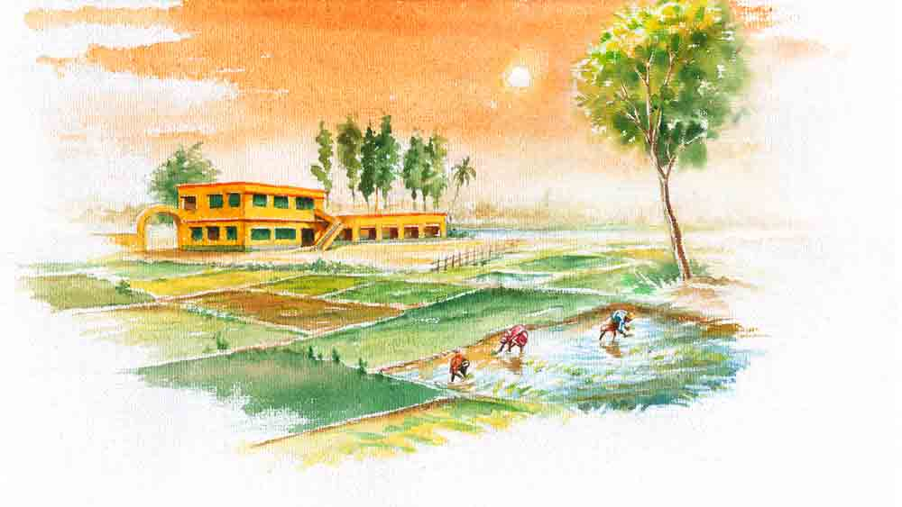

 

<h1 align=center>প্রমিথিউস</h1>
<h2 align=center>রাখী নাথ কর্মকার</h2>
এই মান্ধাতা আমলের ডেস্কটপের র‌্যাম এত কম, ক্লাস করতে খুব অসুবিধে হচ্ছে আমার! মোবাইলটাও বিগড়েছে। এ বার একটা নতুন মোবাইল কিনে দিতে হবে আমায়...” অনলাইন ক্লাসের ফাঁকে অসহিষ্ণু ভাবে দাবি জানিয়ে গেল রনি।   নিজের মোবাইলে খুটখুট করতে করতে বিষদৃষ্টিতে মৌলির দিকে তাকাল রঞ্জিত। যেন বলতে চাইল, ‘দেখেছ তো, আগেই বলেছিলাম, আগাছার বাড় বেশি!’   সকালের অলস রোদ্দুর আলগোছে গা এলিয়ে শুয়েছিল এক ফালি বারান্দায়। নিশ্চুপে টবের গাছগুলোর পরিচর্যা করছিল মৌলি। আদর-ভালবাসা-মেঘ-রোদ-বৃষ্টিতে বুঁদ হয়ে থাকা সবুজ ডালপালায় উপচে পড়েছে ওর এই টুকরো বারান্দা। শহরতলির সকাল এর মধ্যেই হাই তুলে, আড়মোড়া ঘুম থেকে উঠে বসেছে। ওদের বাড়ির দক্ষিণ প্রান্তে এই জায়গাটা বেশ নির্জন। আশপাশে বিস্তীর্ণ সবুজের উচ্ছ্বাস। উচ্চস্বরে শিস দিতে দিতে একটা অজানা পাখি ব্যতিব্যস্ত করে তুলেছে ঘুমভাঙা ফুলের কুঁড়িগুলোকে। বকুল-জারুলের পাতার ফাঁকে লুকিয়ে থাকা লাজুক পাখির সেই সুরেলা ডাক, দখিনা বাতাসে দুলে ওঠা পাতাদের মজলিশ, উড়ে বেড়ানো চঞ্চল প্রজাপতি... এই মেঘবারান্দায় এলে মৌলির যাবতীয় উদ্বেগ বাসি হয়ে যায়, তাদের ক্ষুরধার উপস্থিতি বুদ্বুদের মতো মিলিয়ে যায়।   আড়চোখে ড্রয়িংরুমের দিকে তাকাল মৌলি। দেওয়ালে টাঙানো শ্বশুরমশাইয়ের ফোটোটার দিকে চেয়ে চাপা দীর্ঘশ্বাস ফেলল ও। ওর জীবনে রনি আসার সময়টা পরিবারের প্রায় সকলেই যখন বাঁকাচোখে তাকিয়েছে, একমাত্র ওই মানুষটিই মৌলির এত বড় একটা সিদ্ধান্তে প্রাণ খুলে সমর্থন জানিয়েছিলেন। ওদের দীর্ঘ, নিঃসন্তান দাম্পত্যের সুতো খুলে খুলে আসছিল অজান্তে, তাতে গিঁট বাঁধার জন্যে প্রয়োজন ছিল কচি দশখানি আঙুলের। অসফল মাতৃত্বের তীব্র অবসাদ তত ক্ষণে গ্রাস করতে বসেছিল মৌলিকে, জমাট শীতের মতো একঘেয়ে হতাশা যেন জাঁকিয়ে বসছিল মৌলির সমগ্র অস্তিত্বে। ঠিক সেই সময়েই পরামর্শটা আসে ওর কলেজের এক বন্ধুর কাছ থেকে। না, সে সময় পরিবারের কেউই ওর ভাবনাকে স্বীকৃতি দিতে পারেনি। নিজের মা, দাদা, শাশুড়ি— সবাই কিন্তু কিন্তু করেছে... আর সবচেয়ে চেনা কাছের মানুষটা? সেও রাতের অন্ধকারে অচেনা সরীসৃপের মতো হিসহিস করে বলেছে, “কার পাপ ঘরে আনবে কে জানে! সেই রক্ত কোন অজানা খেল দেখাবে...”   সে দিন শ্বশুরমশাই কিন্তু সকালের রোদ্দুরের মতো মুচকি হেসেছিলেন, “শিশুদের মতো পবিত্র কিছু হয় রে? ওরা যে দেবতার অংশ...!” বিয়ের পর থেকে মানুষটাকে যত দেখেছে, ততই অবাক হয়েছে মৌলি। এমনিতেই মাটির মানুষ ছিলেন, স্ত্রী মারা যাওয়ার পর থেকে বিষয়আশয়ের প্রতি মোহ একেবারেই চলে গিয়েছিল তাঁর। রঞ্জিতের কাছে শুনেছে মৌলি, ওদের গ্রামে কোনও স্কুল না থাকায় বাচ্চাগুলোকে রোদ-জল-বর্ষায় খাল পেরিয়ে ছুটতে হত পাশের গ্রামে। সে কষ্টটুকু থেকে বাচ্চাদের মুক্তি দিতে গ্রামের জমিজমা সমস্তই প্রাইমারি স্কুলের জন্যে দান করে কলকাতার এক কামরার একটা ভাড়াঘরে এসে উঠেছিলেন স্কুলমাস্টার অবিনাশবাবু! কলকাতায় এসে, হাজার অভাবের মধ্যেও কিন্তু বাচ্চাদের প্রতি ভালবাসা ফিকে হয়ে যায়নি। রঞ্জিত বলত, মাসমাইনের একটা অংশ তিনি সরিয়ে রাখতেন দুঃস্থ ছাত্রছাত্রীদের জন্য। শাশুড়িমা রাগ করতেন, অশান্তি করতেন। মানুষটা শুধু বলতেন, “পুকুর থেকে এক ঘটি জল তুলে নিলে কি পুকুরের জল কম হয়ে যাবে, সবিতা?”   উপমাটা ভুল। স্কুলমাস্টারের সামান্য মাইনেটা অন্তত পুকুরের বিশালতার সঙ্গে তুলনীয় হয় না! জীবনের সঙ্গে সঙ্গে প্রয়োজনগুলোও বদলায়। বদলায়নি ওদের সংসারের গতিপ্রকৃতি! রঞ্জিত বলত, সংসারে নিত্য অভাব ছিল, কিন্তু তার জন্যে বাবাকে কখনও বিচলিত হতে দেখেনি। কত ছাত্রছাত্রীর পড়াশুনোর খরচ জুগিয়েছেন, কত ছেলেমেয়েকে সুপ্রতিষ্ঠিত করেছেন! ভালবাসার ভারে ঝুঁকে পড়া ঘন ডালপালায় এসে আশ্রয় নিয়েছে কত কচি ডানার শৈশব। একতলা বাড়ির বারান্দা উপচে পড়ত ছাত্রছাত্রীর ভিড়ে। এখনও পাড়ায় অবিনাশস্যরের নাম শুনলে লোকে শ্রদ্ধায় মাথা নত করে।   রঞ্জিত একদমই ভিন্ন মেরুর। যথেষ্ট হিসেবি সে। প্রয়োজনের বাইরে একটি পয়সা খরচ করা তার না-পসন্দ। নিজেও পরিমিত জীবনের মধ্য দিয়ে বেড়ে উঠেছে, মধ্যবিত্তের সাধারণ জীবনে অভ্যস্ত করতে চেয়েছে ছেলেকেও। সুতরাং ছেলের হাজারও বাড়তি আবদার যে তার কাছে বাহুল্য, সে তো স্বাভাবিকই।   রঞ্জিতের হিসেবি স্বভাবের কথা বাবার অজানা ছিল না, বাবা তাই রনির কাছে ছিলেন কল্পতরু! হাজার খেলনা, শিশুমনের লক্ষ চাহিদা, অসংখ্য আবদার... ইচ্ছেটুকু শব্দ হয়ে আছড়ে পড়ার আগেই পূরণ হয়ে যেত। স্নেহ টলমল করত তাঁর দু’চোখে, লুকনো দিঘির মতো। রঞ্জিত রাগ করত, “বাবা, তুমি এ ভাবেই ছেলেটাকে বিগড়ে দিচ্ছ!”   বাবা হাসতেন। কৃত্রিম হাসি নয়, প্রাণখোলা দরাজ হাসি, বলতেন, “জীবনে কত ছেলেমেয়েকেই তো প্রশ্রয় দিয়েছি, একমাত্র নাতিটাকেও না হয় একটু...”   আসলে জীবনে সৌভাগ্যক্রমে এমন এক-এক জন মানুষের সাহচর্য পাওয়া যায়, যাদের চিন্তাধারা খুলে দেয় এক অন্য আকাশের গুপ্ত দরজা, চিনিয়ে দেয় জীবনের আনাচেকানাচে লুকিয়ে থাকা রত্নসম্ভারের হদিস।   বাবা মৌলিকে বলতেন, “জানো মা, আমার বাবাও ঠিক এমনটি ছিলেন। কেউ কোনও দিন তাঁর কাছে এসে খালি হাতে ফিরে যায়নি। তখন সদ্য বাবা মারা গিয়েছেন, চরম অর্থসঙ্কটে পড়েছি আমরা। দিদির বিয়ের কথাবার্তা চলছে। আমার কলেজে ভর্তির জন্যে টাকা লাগবে, অথচ সামান্য জমিজমা ছাড়া বাবা আমাদের জন্যে কিছুই রেখে যেতে পারেননি। নিরুপায় হয়ে সে সব বিক্রির চিন্তাভাবনা করছি, এমন সময় এক দিন রামমোহন কলেজের এক প্রফেসরের সঙ্গে দেখা। ভদ্রলোক বাবার নাম শুনেই লাফিয়ে উঠলেন, ‘তুমি অমিয়রঞ্জনবাবুর ছেলে? আমি ওঁর ছাত্র ছিলাম...’   “না, আমাকে জমিজমা বিক্রি করতে হয়নি সে বার। লেখাপড়ায় আমার আর বাধা আসেনি। জলপানির টাকা, টিউশনির টাকা... দিদির বিয়েতে তেমন খরচা করতে পারিনি, তবে বুঝেছি, অন্যের জন্যে বাঁচতে পারার মধ্যে যে আনন্দ, সে আনন্দ টাকার পাহাড়ের ওপর বসে থাকায় নেই! রক্তের সম্পর্কের চেয়েও মানবিকতার সম্পর্ক বড় রে মা!”   ছোট্ট দাদুভাইকে ‘হাঁটি হাঁটি পা পা’ শেখানো সেই মানুষটাই যখন জীবনের শেষের ক’টা দিন চলৎশক্তি হারিয়ে ফেলেছিলেন, রনি স্কুল-কোচিংয়ের হাজার ঝামেলা সামলেও অথর্ব দাদাইয়ের পাশে ছিল ‘দাদাই’ হয়ে। যে দাদাইয়ের সাহচর্যে মুখে বুলি ফুটেছিল ছোট্ট রনির, সেই মানুষটাই যখন কথা বলতে গিয়ে খাবি খেয়েছেন, রনি কিন্তু মানুষটাকে ছুঁয়েই বুঝে গিয়েছে অব্যক্ত কথাগুলো...   গত বছর সেই সুবিশাল ছায়াটা ওদের মাথার ওপর থেকে সরে গিয়েছে। রনি গুম হয়ে থেকেছে, অথচ এক ফোঁটা চোখের জল ফেলেনি! বড্ড চাপা ছেলেটা। রনির অব্যক্ত কষ্টটা ঋণাত্মক তরঙ্গের মতো বাতাসে ভাসে, বুঝতে পারে মৌলি। অদৃশ্য, অথচ ছুঁতে পারে ও। কান্না হয়ে ঝরে পড়ে না যে কষ্ট, তার ভার বহন করা দুঃসাধ্য...   এখন, অতিমারির আবহে এখন ঘরবন্দি অনলাইন ক্লাস, টিচার-স্টুডেন্টদের হিসেবি প্রশ্ন আর যান্ত্রিক উত্তর... যেন এক প্রাণহীন সময়! কাছাকাছি, পাশাপাশি বসে বন্ধুর আত্মার সঙ্গে আত্মা ছুঁয়ে থাকার সেই অপার আনন্দটুকু হারিয়ে গিয়েছে। হারিয়ে গিয়েছে মাঠ, ডানা মেলে ওড়ার আনন্দ, হইহুল্লোড়, দুষ্টুমি। ছেলেটা যেন ক্রমেই আরও বেশি মোবাইল-নির্ভর হয়ে উঠছে দিন দিন। মৌলি বোঝে, একান্ত আশ্রয় সেই প্রিয় মানুষটাকে হারিয়ে ক্রমেই নিজের মধ্যে গুটিয়ে যাচ্ছে ছেলেটা। নিঃসঙ্গতা, একাকিত্ব গ্রাস করছে ওকে। মাঝে মাঝে অন্ধকারে ঝিম মেরে বসে থাকে ছেলেটা। বাবা থাকলে গল্পের গ্রাস তুলে দিতেন মুখে— “ফিল্যানথ্রপি কী জানো দাদুভাই? মানুষের প্রতি ভালবাসার ধারণাটা মূর্ত হয়ে উঠেছে গ্রিক পুরাণের সেই দানশীল, দূরদর্শী প্রমিথিউসের মধ্যে দিয়ে। তিনি মানুষকে আলো, আগুন এবং আশা উপহার দিয়েছেন। ঋজু, নির্ভরশীল হয়ে দাঁড়াতে শিখিয়েছিলেন। এই উদারতার জন্য কিন্তু তাঁকে কঠিন শাস্তি পেতে হয়েছিল। কিন্তু যারা ভালবাসতে জানে, তাঁদের কি আর শাস্তির ভয় আছে রে দাদুভাই?”   নিঃসঙ্গ রনি এখন গল্প খোঁজে অনলাইন গেমের মধ্যে! রঞ্জিত তা দেখে অসহ্য রাগে গর্জায়!   আজকাল প্রায়ই এক অদ্ভুত দোলাচলে অস্থির হয়ে ওঠে মৌলির অশান্ত মন। নিজেই নিজেকে জিজ্ঞাসা করে, তবে কি ও ভুল সিদ্ধান্ত নিয়েছিল? সময়ের পরত এখন যতই খুলছে, বাস্তব ততই যেন বেসুরো, অন্ধকারাচ্ছন্ন হয়ে উঠছে ওর কাছে। এক দিকে অবুঝ রনির ক্রমবর্ধমান আবদার, খেয়ালি মেজাজ, কিছু না পেলেই রাগ দেখানো, কথায় কথায় তর্ক। আর অন্য দিকে খিটখিটে রঞ্জিতের অনমনীয় মনোভাব, অহেতুক দোষারোপ, তুঘলকি শাসন আর খবরদারি। বাপ-ছেলের দূরত্ব যে ক্রমেই বেড়ে চলেছে, তা বেশ বুঝতে পারে মৌলি!      “সব্জি, চাই সব্জি...” চমক ভাঙে মৌলির। নীচে ভ্যানে করে সব্জিওলা হাঁক পাড়ছে। ক’দিন আগেও একটা নতুন ছেলে আসছিল আনাজপাতি নিয়ে। বয়স রনির মতোই হবে, চোদ্দো-পনেরো বছরের নিষ্পাপ সরল মুখ। আজকাল সে আর আসে না। এ নতুন মুখ!   আলু, পটল দরকার। লঙ্কা, পেঁয়াজও। মৌলি ছেলেটাকে ডাকে। ভ্যানের পাশে দাঁড়িয়ে নড়বড়ে দাঁড়িপাল্লায় সব্জি ওজন করছে ছেলেটা। চোখের তলায় ক্লান্তি। কচি গোঁফের রেখার তলায় ঘাম। শীর্ণ শরীরে লেপ্টে থাকা ছেঁড়াফাটা গেঞ্জি। অনভ্যস্ত হাতে অবাধ্য দাঁড়িপাল্লাটা টলমল করছে, সেটাকে সামলানোর আপ্রাণ চেষ্টা করে চলেছে ছেলেটা।   হঠাৎই ড্রয়িংরুম থেকে ভেসে আসা রঞ্জিতের হম্বিতম্বি শুনে মৌলি চমকে ঘুরে তাকায়। রনির ক্লাস শেষ হয়ে গেছে। ছেলের সামনে দাঁড়িয়ে রাগে উন্মত্ত রঞ্জিত চিৎকার করে চলেছে, “এখন মোবাইল-টোবাইল কেনা হবে না। তোমার মোবাইলটা আমাকে দাও। আমি দেখি কী গন্ডগোল পাকিয়েছ...”   আড়চোখে তাকিয়ে দেখে মৌলি, রনি থম মেরে দাঁড়িয়ে রয়েছে।   আলু, পটল, পেঁয়াজ মাপা হয়ে গেছে। বারান্দা থেকে বাজারের ব্যাগটা এগিয়ে দিতে গিয়ে বেসামাল হয়ে যায় মৌলি রনির কথা শুনে, “ফোনটা আমার কাছে নেই...”   “নেই মানে?” তীব্র বিস্ময়ে ফেটে পড়ে রঞ্জিত!   রনির অনিচ্ছুক ছেঁড়া ছেঁড়া কথা ঘেঁটে অবশেষে উদ্ধার হয় রহস্য। সইফুল বলে একটি মেধাবী ছেলে ওদের স্কুলে পড়ত। বেচারির বাবা নেই। মা একটা ছোট্ট কোম্পানিতে কাজ করত। লকডাউনে সে কোম্পানি বন্ধ হয়ে যাওয়ায়, স্মার্টফোনের অভাবে অনলাইন ক্লাস করতে না পারায় ছেলেটার পড়াশোনাও বন্ধ হতে বসেছিল। পেটের জ্বালায় নিরুপায় হয়ে আনাজ ফেরি করতে বেরিয়েছিল সইফুল... গত সপ্তাহে ঘটনাচক্রে ওদের এ দিকেই আনাজ বেচতে এসেছিল ছেলেটা। ফোনটা সে দিনই ওকে দিয়ে দিয়েছে রনি।   বারান্দার পাতাঝুরি গ্রিলটা আঁকড়ে ধরে দাঁড়ায় মৌলি। দাদাইয়ের দেওয়া প্রতিটি জিনিস আজও রনির ঘরে, দেওয়াল আলমারির তাক জুড়ে যত্ন করে সাজিয়ে রাখা। ছেঁড়া ঘুড়ি, ভাঙা রোবট, অচল গাড়ি। রঞ্জিত সেগুলোকে ফেলতে বললে চোখ সরু করে অদ্ভুত দৃষ্টিতে তাকিয়েছে রনি। ওই মোবাইলটা চার বছর আগে ওর জন্মদিনে দাদাই উপহার দিয়েছিলেন... ওটা ছিল রনির প্রাণ! আর সেই মোবাইলটা...   রঞ্জিতের দিকে তাকিয়ে অবাক হয়ে দেখে মৌলি, এই প্রথম দুর্বিষহ ক্রোধে আছড়ে পড়ার আগেই যেন হঠাৎ থমকে গিয়েছে সে উষ্ণ প্রস্রবণের স্রোত! রঞ্জিতের সামনে মাথা নিচু করে দাঁড়িয়ে থাকা রনির মুখে কিন্তু এই মুহূর্তে অনুশোচনার বোধ নেই, অনুতাপের বোধ নেই, বরং সে মুখে উপচে পড়ছে এক অপার্থিব আলো, চোখের কোণে ছলছল করছে তৃপ্তি! আর... সে দিকে তাকিয়ে রঞ্জিতের জ্বলন্ত দু’চোখের তীব্রতা বদলে যেতে শুরু করেছে শরতের মেঘহীন সকালের রোদ্দুরের মতো! এক প্রশান্ত, দুর্লভ হাসির আভা ধীরে ধীরে ছড়িয়ে পড়ছে বিহ্বল রঞ্জিতের চোখেমুখে! কত, কত দিন পর যেন... রঞ্জিত হাসছে! হাসিটা খুব চেনা চেনা লাগছে মৌলির...   বারান্দা থেকে ড্রয়িংরুমের দেওয়ালে টাঙানো বাবার ছবিটায় চোখ পড়ে যায় মৌলির। মানুষটা হাসছেন। বড় অমলিন সে হাসি!   মৌলি বিবশ হয়ে দেখছে, পাতায় লেগে থাকা অন্ধকার মুছে ফেলে দিনের আলোয় পাপড়ি মেলা ফুলের মতো, সর্বস্ব উজাড় করে কেমন সহজ, দ্বিধাহীন, অনাবিল ফুটে উঠছে এক উত্তরপুরুষ।
