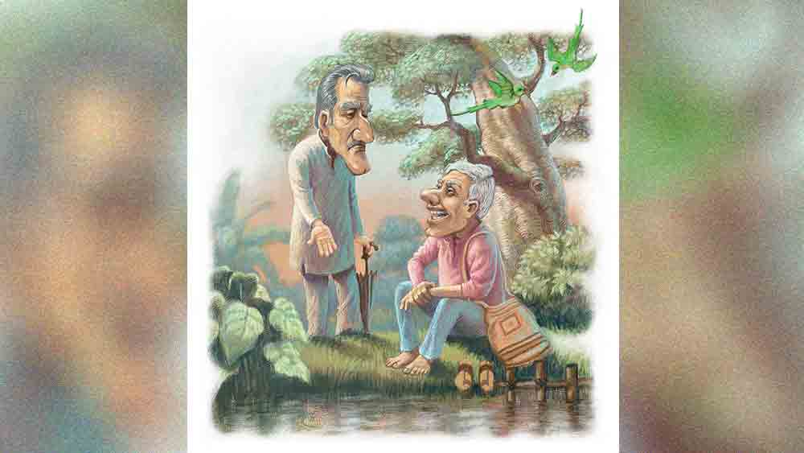

 

<h1 align=center> প্রার্থী</h1>
<h2 align=center>চৈতালী বন্দ্যোপাধ্যায়</h2>
আজ যা গরম, টেকা মুশকিল! উফ! সারা গা যেন চিটচিটে লাগছে।”   “গরম আবার কোথায় দেখলেন? দিব্যি দখিনা হাওয়া দিচ্ছে, তার ওপর পুকুরপাড় বলে কথা, গাছের পাখিরা কিচিরমিচির করছে, বেশ আরামদায়ক পরিবেশ তো মশাই।”   “ওই ছোট ডোবাটাকে আপনার পুকুর মনে হল! যেমন কেলেকুষ্টি জল, তেমন পচা গন্ধ। ওই ছাল ছাড়ানো নিমগাছটায় বসে একটা শালিক তখন থেকে ক্যাঁ ক্যাঁ করে কান ঝালাপালা করে দিচ্ছে, আর আপনি কিচিরমিচির শুনতে পাচ্ছেন? বলি চোখে-কানে কি ন্যাবারোগ হয়েছে আপনার?”   “এই সামনের মাঠটায় কত বাচ্চা ছেলেমেয়ে খেলছে... তাদের মিষ্টি কলরব কেমন সুন্দর লাগছে না?”   “আমি তো দেখতে পাচ্ছি তিন-চারটে অতি ব্যাদড়া বাচ্চা মারপিট করছে আর বিতিকিচ্ছিরি চিৎকার করে চলেছে। কানের পোকা বের করে দেওয়ার উপক্রম!”   “আর ওই যে দেখুন গোলাপি রঙের শাড়ি পরা এক সুন্দরী মহিলা এই দিকেই এগিয়ে আসছেন।”   “আজ্ঞে না, উনি একটা ছেলের কান ধরে টানতে টানতে বাড়ি নিয়ে যাচ্ছেন, আর ছেলেটা প্রবলবেগে হাত পা ছুড়ছে।”   “আহা, অত বেরসিক কেন আপনি? কল্পনাশক্তি বলেও তো একটা ব্যাপার আছে নাকি। আমি তো মাঝে মাঝেই এই পুকুরটাকে ভেনিসের ব্যাকওয়াটার ভেবে নিই, আর ওই যে সুপুরি গাছের শুকনো ডালটা পড়ে আছে, ওটাকে গন্ডোলা ভাবলেই বা ক্ষতি কী? আপনিও একটু কষ্ট করে ভেবে দেখুন, ভেনিসের পুরনো বাড়িগুলোর পাশ দিয়ে গন্ডোলা চড়ে যাচ্ছেন, বেশ থ্রিলিং একটা ব্যাপার হবে দেখবেন।”   “আচ্ছা নমস্কার, আসি তা হলে। আপনি বসে বসে গন্ডোলা চড়ুন, কোকিলের কুহু কুহু শুনুন, আমি গাঁজাটাজা খেতে পছন্দ করি না।”   “গাঁজা কোত্থেকে এল! এ তো বিশুদ্ধ কল্পনাশক্তি মশাই। সময়টাকে কাজে লাগান! চাই কি এক দিন বড় লেখকটেখকও  হয়ে যেতে পারেন।”   “আপনার আসে নাকি? মানে, লেখাটেখা? কোথাও পাবলিশ হয়? কী লেখেন, ছোটদের না বড়দের? গল্প না কবিতা? রহস্য না প্রেম?”   “বাবা রে! এ তো একবারে রেলগাড়ি চালিয়ে দিলেন।”   “না, আসলে বড় দুঃখের জায়গায় আঘাত করে ফেললেন তো, তাই বেসামাল হয়ে পড়েছি আর কী।”   “দুঃখের জায়গা মানে? লেখার অভ্যেস আছে নাকি আপনার?”   “রাম বলো! ওই অখাদ্যি লেখকগুলোর জন্যই তো আজ আমার এই অবস্থা, সব যেন সাপের পাঁচ পা দেখেছে! আমার হাতে যদি ক্ষমতা থাকত না, আমি লেখার ওপর ট্যাক্স বসিয়ে দিতাম, লেখকদের ধরে ধরে এনে জেলে পুরে দিতাম, আরও কী কী যে করতাম... এখন মাথায় আসছে না।”   “তা হলে তো খুবই দুর্ভাগ্য দেখছি লেখকদের।”   “আপনি হাসছেন! হাসুন, হাসুন, আপনাদের আর কী? পৈতৃক ব্যবসা চালাতে গেলে বুঝতেন!”   “আমার আবার ব্যবসায়ী শুনলে খুব সম্ভ্রম জাগে! কত হিসেবনিকেশ করে চলতে হয়, কত কিছু মাথায় রাখতে হয়। আমার মতো অঙ্কে ল্যাবাডোশ হলে ব্যবসা উল্টে যেত, সে যতই পৈতৃক হোক না কেন।”   “আমার অবস্থা যে খুব ভাল, সেটাই বা আপনি ধরে নিচ্ছেন কেমন করে? ওই হাড়হাভাতে লেখকদের জন্য ব্যবসা করবার জো আছে?”   “আচ্ছা, লেখকরা আপনার কোন পাকা ধানে মই দিয়েছে বলুন তো? তারা তো আকাশের রং আর বাতাসের গন্ধ নিয়ে জীবন কাটিয়ে দেয়, থালায় শুক্তো পড়লেও মাংস ভেবে খেয়ে উঠে যায়, বর্ষার দিনে ছাতা ছাড়াই বেড়াতে বেরোয়, জামাইষষ্ঠীর নেমন্তন্ন ভুলে মেরে অফিস চলে যায়, পদে পদেই লাঞ্চিত হতে হয় তাদের... আহা রে, চোখে জল এসে গেল মশাই!”   “একদম ওই ভুলটি করবেন না। ওই উনপাঁজুরে, পাজির পা ঝাড়া, নৃশংস, নরাধম, হতভাগা প্রাণীদের জন্য আমি আজ এখানে বসে মশার কামড় খাচ্ছি।”   “তাই ভাবছি, আপনাকে তো এদিকে কোনও দিন দেখিনি, বাড়ি কোথায় আপনার?”   “অনেক দূর, সেই বাঁশবেড়ে।”   “তা এত দূর থেকে এই বেহালায় মশার কামড় খেতে এলেন কেন? আপনাদের ওখানকার মশারা কি কামড়াতে ভুলে গেছে? নাকি তারাও ডায়েট কন্ট্রোল করছে?”   “দায়ে পড়ে এসেছি, বুঝলেন?”   “এই সুন্দর জায়গায় কেউ দায়ে পড়ে আসে! আমি তো নাতনিকে নাচের স্কুলে ঢুকিয়ে দিয়ে এইখানে বসে বসে কত রকম চিন্তা করি, প্রকৃতির শোভা দেখি, সময়টা বেশ ভালই কেটে যায়।”   “হাতে অঢেল সময় থাকলে কাটানোর উপায় খুঁজে বেড়াতে হয় লোকের, আমার তো আর তা নয়, এক অবিমৃষ্যকারী লেখকের জন্য আজ আমার এই দশা।”   “বেশ ইন্টারেস্টিং ব্যাপার তো, শুনি শুনি।”   “ব্যাটা আজ এক মাস হল আমার নাকে দড়ি দিয়ে ঘোরাচ্ছে, কিছুতেই উপন্যাসের পরের পার্টটা দিচ্ছে না, ওদিকে পাঠকদের গালাগালি খেতে খেতে আমার কানে চড়া পড়ে গেল। পত্রিকাটাই না বন্ধ হয়ে যায়।”   “উপন্যাসের পার্ট? ও, আপনি পত্রিকা চালান? সম্পাদক নাকি?”   “না, না, সম্পাদকের দায়িত্ব নিবারণ সামলায়। আমি ওসব পারি না। সারাদিন গাদাগুচ্ছের কবিতা, গল্প, ভ্রমণকাহিনি এসে জমা হচ্ছে, অত পড়া আমার পোষায়  নাকি!”   “বুঝেছি, আপনি তা হলে মালিক, পত্রিকার ব্যবসা করেন। বাঃ, খুব ভাল!”   “আর ভাল! আমার ইচ্ছে ছিল না একদম, বিশ্বাস করুন। বেশ চাকরিবাকরি করতাম, টিভি দেখতাম, ছুটির দিনগুলো কাটিয়ে আসতাম পাহাড়েটাহাড়ে, বেকার ঝামেলায় জড়াব না বলে বিয়ে পর্যন্ত করিনি জানেন? কিন্তু কপাল যেদিকে নিয়ে যাবে, সেদিকেই যেতে হবে তো!”   “ইচ্ছে ছিল না, তবু পত্রিকা চালাতে লেগে পড়লেন?”   “বললাম না বাবার ব্যবসা। অনেক কষ্টে বাবা এই মাসিক পত্রিকাটা চালু করেছেন। প্রচুর কপি বিক্রি হয়। আর সেখানেই গন্ডগোল।”   “বিক্রি হলে আবার গন্ডগোল কোথায়? এক বার কলেজে পড়ার সময়, অনেকের মতো আমরাও পত্রিকা বের করেছিলাম। তা ছাপাখানার ধার শোধ করতে গিয়ে মায়ের একজোড়া দুল চলে গিয়েছিল বলে বাবা হামানদিস্তা নিয়ে তাড়া করেছিল, আর ও পথে যাইনি।”   “তার পর আর লেখেননি?”   “সেই বয়েসে একটু লেখার শখ হয়েছিল বুঝলেন? কত বার কত পত্রিকা অফিসে গেছি, কেউ পাত্তাই দেয়নি। এমন ব্যবহার করেছে, যেন আমি তাদের কাছে ভিক্ষে চাইতে গেছি, নামীদামি না হলে তারা পাত্তা দেয় না, সেই জন্যই আর…”   “সে যাক গে, বাদ দিন। ‘মনের আরাম’ পত্রিকার  নাম শুনেছেন? ওটাই আমাদের।”   “বিলক্ষণ শুনেছি, আমাদের বাড়িতে প্রতিমাসেই আসে।”   “তাতে নীলাম্বর সেনের রহস্য উপন্যাস ‘দুর্দান্ত শত্রু’ পড়ছেন?”   “কেন বলুন তো?”   “আরে, ওই নীলাম্বর সেন লোকটা একের নম্বরের বদমাইশ। অন্তত দশ বার তার বাড়িতে লোক পাঠিয়েছি পরের পার্টটার জন্য, শুধুই ঘুরিয়ে যাচ্ছে। ওদিকে উপন্যাসের নায়ক ঝড়ের রাত্তিরে  সেই যে খালি হাতে ভিলেনের মুখোমুখি হয়েছে, ভিজে গা, মাথা থেকে বেদানার ফোঁটার মতো রক্ত ঝরছে, আর নায়িকা ভিতু পায়রার সুরে কাঁদছে... এতটার পর আর দিচ্ছে না, কী সাংঘাতিক লোক দেখেছেন!”   “বাবা! মুখস্থ করে ফেলেছেন তো দেখছি! খুব ভাল লাগছে নিশ্চয়ই উপন্যাসটা?”   “দূর দূর! একদম খাজা লেখা। কিন্তু পাঠকদের কে বোঝায়? আজ এই এক মাস ধরে আমার ফোনে হুমকি দিচ্ছে তারা, পত্রিকা উঠে যাওয়ার জোগাড়। এক বার ভাবলাম দিই তুলে, মা অশান্তি আরম্ভ করল। বাবার স্মৃতি তো।”   “অন্য কাউকে ধরে লিখিয়ে নিলেই পারতেন, আপনাদের হাতে তো অনেক লেখক, কবি। তাদের মধ্যে কেউ লিখে দিত নিশ্চয়ই।”   “আরে বাবা, কেউ রাজিই হল না। বলে ওঁর মতো নাকি কেউ লিখতে পারবে না। তখন ভাবলাম নিজেই লিখে ফেলি পরের পার্টটা, নায়কটাকে ভিলেনের হাতে খুন করিয়ে উপন্যাস শেষ করে দিই। নিবারণ ভয় দেখাল, আমিই নাকি পাঠকদের হাতে  খুন হয়ে যেতে পারি। তখন বাধ্য হয়ে নিজেই এলাম ঠিকানা খুঁজে খুঁজে, তা তিনি শুনলাম বেরিয়েছেন, ঘণ্টাখানেক পর ফিরবেন। তাই এই ফাঁকা জায়গাটায় এসে একটু বসেছি।”   “তা লেখকের সঙ্গে আগে থেকে পরিচয় নেই বুঝি? মোবাইল ফোনের নাম্বার টাম্বার নেই?”   “কিচ্ছু নেই মশাই। উনি বরাবর লেখা পাঠিয়েছেন, পছন্দ হয়েছে, ছাপাও হয়েছে, ঠিকানায় চেক পাঠিয়ে দিয়েছি। উনি কখনও আমাদের অফিসে যাননি। ফলে চোরে-কামারে কোনও দিনই, বুঝলেন কি না...”   “দেখা হয়নি, বুঝলাম। তা এক ঘণ্টা তো প্রায় হয়েই এল, এবার আবার যাবেন তো লেখকের বাড়ি?”   “যাই দেখি, যেতে তো হবেই। নীলাম্বর সেন আর কত ঘোরায় দেখি! আমি আবার শুগারের রোগী, ঘন ঘন খিদে পেয়ে যায়।”   “এই বয়েসে শুগার ধরালেন? অনেক ছোট আপনি আমার থেকে, ব্যায়াম ট্যায়াম করেন না?”   “দূর মশাই ব্যায়াম! পত্রিকাটা সামলাই আগে।”   “হ্যাঁ, তা তো বটেই।”   “আচ্ছা, এদিকটায় কাছেপিঠে দোকান টোকান নেই? এই ধরুন শিঙাড়া অথবা চপ-টপের?”   “আপনি আমার বাড়িতেই চলুন না। এই তো আমার নাতনি নাচের ক্লাস থেকে চলে এসেছে, চলুন এক কাপ চা খেয়ে নেবেন। আর সামনের মিঠুর দোকানের লড়াইয়ের চপ, সে বড় সোজা জিনিস নয় মশাই, লাইন লেগে যায় রোজ।”   “এই রে! এখন আবার লাইন দিতে হবে নাকি! চপের দরকার নেই, আপনি শুধু চা-বিস্কুট দেবেন, তা হলেই হবে।”   “মিঠুর দোকানে বলা থাকে আমার, এত ক্ষণে একঠোঙা চপ পৌঁছে গেছে আমার বাড়িতে। সঙ্গে মুড়ি চলবে তো? আচারের তেল দিয়ে মেখে? আমার ছোট বৌমা আচারটা যা করে না, মুখে লেগে থাকে।”   “আপনি তো কালপ্রিট দেখছি, খিদের সময় ওই সব বলে কেউ! জিভে জল এসে গেল তো।”   “নিন, একটু জোরে পা চালান তো দেখি, ঝড় আসছে মনে হয়, বাতাসের বেগ বেড়ে গেল না?”   “এই সেরেছে, তা হলে থাক! আপনার বাড়ি না হয় অন্য আর এক দিন যাওয়া যাবে, এখন লেখকটার বাড়ি না গেলে উপন্যাসের তাগাদা দেওয়া যাবে না!”   “আরে চলুন চলুন, কালো মেঘে ছেয়ে গেছে আকাশ, তার মধ্যে কেউ অচেনা লোকের বাড়ি যায় নাকি?”   “কী মুশকিল রে বাবা! আপনিও তো অচেনা লোক, আমরা কেউ কারও নাম পর্যন্ত জানি না। দু’জনের কেউ তো চোরছ্যাঁচড়ও হতে পারে।”   “বাবা, এত ক্ষণ পরে এই সব কথা আপনার মনে এল! এর পরে ভেজা গায়ে হ্যাঁচ্চো হ্যাঁচ্চো করতে করতে বাড়ি ফিরবেন, চপ, চা কিচ্ছু জুটবে না, সেটা ভাল হবে?”   “আরে! হাত ধরে টানছেন কেন? পড়ে যাব তো! ওই দেখুন, আপনার নাতনি দেখছি ফিকফিক করে হাসছে, খুব মজা পেয়েছে বোধহয়। আপনি কি প্রায়ই লোক ধরে চা খাওয়াতে নিয়ে যান নাকি?”   “না, না, তা কেন? তবে আপনাকে আমার খুব ভাল লেগে গেছে বুঝলেন! সমগ্র লেখকজাতি এই কচি বয়সে আপনাকে যে কী দুর্দশায় ফেলেছে, সেই কষ্টের কথা শুনে এক কাপ চা আর লড়াইয়ের চপ তো আপনাকে খাওয়াতেই হয়।”   “কচি কাকে বলছেন? ষাট পেরিয়ে গেলাম গত মাসে।”   “আমার থেকে পাক্কা দশ বছরের ছোট আপনি।”   “সে যাই হোক, ঝড়টা তো প্রায় এসেই গেল, কদ্দূর আপনার বাড়ি?”   “এই তো! নিন আসুন, এই আমার ছোট্ট কুঁড়েঘর।”   “আরে! এটাই তো সেই নীলাম্বর সেনের বাড়ি, এখানে নিয়ে এলেন কেন? চেনেন নাকি লোকটাকে?”   “খুব চিনি, একান্ত আপন বললেও কম বলা হয়।”   “কী কাণ্ড! আপনার সামনে কত কী বললাম লোকটার নামে, আপনি আবার বলে দেবেন না যেন।”   “আরে না না, তা কখনও বলি! আপনি বসুন, চপ-মুড়ি খান, তার পর না হয় উপন্যাসের পরের পার্টটা দিয়ে দেব আপনাকে গড়গড়িবাবু।”   “অ্যাঁ! আপনি আমার নাম জানলেন কেমন করে? উপন্যাস দেবেন বলছেন... তার মানে আপনিই কি নীলাম্বরবাবু?”   “আজ্ঞে বাবা ভালবেসে ওই নামটাই রেখেছিলেন বটে।”   “আপনি তো সাঙ্ঘাতিক লোক! এত ক্ষণ ধরে নিজের নিন্দেমন্দ শুনে গেলেন, ছি ছি! কিছু মনে করবেন না প্লিজ়, আসলে চিন্তায় মাথার ঠিক থাকে না সবসময়।”   “আহা! আপনার অত কিন্তু কিন্তু করার কিচ্ছু নেই, দোষটা তো আমারই। কত ঝামেলা পোহালেন আপনি। গত মাসে বড় ছেলের কাছে লন্ডনে গিয়েছিলাম, তার পর ইউরোপের কয়েকটা দেশ ঘুরতে গিয়ে দেরি হয়ে গেল উপন্যাসের পার্টটা দিতে। সবে পরশু ফিরেছি, এসেই আগে শেষ করেছি। এই নিন, ধরুন। আমি আবার কাগজে-কলমে না লিখলে তৃপ্তি পাই না, পুরনো দিনের মানুষ তো। সঙ্গে এই চিঠি, সময়মতো উপন্যাসের কিস্তি না দিতে পারার কারণ বিশদে জানিয়ে ক্ষমা চেয়েছি। হাতে হাতেই দিয়ে দিলাম।”   “আহা আবার চিঠিফিটির কী দরকার ছিল... তবে পরের পার্টগুলো নিতে কিন্তু আমিই আসব, আপনার পাড়ার এই লড়াইয়ের চপ আর আমতেল মাখা মুড়ির লোভে।”   “অলওয়েজ় ওয়েলকাম স্যর... দি প্লেজ়ার ইজ় অল মাইন!”