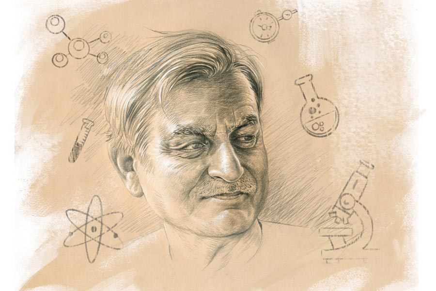

 
 <h1 align=center>প্রায়শ্চিত্ত</h1>
<h2 align=center>গৌতম বন্দ্যোপাধ্যায়</h2> ঘোষকের ঘোষণাপর্ব শেষ। পোডিয়ামে আসার কথা দীপ্তিময় সেনগুপ্তর। দর্শক শ্রোতৃমণ্ডলী অপেক্ষা করে আছে অনুষ্ঠানের প্রধান অতিথি দীপ্তিময় সেনগুপ্তর বক্তব্য শোনার জন্য। মঞ্চের সামনে সার-সার চেয়ার পাতা। সেখানে উপবিষ্ট অনেকে শুধু দীপ্তিময় সেনগুপ্তকে দেখার লোভেই এসেছেন। সকলের বসার জায়গা হয়নি। তাই অনেকেই দাঁড়িয়ে। কর্তৃপক্ষ ভাবতে পারেনি, এত লোকসমাগম হবে। ভাবতে পারলে হয়তো আরও কিছু চেয়ারের বন্দোবস্ত করত।

স্কুলের বার্ষিক পুরস্কার বিতরণী ও সাংস্কৃতিক অনুষ্ঠানে প্রধান অতিথি হিসেবে দীপ্তিময় সেনগুপ্তকে আমন্ত্রণ জানানোর প্রস্তাবটি দেন প্রধান শিক্ষক অনরণ্য সমাজপতি। সাধারণত সভার সভাপতি হিসেবে প্রধান শিক্ষক কোনও প্রস্তাব দেন না। শিক্ষকদের মধ্যে থেকে যে সব প্রস্তাব আসে, তার থেকেই বেছে নেন। তার পর সেই প্রস্তাব সর্বসম্মতিক্রমে গৃহীত হয়। প্রধান অতিথির নামটা কার্ডে দেওয়ার আগে সংশ্লিষ্ট ব্যক্তির সঙ্গে এক বার কথা বলে তাঁর মতটা জেনে নেওয়া হয়। এটাই বরাবর হয়ে থাকে। তাই সভার সভাপতি প্রধান শিক্ষক প্রথমেই হঠাৎ একটা প্রস্তাব রাখবেন, এটা কেউ আশা করেননি। দু’-এক জনের ঝুলিতে আরও দু’-একটা নাম ছিল। তাঁরাও সমাজের বরেণ্য ব্যক্তি। কিন্তু প্রধান শিক্ষক নিজেই দীপ্তিময় সেনগুপ্তর নামটা করায় সকলেই কেমন যেন চুপসে গেলেন। অনুষ্ঠানের আহ্বায়ক প্রশান্ত মুখার্জি উঠে দাঁড়ালেন, বললেন, “আপনি কি স্যর, রসায়নে প্রিস্টলি পুরস্কার বিজয়ী দীপ্তিময় সেনগুপ্তর কথা বলছেন? শুনেছি, উনি কলকাতায় এসেছেন। হতে পারে উনি এই স্কুলের ছাত্র ছিলেন, তবু...আজ উনি এত বড় বিজ্ঞানী, আন্তর্জাতিক খ্যাতিসম্পন্ন মানুষ, আমাদের এই সামান্য অনুষ্ঠানে আসবেন?”

“সেটা আমার উপরেই ছেড়ে দিন,” বলে উঠে পড়েছিলেন হেডমাস্টার অনরণ্য সমাজপতি।

মিটিং শেষ হয়েছিল। তবু অনেকের মনেই প্রশ্ন ছিল, সত্যিই কি উনি আসবেন? অনেকেই এটাকে হেডমাস্টারের পাগলামি বলে মনে করেছিল। যদিও তাঁর সামনে দাঁড়িয়ে এ কথা বলার সাহস কারও হয়নি। ভদ্রলোকের ব্যক্তিত্বের সামনে সবাই যেন কেমন গুটিয়ে যান। আড়ালে অনেক কথা বললেও, হেডমাস্টারের সামনে স্পিকটি নট।

দেরি হচ্ছে দেখে ঘোষক আবার মাইক্রোফোনের সামনে এলেন এবং ঘোষণা করলেন, “এ বার বক্তব্য রাখবেন আমেরিকা থেকে সদ্য আগত, রসায়নে প্রিস্টলি পুরস্কার বিজয়ী, আন্তর্জাতিক খ্যাতিসম্পন্ন বিজ্ঞানী ও গবেষক মাননীয় দীপ্তিময় সেনগুপ্ত। রসায়নে গুরুত্বপূর্ণ অবদানের জন্য ‘আমেরিকান কেমিক্যাল সোসাইটি’ তাঁকে এই বিশেষ পুরস্কারটি প্রদান করেছে। আমরা গর্বিত তাঁর মতো এক জন বড় মাপের মানুষ আমাদের এই ছোট অনুষ্ঠানে প্রধান অতিথির পদটি অলঙ্কৃত করেছেন। বিদ্যালয় তাঁর কাছে কৃতজ্ঞ। ডেকে নিচ্ছি সেই মহান মানুষটিকে— বিজ্ঞানী দীপ্তিময় সেনগুপ্তকে।”

দীপ্তিময় সেনগুপ্ত উঠলেন। লম্বা দোহারা চেহারা। মুখে মৃদু হাসি। রিমলেস চশমার কাচে নীলচে সবুজ আভা। বুদ্ধিদীপ্ত চোখমুখ। ধীর পায়ে এগিয়ে চললেন পোডিয়ামের দিকে। ঝলসে উঠল আলোকচিত্রীদের ক্যামেরার লেন্স। শুরু হয়ে গেল বিভিন্ন নামী-অনামী কাগজের এবং বৈদ্যুতিন মাধ্যমের সাংবাদিকদের ব্যস্ততা। দীপ্তিময় সেনগুপ্ত এই রকম মফস্‌সলের একটি স্কুলের অনুষ্ঠানে আসছেন, এটা সকলের কাছেই অপ্রত্যাশিত। এমনিতেই ভদ্রলোক ভীষণ ক্যামেরা-শাই। মিডিয়াকে এড়িয়ে চলেন। এখনও পর্যন্ত তার সম্পর্কে বিশেষ জানা যায়নি। নিজেকে গুটিয়ে রাখেন ভদ্রলোক।

ভারতীয়রা, বিশেষ করে বাঙালিরা বিপুল আনন্দ পেয়েছে। চায়ের দোকান থেকে রেস্তরাঁ, স্কুল-কলেজ সব জায়গায় আলোচনার মূল বিষয় হয়ে উঠেছেন দীপ্তিময় সেনগুপ্ত। কিন্তু যাঁকে নিয়ে এত আলোচনা, তিনি খুবই উদাসীন এ ব্যাপারে। যেন কিছুই ঘটেনি। প্রিস্টলি পুরস্কারজয়ীর কলকাতা আগমনে বাঙালি আপ্লুত হয়েছে। রাজ্য সরকারের তরফে তাঁকে সংবর্ধনাও দেওয়া হবে। শোনা যাচ্ছে, সেই অনুষ্ঠানেও নাকি তাঁর বিশেষ মত নেই। সেই দীপ্তিময় সেনগুপ্ত মফস্‌সলের এই অনামী স্কুলে এসেছেন প্রধান অতিথি হয়ে! অবিশ্বাস্য। ভীষণ অবিশ্বাস্য।

মাইক্রোফোনটা এক হাতে চেপে ধরলেন দীপ্তিময় সেনগুপ্ত। তাকিয়ে রইলেন স্থির দৃষ্টিতে সামনের দিকে। তার পর বলতে শুরু করলেন— “প্রথমেই আমি মাননীয় ঘোষক মহাশয়ের দু’-একটি ভুলের প্রতি আপনাদের দৃষ্টি আকর্ষণ করছি। ওঁর কথায়, এই ছোট অনুষ্ঠানে আমার মতো এক মহান মানুষ এসেছেন বলে ওঁরা গর্বিত। আমি একটু উল্টো করে বলি। আমার মতো এক জন সামান্য মানুষকে আজকের অনুষ্ঠানে আপনাদের মধ্যে একটু স্থান দিয়েছেন বলে আমি আপনাদের প্রতি কৃতজ্ঞ।”

হাততালির শব্দে মুখরিত হল চার দিক। দীপ্তিময় সে দিকে তাকিয়ে রইলেন অপলক। হাততালির শব্দ ক্ষীণতর হলে তিনি আবার শুরু করলেন, “খুবই গরিব ও নিম্নবিত্ত পরিবারে আমার বেড়ে ওঠা। চাইলেই সব কিছু পেতাম না। কলোনিতে থাকতাম। পূর্ববঙ্গ থেকে আগত অন্য অনেক ছিন্নমূল পরিবারের সঙ্গে। বাবা একটি প্রেসে চাকরি করেন। সামান্য আয়। তাই দিয়ে সংসার নির্বাহ। খারাপ ছাত্র ছিলাম না। খুব চেষ্টা না করেও প্রথম তিনে থাকতাম। সেই সুবাদে সব শিক্ষকদের কাছেই খুব পরিচিত ছিলাম। ভাল ছাত্রদের মতো বই মুখে গুঁজে বসেও থাকতাম না। ফুটবল ছিল আমার ধ্যানজ্ঞান। আমাদের স্কুলের ফুটবল টিমে নিয়মিত খেলোয়াড় ছিলাম। বিশ্বাস করুন, সেই সময় আমার একমাত্র লক্ষ্য ছিল ফুটবলার হওয়া। কলকাতার নামী ক্লাবে খেলা। শয়নে স্বপনে আমি দেখতাম ইস্টবেঙ্গল ক্লাবের জার্সি পরে খেলছি। আমার খেলা দেখতে হাজার হাজার লোক মাঠে জড়ো হয়েছে। রেডিয়োতে ধারাভাষ্য শুনছে লক্ষ লক্ষ মানুষ। তখন টেলিভিশন ছিল না, রেডিয়োই ছিল ভরসা। তাও সকলের ঘরে রেডিয়ো ছিল না।

“একটা ঘটনায় আমার সেই স্বপ্ন ভেঙে চুরমার হয়ে গেল। জীবনের গতিমুখ অন্য দিকে ঘুরে গেল। সেই গল্পটা করব বলেই আজ আপনাদের সামনে আসা...” দীপ্তিময় সেনগুপ্ত তাঁর রিডিং গ্লাসটা খুলে পোডিয়ামের ওপর রাখলেন। তার পর পকেট থেকে রুমাল বার করে চশমার কাচদুটো পরিষ্কার করে চোখে পরলেন। আবার শুরু করলেন, “বিজ্ঞান ছিল আমার প্রিয় বিষয়, যদিও সাহিত্য ও ইতিহাসও আমাকে আকর্ষণ করত। বিজ্ঞানের মধ্যে আবার প্রিয় ছিল রসায়ন। রসায়ন ল্যাবে ঢুকলে আর বেরোতে ইচ্ছে করত না। কত অ্যাপারেটাস, বিকার, টেস্টটিউব, বুনসেন বার্নার... কোনটা ছেড়ে কোনটা দেখি। মনে হত বাড়িতে যদি এ রকম একটা ল্যাব বানিয়ে ফেলা যায়! বুঝতাম, এটা ছেঁড়া কাঁথায় শুয়ে লাখ টাকার স্বপ্ন দেখা। তবু এই ইচ্ছেটা মনের গভীরে গেঁথে বসেছিল। ল্যাবে ঢুকলে, অবাক বিস্ময়ে তাকিয়ে থাকতাম অ্যাপারেটাসগুলোর দিকে। বেশ বুঝতে পারছিলাম যে, ক্রমশ আমি অবসেশনে চলে যাচ্ছি। একটা অসম্ভব ভালবাসা থেকে এই রকম অবস্থা হয়। ল্যাবের জিনিসপত্রগুলোকে আমি এই রকমই ভালবাসতাম। কতই বা বয়স তখন! অবসেশনের কী-ই বা বুঝি! এই অবসেশন যে আমার মধ্যে একটা লোভ সৃষ্টি করছে, সেটা বুঝব কী করে? একটা একটা করে ল্যাবের জিনিস চুরি করতে শুরু করলাম। হ্যাঁ, আজকের দীপ্তিময় সেনগুপ্ত সে দিন চুরি করতে শুরু করেছিল। কেউ বুঝতে পারে না কে চুরি করছে। অথচ, একে একে অনেক কিছুই চুরি হয়। দোষ হয় পিছিয়ে থাকা ছেলেদের। আমি ভাল ছেলে। কেউ কল্পনাও করতে পারে না আমি এ কাজ করতে পারি!”

থামলেন দীপ্তিময়। চশমা খুলে আবার পরলেন। একটু জল খেলেন। তার পর আবার বলতে শুরু করলেন— “সব অপকর্মেরই শেষ আছে। এক দিন ধরা পড়ে গেলাম বাবার কাছে। স্কুল থেকে সালফিউরিক অ্যাসিড আনতে গিয়ে হাত পুড়িয়েছিলাম। লুকোতে পারলাম না বাবার কাছে। সব বলতে হল। ভেবেছিলাম, বাবা প্রচণ্ড রেগে গিয়ে আমাকে কয়েক ঘা বসিয়ে দেবেন। সেই সময় বাবা, মা অথবা স্কুলের মাস্টারমশাইরা গায়ে হাত তুলবেন— এটা খুব স্বাভাবিক ঘটনা ছিল। কিন্তু বাবা ও সবের ধারকাছ দিয়েও গেলেন না। অনেক ক্ষণ আমার দিকে তাকিয়ে রইলেন। তার পর বললেন, “তুই চুরি করলি শেষ পর্যন্ত!” আমিও কিছু একটা বলার চেষ্টা করেছিলাম। পৃথিবীর সব অপরাধীরই আত্মপক্ষ সমর্থনে কিছু একটা বলার থাকে। হয়তো বলেছিলাম, আমি বুঝতে পারিনি বা ভুল হয়ে গেছে এমন কিছু। বাবা আমার কোনও কথাই শুনলেন না। দেয়ালে ঝোলানো একটা ছাতা নিয়ে বেরিয়ে গেলেন রাস্তায়। স্পষ্ট মনে আছে দিনটা ছিল রবিবার। সময় সকাল দশটা কি এগারোটা।

“বাবা ফিরলেন খানিক বাদে। সঙ্গে আমাদের হেডস্যর। বাবাকে দেখে নয়, হেডস্যরকে দেখে আমার বুকটা ধুকপুক করতে থাকল। এই বুঝি পেল্লাই একটা ধমকে আমার পিলে চমকে দেবেন। কিছুই করলেন না উনি। আমার চুরির সংগ্রহশালা দেখলেন। মুচকি হাসলেন। তার পর বললেন, ‘কই তোমার হাতটা দেখি।’ সালফিউরিক অ্যাসিডে পুড়ে যাওয়া আমার হাতের দিকে হেডস্যর তাকিয়ে রইলেন খানিক ক্ষণ। তার পর মুখ তুলে সরাসরি আমার দিকে চাইলেন। বললেন, ‘তুমি জানো, তোমার জন্য কী শাস্তি অপেক্ষা করছে?’ আমি কোনও কথা না বলে চুপ করে দাঁড়িয়ে রইলাম। উনি বলে চললেন, ‘টিসি। ট্রান্সফার সার্টিফিকেট নিয়ে তোমাকে অন্য স্কুলে চলে যেতে হবে।’ আমার কান্না পাচ্ছিল। অথচ, আমি কাঁদছিলাম না। বুকের ভেতর থেকে একটা কান্নার দলা উঠে আসছিল গলার কাছে। ‘আগামী কাল স্কুলে গিয়ে সার্টিফিকেটটা নিয়ে নিয়ো,’ হেডস্যর কেটে কেটে কথাগুলো বললেন।

“এই বার কান্নার দলাটা উঠে এল গলা দিয়ে। হেডস্যর আমার সজল চোখের দিকে তাকিয়ে রইলেন খানিক ক্ষণ। তারপর বললেন, ‘তোমাকে আমি একটা সুযোগ দিতে পারি, তবে শর্তসাপেক্ষে।’ অনেক আশা নিয়ে আমি তাকিয়ে রইলাম হেডস্যরের দিকে। উনি বললেন, ‘তোমাকে এগিয়ে যেতে হবে। সবাইকে ছাপিয়ে তোমাকে প্রমাণ করতে হবে— ইউ আর দ্য বেস্ট। পরবর্তী জীবনে বিজ্ঞানের সাধনায় নিজেকে নিংড়ে দিতে হবে। এতটুকু আলস্য, এতটুকু পিছুটানকে প্রশ্রয় দিতে পারবে না। ভবিষ্যতে গোটা বিশ্বের কাছে, যদি তুমি নিজেকে প্রমাণ করতে পারো, তা হলেই এই অপকর্মের প্রায়শ্চিত্ত করা হবে। এই শর্তে রাজি তুমি?’

আমি কী বলব, ভেবে পেলাম না। তাই চুপ করে দাঁড়িয়ে রইলাম। হেডস্যর আমার আরও কাছে এসে মাথায় হাত রাখলেন। বললেন, ‘আমার বিশ্বাস তুমি পারবে।’

“আমি সঙ্গে সঙ্গে বলে উঠলাম, আমি রাজি। আমি প্রমাণ করব— আই অ্যাম দ্য বেস্ট।

“প্রমাণ করেছিলাম। স্কুল ফাইনাল পরীক্ষায় সবাইকে টপকে আমি প্রথম হয়েছিলাম। স্কুল পরবর্তী জীবনেও হেডস্যরের সঙ্গে আমার যোগাযোগ ছিল। সব সময় উনি আমাকে উৎসাহ দিয়ে গেছেন। আমার দুঃখ, আমার এখনকার সাফল্য উনি দেখে যেতে পারলেন না।”

নিস্তব্ধ দর্শক শ্রোতৃমণ্ডলী। দীপ্তিময় সেনগুপ্তর মুখে ছড়িয়ে পড়েছে দীর্ঘ ভাষণের ক্লান্তি। রুমাল বার করে মুখের ঘাম মুছলেন। তার পর আবার বলতে শুরু করলেন, “সবাই জানেন আমি কোথাও যাই না। তবু ফিরতেই হল আমার স্কুলে, যেখানে আমি অপকর্মের স্মৃতি রেখে গিয়েছি। আমার ওই অপকর্মের কথা হেডস্যর ছাড়া স্কুলের আর কেউ জানত না। উনি আমাকে কথা দিয়েছিলেন, উনি কাউকে বলবেন না। আমাকেই স্বীকার করতে হবে আমার অপরাধের কথা। আজ দীপ্তিময় সেনগুপ্ত অতীতের অপরাধের কথা আপনাদের কাছে বলে হালকা হতে এসেছে। ক্ষমা চাইতে এসেছে তার কৃতকর্মের জন্য। আমার পিতৃপ্রতিম প্রধানশিক্ষক নন্দদুলাল গোস্বামী আমাকে আগেই ক্ষমা করেছেন। এখন আপনারা ক্ষমা করলেই আমি মুক্ত হব পাপবোধ থেকে।”

একটু থামলেন দীপ্তিময় সেনগুপ্ত। তার পর আবার শুরু করলেন, “আর একটা কথা, যে ল্যাবরেটরি থেকে আমি কিছু দ্রব্যসামগ্রী চুরি করেছিলাম, সেই ল্যাবরেটরির উন্নতি সাধনে ও আমার স্কুলের বিকাশে আমি পঞ্চাশ হাজার ইউএস ডলার দান করতে চাই। ভারতীয় মুদ্রায় যা পঁয়ত্রিশ লাখের কিছু বেশি। এটাকে দান হিসেবে মনে করবেন না আপনারা। মনে করুন, আমি আমার পাপের প্রায়শ্চিত্ত করলাম। জানি না, যে অন্যায় সেই ছোট বয়সে আমি করে ফেলেছিলাম, তার আদৌ কোনও প্রায়শ্চিত্ত আছে কি না। ধন্যবাদ। ভাল থাকবেন।”

বক্তব্য শেষ করে, আস্তে আস্তে ফিরে চলেছেন দীপ্তিময় সেনগুপ্ত। মুখে একটা বিষণ্ণ হাসি। দর্শক শ্রোতৃমণ্ডলী স্তব্ধবাক। একটা পিন পড়ার শব্দেও আওয়াজ হবে। ঘোষকের কণ্ঠস্বরে তাদের চমক ভাঙল... “আপনারা কি করতালি দিয়ে দীপ্তিময়বাবুকে অভিবাদন জানাবেন না?”

করতালিতে মুখরিত হল চার দিক। মঞ্চে হেডমাস্টারমশাই কানে কানে দীপ্তিময় সেনগুপ্তকে জিজ্ঞেস করলেন, “স্যর, আপনি যা বললেন, সব সত্যি?”

দীপ্তিময়বাবুর চশমায় নীলচে সবুজ ঝিলিক খেলা করে গেল, তিনি মৃদু হেসে ফিসফিস করে বললেন, “কে জানে! হয়তো সবই গপ্পো, তবে চেকটা সত্যি।”