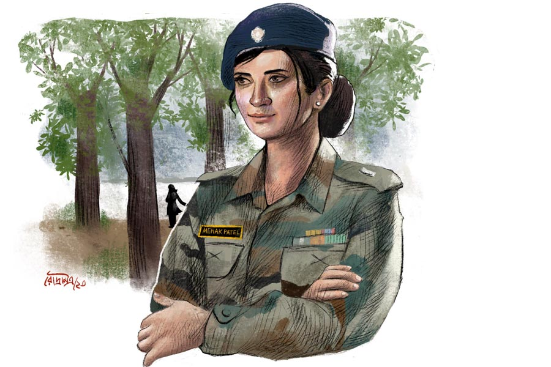

 
 <h1 align=center>প্রেমকুমার</h1>
<h2 align=center>শেখর মুখোপাধ্যায়</h2> এই রাজ্যে দীপকরা বেশ কয়েক পুরুষের বাসিন্দা। ঊনবিংশ শতকের শেষ দিকে তার ঠাকুরদার বাবা ইন্ডিয়ান মেডিক্যাল সার্ভিসে কভেন্যান্টেড অফিসার হিসেবে যোগ দেন। এই অঞ্চলে তিনি আসেন সার্জন-মেজর হয়ে। দীপকের বাবা আর ঠাকুরদাও ছিলেন ডাক্তার। দীপকও বছর কয়েক হল এক মহকুমা হাসপাতালে শল্যচিকিৎসক পদে যোগ দিয়েছে।

আদিতে উত্তর ও মধ্য ভারতে ছিল দুই বিরাট প্রদেশ। পরে সেগুলি ভেঙে অনেকগুলি ক্ষুদ্রতর রাজ্য সৃষ্টি করা হয়। এটিও তেমনই একটি নবীন রাজ্য। রাজ্যের মূলনিবাসীদের মাতৃভাষা হিন্দি হলেও, দীপকদের বাড়িতে বাংলাই বলা হয়। বাংলা বই এবং পত্রপত্রিকা নেওয়া হয়, পড়াও হয়। প্রায় দেড়শো বছর অতিক্রান্ত হলেও, শিকড়ের প্রতি এই টানটুকু থেকে গিয়েছে।

ফোন এল সদরের উপরওয়ালার কাছ থেকে। এলাকায় মোতায়েন আধাসেনা বাহিনীর এক অফিসার গুরুতর আহত, তাঁকে মহকুমা হাসপাতালে আনা হচ্ছে। দীপক যেন জরুরি ভিত্তিতে চিকিৎসার ব্যবস্থা তৈরি রাখে এবং ঘটনা যেন গোপন থাকে, বিশেষ করে আহত অফিসারের পরিচয় যেন জনসাধারণ জানতে না পারে। দীপক যথোচিত বন্দোবস্তে ব্যস্ত হল। মেট্রনকে নির্দেশ দিল ওটি প্রস্তুত করতে। 

ঘণ্টাখানেক পরে আধাসেনা বাহিনী আহত অফিসারকে হাসপাতালে পৌঁছে দিল। এক তরুণী, নাম মেহক পটেল, আইপিএস, আধাসেনা বাহিনীর অ্যাসিস্ট্যান্ট কমান্ড্যান্ট। জঙ্গলে জঙ্গি গেরিলাদের সঙ্গে গুলির লড়াইয়ে আঘাত পেয়েছে। গুলি তার তলপেটে ঢুকেছে এবং পিঠ বা কোমর দিয়ে বেরিয়ে যায়নি, শরীরের ভিতরে আটকে আছে। আশ্চর্যের বিষয়, প্রচুর রক্তপাত ঘটলেও, ভিতরে যকৃৎ, পাকস্থলী, বৃক্ক, ইত্যাদি কোনও গুরুত্বপূর্ণ প্রত্যঙ্গ জখম হয়নি। কিন্তু গুলিটা এমন জায়গায় আটকে আছে যে, বার করতে গেলে সেগুলি ক্ষতবিক্ষত হতে পারে। সে ক্ষেত্রে মেহকের শরীর যোদ্ধার জীবনের অনুপযুক্ত হয়ে পড়বে এবং সে বাহিনীর সক্রিয় কর্মী পদে বহাল থাকবে না। যে কোনও পরিস্থিতিতেই, গুলিটা অবিলম্বে বার করতেই হবে। দেরি হলে ক্ষত পাকবে এবং শরীরে সংক্রমণ ছড়াবে। তাই তাকে রাজ্যের রাজধানীর হাসপাতালে তো বটেই, জেলা সদরের হাসপাতালে নিয়ে যাওয়ার ঝুঁকিও নেওয়া সম্ভব হয়নি। তরুণী প্রবল যন্ত্রণাতেও জ্ঞান হারায়নি। বলল, “ডক্টর, দেখবেন, বাহিনীতে যেমন ছিলাম তেমনই যেন থাকতে পারি।”

দীপক মাথা নাড়ে, “আমি যথাসাধ্য করব। তার পর উপরওয়ালার হাত।”

“আপনি ঈশ্বর মানেন?”

“মানি।”

“আমি মানি না। আমি এক চিকিৎসককে দেখছি, গো অ্যাহেড ডক্টর, সেন্ড মি ব্যাক টু দ্য ফিল্ড।”

দীপক তার চেম্বারে স্তব্ধ হয়ে বসে আছে। এটা মহকুমা হাসপাতাল। যন্ত্রপাতি, ওষুধপত্র, কর্মচারী, সবই সীমিত। জটিল এক অপারেশনে ছুরি হাতে নামতে হবে নিধিরাম সর্দারের মতো। প্রেমকুমার বলে, “কী করবি?”

“ভগবানের কাছে প্রার্থনা করছি। তাঁর হাত আর আমার হাতযশ।”

“মেহক কিন্তু তোর চেয়ে চার বছরের ছোট।”

“তো?”

“শি শুড নট ডাই।”

“শি ওন্ট ডাই।”

“মেহক ফোর্সে ওর জায়গা ফেরত চায়।”

“জানি। আই উইল ট্রাই।”

বাইরে থেকে দীপকের চেম্বারের দরজা খোলে কেউ। ঘরে ঢোকেন মেট্রন। বলেন, “স্যর, ওটি রেডি, টেকনিশিয়ানস, নার্সরাও রেডি।”

দীপক উঠে দাঁড়ায়, “চলুন।”

অপারেশনে সময় লাগে। মেহকের শরীর থেকে নির্বিঘ্নে বুলেট বার করা হয়। মেহক সম্ভবত বাহিনীতে ফিরতে পারবে। আরও মাস খানেক লাগবে নিশ্চিত হতে। সপ্তাহ খানেক পর হাসপাতাল থেকে ছাড়া পেয়েই মেহক সোজা যায় তার পরিবারের পরিচিত বিখ্যাত বিশেষজ্ঞ চিকিৎসকের কাছে।

দীপক বলে, “মেহক হাওয়া।”

প্রেম বলে, “তবে মনে হয় শি উইল বি ব্যাক।”

মাস খানেক পরে মেহক আসে। পরনে পুরোদস্তুর সামরিক পোশাক। দীপকের হাত ধরে বলে, “থ্যাঙ্কস সো ভেরি মাচ, ডক্টর। দিল্লি অল ইন্ডিয়া ইনস্টিটিউট অব মেডিকেল সায়েন্সেস-এর ডক্টর দেশমুখ বললেন, তিনি নিজে অপারেশন করলেও তা এত সাকসেসফুল হত কি না সন্দেহ!”

দীপক ম্লান হাসে, “ডক্টর দেশমুখকে বলবেন আই অ্যাম গ্রেটফুল টু হিম। তিনি সার্টিফাই না করলে তো আপনি কনভিন্সড হতেন না আমি কেমন ডাক্তার।”

মেহককে অপ্রস্তুত দেখায়, “তা কেন! আপনি শুধু আমার জীবন বাঁচাননি, ফোর্সে আমার জায়গা ফিরিয়ে দিয়েছেন। আমি ভাবলাম ডক্টর দেশমুখের প্রশংসায় আপনি খুশি হবেন।”

দীপক তাড়াতাড়ি বলে, “খুশি হয়েছি। কিন্তু, আপনি যে ফোর্সে ফিরতে পেরেছেন সেটাই আমার সবচেয়ে বড় প্রাপ্তি।”

দীপক প্রসঙ্গ বদলাতে সেই রাজ্যের রাজধানীর একটি স্কুলের নাম উল্লেখ করে বলে, “আপনি তো ওখানকার এক্স স্টুডেন্ট?”

“হ্যাঁ,” মেহককে অবাক দেখায়, “আপনি জানলেন কী ভাবে?”

“প্রেমকুমার বলেছে।”

“প্রেমকুমার কে?”

“আমার বন্ধু।”

“তাই! কিন্তু তিনি আমাকে চিনলেন কী করে?”

“জানি না,” দীপক কাঁধ ঝাঁকায়, “প্রেম একটু সিক্রেটিভ। সব কথা খুলে বলে না।”

“ও!” মেহককে আনমনা দেখায়।

“প্রেম, মেহক তোর বিষয়ে জানতে চাইছিল।”

“কী বললি?”

“বললাম, জানি না।”

“ঠিক করেছিস।”

“কিন্তু প্রেম,” দীপক বলে, “এ তো সেই আগের মতোই হল। মেহক আবার হারিয়ে যাবে।”

“তা যাবে,” দীর্ঘশ্বাস ফেলে প্রেমকুমার, “আবার হয়তো দেখা হয়ে যাবে পথের কোনও বাঁকে।”

“বার বার এমন হয় না, প্রেম।”

মেহক এ দিকে এলে দীপকের সঙ্গে দেখা করে। তাকে ডাক্তারবাবুর প্রতি খুবই কৃতজ্ঞ দেখায়। কিন্তু তার চেয়েও বেশি কৌতূহলী মনে হয় প্রেমকুমারের বিষয়ে। এক দিন দীপক জিজ্ঞেস করল, “আচ্ছা, আপনি তো পটেল, মানে, গুজরাতি কি?”

“আপনার বন্ধু প্রেমকুমার বলেননি আপনাকে?”

“না।”

“ঠিকই ধরেছেন, আমরা গুজরাতি। আমাদের এক পূর্বপুরুষ বহু আগে এই অঞ্চলে এসেছিলেন। পরিবারে বেশির ভাগই কারবারি। আমি জেদ করে ইউপিএসসি দিয়ে আইপিএস হয়েছি।”

“পটেল মানে তো…”

“হিন্দু হতে পারে, মুসলমানও,” মেহক বলে, “মেহক নামটাও দুই ধর্মের মানুষেরই হয়। আপনি কি আমার ধর্ম জানতে চান?”

“না,” দীপক ইতস্তত করে, “ঠিক তা নয়। আসলে, প্রেম বলছিল…”

“কী বলছিলেন?” মেহক প্রশ্ন করে, “আপনার ওই বন্ধু এখানে কী করতে আসেন?”

“আমার সঙ্গে দেখা করতে।”

“কী করেন উনি?”

“মিস পটেল,” দীপককে উদ্বিগ্ন দেখায়, “প্রেম সম্পর্কে আমিও ভাল জানি না। মাঝেমধ্যে এসে পড়ে।”

“আপনার বন্ধুকে বলবেন, সব কিছু আড়ালে বসে জেনে নেওয়া যায় না। সামনে আসতে হয়।”

সে দিন মেট্রন দীপককে বললেন, “স্যর, অ্যাসিস্ট্যান্ট কমান্ড্যান্ট ম্যাডাম আজ যাওয়ার সময় জিজ্ঞেস করলেন প্রেমকুমার নামে কেউ আপনার সঙ্গে দেখা করতে আসেন কি না। আমি বললাম, স্যরের সঙ্গে তো অনেকেই দেখা করতে আসেন, তাঁদের মধ্যে কে প্রেমকুমার আমি জানি না। ম্যাডামের বোধহয় বিশ্বাস হল না।”

“ঠিক আছে,” দীপক আশ্বস্ত করে মেট্রনকে, “আপনি ভাববেন না।”

“না, মানে, স্যর...” মেট্রন আমতা আমতা করেন, “এখানে তো অনেকেই নাম-পরিচয় ভাঁড়িয়ে চিকিৎসা করাতে আসে, তাদের সবাইকে আমরা চিনি না, কিন্তু স্থানীয়রা অনেকেই চেনে। যদি তেমন কারও বিষয়ে…”

“ম্যাডাম, আমরা হেলথ ওয়ার্কার। এটা সরকারি হাসপাতাল, দরজা সকলের জন্যে খোলা। আমাদের কাজ চিকিৎসা করা, গোয়েন্দাগিরি নয়। ওই কাজটা অ্যাসিস্ট্যান্ট কমান্ড্যান্ট সাহেবারাই করুন। আপনি টেনশন করবেন না।”

“প্রেম, তুই ভাই এ বার হাওয়া হয়ে যা।”

“তাতে কি তোর কিছু সুবিধে হবে?”

“না। কিন্তু, তুই থাকলে আমার অসুবিধে অনেক।”

“ভাই, এ বার তো একটু ঝুঁকি নিতে শেখ।”

“ঝুঁকি কিসের! আধার, প্যান, ভোটার কার্ড, ড্রাইভিং লাইসেন্স, সব কিছুতে আমার পরিচয় স্পষ্ট। তোর কী আছে,প্রেম? আমার সম্পর্কে মেহকের কোনও কৌতূহল নেই। সে কৌতূহলী তোর বিষয়ে।”

“তুই একটু জেলাস মনে হচ্ছে?”

“হ্যাঁ। আমি ওর সামনে আসি। অথচ, ও সব সময় চিনতে চায় তোকে,” দীপক কাঁধ ঝাঁকিয়ে বলে, “মেয়েদের আমি কোনও দিনই বুঝে উঠতে পারলাম না।”

“তুই বড্ড ভিতু। প্রেমিক হিসেবে তোর আত্মবিশ্বাস জ়িরো। মেহক আমার প্রেমে পড়েনি। আমাকে জঙ্গি, মাফিয়া কিংবা ওই রকম কিছু একটা ভাবছে। ভাবছে যুদ্ধক্ষেত্রে আমি ওর শত্রুপক্ষের এক সৈনিক।”

“সেও এক স্বীকৃতি। তোকে ও শত্রুতার যোগ্য মনে করছে। আর, আমাকে! ভদ্রলোক ডাক্তার, পুরোপুরি দুধভাত।”

“খেলা ঘুরিয়ে দিতে পারিস, দীপক। শুধু তোকে একটু সাহসী হতে হবে।”

“আপনার বন্ধু কী বলছেন?” এক দিন আবার জিজ্ঞেস করল মেহক।

“কে, প্রেম? এ দিকে আর আসে না।”

“বলবেন সারেন্ডার করতে,” মেহক গম্ভীর হয়ে বলে, “নইলে…”

“সামনে হয়তো আসত,” দীপক হেসে বলে, “যদি আপনার গায়ে পোশাক না থাকত।”

“মানে!” মেহক ভ্রু কুঁচকে চায়।

এই রে! সাহসী হতে গিয়ে ভুল হয়ে গিয়েছে! দীপক তাড়াতাড়ি বোঝায়, “মানে, আপনার পরনে যদি এই উর্দি না থাকত। বদলে, সিভিলিয়ান কিছু…”

“আচ্ছা। আমি আগামী কাল লেকের ধারে বিকেল সাড়ে চারটে থেকে পাঁচটা পর্যন্ত থাকব, উনি যেন অবশ্যই আসেন।”

“বলব। কিন্তু...” দীপক আমতা আমতা করে, “আসলে প্রেমের কোনও ভরসা নেই।”

“জানি,” মেহক বলে, “কাল যদি উনি না আসেন, আইনি পথে ব্যবস্থা নিতে হবে। ওঁর বিরুদ্ধে অনেক প্রমাণ আমার কাছে আছে।”

“ও রে বাপ রে! না না, প্রেম নিশ্চয়ই যাবে আপনার কাছে।”

সাড়ে চারটেয় লেকের পাড়ে পৌঁছল মেহক। পরনে নকশাদার রঙিন সালোয়ার-কামিজ। মিনিট পনেরো পরে এল এক যুবক। মেহক বলল, “এলেন তা হলে শেষ পর্যন্ত!”

“যা ভয় দেখিয়েছেন!”

“ভয় আপনার পাওয়ারই কথা,” মেহক বলে, “আমি যখন ক্লাস সেভেনে পড়ি তখন থেকে আপনি আমাকে চিঠি লিখে চলেছেন, এক নাবালিকাকে…”

“ক্লাস ইলেভেনে পড়ি, বয়স মাত্র ষোলো, আমিও তখন নাবালক। এক নাবালকের বিরুদ্ধে কি আইনি ব্যবস্থা নেওয়া চলে?”

“সে ব্যাপারটা না হয় আদালতে বিচারক বুঝবেন।”

“ওই চিঠিগুলো কোথায় আছে?”

“সব আমি রেখে দিয়েছি।”

“স-অ-ব!”

“সব। আর এখন তো আপনি আর নাবালক নন, অথচ ডাক্তারবাবুর কাছে নিয়মিত আমার বিষয়ে জিজ্ঞাসাবাদ করেন। ঝেড়ে কাশুন, মতলব কী?”

“ওই, চিঠিতে যা লিখতাম সেই একই মতলব।”

“তা হলে সামনে এসে সরাসরি বলতে কী হয়েছিল?”

“সাহস পাইনি। তা ছাড়া, এত চিঠি লেখার পরও তো আপনি তখন আমার বিষয়ে কোনও রকম আগ্রহ প্রকাশ করেননি।”

“করেছি। প্রেমকুমার নামে কাউকে স্কুলে খুঁজে পাইনি। ক’দিন আগে বরং জানলাম, ডাক্তারবাবুও ওই স্কুলেই পড়তেন।”

“আচ্ছা, কী করলে আমার অপরাধের প্রায়শ্চিত্ত হয়?”

“যে সব কথা চিঠিতে লিখতেন সেই কথাগুলো আজ মুখে বলুন।”

“ইয়ে মানে...” প্রেমকুমার আমতা আমতা করে, “আমি আবার পরিচয় গোপন করে লিখতে যত বীর, সামনাসামনি কথায় ততটা স্মার্ট নই। মনের ভাবটা শরীরের হাবভাবে প্রকাশ করে দেখাব?”

মেহক চোখ কপালে তুলে বলে, “বটে! দেখান।”

প্রেমকুমার তৎক্ষণাৎ মেহককে জড়িয়ে ধরে তার ঠোঁটে একটি গভীর চুমু বসায়। দীর্ঘ চুম্বন। জঙ্গল ঘেঁষে লেকের পাড়ে অলৌকিক ভাস্কর্য দেখায় যুগলকে। কিছু পরে ভাস্কর্য সচল হয়। দু’জনে পাশাপাশি লেকের জলে পা ডুবিয়ে বসে। মেহক জিজ্ঞেস করে, “তোমার নিশ্চয়ই কোনও ভাই নেই, যে কুম্ভমেলায় বা আর কোথাও হারিয়ে গেছিল?”

“না,” মাথা নাড়ে প্রেমকুমার, “আমি মা-বাবার একমাত্র সন্তান।”

“তাও ভাল।”

“উফ্‌ফ্‌! কী টেনশন গেল ক’দিন! এখন নিশ্চিন্ত,” প্রেম মেহকের কোলে মাথা রেখে শুয়ে পড়ে।

মেহক মাথার চুল পিছনে ঠেলে ঝুঁকে পড়ে প্রেমের মুখের উপরে। একটু হেসে বলে, “আশ্চর্য! তোমার সব কিছুর সঙ্গে ডাক্তার দীপকের হুবহু মিল। যদিও তোমরা যমজভাই নও।”