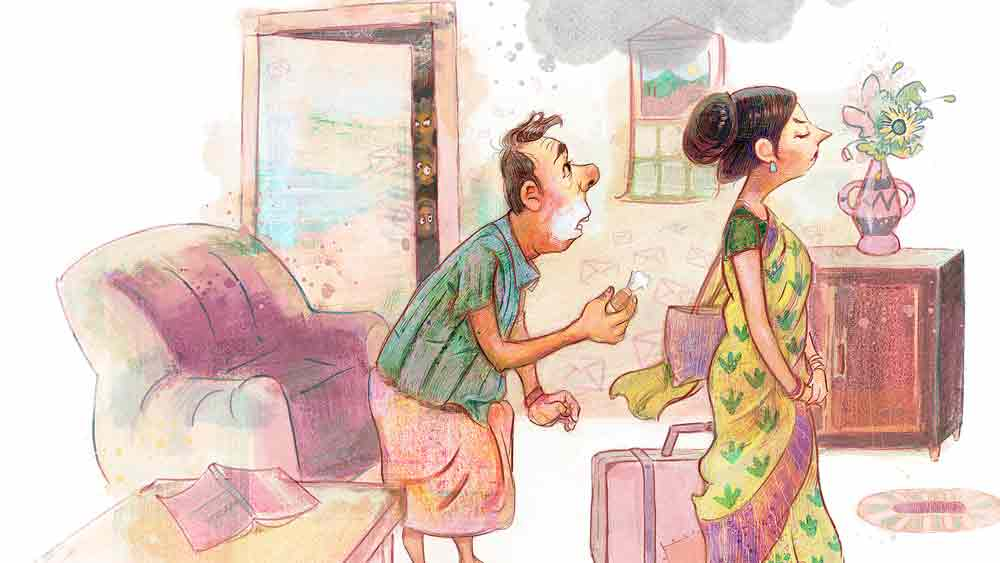

 

<h1 align=center> ফরোয়ার্ড-পাসে গোল</h1>
<h2 align=center>বিতান সিকদার</h2>
অশান্তিটা পাকল রানামামা লাঞ্চ করে অফিসে নিজের টার্মিনালে ফেরার পর। মেলের ইনবক্স খোলা। সাতষট্টিটা নতুন মেল। ঢেকুরটা তুলতে গিয়ে গিলে ফেললেন। আসার কথা পঞ্চাশটা, চলে এল সাতষট্টিটা! কিছু ক্ষণ হাঁ করে স্ক্রিনের দিকে তাকিয়ে থাকতে থাকতে আরও দুটো ঢুকে এল। এ কী! রানামামা ভাগ্নে আবিরকে ফোন লাগালেন, “কী রে, এ তো এসেই চলেছে।”   “আসতে দাও।”   “ফাজলামি মারিস না।”   বহু দিন ধরেই রানামামার মেলবক্স ভর্তি হয়ে নোটিফিকেশন এসে চলেছে— হয় খালি করুন, না হয় পয়সা দিয়ে আরও জায়গা কিনুন। খালি করা অসম্ভব। রানামামার যাবতীয় তথ্য ও নথি মেলে ঠাসা। তার মধ্যে এলআইসি-র প্রিমিয়াম সার্টিফিকেটও যেমন আছে, তেমনই পনেরো বছর আগের আদিসপ্তগ্রাম ভ্রমণের ছবিও আছে। কম্পিউটারে ভাইরাস ধরতে পারে, হার্ড ডিস্ক বা পেনড্রাইভ বিগড়োতে পারে এবং সিডি হারাতে পারে ধরে নিয়ে রানামামা মেলেই ভরসা রাখেন।   এখন, ভর্তি হয়ে গেলে কী করণীয় জানতে চাওয়ায় আবির বলেছিল— “অন্য মেল আইডি ক্রিয়েট করে এগুলো সেখানে ফরোয়ার্ড করে দাও।”   ভাল বুদ্ধি! কিন্তু কাঁহাতক ধরে ধরে পাঁচ হাজার মেল ফরোয়ার্ড করা যায়। এক সঙ্গে অনেকগুলো কী করে পাঠানো যায় জানতে চাওয়ায় লায়েক ভাগ্নে ‘গেঁড়িগুগলি’ বলে একটা সফট্ওয়্যারের খোঁজ দেয়। তাতে বিনা খরচে রোজ পঞ্চাশটা করে মেল একবারে ফরোয়ার্ড করা যাবে। আর তার বেশি চাইলে পয়সা দিতে হবে।   পঞ্চাশটাই যথেষ্ট ভেবে ইনস্টল করা হল। একেবারে প্রথম থেকে পঞ্চাশটা সিলেক্ট করে নতুন মেলের ঠিকানা টাইপ করা হল। অতঃপর ‘গো’। দিব্যি গুটিগুটি চলে যাচ্ছে দেখে সন্তুষ্ট হয়ে লাঞ্চে যাওয়া হল, এবং ফিরে এসে সাতষট্টিটা নতুন মেল দেখে হতবাক হওয়া হল!      আপাতত বাহাত্তর নম্বর ঢুকছে।   একটু ইতস্তত করলেন রানামামা। নিজে নিজেই… যাই হোক, যেহেতু তারই পুরনো মেল থেকে নতুন মেলে এসে ঢুকছে, ফলে শাপে বর। শুধু ব্যাপারটাকে কন্ট্রোল করা যাচ্ছে না, এই যা। এক বার ক্যানসেল করার অপশনও খুঁজলেন। পেলেন না।   যাকগে, দ্বিপ্রাহরিক কাজে মন দিলেন রানামামা— এবং সেই কাজ মাথায় উঠল বিকেল চারটে তেত্রিশে। অ্যাকাউন্টসের নরোত্তম দাস এসে রীতিমতো বাজখাঁই গলায় বললেন, “শ্রীকৃষ্ণের অষ্টোত্তর শতনাম পাঠিয়েছেন? তাও আমায়? হঠাৎ কৃষ্ণ আপনাকে এ মতি দিলেন কেন?”   নরোত্তম একে কড়াপাকের নাস্তিক, তায় ঠোঁটকাটা! রানামামা “হা মধুসূদন!” বলার সঙ্গে সঙ্গে ব্যাপারটা বুঝতে পারলেন। বহু প্রাচীন এক পুঁথি থেকে এই একশো আট নাম প্রায় আট বছর আগে ছবি তুলে মেলে সেভ করে রেখেছিলেন। গন্ডগোলটা ঠিক কোথায় পেকেছে, সেটা আন্দাজ করে তড়িৎ গতিতে পুরনো মেলটা খুলেই মামার চক্ষু চড়কগাছ হয়ে গেল।   মেল শুধু রানামামার সিলেক্ট করা নতুন অ্যাকাউন্টেই যাচ্ছে না— যত্র তত্র সর্বত্র ফরোয়ার্ড হয়ে চলেছে।   আশু বিপদ আঁচ করে আমতা আমতা করলেন, “না মানে ঠিক…”   “মানে-টানে আপনি বুঝুন। ওই কেষ্টই হোক আর বিষ্টুই হোক, আমার ঠিকানায় দয়া করে পাঠাবেন না। যত সব বস্তাপচা বিষয় নিয়ে— এই জন্যই দেশটার আর কিছু…”   রানামামার কান গরম হয়ে গেলেও চুপ করে রইলেন। বৈষ্ণবের রাগতে নেই। কিন্তু পরিস্থিতি রাগরাগিণীর ধারকাছ দিয়েও না গিয়ে সোজা বিরক্তিতে চলে গেল। তখন ঘড়িতে সাড়ে পাঁচটা। রানামামার সেজমাসি অর্থাৎ কিনা আবিরের সেজদিদু তাঁর মোবাইলে রঘুরাজপুরে তৈরি ‘একলাখি’ পটচিত্রের ছবি পেয়ে ফোন করে জিজ্ঞেস করছেন, “হ্যাঁ লা, ওই কী বলে বুটিক না কী যেন— ওই সব খুললি না কি?”   বিরক্তি পর্যবসিত হল ভয়ে যখন একতলার ফ্ল্যাটের অঘোর বড়াল ফোন করে জানতে চাইলেন, “আপনার রেডিফ মেইলের ইউজ়ার আইডি আর পাসওয়ার্ড আমায় পাঠাচ্ছেন কেন মশাই? টুকে রাখব?”   জরুরি তলবে সবাই পৌনে ছ’টাতেই বাগবাজার ঘাটে এসে জুটেছে। রানামামা হাঁ করে গঙ্গার দিকে তাকিয়ে বসে আছেন। আবির কাঁচুমাচু। পল্লব রানামামার ফোনটা নিয়ে দেখতে দেখতে জিজ্ঞেস করল, “এ সফ্টওয়্যার পেলে কোথায়?”   রানামামার চটকা ভাঙল। আবিরের দিকে তাকিয়ে ফুঁসে উঠলেন, “এই যে, গুণধর! পেয়ারের ভাগ্নে আমার। দ্বাপরে চিমটি কেটেছিলাম। তখন আমায় শেষ করেও আশ মেটেনি। কলিতেও বাঁশ দিয়ে চলেছে।”   বংশী আবিরকে একটা মৃদু ধমক দিয়ে বলল, “কোত্থেকে যে এ সব আপদ… যাক গে, পুলু আগে ওটা ডিঅ্যাক্টিভেট কর।”   পল্লব কিছুক্ষণ নেড়েচেড়ে বলল, “পারছি না।”   “ও কী কথা!”   ফটিক বলল, “দাঁড়া দাঁড়া, হিসেব ছিল পঞ্চাশটা যাওয়ার— তাই তো?”   “হ্যাঁ।”   “বেশি গেলে?”   “পয়সা কাটবে?”   “সব্বোনাশ! তা হলে এই যে একশো সাতচল্লিশ নম্বর যাচ্ছে, এতে কাটছে না কিছু?”   “কী ভাবে?” রানামামার মাথায় বাজ পড়ল।   আবির ঢোঁক গিলে বলল, “তাই তো! আচ্ছা, তুমি কোনও ব্যাঙ্ক ডিটেলস কিছু…”   “কই না তো।”   “কখনও অনলাইন ট্রানজ়্যাকশন করেছ ফোনে? মানে কার্ড দিয়ে…”   “হ্যাঁ, তা তো… মানে হামেশাই…”   “সে সব এরা কোনও ভাবে রিড করে টাকা কেটে নিচ্ছে না তো?”   মামা শিউরে উঠলেন, “এটাই বাকি ছিল!” তার পর ফের গঙ্গার দিকে তাকিয়ে হাল ছেড়ে দেওয়ার ভঙ্গিতে বললেন, “গেল… প্রভিডেন্ট ফান্ড, গ্র্যাচুইটি, সব চলে গেল!”   পল্লব আরও কষে মেল থামানোর উপায় খোঁজা শুরু করল এবং সন্ধে সাড়ে সাতটা নাগাদ প্রায় লুকিয়ে থাকা ডিঅ্যাক্টিভেট বোতামটা খুঁজে পেয়ে, সেটা টিপে দিয়ে তার পর নিঃশ্বাস নিল। পৌনে আটটায় নিকুঞ্জর দোকান থেকে চা খেয়ে সবাই বাড়ি চলে গেল…   আর সোয়া আটটায় রানামামা দেখলেন— দুশো তেরো নম্বর মেল নতুন অ্যাকাউন্টে এসে ঢুকছে।   সাড়ে আটটায় ফোনে কনফারেন্স। রানামামা চেঁচাচ্ছেন, “অশৈলী ব্যাপার। থামেনি! পুলু, থামেনি।”   আবার যুদ্ধকালীন পরিস্থিতি। পল্লব বলল, “তুমি কম্পিউটারে বসে রিমোট ডেস্কটপ অন করো শিগগিরি। ওহ্, কী যে পাকিয়ে বসলে…”   ফটিক, আবির, বংশী যে যার বাড়িতে স্ট্যান্ডবাই মোডে মেশিন অন করে বসে। ডিনার মাথায়।   প্রায় সোয়া ঘণ্টা গরু খোঁজার পর সবেধন নীলমণি ‘রিমুভ’ বোতামটা পাওয়া গেল। পল্লব সেটা টিপে দিতেই স্ক্রিনে দেখা গেল – ‘গেঁড়িগুগলি রিমুভড’। ঘরে তখন শুধু টেবিল ঘড়ির টিকটিক। রুদ্ধশ্বাস পরিস্থিতি। রানামামা ভয়ে ভয়ে বললেন, “আবার কিছু হবে না তো?”   পল্লব বলল, “লক্ষ রাখছি।”   এক মিনিট, দু’মিনিট, পাঁচ মিনিট, পনেরো মিনিট— নাহ্, আর কোনও মেল কোথাও যাচ্ছে না।   নিশ্চিন্ত!   তবে পুরোপুরি নিশ্চিন্ত হওয়া গেল না। আপদ যেতে যেতেও ছোবল মেরে গেছে। ন’টা দশে রানামামার বসের ফোন। ওপারে বজ্রপাত, “ছি ছি, আপনি এতটা ভিন্ডিকটিভ? না হয়, মোহনবাগান হেরেইছে এ বার। তাই বলে সাত বছর আগের ম্যাচের কথা তুলে সেই সংক্রান্ত এই জঘন্য গালিগালাজ দেওয়া লেখাটা পাঠিয়ে এ বারের জয় উদযাপন করছেন? ড্যাম ইট বোস, ড্যাম ইট…”   “স্যর…আমি…”   “কী আমি? একটা কথা প্লিজ় জেনে রাখুন। অফিশিয়াল মেল চালাচালির একটা ডেকোরাম আছে। আপনি সেখানে…”   “শুনুন স্যর…দয়া করে…”   “আপনি শুনুন। যে নিম্নরুচির পরিচয় আপনি দিয়েছেন…”   বাকিটা রানামামা স্রেফ নীরবে শুনে গেলেন।   রাত সাড়ে এগারোটাতেও সব ঠিকঠাক আছে কি না জানার জন্য ভাগ্নেরা মিলে মামাকে ফোন লাগাল। ডেভলপমেন্ট শুনে সবাই চুপ।   আবিরের প্রতি সম্ভাষণে ফটিকের মুখে তখন শ-কার ব-কার চলে আসছিল। নেহাত রানামামা লাইনে ছিলেন বলে…   শেষমেশ বংশী বলল, “যাকগে, আপদ বিদেয় করা গেছে। কাল রোববার। তুমি পরশু অফিসে ঢুকেই আগে মিটিয়ে নিয়ো।”   ফটিক রাগটা গিলে ফেললেও পল্লব আবিরের ওপর চেঁচিয়ে চলেছে, “দেখেছিস আপদ, কী জুটিয়েছিলি? তোর কাছে রাস্তা জানতে চাইল। তুইও আগুপিছু না দেখে এই দিকে ঠেলে দিলি…” আর ‘এই দিক’ যে আসলে কোন দিক, সেটা জানার জন্য রাত একটা চল্লিশ পর্যন্ত অপেক্ষা করতে হল।   তুলকালাম কাণ্ড!   রানামামি অর্থাৎ কি না রানামামার স্ত্রী রঙ্কিণী কালী হয়ে গেছেন। খাঁড়া খুঁজছেন! পারলে মামারই বুকের ওপর উঠে দাঁড়ান।   মামি উঠেছিলেন জল খেতে। হঠাৎ দেখতে পান, টেবিলে রাখা রানামামার ফোনে আলো জ্বলে উঠছে। কী ব্যাপার দেখতে গিয়ে দেখেন হোয়াটস্অ্যাপ। প্রেরক কোনও এক নিরুপমা। লিখছেন— “অরিন্দম, আপনার মেল পেয়ে মনটা ভরে গেল। সেই গান, ‘হৃদয়ের এ কূল ও কূল’। সত্যি, এখনও মনে আছে আপনার? স্বরলিপিটা এখনও অত যত্নে রেখে দিয়েছেন?”   ব্যস! নিমেষে আগুন!   রাত দুটোর সময় রানামামা মামিকে বোঝাচ্ছেন, “আমি না…আমি কিছু করিনি…”   “আমি কাল সকালেই চলে যাব। ছি ছি, তোমার লজ্জা করে না? আমার শ্যাম-কুল ভাসিয়ে তুমি ও দিকে দু-কূল সামলাচ্ছ?”   “আরে শোনো শোনো। আগে পুরো ব্যাপারটা…”   “আমি আর কিচ্ছু শুনতে চাই না।”   সকাল থেকে মামির মুখ গোমড়া। মেল ট্রেনের মতো ফ্ল্যাট জুড়ে হাঁটাহাঁটি করছেন। পিছনে মামা। পরনে তোয়ালে। মুখে সাবান। 
দাড়িটা এখনও কেটে উঠতে পারেননি। বলে চলেছেন, “লক্ষ্মীটি, একটু বোঝার চেষ্টা করো। সব ওই আবিরের জন্য…”   “খবরদার,” বাজ পড়ল, “ওর ওপর একদম দোষ চাপানোর চেষ্টা করবে না।”   সাড়ে নটার মধ্যে ভাগ্নেমণ্ডলী ফোন পেয়ে চলে এল। এসেই পল্লব কম্পিউটারে বসে গিয়েছে। বংশী বলছে, “আশ্চর্য! আবার শুরু?”   ফটিক পাদপূরণ করছে, “হ্যাঁ, তিনশো তিয়াত্তর নম্বর মেল যাচ্ছে।”   আবির মাথা চুলকে বলছে, “এ ভাবে হবে না। সাইবার সেলে জানাতে হবে। পরিস্থিতি খুবই বিচ্ছিরি জায়গায় চলে যাচ্ছে।”   মামা তখন বিলাপ করছেন, “সঞ্চয় গেল, চাকরি গেল, সংসার গেল। আমায় কেউ একটা ল্যাঙট দে… ওরে কেউ আমায়…”   মামি ব্যাগ গুছোচ্ছেন। মামা কাতর কণ্ঠে বলতে চেষ্টা করছেন, “আরে উত্তরপাড়া সঙ্গীত সম্মেলনে আলাপ। তুমিও তো ছিলে। এ স্বরলিপি ওই-ই তো পাঠিয়েছিল, আমি চেয়েছিলাম বলে। সেটা মেলে রয়ে গেছে। আবার কাল রাত্তিরে ওর কাছেই চলে গেছে। তা, এতে আমি কী করতে পারি বলো…”   “কোনও কৈফিয়ত...” মামির কথায় বাধা পড়ল।   বেল বাজছে। মামা খুলে দেখলেন একটি যুবক। বললেন, “আরে অতনু, এসো এসো।”   ছোকরার হাতে মিষ্টির প্যাকেট। ঢুকেই ঢিপ করে একটা প্রণাম। রানামামা অপ্রস্তুত, “আরে আরে…”   পাড়ার ছেলে। ক্লাস টুয়েলভে তাকে পলিটিক্যাল সায়েন্সটা মামা দেখিয়ে দিয়েছিলেন। সেই থেকে ছোকরা রানামামাকে ‘মাস্টারমশাই’ বলে ডাকে। বলল, “কাল রাতে গঙ্গায় গেছিলাম, মাস্টারমশাই।”   “কেন বাবা?”   “ফেলে দেব বলে।”   “কাকে… না মানে কী?”   “কবিতার ডায়রিগুলো…” মামা জানেন অতনু কবিতা লেখে। আঁতকে উঠে জিজ্ঞেস করলেন, “কেন?”   “কেউ তো আজ অবধি একটাও ছাপল না। আর কাল একটা লিটল ম্যাগাজ়িনের সম্পাদক যে ভাষায় রিফিউজ় করল, তাই আর লিখব না ভেবেছিলাম…”   ঘরে সবাই চুপ। অতনু বলে চলেছে, “এমন সময় আপনার একটা মেল ঢুকল ফোনে। তাতে দেখি ড্রাইভে একটা সিনেমা পাঠিয়েছেন। লাভিং ভিনসেন্ট।”   রান্নাঘরে কাপ-ডিশের খটখটানি বন্ধ হয়ে গেছে। অতনু বলে চলেছে, “ভ্যান গঘের জীবন নিয়ে সেই অসাধারণ অ্যানিমেটেড ছবি। কী মনে করে জানি না, গঙ্গার ঘাটে বসেই পুরো সিনেমাটা মোবাইলে দেখে ফেললাম। জানেন মাস্টারমশাই, এর পর আর কবিতার ডায়রিগুলো ফেলা হল না। আপনি বাঁচিয়ে দিলেন…”   ছেলেটার গলা কাঁপছে, “অত বড় এক জন শিল্পীর সারা জীবনে একটা মাত্র ছবি বিক্রি হয়েছিল। তাও তো সে এঁকে গিয়েছে…”   রানামামার চোখ ছলছলে। অতনু বলছে, “যে সময়টা, ঠিক যে সময়টা আমি হেরে যাচ্ছিলাম, পড়ে যাচ্ছিলাম— আপনি হাত ধরে হ্যাঁচকা টানে আমায় তুলে দাঁড় করিয়ে দিলেন।”   মামির মুখ ঢলঢলে। পুরো ফ্ল্যাট নিশ্চুপ। শুধু ভিতরের ঘর থেকে পল্লবের কি-বোর্ডে খটখট করার আওয়াজ আসছে।   অতনু ‘হা কৃষ্ণ’ গোছের মুখ করে রানামামার দিকে তাকিয়ে রয়েছে। বলছে, “কর্মেই আমাদের অধিকার, ফলে নয়— এ কথা আপনার মতো করে আর কে বোঝাতে পারত? হলামই না হয় অ্যাপার্টমেন্টের সিকিয়োরিটি। দেখবেন, আমার কবিতা এক দিন ছেপে বেরোবেই। মানুষ এক দিন…” অতনুর গলা ধরে আসছে, “আর আমার প্রথম কবিতার বই আমি আপনাকে…”   বাকি কথাটা শেষ করতে না দিয়েই রানামামা অতনুকে জড়িয়ে ধরলেন। দাড়িটা কোনও মতে কেটে উঠতে পারলেও তোয়ালেটা এখনও ছাড়তে পারেননি। এক হাতে সেটার গিঁট চেপে ধরে আর-এক হাতে অতনুকে ধরে রয়েছেন। কাঁপা গলায় বিড়বিড় করছেন, “চা খেয়ে যাবে, চা খেয়ে যাবে।”   রান্নাঘরের দরজায় মামি আঁচল দিয়ে চোখ মুছছেন।   ফটিক বলছে, “ব্র্যাভো!”   আবির বলছে, “সাবাশ!”   বাইরের রাস্তায় রোববার সকালের কোলাহল বাড়ছে। রোদ্দুর কমলা হয়ে উঠছে।   ভিতরের ঘর থেকে পল্লবের আওয়াজ শোনা যাচ্ছে, “পেয়েছি…পেয়ে গেছি…”         
