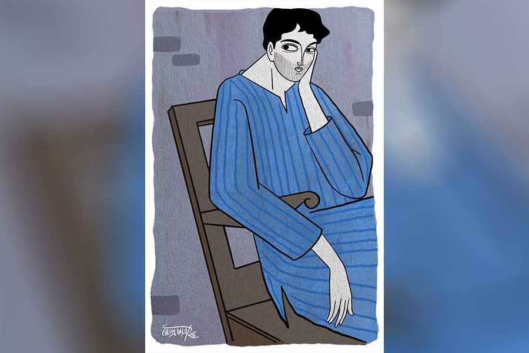

 
 <h1 align=center>ফালতু লোকের গল্প</h1>
<h2 align=center>জয়দীপ চক্রবর্তী</h2> 

আমি কোনও দিন পরীক্ষায় ফার্স্ট হইনি। সত্যি বলতে কী, তেমন তাগিদই ছিল না কখনও আমার মনে। মাধ্যমিক পরীক্ষার রেজ়াল্ট বেরোল যে দিন, মার্কশিট নিয়ে বাড়ি ফিরতেই বাবা রেগেমেগে বলেছিলেন, “তুই যা ফালতু রেজ়াল্ট করেছিস, কোনও ভাল স্কুলেই সায়েন্স পাবি না।”

বলেছিলাম, “আমি তো সায়েন্স নিয়ে পড়তে চাই না।”

“মানে?” বাবা অবাক হয়ে চেঁচিয়ে উঠেছিলেন, “কী নিয়ে পড়বি তা হলে?”

“আর্টস।”

“তার পর?”

“বাংলা অনার্স,” আমি স্বাভাবিক কণ্ঠে বলেছিলাম।

বাবা ধপাস করে একটা চেয়ারে বসে পড়ে বলেছিলেন, “তার চেয়ে লেখাপড়া ছেড়েই দে বরং।”

আমার দাদা পড়াশোনায় তুখোড়। স্কুলে বরাবর ফার্স্ট। এন্ট্রান্সে দুর্দান্ত রেজ়াল্ট করে ইঞ্জিনিয়ারিং পড়ছে তখন। বাবার ইচ্ছে ছিল আমি ডাক্তার হব। তাঁর হতাশ হওয়া স্বাভাবিক। আমি মনে মনে শিক্ষক হওয়ার স্বপ্ন দেখতাম। আমাদের মফস্‌সলের বাংলা স্কুলের অপরাজিত স্যরের মতো ভাল শিক্ষক।

আমাদের পাড়াটা ছোট্ট। সকলেই সকলের খোঁজখবর রাখে। পাড়ার বড়রা আমার অভিভাবক। সুতরাং তাঁদের কেউ কেউও আমাকে বোঝানোর চেষ্টা করলেন, “ভাল করে ভেবে সিদ্ধান্ত নে। মনে রাখবি, শুধুই জ্ঞানার্জনের জন্যে পড়া নয়, তা দিয়ে ভবিষ্যতে রুটি-রুজির বন্দোবস্তও করতে হয়...’

আমি আমার সিদ্ধান্ত বদলাইনি।

আমার দাদা ইঞ্জিনিয়ার হয়ে বেঙ্গালুরুতে চলে গেল চাকরি নিয়ে। পাশের বাড়ির পল্টনদা এখন স্টেটসে। বসাককাকুর মেয়ে রুনুদি পুনেতে সেটলড। ওর অফিসেরই এক জন অবাঙালি ছেলেকে বিয়ে করেছে। সেনজেঠুর ছেলে বাবুয়াদা ফাইবার টেকনোলজি নিয়ে লেখাপড়া করেছিল। সেও এখন চাকরিসূত্রে চণ্ডীগড়ে। ওখানেই ফ্ল্যাট কিনেছে। ফেরার প্ল্যান নেই। আমিই শুধু চাকরি-বাকরি জোটাতে পারিনি। কাঠবেকার হয়ে রয়ে গেছি এই পাড়ায়। বাংলায় এম এ করেছি। নম্বর যথেষ্টই ছিল। বি এডও করেছিলাম। কিন্তু স্কুলে নিয়োগই বন্ধ হয়ে গেল। সকাল-বিকেল টিউশন পড়িয়ে সবে কিছু উপার্জন করতে শুরু করেছি, বাবা মারা গেলেন হঠাৎ। হয়তো আমাকে নিয়ে তীব্র হতাশা আর দুশ্চিন্তার জন্যেই স্ট্রোকটা হয়েছিল...

বাবার কাজ মিটে গেলে দাদা আমাকে এক দিন আন্তরিক ভাবেই বলল, “কী করবি, কিছু ভাবলি?”

“কী বিষয়ে?” আমি অবাক হয়ে জিজ্ঞেস করলাম।

“নিজের কেরিয়ারের বিষয়ে রে গাড়ল,” দাদা বিরক্ত হয়ে বলল, “বাংলায় চাকরির বাজার তো বুঝছিস। এখানে পড়ে থেকে তোর ওই ফালতু কোয়ালিফিকেশন নিয়ে কি আদৌ কোনও কাজ পাবি? ঠান্ডা মাথায় ভেবে দেখ। তেমন মনে করলে এ দিকটা একটু সামলে নিয়ে আমার কাছে চলে আয়...”

“তার পর?” আমি একটু উদাস ভাবে বললাম।

“এত দিন ও দিকে থাকার সুবাদে কিছু ওজনদার লোকজনের সঙ্গে আমার খানিক চেনাজানা হয়েছে। কাউকে ধরে-করে ছোটখাটো কোনও কোম্পানিতে তোর জন্যে ব্যবস্থা...”

আমাদের থেকে একটু তফাতেই মায়ের কাছে বসেছিল পৃথা। চোখাচোখি হতেই দেখলাম ভ্রু বেঁকিয়ে ইশারায় ও আমাকে ‘না’ বলছে। বুঝতে পারলাম, দাদার সঙ্গে কী কথা হচ্ছে আমার, কান খাড়া করে শুনছিল মেয়েটা।

পৃথা আমাদের বাড়ি থেকে চারটে বাড়ি পরে থাকে। খুব সুন্দরী নয়, তবু চেহারায় একটা অদ্ভুত আকর্ষণ আছে। এক বার ওর দিকে তাকালে চোখ ফেরাতে ইচ্ছে করে না। ওদের বাড়িতে আমার যাতায়াত থাকলেও সে ভাবে ওর দিকে তাকাতে চাইনি আমি কক্ষনও। নিজের সম্পর্কে আমি সচেতন। জানি, আমার মতো ফালতু একটা মানুষের অমন করে কারও দিকে তাকাতে নেই। তবুও পৃথার চোখের ওই ইশারাটুকু দেখে আমার বুকের মধ্যে কেমন যেন করে উঠল। দাদাকে বললাম, “আমি ভেবে দেখি। সময় করে জানাব তোমায়।”

আমি বেঙ্গালুরু যাইনি। পৃথা যদি চোখের ইশারায় এই পাড়া ছেড়ে যেতে বারণ করে আমায়, আমি যাই কী করে!

সুযোগ পেয়ে এক দিন পৃথাকে জিজ্ঞেস করেছিলাম, “দাদার কাছে চলে যেতে বারণ করলি কেন রে?”

“তুমি চলে গেলে জেঠিমাকে কে দেখবে জিতুদা?” বড় বড় চোখ মেলে আমার দিকে তাকিয়ে বলেছিল পৃথা।

“ব্যস, শুধু এই জন্যেই?” বোকার মতো জিজ্ঞেস করে ফেলেছিলাম।

পৃথা খিলখিল করে হেসে উঠেছিল। সেই হাসির শব্দে আস্ত একটা ঝর্না গড়িয়ে নেমেছিল আমার বুকের মধ্যে। আমি অপ্রস্তুত গলায় বলেছিলাম, “উত্তর দিলি না যে!”

“তুমি মাঝে মাঝে আমাদের বাড়িতে এসো জিতুদা। তুমি এলে আমাদের ভাল লাগে,” বলেই পিছন ফিরে হাঁটতে শুরু করেছিল পৃথা।

আমি হতভম্ব হয়ে দাঁড়িয়ে রইলাম। আমি জানি, পৃথার বাবা চিরকালই অপছন্দ করেন আমায়। আমি জীবনে সফল হতে পারিনি। কম উপার্জন। সাধারণ, রংচটা জিন্সের উপরে সুতির ইস্ত্রিহীন পাঞ্জাবি পরে সাইকেল চালিয়ে আশপাশের পাড়ায় টিউশন পড়িয়ে বেড়াই আমি। তা ছাড়া হালদারকাকু শুনে ফেলেছিলেন, আমি কবিতাও লিখি। পৃথা সরাসরি স্বীকার করেনি, কিন্তু আমি নিশ্চিত, খবরটা তাঁকে ও-ই বলেছিল। একটা নামী কাগজে পাঠানো আমার কবিতা দুম করে ছেপে বেরিয়ে গিয়েছিল। উত্তেজনা চেপে রাখতে না পেরে পৃথাকে দেখিয়েছিলাম পত্রিকাটা।

তার ঠিক পরে পরেই এক দিন হালদারকাকু রাস্তার মাঝখানে দাঁড় করিয়েছিলেন আমাকে। তাচ্ছিল্যের সঙ্গে বলেছিলেন, “ঘরের খেয়ে বনের মোষ চরাতে চললে বুঝি?”

বিরক্ত হয়েছিলাম। রাগও হয়েছিল। তবু তিনি পৃথার বাবা। তাঁর উপরে রাগ দেখাতে পারি না আমি। নিজেকে সামলে নিয়ে বিনয়ের সঙ্গে বলেছিলাম, “পড়াতে যাচ্ছি কাকু।”

তিনি স্থির চোখে আমার দিকে চেয়ে রইলেন খানিক ক্ষণ। তার পর বললেন, “ক’টাকা কামাও বাড়ি বাড়ি মাধুকরী করে?”

জোর করেই হেসেছিলাম। বলেছিলাম, “যা উপার্জন করি, আমাদের ছোট্ট সংসার চলে যায়।”

“তাই নাকি?” হালদারকাকুর মুখ দেখেই বোঝা যাচ্ছিল বেজায় চটেছেন আমার উপরে। তিক্ত কণ্ঠে আমার মুখের উপরে বলে দিয়েছিলেন তিনি, “তোমার মতো অলস, উদ্যমহীন পুরুষমানুষ দু’টি দেখিনি। পাড়ায় তুমিই একমাত্র অপদার্থ। নিজের দাদাকে দেখেও কিচ্ছু শিখলে না। ইশকুলে পড়ানোর জেদ ধরে নিজেকে ডোবালে। শুনলাম ইদানীং নাকি আবার পদ্য লিখেও সময় নষ্ট করছ। ভাত জোটানোর চিন্তা না করে অমন কাব্য আসে কোত্থেকে বলো দেখি?”

সময় পেরিয়েছে। তবু এই মানুষটা আমাকে পছন্দ করছেন শুনে সত্যিই অবাক হলাম আমি।

আমাদের পুরো পাড়াটাই এখন একটা বৃদ্ধাশ্রম। সব বাড়িতেই ‘ওল্ড কাপল’। ছেলেমেয়েরা প্রবাসী। বৃদ্ধ মানুষগুলোকে দেখাশোনা করার নেই কেউ। তাঁদের অধিকাংশেরই রোগব্যাধি-আক্রান্ত, ওষুধ-নির্ভর যাপন। একাকিত্ব সেই অপারগতাকে আরও বাড়িয়ে তুলেছে। এর মধ্যে হালদারকাকিমা মারা যাওয়ায় পৃথার বাবা এখন পুরোপুরিই একা। তাঁর চোখেমুখের, কথাবার্তার দাপট মরে এসেছে। আমি যে আসলে ফালতু লোক, জীবনে কখনওই সত্যিকারের বড় হওয়া হবে না আমার, এই সত্যিটাকে হালদারকাকুও বোধহয় মেনে নিয়েছেন।

পৃথা একটা চাকরি পেয়েছে। প্রাইভেট কোম্পানি। খাটনি দেদার, স্যালারি কম। তারই মধ্যে প্রাণপণ সংসার সামলাচ্ছে সে। পাড়ার যে কাকু-কাকিমারা আমাকে ফালতু ভেবেছে চিরকাল, এখন আমাকেই আঁকড়ে ধরে বাঁচতে চাইছে সারা ক্ষণ। আমি সময় পেলে তাঁদের কাছে যাই। গল্পগাছা করি। বাজার করে দিই। ওষুধবিষুধ এনে দিই। ফোন রিচার্জ করে দিই। রাতের দিকে ওঁদের ছেলেমেয়েরা ভিডিয়ো কলে কথা বলে। তাঁদের শরীরের খোঁজ নেয়। টাকাপয়সা লাগবে কি না জিজ্ঞেস করে। ওঁরা প্রত্যেকে বলেন, “জিতু আমাদের মস্ত ভরসা। যত দিন ও এই পাড়ায় আছে, আমাদের জন্যে একটুও চিন্তা নেই তোদের।”

মায়ের শরীরও ভেঙে গেছে। আর পরিশ্রম করতে পারে না আগের মতো। আমি জেনে গেছি, সরকারি স্কুলের টিচার হওয়া হবে না আমার। পরীক্ষার মাধ্যমে স্বচ্ছ নিয়োগ হতে হতে বুড়ো হয়ে যাব। বিশ্বাস করতে শুরু করেছি, বাবা-দাদাই ঠিক বলত। মন যা পড়ে আনন্দ পায়, সেই পড়াশোনা সব সময় আর্থিক নিরাপত্তা দিতে পারে না। এই অদ্ভুত রাষ্ট্রব্যবস্থায় শিক্ষার সঙ্গে কাজের তেমন কোনও মিল নেই!

শুধু টিউশনের টাকায় চলছিল না। ইদানীং ছেলেমেয়েদের পড়িয়ে সুখও পাচ্ছিলাম না তেমন। শিক্ষিত হতে অধিকাংশেরই বড় অনীহা আজকাল। পৃথাকে এক দিন বললাম, “চল, দু’জনে মিলে একটা বিজ়নেস স্টার্ট করি।”

“তুমি করবে বিজ়নেস! তাও আবার আমার সঙ্গে!” বলেই খলবল করে হেসে উঠেছিল পৃথা।

দাদা প্রায় প্রতিদিনই ফোন করে। বৌদিও। ওদের একই কথা, “এই বার বিয়ে-থা করে থিতু হ জিতু। মায়েরও তো এক জন হেল্পিং হ্যান্ড দরকার। এক জন সব সময়ের সঙ্গী...”

আমি স্পষ্ট করে কিছু বলতে পারিনি ওদের। পৃথা তো চাকরি করে। সে কী করে মাকে সঙ্গ দেবে সারা দিন! আমি মৃদু গলায় বলেছি, “মায়ের পক্ষে বেশি পরিশ্রম করা সম্ভব নয় আর। আমি সারা দিনের লোক রাখছি এক জন। বাড়ির কাজ, রান্নাবান্না সবই করতে পারবে, এমন এক জন...”

“সে তো অনেক খরচ। তুমি পারবে?” বৌদি আন্তরিক ভাবেই বলেছিল, “মাকে তো তোমার দাদা হাতখরচ পাঠায়। ওটা বাড়িয়ে দিতে বলব’খন।”

আমি কুণ্ঠার সঙ্গে বলেছিলাম, “চিন্তা কোরো না তোমরা। আমি পারব। বাড়তি টাকা পাঠানোর দরকার নেই।”

পৃথাকে বাদ দিয়েই ব্যবসাটা শুরু করেছি আমি। দাদা বাইরে। বাবা চলে গেছেন। অনেকগুলো ঘর ফাঁকাই পড়ে ছিল। বড়বাজার থেকে কিছু শাড়ি, নাইটি, ব্লাউজ়, বারমুডা এনে দোকান খুলে বসলাম। ক’দিনের মধ্যে জমেও গেল ব্যবসাটা। উৎসাহ পেয়ে ব্যবসা বাড়ানোর কাজে মন দিলাম।

আজ ছুটির দিন। সকালে টিউশন পড়িয়ে এসে বাইরের ঘরে দোকানে বসেছি। হঠাৎ পৃথা এসে হাজির। আলগোছে দু’-একটা নাইটি নাড়াচাড়া করতে করতে বলল, “ব্যবসা তো বেশ জমিয়ে ফেলেছ দেখছি।”

আমি হেসে বললাম, “তোকে বললাম, তুই তো রাজি হলি না...”

“উপায় নেই গো জিতুদা,” পৃথা দীর্ঘশ্বাস ছেড়ে আমার চোখে চোখ রাখল, “তবে তোমাকে দেখে আজ ভারী ভাল লাগছে। এত দিন পর তোমাকে বেশ উদ্যমী লাগছে। মনে হচ্ছে তুমিও কিছু একটা করে দেখাতে পারো। বাবাও বলছিল...”

“কী বলছিলেন কাকু?” আমি পৃথাকে থামিয়ে দিয়ে বলে উঠি।

বলছিল, “ছেলেটা শুধু শুধু এত দেরি করল। আর ক’দিন আগেই যদি কাজ করার এই উদ্যোগটা দেখাত...”

“তা হলে কী হত?” কেমন যেন উত্তেজনা বোধ করি আমি।

“তুমি আজ বিকেলে এক বার আমাদের বাড়িতে এসো। বাবা ডেকেছে,” পৃথা ভারী মিষ্টি করে হাসল আমার দিকে চেয়ে। তার পর তড়িঘড়ি উঠে দাঁড়িয়ে বলল, “আমি এখন যাই। তুমি অবশ্যই এসো কিন্তু...”

কাকু বাইরের ঘরের রকিং চেয়ারে বসেছিলেন। আমাকে সামনের সিঙ্গল সোফাটা দেখিয়ে বললেন, “বোসো।” তাঁর গলায় স্নেহ ঝরে পড়ল আজ। আমার বুকের মধ্যে ধুকপুক আওয়াজ উঠল। পৃথা চা দিয়ে গেল। অন্য দিন আমি গেলে সামনে বসে পড়ে, কিন্তু আজ বসল না। আমি মনে মনে মজা পেলাম। বুঝলাম, কাকু যে কথা বলার জন্য এত দিন পর নিজে থেকে ডেকে পাঠিয়েছেন, সে কথা সামনে বসে শুনতে নিশ্চিত লজ্জা পাচ্ছে পৃথা।

কাকু একটু কেশে গলা পরিষ্কার করে নিয়ে বললেন, “বুঝলে জিতু, একটা সময় মনে করতুম তুমি অপদার্থ, অকর্মণ্য। এ পাড়ার প্রায় সব ছেলেমেয়েই ঝকঝকে কেরিয়ার তৈরি করল, আর তুমি বোকার মতো পড়ে রইলে এখানে। আমি এ নিয়ে আগে দু’কথা শুনিয়েওছি বোধহয়...”

আমি মাথা নিচু করে বসে রইলাম। উত্তর দিলাম না। কাকু নিজেই বলতে শুরু করলেন আবার, “কিন্তু এখন বুঝি, ভাগ্যিস তুমি তেমন কেউকেটা হওনি। তুমিও যদি আর পাঁচ জনের মতো হতে, এ পাড়ার সব বুড়োবুড়িই বোধহয় চোখে সর্ষেফুল দেখত। সত্যি বলতে কী, তুমিই তো এখন আমাদের অন্ধের যষ্টি...”

“কী বলছেন কাকু, এ তো আমার দায়িত্ব,” লজ্জা পেয়েই বলি আমি।

“আমরা সব সময়ই আলোচনা করি, তুমি না থাকলে আমরা অনেকে হয়তো বেঁচেই থাকতুম না এত দিন। আমার মেয়েটাকে তো জানো। আমার কথা ভাবতে গিয়ে সে নিজের দিকে তাকানোর অবকাশ পায়নি এত দিন। এখন আমিই তাকে ভরসা দিচ্ছি, জিতু আছে তো। সে সঙ্গে থাকলে আমাদের চিন্তা কিসের?”

কাকুর কথা শুনে ভাল লাগছিল। আমি হাসলাম। বললাম, “আমি সব সময়ই আপনাদের পাশে আছি।”

“কথা দিচ্ছ তো বাবা?” হালদারকাকু এগিয়ে এসে আমার কাঁধে হাত রাখলেন, “বড় নিশ্চিন্ত হলুম। এই বার অন্তত মেয়েটা নির্ভাবনায় যেতে পারবে।”

“যেতে পারবে মানে? কোথায় যাচ্ছে পৃথা?” চমকে উঠে জিজ্ঞেস করি আমি।

পৃথা গুটিগুটি পায়ে ঘরে ঢুকে আমার কাছে এল। নরম গলায় বলল, “আমার বিয়ে ঠিক হয়েছে জিতুদা। ওর সঙ্গে দীর্ঘ দিনের অ্যাফেয়ার। খুব চাপ দিচ্ছে ওদের বাড়ি থেকে। আমায় ওর সঙ্গে বাইরে যেতে হবে। ইউকে। কিন্তু বাবার জন্যে বড় ভয় হয়...” বলেই আমার হাত দু’খানা জড়িয়ে ধরল পৃথা। এই প্রথম বার। অনুনয়ের স্বরে বলল, “আমার বাবার খেয়াল রাখবে তো তুমি জিতুদা? চলে যাবে না তো কখনও এই পাড়া ছেড়ে?”

আমার বুকের মধ্যে ভাঙচুর চলছে তখন। তবু সোফা থেকে উঠে দাঁড়িয়ে ওর দিকে চেয়ে আমি হাসলাম। বললাম, “আমি আছি পৃথা, চিন্তা নেই। কোথাও যাচ্ছি না আমি। আমার মতো ফালতু মানুষ কোথায়ই বা যেতে পারে?”

