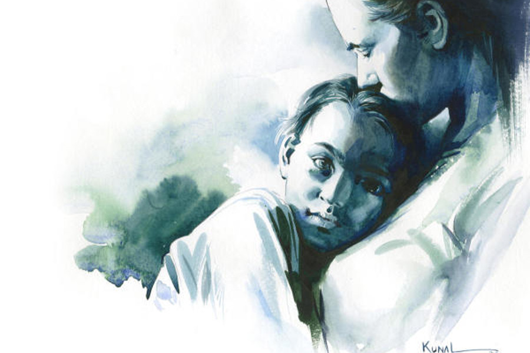

 
 <h1 align=center>ফিনিশার</h1>
<h2 align=center>শুভজিৎ চট্টোপাধ্যায়</h2> জমে উঠেছে ম্যাচটা। ইন্টার স্কুল ক্রিকেট টুর্নামেন্টের খেলার শেষ ওভার বাকি। ক্লাস সিক্সের সঙ্গে সেভেনের ম্যাচ। টসে জিতে সেভেন ব্যাট করেছে। পনেরো ওভারে একশো ছাব্বিশ। যথেষ্ট ভাল স্কোর।

ক্লাস সিক্সের বাচ্চারাও জমিয়ে দিয়েছে। কে জানত খুদেগুলো এমন লড়াই করবে! যদু শতপথী মেমোরিয়াল স্কুল-এ লেখাপড়ার পাশাপাশি খেলাধুলোরও যথেষ্ট চর্চা আছে। স্কুলের গেম টিচার উমাপতিবাবু ও ক্রিকেট কোচ অনিল দাসশর্মা দু’জনে আম্পায়ার। খুব যত্ন নিয়ে স্কুলের টিম তৈরি করেন। এই যে সিক্সের আমনদীপ পাণ্ডে। কী লড়াইটাই না লড়ছে! আঠাশ বলে বাষট্টি রান করে অপরাজিত। উমাপতি এবং অনিল, দু’জনেই মুগ্ধ।

শেষ ওভার, প্রথম বল। বাকি বাইশ রান।

বল করতে আসছে অনুজ অগস্থি। মসৃণ রান-আপ। বয়সের তুলনায় বেশ জোরে বল করতে পারে। কলকাতার নামী পেস অ্যাকাডেমির ছাত্র। তৈরি আমনদীপও। বেশ সুন্দর চেহারা আমনদীপের। হাতে ভালই জোর। ছোটদের ম্যাচ বলে গ্রাউন্ড সামান্য ছোট। তাতে আমনের বেশ সুবিধেই হয়েছে।

সেভেনের ফিল্ডাররা বাউন্ডারি ঘেঁষে দাঁড়িয়ে। এক-দু’রানে তাদের আপত্তি নেই, চার-ছয় হলে চলবে না। অনুজ লেগ-মিডল স্টাম্পের উপর বল রেখেছে। সামান্য খাটো লেংথ। বলের লাইনে এসে সপাটে হুক করতে গেছিল আমন। কিন্তু চালানোর পর বুঝল ভুল হয়ে গেছে। যতটা জোরে বল আশা করেছিল আমন, বল ঠিক ততটাই আস্তে। ব্যাটের কানায় লেগে বল উঠে গেছে উপরে।

সেভেনের উইকেটকিপার চিৎকার করে, “লিভ! লিভ!”

পিচ ক্রস করতে গিয়ে নিজেকে আটকায় আমন। উল্টো দিকে দাঁড়িয়ে আছে সুরজ সিংহ। ও বোলার, ব্যাট করতে পারে না। কিন্তু যে নামবে, সে তো রাহুল দ্রাবিড়! ও কী পারবে এই অবস্থায় বাকি রানটুকু করে দিতে?

লড়াই অসমাপ্ত রেখে মাঠ থেকে বেরিয়ে আসছে আমন। হেলমেট, প্যাড পরে মাঠে নামছে সিক্সের রাহুল দ্রাবিড়। ছোট্টখাট্টো পুতুলের মতো।

শেষ ওভারের দ্বিতীয় বল, বাকি বাইশ রান।

শনুর কোনও টেনশন হচ্ছে না। সে জিতিয়ে দেবে, সে ভরসা কারও নেই।‌ স্কুল প্র্যাকটিসে সবাই দেখেছে। শনুর সেট হতে সময় লাগে। পনেরো ওভারের ম্যাচগুলোয় তাই শনুর জায়গা হয় না। নিয়মিত যারা খেলে, তাদের মধ্যে দেবদূতের চোট। ঋভুর জ্বর। তাই এক প্রকার বাধ্য হয়ে শনুকে টিমে রাখতে হয়েছে। যদিও শনুরও আজ এই ম্যাচ খেলার ইচ্ছে ছিল না। বাবা জোর করে খেলতে পাঠাল। নয়তো কিছুতেই আজ ও খেলত না। কিছুতেই না।

লেগ স্টাম্পের ওপর গার্ড নিয়ে দাঁড়ায়, শনু ওরফে শৌনক হাজরা। ফিল্ডিং-প্রায় একই। অনুজ বোলিং রান আপে প্রস্তুত। তৈরি শনুও।

“সোনা, সোনা...”

মা! মা ডাকছে! কিন্তু কোথায় মা!

এক কালবৈশাখী বিকেলে শনু ছাদে একা। কালো দৈত্যের মতো মেঘ খেয়ে নিচ্ছিল শেষ বিকেলের আলো। আচমকাই ঝড় উঠেছে। ঝড়ের সে কী শোঁ-শোঁ আওয়াজ! নীচ থেকে মায়ের ডাক কানে যায়নি। ঝড়ের তাণ্ডবে বেসামাল শনু। ছাদে উঠে আসে মা। বুকে জড়িয়ে ধরে ছেলের দিকে তাকিয়ে বলে ওঠে, “কবে বড় হবি তুই?”

শনু বড় হতে চায় না। মায়ের সঙ্গে কথা বলতে বলতে মুখ ঘুরিয়ে দেখে, মায়ের একটা লাল ওড়না, কালো মেঘের মাঝে পাক খেতে খেতে হারিয়ে যাচ্ছে। দত্তকাকিমাদের বাড়ি হয়ে, নীল দিঘির উপর দিয়ে, দূরে, আরও দূরে।

হঠাৎ সেই লাল ওড়না, গোলা হয়ে ধেয়ে আসছে। অফ স্টাম্পের উপর শর্ট অব লেংথ। শনু সামান্য শাফল করে এগিয়ে এসে, শেষ মুহূর্তে ছুঁইয়ে দেয় ব্যাট। উইকেট কিপারের মাথার উপর দিয়ে উড়ে চলে যায় বল। সিক্সের ছেলেমেয়েরা চেঁচিয়ে ওঠে, “চার! চার!”

চমকে ওঠে শনু। ওই তো আবার কেউ ডাকল, “সোনা! সোনা!”

শেষ ওভারের তৃতীয় বল, বাকি আঠারো রান।

সেভেনের ক্যাপ্টেন রাহুল আর অনুজ কথা বলতে ব্যস্ত। সুরজ অভিনন্দন জানিয়ে গেল শনুকে। শনু নিজেও অবাক। আজ প্রথম বলেই চার মেরেছে! বাবা জানলে খুব খুশি হবে। বাবাও ক্রিকেট খেলত। শনুকেও ভর্তি করে দিয়েছিল ক্রিকেট কোচিং-এ। মা চায়নি। মায়ের কেবল ভয়। বাবাকে চোখ পাকিয়ে বলেছিল, “আমার দুধের বাচ্চা, ও-সব হুটোপাটি করতে পারবে না। আর আমিও এত টেনশন নিতে পারব না।”

বাবা হেসে গড়িয়ে পড়েছিল। বলে, “এ যুগে একটু রাফ অ্যান্ড টাফ হতেই হবে।”

বাবা অমনিই। সারা ক্ষণ লাফালাফি করতে ব্যস্ত। মা বলে, “আমাকে দুটোই জ্বালায়!”

বাবা মায়ের কথা শোনে না। উল্টে শনুকে বলে, “কাম অন পার্টনার। আয় মারপিট করি। বক্সারদের মতো।”

শনু কি পারে বাবার সঙ্গে! বাবা উল্টে-উল্টে আছাড় মেরে ফেলে দেয় বিছানায়। মা চেঁচিয়ে অস্থির হয়ে ওঠে। বাবা আরও জোরে হেসে বলে, “কী রে! আমাকে মার!”

শনু দু’হাতে জাপটে ধরে বাবাকে। চওড়া বুকে মুখ গুঁজে দেয়। 

বাবা হাসতে গিয়েও থমকে যায়। মাথায় হাত বুলিয়ে দিতে দিতে বলে, “এ ভাবেই সবাইকে ভালবেসে হারিয়ে দিস। ভালবেসে হেরে যাস।”

বাবার সব কথা বোঝে না শনু।

অনুজ দৌড় শুরু করেছে। শনুর কেন যেন মনে হয়, এটা ইয়র্কার হবে। সামলে খেলতে হবে। বাবা অবশ্য হেসে উড়িয়ে দেয়। শনুর ইয়র্কার খেলতে অস্বস্তি হয় জেনে বলেছিল, “দূর পাগল, ইয়র্কারে আবার ভয় কী! একটু এগিয়ে গিয়ে খেলবি। দেখবি ইয়র্কার ফুলটস হয়ে গেছে। ভয় পেলে পিছিয়ে আসতে নেই, সব সময় এগিয়ে যেতে হয়।”

বাবা কি আজ মাঠে এসেছে? শনু এগিয়ে যায় কিছুটা। বিদ্যুৎগতিতে লাল গোলাটাকে বোলারের মাথার উপর দিয়ে তুলে মারে। ডানা ছাড়াই লাল বল উড়ে যায় সীমানার বাইরে।

গর্জন ওঠে “ছ-অ-অ-য়!”

মাঠের ঘেরাটোপের বাইরে দাঁড়িয়ে থাকা একটা লোক, আনন্দে হাততালি দিয়ে ওঠে। চোখ ক্রমশ ঝাপসা হয়ে ওঠে লোকটার। লোকটা বুঝতে পারে একটা শিশু ক্রমশ বড় হয়ে উঠছে; এক জন দায়িত্ববান, শক্তিমান পুরুষ হয়ে উঠেছে। লোকটা অস্ফুটে বলে, “ব্রেভো পার্টনার!”

শেষ ওভারের চতুর্থ বল, বাকি বারো রান।

কত রান হল, কত বাকি! শনুর কোনো হিসেব নেই। মা শিখিয়েছে, ‘অত ভাবতে নেই ‌। তুই তোর কাজ করে যা। ভাবতে গেলে, কাজ হয় না।’

বাবা-মায়ের কথাগুলো কেমন যেন ভারী। শনুর মাথায় ঢোকে না। আলো মরে আসছে দ্রুত। শেষ বিকেলের মিষ্টি হাওয়ায় চোখ জুড়ে আসছে। শনুর এমন ঘুম পাচ্ছে কেন?

বাচ্চা ছেলের হাতে মার খেয়ে অনুজ ফুঁসছে। রাগী চোখে তাকিয়ে শনুর দিকে। তৈরি শনু। চোখের পাতা যেন ভারী হয়ে উঠছে।

শনু এক বছর যাবৎ একা শোয়। মা ঘুম পাড়িয়ে দিয়ে যায়। মায়ের গানের সুর বেয়ে ঘুমপাড়ানি মাসি-পিসি শনুর চোখ ছুঁয়ে যায়। কিছু দিন যাবৎ এ সব বদলে গেছে, শনু ঘুমোতে পারছে না।

অনুজের কোনাকুনি দৌড় দেখেই শনু বুঝেছে, বলও কোনাকুনি অফ থেকে লেগে আসবে। তার পা টার্গেট করবে বোলার। একটু পিছিয়ে দাঁড়াতেই ব্যাটের গোড়ায় বল। চেস্ট ওপেন করে ফাইন লেগের উপর দিয়ে তুলে মারে। শূন্যে বিলীয়মান বলটার দিকে তাকিয়ে শনু ভাবতে থাকে, আচ্ছা, বলের কখনও ঘুম পায় না!

শেষ ওভারের পঞ্চম বল, বাকি ছয় রান।

সিক্সের ছেলেরা হল্লা করছে। সেভেনের চেহারায় উদ্বেগ! একটা বাচ্চা ছেলের কাছে হেরে যাচ্ছে! যে ছেলে নিয়মিত চান্স পায় না, সে ছেলের হল কী!

শনু নির্বিকার। ওর মাথাটা ফাঁকা লাগছে। সবাই এত টেনশন করছে, ওর টেনশন হচ্ছে না কেন?

টেনশন জিনিসটা কী, বুঝেছিল কিছু দিন আগে। মা আর বাবা সকালে গম্ভীর মুখে বেরিয়ে গিয়েছিল। মা-কে কেমন যেন অসুস্থ মনে হচ্ছিল।

বেরোনোর আগে কপালে চুমু খেয়ে মা বলেছিল, “সাবধানে থাকবি সোনা। খুব তাড়াতাড়ি ফিরে আসব।”

পাশের দত্তকাকিমার বাড়িতে ভাত খেয়ে স্কুলে চলে এসেছিল শনু। বাড়ি ফিরেও দেখে কেউ নেই। অনেক, অনেক রাতে এসেছিল বাবা। ভয়ঙ্কর গম্ভীর। বাবাকে দেখে খুব ভয় পেয়েছিল শনু। বাবা মায়ের ঘরের দরজার সামনে দাঁড়িয়ে জিজ্ঞেস করেছিল, “বাবা, মা কোথায়?”

বাবা আলমারি থেকে কিছু নিচ্ছিল বুঝি। চমকে উঠেছিল। খুব আস্তে আস্তে বলেছিল, “ঘুমিয়ে পড়ো। রাত হয়ে গেছে।”

পার্টনার কি বোকা? এ ভাবে ঘুম আসে! বোঝা যাচ্ছে কিছু একটা হয়েছে। কিন্তু কী? শনু কিছুতেই ধরতে পারছে না। পরের দিনও একই অবস্থা। অসহ্য টেনশন! বিকেলে স্কুল থেকে বাড়ি ফিরে দেখে কত লোক। সব আত্মীয়। কিন্তু কেন? স্কুলের জামা ছেড়ে, শনু ছাদে এসে দাঁড়ায়। শেষ বিকেলের আকাশ মরা আলোয় ভরা। সূর্যের পাশে লাল বলয় দেখে, মায়ের সেই ঝড়ে উড়ে যাওয়া ওড়নার কথা মনে হয়। নীচে কারা যেন চেঁচিয়ে ওঠে, “এসে গেছে। এসে গেছে।”

শনুর দেখার ইচ্ছে হয় না। আকাশের লাল ওড়না ওর সব কৌতূহল, সব টেনশন কেড়ে নিয়েছে। বাবা ছাদে এসে ডাকে, “আয় পার্টনার।”

বাড়ির সামনে একটু ফাঁকা জমি। সাদা স্থলপদ্ম গাছের নীচে, একটা ট্রেতে শুয়ে আছে মা। পৃথিবীর সবচেয়ে সুন্দর মানুষ। শনু গিয়ে দু’হাতে মাকে আঁকড়ে ধরে। মায়ের বুকে নাক ঘষে, সেই চন্দন আর এলাচের গন্ধ। নাক ভরে শ্বাস নিতে নিতে চোখে ঘুম নেমে আসে।

না, শনু কাঁদেনি। শনুর হয়ে কেঁদেছিল স্থলপদ্ম। অবেলায় ফুল ঝরেছিল মায়ের গায়ে, মাথায়।

চোখ ঝাপসা হয়ে যাচ্ছে কেন? অনুজের বল অফ স্টাম্পের বাইরে। ওয়াইড ইর্য়কার, কিন্তু স্লো বল। ভাগ্যিস স্লো। শনু শুধু আন্দাজে ব্যাট ঘুরিয়েছে। ব্যাটের কানায় লেগে বল ফার্স্ট আর সেকেন্ড স্লিপের মধ্যে দিয়ে চার। চোখ ঝাপসা হয়ে সর্বনাশ করছিল। শনু কাঁদছে না। চোখে বোধ হয় কিছু একটা পড়েছে।

শেষ ওভারের শেষ বল, বাকি দু’রান।

সেভেনের ছেলেদের কাঁধ ঝুলে গেছে। অনুজের চোখে-মুখে অবোধ রাগ। সিক্সের পুঁচকেগুলোর লাফালাফি যেন তাকে আরও রাগিয়ে দিচ্ছে। শনুর চোখটা একটু মুছতে পারলে ভাল হত। থাক। একটা তো বল, ও ঠিক খেলে দেবে।

সাইট স্ক্রিনের তাকিয়ে শনুর মনে পড়ে যায়, দু’দিন আগের রাতের কথা। শনু ছাদে দাঁড়িয়ে একা। আকাশ জুড়ে ঝিকিমিকি করছে নক্ষত্রের ঝালর। মানুষ মরে গেলে নক্ষত্র হয়ে যায়। আচ্ছা এর মধ্যে কোনটা মা! পিছনে কখন যেন এসে দাঁড়িয়েছে বাবা। কাঁধে হাত রাখে।

“কী দেখছিস? আকাশ? না কি খুঁজছিস মাকে?”

“মানুষ মরে গেলে, স্টার হয়ে যায়। সবাই বলে। আমি দেখছি, কোন স্টারটা নতুন। কোনটা মায়ের মতো।”

“দূর বোকা। মা কখনও মরে?”

“তা হলে?”

“মা তো তোর বুকে আছে। যখনই মন খারাপ করবে, বুকে হাত রাখবি। দেখবি মা তোর সঙ্গে কথা বলছে। তোকে আদর করছে।”

বাবা বলে চলে, “তোর মায়ের ক্যানসার হয়েছিল। কী অসহ্য কষ্ট পেয়েছে, শুধু আমি জানি। এতটুকু ভেঙে পড়েনি। তুই কষ্ট পাবি ভেবে।”

শনু চুপ করে বাবার কথা শুনতে শুনতে আকাশ দেখে। আচমকা মুখ ফিরিয়ে জিজ্ঞেস করে, “বাবা, স্টার মরে গেলে কী হয়?”

অনুজের বলটা মিডল স্টাম্পে পড়ে অফের দিকে বেরোচ্ছিল। শনু পা বাড়িয়ে কপিবুক কভার ড্রাইভ মেরেই দৌড়েছে। ডিপ কভারের হাতে বল পৌঁছনোর আগেই এক রান কমপ্লিট। ফিল্ডার বল ধরেই ছুড়ে দিয়েছে উইকেট কিপারের দিকে। বল হাওয়ায়, শনু তখন মাঝ ক্রিজে। বল নেমে আসছে দ্রুত। শনু শরীরটা ছুড়ে দেয় স্টাম্পের দিকে।

হতাশ ফিল্ডার দেখল, বল স্টাম্পে লাগার অন্তত তিন সেকেন্ড আগে শনুর ব্যাট ক্রিজ চিরে পৌঁছে গেছে বিপদসীমার বাইরে।

মাঠে এক দল বাচ্চা, হল্লা করে ওঠে। কে যেন চিৎকার করে বলে ওঠে, “আমাদের রাহুল দ্রাবিড় তোদের হারিয়ে দিল!”

কিছু ক্ষণ পর, উমাপতিবাবু খোঁজ করেন কোথায় গেল খুদেটা। সারা মাঠে কোথাও তো দেখা যাচ্ছে না। সিক্সের ছেলেরাও কেউ বলতে পারে না। কিছুটা অবাক হন উমাপতিবাবু। অদ্ভুত ছেলে এই শৌনক হাজরা।

সত্যি অদ্ভুত। বিকেলের আলোয় দেখা যায়, ধুলোমাখা জার্সি গায়ে, পিঠে ভারী কিটব্যাগ নিয়ে নেড়া মাথায় একা একা হেঁটে যাচ্ছে এক শিশু। তার বাঁ হাতে ব্যাট, ডান হাত বুকের উপর রাখা। ফিসফিস করে কারও সঙ্গে কথা বলছে বুঝি। সন্ধের বাতাসে সে কথা ভেসে যায় বহু দূরে। যেখানে নক্ষত্রদের বাস।

সে-সব কথা আমাদের কান অবধি পৌঁছয় না।