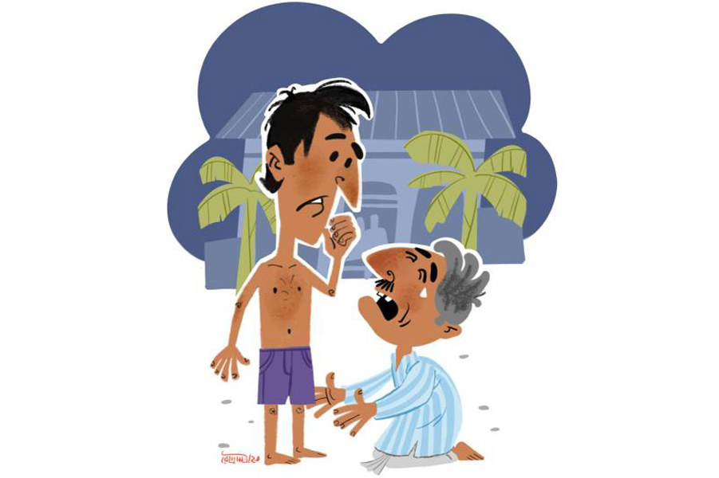

 
 <h1 align=center>ফুসমন্তর</h1>
<h2 align=center>উপল পাত্র</h2> কেষ্টর চায়ের দোকানে বেঞ্চিতে উবু হয়ে বসে চা খাচ্ছিল ভূতনাথ। দোকানে খদ্দের নেই। সকাল থেকে ছ্যাচ্ছাড়ে নাছোড় বৃষ্টি। সন্ধে হয়-হয়।

পাঁচটার বাসটা শহর থেকে এসে স্ট্যান্ডে দাঁড়াল। বাসের পেট থেকে গলগল করে নামা লোকজনের ভিড়ের মধ্যে বঙ্কুকে নামতে দেখে ভূতনাথ হাত নেড়ে ডাকল, “হেই বঙ্কু, চা খাবি তো আয়।”

ছাতা আর হাতের ভারী ব্যাগটা দোকানের এক পাশে নামিয়ে বঙ্কু বলল, “কেষ্টদা, কড়া করে চা একটা আর দুটো টোস... ভূতদার নামে লিখো। একটু আদা দিয়ে ফুটিয়ে দিয়ো বাবু, বাদলার বাজার।”

ব্যাগের ভিতর থেকে ক’গাছা লকলকে পুঁইডগা উঁকি দিচ্ছে। জামার হাতায় কপালের ঘাম মুছল বঙ্কু। জগ থেকে আলগোছে জল ঢালল গলায়, চোখে মুখেও দিল। তার পর ধুতির খুঁটে মুখ মুছে ধোঁয়া-ওঠা চায়ের গেলাস নিয়ে গুছিয়ে বসল ভূতনাথের পাশে।

“কোতা গেসলি... এই দুজ্জোগে?” গেলাসের তলানিটা বাইরে ছুড়ে বিড়ির দু’দিকে ফুঁ দিতে দিতে জিজ্ঞেস করল ভূতনাথ।

বঙ্কু বলে, “আর বলো কেন দাদা, গেসলুম শউরঘর। শউরের শইল-গতিক সুবিধের নয়... ডেকেছিল তার মেয়ের নামে কিছু জমি লেখাপড়া করে দেবে বলে। বললে, ‘কবে আচি কবে নেই বাসনাকে খানিকটা জমি দে যাই। তোমাদের মেয়ের বে-র সময় কাজে লাগবে।’”

“তা একলা গেলি, বৌ যায়নে? তার বাপের শইল খারাপ যে!”

গেলাসে সশব্দে চুমুক দিয়ে বঙ্কু বললে, “খুকির সর্দিজ্বর। বৌ বললে তুমি একাই যাও।”

“তা তোর শাউড়ি কেমন যত্ন-আত্তি কল্লে?”

“শাউড়ি তো সেই কবেই মরে গেছে। শেলেজ আছে। খাতিরদারি সেই করে।”

“শেলেজ কী খাওয়ালে?”

বিস্কুটে কামড় দিয়ে চায়ে ছোট্ট চুমুক দিল বঙ্কু, তার পর বলল, “চিতি ক্যাঁকড়ার ঝাল-ঝাল রসা, কাতল মাচের কালিয়া, পুঁইশাগের ছ্যাঁচড়া, কলাইডাল আর মোরলার টক। দই-মিষ্টিও ছিল। সুমুন্দি রাতে থাকতে বলেছিল, মানসো-টানসো আনাবে। রাজি হইনি। এখানে রোয়ার কাজ ফেলে গেছি না।”

এক মুখ ধোঁয়া ছেড়ে খানিকটা উদাস হয়ে ভূতনাথ বললে, “তোদের কেমন শউরঘর আছে, গেলে খাতির-যত্ন পাস। আমার সব থেকেও কিছু নেই রে বঙ্কা।”

“কেন ভূতদা, নেই কেন? তোমার শউরঘর তো আছে, যাও না কেন?”“সে বড় নজ্জার কথা রে বঙ্কা। একে তো আমার এই মিশকালো, রোগাপানা সিড়িঙ্গে চেহারা। সামনে পাটির দাঁতক’টা কলার ছড়ার মতো বেইরে থাকে। শালি, শেলেজ মুখে কাপড় চাপা দিয়ে হাসে। তার ওপর সে বারের কালীপুজোয় যা হল...”

“কী, কী হল ভূতদা, বলো না। আবার তো জোর বিষ্টি নাবল, এখন ঘর যাবে কী করে। চলো, বাসগুমটির ভেতরে নিরিবিলে বসি দু’জনায়। রোসো, একটা বিড়ি ধরাই। তুমি ধরাবে না কি?”

বিড়িতে সুখটান দিয়ে ভূতনাথ শুরু করল, “আমার শউর বুইলি পয়সাওলা লোক, চিটেগুড়ের কারবারি। ফি-বছর কালীপুজো করে ঘটা করে, মোচ্ছব চলে তিন দিন ধরে। তা সে বার বিয়ের পোথোম বছর। পুজোয় শউর নিজে নিতি এলো, কী আর করি... গেলুম। ভাসানের দিন সবাই মিলে খুব জোরাজুরি করলে সিদ্ধির শরবত খাওয়ার জন্য। তুই তো জানিস বঙ্কা, তাড়ি আর ধেনো ছাড়া আমি আর কিছু ছুঁইনে। তাই বললুম, আমি ও সব সিদ্ধি-টিদ্ধি খাইনে। শউর বললে, ‘ও কথা বলতে আচে! মায়ের পেসাদ সবাই পায়— মেয়ে, বৌরা সুদ্ধু। না খেলে অকল্যেন হবে যে। কী আর বলি, নারকোল নাড়ু দিয়ে সাত-আট গেলাস সিদ্ধির শরবত দিলুম মেরে।”

চোখ গোল গোল করে বঙ্কু, “বলো কী গো ভূতদা! একেবারে সাত-আট গেলাস!”

“বেড়ে ঘুঁটেছিল রে শরবতটা! কাজু-পেস্তা বাটা, কিচিমিচি, ডালচিনি। ভায়রা আবার একটু ধুতরো বিচি আর তামা ঘষে দিয়েছিল যাতে নেশাটা জমাট হয়।”

“তার পর?”

“আর কী! ভাসানের পর ভরপেট মানসো-ভাত খেয়ে শুয়ে পড়লুম। কিন্তু মাজরাত্তিরে ঘুম ভেঙে গেল।”

“বাজ্জি চেপেছিল নিঘ্ঘাত? হবেনে, গান্ডেপিন্ডে অত গিলেছ...”

“না, না ও সব নয় রে। বলচি, ম্যাচিশটা দেখি...” নিভে যাওয়া বিড়িটা ধরিয়ে ভূতনাথ বলল, “মনে হল কে যেন আমাদের দোরে ধাক্কা দিচ্ছে। ও দিকটায় তখন চোর-ডাকাতের খুব উৎপাত। পাশে বৌ ঘুমোচ্ছে আমার বুকে হাত রেখে। সাবধানে তার হাত সইরে উঠে এসে দোরটা ফাঁক করলুম। বাইরে অন্ধকার ঘুরঘুট্টি। কেউ কোত্থাও নেই। কাত্তিক মাস হলে হবে কী, ঘরের ভেতর বেশ গরম লাগছিল।”

“অত মানসো খেলে গরম লাগবেনে, তার ওপর আট গেলাস সিদ্দির শরবত!”

“আর খাওয়ার খোঁটা দিসনি বঙ্কা। খেয়েছিলুম তো মোটে সেরটাক মানসো। বৌ তখনইচোখ টিপে মানা না করলে আরও আধসেরটাক টেনে দিতুম।”

“মানা করলে কেন, মাল শট পড়ে গেসল নিঘ্ঘাত?”

“দূর! শট পড়বে কেন! নতুন জামাইয়ের খাওয়া দেখে সবাই হাসছিল, বৌ তাই লজ্জা পেয়ে...”

“তবে দোরে ধাক্কাটা দিল কে?”

“আরে তাই দেখতেই তো বাড়ির বাইরে এলুম। দেখি যে যেখানে পেরেছে শুয়ে অঘোরে ঘুমোচ্চে। আদুল গায়ে ছিলুম সে ভাবেই বেইরে পড়িচি তাই শীত করচে এ বার।”

“ভয় করলোনি? একা ছিলে যদি ডাকাত চড়াও হত?”

“ভয় কচ্ছিল ঠিকই, তবে ডাকাতের নয়, কুত্তার। পাড়ার যত কুত্তা আমায় দেখে ঘেউঘেউ করে তেড়ে এল। খানিক বাদে তারা যদিও থামল, বাধল অন্য ঝামেলা।”

“কেউ বুঝি দেখে ফেলেছিল? জামাই মানুষ আদুল গায়ে ঘুরচে?”

“আরে দেখে ফেললে তো ভালই হত, সুবিধে হত আমার। কিন্তু দেখবেটা কে। বলচি না, সব্বাই ঘুমিয়ে কাদা।”

“তবে ঝামেলাটা কিসের?”

“আরে বাড়ির ভেতর ঢোকার দোরটাই তো আর খুঁজে পাইনে। বাড়ির চার পাশটা বার কয়েক চক্কর দিয়েও দোর দেখতে পেলুমনি। শেষে ঠাকুরদালানে একজনাকে ঘুম থেকে তুলে বললুম, ‘ওগো, আমি এ বাড়ির জামাই। বাড়ির ভেতর যাওয়ার দোরটা কোন দিকে বলো তো?’”

“দেখিয়ে দিলে নিচ্চই, জামাই বলে কতা?”

“খেপেচিস? চোখ না খুলেই সে জড়ানো গলায় বললে, ‘জামাই? জামাই যদি হবে, তবে দোর খুঁজে পাউনি কেন? আর দোরই যদি খুঁজে না পাও তবে জামাই হলে কী করে?’ বলে ফের পাশ ফিরে শুল। ফের তাকে ঠেলেঠুলে ডেকে বললুম, ‘ভাল করে চেয়ে দেখো আমি ভূতনাথ।’”

“এ বারে চিনতে পারলে তো? গোড়াতেই যদি নামটা বলতে...”

“কোতায় আচিস বঙ্কা! নাম শুনে ধড়মড় করে ঘুম চোকে উঠে বসে বললে, ‘ভূতনাথ! নিজেই এয়েচো পোভু! কী আনন্দ, কী ভাগ্যি আমার!’ এই বলে আমার পা দু’খানা জাপটে ধরে তার কী কান্না। কানচে আর বলচে, ‘অনেক পাপ করিচি পোভু— চিটেগুড়ে ভেজাল দিইচি, জামাইকে বিয়েতে আট আনার বদলে ছ’আনা সোনার আংটি দিইচি। আর... আর দুলালের ডবকা বৌটা য্যাখন পুকুরঘাটে নায়, আড়াল থেকে দেখি তার নাওয়া, রোজ। সব দোষ মাপ করে দিও পোভু। আসচে বছর তোমার মন্দির পিতিষ্ঠে করাব, মাইরি বলছি। পোভু গো, ঘরে আমার মেয়ে-জামাই আচে। নতুন বে হয়েচে, এট্টু আশিব্বাদ কোরে যেয়ো...’”

“কী আশ্চয্যি! তোমার শউরও তোমায় চিনতে পারলুনি?”

“চিনবে কী করে? গরমের জন্যি আন্ডারপ্যান পরে শুয়ে ছিলুম আর সেটা পরেই তো বেইরে পড়িচি। তাই দেখে শউর বললে, ‘এ কী, পোভু! তোমার বাগছাল গেল কোতা? পুজো বাড়িতে শুদু আন্ডারপ্যান পরে কী আসতে আছে? লোকে কী বলবে। নাও, আমার ধুতিটা জড়াও। আর কী যেন খুঁজে পাওনি বলছিলে, দোর? দোর পাউনি তো কী, পাঁচিল টোপকে ঢুকে যাও। এটা আমার বাড়ি, কেউ কিচ্ছু বলবেনে। আর পাঁচিলও যদি দেখতে না পাও, তবে আমার পাশটায় শুয়ে পড়ো, বিহান হলে সব দেখতে পাবে।’ এই বলে ধুতিটা আমার হাতে দিয়ে আবার ফিরে শুল।”

বঙ্কু বললে, “সিদ্দি খেলে এমনটাই হয় গো ভূতদা। আমার এক বার হয়েছিল... শালির বাড়ি বাসন্তী পুজোয়... রাতে সিদ্দি খেয়ে... পেচ্ছাপখানা খুঁজতে গিয়ে, শেষে তাদের ভাঁড়ার ঘরেই... ইসস! সে কী নজ্জা! যাগগে, তার পর কী হল?”

“হবে আর কী। তেষ্টায় গলা শুকিয়ে কাঠ। মনে হচ্ছে কে যেন আমায় ওপর দিকে টানচে। এমন সময় দেখি হেরিকেন হাতে একটা মেয়েছেলে আসচে। হাতে বদনা। মাঠের দিকে যাচ্ছিল মনে হয়। কাচে আসতে বললুম, ‘ও মেয়ে, আমি এ বাড়ির জামাই। ভেতর বাড়ির দোরটা কোন দিকে দেখিয়ে দাও তো।’ দোর দেখানো দূরের কথা আমায় দেখে সে ‘ভুউউত... ভুউউত!’ বলে চিল্লাতে চিল্লাতে ধপাস করে পড়ে অজ্ঞান হয়ে গেল। অমনি বুইলি...”

বঙ্কু বলে, “লোকজন সব বেইরে এলো তো! আর তোমায় ওইর’ম দেখে নজ্জায়...”

“লোকজন নয় রে, সেই কুত্তাগুলো! ঘেউঘেউ করে সব তেড়ে এল দল বেঁধে।”

“সব্বোনাশ! তার পর?”

“সব্বোনাশ বলে সব্বোনাশ! ভাবলুম এ বার তো লোক জড়ো হবেই। ত্যাতখনে বুইলি, আমার নেশা চটকে গেছে। কী করি, দিলুম ছুট।”

“ভেতরে যাওয়ার দোর দেখতে পেলে বুঝি? ভাগ্যিস নেশা...”

“ধুউউস! ছুট দিলুম সামনের ফাঁকা মাঠের পানে। পিছন থেকে ‘চোর চোর... ওই যে সাদা কাপড় গায়ে... ধর, ধর ব্যাটাকে।’ শউরের ধুতিটা গায়ে জড়ানো ছিল। সেটা ফেলে দিতে একেবারে মিশে গেলুম আঁধারে। শউর ও দিকে চেঁচিয়ে লোক জড়ো করছে—‘কে কোতা আচিস রে বের হ! ডাকাত পড়েচে ঘরে। অশ্বিনীবাবুকে দোনলা বন্দুকটা নিয়ে আসতেবল। ঘরে মেয়ে-জামাই আছে। কেউ একজনা পাহারায় থাক সেখেনে।’”

“ধরা দিলে না কেন?” বঙ্কু উত্তেজিত হয়ে বললে।

ভূতনাথ বলে, “পাগল হইচিস, কেউ কি তখন হুঁশে ছিল? ধরা দিই আর আমার মুন্ডু কেটে আমারই হাতে ধরিয়ে দিক আর কী।”

“তবে কী করলে তাই বলো?” বঙ্কুর আর তর সয় না।

“করব আর কী, ছুট লাগালুম আরও জোরসে। পেছন থেকে হইহই করে সব লোকজন ছুটে আসছে লাঠিসোটা নে। বাঁচবার আর কোন রাস্তা নেই দেখে শেষে ঝাঁপ দিলুম সামনের পানাপুকুরটায়।”

“পানাপুকুরে ঝাঁপ? ওই ঠান্ডায়!”

“আর কোনও উপায় ছিলনি রে বঙ্কা। ইদিকে লোকজন লাঠিসোঁটা, চটি, ঝ্যাঁটা— যে যা পেয়েচে সব নিয়ে ঘিরে ফেলেচে পুকুরের চার পাশ। সাঁইসাঁই করে ছুটে আসচে আধলা ইট। একটা যদি মাতায় লাগে, মরা মাচের মতো চিতিয়ে উঠব জলে। ভয়ে তাই মাতা ডুবিয়ে আচি। পচা জল, গা চুলকোচ্চে, মাচ ঠোকরাচ্চে। ঠান্ডায় দাঁতকপাটি লাগার জোগাড়। ভাবলুম জলে থাকলে এমনিই মরে যাব নিমেনিয়ায়, তাই উঠে এলুম।”

“এ বারে নিচ্চই শউর তোমায় পষ্ট চিনতে পারল?”

“ধুউস! জড়ানো গলায় সে বললে, ‘আঁধারে ঠিক ঠাহর হচ্চেনে। মনে হয় এই এয়েছিল। বলে কিনা এ বাড়ির জামাই। দোর খুঁজে পাচ্চেনে। শোনো কতা এক বার! না হয় দু’পাঁট বেশিই টেনিচি, তা বলে নিজের জামাইকেও চিনবুনি! নেশা কি নতুন করচি!’ ইদিকে একজনা খপর আনলে নতুন জামাই ঘরে নেই। আর একজনা বললে, ‘এ নিঘ্‌ঘাত বেম্ভদত্যি, জামাই সেজে রয়েছে। ওঝাকে কল দাও এখুনি।’ সুযোগ পেয়ে একজনা খ্যাংরার বাড়ি বসিয়েই দিলে ঘা-দুয়েক। রেগে বললুম, ‘করছ কী? এক বার ঈশ্বরীবাবুর সঙ্গে কতা কইতে দাও। তার পর...’”

“ঈশ্বরীবাবুটা আবার কে?”

“আমার শউর। তাকে বললুম, ‘একটু আড়ালে চলেন, কতা আছে।’ শউর বললে, ‘যা বলার পাঁচজনার সামনেই বলতে হবে।’ বললুম, ‘তাতে আপনারই অসুবিধে।’ কী ভেবে শউর তফাতে গেল। আমি শউরের কানে কানে কতা বললুম। আমার কতা শুনে শউর এক হাত জিব বের করে বললে, ‘দ্যাখো কাণ্ড! ওগো, তোমরা সব ঘর যাও এ সত্যিই আমার জামাই। চলো বাবাজীবন, ঘর চলো। ইসস্‌ কী নজ্জার কতা!’ সব শুনে বৌ তো কেঁদে একশা। বাপকে বললে, “কেন তোমরা নতুন জামাইয়ের মান রাখুনি। কেন তাকে হেনস্থা করালে।” কাপড়চোপড় গুছিয়ে সে বললে, আর এক দণ্ডও থাকবেনে বাপের ঘরে। কত করে সাধলে সবাই। কিন্তু তার ওই এক গোঁ। তা সেই যে শউরবাড়ি ছেড়ে এইচি আর ওমুখো হইনি।”

বঙ্কা বলল, “বোঝলাম। তা তুমি শউরের কানে কী এমন ফুসমন্তর দিলে যে সে তোমায় আদর করে ঘরে তুলে নিলে?”

“ফুসমন্তরই বটে। বল দিকি কী বলেছিলুম শউরের কানে কানে?” বলে  মিটিমিটি হাসে ভূতনাথ। 

“আমি কী জানি! বেশি ন্যাকরা না করে ঝটপট বলে ফেল। বিষ্টিটা ধরেছে। আর শোনো, শেলেজ পুঁইশাক আর চাষের বরবটি দিয়েচে, চাট্টি নে যাও। নাও বলো।”

“বলব আর কী, তার কথা তাকেই ফিরিয়ে দিয়ে বললুম, ‘আপনার মেয়েকে বলব নাকি আমার আংটিতে দু’আনা সোনা কম দিয়েছেন? না কি এখানে সবার সামনে ফাঁস করে দোব যে আপনি চিটেগুড়ে ভেজাল দেন, আর আপনি রোজ পুকুরঘাটে দুলালের বৌয়ের চান...”

ছবি: রৌদ্র মিত্র