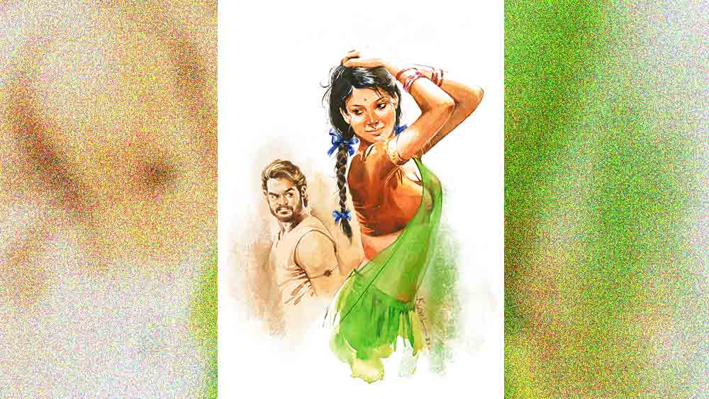

 
 <h1 align=center>ফেরা</h1>
<h2 align=center>রাজশ্রী বসু অধিকারী</h2> লম্বায় হাতখানেক। চওড়ায় ইঞ্চিতিনেক। কালো গোল পুরুষ্টু শরীর। এক ড্রাম জলের মধ্যে তার আঁকাবাঁকা বিভঙ্গ দেখে জগন্নাথের বুকের ভিতরে ঢেউ ওঠে। ভুলে যেতে চাওয়া মেয়েমানুষটাকে মনে পড়েই যায়। যত মনে পড়ে বিন্নিকে, ততই তাকে গলা টিপে মেরে ফেলতেও ইচ্ছে করে। দু’হাতের সাঁড়াশি-চাপে কেমন করে ছটফটিয়ে শেষ হয় বেইমান মেয়েছেলেটা, সে দৃশ্য দেখে গায়ের জ্বালা মেটানোর সাধ হয়।

কিন্তু তা তো আর হওয়ার নয় এত তাড়াতাড়ি। জগন্নাথ তাই ড্রামের জলে নেচে বেড়ানো শোল মাছটার দিকে চোখ রাখে। সেই সঙ্গে দৃষ্টি রাখে পথের দিকে। কখন আসবে ভাল খদ্দের। সবার ওই মাছ কেনার ট্যাঁকের জোর নেই। বেশির ভাগই কাটাপোনার খদ্দের। এক জন-দু’জনই আসে সুন্দরী শোলের চাহিদা নিয়ে। কালো, তেল চকচকে যুবতী শরীরে আগুন ঝরাতে ঝরাতে, জলে ঝাপটা মারতে মারতে কেবলই পালিয়ে বেড়ানো মাছটাকে ধরতে গিয়ে বিন্নির কথা মনে পড়ে যায় জগন্নাথের। আকুলিবিকুলি ওঠে শরীর মন জুড়ে। সব ভুলে গিয়ে মাছের পিছনে পড়ে যায় ও। কালো কাপড় দিয়ে মুন্ডু চেপে ধরে শক্ত হাতে বাগিয়ে রাস্তার উপরে মোক্ষম আছাড়। পুরো জান শেষ হলে পল্টের হাতে কাটার জন্য ছেড়ে দিয়ে নিঃশ্বাস ছাড়ে জগন্নাথ। যেন অনেক ঘাম ঝরিয়ে একটা মানুষকেই সদ্য নিকেশ করে উঠল! দু’চোখে বিষণ্ণতা আর ক্লান্তি। প্রতিহিংসা চরিতার্থ করার আনন্দে মিশে
থাকা অপরাধবোধ। পল্টে তখন টুকরো টুকরো করে ফেলেছে মাছের শরীর। জগন্নাথের চোখের সামনে সেই টুকরোগুলো তখনও শেষ মুহূর্তের প্রাণটুকু নিয়ে কেঁপে
কেঁপে ওঠে। এক অচেনা কান্নার স্রোত এসে দলা পাকায় জগন্নাথের গলার ভিতরে।

প্রতিদিন জগন্নাথ হাজার বার প্রতিজ্ঞা করে সেই বিশ্বাসঘাতক মেয়ের মুখ মনে না করার। তবুও ভেবেই ফেলে ওর কথা। ওকে মেরে ফেলে, বাঁচিয়ে তুলে, আদরে ভরিয়ে তুলে ভেবে যায় ওরই কথা। ভাবে, আর একটা একটা করে নোট গোনে। মোট বাষট্টি হাজার সাতশো হয়েছে। আরও সাঁইত্রিশ হাজার তিনশো জমাতে হবে। তার পর জগন্নাথ বুকের ভিতর জমানো আগুনে জল ঢালতে পারবে। তত দিন সহ্য করতেই হবে তীব্র আঁচের ঝলসানি।

জগন্নাথই জানে, কেমন করে এক নদী জল আগুনের স্রোত হয়ে ওঠে। কেমন করে সেই আগুন ছেয়ে যায় শরীরে মনে। রঙ্গন ফুলের গোছার মতো মেয়ে, টিয়ারং শাড়ি আর কল্কে ফুলছাপ আঁটো ব্লাউজ়ে সেজে, মোটা কাজল আঁকা চোখ আর রসটুপটুপ ঠোঁট নিয়ে মৌটুসি পাখির মতো উড়ে এসে বসেছিল জগন্নাথের খোড়ো ঘরের মাটির দাওয়ায়। জগন্নাথের হাত থেকে নিয়েছিল সোনালি রাংতা মোড়া বেলোয়ারি চুড়ি আর ঘুঙুর বসানো কানফুল। নিয়েছিল আঠাশ বছরের সমর্থ শরীরের উষ্ণতা। দেখেছিল এক সঙ্গে জীবন কাটানোর স্বপ্ন। সব এক নদী আগুনে ফেলে চলে গেছে সে। এখন রাত্রিদিন সেই আগুন ঠেলে পার হওয়া জগন্নাথের। কিন্তু হাল ছাড়ার মানুষ সে নয়। যতই তেষ্টায় ফুটিফাটা হোক বত্রিশ বছরের দানব শরীর, শেষ দেখেই ছাড়বে জগন্নাথ, তবেই সে পুরুষমানুষ।

আজও এক গাড়িওয়ালা বাবু এসেছিল। সবচেয়ে বড় শোলমাছটা এক লাফে বিক্রি হয়ে গেল। সঙ্গে কাতলা ট্যাংরা চিংড়ি মিলিয়ে প্রায় দেড় হাজার টাকার মতো। বউনিটা ভালই। কেনা দাম বাদ দিয়ে লাভ প্রায় আটশো। এই আনোয়ার শাহ রোডে লোকে দ্বিগুণ তিন গুণ দাম দিয়েও মাছ কিনতে পিছপা হয় না, যদি মাল ভাল পায়।

এই ক’বছরে জগন্নাথের সুনাম হয়েছে ভাল মাছের দোকানদার হিসেবে। তার কাছে তিনটে ছেলে কাজ করে। পল্টে, বিশু আর চরণ। পল্টে জগন্নাথের সঙ্গে ক্যানিং থেকেই আসে রোজ। বরাবরই ওর সঙ্গে আছে। বিশু উঠতি বয়সের ছেলে। চরণ এদের মধ্যে সিনিয়র। তার নিজের দু’-একটা ব্যবসা আছে, দেশি মুরগি আর হাঁসের ডিম সাপ্লাই, সকালে খবরের কাগজের হকারি। ক্যানিং এর আড়ত থেকে মাছটাও চরণই নিয়ে আসে। এদের তিন জনকে নিয়ে জগন্নাথের রাজ্যপাট ।

দু’বছর আগেও রাতভোরে ক্যানিং বাজারের আড়তে লাইন দিয়ে মাছের খোঁজে দাঁড়াতে হত জগন্নাথকেই। তার পর সেই মাছ পাইকারি দরে কিনে শিয়ালদা-ক্যানিং লাইনের বিভিন্ন জায়গায় বিক্রি করতে হত রাস্তায় বসে। মাছ আনা-নেওয়া, বাজারে জায়গার লড়াই, তোলাবাজদের হরেক বায়নাক্কা, সব নিয়ে হিমশিম খেত জগন্নাথ। কলকাতা শহরে বসে মাছ বিক্রি করার বুদ্ধিটা প্রথম দিয়েছিল পল্টেই।

মনে ধরেছিল জগন্নাথের। অভিষিক্তা থেকে যাদবপুর থানার মোড় পর্যন্ত চষে ফেলে এই জায়গাটা পেল। সামনেই একটা বড়লোকদের কমপ্লেক্স। পিছন দিকে কলোনি। রাস্তার ধারে এটা সরকারি জায়গা। তাও কড়কড়ে পাঁচ হাজার দিতে হয়েছে পাড়ার ক্লাবকে, সঙ্গে কালার টিভি। মিউনিসিপ্যালিটি বাবুদেরও খুশি করতে হয়েছে মাছের ঝুড়ি পাঠিয়ে। ওঁরা কেউ ঘুষ খান না। শুধু বিনি পয়সায় পেলে মাছ খান। সে সব বহু আগের কথা। সে খরচ জগন্নাথের অনেক দিন উঠে  এসেছে। এখন চরণ বিশু পল্টের ওপর ব্যবসা ছেড়ে জগন্নাথ শুধু হিসেব কষে এক লাখ ক্যাশ জমতে আর কত বাকি।

 

মাতলা নদীর জলে মাছ-ধরা ট্রলারে ছোট স্যাঙাত হয়ে জীবন শুরু করেছিল জগন্নাথ। আর বাবার ট্রলারে বেড়াতে খেলা করতে আসত মালিকের সাত আট বছরের ফুটফুটে মেয়ে বিন্নি। ডবল বয়সি জগন্নাথ ছিল তার খেলার সঙ্গী। একটা ট্রলার আর তিনটে মাছের আড়তের মালিক বিলাসবাবু  শান্তশিষ্ট জগন্নাথকে একটু আলাদা চোখেই দেখতেন। মা-মরা মেয়েটার খেয়ালখুশির খেলায় তাই বাধা দিতেন না। আট থেকে ষোলো হল বিন্নি, আর জগন্নাথ ষোলো থেকে বাইশ। ওদের খেলা তখন পৌঁছে গেছে মাতলা নদীর অনেক গভীরে। জগন্নাথ তত দিনে নিশ্চিত বিন্নি শুধু ওরই, আর কারও নয়।

খেলাচ্ছলে বিন্নি কত দিন ওর হাত থেকে কপালে পায়ে মেহেন্দি এঁকে নিয়েছে। খড়ের চাল বিছানো মাটির দাওয়ায় শুয়ে গোলাপি শাড়ির আড়ালে লুকিয়ে রাখা গোলাপি আমন্ত্রণের সুবাস মেলে বলেছে, “তোমাকেই দিলাম... নাও...”

এই পৃথিবীতে এক জন পুরুষ যা কিছু সুখ আনন্দ এনে দিতে পারে এক জন মেয়েমানুষকে, তার সবটুকু এনে দেওয়ার প্রতিজ্ঞাও করেছিল জগন্নাথ মনে মনে। তবুও সব খেলা ভেঙে দিয়ে চলে গেল বিন্নি।

তিন বছর কেটে গেল, তবু বুকের আগুন একই রকম জ্বলে।

বছর তিনেক আগের সে দিন খবরটা এনে দিয়েছিল পল্টেই। নদী থেকে ফিরে এসে আড়ত ঘুরে জগন্নাথ তখন সবে ঘরে ঢুকেছে। আগের দিন সন্ধেয় যে চৌকিতে নিজেকে মেলে ধরেছিল বিন্নি, তারই উপর শুয়ে শুয়ে ভাবছিল, এ বার একখানা তোষক না করলেই নয়। বিন্নির নরম পিঠে কাঠের খোঁচা বড্ড বেমানান।

“আরে তুমি শুয়ে ঘুমোচ্চ? দাদা? ও দিকে যে সব গেল তোমার...” হাঁপাতে হাঁপাতে বলেছিল পল্টে।

“কী সব ডাইলগ মাচ্চিস?” ধমকে উঠেছিল জগন্নাথ।

“দেখ গে যাও... বিন্নি সেই লক্ষ্মীকান্তপুরের রতন ময়রার সঙ্গে ইস্টিশনে গেল টেন ধরতে... ওকেই নাকি বে করবে...” পল্টে বলে।

মাথায় বাজ পড়ার মতো দৌড়েছিল জগন্নাথ সে দিন। না, বিন্নির বাড়িতে নয়। বিলাসবাবু এক বছর আগেই স্বর্গে গেছেন। জগন্নাথকেই জামাই করতে চেয়েছিলেন তিনি। সমস্ত পাড়া-প্রতিবেশী সে কথা জানে। পল্টের কথা বিশ্বাস না করলেও সোজা স্টেশনেই দৌড়ে গিয়েছিল ও।

লাল রোলেক্সের শাড়ি আর ঝুটো গয়নায় সেজে আহ্লাদি মুখ নিয়ে বেঞ্চে বসেছিল বিন্নি। পাশে নতুন ইলিশ পাহারা দেওয়ার মতো তীক্ষ্ণ চোখে রতন ময়রা। বুক চিতিয়ে দাঁড়িয়ে জগন্নাথ চিৎকার করে, “এ সব কী ভেলকি হচ্ছে বিন্নি? ভরদুপুরে কোথায় চললি উজবুকটার সঙ্গে?”

 বিন্নি চুপ। যেন জগন্নাথকে চেনেই না।

“চল, বাড়ি চল...” হাত ধরে টেনেছিল জগন্নাথ। এক ঝটকায় হাত ছাড়িয়ে রতনের পিছনে মুখ আড়াল করে বিন্নি। রতন মাঝবয়সি হিসেবি ব্যবসায়ী। জানে কোথায় কোন সুরে কথা বলতে হয়। জগন্নাথের কাঁধে হাত রেখে পান চিবোতে চিবোতে বলেছিল, “বাড়িতেই তো যাচ্চে রে! ওর নিজের বাড়ি। সামনের হপ্তায় বে হয়ে যাবে। মেলা লোকের নেমন্তন্ন। তুইও আসিস ভাই। বিন্নির দূর সম্পক্কের কাকা আচে এক জন, সেই সব বিলিব্যবস্থা কল্লে। ট্রলার, আড়ত সব কিনে নিইচি, একন থেকে মাচের ব্যবসাও আমার, বিন্নিও আমার...” পিচ করে থুতু ফেলে বলে রতন।

“অবিশ্যি ঘরে আমার এক গিন্নি আচে, তা হোকগে, আমি বলি বয়সের মেয়েছেলে... বে-থা না করে রাকা ভাল দেখায় না। তাই নগদানগদি লাখ টাকা দিয়ে তবে মেয়ের মন পেইচি!” কথা শেষ করে তৃপ্তির হাসি হেসেছিল রতন। আশ্বাস দিতেও ভোলেনি, “তোর কাজের কোনও হেরফের হবে না রে, ভাবিস না। তুই আড়তে যেমন কাজ কচ্চিস তেমুনি করবি, এ শুদু মালিক বদল।”

স্থবির জগন্নাথ ছুটে গিয়েছিল বিন্নির কাছে। দু’কাঁধ ধরে ঝাঁকিয়ে বলেছিল, “টাকার জন্য তুই আমাকে শেষ করলি শয়তানি?”

আবারও ঝটকা মেরে সরে যায় বিন্নি। খিলখিল হাসিতে গড়িয়ে যায় রতনের পিঠে। তার পর শাড়ির আঁচল দুলিয়ে বলে, “তুই পারবি লাখ টাকা আমার হাতে তুলে দিতে? পারলে আসিস। সারা জীবন কি মাটির ঘরে কাদা মাখব?”

“বিন্নি!” জগন্নাথ গলা টিপে ধরতে গিয়েছিল এক স্টেশন লোকের সামনেই। পল্টে আটকায়। আর উন্মাদের মতো চিৎকার করে কাঁদতে থাকা জগন্নাথের চোখের সামনে দিয়ে বিন্নিকে নিয়ে চলে গিয়েছিল লক্ষ্মীকান্তপুর লোকাল।

সেই উথালপাথাল সময়ে সামাল দিয়েছিল পল্টে। কী করে টাকা রোজগার করা যায়, জমানো যায় লাখ টাকা, এই চিন্তায় পাগল হয়ে থাকা জগন্নাথকে সুস্থির করেছে পল্টেই।

 

বিশু দোকানের মেঝেয় জল ঢালছে। কিছুই বাঁচেনি আজ। ভাল বিক্রিবাটা হল। সব ভালর মধ্যেও তবু কেন  যে থেকে থেকে দীর্ঘশ্বাস পড়ে!

“কেন যে আজো পজ্জন্ত তুমি অই মেয়েছেলেটার কথা ভেবে কষ্টো পাচ্চ কে জানে… এত কাণ্ড পরেও ওই বেইমান মেয়েমানুষের কাছেই তোমার মন বাঁধা রেখে দিয়েচ!” আজ দোকানদারি শেষে  বলেছিল পল্টে। “এট্টা বে করো। দুটো পয়সার মুখ দেকেচ, এ বারে সনসারী হও।”

“মুখে লাগাম দে পল্টে, সে তোর বৌদিদি হয়।”

“হ্যাহ! বৌদিদি...” মুখ বেঁকায় পল্টে, “যেমন কম্ম তেমনি ফল, রতন ময়রা মরল আর জ্ঞাতিরা সব ঘাড় ধরে বের করে দিল। এখন পাঁচ ঘাটের জল খেয়ে বেড়াচ্ছে।”

হ্যাঁ, শুনেছে জগন্নাথ। রতন মরেছে মাসখানেক আগে। কিন্তু বিন্নির কোনও গতি সে করে যায়নি। প্রথম বৌ-ই সব পেয়েছে। বিন্নি এখন কোথায় আছে কী করছে ভেবে একটু আনমনা হয়ে যায় ও। এত যে খেয়ে না খেয়ে টাকা জমাচ্ছে, সেটার কী যে গতি হবে কে জানে! এক বার লক্ষ্মীকান্তপুর গিয়ে খোঁজ করবে এমনটাও ভেবেছে বারকতক। কিন্তু পল্টে শুনলেই তেড়ে আসবে। মোটে শুনতে পারে না সে বিন্নির নাম। এই পৃথিবীতে জগন্নাথের ভালমন্দ ভাবার লোক ওই একটি। তাকে চটাতে মন চায় না। কিন্তু জগন্নাথ বিন্নিকেও ভুলতে পারল কোথায়!

 

বিদ্যাধরপুরে মালগাড়ি উল্টে লাইন জ্যাম হয়ে অনেক ক্ষণ আটকে ছিল ট্রেন। ক্যানিং পৌঁছতে রাত বারোটা  বেজেই গেল। আজ আর পল্টে সঙ্গে আসেনি। তার কোথায় কী কাজ আছে, বলে বহু আগেই আলাদা চলে গিয়েছে। এ দিকটায় বেশ বৃষ্টি হয়েছে। পথে আলো নেই। বাজারগঞ্জ অন্ধকারে ডুবে আছে। বুড়ির মোড় পেরিয়ে বাঁ দিকে রাস্তার পাশে নিজের উঠোনে পা রাখে জগন্নাথ।

সারা দিন কাজের মধ্যে যেমন তেমন। রাত্তির বেলা বাড়ি ঢুকলেই সবচেয়ে খারাপ লাগে। নিঃশব্দ দাওয়া ঘর যেন গিলে খেতে আসে। নিজে নিজে ভাত ফুটিয়ে খাওয়া... ভিখিরিরাও এর চেয়ে সুখী। তাদেরও কেউ থাকে পাশে। আজ মনটা এমনিতেই বড্ড বেশি পাক দিচ্ছে। ঘরের তালা খুলবে, এমন সময় ধুপ করে কে যেন এসে পড়ে পায়ের উপর। চমকে পাশে সরে যায় জগন্নাথ। কে যেন জড়পুঁটুলি পাকিয়ে পড়ে আছে মাটির ওপর। অন্ধকারে দেখা যায় না ঠিকমতো।

জগন্নাথের বুকটা ধক করে ওঠে মুহূর্তের জন্য। পায়ের কাছে পড়ে থাকা মূর্তি নড়ে না।

“এ কী ফৈজত রে বাবা... এ ভাবে দরজা আটকে থাকলে আমি ঢুকি কী করে,” এক পা দু’পা এগিয়ে এসে পড়ে থাকা মানুষটার হাত ধরে টেনে তোলে ও। এ কী! এ তো একটা শাড়ি জড়ানো মেয়েমানুষ!

পিছিয়ে যায় জগন্নাথ। কিন্তু শাড়ি জড়ানো মানুষটা ক্রমেই কাছে আসছে। অনেকখানি কাছে আসে। যতটা কাছে এলে জগন্নাথের মতো উদাসী ব্যাটাছেলেরও নিঃশ্বাস ভারী হয়, আর অন্ধকারেও জ্বলে ওঠে চোখের মণি।

“আমি আর কখনও যাব না রে, এই বারটা আমায় ক্ষ্যামা দে... দেখ আমি তোর ঘরেই ফিরে এসচি...” বুকের কাছে ফিসফিস করে একটা চেনা গলার স্বর। মাথায় আগুন জ্বলে ওঠে জগন্নাথের। মুহূর্তে দশ আঙুলে সেই গলা টিপে ধরে জগন্নাথ। কয়েক সেকেন্ড পর ছটফটানো শোল মাছটার মতোই কাঁপতে থাকা শরীরটাকে চেপে ধরে শক্ত মুঠিতে। তার পর অবলীলায় ছুড়ে ফেলে দেয় উঠোনের এক কোণে।

জগন্নাথের চোখের সাদা জমি থেকে ঠিকরে বেরিয়ে আসতে চায় রক্তলাল শিরা। পায়ে পায়ে উঠোনের কোণে এগিয়ে আসে জগন্নাথ। সংবিৎ ফেরে তার। উবু হয়ে বসে দলা পাকিয়ে পড়ে থাকা শাড়ি জড়ানো শরীরটার সামনে। দু’হাতে শক্ত করে ধরে সেই মেয়েটির শরীর। সে ধীরে ধীরে মুখ ফেরায় জগন্নাথের দিকে। তার কপাল কেটে গড়িয়ে আসা রক্তস্রোতের মতো ধুয়ে দিতে চায় জগন্নাথের বুকের ভেতরে জ্বলতে থাকা আগুনের কুণ্ড।

সেই আগুনের আভায় ধরা পড়ে না দেওয়ালের আড়াল থেকে উঁকি মারা পল্টের মুখ। 

মাঝরাতের আকাশে ছেঁড়া চাঁদকে সাক্ষী করে সারা মুখে তৃপ্তির হাসি মেখে, পল্টে ফিরে চলে নিজের গুমটির দিকে।