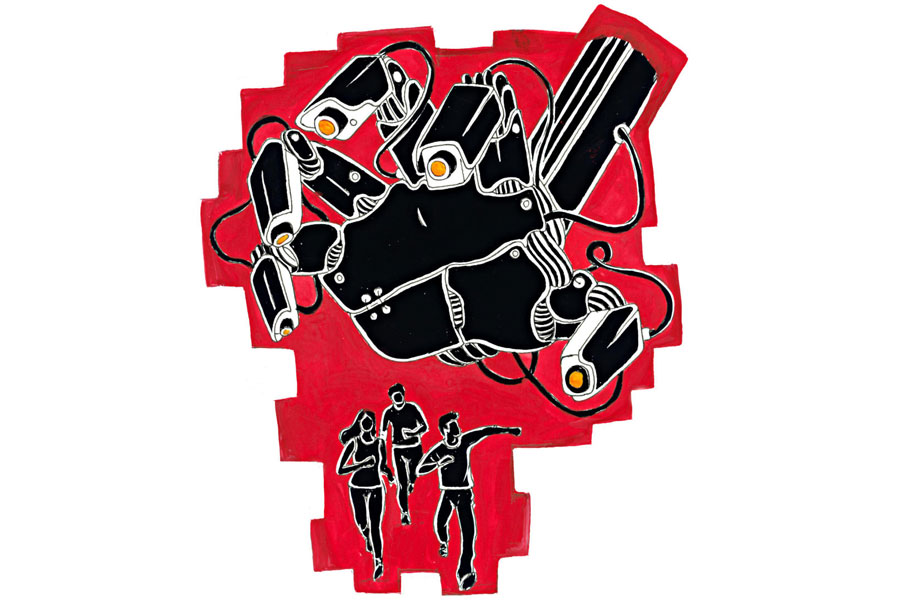

 
 <h1 align=center>ফেরারিপুর</h1>
<h2 align=center>ইন্দ্রনীল সান্যাল</h2> দাদুভাই তোমাকে ফোনে পাচ্ছেন না!” অফিস যাওয়ার তাড়াহুড়োর মধ্যে বাবার হাতে নিজের মোবাইল গুঁজে বলল রাহুল।

তপন ছেলের মোবাইল হাতে নিয়ে বললেন, “ফেরারিপুরের নেটওয়ার্ক জঘন্য। আমাকে ফোনে পায়নি বলে বাবা তোর মোবাইলে ফোন করেছে।”

“কোথায় যেন দেখছিলাম যে, ফেরারিপুরের কানেক্টিভিটি ইস্টার্ন ইন্ডিয়ার মধ্যে সব থেকে খারাপ...” টিফিনকৌটোয় বাবার বানানো লাঞ্চ ভরছে রাহুল।

রাহুল তার ঠাকুরদা মোহিতকে ‘দাদুভাই’ বলে ডাকে। মোহিত ব্যাঙ্কে চাকরি করতেন। আশির দশকে ব্যাঙ্ক এবং ইনশিয়োরেন্স সেক্টরে কম্পিউটার ঢোকানো বা অটোমেশনের বিরুদ্ধে যাঁরা আন্দোলন করেছিলেন, তাঁদের মধ্যে মোহিত ছিলেন অগ্রগণ্য। পরবর্তী কালে পার্টির সঙ্গে দূরত্ব তৈরি হয়। চাকরি থেকে স্বেচ্ছাবসর নিয়ে পুরুলিয়া-ঝাড়খণ্ড সীমান্তের গ্রাম ফেরারিপুরে গিয়ে সমমনস্ক বন্ধুদের নিয়ে একটি স্বনির্ভর গোষ্ঠী তৈরি করেন। নাম ‘ফেরারিপুর ট্রাস্ট।’ স্থানীয় মানুষদের কাজে লাগিয়ে রাস্তা, হাসপাতাল, ইস্কুল আর কলেজ নির্মাণ, দূষণমুক্ত চাষ, পরিবেশবান্ধব উন্নয়ন— এই সব নিয়ে আছেন। সিঁথির এই বাড়ি তপনের নামে করে দিয়েছেন। এখানে আর না ফিরলেও নিয়মিত ফোন করেন।

তপন চাকরি করেন বেসরকারি সংস্থায়। রাহুলের দশ বছর বয়সে তপনের স্ত্রী মারা যান।

রাহুল চাকরি করে মার্কেটিং এজেন্সি ‘ব্লু ফ্রগ’-এ। মাঝারি মাপের নানা কোম্পানির জন্য খবরের কাগজ, টেলিভিশন আর সোশ্যাল মিডিয়ার বিজ্ঞাপন তৈরি করে ব্লু ফ্রগ। টেলিভিশন আর বাংলা সিনেমা ইন্ডাস্ট্রির মাঝারি ও ছোট তারকাদের ফেসবুক, ইনস্টাগ্রাম বা টুইটার সামলায়। কোম্পানিটির অ্যানুয়াল টার্নওভার ভালই।

অফিসে রাহুলের পদের নাম ‘কপিরাইটার’। প্রেস রিলিজ় তৈরি করা, সোশ্যাল মিডিয়ার জন্যে পোস্ট আর ব্লগ লেখা, বিজ্ঞাপনের জন্যে ট্যাগলাইন তৈরি ছাড়াও বিভিন্ন কনটেন্ট বানাতে হয়। অফিসে ঢুকলে মাথা তোলার সময় পাওয়া যায় না।

এই বছরের শুরুতে নতুন দায়িত্ব পেয়েছে রাহুল। ব্লু ফ্রগ-এর মালিক সুমিত একগাদা ডলার খরচ করে অফিসের কম্পিউটারে ‘ভার্জিলা’ নামের ‘আর্টিফিশিয়াল ইন্টেলিজেন্স’ ইনস্টল করেছেন। ভার্জিলার বানানো কনটেন্ট সংশোধন করতে হয় রাহুলকে। খুবই বোকাটে কাজ। কারণ কৃত্রিম বুদ্ধিমত্তার বানানো ব্লগ বা ওয়ানলাইনার অত্যন্ত খাজা এবং সাদামাটা। আবেগ, নস্ট্যালজিয়া বা শব্দ নিয়ে খেলার ছিটেফোঁটাও থাকে না। সাবানের বিজ্ঞাপনে লিখেছে, ‘এটি ব্যবহার করলে চামড়া পরিষ্কার হয়’। এটা পড়ে কেউ সাবান কিনবে?

এত কাজ করেও রাহুলের মাইনে বেশি নয়। ‘সিটিসি’ অনেক হলেও কাটাকুটির শেষে স্যালারি অ্যাকাউন্টে ঢোকে পঁচিশ হাজার টাকা। এরমধ্যে আট হাজার বেরিয়ে যায় বাইকের ইএমআই শোধ করতে। ওটা ছাড়া রাজারহাটে চাকরি করতে যাওয়া অসম্ভব।

ফোনালাপ শেষ করে ছেলেকে মোবাইল ফেরত দিয়ে তপন বললেন, “ফেরারিপুরে প্যারামেডিক্যাল আর নার্সিং কলেজ খোলা হচ্ছে। সেগুলো দেখতে যেতে বলল। ফোনে এত কটকট করে আওয়াজ হচ্ছিল...”

“তুমি এক বার গিয়েছিলে না?” ব্যাকপ্যাক গোছায় রাহুল।

“তোর মা বেঁচে থাকতে গিয়েছিলাম। সারা দিনে একটাই এক্সপ্রেস ট্রেন চলে। সেটা পৌঁছয় রাত এগারোটায়। কোনও বাসরাস্তা নেই। তখন ইলেকট্রিসিটিও ছিল না। সাধে জায়গাটার ওই রকম বিটকেল নাম! এখন বিদ্যুৎ এলেও যাতায়াত আগের মতোই ডিফিকাল্ট।”

ব্যাকপ্যাক ঝুলিয়ে বাইকে সওয়ার হল রাহুল। পঞ্চাশ মিনিটের মাথায় অফিসে ঢুকেই তার একটা আনক্যানি ফিলিং হল। সবাই যে যার কিউবিকলে মাথা নিচু করে বসে। আর এক কপিরাইটার রোশনি সিটে বসে কাঁদছে। রাহুল জিজ্ঞাসা করল, “কী হয়েছে রে?”

রোশনি চোখ মুছে বলল, “বস তোকে ডাকছে।”

দুরুদুরু বুকে সুমিতের চেম্বারে ঢুকল রাহুল। সে কি গতকাল কাজে কোনও ভুল করেছে?

রাহুলকে দেখে সুমিত বললেন, “বোস। তোর জন্যে একটা খারাপ খবর আছে।”

রাহুল চুপ।

“তোকে আর রোশনিকে তিন মাসের অ্যাডভান্স স্যালারি দিচ্ছি। রেজ়িগনেশন লেটারে সই করে দে। আমি তোদের টার্মিনেট করতে চাই না। সেটা সি ভি-র পক্ষে ভালহবে না।”

টেবিলে পড়ে থাকা সংক্ষিপ্ত, কেজো চিঠিতে চোখ বুলিয়ে রাহুল বলল, “টার্মিনেট কেন করছ?”

সুমিত বললেন, “কপিরাইটিং-এর কাজটা এখন থেকে ভার্জিলা-ই করবে। অনেক দাম দিয়ে কিনেছি। বুঝতেই পারছিস...”

“কোয়ালিটি তো খুব পুয়োর!” চিঠিতে সই করল রাহুল। সে যা বোঝার বুঝে গেছে। এখন একটাই কাজ। স্বাভাবিক থাকার অভিনয় করা। কাউকে কিছু বুঝতে না দেওয়া।

চিঠিটা ফেরত নিয়ে সুমিত বললেন, “প্রথম কথা, আজ যে পুয়োর কাল সে রিচ হয়ে যাবে। গোটা পৃথিবী থেকে প্রতি মুহূর্তে কোটি কোটি ইনপুট পাচ্ছে! সেকেন্ড পয়েন্ট হল, এখনকার কনজ়িউমারদের কাছে কোয়ালিটি আর ম্যাটার করে না। একই কথা বার বার, ঘ্যানঘেনিয়ে, জোরে জোরে বললে তবে টনকনড়ে। সেটা ভার্জিলা তোদের থেকে ভাল করবে।”

“ভুল করছ। মেশিন কখনওই মানুষকে রিপ্লেস করতে পারবে না।”

“ভুল প্রমাণিত হলে সবার আগে তোদের ডাকব। আপাতত এইচ আর থেকে পাওনাগন্ডা বুঝে নে। টা-টা!” ম্লান মুখে বললেন সুমিত।

মাথা নিচু করে বসের ঘর থেকে বেরোল রাহুল। কাঁকনকে এখনই ফোন করবে না একটু পরে— এই দোলাচলের মধ্যে তার মোবাইল বেজে উঠেছে।

‘কাঁকন কলিং...’

*****

চব্বিশ বছরের কাঁকন ‘আই স্পাই স্টুডিয়ো’-তে ঢোকে সকাল সাড়ে দশটায়। অন্য কর্মচারী এবং স্টুডিয়োর মালকিন রিক্তাও ওই সময়েই আসেন। প্রাথমিক মিটিং-এর পরে কাজ শুরু হয়। চলে রাত ন’টা পর্যন্ত। লেক গার্ডেন্সের এই স্টুডিয়োতে কাঁকন এক জন ভয়েস আর্টিস্ট। এক বছর চাকরিতে যোগ দিয়েই প্রচুর কাজ করে ফেলেছে।

কাঁকনের মা তানিয়ার ডিভোর্স হয় কুড়ি বছর আগে। প্রথমে হলুদ ট্যাক্সি ও পরে অ্যাপ ক্যাব চালিয়ে তিনি মেয়েকে মানুষ করেছেন। কাঁকন যে ভয়েস আর্টিস্ট হয়ে মাসে তিরিশ হাজার টাকা মাইনে পায়, তার জন্য মায়ের কাছে কৃতজ্ঞ। তানিয়াই মেয়েকে বরাহনগর আর তার আশপাশের এলাকার সমস্ত আবৃত্তি প্রতিযোগিতায় পাঠাতেন। কাঁকন সব জায়গায় ফার্স্ট হত। বাচিক শিল্পচর্চার এই অভ্যেস থেকেই কলেজে ঢুকে বিখ্যাত মানুষদের কণ্ঠস্বর অনুকরণ করা শুরু করে। মিমিক্রি আর হরবোলার কাজ করে কলেজ-ফেস্ট সার্কিটে দেদার প্রাইজ় পেয়েছে।

কলেজ-ফেস্ট থেকেই কাঁকনকে বাছেন রিক্তা। গ্র্যাজুয়েশন পর্ব চুকিয়ে চাকরিতে যোগ দিয়েই সে বাংলা, ইংরেজি এবং হিন্দি অ্যানিমেশন এবং কার্টুন ফিল্মের জন্যে ভয়েস আর্টিস্টের কাজ শুরু করেছে।

ফেস্ট অ্যাটেন্ড করতে গিয়ে কাঁকন ঠিকঠাক একটা বয়ফ্রেন্ডও জুটিয়েছে। ‘ঠিকঠাক’ বলতে, মন খারাপ হলে যার কাঁধে মাথা রেখে চুপ করে বসে থাকা যায়। যে একদম জাজমেন্টাল নয়। যে গার্লফ্রেন্ডের জন্যে পেগ বানিয়ে দেয় বা স্যানিটারি ন্যাপকিন কিনে দেয়। গার্লফ্রেন্ড সিগারেট খেতে চাইলে যে বলে, “গলা বেচে রোজগার করিস। ওটাকে বিগড়োচ্ছিস কেন?”

রাহুলের সঙ্গে ভিডিয়ো বা অডিয়ো কলে রোজ কথা হয়। দেখা হয় শনিবার সন্ধেবেলা। রাজারহাটের কোনও বারে বসে পানভোজন করতে করতে নানা পরিকল্পনা হয়। কলকাতায় থাকবে না অন্য শহরে শিফ্‌ট করবে, সেখানকার স্ট্যান্ডার্ড অব লিভিং কী রকম, মাস চালাতে কত খরচ হবে, দু’জনে এক শহরে চাকরি পাবে কি না... এই সব। বিয়ের কথা আজ পর্যন্ত কেউ মুখ ফুটে বলেনি। তার জন্যে হাতে অনেক সময় আছে। চারচাকা কেনার জন্যে কাঁকন প্রতি মাসে পনেরো হাজার টাকা রেকারিং ডিপোজ়িট স্কিমে রাখে। তার মা রাহুলকে চেনেন, পছন্দও করেন। একই কথা রাহুলের বাবা এবং ঠাকুরদার ক্ষেত্রেও সত্যি।

অফিসে ঢুকে অবাক হল কাঁকন। অন্য দিনের মতো কর্মীরা নিজেদের কিউবিকলে বসে নেই। সবাই রিক্তার চেম্বারের সামনে গোল হয়ে দাঁড়িয়ে। ভিড়ের কেন্দ্রে দাঁড়িয়ে রিক্তা একটা বুকলেট পড়ছেন।

কাঁকনকে দেখে আর এক ভয়েস আর্টিস্ট রূপম বলল, “রিক্তাদি আমাদের দু’জনকে রিজ়াইন করতে বলছেন। উনি ‘অটোটক’ নামের একটা এ আই কিনেছেন। সেটা এখন থেকে ডাবিং আর্টিস্টের কাজ করবে।”

অটোটক কোম্পানির বুকলেট এগিয়ে দিয়েছেন রিক্তা। কাঁকন দেখল মলাটে লেখা আছে, ‘ন্যাচারাল সাউন্ডিং হিউম্যান কোয়ালিটি ভয়েস জেনারেটর ফর অল ইয়োর কনটেন্ট।’ তার নিচে লম্বা তালিকা। মানুষের কণ্ঠস্বরকে যত রকম ভাবে ভাগ করা সম্ভব— বয়স, লিঙ্গ, পেশা, ধর্ম, জাতি, খাদ্যাভ্যাস, বিত্ত, কোথাকার বাসিন্দা, ধূমপান করে কি না— ভাগ করা আছে।

রিক্তা বললেন, “চিত্রনাট্য পড়ে চরিত্র অনুযায়ী প্যারামিটারগুলো অ্যাডজাস্ট করলেই কাজ হবে।”

বুকলেট ফেরত দিয়ে কাঁকন তেতো মুখে বলল, “আমি এটার ফ্রি ভার্সন ইউজ় করেছি। টোনাল কোয়ালিটি অসম্ভব খারাপ। পরিষ্কার বোঝা যায় যে মেশিনকথা বলছে।”

“ফ্রি ভার্সনে সব কিছু পাওয়া যায় না ডার্লিং!” হাসলেন রিক্তা, “তা ছাড়া, এখন চব্বিশ ঘণ্টাই মানুষের কনটেন্ট চাই। মানুষের পক্ষে সেই চাহিদা পূরণ করা সম্ভব নয়। সমাধান একটাই। আর্টিফিশিয়াল ইন্টেলিজেন্স।”

“আমরা এখন তা হলে কী করব? মাটি কুপোব?” চাকরি হারানোর ভয়ে চিৎকারকরে রূপম।

অন্য একটা কাগজ নেড়ে রিক্তা বলেন, “আর্থিক প্রতিষ্ঠান গোল্ডম্যান স্যাক্‌সের রিপোর্ট বলছে, এ আই-এর কারণে খুব শিগগিরই তিরিশ কোটি লোকের চাকরি যাবে। সো, ইয়েস, মাটি কোপানো ইজ় আগুড অপশন।”

“মালিক হয়েছেন বলে যা খুশি তাই বলবেন? লজ্জা করে না?” কাঁকন কাঁদছে।

“করে না রে, লজ্জা!” ম্লান হাসেন রিক্তা, “আমার মেয়ে কল সেন্টারে চাকরি করত। ওদের অফিসে এ আই চালু হওয়ার পরে ওয়ান থার্ড টেলি-কলারের চাকরি গেছে। তার মধ্যে আমার মেয়েও আছে।”

চোখ মুছে কাঁকন ফোন করল রাহুলকে। এক্ষুনি ওকে খবরটাদিতে হবে।

*****

নামে ‘এক্সপ্রেস’ হলেও প্রথম তিন ঘণ্টা লোকালের মতো চলে এই ট্রেন। সন্ধে ছ’টার সময় হাওড়া স্টেশন থেকে পেটভর্তি ডেলি প্যাসেঞ্জার ভরে দুলকি চালে ছুটে রাত ন’টা নাগাদ সব প্যাসেঞ্জার নামিয়ে গতি বাড়াল। এখন ছুটছে এক্সপ্রেস ট্রেনের মতো। সন্ধে নামায় প্রকৃতি সাত রং হারিয়ে ধূসর হয়েছিল। এখন সেটি সাদা-কালো। মাঠঘাট চিরে, কোথাও না দাঁড়িয়ে ছুটছে রেলগাড়ি। কিন্তু কোনও আওয়াজ শোনা যাচ্ছে না। না কি, আওয়াজ হচ্ছে? রাহুল আর কাঁকন শুনতে পাচ্ছে না?

ওরা জানে না। ওরা শুধু জানে, পরবর্তী ও অন্তিম স্টেশন, ফেরারিপুর। দু’জনে বসে রয়েছে ট্রেনের প্রথম কামরায়। ওদের বয়সি দু’টি ছেলে ছাড়া বগিতে আর কোনও যাত্রী নেই।

একই দিনে, একই কারণে এক সঙ্গে চাকরি যাওয়ায় রাহুল আর কাঁকন ঘাবড়ে গিয়েছিল। পরের দিনই কাঁকন আর তানিয়াকে বাড়িতে ডেকে নেয় রাহুল। তপনের সঙ্গে প্রাথমিক আলোচনা সেরে চার জন মিলে চেনাশোনা বৃত্তে ফোনাফুনি শুরু করে। অনুরোধ বা দাবি, অনুনয় বা কৃপাপ্রার্থনার বয়ান ছিল, ‘একটা চাকরি হবে?’

কোনও লাভ হয়নি। পরের দু’দিন নানা জায়গায় গিয়ে, অনেক লোকের সঙ্গে কথা বলে বুঝেছে যে সিকিয়োরিটি গার্ড, ডেলিভারি পার্টনার বা ডেটা এন্ট্রি অপারেটরের চাকরি আছে। কিন্তু মাইনে খুবই কম। ওদের মতো স্বল্প-দক্ষ শ্রমিকদের পক্ষে নিজের ফিল্ডে চাকরি পাওয়া একান্তই অসম্ভব।

কিন্তু নতুন দক্ষতা অর্জনের জন্যে সময় নেই। রাহুলের ঘাড়ে শ্বাস ফেলছে বাইকের ইএমআই, কাঁকনকে ডাকছে রেকারিং ডিপোজ়িটের কিস্তি।

চতুর্থ দিনের আলোচনার মধ্যে তপনের কাছে মোহিতের ফোন এসেছিল। বাবা-ছেলের ফোনালাপের মধ্যে রাহুল ফোন কেড়ে বলেছিল, “দাদুভাই, তোমার ওখানে কোনও চাকরি হবে? এমন চাকরি, যাতে টেকনোলজির ব্যবহার নেই?”

স্মিত হেসে মোহিত বলেছিলেন, “সে কি হয় রে দাদুভাই! যে ভুল অতীতে করেছিলাম, আজ আর তা করতে চাই না। তবে যন্ত্র যাতে যন্ত্রীকে ছাপিয়ে না যায়, সেই চেষ্টা এখানে সব সময় করি। কেন? কী হয়েছে?”

ফোনের কটকট আওয়াজের মধ্যেই সমস্যার কথা বলেছিল রাহুল। সব শুনে মোহিত বলেছিলেন, “এখানে প্যারামেডিক্যাল আর নার্সিং কলেজ খুলেছি। সব স্টাফ জয়েন করে গেছে। তবে ছেলে আর মেয়েদের হস্টেলের সুপারিনটেন্ডেন্টের দুটো পোস্ট খালি আছে। ফুল টাইম জব। এই কাজ কৃত্রিম বুদ্ধিমত্তা পারবে না। চরিত্র গঠনের জন্যে মানুষ লাগে।”

‘মানুষ’ শব্দটি উচ্চারণ করার সময় বেশ উত্তেজিত হয়ে পড়েছিলেন মোহিত। তার পর নিজেকে সামলে নিয়ে বলেছিলেন, “মাসে তিরিশ হাজার টাকা করে মাইনে পাবি। থাকা-খাওয়া ফ্রি।”

“আমরা যাব!” কারও অনুমতির তোয়াক্কা না করে বলেছিল রাহুল।

“তাড়াতাড়ি চলে আয়,” বলেছিলেন মোহিত, “নতুন স্টাফ অ্যাপয়েন্ট করতে গেলে ট্রাস্টের বন্ধুদের অনুমোদন লাগে। নেহাত এত দূরে কেউ আসতে চায় না, তাই ওদের জিজ্ঞাসা না করেই তোদের ডাকছি।”

“কালই যাচ্ছি...” ফোন কেটে রাহুল বলেছিল, “দু’জনের চাকরি একই জায়গায়! মাসে তিরিশ হাজার টাকা করে মাইনে! ইয়া হু!”

জানলা দিয়ে বাইরে তাকিয়ে রাহুল বলল, “আপাতত প্রবলেম সল্‌ভড। প্রশ্ন হল, এখানে আমরা কত দিন থাকব?”

“আমি কাল থেকেই নিজের ফিল্ডে চাকরি খোঁজা শুরু করব,” বলল কাঁকন, “‘এ আই’-এর চক্কর দু’ দিন বাদেই পুরনো হয়ে যাবে। তখন আমাকেই লাগবে।”

“আমিও তাই,” বলল রাহুল, “ফেরারিপুর এসে গেছে। এখানে প্যাসেঞ্জার নামে না বললেই চলে। ট্রাস্ট পর্যন্ত হেঁটে যেতে হবে।”

কাঁধে ব্যাকপ্যাক নিয়ে কামরা থেকে নামল ওরা। দেখল, কামরার সামনের দিকে বসে থাকা ছেলেদু’টিও নেমেছে। ওদের পরনে রাহুল আর কাঁকনের মতোই জিন্‌স আর টি শার্ট। পায়েও স্নিকার্স, কাঁধে ব্যাকপ্যাক, হাতে স্মার্টফোন। এবং পিছন ফিরে অবাক হয়ে রাহুলদের দেখছে।

কিন্তু না তো! ওরা তো আরও পিছন দিকে দেখছে!

রাহুল আর কাঁকন পিছন ফিরল। এবং দেখতে পেল, ট্রেন থেকে নামছে তাদের বয়সি চার জন ছেলেমেয়ে। চার নয় তো, আট জন! আট নয়, কুড়ি... কুড়ি নয়, পঞ্চাশ... সবার পরনে এক পোশাক। সবাই এগোচ্ছে স্টেশনের গেটের দিকে।

কাঁকনের কনুই খিমচে আতঙ্কিত রাহুল চিৎকার করে, “ওরাও সুপারিনটেন্ডেন্টের চাকরির জন্য এসেছে! ওদের আগে আমাদের ট্রাস্টে অফিসে পৌঁছতে হবে! রান, কাঁকন, রান!” তার পর প্রাণপণে দৌড়োতে শুরু করে। খেয়াল করে না যে কয়েকশো ছেলেমেয়ে ওদের টপকে যাওয়ার চেষ্টা করছে।