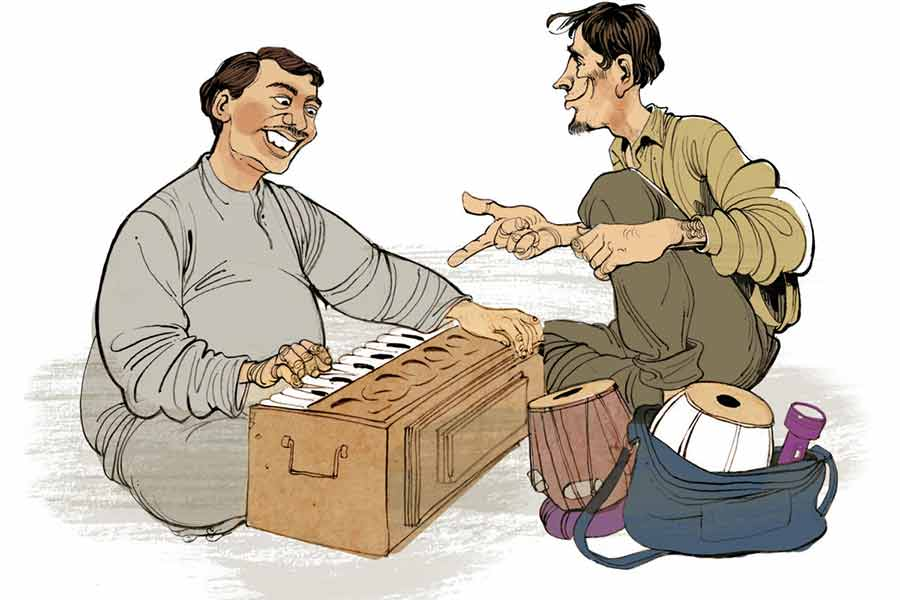

 
 <h1 align=center>ফেলবেন না</h1>
<h2 align=center>প্রশান্ত ঘোষ</h2> 

ফেলবেন না... ফেলবেন না... ফেলবেন না...”

পাঁচুর হেঁড়ে গলায় এই ডাক প্রথম যে দিন এ পাড়ার লোকজন শুনেছিল, চমকে গিয়েছিল। সবাই জানলা দিয়ে উঁকি মেরেছিল। এখন অভ্যেস হয়ে গেছে।

আজও বাঁয়ে-ডানে কোনও দিকেই ভ্রুক্ষেপ না করে পাঁচু ভ্যানরিকশায় প্যাডল করতে করতে উটের মতো গলা উঁচিয়ে সামনে এগোয়। লাল রঙের একতলা বাড়ির জানলায় এক মাঝবয়সি মহিলা মিহি গলায় ডাকে, “ও ফেলবেন না ভাই, এ দিকে এক বার এসো।”

পাঁচু সাইড করে রিকশা।

“কী বিক্রি করছ ভাই ?”

পাঁচু ফ্যাক করে হাসে, “বিক্রি করছি না, কিনছি মাসিমা।”

মহিলার সন্ধানী দু’চোখ, “কী কিনছ ভাই?”

“আপনার সংসারের যা কিছু...”

অবাক হলেন মহিলা, “তার মানে? কী আজেবাজে কথা বলছ?”

পাঁচু শুধরে নেয়, “এখনও তো কথা শেষ করিনি মাসিমা! বলছি, আপনার সংসারের যা কিছু ফেলে দেওয়ার মতো, তা আমি কিনে নিই। আছে তেমন কিছু, মাসিমা?”

পাঁচুর সদ্য-পাতানো মাসিমা বারান্দায় বেরিয়ে বললেন, “পুরনো হারমোনিয়াম নাও?”

একশো আশি ডিগ্রি ঘাড় বেঁকিয়ে পাঁচু বলল, “নিই বইকি। অর্ডিনারি না স্কেল চেঞ্জার?”

বেজার মুখে মাসিমা বললেন, “অতশত জানি না, বাপের জন্মে কোনও দিন হারমোনিয়ামের রিড টিপিনি। ননদের হারমোনিয়াম। দশ বছর হল তার বিয়ে হয়েছে। শ্বশুরবাড়ি যাওয়ার সময় বলেছিলাম নিয়ে যেতে। সে বলল, এটা বাবার স্মৃতি, এখানেই থাক। সেই থেকে পড়ে আছে জঞ্জালটা। শুধুমুদু জায়গা দখল করে আছে।”

মাসিমা থামতেই পাঁচু প্রশ্ন করে, “বেচে দিলে আপনার শ্বশুরমশাই রাগ করবেন না?”

“দূর বোকা ছেলে, তিনি কবে মরে ভূত হয়ে গেছেন।”

‘বোকা ছেলে’ যখন বলেছে, তখন তার প্রতি নির্ঘাত সিমপ্যাথি জন্মেছে মাসিমার। এই ভেবে পাঁচু বললে, “তা হলে তো ল্যাটা চুকেই গেছে। কত চাইছেন আপনি?”

“কত দেবে সেটা আগে বলো।”

“দেখুন, দশ বছর পড়ে ছিল হারমোনিয়ামটা। এর আর কিছুই নেই। কালোয়ারদের কাছে ঠাওকো দরে বিক্রি করতে হবে। তাই একশো টাকার বেশি দিতে পারব না।”

ভিরমি খাওয়ার মতো ভাব করে মাসিমা। তার পর হকার্স কর্নারের মতো দরাদরি শুরু করে, “সে কী কথা! তিনশো টাকা আমার চাই।”

পাঁচু ভ্যানরিকশার সিটে গিয়ে বসে। মাসিমা ধমক দিলেন, “চলে যাচ্ছ যে বড়!”

“অত দিতে পারব না মাসিমা।”

শেষে রফা হল, দেড়শো টাকায় মাসিমা হারমোনিয়ামটা ছেড়ে দেবে। পাঁচু সেটি নিয়ে সোজা পৌঁছল মদত আলির ‘সুরসাধনা’ দোকানে।

বৃদ্ধ মদত আলির পঞ্চাশ বছরের দোকান। আগে নিজে হারমোনিয়াম বানাত। বয়সের ভারে আর পারে না। দু’জন কারিগর আছে, তারাই সব করে। ফাইনাল টাচ বুড়ো নিজে করে। প্যাঁ-পোঁ করে হারমোনিয়াম বাজিয়েই উৎফুল্ল মদত মিঁয়া, “পাঁচু, কোথায় পেলি হারমোনিয়ামটা?”

“কেন চাচা?”

“দারুণ হারমোনিয়াম! স্কেল চেঞ্জার, তার উপর জার্মান রিড। এ জিনিস আর পাওয়া যায় না। পুরনো হলেও নতুনের মতো আছে।”

ট্যাঁক থেকে দুটো পাঁচশো টাকার নোট পাঁচুর হাতে গুঁজে দিয়ে মদত আলি বলল, “এ রকম আরও পেলে নিয়ে আসবি। ভাল দাম দেব।”

পাঁচু আনন্দে আটখানা। দেড়শো টাকায় কিনে হাজার টাকায় বিক্রি! কড়কড়ে সাড়ে আটশো টাকা লাভ! খবরের কাগজ কেনাবেচায় এত লাভ হয় না। মহাজন গোবিন্দ কালোয়ারকে এক দিন দুঃখ করে বলেছিল সে কথা। গোবিন্দদাই উপায় বাতলে দেয়, “লাইনটা একটু চেঞ্জ কর পাঁচু। দিনকাল পাল্টেছে। হার্ড কম্পিটিশন। তুই বরং এক কাজ কর, তোর গলাটা তো অমরীশ পুরীর মতো, তাই রাস্তা দিয়ে যখন যাবি তখন চেঁচাবি—ফেলবেন না... ফেলবেন না...”

পাঁচু অধৈর্য, “কী ফেলবেন না?”

“আরে বাবা! ওটাই পাবলিক অ্যাটেনশন টানার অস্ত্র। বহুকাল আগে ট্রেনে এক জন ফিরি করত। কামরায় উঠেই সে ভিড়ের দিকে ছুড়ে দিত তার অ্যাংরি ডায়ালগ— ‘এই যে ছুঁচোর বাচ্চারা, ইঁদুরের বাচ্চারা...’ অমনি পাবলিক রক্তচক্ষুতে তাকাত। একটুও না ঘাবড়ে লোকটা গলা নামিয়ে বলত, ‘এই সব প্রাণী যদি আপনার বাড়িতে উৎপাত করে, তা হলে তাদের মারার ওষুধ আমার কাছে পাবেন। নিয়ে যান শক্তি বর্ধনের তৈরি ‘বিষমারি’।’ লোকটার কথার টেকনিকে হু-হু করে বিক্রি হত।”

গোবিন্দদার শেখানো বুলিতেই পাঁচু আজ সাড়ে আটশো টাকা লাভ করেছে। এ বার নেশা চেপেছে। আরও লাভের নেশা। গোবিন্দদা বলেছিল, “জানবি, প্রত্যেক বাড়িতে কাচড়া কিছু-না-কিছু আছেই। সবাই না হলেও বাড়ির কেউ কেউ এই কাচড়া তাড়াতে ব্যস্ত হয়ে পড়ে।”

পাঁচু অন্য পাড়ায় ঢোকে। হাঁক পাড়ে, “ফেলবেন না, ফেলবেন না।”

ত্রিশ-পঁয়ত্রিশ বছরের একটি ছেলে রাস্তায় হাঁটছিল। পাঁচু পাশ দিয়ে যেতেই সে ডাকে, “ও ভাই, তুমি পুরনো খাট নাও?”

পাঁচু ভ্যাবাচ্যাকা খায়। মাথা চুলকে বলে, “কী খাট?”

“সেগুন কাঠের খাট। প্রায় একশো বছরের পুরনো। আমার দাদু বিয়েতে শ্বশুরবাড়ি থেকে যৌতুক পেয়েছিলেন। এখন ব্যাকডেটেড। ওটা বিক্রি করে ফ্যান্সি খাট কিনব।”

পাঁচু মাথা চুলকোয়। মহা ফ্যাসাদে পড়া গেল! মদতচাচা তার পরিচিত ছিল, তাই হারমোনিয়াম বিক্রি করতে অসুবিধে হয়নি। কিন্তু পুরনো খাট কারা নেয়, তা তো তার জানা নেই। মানিকতলার চন্দন ফার্নিচারে গেলে কেমন হয়! এক বার ওখান থেকে ঠাকুরের সিংহাসন কিনেছিল। বাড়িতে নিয়ে যেতে হাসি খুব খুশি হয়েছিল।

হাসিকে তো এ বারেও খুশি করা যায়। বিয়ে ইস্তক মেঝেয় বিছানা করে শোয়। খাটটা নিয়ে গেলে খুশি হবে। আজ বাদে কাল সংসার দুই থেকে তিন হবে। অতএব দেখা যাক, খাটটা ফার্নিচারের দোকানে বিক্রি না করে যদি বাড়ি নিয়ে যাওয়া যায়।

“খাটটা কি দেখা যায় দাদা?”

“তা হলে তুমি আমার বাড়ি চলো। কাছেই আমার বাড়ি।”

পাঁচু ভ্যানরিকশা হাতে টেনে চলল। কিছু দূর গিয়ে ছেলেটি বলল, “এই যে, এটা আমার বাড়ি।”

পাঁচুকে নিয়ে গেল শোওয়ার ঘরে। খাট দেখেই চক্ষু চড়কগাছ পাঁচুর। বাঘপায়া নকশা করা খাট। মাথার দিকে দুটো ময়ূর পেখম তুলে আছে। পায়ের দিকে এক ডজন সুদৃশ্য ব্যাটন। কত বলা যায় দাম? কপাল ঠুকে বলেই ফেলল, “এই খাটের জন্য পাঁচশো টাকা দেব।”

ছেলেটা তাচ্ছিল্যের হাসি হেসে বলল, “সেগুন কাঠের খাট! এখন যদি করাতে যাই, কম করে পঁচিশ-তিরিশ হাজার টাকা লাগবে তা জানো?”

“তা হলে বিক্রি করছেন কেন দাদা, রেখেই তো দিতে পারেন।”

“বললাম না, বাড়ির কেউ আর এই খাট পছন্দ করছে না।”

পাঁচু এ বার হাসে, “ওটাই তো কথা দাদা, এত ব্যাকডেটেড খাট কেউ আর নিতে চায় না। তাই এর দাম পাওয়া যায় না। কী করব বলুন, দেবেন না চলে যাব?”

“দেখো ভাই, তোমার কথা আমার ভাল লেগেছে। তোমাকেই দিতে চাই, তবে একটু দামটা বাড়াও।”

“দু’শো টাকা আরও দিতে পারি।”

“পুরোপুরি হাজার টাকা করো।”

পকেটে হারমোনিয়ামের দরুন লাভের সাড়ে আটশো টাকা আছে। ওটাই পাঁচু দিতে চাইল।

ছেলেটিও রাজি হয়ে গেল। পাঁচু জানতে চায়, “এ সব খাট খোলার চাবি থাকে তো।”

“আছে। লোহার চাবি।”

অন্দরমহল থেকে চাবি আনে ছেলেটি। পাঁচু একটি একটি করে খাটের অংশ খোলে— ছত্রি, পায়া, জাজিম ইত্যাদি। তার পর সেগুলো ভ্যানরিকশায় তোলে। টাকা মিটিয়ে পাঁচু প্যাডল চালাতে থাকে। মনে ভয়ানক আনন্দ! আজ থেকে আর মেঝেয় শুতে হবে না। খুব ছোট বয়সে বাবাকে হারিয়েছে। বাবা চলে যেতেই আর্থিক দুরবস্থা শুরু হল। মা একটার পর একটা ঘরের জিনিস বিক্রি করতে থাকে। অল্প সোনাদানা ছিল, প্রথমে তাতে হাত পড়ল। তার পর আসবাবপত্র। শেষে ঘটিবাটি। এক সময় মা-ও টিবিতে মারা গেল।

পাঁচুর মেজাজ ফুরফুরে। আজ যেখানে যাচ্ছে সোনা ফলছে। সূর্য মধ্যগগন থেকে পশ্চিম দিকে একটু একটু করে হেলছে। খিদেটাও বেশ মালুম দিচ্ছে। অন্য দিন এত ক্ষণে বাড়িতে পৌঁছে যায়। হাসি ভাতের হাঁড়ি আগলে বসে থাকে। সে গেলে দু’জনের ভাত বাড়ে। খেতে খেতে যত সুখ-দুঃখের কথা হয়। নেশা চেপে গেছে। মানুষের ফেলে দেওয়া জিনিস নিয়ে উত্তরণের সিঁড়ি আরও কত ভাঙা যায়, তার নেশা!

আর একটা-দুটো পাড়া ঘুরে বাড়ি চলে যাবে। বিকেলে সাপ্তাহিক লটারির ছ’টা টিকিট কাটবে। একটা প্রাইজ় তার কপালে নাচছে— “ফেলবেন না... ফেলবেন না...”

*****

বৃদ্ধ উপেনবাবু আর নিঃসঙ্গ জীবনের ভার বইতে পারছেন না। নিজের ছেলে তো আর বাপের কথা ভাববে না, তাই দিনকতক হল জোয়ান সমর্থ একটি ছেলে দেখে পুষ্যি নিতে বড় সাধ হয়েছে উপেনবাবুর। শেষ বয়সটা সে ছেলের মতো উপেনবাবুকে দেখবে, উপেনবাবুও তাঁর সামান্য পুঁজি আর ভদ্রাসনটুকু লেখাপড়া করে পুষ্যিপুত্তুরের নামে দিয়ে যাবেন। সেই উদ্দেশ্যেই রোজ সকালে জানলার ধারে বসে রাস্তার লোক চলাচল দেখেন। এমন সময় হঠাৎ কানে এল, “ফেলবেন না... ফেলবেন না...”

নড়েচড়ে বসলেন উপেনবাবু। ছেলেটিকে এক সপ্তাহ, দশ দিন পর পর পাড়ায় দেখা যায়। রোদে-পোড়া চোখমুখে ক্লান্তি লেগে আছে, মোটা গলায় হাঁক দিতে দিতে আর চার দিকে দেখতে দেখতে ভ্যানরিকশা নিয়ে এগিয়ে আসছে ছেলেটা। ছেলেটার মুখে চোখে মায়া, সারল্য আর অসহায়তা মাখামাখি। ছেলেটিকে খারাপ লাগে না উপেনবাবুর। এক বার কথা বলে দেখবেন নাকি? দেরি করে আর লাভ কী! বয়স তো আর বসে নেই তাঁর।

হাঁক দিতে দিতে ভ্যানরিকশা চালিয়ে এগোচ্ছে পাঁচু, এমন সময় এক জীর্ণ বাড়ির ঘুণ-ধরা জানলায় মুখ বাড়ালেন বৃদ্ধ উপেনবাবু, “ও ছেলে, এক বার এ দিকে এসো।”

পাঁচু বৃদ্ধের কাছ বরাবর যায়। বৃদ্ধ বলল, “আমার একটা ফেলে দেওয়ার জিনিস আছে। তুমি কি তার গতি করে দিতে পারবে?”

“কী জিনিস দাদু?”

“এই বাড়িটা।”

“এটা ফেলে দেওয়ার জিনিস, কী বলছেন দাদু!”

বুড়ো ঝেড়ে কাশল, “মানে বেচে দিতে চাই। একটা খদ্দের জোগাড় করে দিতে পারবে?”

এ তো দালালি— এমন অফারও তার কাছে আসবে, স্বপ্নেও ভাবেনি পাঁচু! হাত-পা তার কাঁপছে। দেহ-মনে শিহরন জাগে। লাখো সেলাম ঠোকে গোবিন্দদাকে। এমন কারবারের সন্ধান দিয়েছে, তাতে ছেঁড়া কাঁথায় শুয়ে লাখ টাকার স্বপ্ন দেখা যায়— “দাদু, বাড়িটা বিক্রি করবেন কেন?”

“এ বাড়ির কোনও উত্তরাধিকারী নেই তাই।”

“আপনার ছেলেপুলে নেই?”

“আছে। একমাত্র ছেলে বৌ-ছেলেমেয়ে নিয়ে বিদেশে থাকে। সেখানকার সিটিজ়েনশিপ নিয়েছে। এ দেশে আর আসবে না।”

পাঁচু এ বার হাসে, “তাই বলুন, বাড়ি বেচে দিয়ে পাকাপাকি ছেলের কাছে চলে যাবেন।”

“না রে মুখপোড়া, ছেলে বাবাকে পোঁছেও না, যোগাযোগও রাখে না। অনেক টাকার চাকরি করে সে। বাপের এ সব জিনিস প্রয়োজনও নেই তার। ওর কাছে এ সব আবর্জনা।”

গোবিন্দদার কথা ফের মনে পড়ে পাঁচুর। বলেছিল, ‘প্রত্যেক বাড়িতেই কিছু না কিছু কাচড়া থাকে। মওকা বুঝে সেগুলো টপাটপ তুলে নিবি। দেখবি, দু’দিনেই তোর নিজের সংসারের হাল ফিরে যাবে।’

জড় পদার্থ না হয় তুলে নেবে সে। কিন্তু মানুষের ভালবাসা? এই যে ছেলের প্রতি বুড়োর ভালবাসা তলানিতে এসে ঠেকেছে, তা কি চেঁছে তুলে নিতে পারবে পাঁচু? দেখাই যাক।

সে জানতে চায়, “দিদিমা বাড়ি বিক্রিতে সায় দিল?”

বুড়ো ফোকলা দাঁতে হাসে, “তোর দিদিমা পাঁচ বছর আগে আমাকে ছেড়ে দিয়ে স্বর্গে মদন ছোঁড়ার সঙ্গে প্রেম করছে।”

পাঁচু ফিউজ়ড। বলল, “জানতাম না, তাই দিদিমার কথা কয়েছি। কিছু মনে করবেন না দাদু। তা বাড়ি বিক্রি করলে থাকবেন কোথায়?”

“কেন, তোর কাছে?”

ভ্যাবাচ্যাকা খায় পাঁচু। তা হলে কি সে যা ভেবেছে, সেই পথেই কথাটা গুটিগুটি এগোচ্ছে!

“কিন্তু দাদু, আমার বাড়িতে তোমাকে রাখার মতো জায়গা নেই যে...” বলে পাঁচু।

বুড়ো প্রশ্ন করে, “তোর বাড়িতে কে কে আছে?”

“আমি আর আমার বৌ। ছোট্ট একটা চালাঘরে ভাড়া থাকি। বর্ষায় ছাদ দিয়ে জল পড়ে। পূর্ণিমার রাতে জোছনা ছাদ বেয়ে ঘরে লুটোপুটি খায়। সেখানে তোমাকে জায়গা দেব কী করে?”

বুড়োর মুখে প্রসন্নতার ছাপ, “তা হলে এক কাজ কর, ও বাড়ি ছেড়ে দিয়ে আমার এই বাড়িতে বৌকে নিয়ে চলে আয়।”

পাঁচু বোঝে— দাদু একলা থাকেন, তাই বাড়ির অংশ ভাড়া দেবেন। সে বলে, “কিন্তু দাদু, আমি তো বেশি ভাড়া দিতে পারব না।”

“তোকে কে ভাড়া দিতে বলেছে রে মুখপোড়া!”

প্রথম বারের মুখপোড়া সম্বোধনে মনে মনে বিরক্ত হয়েছিল পাঁচু। কিন্তু যত শুনছে, ততই মনে হচ্ছে ওই ডাকে কোথাও যেন স্নেহ-ভালবাসা লুকিয়ে আছে।

বুড়ো বলল, “তোর দিদিমা মারা যাওয়ার পর থেকে প্রতি বছরই তার নামে দানধ্যান করি। এ বছর না-হয় বাড়িটাই তোকে দিয়ে দেব। বিনিময়ে আমাকে একটু থাকতে দিবি তো?”

ঠকাস করে বুড়োর পা ছুঁয়ে পেন্নাম করে পাঁচু বলল, “বাড়ি তোমারই থাকবে, আমি শুধু যেটা ফেলে দিচ্ছিলে সেটাই নেব।”

বুড়ো ভুরু কুঁচকে জানতে চাইল, “কী সেটা?”

“ওই যে, ছেলের প্রতি তোমার স্নেহ আর ভালবাসা।”

উপেনবাবু হাত বাড়িয়ে পাঁচুর চুল ঘেঁটে দেন। ঝাপসা চোখে পাঁচু ভাবে, ফেলে দেওয়া খাট কিংবা বাড়ি তো অনেকেই পেতে পারে, কিন্তু সে যে কারও ফেলে দেওয়া বাপ পেল, তাও বিনা পয়সায়, সে কি কম ভাগ্যের কথা!

