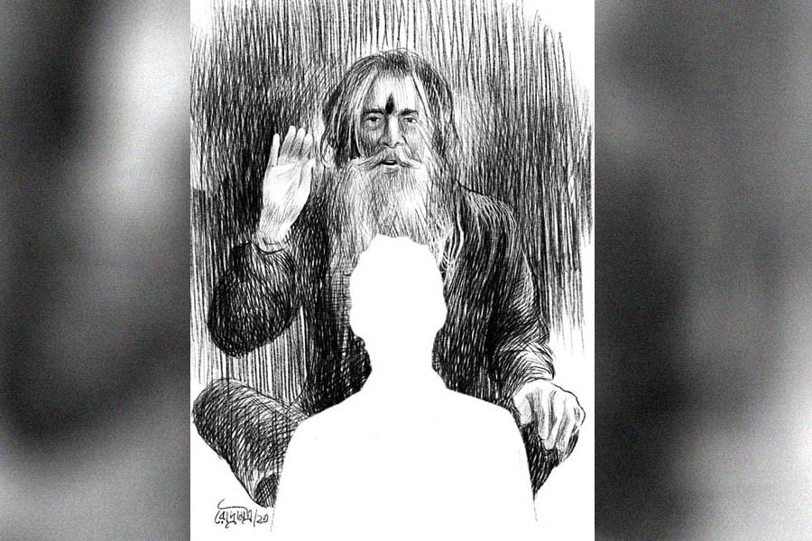

 
 <h1 align=center>বকুলপুরের শ্মশানে</h1>
<h2 align=center>নির্মাল্য বন্দ্যোপাধ্যায়</h2> বিকেল পেরিয়ে গেছে অথচ সন্ধে হয়নি। আমি সবে চার নম্বর রোগী দেখা শেষ করেছি, ঠিক তখনই মোবাইল বেজে উঠল। ছোটকাকা।

“হ্যাঁ ছোটকাকা, বলো।”

“শোন, মান্তুর অবস্থা ভাল নয়। বোধ হয় রাত কাটবে না। তুই যত তাড়াতাড়ি পারিস চলে আয়।”

বক্তব্য শেষ। হয়টো আর কিছু বলারও নেই। মান্তু ছোটকাকার একমাত্র ছেলে। আমার চেয়ে ঢের ছোট। সবে কলেজে উঠেছে।

মাস তিনেক আগে ঘটনার সূত্রপাত। সক্কালবেলা ছোটকাকার ফোন। প্রায় কাঁদতে কাঁদতে। ভাল করে কথা বলতে পারছিল না। অনেক কষ্টে বুঝতে পেরেছিলাম, হঠাৎ মান্তুর শরীরের ডান দিকের কিছুটা প্যারালাইজ়ড হয়ে গেছে। কথাও বলতে পারছে না।

তখনই রওনা দিয়েছিলাম ছোটকাকার বাড়ির দিকে। ছোটকাকা থাকে বর্ধমানের পাল্লা রোড স্টেশন থেকে চার-পাঁচ কিলোমিটার দূরে একটা গ্রামে। ওটাই আমাদের আদি বাড়ি। চাষবাস ছিল আমাদের পরিবারের জীবিকা। বাবা ছিলেন খুব মেধাবী। ম্যাট্রিকে খুব ভাল রেজ়াল্ট করে শহরে পড়তে চলে এসেছিলেন। স্কলারশিপের টাকায় এবং টিউশন করে জীবনে প্রতিষ্ঠিত হন। গ্রামের জমিজমা, বাড়ি— কোনও কিছুরই ভাগ নেননি। আমার বড়কাকা খুব কম বয়সে মারা যান। গ্রামের সব কিছু ছোটকাকার দায়িত্বেই আছে।

আমাদের গ্রামের নাম বকুলপুর। কলকাতা থেকে প্রায় পঁচানব্বই কিলোমিটার। ঘণ্টা দুই-আড়াইয়ের দূরত্ব। মান্তুকে আমার গাড়িতে তুলে সোজা পৌঁছেছিলাম বাঙ্গুর ইনস্টিটিউট অব নিউরোলজিতে। ওখানকার ডাক্তার সুবোধ সামন্তর কাছে। উনি আমাদের পড়িয়েছেন। ব্রেন সার্জন হিসেবে বিশ্ববিখ্যাত।

স্যর আমাকে দেখে দিব্যি চিনতে পারলেন। ধৈর্য ধরে সব শুনলেন। মান্তুকে পরীক্ষা করলেন। তার পর আমাকে আড়ালে ডেকে বললেন, “শোন, কেসটা ব্রেন টিউমার। এবং ম্যালিগন্যান্ট। বাঁচবে না। কেন কাটাছেঁড়া করাবি! বাড়ি নিয়ে যা। আর মাস তিনেক বাঁচবে। সার্জারি করলেই বা কী, না করলেই বা কী!”

আমার শরীরের মধ্য দিয়ে একটা ঠান্ডা স্রোত বয়ে গেল। স্যরকে অবিশ্বাস করার উপায় নেই। তবু মরিয়া হয়ে বললাম, “স্যর, সিটি স্ক্যান বা এমআরআই করলেন না, এখনই এত শিয়োর হচ্ছেন কী করে?”

স্যর হাসলেন, বললেন, “তোকে কী করে বোঝাব বল দেখি! ওরে, আমি যত দিন ধরে ডাক্তারি করছি, তোর বয়স তত বছর নয়! একটা বাচ্চা ছেলে, তার সম্পর্কে এমন করে বলতে আমারই কি ভাল লাগছে রে?”

আমি স্যরের হাত চেপে ধরলাম। বললাম, “স্যর, আপনার পায়ে পড়ি, একটা চেষ্টা অন্তত করুন।”

স্যর দীর্ঘশ্বাস ফেলে বললেন, “তুই বলছিস যখন, ঠিক আছে। কিন্তু, আশা খুবই কম।”

মান্তু ভর্তি হয়ে গেল। আমি রোজ যেতাম। এক দিন চুপি চুপি জিজ্ঞেস করলাম, “বিরিয়ানি খাবি?”

অসুস্থ ছেলেটার চোখেমুখে অদ্ভুত এক ঝিলিক। আনিয়ে দিলাম। নিজে খেতে পারে না। আমিই খাইয়ে দিলাম। খুব তৃপ্তি করে খেল ছেলেটা।

দিন পাঁচেক পর অপারেশন। স্যর জিজ্ঞেস করেছিলেন আমি ওটি-তে থাকব কি না। আমি না বলে দিলাম। ব্রেন সার্জারির আমি কী-ই বা বুঝব? আমি তো বছর পাঁচেক আগে এমবিবিএস পাশ করা এক জন জিপি। মানে জেনারেল প্র্যাকটিশনার। সকাল বিকেল মিলিয়ে ষাট-সত্তরটা রোগী দেখি। সিজ়ন চেঞ্জের সময় সংখ্যাটা একশো ছাড়িয়ে যায়। রোগী বলতে সেই জ্বর, পেটখারাপ, নয় তো দাদ অথবা চুলকুনি, বড়জোর প্রেশার অথবা শুগার। রোজগার অবশ্য ভালই হয়। গাড়ি কিনে ফেলেছি। আরও কিছু টাকা জমিয়ে এমডি করার ইচ্ছে আছে।

স্যর বললেন, “তবে জিজ্ঞেস করিসনি কেমন সার্জারি হল। যদি ঘণ্টা আটেক সার্জারি করতে পারি, তা হলে বুঝবি কিছু করতে পারলাম।”

কোথায় কী! ঘণ্টা চারেক পরেই স্যর ওটি থেকে বেরিয়ে নিজেই আমাকে ডেকে পাঠিয়েছিলেন। দু’দিকে মাথা নেড়ে বলেছিলেন, “কিছুই করতে পারলাম না! গোটা ব্রেনটাকে তো আর উপড়ে ফেলতে পারি না! ক্যানসার ছড়িয়ে গেছে। যা বলেছিলাম, বড়জোর মাস তিনেক।”

স্যরের কথা ষোলো আনা ফলে গেল। তিন মাস পুরো হতে আর দিন চারেক বাকি। তার মধ্যেই ছোটকাকার এই ফোন। আমি আমার কম্পাউন্ডার রূপেনকে ডেকে বললাম, “খুব জরুরি কেস ছাড়া বাকিদের ফিরে যেতে বলো। আমাকে এক্ষুনি বেরিয়ে বর্ধমান যেতে হবে।”

তা হলেও নয়-নয় করে আরও জনা দশ-পনেরো রোগী দেখতে হল। চেম্বার শেষ করে এক বার বাড়ি ঘুরে যখন বর্ধমানের উদ্দেশে রওনা দিলাম, তখন সাতটা বেজে গেছে।

পৌঁছে দেখলাম মান্তুর অ্যাকিউট গ্যাসপিং হচ্ছে। বাংলায় যার মানে নাভিশ্বাস উঠেছে। রাত সাড়ে এগারোটা নাগাদ মান্তুর সব জ্বালা জুড়িয়ে গেল। নিকটাত্মীয় বলে আমি আর ডেথ সার্টিফিকেট লিখলাম না। স্থানীয় এক ডাক্তারবাবু এসে লিখে দিলেন। সব কিছু গুছিয়ে যখন শ্মশানের উদ্দেশে বেরোনো হল, তখন রাত প্রায় দু’টো। শ্মশানটা অবশ্য কাছেই। ছোটকাকার বাড়ি থেকে মিনিট দশেকের হাঁটা পথ।

গ্রামের শ্মশান। চার পাশ ঘন অন্ধকারে ডুবে আছে। গোটা দুয়েক পেট্রোম্যাক্স আনা হয়েছে। তবে তাতে ওই মিশকালো অন্ধকার দূর হয়নি। পৌঁছনোর একটু পরেই সামনে এলেন রক্তাম্বর এবং জটাজূটধারী এক সন্ন্যাসী। কালীবাবা। ইনি নাকি বিরাট সাধু। লোকে বলে সিদ্ধপুরুষ। এই শ্মশানে বহু বছর ধরে আছেন। শ্মশানবন্ধুদের এক জন তাড়াতাড়ি দুটো দিশি মদের বোতল আর কিছু চাল, ডাল, আলু এনে তাঁর হাতে তুলে দিল। শ্মশান-ভৈরবের প্রণামী।

কাঠ সাজিয়ে, সব কিছু ঠিকঠাক করে যখন পিণ্ডদান আর মুখাগ্নির সময় এল, তখন ছোটকাকা আমাকে বলল, “আমাকে এই যন্ত্রণা থেকে রেহাই দে। যা কিছু করার তুই-ই কর।”

যদিও এই সব ধর্মীয় আচরণে আমার বিশ্বাস নেই, তবুও যারা বিশ্বাস করে তাদের বিশ্বাসে আঘাত করা আমার নীতিবিরুদ্ধ। তাই নিঃশব্দে সব কিছু করলাম। কালীবাবা মন্ত্র পাঠ করালেন। চিতা জ্বলে উঠল।

চিতা থেকে কিছুটা দূরে বসেছিলাম। মনের ভিতরটা যেন হু-হু করছে। কাছেই বিধ্বস্ত ছোটকাকা বসে আছে। যারা চিতার তদারকি করছিল তাদের মধ্যে কেমন যেন একটা গুঞ্জন। ওরা অন্য দু’-এক জনকে ডাকল। তারা গিয়ে বাঁশ দিয়ে খোঁচাখুঁচি করল। চিতা ঘিরে জটলা শুরু হল। আমিও এগিয়ে গেলাম।

ভারী অবাক হলাম। মিনিট পনেরো ধরে চিতা জ্বলছে। কিন্তু দেহ এখনও একেবারে অবিকৃত। অবাক হয়ে ভাবছি কী করণীয়! শ্মশানযাত্রীদের দু’-এক জন বলল, পুরোনো টায়ার জোগাড় করে আনার কথা। তাতে নাকি দেহ পোড়াতে সুবিধে হয়। এমন সময় এক জন শ্মশানযাত্রী আমাকে বলল, “কালীবাবা আপনাকে ডাকছেন।”

এই ঝামেলার মাঝে অকারণ ডাক। বিরক্তিতে মন ভরে গেল। ধারণা করলাম, নির্ঘাত লোকটা কিছু টাকা-পয়সা চাইবে। তবু এগিয়ে গেলাম। একটা ছোট্ট বাঁধানো জায়গা। সেখানে তারামায়ের মুর্তি। মাথার উপর ছাদ। তার কাছেই কালীবাবার ঝুপড়ি। তিন দিক ঘেরা। মাথায় ছাউনি। কিন্তু কোনও দরজা নেই। ঘরে একটা লন্ঠন জ্বলছে। ঘরের কোণে একটা আসন। তার সামনে একটা কঙ্কালের মাথা। একটা ত্রিশূল মাটিতে গাঁথা। হাসি পেল। ডাক্তারি পড়তে গিয়ে বহু মৃতদেহ আর কঙ্কাল নিয়ে ঘাঁটাঘাঁটি করতে হয়েছে। সুতরাং ওই একটা মাথা আমার মধ্যে কোনও ভাবান্তর তৈরি করল না।

কালীবাবা আসনে বসেছিলেন। সামনে বোতল আর গ্লাস রাখা। দিব্যি কারণসেবা চলছে। আমার মনের মধ্যে নীরব অশ্রদ্ধা ফুটে উঠল। এরা সমাজের পরজীবী। মানুষের অন্ধবিশ্বাসকে হাতিয়ার করে এরা জীবনধারণ করে। বিরক্ত লাগছিল। বললাম, “আমাকে ডাকছিলেন?”

কালীবাবা একটা কাঠের টুল দেখিয়ে বললেন, “বোস। ডাক্তার মানুষ— মাটিতে বসলে জাত যাবে!”

কথা না বাড়িয়ে, বক্রোক্তি হজম করে, বসে পড়লাম। আমি যে ডাক্তার সে খবরটা নিশ্চয়ই কোনও শ্মশানযাত্রী সরবরাহ করেছে। কিন্তু এদের এই তুই-তোকারি করে কথা বলা আমার ভীষণ বিরক্ত লাগে। ইচ্ছে করছিল আমিও একে তুই করে বলি। মনে মনে এও ভাবলাম, ‘ক’টাকা চাই বলো না বাপু, সম্ভবের মধ্যে হলে নির্বিবাদে ফেলে দেব।’

কালীবাবা সশব্দে হাসলেন। বললেন, “চিন্তা নেই রে, টাকাপয়সা চাইতে তোকে ডাকিনি।”

অবাকই হলাম। লোকটা বোধহয় থট রিডিং জানে। কালীবাবা গ্লাসে চুমুক দিয়ে বললেন, “দেহটা পুড়ছে না। কিন্তু কেন পুড়ছে না— জানিস?”

আমি জিজ্ঞাসু দৃষ্টিতে তাকালাম। কালীবাবা বললেন, “নাঃ, এমনি বললে তোর যুক্তিবাদী মন কিছুতেই মানবে না। তোকে এমন কয়েকটা কথা বলি যেটা বললে তোর বিশ্বাস হবে। যেমন ধর, আজ শেষ যে রোগীটা দেখেছিস, তিনি তারিণীবাবু। মস্ত প্রোমোটার। কিন্তু মাস ছয়েক আগে হার্টে বাইপাস অপারেশন হয়ে গেছে। এখনও বুকে মাঝে মাঝেই খুব ব্যথা করে। তুই বলেছিস, এ রকম ব্যথা একটু থাকবেই। ওটা সহ্য করতে হবে। তার পরে ধর, ধূলাগড় পেরিয়ে একটা ধাবায় বসে তুই রুটি আর চিকেন কষা খেয়েছিস। মনে মনে ভাবছিলি, কে জানে কখন কী জুটবে, তার চেয়ে পেটটা ভর্তি করে নেওয়াই ভাল। কাঁচা পিঁয়াজ আর লঙ্কা দিতে দেরি করছিল বলে একটু রাগও দেখিয়েছিস। কী, বিশ্বাস হল— কালীবাবা ফালতু বুজরুক নয়?”

বেশ অবাক হলাম। এ সব এর পক্ষে কী করে জানা সম্ভব? আমার পিছনে গোয়েন্দা লাগিয়েছে নাকি?

কালীবাবা বলে চলেন, “নাঃ, এগুলো কেউ তোকে ফলো করেও জানতে পারে, অথবা তোর শাগরেদ রূপেনের সঙ্গে আমার গোপন আঁতাঁত থাকতে পারে। বরং এটা বলি, আসার সময় তুই একটা নীল রঙের ব্যাগে দু’-চারটে জামাকাপড় নিয়ে এসেছিস। চান করে পরতে হবে— এই ভেবে। ব্যাগটা তোর গাড়ির ডিকিতে রাখা আছে। তার পর, গতকাল রাতে তুই হ্যারিসনের বই থেকে মন দিয়ে ডায়াবেটিসের চিকিৎসা সম্পর্কে পড়ছিলি। বইটা অবশ্য তোর কেনা নয়, একজন মেডিকেল রিপ্রেজ়েন্টেটিভের কাছে আদায় করেছিস। ওদের অ্যান্টিবায়োটিক তুই নিয়মিত প্রেসক্রিপশন করিস। কী, এ বার একটু একটু বিশ্বাস হয়েছে?”

আমার কেমন যেন ভয় ভয় করে। আমার বিজ্ঞানের পড়াশোনা, ডাক্তারি বিদ্যে, যুক্তিবাদী মন, সব যেন তালগোল পাকিয়ে যাচ্ছে। একটু বিস্ময় নিয়েই কালীবাবার দিকে তাকাই। কালীবাবা আবার বলেন, “শোন, দু’-এক জনকে সঙ্গে করে এক বার তোর কাকার বাড়িতে যা। চান না করে তো বাড়ি ঢুকতে পারবি না। যাকে হোক বলবি— মান্তুর ঘরে আলমারির একদম উপরের তাকে জামাকাপড়ের পিছনে একটা অ্যালুমিনিয়ামের বাক্স লুকোনো আছে, সেটা এনে দিতে। ওটা আমার কাছে নিয়ে আয়। ওর ভিতর মান্তুকে লেখা একটা মেয়ের অনেকগুলো চিঠি আছে। মান্তু চায় না ওগুলো কারও হাতে পড়ুক। কেউ যেন ওই বাক্স না খোলে। তুইও খুলবি না। যা।”

এই বলে কালীবাবা দু’-এক জন শ্মশানযাত্রীকে ডাকেন। তারা এগিয়ে আসতে বলেন, “একে এক বার ওর কাকার বাড়ি নিয়ে যা। ও একটা জিনিস আনতে যাবে। সেটা আনলে তবেই দেহ পুড়বে। টায়ার জোগাড় করে কোন লাভ হবে না।”

ফস করে মুখ দিয়ে বেরিয়ে গেল, “এ রকম আবার হয় নাকি!”

“নিজের চোখেই তো দেখছিস, হচ্ছে...” বললেন কালীবাবা, “একটা বাচ্চা ছেলেকে অকালে এই সুন্দর পৃথিবীটা ছেড়ে বিদায় নিতে হচ্ছে, তার কষ্ট হবে না? তার তো আর কোনও চাহিদা নেই, শুধু তার একান্ত গোপন কয়েকটা চিঠি ফেলে রেখে যেতে চাইছে না। সে চাইছে না মেয়েটার নাম কোনও দিন কারও সামনে আসুক। যে ছেলেটা কিছুই পেল না কয়েকটা ভালবাসার চিঠি ছাড়া, সে এত সহজে শেষ হয়ে যাবে কী করে? আর দেরি করিসনি, যা বলছি শোন...”

আমি নিঃশব্দে কালীবাবার সব আদেশ পালন করি। সব কিছু সেরে ফিরে আসতে প্রায় আধ ঘণ্টা লাগে। এক বার চিতার কাছে যাই। দেহ তখনও অবিকৃত। বাক্সটা নিয়ে কালীবাবার কাছে যাই। কালীবাবা বাক্সটা খুলে একতাড়া চিঠি বার করেন। নিজের হাতে সেগুলো নিয়ে চিতার কাছে যান। গোছাভর্তি চিঠিগুলো চিতার আগুনে ফেলে দেন। নিমেষে কাগজের তাড়া জ্বলে ওঠে। তার পর কালীবাবা মাথা তুলে অদৃশ্য কার দিকে যেন চেয়ে বলেন, “কী, এ বার শান্তি তো?”

ওঁর মুখে এক অদ্ভুত হাসি ফুটে ওঠে। বেশ কয়েক মিনিট ওখানেই দাঁড়িয়ে থাকি। অবাক হয়ে দেখি, দেহ পুড়তে শুরু করেছে। কিছুটা দূরে সরে যাই। কালীবাবা তাঁর ঝুপড়ির দিকে হাঁটতে থাকেন। ও দিকে তখন পুব আকাশ লাল হয়ে উঠেছে।  

এক দিকে শ্মশান, অন্য দিকে জীবন। এক দিকে যুক্তি বাস্তব বিশ্বাস, অন্য দিকে প্রত্যক্ষদৃষ্ট এই আশ্চর্য ব্যাখ্যাহীন ঘটনা আমাকে অদ্ভুত এক সন্ধিমুহূর্তে দাঁড় করিয়ে দেয়।