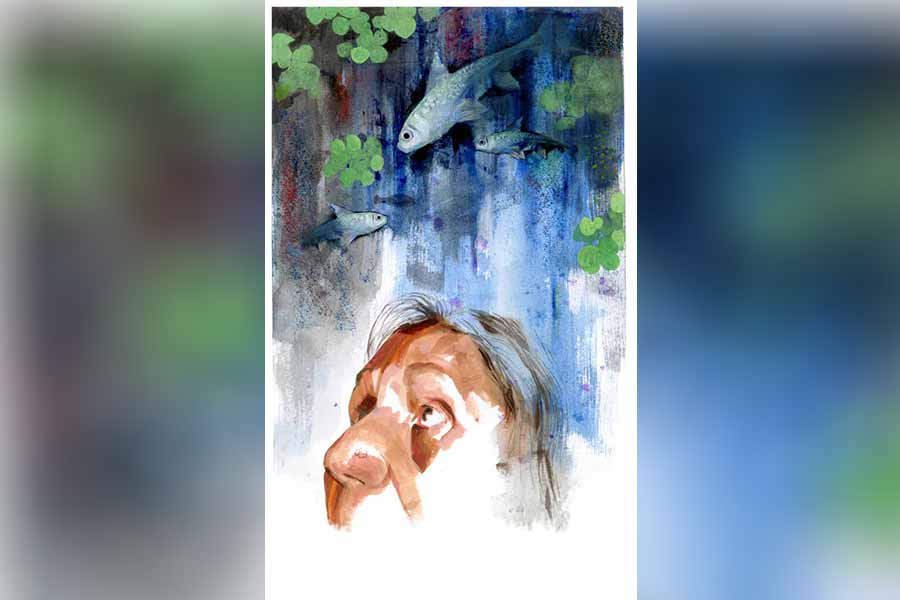

 
 <h1 align=center>বড়বাবু</h1>
<h2 align=center>বীরেন শাসমল</h2> 

কনকনে শীতের রাত। চার দিক ঘুরঘুট্টি অন্ধকার।

জলের ও দিকটায় কি কোনও শব্দ হল?

নিজের সঙ্গেই আপন মনে কথা বলে চলে বুড়ি, “পুকুরের জল যত কমবে, মড়াদের রাতচুরুনি তত বাড়বে। গেরামের এ দিকটায় এখুনো ইলেটিরি আসেনি। ও পাড়ায় জ্বলছে ভূতুড়ে বাতি। শিরীষ, অর্জুন, আম, জাম, বাবলা গাছের ঘুপচির মধ্যে ভূতের মতন নুক্কে রয়েচে এক একটা ইলেটিরি বালব। ছেলে ঘরে ঘুমুচ্ছে। আমি জেগে থেকে ভূত তাড়াচ্ছি। মড়ার চোকে যে ঘুম নাই, কী করি! মা হওয়ার জ্বালাযন্তন্না কি কম! চোকে ঘুম কী করে থাকবে বলেন? সাত রাজার ধন আগলে বসে আছি না!”

বুড়ির নাম হীরামণি বেরা। এই মাটির বাড়ির পিছনে রয়েছে তার ছোটখাটো পুখরি।

“আমি বাপ পুকুর বলতে পারি না। তা পুখরি ছোট হলে কী হবে, এ তো হীরামণির ভান্ডার! পুখরি ভর্তি মাছ। নানা কিসিমের মাছ ছেড়েছে হীরামণি গো। সুবন্নরেখা নদী থেকে পোনা নিয়ে যে ব্যাপারিরা আসে, বড় বড় অ্যালমুনির হাঁড়ি নিয়ে, তাদের কাছে হীরামণি এক রগুড়ে বুড়ি। মিরগেলের ছানাকে আমার কাচে রুই বলে চালাবে, ওটি হচ্চে না। ঘাড় বেঁকানো ক্যাতলার চারা, আধ ঘণ্টার পরে মরে যাবে, ও দিয়ে সুবিধে হবেনি গো— বুড়ি ঠিক চিনে ফেলবে।”

ঝপ করে শব্দ হল না?

কান খাড়া হয়ে উঠল হীরামণির। তার পাঁচ ব্যাটারির টর্চ। পালাবে কোন দিক দিয়ে? হীরা চুপিচুপি ঘাটের উপর দাঁড়িয়ে টর্চ মারে। আলোর রশ্মি ধরে অনেক দূরতক স্পষ্ট দেখা যায়। শব্দটা কোন দিক থেকে এল?

আবার শুরু হয় হীরামণির ফিসফিস, “চাদ্দিক মোটা জাল দিয়ে ঘেরা করেচি। মোটা মোটা বাঁশের খুঁটি দিয়ে জাল টাঙিয়েছি, কোন দিক থেকে আসে মড়ার চোর? আরে বুড়ি হীরার মাছ চুরি করা অত সোজা নয় রে। বানভাসিতেও তার মাছ হরির লুটে যায়নি। যত্ন করতে হয় রে। এ বুড়ির পুখরি তার রাজপাট। পুখরির একটা সংসার আছে। যেমন তেমন ভাবিসনি রে আবাগির ব্যাটারা! বর্ষায় নাল কেটে দিই। মুহানি পরিষ্কার করি। জল ঢোকে, আবার বেরোয়। মাছ য্যামন বেরোবার জন্য ছটফট করে, তেমনি ঢোকবার জন্যও তাদের কম আনন্দ না। কই মাগুর শিঙি ল্যাটা শোল ট্যাংরা পুঁটি খলবল করতে করতে ঢোকে। আর তাপ্পর বেরোবার রাস্তা বন্ধ করে দিই।

“শীতে গিরিষ্মিতে ছেলেরা খ্যাপলা জাল ফেলে কিছু তুলে নেয়। মিহিজালে মৌরলা তোলে। সে তুলুকগে যাক, কিন্তু খপদ্দার! রুই কাতলায় হাত দিতে দিই না। আমার পুখরিতে রুই-কাতলার বাড়বাড়ন্ত দেখে লোকের হিংসে হয়, দিবারাত্তর চোখ টাটায়। হোক গা। হীরামণি মাছ পালপুষ করে। এমনে এমনে হয় না। বাড়ির লোকজনকেও পষ্ট বলা আছে, যত পারো কালা মাছ খাও, কিন্তু রুই কাতলে হাত দিয়ো না। ওরা বাড়ুক।”

আর কোনও সাড়াশব্দ না পেয়ে হীরামণি ঘাটের কাছে চলে আসে। গাছ চিরে কতকগুলি তক্তা বানিয়ে উপর থেকে নীচতক পরিপাটি ঘাট বাঁধানো হয়েছে। হীরামণির হঠাৎ কী হয়, ঘাটের একেবারে নীচের ধাপে নেমে গিয়ে জল ছুঁয়ে বসে।

“কী রে, সব কেমন আছিস?”

মাছগুলো কুবকাব শব্দ করে। ওরা কি ঘুমোচ্ছে? হীরামণি পা ডুবিয়ে দেয় জলে। তার পর আদুরে গলায় বলতে শুরু করে, “আরে আরে, ঠিক পায়ে মুখ ঘষতে লেগছিস? এখন তো খাবার সময় নয়, কাল ফের দিব তোদের। যা, এখন ভিতরে যা!”

যায় না ওরা। এর মধ্যে চলে এসেছে বড়বাবু।

হীরামণি ভাত দেয়, খুদকুঁড়ো দেয়, বোলতার চাক-ভাঙা, লাল পিঁপড়ে। হীরামণির সাড়া পেয়ে ওরা ঘাটের কাছে চলে আসবে, পায়ে আলতো ঢুঁ মারবে, কিছু দূরে গিয়ে আনন্দে ঘাই দেবে, আবার তিরবেগে সারা পুকুরময় সাঁতরাবে।

আর বড়বাবুর জন্য হীরামণির ‘ইসপেশাল বেবস্তা’। তার জন্য কুঁড়োজাউ ভাত মাখা গোল্লা। হীরামণি একটা একটা গরাস করে দিতে থাকবে আর বড়বাবু হাঁ করে ঠোঁট উপরে তুলে লুফে নেবে।

বড়বাবু কে, সে কথা নতুন লোকে বুঝতে পারে না। জিজ্ঞেস করে হীরামণিকে। সে গদগদ গলায় বলে, “বড়বাবু হল আমার আর এক ছেইলে। সেই কবে নদী থে এসেছিল! তার পর হীরামণির আদর খেয়ে খেয়ে এত বড়টা হয়ে গেল।”

হীরামণি বছরে দু’বার তার মাপ নেয়। মাপ নিতে নিতে বলে, “কতটা বাড়ন হল রে বাবা তোর? বেশ তো গোলগাল হয়েছিস, লোকের চোখ নেগেছে, তাগড়াই যোবক, চোকদু’টা যেন কাচের পারা, সাদায় নীলচে গালপাট্টা, চওড়া পেট, শক্তপোক্ত লালচে কালচে পাখনা। মাথার কাছ থেকে পিঠ বরাবর হালকা নীল— কী সোন্দর গো আমার ছেলের রূপটি! আর এই রুই মাগিগুলোও তো কম সেয়ানা নয়! রূপের বান ডেকেচে তেনাদেরও। লম্বা, সরুমুখ, লাল লাল গা, লাল লাল ন্যাজ। খাবার দেবার সময় বিয়েবাড়িতে ছেলে দেখতে আসা ডবকাদের মতো ছিরিক ছিরিক ছোটে। মাগিরা মহা সেয়ানা! বড়বাবুকে একটু বেশি খাবার দেব,তা হবে না। অমনি সবক’টায় হাঁ-হাঁ করে ছুটে আসবে।”

হীরামণির এই পাগলামিতে তার ছেলে যদিও খুব বিরক্ত। হালকা কথা কাটাকাটি তো লেগেই থাকে।

ছেলে বলে, “তোমার এই পাগলামি ছাড়ো তো মা!”

সেই ছেলে এ বার চাকরি পেয়েছে। কিছুতেই সে বিয়ে করবে না। অনেক সাধাসাধির পর তাকে বাগে আনা হল। বিয়ের দিনক্ষণও ঠিক হয়ে গেল।

কিন্ত বাড়ল একটা ফ্যাসাদ।

পাড়ার মেয়ে-মদ্দ, বৌ-ঝি, নাতি-পুতি, বৃদ্ধ-বয়স্করা ধরে বসল, “এ বার আমরা ঠাম্মার পুকুরের বড় মাছ খাব। আমরা তোমার পুকুরের আখাম্বা বড় সোয়াদিষ্ট পাকা তেল-চকচকে মাছ ছাড়া খাবই না।”

হীরামণি বলল, “সে হয় না বাছা। ওদের এটা সোমসার, সোমসার ভাঙতে আমি দিতে পারি না।”

ছেলে রেগে গিয়ে বলল, “কেন ‘না’ বলছ মা! বিয়ের দিন আর বৌভাতের দিন, এই দু’দিনের তো ব্যাপার! না হয় ক’খানা মাছ তুলতেই হবে! নিজেদের থাকতে বাজারে পয়সা খরচ করে কোন বোকা! কম করে দু’-চার হাজার টাকা থোক বেঁচে যাবে। এতে কী ক্ষতি হবে, যে তুমি ভাল কাজে বাগড়া দিচ্ছ?”

“ও তুই বুঝবি না। ওদের সোমসার আমি নিজে হাতে সাজিয়েছি, সে আমি কানা করে দিতে পারি না...” হীরামণি তার বক্তব্যে অনড় থাকে।

ছেলের বিরক্তি বাড়ে, “সে আবার কী কথা। ওদের কি তুমি চিরকাল আগলে বসে থাকবে, না কি? তুমি আর কত কালই বা বাঁচবে? ওদের ছেলেমেয়ে নাতিনাতনিদের দেখতে তুমি কি ফের স্বর্গ থেকে নেমে আসবে বলতে চাও?”

হীরামণির রাগ হয়ে গেল, “তোরা আমার মরণ চাইছিস?”

“এই দেখো, ওটা একটা কথার কথা। মানুষকে তো মরতেই হয়। হয় আজ, নয় দু’দিন পর!”

“আমি মরলে আমার মাছেরাও আমার সঙ্গে যাবে।”

“হাঃ হাঃ হাঃ! এটা ভাল বলেছ। পুকুর আগলাচ্ছ না যখের ধন আগলাচ্ছ, কে জানে। এ বার লোকে তোমাকে মাছের মা বলে খেপাবে।”

রাতে বিছানায় শুয়ে ঘুম আসে না হীরামণির। ছেলের বিয়ে, আনন্দ হওয়ারই কথা। কিন্তু সে ছটফট করতে লাগল। তার পর অঝোরে কাঁদতে লাগল। কাঁদতে কাঁদতে কখন যেন স্মৃতির দেশে চলে গেল।

সেই বিধবা হওয়ার পরের দিনগুলো। মা-পাখির মতো দুই ডানা দিয়ে আগলে রেখেছিল ছেলেকে। চার দিকে তখন সাপ কিলবিল করছে, ‘আয় হীরা, তোকে ঘর দেব, মান দেব, সোনায় মুড়ে দেব। এই ভরা যৌবন নিয়ে তুই কী করবি? তোকে তো ঠোকরাতে আসবে রে, সামলাবি কী করে?’

রে রে করে তেড়ে যেত হীরামণি! মুখ ছোটাত, “যা রে মড়া শউনের দল। ভালবাসার মাহাজন গো! দু’-দশটা রাঁড় পোষে, তার মুকে আবার ভালবাসার কতা!”

তার পর সে এক বিরাট যুদ্ধ। কী কষ্টে যে আগলেছিল সংসার! কত রকমের নকরা কাজ যে করেছে! তবু ছেলে চাকরি পেতে একটু শ্বাস
নিতে পেরেছে।

সংসার বলতে সংসার! মাছেরাও তার সংসার! সে যে মাছ-অন্ত প্রাণ!

হীরামণি বলে, “কাঠ গিরিষ্মে মানুষের যেমন কষ্ট, ওদেরও তেমন। জলের ধাপ নেমে যায়। ঘোলা হয়ে যায়, গরম হয়ে যায় প্রায় আধ-মানুষ। তখন বেচারিরা শ্বাস নিতে পারে না। উপরে ভেসে ওঠে। দুনিয়ার যত হাওয়া আছে, তাদের কাছে হাঁকপাক করে হাওয়া ভিক্ষে করে।”

ছেলে বলে, “অক্সিজেনের অভাব হয় মা।”

ভাদ্র-আশ্বিনের গুমোটে অস্থির ঝাঁক-ঝাঁক মৌরলা পুঁটি ভেসে ওঠে আর ঘুনিজালে ধরা পড়ে।

ওদেরকে জালের মধ্যে ছটফট করতে দেখে হীরামণি বলে, “আহা রে! মানুষের খাবার জন্য তোদের অকালে মরতে হল।”

ছেলে হাসতে হাসতে বলল, “তোমার ওপর কি প্রাণিজগতের ভার পড়েছে না কি, মা? গোটা দুনিয়ার প্রাণিজগতে খাদ্য-খাদক সম্পর্ক। এমন না হলে তো প্রাণিজগৎ বাঁচতই না। তুমি সবাইকে বাঁচাতে চাইলে ওদের খাদকেরা বাঁচবে কী করে বলতে পারো? তুমি তো প্রকৃতির নিয়মের বাইরে যেতে পারো না।”

ছেলের বৌভাতের দিন হীরামণির মৎস্য-সংসারে গোলযোগ সৃষ্টি হল। হীরামণি ছেলেকে বলল, “এতগুলো লোক খাবে। অনেক মাছ লাগবে। হাট থেকে মাছ কিনে আনার ব্যবস্থা কর।”

ছেলে রাগত স্বরে বলল, “কেন, আমাদের পুকুরেই তো আছে বড় বড় মাছ। ফালতু বাজারে যেতে যাব কেন! অনেক পয়সা দেখেছ নাকি আমার!”

ছেলের বৌ নরম নরম গলায় বায়না ধরল, “মা, আপনার পুকুরের পাকা মাছ খাওয়ার জন্য আমাদের বাড়ির সব্বাই হাঁ করে আছে। দশ গাঁ রাষ্ট্র হয়েছে আপনার বড়বাবুর কথা। এখন বাজার থেকে আনা বরফমোড়া সাতবাসি বিলাসপুর বা অন্ধ্রের মাছ দিলে কি ওরা কেউ খাবে?”

ছেলেও যোগ দিল, “নিজের পুকুরে ভাল ভাল মাছ থাকতে হাটে যাব কেন মা? লোকে বলবে না, ভাল মাছ নিজেদের জন্য রেখে বাজারি মাছ দিয়ে দায় সারল!”

হীরামণি বোঝে তার প্রতিরোধ ভাঙছে, দুর্বল গলায় বিড়বিড় করে যেতে লাগল, “অ্যাদ্দিন পালপুষ করেছি তো, বুকের ভিতর করকর করে লাগে। লাল লাল রুইমাছগুলো কেমন সুন্দর লাফ দেয়, এত দিন ওদের ছেড়ে ছেড়ে দিয়েছি, বড়বাবুকে কোলে তুলে নিয়ে কত দিন আদর করেছি, কথা কয়েছি...”

ছেলের বন্ধুরা হা-হা করে হেসে উঠল, “মাসিমা, তুমি বুঝছ না গো! এর পরে ওই মাছ তোমার কী কাজে লাগবে? ওর তো গন্ডারের চামড়া হয়ে যাবে। না পারবে খেতে, না পারবে বেচতে।”

ছেলে বিরক্ত হয়ে বলল, “আবারও পাগলামি শুরু করেছ? গাঁসুদ্ধ লোকে বলাবলি করছে, আজ সব আমাদের পুকুরের টাটকা পাকা মাছ খেতে আসবে, সেখানে তুমি সবাইকে চটাতে চাইছ?”

এ দিক পাড়ায় জোর খবর, আজ পাতে পড়বে মাছের মতো মাছ।

হীরামণি গোঁ ধরে বসে থাকে, “তোরা অন্য মাছ নে, বড়বাবুকে নিস না। ও হচ্ছে পুখরির শোভা। ও মাছ নয় রে, মানুষ। কত দিন ওর মুখে খাবার তুলে ধরেছি, ও আমার গা ঘেঁষে সেই খাবার খেয়েছে। ওর মাথায় সিঁদুরের টিপ দিয়েছি। ঘাটে নেমে ডাক দিলেই ও চলে আসত কাছে। ও তোরই মতো আমার আর একটা ছেইলে রে! বড় মায়ার জীব... একটু বোঝ রে বাপ আমার...”

না, হীরামণির ওজর-আপত্তি কেউ কানে তোলে না।

জালে পড়ে বড়বাবু পাশসাঁতার দেয়। তাকে দেখার জন্য লোক জমে যায়। বড়বাবু এ-পাশ ও-পাশ ওল্টায়। পাল্লায় তুলতে ওজন দাঁড়ায় প্রায় চোদ্দো কিলো। ছেলে-ছোকরারা জমে গিয়ে সে কী হাততালি!

পুকুরের পাড়ে দাঁড়িয়ে হীরামণি কেমন যেন অসুস্থ বোধ করতে লাগল। হঠাৎ সে মাটিতে বসে পড়ে বড়বাবুকে জড়িয়ে ধরে হাউহাউ করে কাঁদতে লাগল। মাছটার গায়ে হাত বোলাতে বোলাতে হীরামণি সুর করে কান্নায় আছাড়িপিছাড়ি খেতে লাগল, “ঘাটে গেলে আর আমি কাকে আদর করব গো! কে এসে আমার পা ঘেঁষে আদর খাবে গো! ঘাটে নামলে কে ভুসভুস করে ভেসে উঠবে গো! আমার জলের রাজা চলে গেলে আমি কী নিয়ে বাঁচব গো!...”

লোকজন প্রবোধ দেয়, “ও মাসি, ও দিদি, তোমার ঘরে নতুন বৌ এসেছে, নতুন আত্মস্বজন, তোমার তো আনন্দের দিন। তুমি একটা মাছের জন্য এমন ভাবে কাঁদবে?”

“ও তোমরা কেউ বুঝবে না গো।”

হীরামণি ঠায় বসে রইল। অঝোর কান্নায় তার সুমুখের চরাচর ঝাপসা হয়ে গেছে।

মাছটা কাটা হচ্ছে পেল্লায় এক বঁটিতে। দু’জন ধরে আছে। মাছ ছটকাচ্ছে খুব। হীরামণির গা ছিঁচড়ে উঠল। মাথা ঘুরতে লাগল। মাছটি দু’খণ্ড হয়ে যেতে হীরামণি হাহাকার করে উঠল। সে এখন অন্ধকার দেখছে দুই চোখে।

মাছের গাদা-পেটি আলাদা হচ্ছে। হীরামণি আর সহ্য করতে পারল না। ঘাটে আছড়ে পড়ে গড়াতে গড়াতে একেবারে জলে গিয়ে পড়ল।

“ধর ধর!” করে তুলতে গিয়ে লোকজন দেখল হীরামণি জলে ভাসছে, আর হুবহু তার বড়বাবুর মতো পাকুল খেতে খেতে ক্রমশ জলের গভীরে চলে যাচ্ছে!

