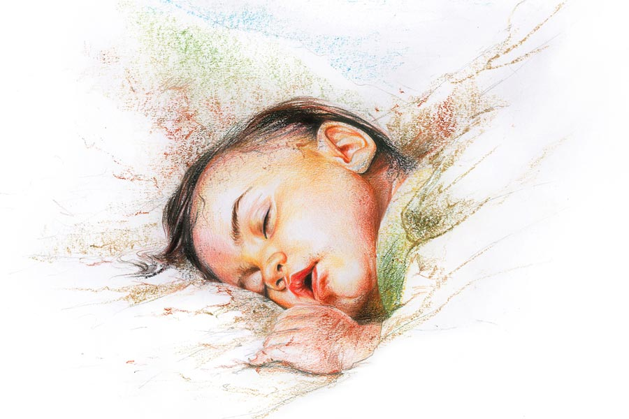

 
 <h1 align=center>বরখা</h1>
<h2 align=center>দেবকীনন্দন বন্দ্যোপাধ্যায়</h2> মোবাইলটা বেজে উঠল। স্ক্রিনে ভেসে উঠল সিস্টার সেবিস্টিয়ানের নম্বর। আমার আজ কোভিড ওয়ার্ডে ডিউটি চলছিল এত ক্ষণ। সবে একটু বিরতি নিয়ে মুখ থেকে মাস্ক খুলে কফিতে চুমুক দিয়েছি। জানতাম আজ ও কল করবে। প্রতি বছর জন্মদিনে ওর ফোন পাই সন্ধেবেলা। ২০০৫ সাল থেকে ধরলে তার পর পনেরো বছর কেটে গেছে, কিন্তু এক বছরও ব্যতিক্রম হয়নি। মনে পড়ে গেল পনেরো বছর আগের সেই ভয়ঙ্কর রাত্রিটার কথা।

সে দিন ডিউটির শুরু থেকে বৃষ্টি। ভাগ্যিস কোয়ার্টার থেকে বেরিয়েছিলাম বৃষ্টি শুরুর আগে, না হলে পুরো ইউনিফর্ম ভিজে যেত। নাইট ডিউটি আজ। এই বাদলা রাতে আমার আস্তানা উধমপুর আর্মি কম্যান্ড হসপিটাল। জম্মু কাশ্মীরের অন্য জায়গার মতো উধমপুর জায়গাটা বাঙালির কাছে বিশেষ পরিচিত নয়। কিন্তু উধমপুর ক্যান্টনমেন্ট অত্যন্ত গুরুত্বপূর্ণ এক সেনা ঘাঁটি, উত্তর ভারতের সেনার সদর দফতর। এই উধমপুর থেকেই নিয়ন্ত্রিত হয় পশ্চিমে পাকিস্তান ও উত্তরে চিনের মতো দু’টি গুরুত্বপূর্ণ সীমান্ত। ভারতীয় সেনাবাহিনীর প্রায় ষাট শতাংশ সেনা এখানেই কর্মরত। তাদের দেখাশোনার জন্য আছে উধমপুর সেনা হাসপাতাল। সেখানে আজ এই ২০০৫ সালের ৮ অক্টোবর, ডিউটি করছি আমি,আর্মি মেডিকেল কোরের তরুণ চিকিৎসক, মেজর ব্যানার্জি। পাশের ঘরে আছে আমার সহকারী ডাক্তার ক্যাপ্টেন বিক্রমজিৎ চৌধুরী। পদবি চৌধুরী হলেও হরিয়ানার ছেলে বিক্রমজিৎ, দক্ষ চিকিৎসক। আজ এই ঝড়জলের রাতে আমাদের উপর পুরো হাসপাতালের দায়িত্ব।

বাইরে বৃষ্টি পড়ছে ঝিরঝির করে, তাই রোগীদের আনাগোনাও অন্যান্য দিনের তুলনায় কম। অক্টোবরের উধমপুর, জাঁকিয়ে না হলেও শীতকাল ধীরে ধীরে তাঁবু খাটাচ্ছে কাশ্মীর উপত্যকায়। নৈশভোজের দেরি আছে। ঠান্ডা কাটাতে এক কাপ কফিতে চুমুক দিচ্ছিলাম। হঠাৎ নজরে এল  ঘরের বাল্‌বটা যেন কাঁপছে। নিজের পায়ের পাতাও কেঁপে উঠল থরথর করে। এ তো ভৌতিক কাণ্ড! ঘরের দরজায় জোরে জোরে কে ধাক্কা মারছে। দৌড়ে উঠে দরজা খুলতেই দেখলাম, অ্যাম্বুল্যান্স ড্রাইভার নৌসাদ কাঁপছে আতঙ্কে, সে বলল, “স্যর শিগগির বেরিয়ে আসুন, ভূমিকম্প হচ্ছে!”

পড়িমড়ি করে ছুটলাম। মেন গেটের সামনে তখন প্রচুর লোক। সকলেই বৃষ্টির জলে অঝোরে ভিজছে। হাসপাতালে ভর্তি থাকা রোগীরাও রোগযন্ত্রণা ভুলে প্রাণ বাঁচাতে বেরিয়ে এসেছে বেড ছেড়ে। হাসপাতালের বিশাল বিল্ডিং তখনও যেন দুলছে। মিনিট তিনেক ভূকম্পন চলার পর মাটি স্থির হল। সংবিৎ ফিরতেই মনে পড়ল, আজ ঠিক কয়েক ঘণ্টা আগেই এখান থেকে কিছুটা দূরে পাক-অধিকৃত কাশ্মীরে ভয়ঙ্কর ভূমিকম্প হয়েছে, এটা তারই প্রতিক্রিয়া হয়তো। ‘আফটারএফেক্ট’ যে এতটা ভয়াবহ হয়, এই প্রথম টের পেলাম। ভাল করে চার দিকে তাকাতেই চোখে পড়ল হাসপাতালের কিছু জায়গায় অল্প ফাটল ধরেছে, পাঁচিল জায়গায় জায়গায় ভেঙে পড়েছে। কী সৌভাগ্য যে বড়সড় কোনও ক্ষতি হয়নি! পাশে থাকা ক্যাপ্টেন বিক্রমজিতের দিকে তাকালাম। সেও আমার মতো কিংকর্তব্যবিমূঢ়। কী যে করব, কিছুই মাথায় ঢুকছে না। আশপাশে সবাই আমাদের মতোই বিহ্বল, কী করা উচিত কেউ কিছুই বুঝছে না। ইতিমধ্যে সিনিয়র নার্সিং অফিসার সেবিস্টিয়ান ওয়াকিটকি নিয়ে দেখছি আমার দিকেই এগিয়ে আসছে দ্রুত।

“মেজর ব্যানার্জি, আপনার জন্য আর্জেন্ট মেসেজ। হেডকোয়ার্টার থেকে কর্নেল রাওয়াত। ইন্টারকম কাজ করছে না কোথাও।” ওয়াকিটকি আমার হাতে দিয়ে বললেন সেবিস্টিয়ান।

ওয়াকিটকি অন করতেই ও প্রান্তে কর্নেল রাওয়াত, “চটপট রিলিফ ভ্যান আর অ্যাম্বুল্যান্স নিয়ে চলে এসো সদর বাজারের সামনে। এখানকার অবস্থা খুব খারাপ। প্রচুর ক্ষয়ক্ষতি হয়েছে। তোমার জুনিয়রকে বলো হাসপাতাল সামলাতে। ওভার অ্যান্ড আউট...” বলেই কেটে দিলেন কর্নেল রাওয়াত।

আদেশমাত্রই কাজ শুরু। আর্মির ব্যাপারস্যাপার, তাও কাশ্মীরের মতো জায়গায়, মোটামুটি সারা ক্ষণই কোনও না কোনও এমারজেন্সির জন্য সবাই তৈরি থাকে। মিনিট পনেরোর মধ্যেই পুরো রিলিফ টিম প্রস্তুত। নার্স ও অন্যান্য মেডিকেল কর্মী-সহ পুরো মেডিক্যাল টিম রওনা দিল, নেতৃত্বে এই অধম, কলকাতার ভেতো বাঙালি। রিলিফ টিমের কনভয় চলছে মুষলধারার বৃষ্টিকে সঙ্গী করে। তীব্র ঝোড়ো হাওয়া বইছে বাইরে। ঠান্ডায় হাত পা জমে যাওয়ার জোগাড়। বাজ পড়ার শব্দ ভেসে আসছে দূর থেকে। কনভয় এগোচ্ছে দ্রুতগতিতে পাহাড়ি সর্পিল রাস্তা দিয়ে, গাড়ির উজ্জ্বল আলো পথের নিকষ কালো অন্ধকার চিরে এগিয়ে যাচ্ছে গন্তব্যস্থলের দিকে। ওয়াকিটকিতে খুব কষ্ট করে বার্তার আদানপ্রদান হচ্ছে। ওয়াকিটকি অন্য বেতারতরঙ্গ ব্যবহার করে তাই রক্ষে, না হলে কোনও কথাবার্তাই হত না এই দুর্যোগের দিনে। ঝড়ঝাপটা পেরিয়ে প্রায় এক ঘণ্টা লেগে গেল ভূমিকম্পের কেন্দ্রস্থল উধমপুর সদর মার্কেট পৌঁছতে। কেউ বললে বিশ্বাস করবে না, এখানে কয়েক ঘণ্টা আগেও বেশ একটা জমজমাট বাজার ছিল। লোকজনের ভিড়ে গমগম করত জায়গাটা। লোকবসতিও ছিল কাছেই, এই অঞ্চলেই পাহাড়ের গা ঘেঁষে বেশ কয়েকটা বড় বাড়ি গড়ে উঠেছিল। এখন সেই সব অতীতের স্মৃতিমাত্র। প্রকৃতি যেন দস্যি মেয়ে, খেলনার মতো বাড়িঘর হাতে নিয়ে ছুড়ে ফেলে দিয়েছে। সব কিছু দুমড়ে মুচড়ে গুঁড়িয়ে গেছে। চোখ পড়ে যায় ‘দরবারি’ রেস্তরাঁর ভেঙে পড়া বাড়িটার উপর। দোতলা রেস্তরাঁটায় কত সুন্দর সন্ধেবেলা কাটিয়েছি। এদের কাশ্মীরি মাটন ইয়াখনি বিখ্যাত, জিভে এখনও তার স্বাদ লেগে আছে। সেই দোতলা রেস্তরাঁ এখন মাটিতে মিশে গেছে। শূন্যদৃষ্টিতে তাকিয়ে আছি সেই শূন্যস্থানের দিকে। হুঁশ ফিরল পিঠে চাপড় পড়তে। তাকিয়ে দেখি কর্নেল রাওয়াত।

ভারী গলায় বললেন, “ভেঙে পড়লে চলবে এখন মেজর? চটপট চলে এসো তোমার টিম নিয়ে। যে দিকে ঘরবাড়িগুলো ভেঙে পড়েছে সেখানে যেতে হবে শিগগির। প্রচুর লোক মনে হয় মারা গেছে।”

কর্নেল রাওয়াত, আর্মি ইঞ্জিনিয়ার কোরের সিনিয়র অফিসার। আজকের এই উদ্ধারকার্যের টিম লিডার তিনি। এর আগেও উনি এ রকম কাজ সাফল্যের সঙ্গে করেছেন ভারতের বিভিন্ন প্রান্তে। ওঁর নির্দেশ অনুযায়ী চললাম শহরের প্রাণকেন্দ্রে। কিছু ক্ষণ আগেও যে স্থানে বেশ কিছু বড় ঘরবাড়ি মাথা উঁচু করে দাঁড়িয়ে ছিল, সেটা এখন একটা ধ্বংসাবশেষ। শুধুই অবাধ ধ্বংসলীলা চোখের সামনে। আর্মির জেনারেটর ভ্যান আনিয়ে বড় ফ্লাডলাইট জ্বালানো হয়েছে। সেই আলোয় উদ্ধারকারী দল কাজ শুরু করে দিয়েছে। প্রবল বৃষ্টিতে ফ্লাডলাইটের তীব্র আলোর রেখা কেটে কেটে যাচ্ছে, কিন্তু তাতে চিড় ধরেনি আর্মির রিলিফ টিমের মনোবলে। একমনে তারা কাজ করে চলছে। স্থানীয় পুলিশ চার দিক কর্ডন করে ঘিরে দিয়েছে, তারাও আর্মির সঙ্গে উদ্ধারকার্যে হাত লাগিয়েছে। একটাই সুবিধে, অন্যত্র যেমন কৌতূহলী জনগণের ভিড় হয়, এখানে সেটা নেই। হয় তারা গুরুতর আহত, বা প্রকৃতির হত্যালীলার কাছে অসহায় ভাবে আত্মসমর্পণ করেছে চিরকালের মতো। বুলডোজার একে একে বাড়ির ধ্বংসস্তূপ সরাচ্ছে আর বেরিয়ে আসছে প্রাণহীন নিথর দেহ। ট্রাকে বোঝাই হয়ে সারি সারি মৃতদেহ চলেছে মর্গের পথে। হতাহতের সংখ্যা গণনা হবে কিছু ক্ষণ পর থেকেই। ভূস্বর্গ কাশ্মীর এখন নরকভূমি। আমাদের রিলিফ টিম এই ঝড়জলের মধ্যে অ্যাম্বুলেন্সের ভিতরেই মেডিকেল ভ্যান তৈরি করে ফেলে আহতদের শুশ্রূষার কাজ শুরু করে দিয়েছে। আমাদের সিস্টার সেবিস্টিয়ান খুবই দক্ষ নার্স। অল্প কিছু সৌভাগ্যবান লোক আসছে, গুরুতর আহত কিন্তু প্রাণ আছে তখনও। সবাই মিলে লড়াই করছি তাদের বাঁচানোর।

এক জনের মাথায় গভীর ক্ষত। সেলাই প্রায় শেষ করে এনেছি, কে এক জন জোরে চেঁচিয়ে উঠল বাইরে। কিঞ্চিৎ বিরক্ত হয়ে বাইরে ঘাড় ঘুরিয়ে দেখলাম, এক জন পুলিশকর্মী। সে প্রায় জোর করে টানতে টানতে নিয়ে গেল একটা ভেঙে পড়া বাড়ির কাছে। বাড়িটা প্রায় গুঁড়ো গুঁড়ো ভূমিকম্পের অভিঘাতে। কিন্তু এ কী দেখছি! একটা শিশুকে বার করে আনা হয়েছে ভেঙে পড়া চাঙড়ের মধ্যে থেকে। রক্তে ভেসে যাচ্ছে তার ক্ষুদ্র শরীর। পরীক্ষা করে বুঝলাম এখনও সে বেঁচে আছে, যদিও ক্রমশ ক্ষীণ হয়ে আসছে প্রাণের স্পন্দন। সবাই মিলে স্ট্রেচারে নিয়ে গেলাম বাচ্চাটাকে, আমাদের মেডিকেল ভ্যানের ভিতর। একটা ফুলের পাপড়ির মতো মিষ্টি শিশুকন্যা, দেখে মনে হল খুব বেশি হলে এক বছর বয়স। চাঙড়ের আঘাতে সর্বাঙ্গ ক্ষতবিক্ষত। সৌভাগ্যক্রমে মাথাটা বেঁচে গেছে। দ্রুত চিকিৎসা শুরু হল। অক্সিজেন, স্যালাইন, যা যা সম্ভব মেডিকেল ভ্যানে, সব শুরু করে দিল আমাদের পুরো টিম। বুঝলাম মেয়েটির বাচ্চাদের জন্য বিশেষ আইসিইউ এক্ষুনি প্রয়োজন, যেটা এখানকার আর্মি হাসপাতাল ছাড়া আর কোথাও নেই।

“সিস্টার, আপনি শিগগির বাচ্চাটাকে নিয়ে আর্মি হাসপাতালে রওনা দিন। এখানে বেশি ক্ষণ থাকলে ওকে বাঁচানো যাবে না...” আমি আদেশের সুরে সেবিস্টিয়ান বললাম।

“কিন্তু স্যর, বাকিদের কী হবে?” আশ্চর্য হয়ে বলল সেবিস্টিয়ান।

“এখানকার জেলা হাসপাতালে মেসেজ পাঠানো হয়েছে, ওখান থেকেও ডাক্তার নার্সের টিম রওনা হয়েছে। পথে আছে ওরা। কিছু ক্ষণের মধ্যেই ওরা পৌঁছে যাবে। আপনি শিগগির মেয়েটাকে নিয়ে বেরিয়ে পড়ুন। নয়তো একটা নিষ্পাপ প্রাণ শেষ হয়ে যাবে।”

ইচ্ছে করেই কঠিন গলায় ইংরেজিতে বললাম। সেবিস্টিয়ান কেরলের মহিলা, খ্রিস্টান। এত দিন আর্মিতে কাজ করেও হিন্দির চেয়ে ইংরেজি ভাল বোঝে। সিনিয়রের আদেশ অলঙ্ঘ্যনীয় সেনাবাহিনীতে, সেবিস্টিয়ান ভাল করেই জানে সেটা। সুতরাং বুঝে গেল অনর্থক কথা বাড়িয়ে লাভ নেই; মেয়েটাকে নিয়ে রওনা দিল আর্মির গাড়িতে হাসপাতালের উদ্দেশে। বাদলঝরা পথে, রাতের অন্ধকারে।

এখন কফি খেতে খেতেই সেবিস্টিয়ানের ফোনটা ধরলাম।

“কেমন আছেন স্যর? আমার মেয়ে কখন থেকে অপেক্ষা করছে আপনাকে জন্মদিনে উইশ করবে বলে। এই নিন ধরুন...” মোবাইলের অন্য প্রান্তে সেবিস্টিয়ানের গলা। পনেরো বছর অতিক্রান্ত হলেও ওর গলা এখনও আগের মতোই সুরেলা। অবসরের নির্ধারিত বয়স হওয়ার আগেই সেবিস্টিয়ান আর্মির চাকরি থেকে আগাম অবসর নিয়ে নিয়েছে। বর্তমানে সেবিস্টিয়ান কেরলের মুন্নারে স্থানীয় এক হাসপাতালে নার্সিং সুপার। মুন্নারের সবুজ পাহাড়ের কোলে ছবির মতো নিজেদের বাড়িতে মনের সুখে দিন কাটাচ্ছে ওরা মা-মেয়ে।

“হ্যাপি বার্থডে আঙ্কল! কেমন আছ তুমি?” বুঝলাম মায়ের হাত থেকে মোবাইল চলে গেছে সেবিস্টিয়ানের মেয়ের হাতে।

“ভাল আছি বরখা, তুমি? তোমারও তো জন্মদিন এসে গেল। কয়েক দিন পরেই তো ৮ অক্টোবর।”

বলতে বলতেই আমার মনে পড়ে গেল ২০০৫ সালের কাশ্মীরের ৮ অক্টোবর। সেই ভূমিকম্পের স্মৃতি, একটা ভয়াবহ দুঃস্বপ্ন। মনে এখনও ভাসে সেই প্রবল বর্ষণের রাত আর ভূমিকম্পের পর ধ্বংসস্তূপ থেকে উদ্ধার করা ছোট্ট মেয়েটার মায়াবী মুখের ছবি। দেখতে দেখতে পনেরো বছর কেটে গেল, কত বড় হয়ে গেল ফুটফুটে বাচ্চা মেয়েটি। গুরুতর আহত ওই নাম-না-জানা শিশুকন্যাটির বাবা-মার খোঁজ পাওয়া যায়নি, অনেক চেষ্টা সত্ত্বেও। সেই অভিশপ্ত রাতে কাশ্মীরের সারবন্দি অগণিত, নামহীন বেওয়ারিশ মৃতদেহের মিছিলে ওর বাবা মা হারিয়ে গিয়েছিল চিরতরে। তাই মেয়েটার আসল নাম, বংশপরিচয় সবই অজানা। মেয়েটা কিন্তু বেঁচে গিয়েছিল আর্মি হাসপাতালের চিকিৎসায়, সবার মিলিত প্রচেষ্টায়।

অবিবাহিতা নার্স সেবিস্টিয়ান সদ্য অনাথ মেয়েটাকে দত্তক নিয়েছিল। কাশ্মীরে আর্মির প্রভাব প্রতিপত্তি বিশাল, তাই সিস্টার সেবিস্টিয়ানকে আইনগত ঝুটঝামেলা বেশি পোহাতে হয়নি বাচ্চাটিকে দত্তক নিতে। ওর আসল জন্মতারিখ জানার কোনও উপায় ছিল না। তাই সেবিস্টিয়ান সেই ভয়ঙ্কর ভূমিকম্পের দিনটাকেই ওর জন্মদিন হিসেবে পালন করত।

উত্তর ভারতের কাশ্মীর থেকে মেয়েটা নতুন আশ্রয় পেয়েছিল সুদূর দক্ষিণে কেরলের মুন্নারে। এক পাহাড় থেকে অন্য পাহাড়ে, এক মা থেকে অন্য মায়ের কোলে। সিস্টার সেবিস্টিয়ান নাছোড়বান্দা হয়ে ধরেছিল, আমাকেই ওর একমাত্র মেয়ের নামকরণ করতে হবে। অঝোর বৃষ্টিতে ধ্বংসস্তূপের মধ্যে নতুন করে জন্ম নিয়েছিল, তাই আমি ওর নাম রেখেছিলাম ‘বরখা’।

উর্দু ভাষায় ‘বরখা’ মানে বৃষ্টি।