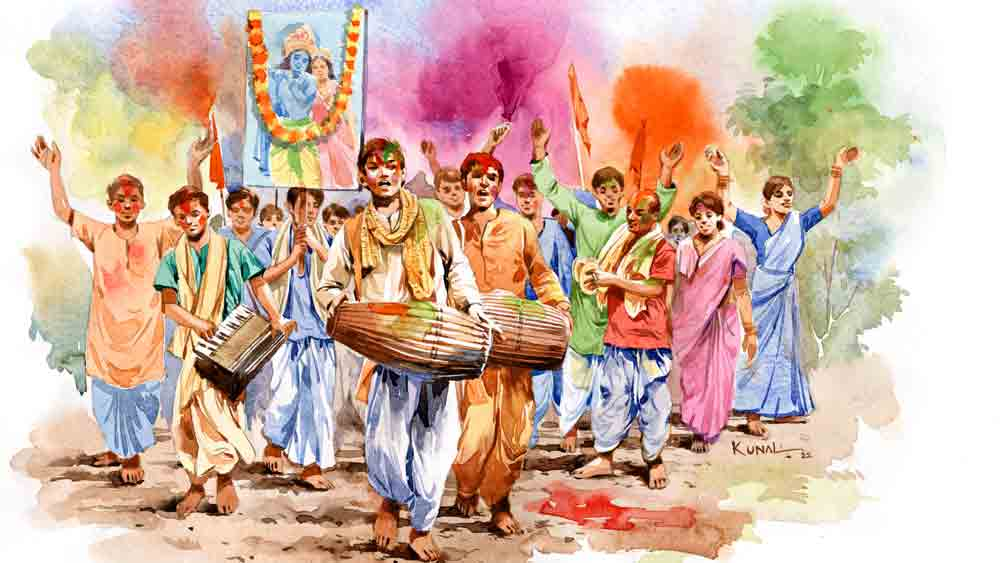

 
 <h1 align=center>বসন্ত পূর্ণিমা</h1>
<h2 align=center>সিজার বাগচী</h2> জায়গাটা দেখে অবাক হল রণিতা। জিজ্ঞেস করল, “এখানে দোল খেলবে? এ তো বৃদ্ধাশ্রম!”

অনন্য হাসল। রুমাল দিয়ে মুখ মুছল। বলল, “আশ্রম নামেই। তেমন বোর্ডার নেই। রিমোট এরিয়া। এখানেই কাল থাকা। দোল খেলা। পরশু ফেরা।”

রণিতা প্রতিবাদ করল না। কোন দিনই বা করেছে? আর করলে পাত্তাই বা কে দিচ্ছে! অনন্যকে তো আজ দেখছে না। নিজের কথার চেয়ে পরের কথায় মানুষটা বেশি চলে। আগে চলত বাবার কথায়। এখন তিনি গত হওয়ায় চলছে অফিস কোলিগ কিংবা বন্ধুদের কথায়।

এ বার অনন্যর মনে হয়েছিল, দোলে বাড়িতে না থেকে কোথাও ঘুরতে যাবে। প্রথমে ঠিক হয়েছিল শান্তিনিকেতন। জেনে খুশি হয়েছিল রণিতা। সেই ছোটবেলা থেকে শান্তিনিকেতনের কথা শুনে এসেছে। কখনও যাওয়া হয়নি। কলেজে পড়ার সময় এক বার অভিনিবেশবাবু প্রস্তাব দিয়েছিলেন যাওয়ার। রণিতা রাজি হতে পারেনি। খানিক ভয়ে, খানিক আড়ষ্টতায়। এ বার ও ভেবেছিল, এত দিনে তবু শান্তিনিকেনের দোল দেখা হবে। সব যখন প্রায় ঠিক, তখন অনন্যর বন্ধু সুদীপ্ত বাগড়া দিল। সুদীপ্তর মতে, শান্তিনিকেতন আর আগের শান্তিনিকেতন নেই। শুধু হুজুগে লোকের মাতামাতি। তাই বন্ধুর পরামর্শে দুম করে ট্রিপ বাতিল করে দিল অনন্য। তার বদলে দামোদরের পাড়ের এই বৃদ্ধাশ্রম।

জায়গাটা নিরিবিলি। কাছাকাছি রাধাগোবিন্দের এক প্রাচীন আশ্রমও রয়েছে। দোলের সকালে এলাকার মানুষজনেরা খোল-করতাল বাজিয়ে আবির ছড়াতে-ছড়াতে গ্রামের পথে-পথে ঘোরে। সুদীপ্ত বুঝিয়েছিল, এখানেই রয়েছে সাবেকি দোলের আনন্দ। তার পরই সেই চেতলা রোড থেকে সোজা গাড়িতে করে ওরা এখানে হাজির।

অনন্য বড় ব্যাগ কাঁধে নিয়ে এগিয়ে গিয়েছে। রণিতা চার পাশ দেখছিল। জায়গাটা বেশ বড়। পাঁচিল দিয়ে ঘেরা। গেট পেরিয়ে অফিসঘর। অনন্য প্রথমে সেখানে ঢুকল। রণিতা দেখল, অফিসঘরের চার ধারে আমগাছের সারি। সব গাছে প্রচুর মুকুল। বিকেল ফুরিয়ে এলেও সন্ধে নামেনি। দিনের এই সময়টুকু বড় একা মনে হয় রণিতার।

আজও একা একা ওই আমবাগানে ও ঘুরতে থাকল। খানিক দূর গিয়ে থমকে দাঁড়াল। সামনে একটা বিরাট বাঁশের সঙ্গে অনেক শুকনো নারকেল পাতা, সুপুরি পাতা জড়ানো। পাশে শুকনো পাতার ঘর। ব্যাপারটা কী বোঝার জন্য রণিতা কয়েক পা এগোতেই কেউ বলল, “ওখানে ন্যাড়াপোড়া হবে।”

পিছন ফিরে রণিতা দেখল, এক বয়স্ক ভদ্রলোক। মাথার সব চুল সাদা। পরনে ফতুয়া-পাজামা। হাতে ছড়ি। চোখাচোখি হওয়ায় বললেন, “আপনারা এখন এলেন?”

“হ্যাঁ,” রণিতা হাসার চেষ্টা করল, “আপনারা এখানেই থাকেন?”

ভদ্রলোক হাসলেন। বললেন, “আপনিই বলা ভাল। এখন তো বেশি কেউ নেই। আমি থাকি। আর থাকেন আর-এক ভদ্রলোক। তিনি অবশ্য ঘরের বাইরে বেশি বেরোন না। সারা দিনই বইয়ে মুখ গুঁজে থাকেন।”

“বাকিরা?”

“বাকিরা কেউ মারা গিয়েছেন। কেউ আবার এমন নির্জনতা পছন্দ না হওয়ায় অন্যত্র চলে গিয়েছেন। আমার জায়গাটা ভাল লাগে। স্টাফেরাও ভাল।”

রণিতা ভদ্রলোকের নাম জিজ্ঞেস করতে যাচ্ছিল, ও দিক থেকে অনন্যর হাঁক ভেসে এল, “কোথায় গেলে? এ বার রুমে যেতে হবে।”

রণিতা দাঁড়াল না। অনন্যর দিকে হাঁটা দিল। দু’জনে গুটি গুটি নিজেদের ঘরে ঢুকল। দোতলায়। দক্ষিণ খোলা ঘর। ঘরের জানলা দিয়ে দামোদর নদ দেখা যাচ্ছে। অবশ্য নামেই নদ। আদপে টালি নালার মতো শীর্ণ স্রোত। দু’ধারে বড়-বড় বস্তা ফেলা। বোঝা যায়, নদের ওইটুকুর মধ্যে দিয়ে প্রবাহিত হওয়া ছাড়া উপায় নেই। সেই ক্ষীণ স্রোতের দু’পাশে বালিয়াড়ি। সেখানে লরির পর লরি দাঁড়িয়ে। বালি তোলা হচ্ছে। নদীর উপর একটা পোক্ত কাঠের সেতুও চোখে পড়ল। যার উপর দিয়ে লরি যাতায়াত করে।

অনন্য জানলা দিয়ে বাইরে তাকিয়ে বলল, “বিউটিফুল। এই জন্য সুদীপ্তকে এত ভালবাসি। শান্তিনিকেতনে এমন নদী পেতে?”

সন্ধে হতেই ওদের ডাক পড়ল। ন্যাড়াপোড়া হবে। সেখানে গিয়ে দেখা গেল সবাই হাজির। বিকেলের সেই বৃদ্ধ বেশ হম্বিতম্বি করছেন। এক বার বিরক্ত হয়ে বৃদ্ধাশ্রমের ম্যানেজারকে বললেন, “আরে পড়ুয়াবাবুকে ডাকুন। এখনও কি ঘরে বসে বই পড়বেন?”

ম্যানেজার খানিক ইতস্তত করলেন। বললেন, “জানেন তো ওঁর শরীর খারাপ। ধোঁয়ায় ব্রিদিং
ট্রাবল হবে।”

“আরে ধুর, পাতা-টাতা পুড়লে কিছু হবে না। আপনি ডাকুন!”

অনন্য-রণিতা এক পাশে দাঁড়িয়ে ছিল। এক জন এসে দু’ কাপ চা দিয়ে গেল। ম্যানেজার আর-এক জনকে পাঠালেন সেই ‘পড়ুয়াবাবু’কে ডেকে আনার জন্য।

বাগানে ইলেকট্রিকের আলো নেই। আকাশে গোল চাঁদ। জ্যোৎস্নায় ভেসে যাচ্ছে চারপাশ। সেই জ্যোৎস্নার আলো এসে পড়েছে গাছে। অনেক দিন বাদে এমন জ্যোৎস্না দেখল রণিতা। সেই কলেজ ছাড়ার পর তো জ্যোৎস্না দেখতে ভুলেই গিয়েছে। এমন চাঁদের আলোর অদ্ভুত ঘোর রয়েছে।

সেই ঘোর কাটল অনন্যর কথায়, “ওই যে বুড়ো এসেছে। এ বার ন্যাড়াপোড়া হবে।”

ওরা দু’জন যে পাশে দাঁড়িয়ে ছিল, তার থেকে খানিক দূরে একটা গাছের অন্ধকারে ভদ্রলোক এসে অল্প ঝুঁকে দাঁড়িয়েছেন। শীর্ণ অবয়বটুকু দেখা যাচ্ছে।

একটা ছেলে গিয়ে দেশলাই দিয়ে ন্যাড়ার ঘরে আগুন ধরিয়ে দিল। দপ করে জ্বলে উঠল শুকনো পাতারা। কাঁসর-ঘণ্টা বেজে উঠল। সেই আগুনের আঁচে পিছিয়ে এল রণিতা। তাকাল ও পাশে দাঁড়ানো দুই বৃদ্ধের দিকে। তার পর থরথর করে কেঁপে উঠল। ওর শরীর-মনও যেন পুড়তে শুরু করল। সেই মানুষটা দাঁড়িয়ে। সেই বড়-বড় চোখ। টিকলো নাক। সরু চিবুক।

অনন্য কিছু বোঝেনি। জানতে চাইল, “শরীর খারাপ করছে?”

কোনও জবাব না দিয়ে অনন্যর পাশ থেকে সরে দাঁড়াল রণিতা। সেই আগুন যেন অনেক কিছু মনে পড়িয়ে দিল। সেই কলেজের ক্লাস। অভিনিবেশবাবু পড়াচ্ছেন বৈষ্ণব পদাবলী। আর তন্ময় হয়ে শুনছে রণিতা-দিতিপ্রিয়া-অদিতিরা।      

মাথুর পর্যায়ের পদে বিদ্যাপতির হাহাকার যেন তাঁর কণ্ঠস্বর বেয়ে ঢুকে তোলপাড় করছে রণিতার
মন। ওর আর দোষ কী! সেই
বয়সটাই তো প্রেমের। বিরহের। তখন কি খেয়াল থাকে, যে অধ্যাপকের প্রেমে ও পড়েছে সেই মানুষটা বয়সে কুড়ি বছরের বড়? বরং তখন এটা ভেবেই আনন্দ হয়েছিল, স্যরের এখনও বিয়ে হয়নি!

রণিতাই এগিয়েছিল। অভিনিবেশবাবু প্রথমে সাড়া দেননি। বার বার বলতেন, “তুমি অনেক ছোট।”

“তাতে কী হয়েছে? আপনি তো বিয়ে করেননি!”

“আমি বিয়ে করিনি পারিবারিক কারণে। বাবা মারা গেলেন অল্প বয়সে। আমার ওপরে এক দিদি, নীচে দুই বোন। আমিই একমাত্র ছেলে। একে একে দিদি, বোনেদের বিয়ে দিতে হল। মায়েরও শরীর ভাঙল...”

সেই কথা শুনে পিছিয়ে আসেনি রণিতা। বরং আরও বেশি করে আঁকড়ে ধরেছিল মানুষটাকে। মা-পাখির মতো দু’টো ডানার নীচে আশ্রয় দিতে চেয়েছিল ছন্নছাড়া জীবন কাটানো মানুষটাকে। এক সময় তিনি সাড়া দিয়েছিলেন।

কত দুপুর কলেজ কেটে ওরা চলে গিয়েছে গোলদিঘির পাড়ে। প্রিন্সেপ ঘাটে। মিলেনিয়াম পার্কে। এক বৃষ্টিভেজা বিকেলে ভিক্টোরিয়ার পরিকে সাক্ষী রেখে দু’জন প্রথম পরস্পরের ঠোঁটে ঠোঁট রেখেছিল।

তখনই অভিনিবেশ প্রস্তাব দিয়েছিল শান্তিনিকেতন যাওয়ার। বলেছিল, “চলো, দু’জনে গিয়ে লাল আবির মাখব।”

রাজি হতে পারেনি রণিতা। বলেছিল, “বাবা জানলে খুন করে ফেলবে। তার চেয়ে আমি বরং বাড়িতে জানাই। কলেজ শেষ
হলেই যাতে...”

রণিতা ধরেই নিয়েছিল বাবা পছন্দ করবেন অভিনিবেশকে। এত ভাল চাকরি করে। একা থাকে। দেখতে সুপুরুষ। পাত্রীর বাবার আর কী চাই?

কিন্তু অভিনিবেশের কথা জানার পর বাবা এক কথায় এই প্রস্তাব নাকচ করে দেন। মা এসে ওকে বোঝান, “শোন, বিয়ে মানে গাছের ডাল ঝুলে প্রেম করা নয়। লোকটার বয়স কত ভেবেছিস? এমন লোকের সঙ্গে বিয়ে হলে আদৌ তোদের বাচ্চাকাচ্চা হবে? যদি হয়ও তা হলে সেই বাচ্চা বড় হতে-হতে অভিনিবেশ বুড়ো হয়ে যাবে। এমন বুড়োর সঙ্গে তোর বিয়ে কিছুতেই আমরা দেব না। পাড়ার লোক, আত্মীয়রা তো ছি-ছি করবে...”

অনেক পীড়াপীড়ি করেছিল রণিতা। যার ফলে ওর কলেজে যাওয়ার উপর নিষেধাজ্ঞা জারি হল। বাবা তৎক্ষণাৎ পাত্র খুঁজতে
শুরু করলেন।

“দিদি সন্দেশ।”

ছেলেটা এসে ওর সামনে একটা প্লেট ধরেছে। তাতে অনেকগুলো সন্দেশ রাখা। রণিতা হেসে একটা সন্দেশ নিল। দেখল, বিকেলের বৃদ্ধের সঙ্গে গল্প করছে অনন্য। অভিনিবেশকে দেখা গেল না।

ও এ বার ছেলেটাকে জিজ্ঞেস করল, “আর এক ভদ্রলোক যে এসেছিলেন...”

“তিনি চলে গিয়েছেন।”

কথা বাড়াল না রণিতা। পায়ে পায়ে বাগান থেকে রুমের দিকে এগোল। নিজের মনে হাসল। বাবার ভয় পেয়েছিলেন, রণিতার ছেলেপুলে হলে তাদের ভবিষ্যৎ কী হবে! কিন্তু তিনি ভাবতেও পারেননি, সেই পথ আগেই বন্ধ হয়ে গিয়েছিল।

অনেক খুঁজে বাবা জোগাড় করেছিলেন অনন্যকে। দেখতে সুভদ্র। ব্যাঙ্কে চাকরি করে। বাড়ির এক ছেলে। নিজেদের দোতলা বাড়ি রয়েছে চেতলা রোডের উপর।

কিন্তু বিয়ের পর রণিতা টের পেল, ওর শ্বশুরবাড়ি আসলে ঘুণ ধরা কাঠের মতো। উপর থেকে ঠিকঠাক। ভিতরে পুরো ফোঁপরা। শ্বশুরমশাই বেজায় রক্ষণশীল। শাশুড়ির শরীরে হাজার রোগ। সারা দিন খিটখিট করেন। এবং তাঁর বদ্ধমূল ধারণা ছিল, বিয়ে হলে ছেলে হাতছাড়া হয়ে যায়। সবচেয়ে বড় কথা, অনন্য একেবারে ব্যক্তিত্বহীন। বাবা চোখ গরম করলেই কুঁকড়ে যেত। রণিতার এক-এক সময় মনে হত, ওকে কেউ যেন গাড়ির ডিকিতে চেপেচুপে ঢুকিয়ে ডালা বন্ধ করে দিয়েছে।

সমস্যা দেখা দিল বিয়ের মাস ছয়েক বাদে। যখন এত মাসেও রণিতা অন্তঃসত্ত্বা হল না। শ্বশুরের নির্দেশে অনন্য এক দিন ওকে নিয়ে গেল গাইনিকোলজিস্টের কাছে। সেখানে ধরা পড়ল রণিতার পলিসিস্টিক ওভারি সিনড্রোম এবং আরও কিছু জটিলতা রয়েছে। ও কোনও দিন মা হতে পারবে না।

এর পর শ্বশুরবাড়িতে ওর জীবন দুর্বিষহ হয়ে উঠেছিল। এতটাই যে এক বার গলায় দড়ি দিয়ে আত্মহত্যা করতে চেয়েছিল। বাবা জানতে পেরে এসে শ্বশুরমশাইকে শাসিয়ে যান। সেই থেকে শুরু হল ওই বাড়িতে ওর শান্তিপূর্ণ সহাবস্থান। এখনও শাশুড়ি ভাল করে কথা বলেন না ওর সঙ্গে। বিয়ের পঁচিশ বছর হয়ে গেল!

ঘরে এসে চুপ করে বসে থাকল রণিতা। সন্ধেবেলা অভিনিবেশকে দেখার পর কিছুই ভাল লাগছে না। মানুষটার কাছে গেলে হত। কিন্তু এখানকার এক কর্মচারীর কাছে শুনেছে, অভিনিবেশ শুয়ে পড়েছে।

পরদিন সকালে ঘুম ভাঙল হইহই শব্দে। দু’জন বাইরে আসতেই চায়ের কাপ ধরিয়ে দেওয়া হল। এল লুচি-আলুর দম। এর পর আবির খেলা শুরু। রণিতা লক্ষ করল, এই খেলাতেও অভিনিবেশ নেই। খানিক বাদে সবাই বেরিয়ে পড়ল মিছিল করে। সঙ্গে খোল, করতাল। ঠোঙায় আবির। অনন্যও যোগ দিল।

শুধু রণিতা বলল, “শরীর ভাল নেই। রোদে যাব না।”

সবাই বেরিয়ে পড়তে রণিতা একটা লাল আবিরের প্যাকেট নিয়ে গিয়ে দাঁড়াল অভিনিবেশের দরজার বাইরে। আলতো টোকা দিল।

ভেতর থেকে ক্ষীণ স্বর বলল, “খোলা।”

রণিতা ঘরে ঢুকল। বেশ বড় ঘর। তিনটে জানলা খোলা। এক ধারে বিছানা। আর এক ধারে বড় টেবিল-চেয়ার। সেই টেবিল উপচে
পড়ছে বইয়ে।

অভিনিবেশ চেয়ারে বসেছিল। হাতে বিভূতিভূষণ বন্দ্যোপাধ্যায়ের ‘দিনের পরে দিন’। রণিতা ঢুকতেই চোখাচোখি হল। খানিক ক্ষণ অবাক হয়ে ও তাকিয়ে থাকল। অস্ফুটে বলল, “তুমি!”

“কাল আমায় দেখতে পাওনি?”

মাথা নাড়ল অভিনিবেশ। বলল, “পেটে কষ্ট হচ্ছিল। প্রায়ই হয়। তার ওপর শ্বাসকষ্ট। আমি অল্প থেকেই চলে এসেছি।”

“তুমি এখানে কেন?”

“আর কোথায় থাকব?” ক্ষীণ হাসল অভিনিবেশ, “দিদি-বোনেদের নিজেদের সংসার। আমার সংসার
হল কই!”

“বিয়ে!”

জানলা দিয়ে বাইরে তাকাল অভিনিবেশ। বলল, “হয়নি।”

চট করে কিছু বলতে পারল
না রণিতা। এক সময় মৃদু স্বরে
বলল, “আমি কেমন আছি জিজ্ঞেস করবে না?”

অভিনিবেশ এ বার মুখ ফেরাল। বলল, “তুমি ভাল নেই।”

“কী করে বুঝলে?”

কোনও জবাব দিল না অভিনিবেশ। শুধু চেয়ে থাকল।

রণিতা ধীরে ধীরে ওর কাছে এগিয়ে গেল। হাতের প্যাকেট থেকে আবির নিয়ে অভিনিবেশের
মুখে মাখিয়ে দিল। বলল, “মনে আছে আমাদের সেই শান্তিনিকেতনের প্ল্যান? ধরে নাও, এটাই শান্তিনিকেতন।”

অভিনিবেশ এ বারও কিছু বলল না। রোগা ডান হাতে শুধু এক মুঠো আবির তুলে রণিতার চুলে, সিঁথিতে মাখিয়ে দিল। রণিতার হঠাৎ বড় কান্না পেল। কিছু না বলে ও প্রায় দৌড়ে ঘর ছেড়ে বেরিয়ে গেল। নিজের ঘরে গিয়ে ফুঁপিয়ে উঠল। সেই ফোঁপানি থামল অনন্যর ফোনে।

অনন্য উত্তেজিত হয়ে বলল, “তাড়াতাড়ি রেডি হয়ে নাও। আমরা দুপুর-দুপুর বেরিয়ে পড়ব।”

“এই দোলে!” রণিতা অবাক।

“হ্যাঁ, হ্যাঁ। মা বাড়িতে পড়ে গিয়েছে। বোধ হয় কোমরে ফ্র্যাকচার হয়েছে। মিতালি ফোন করেছিল।”

মিতালি হল মায়ের আয়া। রণিতা দ্রুত তৈরি হল। কিন্তু দুপুরে গাড়ি পাওয়া গেল না। সবাই দোল খেলছে। বৃদ্ধাশ্রমের লোকেরা গাড়ি জোগাড় করে দিল বিকেলে। সেই গাড়িতে করে খানিক এগোনোর পরই সন্ধে নামল। রণিতা দেখল, হাইওয়েতে ওদের সঙ্গে চাঁদও চলেছে। অভিনিবেশের কথা মনে পড়ল। এক বার দেখা করে এলে ভাল হত। অন্তত মোবাইল নম্বরটা নেওয়া উচিত ছিল।

অনন্য চুপ করে বসে। রণিতা বলল, “আর এক জন বৃদ্ধ
রয়েছে ওখানে...”

“অভিনিবেশ সান্যাল? তার তো ক্যান্সার।”

চমকে উঠল রণিতা।

অনন্য সেটা খেয়াল করল না। বলে চলল, “ওখানকার স্টাফেরা বলছিল, বুড়ো নাকি বেশি দিন বাঁচবে না। বড় জোর এক মাস...”

রণিতা হঠাৎ চিৎকার করে উঠল, “গাড়ি থামাও। থামাও।”

চালক কিছু না বুঝে ঘ্যাঁচ করে ব্রেক কষল।

অনন্য থতমত খেয়ে জিজ্ঞেস করল, “কী হল?”

রণিতা গাড়ি থেকে নেমে পড়ল। বলল, “তুমি মায়ের কাছে যাও।”
       “আর তুমি?”

“আমি একটা জরুরি জিনিস ফেলে এসেছি। আমাকে ফিরতে হবে।”

অনন্য ঘাবড়ে গিয়ে কিছু বলতে যাচ্ছিল। তার আগেই রণিতা গাড়ির দরজা দুম করে বন্ধ করে দিল।