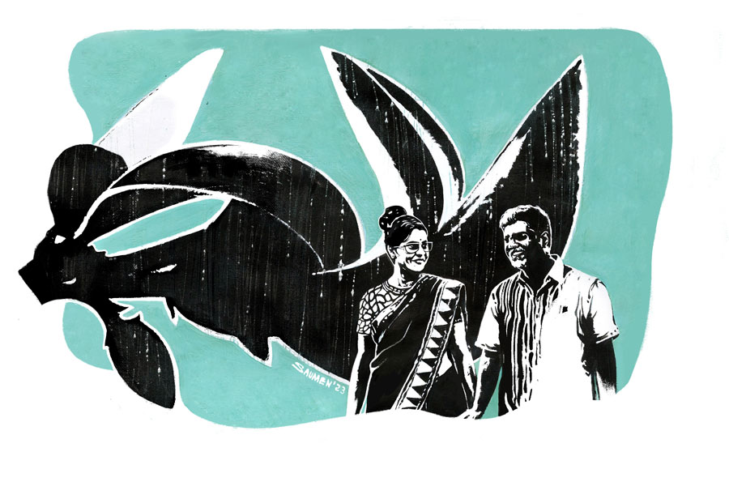

 
 <h1 align=center>বসন্তসখা</h1>
<h2 align=center>নবনীতা দত্ত</h2> গড়িয়াহাটের ফুটপাত। নীল-সাদা জামদানি, সাদা বোটনেক ব্লাউজ়ে মধ্যবয়সি এক মহিলা। চোখে হালফ্যাশনের বেগুনি কাচের রোদচশমা। চেহারাটা ভরাট। ফরসা গালে ঠোঁটের পাশে একটা ছোট্ট তিল, যাকে বলে একদম বিউটি স্পট। ফুটপাত দিয়ে দু’পাশে কী যেন খুঁজতে-খুঁজতে চলেছেন। অবশ্য এই শেষ দুপুরে এমন অনেক সুন্দরী মধ্যবয়সি মহিলাকে এ চত্বরে সাংসারিক জিনিসপত্র খুঁজতে দেখাটা আশ্চর্যের কিছু নয়। আশ্চর্যের যেটা হল, এ দিক-ও দিক দেখতে গিয়ে হঠাৎ তাঁর হাতটা ফুটপাতের এক পাশে দাঁড়িয়ে থাকা এক মধ্যবয়সি পুরুষের হাত ছুঁয়ে গেল।

আর সঙ্গে-সঙ্গেই সেই ভদ্রলোক রেগে গিয়ে চিৎকার করে উঠলেন, “কী হলটা কী?”

মহিলাও চমকে গিয়ে বললেন, “স্যরি, স্যরি। অত্যন্ত দুঃখিত,” বলে সানগ্লাসটা মাথার উপরে তুলে খানিক অবাক হয়ে তাকালেন ভদ্রলোকের দিকে, “আরে! গোগোল না?”

ভদ্রলোক এ বার হকচকিয়ে গেলেন, “না তো।”

“ও!” কেমন আনমনে কথাটা বলে আবার কী একটা খুঁজতে লাগলেন ভদ্রমহিলা।

এ বার ভদ্রলোক গলা খাঁকারি দিলেন, “কী খুঁজছেন বলুন তো?”

অন্যমনস্ক ভাবে ভদ্রমহিলা বললেন, “আপনিও একটু খুঁজুন না।”

“হ্যাঁ, খুঁজতেই পারি। কিন্তু খুঁজবটা কী?”

ভদ্রলোকের দিকে এ বার ভাল করে তাকালেন ওই ভদ্রমহিলা। মাথা-ভর্তি কাঁচাপাকা চুল, ফ্রেঞ্চকাট দাড়ি, অনেকটা হাইট, বেশ সুপুরুষ। কিন্তু টি-শার্টটা গোলাপি রঙের। বড্ড বাচ্চা বাচ্চা। মনে-মনে একটু যেন হেসে ফেললেন ভদ্রমহিলা।

ভদ্রলোকও এক পলকে পড়ে নিলেন ভদ্রমহিলার কাজলকালো চোখ, কমবয়সে যে ডাকসাইটে সুন্দরী ছিলেন বোঝা যায়। ভদ্রমহিলার ঠোঁটের পাশের ওই বিউটিস্পটে চোখ আটকে গেল ভদ্রলোকের।

ভদ্রমহিলা হেসে ফেললেন, “এই দেখুন না। এক্ষুনি একটা দোকান থেকে দুটো ক্লাচার কিনলাম। টাকা দিতে গিয়ে দেখি ব্যাগের মধ্যে টাকার পার্সটাই নেই।”

ভদ্রলোক অবাক, “পার্সটা নেই মানে? পকেটমার?”

“না, না, পকেটমার কেন হবে? আর ছিনতাই করলে আমি বুঝব না? আমার হাত থেকে মনে হয় পড়ে গিয়েছে। খুব ছোট জানেন, একদম শান্তিনিকেতনি পাউচগুলোর মতো। একটু দেখুন না।”

“দাঁড়ান, অমন যেখানে-সেখানে দেখলে হবে না। আপনি কোন দিক থেকে আসছিলেন বলুন, শেষ যে দোকানে ছিলেন, সেই পর্যন্ত বরং এক বার হাঁটতে-হাঁটতে ঘুরে আসি চলুন।”

“সেই ভাল। আপনি রাস্তার বাঁ-দিকটা দেখুন, আমি বরং ডান দিকটা দেখি। কিন্তু আপনি চিনবেন কী করে? আপনি তো আমার পার্সটা আগে কখনও দেখেননি।”

“বললেন তো শান্তিনিকেতনি কায়দার। ও রকম খয়েরি চামড়ার উপরে ছবি আঁকা পার্স অনেক দেখেছি, চোখে গেঁথে আছে। তা ছাড়া পার্স দেখলে ঠিক বুঝব।”

প্রায় আধ ঘণ্টা সেই ফুটপাত আগাগোড়া তিন বার হেঁটে তন্নতন্ন করে খুঁজেও পাওয়া গেল না ভদ্রমহিলার পার্স।

তিনি প্রায় কেঁদে ফেললেন, “কী হবে? সব টাকাপয়সা যে ওর মধ্যে।”

“আপনার কি এখন টাকাপয়সা কিছু লাগবে?” ভদ্রলোক সরাসরি প্রশ্ন করলেন।

ভদ্রমহিলা এ বার লম্বা করে জিভ কাটলেন, “এ মা! ছি ছি! না না, একদম না। আপনার কাছ থেকে টাকাপয়সা নিতে পারব না। আমায় আবার বাড়ি গিয়ে আসতে হবে। কিছু জিনিস কেনার ছিল। তাই ভাবছি কী করি এখন...”

ভদ্রলোক বললেন, “আপনার বাড়ি কদ্দূর?”

ভদ্রমহিলা একটু ভেবে বললেন, “আমার বাড়ি? আমি কাছেই থাকি, সেলিমপুর।”

“তা হলে তো ভালই। চলুন আপনাকে বাড়িতে ড্রপ করে দিই। আমার গাড়ি আছে সঙ্গে।”

“ইস! আমার জন্য আবার এতটা যাবেন?”

“আমি তো আরও দক্ষিণে থাকি। ও দিক দিয়েই যাব। অসুবিধে নেই।”

“তা হলে বরং একটা কাজ করি। একটা কফিশপে যাই চলুন। গলা একেবারে শুকিয়ে গিয়েছে। একটু কফি খাই। আপনি তো আমায় ড্রপ করতে যাবেনই। তখন না হয় আমার শেয়ারটা আপনাকে দিয়ে দেব।”

“এতটাও কৃপণ ভাববেন না আমাকে। এক কাপ কফির দাম দিতে পারব না?”

“আচ্ছা। চলুন তা হলে।”

গড়িয়াহাট থেকে বাই লেন ধরে ভিতরে ঢুকেই বাঁ হাতে একটা কফিশপে ঢুকে পড়লেন তাঁরা।

অর্ডার হল দুটো ফিউশন কফির। বিভিন্ন স্বাদের কফির জন্যই পরিচিত এই কাফে। দুটো কফি অর্ডার করে ওঁরা বসলেন মুখোমুখি।

ভদ্রমহিলা সানগ্লাসের আড়াল থেকে দিব্যি বুঝতে পারছেন, ভদ্রলোক তাঁর দিক থেকে চোখ সরাতে পারছেন না। মাঝে মাঝে এ দিক-ও দিক দেখে মহিলাকেও মেপে নিচ্ছেন। ভদ্রমহিলাও অবশ্য সানগ্লাসের আড়াল থেকে দিব্যি মেপে নিচ্ছেন ভদ্রলোককে, গলার কাছে একটা তিল, হাতের যেটুকু অংশে রোম রয়েছে, তা প্রায় সোনালি। তবে হাতের ঘড়িটা দেখেই বোঝা যাচ্ছে দামি ব্র্যান্ডের রেপ্লিকা। এ রকম জিনিস দিব্যি চেনেন তিনি।

হঠাৎ ভদ্রলোক সরাসরি বলে বসলেন, “আপনি কিন্তু বেশ সুন্দরী।”

খিলখিল করে হেসে ফেললেন মহিলা। তার পর রিনরিনে কণ্ঠে বললেন, “আপনিও।”

“আমিও কী? সুন্দরী?”

এ বার একেবারে অট্টহাসি। তার পর হাসির দমক কমতেই বললেন, “না, সুপুরুষ।”

“আমি আবার সুপুরুষ! অর্ধেক চুলে তো চুনকাম পড়ে গিয়েছে।”

“ওটাই তো এখন ট্রেন্ড মশাই। সল্ট অ্যান্ড পেপার।”

“আমি অত ট্রেন্ড বুঝি না। যখন যেমন মনে হয়, তেমন সাজি। এই এখন ক’দিন ফ্রেঞ্চকাট ধরেছি। ক’দিন বাদে গালভরা দাড়ি দেখতে পারেন। আবার ক’দিন বাদে হয়তো ক্লিন শেভড।”

“বাহ! আপনি তো দেখছি আমারই মতো।”

“তাই? আপনিও দাড়ি রাখেন?”

আবার খিলখিল করে হেসে উঠলেন ভদ্রমহিলা, “ধ্যাৎ! দাড়ি কেন রাখব? আমি চুলে কায়দা করি। এই আজকে আমার টপনট দেখছেন তো! পরের দিন হয়তো একটা এলো বেণি, কোনও দিন হাতপেঁচানো খোঁপা।”

“সে আপনি সুন্দরী মানুষ। যেমন থাকবেন, তেমনই মানাবে। আমাদের ভাবতে হয়, বুঝলেন।”

স্পঞ্জের মতো নিজের প্রশংসা শুষে নিচ্ছেন যেন ভদ্রমহিলা আর মিষ্টি-মিষ্টি হাসছেন, “বুড়ো বয়সে ফ্লার্ট করছেন মশাই।”

ফ্রেঞ্চকাটে হাত বুলিয়ে নিলেন ভদ্রলোক, “তা একটু করছি। ফ্লার্ট করলে মন ভাল থাকে। আর আপনার মতো সুন্দরী মহিলার সঙ্গে রোজ দেখা করার সুযোগ কোথায়?”

“আপনার গৃহিণীকে বলতে হবে দেখছি। এমন অচেনা এক মহিলার সঙ্গে কী ভাবে ফ্লার্ট করছেন।”

“সে আপনি বলতেই পারেন। তবে তাতে আপনারই বিপদ বাড়বে।”

“মানে?”

“মানে আমার স্ত্রী পরবাসী, মানে পরলোকবাসী। আপনাকে ও পারে যেতে গেলে তো বিপদ।”

“এ বাবা! কিছু মনে করবেন না। জানতাম না তো। তা হলে কি একেবারেই একা?”

“প্রায়। ছেলে আবার প্রবাসী। ফলে একার সংসার। নিজেই রাঁধি, নিজেই খাই। কোনও অপেক্ষা নেই। বন্ধুদের একটা দল আছে, তবে তাঁদের ভরা সংসার। তাই সপ্তাহান্তে আড্ডা বসে আমার বাড়িতে। বাকি পুরো সপ্তাহই একলা ঘর আমার দেশ, আমার একলা থাকার অভ্যেস...” দীর্ঘশ্বাস গোপন করলেন যেন ভদ্রলোক!

“আহা! ভারী কষ্ট,” স্বগতোক্তি করলেন ভদ্রমহিলা।

“না, না, ভারী আনন্দ। কেউ বকুনি দেওয়ার নেই। যা-ইচ্ছে তাই জীবন। মাঝে মাঝেই বেরিয়ে পড়ি।”

“যাক! যা-ইচ্ছে তাই হলেই ভাল, যাচ্ছেতাই না হলেই হল,” একটু যেন হাসলেন মহিলা।

“তা, আপনিও কি একা?” ভদ্রলোক যেন সুযোগ খুঁজলেন।

“না, না মশাই। আমার ভরা সংসার। বাড়িতে আমি নার্স।”

“এমন কেন?”

“স্বামী ডায়ালিসিসের রোগী। তাঁকে নিয়ে একেবারে নাস্তানাবুদ। প্রত্যেক সপ্তাহে হাসপাতালে চক্কর কাটতে হয় আর...” একটু সময় নিলেন ভদ্রমহিলা, “মেয়ে স্পেশ্যাল চাইল্ড। বুঝতে পারছেন তো অবস্থা!”

“আপনার জীবন তো পুরো কণ্টকাকীর্ণ দেখছি।”

“একদম। পিতামহ ভীষ্ম বলতে পারেন!” বলেই হেসে উঠলেন ভদ্রমহিলা।

“কিন্তু আপনার মুখে কোনও মেঘ নেই। কী হাসিখুশি আর সুন্দর আপনি।”

“উফ! আপনি মনে হয় দেখা হওয়ার পরে এই নিয়ে দশ বার সুন্দরী বললেন আমায়।”

“আপনি অবশ্যই সুন্দর মানুষ। এত ঝড় সামলেও যে গাছ এত পরিপূর্ণ, সে তো সুন্দরই।”

সত্যিই কারও মুখে নিজের প্রশংসা শুনলে মনটা যেন তৃপ্তিতে পরিপূর্ণ হয়ে ওঠে। ভদ্রমহিলার চোখের তারায় চিকচিক করছে শেষ-বিকেলের কাফেতে জ্বলে ওঠা আলো। চুলটা ঠিক করে কফির কাপে একটা চুমুক দিলেন, “জানেন, কলেজবেলায় এখানে আসতাম কফি খেতে। তখন অবশ্য কাফেটা অন্য রকম ছিল। সে এক অদ্ভুত সময়। এখনও কারও সঙ্গে এলে কলেজবেলায় ফিরে যাই।”

“তখনও নিশ্চয়ই আমার মতো হ্যান্ডসাম সঙ্গী জুটে যেত আপনার?”

আবার মহিলা খিলখিল করে হেসে উঠলেন, “সে তো জুটতই। এখনই দশ বার সুন্দরী বলছেন, কলেজবেলায় তো হেঁটে গেলে দু’পাশে ফ্ল্যাট হয়ে যেত দশ জন। আর আমার যৌবনের মিটিং স্পটও এটাই ছিল। আমি সকলের সঙ্গে এখানেই মিট করে কফি খেতাম। তাই এখনও এখানে এলে বয়স যেন কমে যায় দশ বছর। ইস! আপনাকে চিনি না, জানি না কত কী সব বলে ফেলছি দেখছেন!”

“এটাই তো সুবিধে। অচেনা মানুষের কাছে মন খুলে দেওয়া যায়। কারণ সে তো বিচার করে না। চেনাজানা লোকের সঙ্গে দেখা করে অত আনন্দ নেই। অজানা মানুষের সঙ্গে কথা বলে যে সুখ, তা চেনা মানুষের আড্ডায় মেলে না, বুঝলেন?”

ভদ্রমহিলা যেন একটু চুপসে গেলেন, ধরা পড়ে গেলেন না কি? এক নিমেষে কফিটা শেষ করে বললেন, “চলুন, এ বার ওঠা যাক। সন্ধে হওয়ার আগে বাড়ি ফিরতে হবে।”

ভদ্রলোকও সায় দিলেন।

ভদ্রমহিলা এ বার বললেন, “আপনার গাড়িটা কোথায় রেখেছেন? আমার পায়ে খুব টান ধরেছে। হাঁটা মুশকিল এখন।”

ভদ্রলোক শশব্যস্ত হয়ে উঠে পড়লেন, “এখান থেকে বেরিয়ে জাস্ট পাশের গলিতেই রেখেছি। আপনি একটু বসুন। আমি গাড়িটা নিয়ে এক্ষুনি আসছি।”

ভদ্রলোক কাফে থেকে বেরিয়ে পা চালালেন পাশের গলিতে।

ভদ্রমহিলা উঠতে যাবেন, এমন সময়ে বিলটা এল।

“আপনি বিলটা রাখুন, উনি একটু ধূমপান করতে বেরিয়েছেন। এখুনি আসছেন।”

ওয়েটার চলে যেতেই তাঁর দিকে তাকিয়ে সময়টা মেপে নিলেন মহিলা। অন্য টেবিলে অর্ডার নিয়ে সে ভিতরে চলে গেল খাবার আনতে। আর এই ফাঁকে যেন পা-টা সোজা করছেন, মুড়ছেন, একটু হেঁটে দেখছেন, এমন ভান করতে করতে গেটের কাছে যাতায়াত করতে লাগলেন ভদ্রমহিলা। তার পরে হঠাৎ একটানে গেট খুলেই হরিণের মতো ক্ষিপ্রগতিতে কাফের ত্রিসীমানা পেরিয়ে গেলেন। পিছন ফিরে তাকানোর আর বালাই নেই। হনহন করে সোজা গড়িয়াহাটের মুখে এসে দাঁড়ালেন। একটা রানিং অটোয় লাফ দিয়ে উঠে বসে পড়লেন। তার পরে দক্ষিণাপণের মুখে নেমে ব্যাগ থেকে শান্তিনিকেতনি ছাপের পার্সটা বার করে দশটা টাকা দিলেন অটোওয়ালাকে।

পার্সের মুখটা ভাল করে এঁটে ব্যাগে পুরে গলি দিয়ে হাঁটতে হাঁটতে চলে এলেন ঢাকুরিয়া স্টেশনে। সেখান থেকে ট্রেন ধরে এগিয়ে গেলেন আরও দক্ষিণে। ট্রেনের জানালায় বসে লম্বা একটা শ্বাস ছাড়লেন। আজকে আর একটু হলেই ফাঁসতেন। উফ! চুলটা খুলে পিঠের উপরে ছড়িয়ে দিয়ে আবার সুন্দর করে একটা এলো খোঁপা করে নিলেন। ট্রেনের জানালা দিয়ে হাওয়া আসছে আর সব ক্লান্তি উড়ে যাচ্ছে। চোখ বুজলেই যেন শুনতে পাচ্ছেন, “আপনি কী সুন্দরী!” ট্রেনের মৃদু আলোয় জ্বলজ্বল করছে ভদ্রমহিলার চোখমুখ।

যাক। দিনটা কী যে ভাল কাটল! এইটুকু প্রশংসাই তো সম্বল। এই আলাপগুলোই যেন ভদ্রমহিলার মনখারাপের দিনের রসদ, অ্যান্টি-এজিং টোটকা। এই জন্যই তো এত বয়সে, এত জটিল জীবনেও তিনি হাসিখুশি, মিষ্টি চেহারায়, পরিপূর্ণ হৃদয়ে যেন একটা প্রজাপতি! এই ভাবেই তো কখনও গড়িয়াহাট, বালিগঞ্জ স্টেশন, সরোবরের সকাল কেটে যায় অপলকে, নতুন মুখের প্রশংসায়। আর ভদ্রলোকের শোচনীয় অবস্থা ভেবে মনে-মনে হেসেই খুন হলেন। একে কফিশপে ফিরে পাখি ফুড়ুৎ, তায় প্রায় হাজার টাকার বিলের ধাক্কা। মনে মনে ভাবলেন, বেশ হয়েছে। যেমন ফ্লার্ট করা। আবার পরক্ষণেই মনে হল, তিনি তো কিছু ভুল করেননি! শুধু একটু সময় চুরি করে নিয়েছেন নিজের জন্য, আর একটু মুগ্ধতা।

তার পর মাথা ঝাঁকিয়ে চিন্তাভাবনাগুলো তাড়িয়ে দিলেন যেন! ব্যাগের মধ্য থেকে বেশ কয়েক পাতা ওষুধ আর দুটো প্রেসক্রিপশন বার করে মিলিয়ে নিলেন। সব ঠিক মতো নিয়েছেন। অনেকগুলো স্টেশন পেরিয়ে, একটা নির্জন স্টেশনে নেমে পড়লেন। বয়স্ক ভারী পদক্ষেপে ফুরফুরে মনে স্টেশনের ল্যাম্পপোস্টগুলো পিছনে ফেলে মিলিয়ে গেলেন প্ল্যাটফর্ম-শেষের অন্ধকারে।

এক সপ্তাহ পরে...

রবীন্দ্রসদনে নন্দন চত্বরে দাঁড়িয়ে এক ভদ্রমহিলা। এমন সময়ে ধীরপদে সেই মহিলার পিছনে এসে দাঁড়ালেন এক মাঝবয়সি কেতাদুরস্ত ভদ্রলোক। ঘড়ি দেখার অছিলায় এক বার ছুঁয়ে দিলেন মহিলার হাতটা। আর সঙ্গে সঙ্গে নিজেই, “কী হলটা কী!” বলে চেঁচিয়ে উঠলেন সেই ভদ্রলোক। ঘটনার আকস্মিকতায় ভদ্রমহিলা ‘স্যরি!’ বলে যুক্তি সাজাতে লাগলেন। কিছুটা বাদানুবাদ, কিছুটা আলাপচারিতা।

শেষ বিকেলের আলতো রোদ তখন এসে পড়ছে নন্দনের সামনের যে রাস্তাটায়, কিছু ক্ষণ পরে সেই রাস্তাটা ধরে হাঁটতে লাগলেন তাঁরা। ভদ্রলোক বলছেন, “আপনি কিন্তু বেশ সুন্দরী!”... কফির গন্ধ ছুঁয়ে গেল যেন দু’জনকে। ভদ্রলোক বললেন, “একটু কফি খেলে হত না?...”

আগের দিনের কফির বিলটা ভদ্রমহিলাকে কেমন গছিয়েছেন ভেবে আত্মবিশ্বাস যেন বেড়ে গিয়েছে তাঁর। আকাশি টি-শার্টের কলারটা ঠিক করে সল্ট অ্যান্ড পেপার চুলে হাত বুলিয়ে নিলেন এক বার।