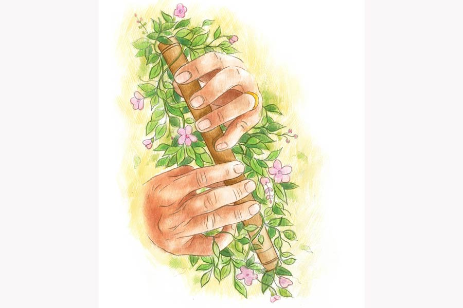

 
 <h1 align=center>বাঁশিওয়ালা</h1>
<h2 align=center>অ্যাঞ্জেলিকা ভট্টাচার্য</h2> রোদ্দুরের আজকাল পড়তে ভাল লাগে না। টিভি দেখতে ভাল লাগে না। মোবাইলে গেম খেলতে ভাল লাগে না। ল্যাপটপ খুলে স্কুলের অনলাইন ক্লাসে জয়েন করে চুপ করে বসে থাকে। স্যরের কথা তার কান পর্যন্ত পৌঁছয় না। রোদ্দুর  খোলা জানলার দিকে তাকিয়ে মেঘলা আকাশ দেখে। জানলার ও পারে একটা বুড়ো সজনেগাছ হাওয়ায় দুলতে থাকে। তার ডালে এসে বসেছে দুটো শালিক। কিছু ক্ষণ আগে এক ঝাঁক ছাতারে পাখি ঝগড়া করছিল। রোদ্দুর দেখে আর হাসে।

সে এ বছর ক্লাস থ্রিতে উঠেছে। তার আগে থেকেই শুরু হয়ে গিয়েছে লকডাউনের বন্দিদশা আর অনলাইন ক্লাস। পর-পর দুটো ক্লাস হয়ে গিয়েছে। ক্লাস জয়েন করা আর লিভ করাই যেন রোদ্দুরের কাজ। ক্লাস শোনা তার কাজ নয়। সে জানলার সামনে গিয়ে দাঁড়ায়। দুটো কাঠবিড়ালি নিজের মধ্যে খেলা করছে। গাছ থেকে গাছে দৌড়ে বেড়াচ্ছে। রোদ্দুর ভাবে, বিনুপিসিদের বাগানটা না থাকলে সে এ সব দেখত কী করে? তাদের তো আর বাগান নেই। 

রোদ্দুর ঘড়ি দেখল। এখন যদি তার স্কুল খোলা থাকত তা হলে এই সময়টা তার টিফিন আওয়ার। সেও কোনও রকমে টিফিন মুখে পুরেই মাঠে গিয়ে দৌড়ে বেড়াত। বন্ধুদের সঙ্গে  মাঠে ফুটবল খেলত। বন্ধুদের সবার ফোন নম্বর আছে রোদ্দুরের মায়ের কাছে। মাঝে মাঝে মা বন্ধুদের মায়েদের সঙ্গে কথা বলে। কিন্তু আজকাল বন্ধুদের সঙ্গে কথা বলতেও  ইচ্ছে করে না রোদ্দুরের। মা ডাকলেই সে পালায়।

রোদ্দুরের বাবা সঞ্জয় পালের বাড়ির একতলাতেই মুদির দোকান। মা শ্রীমতী পাল হাই স্কুলের টিচার। অতিমারি পরিস্থিতিতে দিনের বেশির ভাগ সময় দু’জনেই বাড়িতে থাকেন। মিড ডে মিলের চাল-ডাল দিতে মাঝে মাঝে স্কুলে যেতে হয় শ্রীমতীকে। বাকি সময়টা নষ্ট না করে অনলাইন সেলাই স্কুলে ভর্তি হয়েছে। বিকেলে যোগা ক্লাসেও যায়। আবার সামনের মাস থেকে শ্রীমতীর স্কুলেও অনলাইন ক্লাস চালু হবে।

শ্রীমতী শরীরের ব্যাপারে খুব সাবধানী, সে বলে, “গৃহবন্দি বলেই কি সময় নষ্ট করে শরীরের মেদ বাড়াতে হবে!”

শ্রীমতীর কথা শুনে সঞ্জয় হাসে। মুখে কিছু বলে না। দোকানদারির অবসরে ছাদের এক কোণে বসে বাঁশি বাজায়। কোন ছোটবেলায় শখে দাদুর কাছ থেকে বাঁশি বাজানো শিখেছিল। এখন এটাই তাঁর বাঁচার অবলম্বন, মুক্তির আকাশ।

রোদ্দুর কখন গিয়ে বাবার পাশে বসেছে, “বাবা, আমাকে বাঁশি বাজানো শিখিয়ে দেবে?”

সঞ্জয় বাঁশি থামিয়ে ছেলেকে কোলে টেনে নেয়। কপালে চুমু খায়, বলে, “মা দেখলে কিন্তু খুব বকবে। ক্লাসের সময় ঘুরে বেড়াচ্ছ?”

রোদ্দুর সঞ্জয়ের বুকের উপর মাথা রাখে, “না, এখন ক্লাস নেই। টোয়েন্টি মিনিটস ব্রেক। আবার বারোটা থেকে ক্লাস।”

সঞ্জয়ের এই সময়টা কী ভাল যে লাগে! বড্ড বাবার কথা মনে পড়ে। বাবার বুকেও সে এ ভাবেই মাথা রেখে শুয়ে থাকত। শুয়ে শুয়ে আকাশপাতাল ভাবত।

সে কথা ভাবতে ভাবতেই আনমনে সঞ্জয় বলে ওঠে, “জানিস তো রোদ্দুর, অদ্ভুত সব শখ ছিল আমার। ফড়িং ধরে পিছনে সুতো বেঁধে দিতাম। বারান্দার ঘুলঘুলিতে চড়ুইয়ের বাসা থাকত। মই বেয়ে সেখানে উঠে চুপিচুপি পাখির ছানাগুলোকে দেখে আসতাম। বাবা জ্যান্ত মাছ আনলে, অর্ধেক মাছ কুয়োয় ছেড়ে দিতাম।” 

রোদ্দুরের একমুখ হাসি, “তোমার কোনও বন্ধু ছিল না বাবা?”

“ও মা! বন্ধু থাকবে না কেন? বিশু, খ্যাপা, ছানা, কুট্টি, কার্তিক, গণেশ... অনেক বন্ধু ছিল।” 

রোদ্দুর এ বার জোরে হেসে উঠল, “আমার স্কুলের বন্ধুদের কত ভাল ভাল নাম জানো? স্বর্ণদ্বীপ, অংশুমান, সৃজন। আরও আছে। এরা আমার পাশে বসে। টিফিনের সময় খেলা করি।”

সঞ্জয় বলে, “ওই সব বিদঘুটে নামের বন্ধুগুলো আমার পাড়ার। যাদের সঙ্গে চুটিয়ে আমি মজা করেছি, ওদের আমি খেলতে খেলতে বড় হয়েছি। এই পাড়ার শেষ প্রান্তে একটা বিশাল মাঠ ছিল। বিকেল চারটে বাজলেই ফুটবল নিয়ে বেরিয়ে পড়তাম। ছুটির দিনে রায়পুকুরে সবাই মিলে সাঁতারে মেতে উঠতাম। পুকুরের পাশে কুটুশ ফলের ঝোপ ছিল, সেখানে সবাই মিলে পাকা কুটুশ ফল খেতাম।”

শুনতে শুনতে রোদ্দুরের মুখটা করুণ হয়ে আসে, “বাবা, এই পাড়ায় আমার একটাও বন্ধু নেই। এই পাড়ায় তো মাঠও নেই।” 

সঞ্জয় উঠে দাঁড়ায়। ছাদের কার্নিশের সামনে গিয়ে আঙুল দেখায়, “ওই দেখ, পর্ণমোচী নামে যে কমপ্লেক্সটা, আগে ওখানে মাঠ ছিল। পরে প্রোমোটিং হয়ে গেল। কী সার্থক নাম, পর্ণমোচী! ঘাস গাছ লতা গুল্মের সমস্ত পর্ণ চিরতরে মোচন করে দিয়ে... আচ্ছা, রোদ্দুর  তোর একটা বন্ধু থাকে না ওই কমপ্লেক্সে!”

রোদ্দুর তাচ্ছিল্যের ভঙ্গিতে হাত নাড়ে, “দূর! বন্ধু নয়। এক সঙ্গে স্কুলবাসে যেতাম। এক ক্লাসেই পড়ি, কিন্তু ওর সঙ্গে আমি খেলি না।”

সঞ্জয় অবাক হয়, “কেন খেলিস না?”

রোদ্দুর বিজ্ঞের মতো বলে, “আদিত্যর মা ওকে খেলতে বারণ করেছে। টিফিন আওয়ারে বসে ও ছবি আঁকে। টিফিনের সময় খেললে টায়ার্ড হয়ে যায় তো। স্কুল থেকে এসে আদিত্য মারিয়া ম্যামের কাছে পড়তে যায়। খুব রাগী ম্যাম। পড়তে বসে কেউ ঢুললেই পানিশমেন্ট!” বলতে বলতেই রোদ্দুরের ঠোঁটের কোণে এক চিলতে হাসি, “এখন তো মারিয়া ম্যাম অনলাইন ক্লাস করায়। এখন আর আদিত্যকে পানিশমেন্ট দিতে পারবে না। বেশ হয়েছে!”

সঞ্জয় ছেলের মুখে আলো-ছায়ার খেলা দেখতে থাকে। রোদ্দুর সঞ্জয়ের গলা জড়িয়ে আবদারের সুরে বলে, “বাবা, তুমি এক দিন আমাকে কুটুশ ফল খাওয়াবে?”

দু’জনেই লক্ষ করেনি কখন নিঃসাড়ে শ্রীমতী এসে দাঁড়িয়েছে পাশে। হঠাৎ তার খরখরে গলায় বাপ-বেটার আলোচনায় চমক ভাঙে, “কুটুশ ফল খাওয়াচ্ছি আমি তোকে! বারোটা বাজতে পাঁচ মিনিট বাকি। এখনই ক্লাস জয়েন না করলে রুম লক করে দেবে, জানিস না তুই?”

সঞ্জয় খুব অবাক হয়ে বলে, “সে কী! অনলাইনেও বুঝি রুম লক করা যায়?”

শ্রীমতী বিদ্রুপের সঙ্গে বলে, “তুমি অনলাইন ক্লাসের কী বোঝো? লেখাপড়া শিখে চিরকাল দোকানদার হয়েই রয়ে গেলে। বাঁশি বাজানো আর আলসেমি ছাড়া কোন গুণটা আছে তোমার! পরিচয় দেওয়ার মতো কোন কাজটা করলে জীবনে! মফস্সলের কালচার অন্তত আমার ছেলের মধ্যে ঢুকিয়ো না দয়া করে।”

সঞ্জয় হেসে বলে, “আমরা তো মফস্সলেই থাকি।”

শ্রীমতী এ বার আরও রেগে যায়, “মফস্সলে তুমি থাকো না, মফস্সল তোমার মধ্যে থাকে! তোমার হাড় মাংস রক্ত মজ্জায় মফস্সল ঢুকে বসে আছে। বন্ধুদের কী ছিরি! খ্যাপা, ছানা, কার্তিক। এরা কিছু করতে পেরেছে জীবনে! অভ্র, হিমাংশু, সপ্তক, তনিমা, দিকজয় এদের কারও সঙ্গে তোমার যোগাযোগ আছে? নেই। কিন্তু আমার সঙ্গে এদের এখনও বন্ধুত্ব আছে। এরা সকলেই জীবনে প্রতিষ্ঠিত।” 

যে নামগুলো শ্রীমতী বলল এখুনি, তারা সবাই সঞ্জয় আর শ্রীমতীর কলেজের বন্ধু। এই মফস্সলের কলেজ থেকেই পাশ করেছে সবাই এক সঙ্গে। সঞ্জয় খুশি হয়ে বলল, “তাই! ওরা কি এখানে ফিরে এসেছে না কি? আমার সঙ্গে দেখা হয়নি তো !”

শ্রীমতী এ বার বেশ রেগে গিয়েছে, “তোমার কি মাথা খারাপ হয়ে গেল! এই মফস্সল থেকে বেরোতে পারলে আর কেউ ফিরে আসে! ওরা দিল্লি, মুম্বইয়ের মতো মেট্রোপলিসে এস্টাব্লিশড। তনিমা আর দিকজয় দু’জনেই এখন স্টেটসে। ওদের সঙ্গে আমার সোশ্যাল মিডিয়ায় কথা হয়। তোমার কথা জিজ্ঞেস করে। তুমি কেন সোশ্যাল মিডিয়ায় নেই সেটাও জিজ্ঞেস করে। মিথ্যে বলতে লজ্জায় আমার মাথা কাটা যায়।” 

সঞ্জয় আবহাওয়াটা হালকা করার জন্য বলে, “তুমি বলতে পারো না, সঞ্জয়ের একটা ছোট আনস্মার্ট ফোন আছে। সেটায় সোশ্যাল মিডিয়ায় ঢোকার পাসপোর্ট নেই। তা ছাড়া আমার সোশ্যাল মিডিয়া-ফিডিয়া ভাল লাগে না।”

রোদ্দুর অমনি পাশ থেকে গলা উঁচিয়ে বলে, “না না, ও সব একদম বিচ্ছিরি। ওখানে ছবি আর ভিডিয়ো দেখা যায় শুধু, কাউকে ছোঁওয়া যায় না। বন্ধুদের সঙ্গে ফুটবলও খেলা যায় না।” 

শ্রীমতী রেগে রোদ্দুরের কানটা মুলে দিল, “খুব পাকা হয়েছ তুমি! বড়দের মাঝে কথা বলতে নেই কত বার বলব? ক্লাস থ্রির ছেলে যে এ ভাবে সারা দিন সময় নষ্ট করে ঘুরে বেড়ায়, আমি কোনও দিন দেখিনি। আর তোকে বলেছি না ঘরেও সব সময় ইংলিশে কথা বলতে! তুই কি ঠিকই করে ফেলেছিস যে, বাবার মতো দোকানদারই হবি! চাল, ডাল, নুন, তেল বেচবি! মনে রাখিস, আমার জন্য তুই এই নামকরা স্কুলে চান্স পেয়েছিস। সেটা এই ভাবে জীবনটা বরবাদ করার জন্য নয়।”

সঞ্জয় ছেলের পক্ষ নেয়, “সব সময় কি পড়তে ভাল লাগে কারও?”

শ্রীমতী ফোঁস করে ওঠে, “পড়তে ভাল না লাগলে ড্রয়িং করবে, গিটার বাজাবে। টিচার রেখে এগুলো শেখাচ্ছি কেন তা হলে? কত ভাল ভাল বিদেশি স্টোরিবুক আনিয়ে  দিয়েছি, সেগুলো পড়বে।”

সঞ্জয় আর কথা বাড়ায় না। রোদ্দুরের কান্নাভরা দুটো চোখ দেখে কষ্ট হয়। কিন্তু ছেলেটা এইটুকু বয়সেই কান্না গিলে নিতে শিখে গিয়েছে। ল্যাপটপের সামনে গিয়ে হাসিমুখে বলে, “গুড আফটারনুন, ম্যাম।”  

শ্রীমতী সঞ্জয়ের মুখের উপর দরজাটা বন্ধ করে দিল। ছেলের সামনে অপমানজনক কথা শুনলে আগে খারাপ লাগত, রাগ হত। এখন হয় না। অনেকটা গা-সওয়া হয়ে গিয়েছে। কথাগুলো পুরোপুরি ভুলও নয়। রোদ্দুরের অ্যাডমিশনের সময় ইয়েস, নো, থ্যাঙ্কিউ, ওয়েলকাম ছাড়া বিশেষ কিছু বলতে পারেনি সঞ্জয়। সবটাই সামলেছিল শ্রীমতী।

জীবনে কিছুই করতে পারেনি সঞ্জয়। খুব একটা কিছু যে করতে চেয়েছিল, তাও নয়। সে বুঝতে পারত না কেন সবাইকে একটাই ইঁদুরদৌড়ে শামিল হতে হবে। শিক্ষা কেন শুধু বড় চাকরি বা মোটা মাইনের উপকরণ হবে! কেন সে দোকানদারি করে মোটা ভাতকাপড়ে শান্তির জীবনযাপন করতে পারবে না! 

কলেজে দিকজয় শ্রীমতীকে পছন্দ করত। শ্রীমতী যে কেন সঞ্জয়ের প্রেমে পড়ল, সেটাই  বুঝতে পারে না ও। যদি দিকজয়ের সঙ্গে শ্রীমতীর বিয়ে হত, তা হলে সেও আজ স্টেটসে থাকত। ওখানেই তাকে মানায়।

সঞ্জয় এখনও মাঝে মাঝে নিজেকে প্রশ্ন করে, শ্রীমতী কেন তার প্রেমে পড়ল! কিছু তো এমন ছিল না তার মধ্যে! ইংলিশ মিডিয়াম থেকে পাশ করা শহুরে সুন্দরী শ্রীমতী যখন কলেজে ইংলিশে অনার্স নিয়ে ভর্তি হল, কলেজের সব ছেলেই তার জন্য পাগল হয়ে গিয়েছিল। শ্রীমতীর বাবা চাকরিসূত্রে ট্রান্সফার হয়ে এই মফস্সলে এসেছিলেন।

শ্রীমতী তখন চাঁদের আলোর মতো  সুন্দর, ঝর্নার জলের মতো দুরন্ত একটা মেয়ে। কলেজের প্রতিটি প্রোগ্রামে শ্রীমতীর ডাক পড়ত। নাচ, গান, নাটক কিছুই বাদ ছিল না। সেই নাটকের খাতিরেই সঞ্জয়ের ডাক পড়ল। বাঁশি বাজানোর একটা ছোট পার্ট ছিল। নাটকের রিহার্সালের পরও শ্রীমতী মোহিত হয়ে সঞ্জয়ের বাঁশি শুনত। কিন্তু কেউ স্বপ্নেও ভাবেনি, এমন তুখোড় মেয়ে বাংলা অনার্সের সঞ্জয়ের প্রেমে হাবুডুবু খাবে।

তখন সঞ্জয়ের বাবার একটা ভাঙাচোরা স্কুটার ছিল। প্রায়ই মাঝপথে বেগড়বাঁই করত। সেটা নিয়েই এক-এক দিন কলেজে চলে আসত সঞ্জয়। কলেজ ফাঁকি দিয়েই মাঝে মাঝে দামোদরের ধারে চলে যেত দু’জনে।

ভরা বর্ষায় দামোদরে জল থইথই করত। একটা উঁচু পাথরের উপর বসে দু’জনেই জলে পা ডুবিয়ে বসে থাকত। সঞ্জয় একমনে বাঁশি বাজাত। শ্রীমতী সঞ্জয়ের বুকে মাথা রেখে দূরে মাঝিদের নৌকো বাওয়া দেখত। শ্রীমতী বলত, “আমার খুব মাঝি হতে ইচ্ছে করে। নৌকো ভর্তি যাত্রী নিয়ে এ-পার ও-পার করব। দিনের শেষে যা আয় হবে, তাই দিয়ে দু’জনে দুটো ফুটিয়ে খাব।”

সঞ্জয় হেসে বলত, “আমি কিন্তু নৌকোয় বসে যাত্রীদের বাঁশি শোনাব। তোর নৌকোর বাঁশিওয়ালা হব আমি।”

শ্রীমতী আরও গভীর ভাবে জড়িয়ে ধরত তাকে, বলত, “তা হলে তোকে বাঁশিওয়ালা বলেই ডাকব।”

কলেজের শেষ পরীক্ষার দিন সঞ্জয়ের বাবা মারা গেল। সে বার আর সঞ্জয়ের পরীক্ষা দেওয়া হয়নি। ওর মতো ভাল ছাত্রের এই ঘটনায় কলেজের সমস্ত অধ্যাপকরা আফসোস করেছিলেন। সংসারের হাল ধরতে বাবার মুদি দোকানেই বসে সঞ্জয়। তার পর আর পড়াশোনার সুযোগ হয়নি। শ্রীমতী কলেজ পাশ করে ইউনিভার্সিটি গেল। তার পর বিএড করে পরীক্ষা দিয়ে হাই স্কুলের টিচার হল। এর মধ্যে সঞ্জয়ের মা-ও মারা গেল। সঞ্জয় তখন বড্ড একা। শ্রীমতী হাত ছাড়েনি। সঞ্জয় আরও বেশি করে যেন আঁকড়ে ধরেছিল শ্রীমতীকে। বিয়েটা শ্রীমতীর বাড়ির অমতেই হয়েছিল। রোদ্দুর হওয়ার পর কিছুটা বরফ গলে। সঞ্জয় বুঝতে পারে শ্রীমতীর বাড়িতে সে খুব বেমানান। শ্রীমতীর দুই দাদা থাকে লন্ডনে। শ্বশুরমশাই রাতদিন তাদের গল্পই করেন।

সঞ্জয় লক্ষ করে, রোদ্দুর হওয়ার পর থেকে শ্রীমতী যেন অনেক পাল্টে গিয়েছে।  রোদ্দুরকে  নিয়ে ক্রমশ এক প্রতিযোগিতায় মেতে উঠেছে। সব কিছুতেই তাকে প্রথম হতে হবে। সবার সেরা হতে হবে।

সঞ্জয়ের মনে পড়ে না, শ্রীমতী কবে শেষ তার বাঁশিওয়ালাকে ডেকেছিল। হয়তো আস্তে আস্তে রোদ্দুরও এক দিন বদলে যাবে। কংক্রিট শহরের ছায়ায় ঘুমোতে শিখে যাবে। কিংবা হয়তো খুঁজে নেবে প্রথম বিশ্বের উন্নততর কোনও শহর। তাকে ঘিরে থাকবে অনেক আরাম আর আনন্দ। কে জানে, মফস্সলি এই বাঁশির সুর আর কখনও তার কানে পৌঁছবে কি না!

তবু হাল ছাড়ে না সঞ্জয়। রোজ রাতে শ্রীমতীর পাশে শোওয়া ঘুমন্ত রোদ্দুরের মুখের দিকে তাকিয়ে সে মনে মনে কত কথা বলে। তার পর বাঁশিটা নিয়ে উঠে যায় ছাদে। মফস্সলের জ্যোৎস্নায় ছড়িয়ে পড়ে বাঁশির সুর। বাঁশিওয়ালারা যে চিরকালই রাতজাগা।