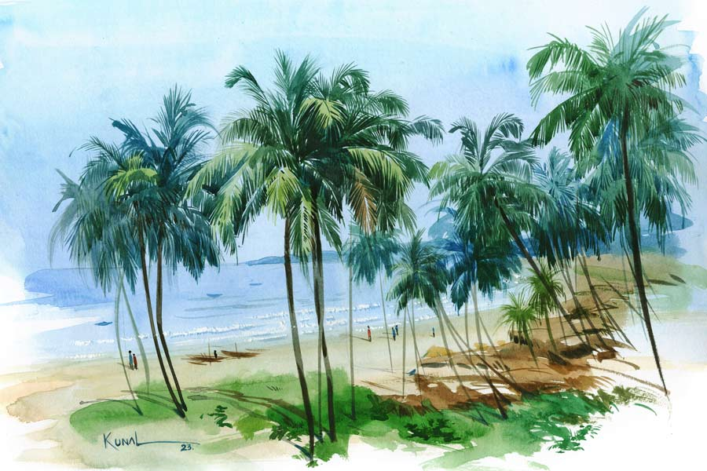

 
 <h1 align=center>বান্ধবীর উপহার</h1>
<h2 align=center>শুভাশিস চট্টোপাধ্যায়</h2> মেয়েটি সত্যিই সুন্দরী। এক বার দেখে আশ মেটে না, চোখ চলে যায় বার বার। দীপঙ্কর চলেছে গোয়া কার্নিভালে যোগ দিতে। নেতাজি সুভাষচন্দ্র বসু বিমানবন্দরের লাউঞ্জে অপেক্ষা করছে। বোর্ডিং পাস পেয়ে গেছে। গোয়ার ফ্লাইট আর ঘণ্টাখানেক পরই। লাউঞ্জে বসে ব্ল্যাক কফি খাচ্ছিল সে। তখনই মেয়েটিকে দেখা। বয়স তেইশ-চব্বিশ বছর। টান-টান নির্মেদ চেহারা। মেয়েটি বসে আছে তার থেকে একটু দূরে, মোবাইলে মগ্ন। গত বছর ন্যাশনাল অ্যাওয়ার্ড পাওয়ার পর দীপঙ্করের একটু নামডাক হয়েছে। ডিসেম্বরের এই সময়ে গোয়ায় জমকালো কার্নিভ্যাল হয়। এ বছর সেখান থেকেই ডাক এসেছে তার। উদ্যোক্তারা যাতায়াতের ফ্লাইটের টিকিটও পাঠিয়ে দিয়েছেন। নিজের আঁকা কয়েকটি ছবিও প্রদর্শনীর জন্য নিয়েছে দীপঙ্কর। ছবির এগজ়িবিশনের পাশাপাশি একটা ওয়ার্কশপও অ্যাটেন্ড করতে হবে তাকে, আছে দেশ-বিদেশের শিল্পীদের সঙ্গে ইন্টারঅ্যাকটিভ সেশনও।

দীপঙ্কর মেয়েটিকে জহুরির দৃষ্টিতে দেখছিল। মেয়েটি সত্যি সুন্দরী, যদি মডেল হিসেবে এক বার পাওয়া যেত! দীপঙ্করের চিন্তায় ছেদ পড়ল সুমিষ্ট নারীকণ্ঠের ঘোষণায়। তার ফ্লাইটের ঘোষণা। দীপঙ্কর উঠে দাঁড়াল, এগিয়ে চলল সিকিয়োরিটি চেকিংয়ের দিকে।

“ওয়েলকাম স্যর। উইশ ইউ আ হ্যাপি জার্নি।”

প্রত্যুত্তরে ‘থ্যাঙ্ক ইউ’ বলল দীপঙ্করও। তার সিট বিজ়নেস ক্লাসে। জানলার একদম ধারে। আসনে বসতে গিয়ে চমকে ওঠে দীপঙ্কর। তার পাশের সিটেই লাউঞ্জে দেখা সেই সুন্দরী মেয়েটা! সে বলে ওঠে, “গুড ইভনিং, আই অ্যাম দীপঙ্কর।”

“গুড ইভনিং...” বলে মেয়েটি হাত বাড়িয়ে বলে, “আই অ্যাম লিজ়া। লিজ়া ডিসুজ়া।”

মিনিট পনেরোর মধ্যেই দীপঙ্করের সঙ্গে দিব্যি আলাপ জমে গেল লিজার। লিজা বাংলাও বলতে পারে শুনে বেশ অবাকই হয়েছিল দীপঙ্কর। লিজ়াই হেসে জানাল, তার মা বাঙালি আর বাবা গোয়ান। ভবানীপুরে লিজ়ার মামার বাড়ি। অফিসের কাজে এসেছিল, এখন আবার গোয়ায় ফিরে যাচ্ছে।

“তা আপনি কি গোয়ায় ঘুরতে? না কোনও কাজে?” প্রশ্ন করে লিজ়া।

দীপঙ্কর তার গোয়া সফরের কারণ খুলে বলায় লিজা চোখ বড় বড় করে বলল, “আপনি পেন্টার? আমার দারুণ শখ জানেন, এক জন শিল্পীর পেন্টিং সামনে থেকে দেখার, তা আপনি উঠছেন কোথায়?”

“হোটেল তাজ ফোর্ট, আগুয়াদা। ওখানেই উদ্যোক্তারা থাকার বন্দোবস্ত করেছেন,” দীপঙ্কর জবাব দিল।

লিজ়া মিষ্টি হেসে বলল, “গোয়া দারুণ সুন্দর জায়গা। কাজের ফাঁকে সময় করে ঘুরে নেবেন। যদি কোনও দরকার হয় আমাকে জানাবেন,” বলে ব্যাগ থেকে ভিজ়িটিং কার্ড বের করে দীপঙ্করের দিকে এগিয়ে দেয় সে।

হাসি-গল্পে প্রায় পৌনে তিন ঘণ্টা সময় কেটে যায় দু’জনের। প্লেন এখন গোয়ায় ল্যান্ড করবে। বিমানসেবিকার ঘোষণায় সিটবেল্ট আটকে নিয়েছে দীপঙ্কর।

আজ পূর্ণিমা। আকাশ থেকে মুগ্ধ বিস্ময়ে পানাজি শহরটাকে দেখছিল সে। অনেক নীচে আরব সাগরে ভাসছে একাধিক জাহাজ। জাহাজের উজ্জ্বল আলোগুলোকে ছোট ছোট টর্চ বলে মনে হচ্ছিল।

লিজ়া বলল, “উপর থেকে শহরটাকে যত সুন্দর দেখছেন, নীচে নামলে দেখবেন আরও সুন্দর। এখনও পর্তুগিজ সংস্কৃতি শহরটার আনাচে কানাচে ছড়িয়ে আছে। আপনি তো আছেন তিন-চার দিন। সব আপনাকে ঘুরিয়ে দেখিয়ে দেব।”

দীপঙ্কর হেসে বলে, “আমার দুটো শর্ত আছে।”

লিজ়ার ভ্রুভঙ্গিতে জিজ্ঞাসু দৃষ্টি দেখে হেসে ফেলে দীপঙ্কর, “না না, তেমন কঠিন কিছু শর্ত নয়, এক, কাল আমার ছবির এগজ়িবিশনে আসতে হবে। আর দুই, আমাকে আর আপনি নয়, তুমি বলতে হবে।”

লিজ়া দুষ্টু হেসে বলল, “ওকে, দ্যাট’স অল? দেন আই আগ্রি।”

পরের তিন দিন দারুণ ব্যস্ততায় কাটল দীপঙ্করের। ছবির প্রদর্শনী, তরুণ শিল্পীদের সঙ্গে ওয়ার্কশপ, আন্তর্জাতিক সেমিনারে বক্তব্য, রুটিনে বাঁধা প্রত্যেকটি মুহূর্ত। উদ্যোক্তারা অবশ্য আতিথেয়তার ত্রুটি রাখেননি। এর মধ্যেই এক দিন এগজ়িবিশন দেখে গেছে লিজ়া।

কাল গোয়ায় দীপঙ্করের কোনও কাজ নেই। ছুটি। পরশু বিকেলের ফ্লাইটে গুয়াহাটি, সেখানে একটি ছবির প্রদর্শনী ও সেমিনার। পার্স থেকে লিজ়ার ভিজ়িটিং কার্ডটা বের করল দীপঙ্কর। দু’-তিন বার বাজতেই ফোনটা ধরল লিজ়া।

দীপঙ্কর বলল, “কাল আমার কোনও কাজ নেই, তুমি আমাকে গোয়া ঘুরিয়ে দেখাবে?”

লিজা হেসে বলল, “শিয়োর। তুমি রেডি থেকো। আমি সকাল আটটার মধ্যে তোমার হোটেলে পৌঁছে যাব গাড়ি নিয়ে।”

“ওকে, গুড নাইট!” বলে ফোন কেটে দেয় দীপঙ্কর।

পরদিন ঠিক সকাল আটটাতেই দীপঙ্করের হোটেলে এসে হাজির লিজ়া। তার পরনে আজ লং স্কার্ট, স্লিভলেস টপ, গলায় স্কার্ফ, মাথায় হ্যাট আর চোখে সানগ্লাস। চোখ সরানো যাচ্ছে না তার দিক থেকে।

সে এসেই তাড়া দিল, “ওহ দিপু! তুমি এখনও তৈরি হওনি।”

আর দেরি করেনি দীপঙ্কর।

হুডখোলা জিপ, গাড়ি চালাচ্ছে লিজ়াই। সামনের সিটে দীপঙ্কর।

“আমরা প্রথমে কোথায় যাচ্ছি লিজ়া?” জিজ্ঞেস করল দীপঙ্কর।

“এক দিনে গোয়া কভার করা ইমপসিবল। তিন থেকে চার দিন লাগে গোয়া ঘুরতে। তুমি কাল সত্যি চলে যাবে, আর দিন দুয়েক থেকে গেলে হত না?” অনুযোগ করে লিজ়া।

“সে উপায় নেই লিজ়া। কাল ইভনিংয়ে গুয়াহাটির ফ্লাইট। পরশু সেখানে আমার ছবির একটা এগজ়িবিশন আছে, যেতেই হবে। পরে আবার আসব গোয়ায়, তোমার সঙ্গে পরিচয় তো হয়েই গেল।”

লিজ়া বলল, “তা হলে সময় যখন অল্প, তখন সব জায়গা তো দেখা হবে না, ফেমাস কয়েকটা জায়গা চলো তোমাকে দেখিয়ে দিই। প্রথমেই আমরা যাব বম জেসাসের ব্যাসিলিকা দেখতে। ১৬০৫ সালে এটি তৈরির কাজ শেষ হয়। শুরু করেছিলেন সেন্ট ফ্রান্সিস জ়েভিয়ার, তবে শেষ দেখে যেতে পারেননি। এখানেই শেষ শয্যায় শায়িত আছেন তিনি।”

গথিক স্থাপত্যে তৈরি এই ব্যাসিলিকা দেখে তারা চলল ওল্ড গোয়ায় ‘দ্য অ্যাসিসি’ দেখতে। গোয়ায় এখন উৎসবের মরসুম। প্রচুর বিদেশি রাস্তা ঘাটে। লিজ়া বলল, “বেশির ভাগই পর্তুগিজ, নয় তো স্প্যানিশ, কিছু আমেরিকান ও ইংরেজও আছে। আসলে গত শতকের ষাটের দশক পর্যন্ত তো গোয়া পর্তুগিজ উপনিবেশ ছিল, সেই টানে এখনও প্রচুর পর্তুগিজ টুরিস্ট আসেন এখানে।”

পথে পড়ল মাণ্ডবী নদী। সেতু পেরিয়ে গাড়ি ছুটল ‘সেন্ট ফ্রান্সিস দি অ্যাসিসি’ দেখতে।

লিজ়া বলল, “১৫১৭ সালে রোমের সেন্ট পিটার্স ব্যাসিলিকার আদলে গড়ে ওঠে এটা, সে অর্থে তোমার রোমও দেখা হয়ে গেল,” হাসল লিজ়া, “তোমায় রোমও ঘুরিয়ে দিলাম, আমায় কী দেবে বলো?”

“তোমার কী চাই বলো?”

“তোমার আঁকা একটা ছবি দিয়ো। আমার কাছে রাখব।”

দীপঙ্কর বলল, “আমার পোর্ট্রেটের মডেল হবে?”

লিজ়া হেসে বলল, “তোমার যদি আপত্তি না থাকে।”

দীপঙ্কর বলল, “এ তো আমার সৌভাগ্য, তোমার মতো সুন্দরী আমার ছবির মডেল হবে। ইনফ্যাক্ট আমিই ভেবেছিলাম, তোমাকে মডেল হতে প্রস্তাব দেব। তার পর ভাবলাম থাক, তুমি আবার কী ভাববে!”

লিজ়া ঠোঁটের কোণে হাসি ঝুলিয়ে বলে, “তুমি নিজে বললে আমার আরও বেশি ভাল লাগত দিপু!”

দীপঙ্কর অবাক বিস্ময়ে সেন্ট ফ্রান্সিস চার্চের মুরাল দেখছিল। চার্চের সারা গায়ে ও ছাদে গিল্টি করা অলঙ্করণ। কাঠের উপর খোদাই করা পঞ্চদশ শতকের কারুকাজ আজও কী জীবন্ত! তেলরঙের ছবিগুলোও অসাধারণ, কী সুন্দর আলোছায়ার ব্যবহার, প্রতিটি অবজেক্ট যেন আজও জীবন্ত। দীপঙ্কর ভাবছিল, লিজ়ার শরীরের ভাঁজগুলো কি সে এতটা নিখুঁত ভাবে ফুটিয়ে তুলতে পারবে তার ক্যানভাসে!

লিজ়া তাড়া দিল, “আরে সারা দিন কি এখানেই কাটাবে না কি দিপু?”

দীপঙ্কর বলল, “এর পর কোথায় যাব আমরা?”

লিজ়া বলল, “গোয়ায় কি বিচের অভাব আছে! কালানগুটা, আগুয়াদা, কোলাবা, আঞ্জুনা, ভাস্কো ডা গামা, সাপাতোর... পঞ্চাশের উপর সি বিচ। এক-একটার এক-এক রকম সৌন্দর্য। তবে ওগুলোয় ভিড় খুব বেশি। আমরা বরং একটু নিরিবিলি ছাপোরা বিচে যাব। সমুদ্র সৈকতে শয়ে শয়ে নারকেল গাছ, পাশেই পাহাড়ি টিলা। টিলার মাথায় প্রাচীন পর্তুগিজ দুর্গ। দুর্গের প্রাচীরে বসে আরব সাগরের নীল জলে সূর্যাস্ত দেখা যায়।”

মনটা আজ বেশ ফুরফুরে দীপঙ্করের। বুকের মধ্যেই যে এত রং জমেছিল, আগে কখনও ভেবে দেখেনি। ঘোর কাটল লিজ়ার ডাকে।

“দিপু, আমরা এসে গেছি।”

দূর থেকেই সমুদ্রের গর্জন শোনা যাচ্ছে। সামনে সারি সারি নারকেল আর ঝাউ গাছ। দূরে নীল দিগন্তে যেন পরস্পরকে নিবিড় আলিঙ্গনে জড়িয়ে ধরেছে আকাশ আর সমুদ্র। বহু দূরে মোচার খোলার মতো ভাসছে জেলেদের মাছ ধরার ট্রলার। আকাশে উড়ছে দু’-একটা গাঙচিল।

লিজ়া যেমন বলেছিল, ঠিক তেমনই শান্ত কোলাহলহীন সমুদ্র সৈকত। উদ্দাম ঢেউয়ে লাফাচ্ছে লিজ়া। পোশাক ভিজে দেহের সঙ্গে লেপ্টে গেছে। দেহের ভাঁজ সব স্পষ্ট, কিন্তু উন্মুক্ত নয়, ফলে আরও কামনাময়ী লাগছে লিজ়াকে।

আধ ঘণ্টা পর লিজ়া উঠে এসে বলল, “কী আঁকছ দিপু, সমুদ্রে নামবে না, একা একা স্নান করতেভাল লাগে?”

লিজ়ার মুক্ত কেশ থেকে মুক্তোর মতো বারিধারা ঝরছে। মরালগ্রীবা বেয়ে তা নেমে যাচ্ছে বক্ষবিভাজিকায়, ক্ষীণ কটিদেশে। দীপঙ্কর দ্রুত হাতে তুলি চালাচ্ছিল। লিজ়া পিছন থেকে এসে বলল, “ওয়াও! রিয়েলি বিউটিফুল।”

এয়ারপোর্টের ট্যাক্সি স্ট্যান্ড থেকে নামতেই লিজ়াকে দেখতে পেয়েছিল দীপঙ্কর। তাকে দেখতে পেয়ে হাসিমুখে এগিয়ে আসে লিজ়া, হাতে দু’টি প্যাকেট।

“তোমার জন্য একটা ছোট্ট উপহার আমার তরফ থেকে। আর আমার এক বান্ধবীর জন্যও কয়েকটা বই পাঠালাম। তুমি তো গুয়াহাটি যাচ্ছ, ওকে বলে দিয়েছি, এয়ারপোর্টে তোমার থেকে বইগুলো নিয়ে নেবে। ওকে প্লিজ় দিয়ে দিয়ো। আর আমাকে ভুলে যেয়ো না, গোয়ায় এলেদেখা কোরো।”

এয়ারপোর্টের লাউঞ্জে ঢুকতে ঢুকতে পিছন ফিরল দীপঙ্কর, তখনও দাঁড়িয়ে লিজ়া, হাত নাড়ছে। বড় সুন্দর সময় কাটল মেয়েটার সঙ্গে। আর ক’টা দিন পেলে ভাল হত। লিজ়ার বান্ধবীর বইগুলো বেশ ভারী, কোনও রকমে জিনিসপত্র সামলেএগোল দীপঙ্কর।

“আপনি একটু এ দিকে আসুন স্যর, দরকার আছে।”

গুয়াহাটি এয়ারপোর্টে লাগেজ নেওয়ার সময় সুদর্শন এক সিকিয়োরিটি অফিসার ডেকে নিয়ে যায় দীপঙ্করকে।

“আপনাকে এই গিফট প্যাকেটটা কে দিয়েছে? আপনি জানেন এর মধ্যে কী আছে?”

দীপঙ্কর থতমত খেয়ে বলে, “আমার এক বান্ধবী তার বান্ধবীর জন্য গিফট পাঠিয়েছে। বলেছে, কিছু বই আছে। ইজ় এনিথিং রং?”

অফিসার কেটে কেটে বললেন, “আর আপনি কচি খোকা, না জেনেবুঝেই তা নিয়ে নিলেন! এয়ার প্যাসেজে না জেনে কোনও জিনিস ক্যারি করা অন্যায়, এটা মনে হল না এক বারও? এর মধ্যে যা আছে, তার দাম আন্তর্জাতিক বাজারে কত জানেন? তিন কোটি টাকারও বেশি।”

“তিন কোটি!” রীতিমতো চমকে ওঠে দীপঙ্কর।

“ইয়েস স্যর! মোর দ্যান থ্রি ক্রোরস। অ্যাম্বারগ্রিসের নাম শুনেছেন কখনও?”

দীপঙ্কর মাথা নাড়ে, জীবনে এমন বিদঘুটে নাম সে শোনেনি!

“অ্যাম্বারগ্রিস হল স্পার্ম হোয়েলের খাবারের হজম না হওয়া অংশ। স্পার্ম হোয়েলের ক্ষুদ্রান্ত্রে তৈরি মোমের মতো এই পদার্থটিই হল অ্যাম্বারগ্রিস। এ কঠিন অবস্থায় জলে ভেসে থাকে বলে একে ‘ফ্লোটিং গোল্ড’ বলে। অ্যাম্বারগ্রিস বহুমূল্য পারফিউম বা বডি স্প্রে তৈরিতে লাগে, গন্ধকে দীর্ঘস্থায়ী করতে। ভারতে স্পার্ম হোয়েল বিপন্ন প্রজাতির তালিকাভুক্ত, তাই বন্যপ্রাণ সুরক্ষা আইনে তার থেকে পাওয়া এই বস্তুটি পাচার দণ্ডনীয় অপরাধ। অ্যাম্বারগ্রিসের এক কেজির দাম আন্তর্জাতিক বাজারে এক কোটি টাকারও বেশি। আপনার কাছ থেকে তিন কেজি অ্যাম্বারগ্রিস উদ্ধার করা হয়েছে। আপনাকেও জেলে যেতে হত, কিন্তু আমাদের কাছে খবর ছিল গোয়া থেকে অ্যাম্বারগ্রিস পাচার হবে চিনে। আর তা হবে এই গুয়াহাটি বিমানবন্দর থেকেই। আগে থেকেই আমরা ওই গ্যাংটাকে ফলো করছিলাম। গুয়াহাটিতে আপনি যার হাতে অ্যাম্বারগ্রিস তুলে দিতেন, সেও আমাদের জালে ধরা পড়েছে। আমরা জানি আপনি নির্দোষ, তাই গ্রেফতার করলাম না। কিন্তু এ বার থেকে সাবধান হবেন স্যর। আপনাদের মতো ন্যাশনাল অ্যাওয়ার্ড জয়ীরাই যদি অজান্তে ক্যারিয়ার হয়ে যান, তা হলে কী আর বলার থাকে!”

“আপনি আমাকে চেনেন?”

“চিনি বইকি। শিল্পকলা সম্পর্কে আমরাও খোঁজখবর রাখি দীপঙ্করবাবু। আর এও জানি, গোয়ায় আপনি কাল কার সঙ্গে কাটিয়েছেন। আপনার গোয়ার সেই বান্ধবী আমাদের জাল কেটে পালিয়েছে।”

“কে, লিজ়া?” নামটা বেরিয়ে যায় দীপঙ্করের মুখ থেকে।

“আপনাকে লিজ়া বলে পরিচয় দিয়েছে বুঝি? ওঁর শ্রীকৃষ্ণের মতো শত নাম। তবে ওর কোনও ছবি নেই আমাদের কাছে। আপনি আমাদের সঙ্গে সহযোগিতা করুন। আপনি তো শিল্পী, স্মৃতি থেকে ওর একটা পোর্ট্রেট এঁকে দিন আমাদের।”

এই ভাবে লিজ়ার পোর্ট্রেট আঁকতে হবে, গত ক’দিন স্বপ্নেও কি এক বারও ভেবেছিল দীপঙ্কর!