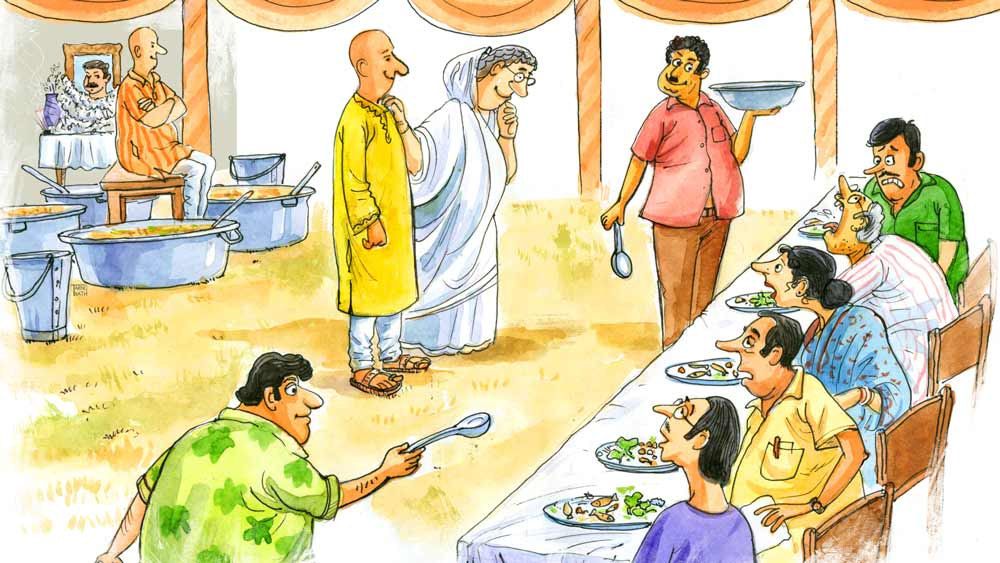

 
 <h1 align=center>বাবার পছন্দ</h1>
<h2 align=center>অঞ্জন সেনগুপ্ত</h2> আজ মৎস্যমুখী। শ্রাদ্ধের দিন শুধু জ্ঞাতি আর শ্মশানবন্ধুদের জন্য আয়োজন হয়েছিল। তেমন বিশেষ কিছু ছিল না। তবে আজকের ব্যবস্থা বেশ বড়। নিজেদের পাড়া এবং বাবার পরিচিত জনেরা সব্বাই নিমন্ত্রিত। তাও নয় নয় করেও তিনশো জন তো হবেই। কোনও কেটারার বলা হয়নি। সবটাই নিজেদের উদ্যোগে করা। আসলে যার উপলক্ষে এত বড় আয়োজন, তিনি একেবারেই আধুনিক কেটারিং পদ্ধতি পছন্দ করতেন না। বলতেন, কেটারাররা সুস্বাদু রান্না করলেও অনেক তেল-মশলা দেয়। ইদানীং দু’-চার জন ছেলে-ছোকরা ছাড়া সকলেই হালকা খাবার খেতে ভালবাসে। মানে একেবারে ঘরোয়া রান্নার মতো। তা ছাড়া কেটারাররা প্রতি প্লেটে অনেক নিয়ে নেয়। ওদের পরিবেশনও ভাল নয়। একেবারে হাত টেনে টেনে দেয়। সব খাবারই ঠোঁটে লেগে থাকে অথচ পেট ভরে না। আবার বেশি বার চাওয়াও যায় না, অনেকে হ্যাংলা ভাবতে পারে এই চিন্তায়। সবারই তো মানসম্মান আছে। তাই কেটারার শব্দটিকে একেবারেই মাথায় আসতে দেওয়া হয়নি। আর বাবার পছন্দ-অপছন্দকে মা চিরকালই ভীষণ প্রাধান্য দিয়ে এসেছেন। তাই বাবার ব্যাপারে মায়ের কথাই শেষ কথা।

আজ বাড়ির সকলেই খুব ব্যস্ত। দুই ছেলে অর্থাৎ কচু-ঘেঁচু এবং তাদের স্ত্রীদের একেবারে নিঃশ্বাস ফেলার ফুরসত নেই। ঘুম থেকে উঠে সেই ভোর থেকেই রান্নার বামুনদের পেছনে এঁটুলি পোকার মতো লেগে থাকতে হচ্ছে। তা না হলেই নিজেরা খোশগল্পে মেতে যাবে। তবে গিন্নিমা, অর্থাৎ তাদের মা হেমনলিনী, ওরফে হেমা সেই যে ভোর থেকে বারান্দায় গ্যাঁট হয়ে বসেছেন, এক বারও ওঠার নাম নেই। স্বামী চলে যাওয়ার পর আজ আর হেমা বলে ডাকার কেউ নেই। উনি যখন খুব আলতো করে হেম বা হেমা বলে ডাকতেন, তখনই বোঝা যেত উনি কী চাইছেন। ওঁর খুব প্রিয় একটি জিনিস। দু’বেলায় চারটে চাই। তবে তা বৌমাদের হাতের হলে চলবে না। হতে হবে হেমার হাতের। আসলে এই অভ্যেসটা ধরিয়েছিলেন হেমাই। বিয়ে হওয়ার পরে যখন নতুন বৌ হয়ে এ বাড়িতে এলেন, তখন এক দিন দুপুরে ভাত খাওয়ার পরে এক খিলি পান সেজে এনে বলেছিলেন, “খেয়ে দেখো তো কেমন হয়েছে।”

“আমি তো পান খাই না,” কর্তা নির্লিপ্ত ভাবে বলেছিলেন।

“সে কি আমিই খাই না কি! মা বলতেন স্বামীকে রোজ দু’বেলা দু’টো করে পান খাওয়াবি। তাতে ভালবাসা বাড়ে,” সলজ্জ ভঙ্গিতে হেমা বলেছিলেন।

“সে তুমি পান না খাওয়ালেও ভালবাসা পাবে। তবে এনেছ যখন, তখন দিয়ে যাও,” কর্তা খাওয়ার আগে এক বার নাকের কাছে এনে আবার বলেছিলেন, “বাঃ! বেশ একটা সুন্দর গন্ধ পাচ্ছি তো। এর মধ্যে চুন-সুপুরি ছাড়াও অন্য কিছু দিয়েছ বুঝি?”

নতুন বৌ, তাই বেশি কথা না বলে হেমনলিনী শুধু মাথা নেড়েছিলেন।

“কী দিয়েছ শুনি...”

“গুন্ডি।”

“সে আবার কী! আমি তো এর নাম শুনিনি।”

“এটা দোকানের নয়। আমার হাতে বাড়িতে তৈরি।”

“কবে করলে? দেখিনি তো?” কর্তা আর এক বার গন্ধ শুঁকতে শুঁকতে বললেন।

“বাপের বাড়ি থেকে এনেছি। বাবা-মায়ের জন্য তৈরি করতাম।”

“তা না হয় বুঝলাম। কিন্তু কী আছে এতে?”

“মোতিহারি তামাক পাতা, মৌরি, চুয়া। পাতা রোদে শুকিয়ে নিয়ে মৌরি চাটুতে ভেজে দুটোকে মিশিয়ে নিতে হয়। আর তার সঙ্গে মেশাতে হয় চুয়া। এমন গুন্ডি দোকানে পাওয়া যায় না।” আর সেই যে কর্তা তাম্বুলরসে মজলেন, তা আমৃত্যু ছিল। তাই আজ প্রত্যেক নিমন্ত্রিতকে খাওয়ার পরে একটি করে গুন্ডিমিশ্রিত পান হাতে ধরিয়ে দেওয়া হবে।

বারান্দায় বসেই হেমনলিনী হাঁক ছাড়লেন, “কই রে কচু ঘেঁচু, এক বার এ দিকে আয়।”

মায়ের ডাক কানে যেতেই দু’ভাই ছুটে এল বারান্দায়। মায়ের সামনে দাঁড়াতেই হেমনলিনী বললেন, “ও দিককার খবর কত দূর? সব কিছু দেখে নিচ্ছিস তো? সব কিছুই যেন যথেষ্ট থাকে। তোদের বাবা কিন্তু একেবারেই কম জিনিস পছন্দ করতেন না। আর হ্যাঁ, যখন খেতে দেওয়া হবে, তখন কিন্তু পরেরটা আগে আর আগেরটা পরে যেন না হয়। বরং আমি বলি কী, এক-দুই-তিন করে সব পাত্র পর পর সাজিয়ে রাখবি। তা হলে আর ভুল হবে না। মনে রাখিস, তোদের বাবা কিন্তু সারা জীবনে একশোর ওপর মড়া পুড়িয়েছেন। আর অজস্র অনুষ্ঠান বাড়িতে পরিবেশন করেছিলেন। কোথাও কোনও ভুলচুক হয়নি। এ সব ব্যাপারে গাফিলতি তাঁর একেবারেই পছন্দ ছিল না। যা, এ বার গিয়ে দেখ ক’ব্যাচ লোক এসেছে। তিনশো লোক তো আর চাট্টিখানি কথা নয়। শেষ হতে হতে সন্ধে না পেরিয়ে যায়। বৌমাদের এক বার পাঠিয়ে দে।”

ভিতর বাড়িতে খবর যেতেই আঁচলে হাত মুছতে মুছতে দুই বৌমা শাশুড়ির সামনে এসে দাঁড়াল। হেমনলিনী এক বার তাদের দিকে অপাঙ্গ দৃষ্টি হেনে বললেন, “তা বাছারা কী করছ শুনি? ছেলে দুটো যে খাটতে খাটতে শেষ হয়ে যাচ্ছে, সে দিকে কি তোমাদের খেয়াল আছে? ওদের না-হয় বাবার শ্রাদ্ধ। কিন্তু তিনি তো তোমাদেরও তো শ্বশুর।”

“মা, আমরা তো ছেলে-মেয়েদের খাওয়াচ্ছিলাম,” বড় বৌমা বলে।

“কিন্তু তাদের বাপেরা কি সকাল থেকে দাঁতে কিছু কেটেছে? আহা রে! ওদের মুখ দুটো তো একেবারে শুকিয়ে আমচুর হয়ে গেছে দেখলাম। ঘেঁচু তো একেবারেই খিদে সহ্য করতে পারে না। মাথা ঘুরতে শুরু করলে কিন্তু সব কাজ ভন্ডুল হয়ে যাবে। সেটা খেয়াল আছে?”

“আমি বলেছিলাম মা। তা তোমার ছেলে বলল, সে পরে চেয়ে নেবে,” ছোট বৌমা বলে।

“তোমরা জানো না যে, ওরা হয়েছে একেবারে ওদের বাপের মতো। পছন্দের জিনিসটাও কোনও দিন চাইতে পারল না। তার মধ্যে আজ ওরা ভীষণ ব্যস্ত। সঙের মতো দাঁড়িয়ে না থেকে, যা বললাম করো। আমি না দেখলে কোনও কাজই সুষ্ঠু ভাবে হওয়ার নয়,” হেমনলিনী গজগজ করেন। কারণে হোক বা অকারণে, বৌমাদের দাবিয়ে রাখা আদর্শ শাশুড়ির অবশ্যকর্তব্যের মধ্যে পড়ে— মনেপ্রাণে বিশ্বাস করেন হেমনলিনী। কর্তা উদার দরাজ স্বভাবের ছিলেন, তা বলে তিনি তো আর রাশ আলগা দিতে পারেন না।  

হঠাৎ বড় ছেলে কচু এসে খবর দিল যে, প্রায় শ’খানেক নিমন্ত্রিত চলে এসেছেন। একটা ব্যাচ তা হলে বসিয়ে দিলেই হয়। হেমনলিনী সম্মতি জানিয়ে বললেন, “ঠিক আছে দে। তবে সবাই বসে পড়লে আমাকে খবর পাঠাবি। আমি না গেলে যেন পাতে কিছু না দেওয়া হয়।”

কিছু পরে ঘেঁচু এসে বলল, “মা, সবাই বসে পড়েছেন। তুমি কি যাবে?”

হেমনলিনী ইশারায় ছেলেকে ডেকে তাকে ধরেই উঠে দাঁড়ালেন। শরীরটা দিনকে দিন বেজায় স্থূল হয়ে যাচ্ছে। অথচ খাওয়া তো সেই পাখির মতো। পাল্লা দিয়ে কোমরটাও নিত্য টাটিয়ে চলেছে। দু’পা ফেলেই একটু দাঁড়াতে হয়। ওই ভাবেই ছেলের কাঁধে ভর দিয়ে পা ঘষে ঘষে হেমনলিনী এলেন। অনেকেই ওঁকে দেখে উঠে দাঁড়িয়েছিলেন। উনি হাতের ইশারায় বসতে বললেন। প্রায় মাঝামাঝি জায়গায় দাঁড়িয়ে হেমনলিনী সবাইকে নমস্কার করে বিনীত ভাবে বললেন, “আজ আমাদের পরিবারের একটা দুঃখের দিন। জানি এমন করুণ দিন এক দিন সব পরিবারেই আসে। সব জেনেও আমরা প্রিয়জনদের হারিয়ে দুঃখ পাই। আমার স্বর্গত স্বামীকে আপনারা কেউ দাদা, কেউ জেঠু, কেউ কাকু বলে ডাকতেন। উনি সবাইকেই ভীষণ স্নেহ করতেন। নিজে যেমন সর্বভুক ছিলেন, তেমনি সবাইকে খাওয়াতেও ভালবাসতেন। তাই আজ তাঁর মৎস্যমুখীতে আমরাও ঠিক করেছি, তাঁর প্রিয় খাবার আপনাদের খাওয়াব। আশা করি আপনারা তৃপ্তি করে সব কিছু খাবেন। ওঁর আত্মা তা হলে তৃপ্ত হবে। এই কচু-ঘেঁচু এ বার তোরা পরিবেশন করার ব্যবস্থা কর...”

হেমনলিনী দেবী ঠিক যে ভাবে ছেলের কাঁধে ভর দিয়ে এসেছিলেন, ঠিক সেই ভাবেই পা ঘষে ঘষে চলে গেলেন। আর সঙ্গে সঙ্গে ছেলেদের বন্ধুরা হইহই করে পরিবেশন করা শুরু করে দিল। যেখানে সব খাবার রাখা হয়েছে, সেখানে একটা টুল নিয়ে বড় ছেলে কচু বসে পড়ল।  মায়ের নির্দেশমতো যেন পর পর সব খাবারগুলো দেওয়া হয়, সে দায়িত্বটা কচু ভাইকে ছাড়তে পারেনি। যদি কিছু বাদ পড়ে অথবা দ্বিতীয়টার জায়গায় তৃতীয়টা চলে যায়, তা হলে শুধু মা নয়, বাবাও খুব দুঃখ পাবেন। তাই বড় ছেলে হিসেবে এটা দেখা তার দায়িত্ব। আর নিমন্ত্রিতদের ব্যাপারটা সামলাবে ঘেঁচু।

প্রথমেই পাতে লেবু-নুন দেওয়া হল। তার পর এল সরু চালের গরম ভাত, সঙ্গে একটু করে থানকুনি পাতা বাটা। আজ সারা বাজার উজাড় করে আনা হয়েছে বাবার পছন্দের জিনিস। এর পর মুসুর ডাল পোড়া, সঙ্গে খাঁটি সরষের তেল-লঙ্কা। এ সব দেখে সকলেই অবাক হলেও কিছু করার নেই। কারণ প্রতি বারই ঘেঁচু মন্ত্রপাঠের মতো করে সবাইকে বলে চলেছে, “আমার স্বর্গত বাবার ভীষণ পছন্দের জিনিস ছিল এই পদটি।”

এর পরেই চলে এল মহার্ঘ পোস্তবাটা। তবে এই দুর্মূল্যের বাজারে এতে মেশানো হয়েছে ভাঙা কাজু। বোঝে কার সাধ্য।

সবাই বসে রয়েছে সুস্বাদু আমিষ পদের জন্য। মাংস না করলেও অনেক মৎস্যমুখীতে পাকা রুই, ডিমভরা পার্শে কিংবা ভাল সাইজ়ের তেল কই তো হয়েই থাকে। কিন্তু ভাঁড়ার ঘরে বোধ হয় এখনও তা সিরিয়াল নম্বরে আসেনি। তাই এ বার এল ছোলা ছড়িয়ে কচুর শাক। এটা থাকলে কর্তাবাবুর সব ভাত নিমেষেই উঠে যেত। তাই তো ভালবেসে বড় ছেলেকে ডাকতেন কচু বলে। এর পরে এল ঘেঁচুর আমিষ তরকারি। অর্থাৎ ছোট কচুর সঙ্গে চাপড়া চিংড়ির ঘ্যাঁট। খেতে মন্দ হয়নি। সকলেই ভাবলেন যে হয়তো এ বার থেকে শুরু হল আমিষ পদ।

কিন্তু এর পর দুটো ছেলের হাতে বড় বালতি করে এল পেঁয়াজ ফোড়ন দিয়ে পাতলা মুসুর ডাল আর কুমড়োফুল ভাজা। যারা চাইল তাদের আবার ঘেঁচু-চিংড়ির তরকারিটা দেওয়া হল। আর এ বার থেকেই শুরু হল আমিষ পরিবেশন।

এ বার এল তিন ধরনের মাছের চচ্চড়ি। যেমন, মৌরলা মাছের পাতুরি। তার পরে চ্যালা মাছের ঝাল এবং তার পরে ছোট পুঁটি মাছের সরষে বাটা। আর এল মেটে-আলুর চচ্চড়ি এবং চালতা-কুলের চাটনি। টক সাদা দই-বোঁদে।

হেম নলিনী আর এক বার পা ঘষে ঘষে এলেন। সকলকে হাত জোড় করে বললেন, “আজ আমাদের সঙ্গে উপর থেকে আপনাদের দাদা সব দেখেছেন। আপনাদের পরিতৃপ্তি দেখে তিনিও ভীষণ খুশি। এত ক্ষণ আমার মনে হচ্ছিল তিনিও বুঝি এখানে বসে বসে আপনাদের খাওয়া দেখছিলেন। আর নিজে ঢোঁক গিলছিলেন। এ বার মুখ ধুয়ে ওঁর প্রিয় এক খিলি পান খেয়ে আমাদের ধন্য করবেন, এটাই আমাদের কামনা।”

সকলেই মুখ ধুয়ে যাওয়ার সময় হেমনলিনী দেবীর কাছ থেকে একটি করে বাড়িতে সাজা গুন্ডি দেওয়া পান খেতে খেতে অত্যন্ত গম্ভীরমুখে বাড়ির পথে রওনা দিলেন।

হেমনলিনীর চিন্তার পরিধিতে যে কথাটা আসেনি, তা হল, নিজের বাড়িতে ঘরোয়া পরিবেশে সাদামাটা শুচিস্নিগ্ধ যে সব খাবার অনেকেই পছন্দ করেন, উপভোগ করেন এবং তৃপ্তি  পান, নেমন্তন্নবাড়িতে খেতে এসে সেগুলো তাঁরা আশাও করেন না, পছন্দও করেন না। বর্ষার দুপুরে সোনামুগ ডাল আর গোবিন্দভোগ চালের গরম খিচুড়ি পছন্দ করেন না এমন মানুষ বিরল। আজকাল অনেকেই ফেসবুকে এক থালা ভাতের সঙ্গে লঙ্কা-পেঁয়াজ-সর্ষের তেল দিয়ে মাখা মুসুর ডালসেদ্ধ, আলুভাতে, ডিমসেদ্ধের ছবি পোস্ট করে ক্যাপশন দেয়— ‘পৃথিবীর শ্রেষ্ঠ ফুড কম্বিনেশন’। কিন্তু সে জিনিস আপনি তাকে নেমন্তন্ন করে সারপ্রাইজ় মেনু হিসেবে ধরে দিন, সে মনে মনে আপনার শাপান্ত করবে। মানুষের পছন্দের খাবার কোনও দিনই নির্দিষ্ট নয়। স্থান কাল পাত্র এবং প্রত্যাশাভেদে তা বদলে যায়।  

আজ প্রায় সকলেই, বিশেষ করে যারা অনভ্যস্ত তারা মুখ বেজার করে খেয়ে উঠলেন। অনেকের কচুঘেঁচুতে গলা কুটকুট করে তো কারও চিংড়িতে অ্যালার্জি, কারও ভয়ানক কনস্টিপেশন বলে থানকুনি পাতা চলে না তো কেউ আবার কণ্টকাকীর্ণ ছোট মাছ মোটেই ভাল চোখে দেখেন না— সকলেরই নেমন্তন্ন খাওয়া মাঠে মারা গেল। তবু এত পর্যন্তও সহ্যের মধ্যে ছিল। কফিনের শেষ পেরেকটি হয়ে উঠল গুন্ডি দেওয়া পান। 

অনেকেরই সে পান সহ্য হল না।

সে দিন রাতের দিকে হেমনলিনী খবর পেলেন, গুন্ডির ধাক্কায় বেদম হেঁচকি তুলতে তুলতে বাড়ির কর্তার একান্ত পছন্দের সব খাবারগুলো মাঝপথেই উগরে দিয়ে বাড়ি ফিরেছে বহু নিমন্ত্রিত। হেমনলিনী বিমর্ষ মনে দেয়ালে টাঙানো স্বামীর হাসিমুখের ছবিটার দিকে অপলক দৃষ্টিতে তাকিয়ে থাকলেন। আর মনে মনে বিড়বিড় করে বললেন, “তুমি কিছু মনে কোরো না। নিমন্ত্রিতরা তোমার পছন্দটাকে পছন্দ করতে পারেনি। সব অর্বাচীনের দল।”

ছবির আড়ালে দীর্ঘশ্বাস ফেললেন স্বর্গত মানুষটি। এক জনের ব্যক্তিগত পছন্দের খাবার নিয়ে যে ভূতভুজ্যির ব্যবস্থা করে, স্ত্রীর হাতে সাজা স্বামীর তাম্বুল-বিলাস জনারণ্যে বিলিয়ে দেয়, তার অন্যদের অর্বাচীন বলা সাজে না।

বিমর্ষ হেমনলিনী স্বামীর মুচকি হাসির অর্থ ধরতে পারলেন না।