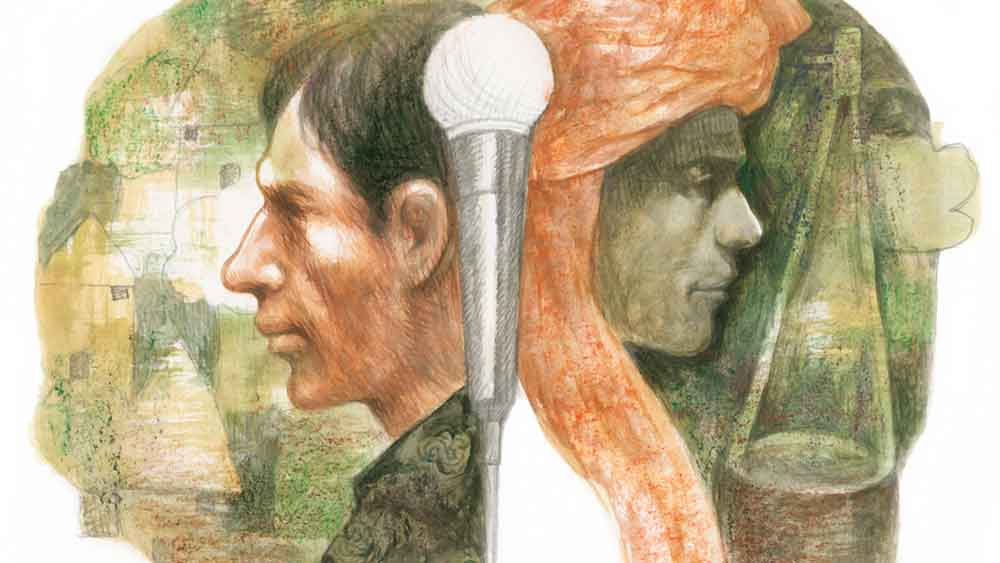

 
 <h1 align=center>বারামখানা</h1>
<h2 align=center>অধীর সিংহ</h2> লিফ্টম্যান রাজু বার্ড কেজ লিফ্ট নিয়ে, পনেরো তলায় উঠতে উঠতে গান ধরল, ‘খেজুর গাছে হাঁড়ি বাঁধো মন,/ ও গাছে জোয়ার আসিলে, গাছ কাটো কুশলে…’।

প্রোমোটার পুরনো বাড়ি ভেঙে নতুন বহুতল করলেও এই হেরিটেজ লিফ্ট কেজ আর বদলায়নি। রাজুর আগে তার বাবা এর লিফ্টম্যান ছিল।

‘খেজুর গাছে হাঁড়ি বাঁধো’ গানটি গাওয়ার জন্য বেশ কিছু দিন প্রোমোটারবাবুর কাছ থেকে অনুরোধ আসছিল। প্রোমোটারবাবুর ১৫ তলায় উঠতে প্রায় মিনিট চারেক লাগে। উঁচু তলার যাত্রীদের অনুরোধে রাজু খুশি মনেই গান গায়। ঘরে অসুস্থ বাবা, আইবুড়ো দিদি, আর নিত্য অভাব অনটনের মধ্যে গান আসে না। দুবেলা খাবারের জোগাড় তার মাইনের ওপর নির্ভর করে। সারাদিন লিফ্ট চলে। ফাঁকতালে বাবুদের ফরমায়েশি গানগুলো মোবাইলে শুনে শুনে গলায় তুলে নেয় রাজু। অনুরোধ এলে আনন্দের সঙ্গে সে গান ধরে। সে বেশ ভালই গায়। কারও কাছে না শিখলেও তার গলায় বেশ সুর, গান তুলতে সময় লাগে না। 

পনেরো তলায় আসতে লিফ্ট থেমে গেল। গানের অন্তরা রাজুর গলায়, ‘রসিক বুঝে রসের মর্ম, / অরসিক বুঝে না তার আস্বাদন…’

গেট খুলে দিতে প্রোমোটারবাবু লবি পেরিয়ে অফিসে ঢুকে গেলেন। দরজার সামনে নীচে নামার লোকের জমায়েত, ‘রাজু আমরা আর এক বার শুনব। খেজুর গাছে আর এক বার হাঁড়ি বাঁধ আর দশের বোতাম টেপ।’

রাজু হাসি মুখে গান ধরল, দরজা টেনে লিফ্ট নিয়ে নেমে গেল।

ঘরে ফিরতে রাত ন’টা বেজে যায়। কাছেই একটা ছোট মাঠ আছে ভগবতী ক্লাবের। মাচা অনুষ্ঠান লেগেই থাকে। কালেভদ্রে ফাঁক ভরানোর জন্য রাজুর ডাক পড়ে।

“রাজু আধ ঘণ্টা টানতে পারবি? শ্রীমন্তদার আসতে দেরি আছে।”

রাজু স্টেজে উঠে গান ধরে, ‘খাঁচার ভিতর আচিন পাখি…’ দর্শকদের কারও কারও পছন্দ হয় না।  দর্শকদের দাবিতে রাজু হিন্দি গান ধরে, ‘ও লেড়কি আঁখ মারে…’ কিছুটা সময় কেটে যাওয়ার পর মাঝ পথে গান থামাতে হয়।

“হয়েছে রাজু, এবার নেমে পড়। শ্রীমন্তদা এসে গেছেন।”

রাজু স্টেজ থেকে নেমে ধারে বসে থাকে। শ্রীমন্তদার গান শেষ হওয়ার পর অর্কেস্ট্রা আর নাচ। অনুষ্ঠান শেষে রাজু খাবারের প্যাকেট নিয়ে বাড়ির দিকে রওনা দেয়।

এই গতে বাঁধা জীবনে ছেদ পড়ল এক দিন। শেষ তলায় লিফ্ট পৌঁছে গেছে। গান চলছে, রাজু গেট খুলতে লিফ্টে যিনি ঢুকে এসেছেন, তিনি গান শেষ হলে বোতামের নম্বর না বলে তার নাম জিজ্ঞেস করলেন। গ্রাউন্ড ফ্লোরে নামার সময় একটা কার্ড দিয়ে বললেন, ফোন করে সেখানে যেতে।

রাজু পর দিন ফোন করল, ‘এ বাংলা’ টিভি চ্যনেলের ট্যালেন্ট ম্যানেজার পরিচয় দিয়ে এক জন ফোন ধরলেন। তাদের ডাকে প্রোমোটারের কাছ থেকে এক দিনের ছুটি নিয়ে রাজু শহরের প্রান্তে বড় বড় টিনের শেডে ভরা এক কম্পাউন্ডে হাজির হল। সেখানে অফিস ঘরে লিফ্টে পরিচয় পাওয়া সেই ভদ্রলোক ছিলেন। তাকে দেখিয়ে ট্যালেন্ট ম্যানেজারকে তিনি বললেন, “গেট হিম অন বোর্ড, টিআরপি অফ ইয়োর মিউজ়িক্যাল শো উইল হিট দ্য রুফ।”

ট্যালেন্ট ম্যানেজার তাকে অন্য ঘরে নিয়ে গেলেন, গান রেকর্ড  করলেন। তাকে বলা হল বাইরে অপেক্ষা করতে। একটু পরে ডাক পড়ল।

“তুমি গান শিখেছ কারও কাছে?”

রাজু মাথা নাড়ল।

“বুঝতে পেরেছি, শেখোনি। তুমি আমাদের এখানে এসো, কয়েক মাস থাকতে হবে। তার পর গান তোমার জীবন বদলে দেবে। তুমি আমাদের স্টার সিঙ্গার হয়ে যাবে। আমাদের চ্যানেলে টিভির পর্দায় তোমায় দেখা যাবে। সারা দেশ তোমায় দেখবে আর গান শুনবে, রাজি?”

রাজু ম্লান হেসে বলে, “স্যর, এখানে থাকলে আমার চাকরি থাকবে না। আমার মাইনেয় সংসার চলে।”

সামনে বসা ট্যালেন্ট ম্যানেজার ও অ্যাসিস্ট্যান্ট প্রীতি হেসে উঠলেন।

“যখন টিভিতে তোমাকে প্রায়ই দেখাবে, লিফ্টে বসে থাকলে হবে কি? তা ছাড়া তুমি যে টাকা লিফ্টম্যানের চাকরি করে পাও, আমরা সেটা মাসে মাসে তোমার বাড়িতে পৌঁছে দেব। এবার রাজি তো?”

রাজু নিজের কানকে বিশ্বাস করতে পারছে না। নেশাগ্রস্ত মাতালের মতো মাথা নাড়ল।

“তা হলে কাল থেকেই শুরু করে দেবে। বাড়িতে বলে, জামাকাপড় নিয়ে চলে আসবে।”

বাড়িতে বলায় বাবা-মা দু’জনেই বললেন, “কিন্তু পরে কী হবে? তোমার চাকরি নিশ্চয়ই তত দিন বসে থাকবে না!”

রাজু বলতে পারল না তার চাকরি করার আর দরকার পড়বে না। দিদি তার হয়ে বলে, “যেতে দাও মা রাজুকে। ওর স্বপ্ন পূরণ হোক, এমন সুযোগ কত জন পায়?”

অনেক টানাপোড়েন আর দ্বিধা পেরিয়ে পরদিন রাজু ‘এ বাংলা’ টিভির স্টুডিয়োতে হাজির হল। ট্যালেন্ট ম্যানেজারের অ্যাসিস্ট্যান্ট প্রীতি তাকে একটা বড় ঘরে জমায়েত কিছু ছেলেমেয়ের সঙ্গে আলাপ করিয়ে দিল নতুন গায়ক হিসাবে, নাম বলা হল ‘রাজ’। গানের তালিম বা রেওয়াজ করানোর জন্য তার দাদার বয়সি এক জন গায়ককে বলা হল। রাজু পরে জেনেছিল উনিও এক সময় অন্য চ্যানেলে প্রতিযোগী ছিলেন। উনি বাউল গানে স্পেশালিস্ট। রাজুকে বলা হল লোকগান বা বাউলগান নিয়েই তৈরি হতে।

প্রতিযোগী, মেন্টর মিলিয়ে প্রায় তিরিশ জনের থাকা, খাওয়া আর রেওয়াজের ব্যবস্থা কাছেই একটি বহুতল ভবনে। এই সুরেলা পরিবেশে রাজু কিছু দিনের মধ্যেই রাজ নামের এক বাউল গায়ক হিসেবে নিজেকে প্রতিষ্ঠিত করে ফেলল।    

‘এ বাংলা’ চ্যানেলের এই মিউজ়িক রিয়্যালিটি শো খুবই জনপ্রিয় অনুষ্ঠান। রাজুর উপস্থিতি এবং তাৎক্ষণিক জনপ্রিয়তা প্রর্দশনীকে অন্য চ্যানেলের অনেকটাই ওপরে নিয়ে গেল। রাজু প্রাণ ভরে গেয়ে চলে বাউল গান। চ্যানেল থেকে ডিজ়াইন করা, বাউলদের তালিমারা ফতুয়া তার নিত্য বেশ। দর্শকরা অচিরেই জেনে গেল রাজের লিফ্টম্যান পরিচয় এবং তারা এও জানল লিফ্টম্যানের মাসের মাইনের সমান অঙ্কের টাকা সহৃদয় টিভি চ্যানেল তার বাড়ি পৌঁছে দিচ্ছে। সমবেদনার ইথার তরঙ্গে চ্যানেলের টিআরপি বাড়ার সঙ্গে সঙ্গে বিজ্ঞাপনদাতাদের আনুকূল্যে অনুষ্ঠানের প্রযোজকের লাভের অঙ্ক প্রায় আকাশচুম্বী। দর্শকদের ধারণায় এই শো-এর চলতি সিজ়নের চ্যাম্পিয়ন রাজ। ক্রমশ রাজু নিজেও বিশ্বাস করতে শুরু করল, এই শোয়ের সমাপ্তিতে বিজয়ী হিসেবে পুরস্কারের চারচাকা চেপে সে বাড়ি ফিরবে। কিন্তু আরও কঠিন বাস্তব তার জন্য অপেক্ষা করছিল।

কয়েক সপ্তাহ পর দেখা গেল তার গাওয়া গানে বিচারকদের কাছ থেকে আগের মতো ‘অসাধারণ’, ‘দুর্দান্ত’, ‘ফাটাফাটি’ ধরনের মন্তব্য আসছে না।

অনুষ্ঠানের মধ্যমণি এখন এক প্রখ্যাত গায়কের ছাত্রী। যে সমস্ত বিশেষণের ওপর তার একচেটিয়া অধিকার ছিল, তা এখন ওই মেয়েটির উদ্দেশে বলা হচ্ছে। এক দিন গানের শেষে এক বিচারক রাজুকে বললেন, “মুখড়ায় নোট আজকাল ঠিকমতো লাগছে না। আরও দরদ ফুটিয়ে তুলতে হবে গানের ভিতর।”

আর এক জন বললেন, “আমরা তোমার কাছ থেকে আরও বেশি ভাল আশা করি।”

আর এক জন বললেন, “আরও রেওয়াজ করতে হবে। উচ্চারণ অভ্যেস করতে হবে।”

এর পর এল সেই দিন, যখন বিচারকরা গ্লিসারিন দিয়ে চোখের জল ফেলে রাজুকে প্রতিযোগিতা থেকে বাদ দিলেন। মনে করিয়ে দেওয়া হল যে, রাজু যে এত দূর এসেছে, সেটাই তার অনেক বড় অ্যাচিভমেন্ট। স্পনসরদের দেওয়া কিছু অর্থমূল্য এবং একটি সুদৃশ্য একতারা তাকে বিদায়কালীন উপহার হিসেবে দেওয়া হল।

 

বাইরের পৃথিবী সেই একই তালে চলছে। লিফ্ট তেমনই ১৫ তলায় যাচ্ছে এবং নেমে আসছে। রাজুর জায়গায় এক জন বয়স্ক বেকার লোক লিফ্টম্যানের চাকরি পেয়েছে। মেঘমল্লার বিল্ডিংয়ের বাইরে বিশেষ কেউ তাকে চিনতে পারল না।

অনেক রাতে ঘরে ফিরল রাজু। পাওয়া প্রায় সব টাকা ঘুমন্ত দিদির হাতের পাশে রেখে বেরিয়ে এল। সঙ্গে নিল একতারা। ঠান্ডা হিমেল বাতাস গায়ে বিঁধলেও রাজু চলতে থাকল। থামল, যখন দেখল সামনে বয়ে চলেছে গঙ্গা। পাড়ে বাঁধানো বটতলায় একটু বসার জায়গা পেয়ে বসল। ক্লান্ত দেহে একটু পরেই দু’চোখের পাতা বুজে এল। সকাল হয়ে এসেছে, ঘুমচোখে দেখল সামনে একটি বাস দাঁড়িয়ে হর্ন দিচ্ছে। আশপাশে শুয়ে থাকা কিছু গেরুয়াপরা লোক একতারা নিয়ে তাতে উঠছে। জিজ্ঞাসা করে জানা গেল বাস কেন্দুলির মেলায় যাচ্ছে। রাজু বাসে উঠে বসল।

দুপুরের দিকে বাস কেন্দুলি পৌঁছল। বাসের ভাড়া দিয়ে সামান্যই পয়সা বেঁচেছিল রাজুর কাছে।

অজয় নদের তীরে জনতার ঢল। কেন্দুলি মেলার প্রস্তুতি চলছে। বাউল গান, পদাবলি কীর্তন আর সুফি-ফকিরদের সান্নিধ্যে বিভিন্ন আখড়ায় গান শুনতে শুনতে, রাজু নিজেকে হারিয়ে ফেলল। কোথাও আবার কখন যে সে নিজেও তাদের গানে গলা মিলিয়েছে তা সে জানে না। শেষ রাতে কোনও আখড়ায় গামছা পেতে শোওয়া, আবার সকালে কিছু মুখে দিয়ে একতারায় সুর তোলা— এর বাইরে তার জগৎ গেল হারিয়ে। সুরের জোয়ারে ক্ষুধা তৃষ্ণা ভেসে গেছে, গলায় শুধু গান, নিত্য নতুন ভাবের গান— ‘পরের জায়গা, পরের জমিন ঘর বানাইয়া আমি রই/ আমি তো এই ঘরের মালিক নই। আমি খাজনা পাতি সবই দিলাম/ তবু আমার জমিন আমার হয় যে নিলাম,/ আমি তো এই ঘরের মালিক নই...’

এক সময় মেলা শেষ হল, কিন্তু জন্ম নিল নতুন রাজু, যার নাম এখন নবীন বাউল। সে বুঝছে গান তোলা আর গান শেখা এক কথা নয়। এই বাউল, প্রকৃতির কোলে কখনও গীতগোবিন্দ, আবার কখনও লালন ফকিরের গান গেয়ে চলে। মেলা শেষ হলেও নবীন বাউল সেখানেই থাকল এবং সাধন দাস বৈরাগীকে গুরু মেনে তার কাছে গানের চর্চা অব্যাহত রাখল। বাউল জীবন দর্শনের সঙ্গে নবীন বাউল মিলে গেল।

এহেন সুরেলা জীবনে ছন্দপতন হল যখন ‘এ বাংলা’ চ্যানেলের ট্যালেন্ট ম্যানেজার আর প্রীতি সাধন দাস বৈরাগীর আখড়ায় রাজুকে খুঁজে পেল এক বাউলানির ঘনিষ্ঠ সান্নিধ্যে।

‘আপন ঘরের খবর নে না,/ অনায়াসে দেখতে পাবি, কোনখানে সাঁইর বারামখানা...’

গান শেষ হওয়ার আগেই প্রীতি রাজুর একতারায় হাত দিল, গান থেমে গেল, “এ কী অবস্থা রাজ তোমার? একমুখ দাড়ি... গেরুয়া বেশ... তুমি সত্যিকারের বাউল হয়ে গেলে নাকি? তোমার পাশে কে ইনি? স্ত্রী?” কোনও উত্তর না পেয়ে প্রীতি রাজুর জামা টেনে বলল, “গত কয়েক মাস ধরে তোমার খোঁজ চলছে, ফিরে চলো। চাইলে স্ত্রীকেও নিতে পারো। ওয়াইল্ড কার্ড এন্ট্রি হিসেবে তুমি অনুষ্ঠানে ফেরত আসবে এবং ফাইনালে যাওয়া এবার নিশ্চিত। টিআরপি পড়ে গেছে, বিজ্ঞাপন আসছে না। দারুণ হবে তোমার এই মেকওভার-চমক।”

রাজুর মগ্নতায় চিড় ধরল না। প্রীতি তার দু’কাঁধে ঝাঁকুনি দিল।

“কী হল রাজ? আমার কথা তোমার কানে যাচ্ছে না?”

রাজুর বদলে জবাব এল পাশের বাউলানির কাছ থেকে, “দিদিভাই অস্থির হোয়ো না। জল-বাতাসা খেয়ে একটু জিরিয়ে নাও। এখন ভাব সমাধি চলছে, ভাব কেটে গেলেই নবীন কথা বলবে। তবে মাঝ পথে তাল কেটেছ, তাই দেরি হতে পারে।”

“কে তুমি? আর নবীনটা কে?”

প্রীতির প্রশ্নে বাউলানি হেসে উঠল, “হাসালে গো! তুমি যে খেপার কাঁধ ধরে ঝাঁকাচ্ছ, তার নাম জানো না? নবীন খেপা আর আমি তার খেপি-মালতী। তুমি বুঝি কলকেতা থেকে আসছ? নবীনকে নিয়ে যেতে চাও? পারবে কি! দেখো চেষ্টা করে।”

“হ্যাঁ, আমাদের হাতে বেশি সময় নেই। আমরা গাড়ি নিয়ে এসেছি। পরের সপ্তাহেই পোগ্রাম।”

“তা যাও নাকো বাপু নিয়ে-এখানে কেউ কাউকে বেঁধে রাখে না। কিন্তু যাকে নিয়ে যাবে তার সাড় আসতে দাও আগে!” 

নবীন বাউল একটু পরে চোখ খুলল। হাত জোড় করে জবাব দিল, “দিদিমণি আমায় ক্ষমা কোরো, তোমাদের অশেষ দয়া। আমি ঋণী তোমাদের কাছে, তবে ফিরতে আমি পারব না। এখানে আমার বাউল গানের চর্চা, আরাধনা, সবই ভগবানের দেওয়া জীবনের প্রতিটি অনুভূতির জন্য— কারও বিনোদনের জন্য নয়। বাউল দর্শন এই ঈশ্বর সাধনার জঠর, আর সাঁইর বারামখানা আমার সাধনার স্থল। অপার রসের পরশ পেয়ে এখান থেকে কেউ আর যেতে চায় না।”

মালতী প্রীতির দিকে হাত বাড়িয়ে দিল, হেসে বলল, “এসো গো, তুমিও এসো...”