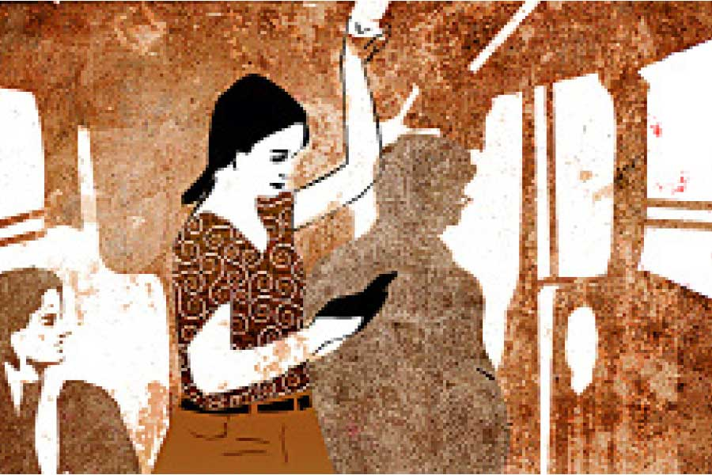

 
 <h1 align=center>বাসযাত্রা</h1>
<h2 align=center>দেবাদ্রি বসাক</h2> গাড়িটায় স্টার্ট দিতেই দু’বার হেঁচকি তুলে থেমে গেল। তার পর যত বারই স্টার্ট দেওয়ার চেষ্টা করা হল, আর সাড়াশব্দ হল না।

“ড্যাম ইট!” স্টিয়ারিংয়ে ঘুসি মেরে বলে উঠল অমিত। অনেক দিন থেকেই গাড়িটা স্টার্ট নেওয়ার সময় সমস্যা করছে, ব্যস্ততার ফাঁকে আর সারানো হয়নি। আর আজকেই বিগড়োতে হল!

অমিত ব্যানার্জি একটি বহুজাতিক সংস্থার প্রজেক্ট ম্যানেজার। অফিসে নিজের গাড়ি চালিয়েই যাতায়াত করে বরাবর। আজ কিছু গুরুত্বপূর্ণ মিটিং থাকায় অনেক রাত হয়ে গেছে। রাত দশটার সময় অমিত গাড়িতে উঠে দেখে এই বিপত্তি।

তা হলে এখন কী করা যায়? অনলাইন ক্যাব ভাড়া নিয়ে নেবে? গাড়ি থেকে বেরিয়ে গাড়িটা লক করে ফোনটা বার করে দেখে, সর্বনাশ! ফোনেও তো চার্জ নেই! কথায় বলে, বিপদ কখনও একা আসে না। এই কথাটার মানে এই ভাবে বুঝতে হবে, অমিত আগে ভাবেনি।

অফিসের মেন গেট থেকে হেঁটে বেরিয়ে এল অমিত। পাবলিক ট্রান্সপোর্ট ছাড়া আজ গতি নেই। বাস, ট্যাক্সি মোটেই পছন্দ করে না অমিত। অফিসের গেট থেকে বেরোলেই একটা বাসস্ট্যান্ড, আর সেখানে দাঁড়ানোর কয়েক মিনিটের মধ্যেই অমিত দেখল একটা বাস আসছে।

শেষ কবে বাসে চড়েছিল অমিত? ছোটবেলায় মনে হয়। তখন বাস খুব বিরক্তিকর লাগত। গাদা গাদা লোকের গা ঘেঁষাঘেঁষি! অমিত ছোট বয়সেই প্রতিজ্ঞা করেছিল, বড় হলে সে আর বাসে উঠবে না।

‘আজ প্রতিজ্ঞাভঙ্গ করতে হবে...’ নিজেকেই ফিসফিসিয়ে কথাগুলো বলে বাসে উঠে পড়ল অমিত। ট্যাক্সির জন্য অপেক্ষা করা যেত, কিন্তু আর দাঁড়াতে ইচ্ছে করল  না।

বাসে বেশি ভিড় নেই। কেউ দাঁড়িয়ে নেই, তবে একটাই সিট খালি। অমিত গিয়ে সেই সিটে এক মহিলার পাশে বসে পড়ল। মহিলা কটমট করে এক বার তাকালেন। অমিত পাত্তা দিল না। বহু মহিলা কোলিগদের সঙ্গে ওর ওঠাবসা। এখন আর মহিলাদের পাশে বসতে সঙ্কোচ হয় না।

কন্ডাক্টর টিকিট কেটে নিয়ে গেল। বসে বসে আজকের দিনটার কথা ভাবছিল ও। আজকের মিটিংয়ের মূল বিষয় ছিল নারী-ক্ষমতায়ন। কী ভাবে তাদের কোম্পানিতে মেয়েদের সংখ্যা আরও বাড়ানো যায় তাই নিয়েই আলোচনা। আসলে নারী-পুরুষ সমানাধিকার এখন খুব গুরুত্বপূর্ণ একটি বিষয়। আধুনিক এক সমীক্ষা নাকি বলছে, যে কোম্পানিতে মেয়েদের সংখ্যা যত বেশি, সেই কোম্পানি তত আধুনিক মনের। নারী-পুরুষের অনুপাত দিয়েও এখন কোম্পানির উৎকর্ষ বিচার হয়। অমিতদের কোম্পানিতে নারীর সংখ্যা কম নয়, তবু সিনিয়র লিডারশিপ টিমে যে মহিলারা আছেন, তাঁদের মনে হয়েছে মেয়েদের আরও বেশি সুযোগ পাওয়া উচিত। তাই আজ তারা সিদ্ধান্ত নিয়েছে কোম্পানিতে শুধুমাত্র মেয়েদের নেওয়ার জন্য বিশেষ হায়ারিং ইভেন্ট হবে। এমনি সাধারণ রিক্রুটমেন্টে মেয়ে ও ছেলে উভয়ই সুযোগ পাবে, কিন্তু এগুলো হবে বিশেষ ভাবে মেয়েদের জন্য। এ ছাড়াও মেয়েদের জন্য বিশেষ সুযোগ-সুবিধে এবং প্রতিটি টিমে মেয়েদের সংখ্যা বাড়ানোর ব্যবস্থাও করা হবে।

মেয়েদের জন্য আয়োজন দেখে অমিতের খুব ভাল লাগছিল। সে এত সমানাধিকার বোঝে না, যা করলে কোম্পানির রেপুটেশন ভাল হবে তাতেই তার সায়। সেই কারণেই সে বরাবর ম্যানেজমেন্টের প্রিয়পাত্র।

ইতিমধ্যে বাসটা কখন একটা স্টপেজে থেমেছে, আর বেশ কিছু লোক উঠেছে। অমিত চিন্তা করতে করতে অন্যমনস্ক হয়ে গেছিল। হঠাৎ একটা বিষাক্ত কণ্ঠে, “সিটটা ছাড়ুন!” শুনে চমকে উঠল।

তাকিয়ে দেখে স্লিভলেস টপ, ঊর্ধ্ববাহুতে ডেভিল’স ট্যাটু, চুলে হাইলাইট এক অবলা নারী তাকে উঠতে বলছে। কিন্তু কেন? মহিলা বিরক্ত কণ্ঠে আবার বললেন, “কী হল, উঠুন! দেখছেন না এটা লেডিজ় সিট!” এ বার গলার স্বর আরও তীব্র।

সত্যিই তো! উপরে লেখা আছে ‘লেডিজ় সিট’! বাসটা পুরনো ধাঁচের। না দেখে বসে পড়া উচিত হয়নি। আসলে বহু বহু বছর বাসে ওঠার অনভ্যাসও এর জন্য কিছুটা দায়ী।

অমিত একটু বিরক্ত হল। সারা দিনের কাজের পর সে যথেষ্ট ক্লান্ত। আর এই মহিলাকে তো অসুস্থ বা দুর্বল বলে মনে হচ্ছে না! তা হলে কেন উনি একটু দাঁড়িয়ে যেতে পারবেন না? তা হলে কিসের আর নারী-পুরুষ সমানাধিকার! একটা প্রতিবাদ অমিতের ভিতর গর্জে উঠল।

কিন্তু ভদ্রমহিলার কপালে ঘনায়মান ভাঁজ দেখে তার প্রতিবাদ বুকের ভিতরেই নিভে গেল। সে উঠে পড়ল, আর অন্য পাশের সিটের দিকে মুখ করে দাঁড়াল। এ দিকেও বেশির ভাগ সিটেই মেয়েরা বসে আছে। অমিত মাথার উপরের রডটা ধরে দাঁড়াল, আর ভাবল, আর কয়েকটা স্টপেজ কাটিয়ে দিতে পারলেই বাঁচি।

এর পর বাসটা আর একটা জায়গায় থামল, আর আরও কিছু লোক উঠল। এদের মধ্যে একটি মেয়ের চেহারা বেশ অন্য রকম। রিপ্ড জিন্স, ঘাড়ে ট্যাটু, ঠোঁটে বেগুনি লিপস্টিক— বাসে এ রকম কেউ উঠলে ঘাড় ঘুরিয়ে লোক দেখবেই। তাদের দোষ নেই, বাসের মরা আলো হঠাৎ একটু বেশি উজ্জ্বল হয়ে উঠলে মানুষ তাকাবে না! ছেলেরা এ রকম মেয়ে দেখে উদাস হয়ে কী ভাবে, তা শুধু তারাই জানে। আর অন্য মেয়েরা দেখে মনে মনে মুখ বেঁকায়।

মেয়েটা সে সবের দিকে বিশেষ পাত্তা না দিয়ে এক বার লেডিজ় সিটের দিকে দেখে নিল। সব ক’টাতেই মহিলারা বসে, অর্থাৎ সে দিকে বসার আশা নেই। সে অমিতের ঠিক বাঁ পাশে এসে ছেলেদের সিটের দিকে মুখ করে দাঁড়িয়ে, এক হাতে উপরের রড ধরে অন্য হাতে ফোন দেখতে লাগল। অমিত এক বার একটু ঘাড় ঘুরিয়ে দেখল, তার পর আবার অন্যমনস্ক হয়ে গেল।

সবই ঠিক যাচ্ছিল, কিন্তু ভগবান সে দিন অমিতের ভাগ্যের সঙ্গে একটু পরিহাস করতে চেয়েছিলেন। তাই কিছু ক্ষণ বাদেই বাসটার গতি বেশ বেড়ে গেল। পাশের একটা বাসের সঙ্গে রেষারেষি। এই অবস্থায় স্থির হয়ে দাঁড়িয়ে থাকা সত্যিই মুশকিল। কিন্তু একটু পরেই একটা সিগন্যালে প্রচণ্ড ব্রেক কষে বাসটা থামল, আর তখনই প্রথম কেলেঙ্কারিটা ঘটল!

ঝাঁকুনিতে টাল সামলাতে না পেরে অমিত পাশের মেয়েটার ঘাড়ে হুমড়ি খেয়ে পড়ল। খুব অস্বস্তিকর ব্যাপার! সামলে উঠে সবে ‘স্যরি’ বলার জন্য মুখটা তুলেছে, অমনি চটাস! অমিতের গালে অবলা নারীর কোমল হাতের একটি প্রকাণ্ড চড় এসে পড়ল, আর বেগুনি ঠোঁটযুগল সামান্য ফাঁক হয়ে ঘৃণাভরে উচ্চারিত হল, “পারভার্ট!”

অমিতের মাথাটা একটু গুলিয়ে গেল। বাসভর্তি অন্তত পঞ্চাশ-ষাট জন লোকের সামনে সে চড় খেল! অমিত ব্যানার্জি, যার সামনে গলা তুলে কথা বলতে ক্লায়েন্টরা পর্যন্ত ভয় পায়, তার এমন অপমান! তার অপরাধ কী? সে মেয়েটার গায়ে পড়েছে টাল সামলাতে না পেরে, তার তো কোনও বদ উদ্দেশ্য ছিল না! একটুও ভাবনাচিন্তা না করে মেয়েটা তাকে এত বড় অপমান করল?

বাসের সবার দৃষ্টি তাদের দিকে। তাদের কারও চোখে ঘৃণা, কারও চোখে কৌতুক। অমিত বুঝল তাকে মাথা ঠান্ডা রাখতে হবে, সে কোনও মতে বলল, “স্যরি ম্যাডাম! আসলে বাসটা আচমকা ব্রেক কষল, তাই…”

অমিতের বলার ধরন আর তার সুভদ্র চেহারা দেখে কেউ আর ব্যাপারটা ঘাঁটাল না। মেয়েটাও বুঝল বাড়াবাড়ি হয়ে গেছে, তাই একটা ধিক্কারপূর্ণ দৃষ্টি নিক্ষেপ করে আবার নিজের ফোনে মনোযোগ দিল।

কিন্তু অমিত নিজের মনের মধ্যে একটা জ্বলতে থাকা আগুনের উপস্থিতি টের পেল। তীব্র রাগ, ক্ষোভ, দুঃখ মিলেমিশে গলার কাছটা কী রকম ব্যথা করতে লাগল। এত বড় অপমান? এত সহজে সে মেনে নেবে?

অমিত মেয়েটাকে বলল, “আপনি প্লিজ় এ দিকে এসে দাঁড়াবেন? না হলে আবার বাস হঠাৎ থামলে সমস্যা হবে।”

মেয়েটা ফোন থেকে চোখ না তুলেই অবজ্ঞার সঙ্গে অমিতের ডান পাশে এসে দাঁড়াল। অমিত সুযোগের অপেক্ষায় রইল। ভগবান অন্তরাল থেকে মুচকি হাসলেন।

কিছু ক্ষণের মধ্যেই আগের ঘটনার পুনরাবৃত্তি ঘটল। ঠিক অমিত যে রকম চাইছিল। আবার বাস জোরে দৌড়ল, আর এ বার হঠাৎ ডান দিকে সরে ব্রেক চাপল আচমকা। তফাতটা শুধু এ বার মেয়েটা অমিতের ডান দিকে। তাই এ বার মেয়েটাই হুমড়ি খেয়ে অমিতের গায়ে এলিয়ে পড়ল। এক হাতে ফোন দেখতে দেখতে এটা না হয়ে উপায় ছিল না। অমিত তৈরি ছিল। মেয়েটা অবশ্য ‘স্যরি’ বলার প্রয়োজন বোধ করেনি। হয়তো তার মনে হয়েছে ছেলেরা ইচ্ছে করে মেয়েদের গায়ে পড়ে, কিন্তু মেয়েরা তা নয়। তাই ‘স্যরি’ বলার কোনও কারণ নেই। সে সোজা হয়ে দাঁড়িয়ে আবার ফোনে মন দিতে যাবে, এমন সময় অমিতের এত ক্ষণের প্রতিশোধস্পৃহা আগুন হয়ে ঝরে পড়ল ওর গালে। পটকা ফাটার মতো আওয়াজে চড়টা ফেরত দিয়ে অমিত দাঁতে দাঁতে চেপে বলল, “পারভার্ট!”

ভিতরটা তার এখন অনেকটা হালকা লাগছিল। কিন্তু সমস্যা হল, সারাদিন ধরে নারীর সমানাধিকার আর ক্ষমতায়ন নিয়ে লেকচারের বদহজম আর কিছু ক্ষণ আগের প্রতিশোধস্পৃহায় তার খেয়াল ছিল না যে, জীবনটা দক্ষিণ ভারতীয় সিনেমা নয়। অমিত ভুলে গিয়েছিল আধুনিক পৃথিবীতে মহিলারা যা করতে পারেন, পুরুষেরা তা পারেন না।

যে মহিলাটিকে অমিত বসার জায়গা ছেড়ে দিয়েছিল, তার কাছ থেকেই প্রথম উষ্মা ভেসে এল, “আরে! আপনি ওকে চড় মারলেন?”

অমিত একটু থতমত খেয়ে গেল। ও ব্যাপারটা বুঝিয়ে বলতে যাবে, এমন সময় চড় খাওয়া মেয়েটা বেগুনি ঠোঁট চেটে নিয়ে, শকুনের মতো নখওয়ালা হাত দিয়ে ওর কলার টেনে ধরে বলল, “হাউ ডেয়ার ইউ!”

এক ভদ্রলোক তাঁর শিভালরির চরমে পৌঁছে গলার শিরা ফুলিয়ে চেঁচিয়ে উঠলেন, “এত বড় সাহস, মেয়েছেলের গায়ে হাত তুলিস! অ্যাঁ! মেয়েছেলের গায়ে হাত!”

অমিত কিছু বলার আগেই ওর উপর কিল, চড়, ঘুসি, লাথি এসে পড়তে লাগল। কন্ডাক্টর শোরগোল দেখে ভিড়ের মধ্যে সাঁতরে এসে জানতে চাইল কী হয়েছে। এক জন সংক্ষেপে বলল, অমিত কী মারাত্মক অসভ্যতা করেছে মেয়েটার সঙ্গে।

কন্ডাক্টর অমিতের মুখের দিকে চাইল। অমিতের দৃষ্টি ফ্যালফেলে। জামার ওপরের কয়েকটা বোতাম ছিঁড়ে গেছে, ঠোঁটের কোণ কেটে গিয়ে রক্ত পড়ছে। কন্ডাক্টরের বোধ হয় একটু মায়া হল।

ওকে পুলিশের হাতে তুলে দেওয়ার কথা হলেও কন্ডাক্টর ঝামেলায় যেতে চাইল না। শুধু বলল, “এক্ষুনি বাস থেকে নেমে যান।”

অমিতকে রাস্তার ধারে প্রায় ছুড়ে ফেলে দিয়ে বাসটা চলে গেল।

ঘোর কাটতে কিছুটা সময় লাগল। অমিত কিছুতেই বুঝতে পারছিল না তার অপরাধটা কী! মেয়েটাও তো একই কারণে তাকে চড় মেরেছিল। তা হলে সে কী চাইলে তখন মেয়েটার কলার ধরে, ‘হাউ ডেয়ার ইউ!’ বলতে পারত? সেটা বোধ হয় আর কোনও দিনই জানা হবে না।

লজ্জা, রাগ, দুঃখের মিশ্র অনুভূতিটা কাটিয়ে অমিত জীবনে দ্বিতীয় বার প্রতিজ্ঞা করল যে আর কোনও দিন ও বাসে উঠবে না। কিন্তু বাড়ি ফিরবে কী করে? হঠাৎ দেখে একটা ট্যাক্সি আসছে। যাক বাঁচা গেল।

হাত দেখিয়ে দাঁড় করাতে যাবে, এমন সময় দেখে ট্যাক্সিচালক এক জন কমবয়সি মহিলা। তার দিকেই তাকিয়ে আছে।

ট্যাক্সিটা না ডেকে হাত গুটিয়ে নিল অমিত। এক দিনে এতখানি নারী ক্ষমতায়ন সে আর নিতে পারবে না, তার চেয়ে সটান বাড়ির পথে হাঁটা লাগানোই ভাল। না-হয় আর একটু রাতই হবে। 

(গল্পের সমস্ত ঘটনা সম্পূর্ণ কাল্পনিক। নিছক কৌতুক ভিন্ন কাউকে আঘাত বা অপমান করা এই গল্পের উদ্দেশ্য নয়)