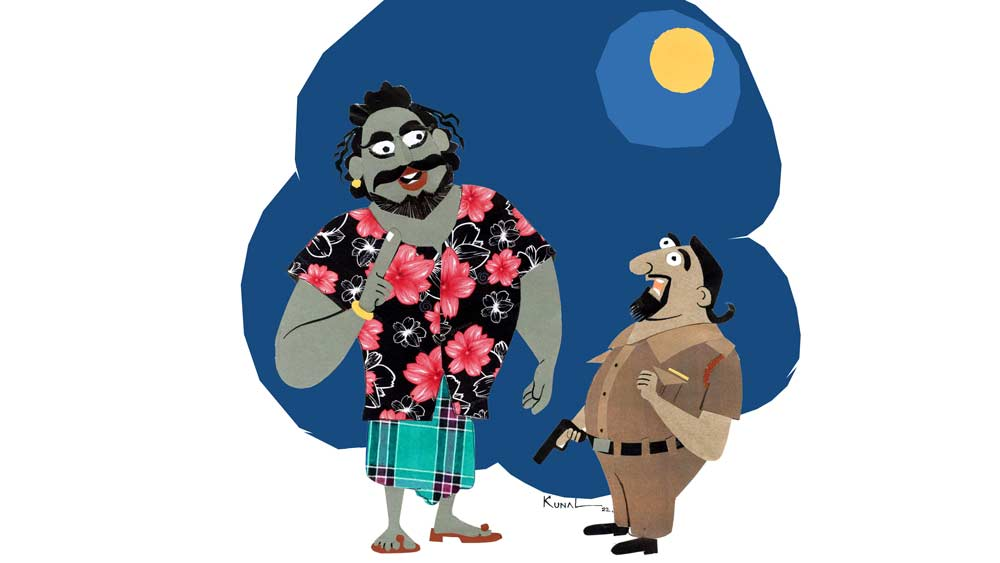

 
 <h1 align=center>বাসু কাঞ্জিলালের নতুন জীবন</h1>
<h2 align=center>জয় সেনগুপ্ত</h2> যে দিন নাইট ডিউটি থাকে, বাসু কাঞ্জিলাল থানার বাইরে বেরিয়ে সামনের প্রশস্ত জায়গাটায় কিছু ক্ষণ পায়চারি করেন। একটা সিগারেট ধরান, তার পর ধোঁয়া ছাড়তে ছাড়তে গুনগুন করে গান গাইতে শুরু করেন। এই সময় তিনি চান না যে, কেউ তাঁর পাশে থাকে। বেশ একটা হৃদয়-উৎসারিত আবেগে ভাসতে থাকেন। তবে কোনও কোনও দিন ব্যতিক্রমও ঘটে। যে দিন তাঁর বাঁ হাতের রোজগার হয় না, সে দিন মেজাজ খুব তিরিক্ষি থাকে। সহকর্মীদের উপর অকারণে চেঁচামেচি করেন। বাইরে পায়চারি করতেও বেরোন না। থানার ভিতরেই বসে থাকেন গুম খেয়ে।
বাসু কাঞ্জিলাল যে দিন থেকে কদমগাছা থানার বড়বাবু হয়ে এসেছেন, এলাকা স্বর্গরাজ্য হয়ে উঠেছে। স্বর্গরাজ্য, তবে চোর-গুন্ডা-তোলাবাজদের। তাদের সংখ্যা দিন দিন বেড়েই চলেছে। খুন-জখম বোমাবাজি, এ সব এখানে ছিল না বললেই চলে। ইদানীং বেশ ঘন ঘনই চলছে সে সব। বেপাড়া থেকেও সমাজবিরোধীদের যাতায়াত শুরু হয়েছে।

আগের বড়বাবুর আমলে এ রকম ছিল না কদমগাছা। ছিল না চুরি, ছিনতাই, তোলাবাজি। পাড়ায় মোটামুটি শান্তি বিরাজ করত। কিন্তু তিনি ট্রান্সফার হয়ে যাওয়ার পর এলেন এই বাসু কাঞ্জিলাল। দোহারা চেহারার ফরসা পঞ্চাশোর্ধ্ব ফ্রেঞ্চকাট দাড়িওয়ালা ভদ্রলোককে দেখলে মনেই হবে না ইনি কোনও থানার বড়বাবু। কিন্তু চেহারার সঙ্গে স্বভাবের যে এমন বৈপরীত্য, তা কদমগাছার কেউ তখনও বুঝতে পারেনি।

তোলাবাজ বাব্বানের তোলাবাজি একেবারে বন্ধ করে দিয়েছিলেন আগের বড়বাবু সৌমেন সেন। এলাকায় কেউ নতুন বাড়ি করতে এলে কিংবা প্রোমোটার ফ্ল্যাট তৈরি করলে বাব্বানকে মোটা নজরানা না দিয়ে উপায় ছিল না। সৌমেন সেন এক দিন তাকে স্পট থেকে তুলে নিয়ে গিয়ে বেধড়ক পিটিয়ে সাবধান করে দিয়েছিলেন। বলেছিলেন, আবার তোলাবাজি করলে একেবারে এনকাউন্টারে মেরে দেবেন। বাব্বান এর পর একেবারে ছেড়ে দিয়েছিল এ সব। একটা চা-পান-বিড়ি-সিগারেটের গুমটি দিয়েছিল। সেই বাব্বান সম্প্রতি তেলকলের মালিক মনোজ আগরওয়ালের কাছে চার লক্ষ টাকা চেয়েছে। দিতে অস্বীকার করায় রিভলভার বের করে ভয় দেখিয়েছে বাব্বান। সময় দিয়েছে সাত দিন। জানিয়ে দিয়েছে, সাত দিনের মধ্যে বাব্বানের কাছে টাকা না পৌঁছলে খুন হতে হবে আগরওয়ালকে। থানায় জানিয়ে কোনও লাভ হয়নি। বড়বাবু বাসু কাঞ্জিলাল বাব্বানের বিরুদ্ধে কোনও ব্যবস্থা তো নেনইনি, উল্টে আগরওয়ালকে বলেছেন, টাকা দিয়ে ব্যাপারটা মিটমাট করে নিতে।

আগের বড়বাবুর আমলে ছিনতাইবাজ ভোলা শুধরে গিয়েছিল। থানার লকআপে ঢুকিয়ে লাঠ্যৌষধি দিয়ে পথে এনেছিলেন। ভয়ে আর ও রাস্তা মাড়ায়নি সে। রাজমিস্ত্রির জোগাড়ের কাজ ধরেছিল। সেই ভোলাও আবার নবোদ্যমে ছিনতাই রাহাজানি শুরু করেছে।

আরও আছে। আগে এখানে দুটো দল ছিল। রাজনৈতিক দল নয়। গুন্ডার দল। একটা নব মাইতির। আর একটার লিডার ছিল ল্যাংড়া পানু। তারা নিজেদের মধ্যে প্রায়ই মারামারি লাগাত। দুমদাম পেটো পড়ত। গুলি চলত। লোকজন তটস্থ হয়ে থাকত, এদের মারপিটে। দুটো দলকেই ঠান্ডা করে দিয়েছিলেন আগের বড়বাবু সৌমেন সেন। তাদেরও আবার পৌষমাস শুরু হয়েছে।

সবাই জেনে গিয়েছিল বাসু কাঞ্জিলাল এদের সবার কাছ থেকে টাকা নেন। রীতিমতো মাসোহারা দেয় এই সব সমাজবিরোধী। সাধারণ মানুষ আর কী করবে! মুখ বুজে সহ্য করা ছাড়া উপায় কী!

এমন ঘুষখোর বা দুর্নীতিপরায়ণ হলে কী হবে, কাঞ্জিলাল খুব ঈশ্বরভক্ত। প্রতি দিন নিয়ম করে বুড়োশিবতলার পাশের কালীমন্দিরে গিয়ে পুজো দেন। অনেক ক্ষণ চোখ বুজে মা কালীকে ডাকেন। দু’কানে হাত দিয়ে সব অন্যায় স্বীকার করেন। তার পর পুরোহিতের হাতে মোটা অঙ্কের প্রণামী গুঁজে দিয়ে ফিরে আসেন। মনে মনে বলেন, ‘মা গো, তোমাকে মূল্য ধরে দিলাম মা, এর বেশি খেসারত ধার্য কোরো না মা...’

এটা বছরের তিনশো পঁয়ষট্টি দিনই হয়ে থাকে। তাঁর মৃত্যুভয় খুব। সব সময় কোমরে রিভলভার গোঁজা। ইউনিফর্ম পরে না থাকলেও। মা কালীকে ডাকলেও, প্রিকশনারি মেজার হিসেবে বিপদ-আপদ কাটানোর জন্য দু’হাতের আঙুলে তিনটে-তিনটে ছ’টা আংটি। পাথরগুলো দিয়েছেন বিখ্যাত জ্যোতিষী পরশুরাম শাস্ত্রী। তাঁর দাপটে নাকি শত্রুগ্রহ মিত্রগ্রহ সব এক সঙ্গে সুফল দেয়। তবু বাসুর কেমন যেন একটা ভয়-ভয় করে মাঝে মাঝে। 

এই ভাবেই চলছিল।

সে দিন বেশ মোটা টাকা কামাই হয়েছিল বাসু কাঞ্জিলালের। মনটা খুব ফুরফুরে ছিল তাঁর। থানায় বসে তিন প্লেট মাটন কষা দিয়ে গোটা দশেক পরোটা উড়িয়ে বাইরে বেরিয়ে পায়চারি করছিলেন। জ্যোৎস্না রাত। চাঁদের আলোয় গাছের ছায়ায় আলপনা আঁকা পথে হাঁটতে হাঁটতে থানার চত্বরের প্রায় শেষ সীমায় চলে এসেছিলেন। সেখানে বটগাছের নীচে চওড়া বাঁধানো জায়গাটায় এক জনকে বসে থাকতে দেখলেন তিনি। বেশ হৃষ্টপুষ্ট লোক একটা। মোটা গোঁফ। পরনে লুঙ্গি আর ফতুয়া। চাঁদের আলোয় লোকটার গায়ের রং খুব কালো বলে মনে হল। সঙ্গে সঙ্গে কাঞ্জিলালের হাত চলে গেল কোমরের রিভলভারে। এই সময়ে এখানে কারও বসে থাকার কথা নয়। পুরনো কোনও ক্রিমিনাল? 

লোকটা তার দিকে তাকিয়ে হেসে বলল, “আহা-হা বাসু, বন্দুক বের কোরো না। ও সবে কাজ হবে না, দরকারও হবে না।”

আরে, নাম ধরে ডাকছে! কে লোকটা! বাসু কাঞ্জিলাল তাও রিভলভার থেকে হাত সরালেন না।

বাসুর ভুরু কুঁচকোয়। এত রাতে লোকটা কী করছে এখানে! তাঁর চেনা কেউ! তাঁকে তুমি তুমি করছে! পাগল টাগল, না কি মাতাল!

“আমি পাগল নই, মাতালও নই গো বাসু। ক্রিমিনালও নই। আমার চেয়ে বয়সে অনেক ছোট তুমি, তাই ‘তুমি’ বলছি তোমাকে। বোসো এখানে,” পাশের ফাঁকা জায়গাটায় হাত দিয়ে দেখিয়ে বলল লোকটা।

ওরে বাবা, এ তো তাঁর মনের কথা বুঝে ফেলেছে! যা ভাবছিলেন ঠিক ঠিক সব বলে দিল। কাঞ্জিলাল লোকটার আরও কাছে এগিয়ে গিয়ে ভাল করে জরিপ করতে লাগলেন লোকটাকে। বেশ বড় বড় ঠান্ডা চোখে তাকে দেখছে লোকটা।

“তুমি, মানে আপনি কে বলুন তো? এত রাতে এখানে বসে করছেনটা কী?” লোকটাকে প্রশ্ন করলেন বাসু কাঞ্জিলাল।

“আমি? আমি হলাম দূত। মিষ্টি মিষ্টি কথা বলি। পুলিশের মতো নয়,” ঝকঝকে সাদা দাঁত বার করে হাসল লোকটা, “তুমি রাতে পায়চারি করো, ভাবলাম কথাটা তোমাকে বলেই যাই। বোসো এখানে।”

লোকটার কথায় কী রকম যেন সম্মোহিত হয়ে গেলেন ঝানু পুলিশ অফিসার বাসু কাঞ্জিলাল। কোমরের রিভলভার থেকে হাত সরিয়ে চুপচাপ দাঁড়িয়ে রইলেন লোকটার পাশে।

“বসতে ভয় লাগছে, বুঝতে পারছি। ঠিক আছে, দাঁড়িয়েই শোনো। আমি এসেছি মৃত্যুপুরী থেকে। যাকে তোমরা যমপুরী বলো। যমরাজেরই দূত আমি। প্রতিটি মানুষ মারা যাওয়ার আগে আমি সঙ্কেত দিই তাদের, নানা ভাবে, নানা পদ্ধতিতে। কেউ কেউ বুঝতে পারে। তবে বেশির ভাগই বোঝে না। তোমাকেও দিয়েছি, তুমি বোঝোনি। তাই ভাবলাম সময় তো আর বেশি নেই, সামনাসামনিই বলে যাই। তোমার আয়ু ছিল অনেক বছর। তোমার বয়স এখন একান্ন, পঁচাত্তর বছর বয়সে তোমার মারা যাওয়ার কথা। কিন্তু নানা পাপের কারণে তা ভয়ানক কমে এসেছে। আর মাত্র দু’মাস আয়ু তোমার। আজ থেকে ঠিক দু’মাস পরে সূক্ষ্মদেহে এসে তোমার আত্মাকে নিয়ে যাব আমি।”

বাসু দারোগা কাঁপতে কাঁপতে বসে পড়লেন লোকটার পাশে। ঘামতে ঘামতে, তুতলে বললেন, “দু’মাস পরে মরে যাব?”

“তোমার পাপের ঘড়া পূর্ণ হয়ে গেছে বাসু! সারা চাকরি-জীবন জুড়ে শুধু অন্যায় করে গেছ। তোমাকে তো মরতেই হবে। বিষয়টা তোমাকে বুঝিয়ে বলি, শোনো। মানুষ জন্মানোর সময়েই ঠিক করে দেওয়া হয় সে জীবনে কত বার নিঃশ্বাস নেবে। যেমন ধরো মিনিটে মোটামুটি ১৮ বার, তার মানে ঘণ্টায় ১ হাজার ৮০ বার এবং দিনে ২৫ হাজার ৯২০ বার এক জন মানুষ শ্বাস নেয়। তার মানে মোটামুটি প্রায় ২৬ হাজার বার। তা হলে বছরে অর্থাৎ তিনশো পঁয়ষট্টি দিনে ৯৪,৯০,০০০ বার। এই হিসেবে যে কুড়ি বছর বাঁচবে তার এক রকম, যে পঞ্চাশ বছর বাঁচবে তার এক রকম, আবার যে আশি বছর বাঁচবে তার এক রকম নিঃশ্বাস নেওয়ার হিসেব থাকে। এগুলো সবই পূর্বনির্ধারিত। ওই যেমন কেউ মারা গেলে বলে না, শেষ নিঃশ্বাস ত্যাগ করেছে! একেবারে অঙ্কের হিসেব। কিন্তু মানুষের প্রতিটি পাপকাজের সঙ্গে সঙ্গে এই হিসেবটা পাল্টে যায়। যেই এক জন মানুষ অন্যায় করে, অপরাধ করে, দুর্নীতি করে, তার সারা জীবনের নিঃশ্বাস নেওয়ার সংখ্যা কমতে থাকে, আবার ভাল কাজ করলে বাড়ে, একেবারে চক্রবৃদ্ধি হারে সুদের মতো। এর এতটুকু এ দিক-ও দিক হওয়ার উপায় নেই। সেই হিসেবে তোমার শেষ নিঃশ্বাস পড়ত পঁচাত্তর বছর বয়সে। কিন্তু তুমি এত অন্যায় করেছ যে, তোমার মোট নিঃশ্বাস নেওয়ার সংখ্যা কমতে কমতে এসে যা দাঁড়িয়েছে, তাতে তোমার আয়ু আর মাত্র দু’মাস।”

থরথর করে কাঁপতে কাঁপতে ছলছল চোখে বাসু কাঞ্জিলাল বললেন, “আমার মোট নিঃশ্বাস নেওয়ার সংখ্যাটা বাড়ানো যায় না? অন্তত রিটায়ারমেন্ট মানে ষাট বছর বয়স পর্যন্ত... আমার পরিবার আছে... দুই মেয়ে, স্ত্রী... মেয়েদের বিয়ে দিতে হবে... সংসারটা একেবারে ভেসে যাবে... তার জন্য আপনি যা বলবেন আমি করব।”

“হ্যাঁ, সে রাস্তাও আছে,” শান্ত গলায় বলল লোকটা, “যদি তুমি এখন থেকে ভাল কাজ করতে শুরু করো, তা হলে নিঃশ্বাস নেওয়ার সংখ্যাটা বাড়তে থাকবে। মাস দেড়েকের মধ্যে যদি প্রচুর ভাল কাজ করে ফেলো, তা হলে তোমার শেষ নিঃশ্বাস পড়তে পড়তে ষাট বছর লেগে যেতে পারে। এমনকি, পঁয়ষট্টিও হয়ে যেতে পারে। যত সময় পাবে তত নিঃশ্বাস বাড়িয়ে নেওয়ার সুযোগ পাবে। এটা হল রিভার্স মেথড আর কী!”

বাসু কাঞ্জিলাল দু’হাত দিয়ে নিজের মাথা ধরে বুকের কাছে ঠেকিয়ে হু হু করে কাঁদতে লাগলেন।

কয়েক সেকেন্ড পরে যখন মাথা তুললেন, দেখলেন তাঁর পাশে কেউ নেই। ফাঁকা চার পাশ। শুধু একটা হিমেল হাওয়া তাঁকে ছুঁয়ে গেল। জ্যোৎস্নার আলো পাতার ফাঁক দিয়ে তাঁর গায়ে এসে পড়েছে।

*****

পরদিন কদমগাছায় একেবারে হইহই পড়ে গেল। ভর অফিস টাইমে সকলের সামনে দিয়ে মস্তান বাব্বানকে দড়ি বেঁধে টানতে টানতে নিয়ে যাচ্ছে কদমগাছা থানার পুলিশ। পরে জানা গেল, লকআপে ঢুকিয়ে বেদম পিটিয়ে চার্জশিট তৈরি করছেন বড়বাবু বাসু কাঞ্জিলাল।

তার পর দিন ধরা পড়ল নব মাইতি আর ল্যাংড়া পানু। এক সঙ্গে। বড়বাবু নিজে এই অপারেশনটায় ছিলেন। রাস্তা দিয়ে মারতে মারতে দু’জনকে নিয়ে গিয়ে লকআপে ঢুকিয়ে দিলেন।

এর ঠিক এক দিন পর ধরা পড়ল ছিনতাইবাজ ভোলা। থানায় নিয়ে গিয়ে উল্টো করে ঝুলিয়ে দোষ কবুল করালেন কাঞ্জিলাল। ক’দিন আগে ছিনতাই করা দুটো সোনার হার, আর পঞ্চাশ হাজার টাকার হদিস পাওয়া গেল তার কাছ থেকে। বাড়িতেই রাখা ছিল ওগুলো। পুলিশ গিয়ে ভোলার বাড়ি সার্চ করে সেগুলো এনে যাদের জিনিস, ফিরিয়ে দিল তাদের।

বাব্বানকে ছাড়িয়ে নিয়ে যাওয়ার জন্য কাঞ্জিলালের কাছে এসেছিল শাসক দলের কাউন্সিলর তপন তলাপাত্র। তাকে বাসু কাঞ্জিলাল খুব ঠান্ডা গলায় বলেছেন, “আপনি এখন যাকে খুশি ফোন করুন, যেখানে ইচ্ছে যান। বাব্বানকে এ বার টাইট দিয়েই ছাড়ব। জামিন অযোগ্য ধারা লাগাচ্ছি ওর বিরুদ্ধে। কদমগাছাতে কোনও রকম অপরাধ আর হতে দেব না আমি। আর আপনার হিস্ট্রিও আমার হাতের তেলোর মতো মুখস্থ। বাব্বানের উপর যদি আপনার দরদ উথলে ওঠে, তা হলে ওর পাশের সেলটা দেখে  রাখুন। ফাঁকা আছে। সেলটা ফাঁকা থাকবে, না কি এক জন কাউন্সিলরকে পেয়ে ধন্য হবে, সেটা আপনার দরদের উপরেই নির্ভর করছে।”

তপন তলাপাত্র সুড়সুড়িয়ে কেটে পড়লেন। কদমগাছির মানুষজন স্তম্ভিত হয়ে গেল। এ কোন বাসু কাঞ্জিলালকে দেখছে তারা! এ তো সাক্ষাৎ ভগবান!

কিছু দিন পর গ্রেফতার হল পার্টির নেতাদের স্নেহধন্য প্রভাবশালী প্রোমোটার কেষ্টচরণ মাইতি। তার নামে বহু অভিযোগ। বেআইনি বহুতল নির্মাণ, অত্যন্ত নিম্নমানের মালমশলা ব্যবহার করার জন্য বিল্ডিং ভেঙে পড়া, ভয় দেখিয়ে বাড়ির লোকেদের বাড়ি ছাড়া করে সেখানে ফ্ল্যাট তৈরি, উঠতি প্রোমোটার বিকাশ কুণ্ডুকে গুলি করা— অপরাধের বিরাট বড় লিস্ট কেষ্টর।

কেষ্টকে ছাড়িয়ে নিয়ে যাওয়ার লোকের অভাব ছিল না। এমএলএ, এমপি, এমনকি মন্ত্রীর ফোনেও কোনও কাজ হয়নি। মোটা অঙ্কের অফার এসেছে। প্রাণের ভয় দেখানো হয়েছে। কিন্তু কোনও কিছুতেই টলানো যায়নি কাঞ্জিলালকে। মাঝখান থেকে পুলিশ কাস্টডিতে কেষ্টর উপর থার্ড ডিগ্রির পরিমাণ আরও বাড়িয়ে দিয়েছেন তিনি।

কদমগাছার সকলের মুখে মুখে ঘুরতে লাগল বাসু কাঞ্জিলালের নাম। এক জন দুর্নীতিপরায়ণ চূড়ান্ত অসৎ পুলিশ অফিসার থেকে রাতারাতি এ রকম উত্তরণ কোন জাদুকাঠির ছোঁয়ায় পরিণতি পেল!

সোজা আঙুলে ঘি না উঠলে যা হয়, মাসখানেকের মধ্যেই চাকরিতে বদলির অর্ডার এসে গেল বাসু কাঞ্জিলালের। সেও কোনও এক প্রত্যন্ত অঞ্চলে। তিনি জানতেন, এটা হবেই। সবাই বলাবলি করল, সৎ মানুষের আর জায়গা নেই রে ভাই এ দুনিয়ায়।

পরবর্তী কালে শোনা গিয়েছিল, নতুন জায়গায় গিয়ে থানার দায়িত্ব নিয়ে সেখানেও একা হাতে দাপটের সঙ্গে অপরাধীদের শায়েস্তা করেছেন তিনি। কোনও রকম আপসের রাস্তায় হাঁটেননি। এবং সেখান থেকেও তাঁকে দ্রুত ট্রান্সফার করে দেওয়া হয়েছে অন্য জায়গায়।

বাসু কাঞ্জিলাল যেখানেই যান, নতুন এলাকার লোকজন দেখে, বড়বাবু কেমন যেন অস্থির স্বভাবের। তিনি মাঝে মাঝেই জোরে জোরে নিঃশ্বাস নেন, তার পর নিজেই আনমনে চমকে উঠে কাকে যেন খোঁজেন এ দিক-ও দিক। আনমনে কী যেন বিড়বিড় করেন।

কেউ জানে না, বাসু খোঁজেন সেই রাতের লোকটিকে, থুড়ি দূতটিকে। মেয়াদ কতটা বাড়ল, সেই শ্বাস-প্রশ্বাসের হিসেবের আপডেটটা এক বার জেনে নিতে পারলে ভাল হত। কিন্তু দুঃখের কথা, তাকে আর খুঁজে পান না বাসু।

সেই দু’মাস পেরিয়ে আরও দু’বছর কেটে গিয়েছে। সামনের জ্যৈষ্ঠে বাসু চুয়ান্নয় পড়বেন।