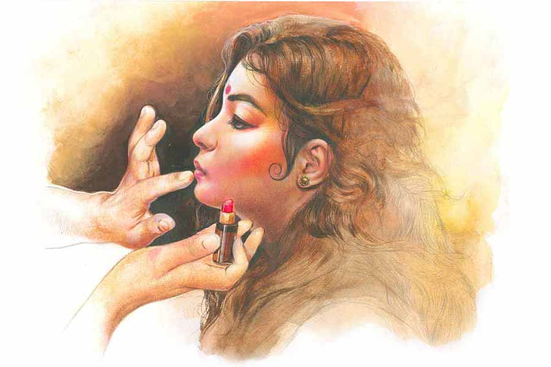

 
 <h1 align=center>বাস্তুসাপ</h1>
<h2 align=center>অন্বেষা রায়</h2> 

পারুল বলেছিল, “চিন্তা কোরো না সুভাষদা, আমি জেঠিমাকে দেখব। তুমি নাটক করাও।”

পাড়ার ক্লাবে সুভাষদার নাটকের আখড়া। পয়লা বৈশাখ, বিজয়া দশমী উপলক্ষে বছরে দু’বার নাটক নামাত সুভাষদা। নারীচরিত্র-বিবর্জিত সেই সব উদ্যমে স্টেজ বাঁধা, আলোকসজ্জা সামাল দিতাম আমরা। জেঠিমার সেরিব্রাল অ্যাটাকটা ছিল বড় চ্যালেঞ্জ। বেসরকারি চাকরি, মায়ের সেবা সামলে নাটক করানো প্রায় অসম্ভব ছিল সুভাষদার পক্ষে। টানা ছ’মাস সুভাষদার এলোমেলো ঘর-সংসার যত্নে রেখেছিল পারুল।

তৃতীয়ার চাঁদের দিকে এক মুখ ধোঁয়া ছেড়ে সুভাষদা বলেছিল, “মায়ের সেবার বদলে যে লিড রোল চেয়ে বসবে, ভাবতেও পারিনি। বাচ্চা মেয়ে, সহানুভূতির সুযোগ নিয়ে পাড়ার নাটকেও পলিটিক্স করল! পারুলকে একটু প্রেজ়েন্টেবল করে দিতে পারবি রাজা?”

মেকআপ আর্টিস্ট হওয়ার সাধ বুকে অঙ্কুরোদ্গম ঘটিয়েছিল কয়েক বছর যাবৎ। সুভাষদার কথায় ক্ষয়িষ্ণু চাঁদের অদৃশ্য অংশে পারুলের গোল মুখ বসিয়ে নিয়েছিলাম। অমাবস্যায় ভেজানো ত্বক। জোড়া ভুরু। পাতলা দুটো ঠোঁট যেন মাধবীলতার পুষ্পবৃন্ত। চওড়া নাক। শরীরের গড়ন এতটাই ছোটখাটো যে, ভিড়ের মধ্যে ওর উপস্থিতি ধরা পড়ত না। ভরসা দিয়ে বলেছিলাম, “চিন্তা কোরো না।”

চিন্তা ছাড়তে পারেনি সুভাষদা। নাটকের দিন উৎকণ্ঠিত গলায় বলেছে, “চেহারাটা ঠিকঠাক করে দিস রাজা। এই প্রথম নাটকে নায়িকা নামাচ্ছি। লোকে তো ওকেই দেখবে।”

জবাব দিইনি। বলিনি, ‘সুভাষদা, এমন কাদামাটির মতো আনকোরা মুখ যত্ন নিয়ে সাজাতে হয়। একটা অসহায় মেয়ে কী ভাবে দুর্বলতার সীমা ছুঁয়ে ঘুরে দাঁড়াচ্ছে তা যখন ও দর্শককে দেখাবে, তখন যেন আমার শিল্প সামান্য হলেও এগিয়ে দিতে পারে ওকে।’

কিছুতেই মনের মতো হচ্ছিল না সাজ। বার বার সাজাচ্ছিলাম আর মুছে দিচ্ছিলাম। পারুলও আয়নায় চোখ রেখে তীক্ষ্ণ দৃষ্টিতে পরখ করছিল সব কিছু।

প্রবল হাততালিতে ভেসে গিয়েছিল বিজয়া সম্মিলনী। উচ্ছ্বাসের কোলাহলে গলা তুলে সুভাষদা বলেছিল, “মেয়েটা লম্বা রেসের ঘোড়া। সাদামাটা সাজেও কেমন দর্শকদের মাতিয়ে দিল, দেখলি?”

দপ করে আলো নিবে গিয়েছিল বুকের ভিতর। বলিনি, ‘সুভাষদা, পরিচালক হয়েও ওই সাধারণ সাজের পরিশ্রমটুকু দেখতে পেলে না? ওই ফ্যাকাসে গাল কী ভাবে কেউটের ত্বকের মতো উজ্জ্বল হল, কী ভাবে স্পষ্ট হয়ে উঠল নাকের আকার? কেমন করে জোড়া ভুরু দুটো নিজেদের সমস্ত অস্বস্তি ঝেড়ে এমন সপ্রতিভ হয়ে উঠল মঞ্চের আলোয়, জানতে চাইলে না তো?’

সুভাষদা কেন, পারুলও জানতে চায়নি। পুরো কৃতিত্ব নিজেই নিয়েছে নিঃশব্দে। উজ্জ্বল মুখে দাঁড়িয়ে ফোটো তুলিয়েছে। আমাকে সম্পূর্ণ উপেক্ষা করে। ছবিটার দিকে তাকালে আজও মায়া হয় নিজের জন্য। সেটা দু’হাজার সাল। পৃথিবী এবং আমি দু’জনেই অনেকটা ভিন্ন তখন।

পরের বারও কেন্দ্রীয় চরিত্রে পারুল। অনুষ্ঠানের দিন সাজাতে গিয়ে দেখি, বৃত্তাকার শ্যামল মুখে জোড়া ভুরুর বদলে ক্ষীণ দুটো রেখা। নাকের পাশে পাউডারের বেমানান ছোপ। মাধবীলতার পুষ্পবৃন্তে চটুল রক্তাভা। একটা লকেট মুঠোয় চেপে ডায়লগ আউড়ে যাচ্ছে। বিরক্ত হয়ে বলেছিলাম, “মুখ ধুয়ে এসো।”

শোনেনি। জেদি ঘোড়ার মতো গোঁজ হয়ে বসেছিল। মেজাজ ঠিক রাখতে পারিনি। ভিজে তোয়ালে দিয়ে ঘষে ঘষে মুছিয়ে দিয়েছিলাম মুখটা। বলেছিলাম, “এত অল্পে ডানা গজালে ওই লকেটের ঠাকুরও তোমাকে বাঁচাতে পারবে না।”

ও জবাব দেয়নি। হাতের মুঠিও আলগা করেনি।

*****

মেকআপের ডিপ্লোমা কোর্স শেষ হওয়ার আগেই ইন্দ্রদার দলে কাজ পেয়েছিলাম। ইন্দ্রদা দিলখোলা মানুষ। টাকার হিসাব না বুঝলেও নাটক বুঝত হৃদয় দিয়ে। প্রচুর পড়াশোনা করত। পিঠ চাপড়ে বলত, “রাজা, তুই ম্যাজিক জানিস। কেউ স্বীকার করুক না করুক, তোর মেকআপ ওদের অভিনয়কে অনেকখানি এনহ্যান্স করে দেয়।”

রিহার্সালে এসে চরিত্রগুলোকে বোঝার চেষ্টা করতাম। কুশীলবদের চোখমুখের গঠন খেয়াল করতাম মন দিয়ে। ইন্দ্রদার বাড়ি থেকে মেসে ফেরার দীর্ঘ বাসরাস্তা যেন এক সাধনমার্গ। মনে মনে এক-একটা মুখ নিয়ে গড়ে তুলতাম বিভিন্ন চরিত্র। মনের আয়নায় খেয়ালের বশে তুলে নিতাম আমার প্রথম মডেলকেও। যার প্রতিটি পেশি, প্রতিটি ভাঁজ মুখস্থ হয়ে গেছে তত দিনে। বলিউডে কাজ করার স্বপ্ন পোষা কাকাতুয়ার মতো কাঁধে বসে থাকত চব্বিশ ঘণ্টা।

এক দিন ইন্দ্রদাই আলাপ করাল, “রাজা, এ হল পারুল। কলেজে ভর্তি হতে না হতেই অভিনয়ের ভূত তাড়িয়ে এনে ফেলেছে আমার গোয়ালে। বলে ওর দাদা নেই, আমাকেই ভাইফোঁটা দেবে।”

ইন্দ্রদার উচ্ছ্বসিত হাসির মধ্যেই কপালে ভাঁজ পড়েছে আমার। পাড়ার নাটকের জন্য সুভাষদার মায়ের সেবা! গ্রুপ থিয়েটারের জন্য ইন্দ্রদার বোন সাজা! আবেগ ব্যবহার করে লক্ষ্যভেদ করার সস্তা পথ। তাকিয়েই মুখ ফিরিয়ে নিয়েছিলাম। অমাবস্যায় ভিজে ত্বকে বেমানান ফাউন্ডেশনের স্তর। মাধবীলতার পুষ্পবৃন্তে দৃষ্টিকটু উজ্জ্বল লিপস্টিক।

ইন্দ্রদাকে বলেছিলাম, “এ যে মেকআপের দোকান দেখছি।”

ইন্দ্রদা পাত্তা না দিয়ে বলেছিল, “মুসকানের রোলে নিচ্ছি। দেখে নে, কী ভাবে সাজাবি।”

বিজয়া সম্মিলনীর সেই হাততালি-মুখর সন্ধের প্রতিবিম্ব আমি দেখেছিলাম হলের স্তব্ধতায়। সুশিক্ষিত, নাট্যসচেতন দর্শকবৃন্দকে মন্ত্রমুগ্ধ করে দিয়েছিল পারুল। ইন্দ্রদা ভাসা ভাসা গলায় বলেছিল, “এই মেয়েকে আলো, মঞ্চ, মেকআপ ছাড়া দাঁড় করিয়ে দিলেও দর্শককে টেনে রাখবে। শি ইজ় আ বর্ন স্টার।”

আমি ব্যথিত নৈঃশব্দ্যে প্রতিবাদ করে বলেছিলাম, ‘তুমিও চিনলে না ইন্দ্রদা? ওই দার্ঢ্যময় চোখ কী ভাবে শেষ পঙ্‌ক্তির দর্শকরাও নজর করলেন? কী করে কম আলোতেও ওর চোয়ালের আকার অত স্পষ্ট হয়ে উঠল? কী ভাবে স্ফুরিত নাক অভিমান জাগিয়ে তুলল সকলের বুকে? দেখলে না? একটা অল্পবয়সি মেয়ের লোক-দেখানো আবেগের এত ক্ষমতা?’

*****

শিল্পকলা এক আত্মমগ্ন, প্রত্যাশাহীন চর্চা। তবু প্রয়োজন বড় বালাই। রুচিবোধ বড় নাছোড় শেকল। পারুলের মতো, মানুষকে ব্যবহার করতে পারিনি কোনও দিন। খেসারত হিসেবে, চাকরি নিতে হয়েছে। সঙ্গে মেকআপের পার্ট-টাইম কাজ। বলিউডে কাজ করার স্বপ্ন তখনও কাঁধে বসে। নির্জীব হলেও মৃত নয়।

পারুল তত দিনে খবরের কাগজে নাম তুলে ফেলেছে। নাট্য-সমালোচকদের কলমে ওর কাজের প্রশংসা চোখে পড়ত। মুখোমুখি হলে বুকের গভীরতম ক্ষতে নুন ছড়িয়ে দিত কেউ। আমি না থাকলে দর্শকের এত কাছে কোনও দিন পৌঁছতে পারত ও? আমার মেকআপ ছাড়া এক পা-ও এগোতে পারত? সুভাষদাকে, ইন্দ্রদাকে ফোন করতাম। বলতাম, “কেমন আছ সেলেব্রিটির মেন্টর?”

ওরা হেসে উড়িয়ে দিত। কখনও বলত, “তুইও তো সেলেব্রিটির মেকআপ আর্টিস্ট!”

খচ করে কাকাতুয়ার বুকে ছোরা বসিয়ে দিত কথাটা। ভয় করত। এমন কাউকে ধরতে হবে যে সিনেমায় কাজ দেবে। অফিসের ফাঁকে ফাঁকে সেই চেষ্টা করতাম। সময়ের অভাবে মেকআপের কাজ আসা কমে গিয়েছিল। তবু পুরনো সুনাম ভাঙিয়ে এক দিন ডাক পেয়ে গেলাম একটি বাংলা ধারাবাহিকে।

*****

শুটিং ফ্লোরে আমায় চমকে দিয়েছিল পারুল। মাধবীলতার পুষ্পবৃন্ত রসস্থ ও পুরু। ট্রিটমেন্ট ছাড়া যা অসম্ভব। ক্ষীণ অবয়বটাও নজর কাড়ার মতো প্রকট। এই সব আমার কাছে নতুন নয়। তবু পারুলের সে দিনের চেহারা বুকের ভিতর দাবানল ছড়িয়েছিল।

দীঘল চোখে লাইনার পরানোর সময় দেখেছিলাম গলার লকেটটা মুঠোয় চেপে আছে সেই পুরনো দিনের মতো। জানতে ইচ্ছে করেছিল, কোন দেবতার পায়ে ও প্রার্থনা রাখে। কে তিনি, যিনি অনায়াসে তাকে এগিয়ে দেন লক্ষ্যের দিকে, আর আমাকে ছিটকে দেন অনির্দিষ্ট বিক্ষিপ্ততায়? জিজ্ঞেস করতে পারিনি। তার পর দীর্ঘ দিন দেখা হয়নি মুখোমুখি।

চেনা, অল্প-চেনা মানুষের জমায়েতে হালকা কথায় সংশয় ছুড়ে দিতাম, “কোথা থেকে পায় এত টাকা? যা যুগ, ফ্ল্যাটের দরজা বন্ধ করে কে কী করছে বাইরে থেকে বোঝা মুশকিল।” বা, “ছোট থেকেই সেয়ানা। আচ্ছা আচ্ছা লোককে এক হাটে কিনে অন্য হাটে বেচে আসবে।” অথবা, “পারুল? হুঁহ্… সব গল্প জানি।”

রসালো সন্দেহ, মাংসের টুকরোর মতো লুফে নিত জনতা। আগুনের মতো ছড়িয়ে দিত চার দিকে। তবু পারুল যেন সব দাবানলের ঊর্ধ্বে।

বছর দুয়েক হল বাংলা ছবিতে পা রেখেছে। দ্রুত বদলে যাচ্ছে চেহারা। ত্বকের রং পাতলা হতে হতে সজলঘন মেঘ থেকে শুভ্র শীত। চাপা নাকও তুলনামূলক টিকোলো। দেহ চুম্বকীয়। শুধু গলার লকেটটাই বুঝি একমাত্র স্থির। মাঝে মাঝে পুরনো বন্ধুদের বাড়িতে ডাকে। যাব না ভেবেও পৌঁছে যাই ঠিক। ওকে দেখি। দেখতে দেখতে কেমন যেন অবশ হয়ে যায় সমস্ত সত্তা। এ কোন পারুল? এক দিন কি বিজ্ঞানের সামনে মাথা নত করতে বাধ্য হবেন সব শিল্পী? ছুরি কাঁচির বিরুদ্ধে কী করে জিতবে তুলির টান?

মেকআপ আর্টিস্ট হওয়ার স্বপ্নটা পেনসিলে লেখা চিঠির মতো ফ্যাকাসে হতে থাকে প্রতিদিন। এখন শুধু অফিস আর বাড়ি। তবু কিছু ছবি দস্যুর মতো ঝাঁপিয়ে পড়ে চোখের সামনে। সোশ্যাল মিডিয়া আলো করে থাকে পারুল। ডায়েরির ভাঁজ থেকে আমি বার করে আনি কুড়ি বছর আগের একটা ছবি। অমাবস্যায় ভেজানো একটা মুখ। মাধবীলতার পুষ্পবৃন্তের মতো ঠোঁট। সে দিন আমি ওকে সাজিয়ে না দিলে কি আজ…

পর পর চারটে ছবি বক্স অফিসে মুখ থুবড়ে পড়ার পর আচমকাই এক দিন হাওয়ায় মিলিয়ে গেল পারুল। আমি সাবধানে খবর নিলাম। কেউ কিছু জানে না। জগৎটাই এমন। চোখের আড়াল হলেই স্মৃতি থেকে মুছে ফেলে যাবতীয় ঘটনাসমূহ। সুভাষদা, ইন্দ্রদাও উল্লেখযোগ্য কিছু বলতে পারল না।

কেমন যেন জেদ চেপে গেল। এক জন জলজ্যান্ত মানুষ তো মিলিয়ে যেতে পারে না এই ভাবে। খুঁজতে খুঁজতে সূত্র পেলাম। মুম্বই গেছে।

মুম্বই! বলিউড। পুরনো ক্ষতে মুঠো-ভরা নুন ঠুসে দিল কেউ। কে জানে কার বোন, কার প্রেমিকা সেজে সুযোগ করেছে! চালাকি তো কম জানে না। ডায়েরি থেকে এক টানে ছবিটা বার করে ছিঁড়ে ফেলতে ইচ্ছে করল। হাতে নিয়েও থমকে গেলাম। অমাবস্যা ভেজা ত্বক, মাধবীলতার পুষ্পবৃন্তের মতো… সেই দিন এই মুখ আমি না সাজালে কি আজ…

*****

আট মাসেও খুঁজে পেলাম না পারুলকে। না জীবনে, না পর্দায়। অফিস থেকে ফিরে ডায়েরির ছবিতে চোখ রাখি প্রতিদিন। নিয়ম করে বিয়ের জন্য তাগাদা দেয় দিদি। কিছু দিন হল প্রমোশন হয়েছে। বাড়তি উপার্জন এনেছে মনের গভীর অ-সুখ। এই কি চেয়েছিলাম জীবনের থেকে?

সুভাষদার ফোনটা এল আচমকা। উত্তেজিত গলা, “ছবিটা দেখেছিস রাজা? চিনতে পারবি না পারুলকে! সার্জারি করে ঠোঁট আর নাকটা কী করেছে রে… ইস! যাচ্ছেতাই। লোকে মিম বানিয়ে… কাল রাতের অন্ধকারে পাড়ায় এসে লুকিয়েছে।”

সুভাষদার পাঠানো ছবিটার দিকে কত জন্ম তাকিয়েছিলাম, জানি না। যখন হুঁশ ফিরল, দেখি পুরনো পাড়ায় একটা বিরাট লোহার গেটের সামনে দাঁড়িয়ে আছি। পারুলদের বাড়ি।

সিকিয়োরিটি গার্ডকে ধাক্কা দিয়ে উন্মাদের মতো ঢুকে পড়লাম বাড়ির ভিতর। একশোটা ঘোড়া যেন জ্ঞানশূন্য হয়ে ছুট লাগিয়েছে বুকে। চিৎকার করে বলতে চাইলাম, ‘কেন এটা করলে পারুল? লজ্জা করল না? এ ভাবে আমার প্রথম…’

বদলে নির্বাক হয়ে দেখলাম, পরম শত্রুর মতো, আমাকে বিপদে ফেলে হারিয়ে গেছে সমস্ত ভাষা। আমার কী? ওর শরীর, ওর মুখ… ওর অধিকার। আমার কী? নিষ্পলক তাকিয়ে রইলাম পারুলের দিকে।

ওর চোখে জল! বিকৃত মুখটা আরও ভেঙে গেল আমাকে দেখে।

“ঘেন্না করছে রাজা? আমার দিকে তাকাতে আরও ঘেন্না করছে বলো? সুভাষদার নাটক থেকে দেখছি, আমার দিকে তাকালেই বিরক্তি ফুটে ওঠে তোমার মুখে। শুধুমাত্র তোমার চোখে একটু মুগ্ধতা দেখার আশায় এত দিন ধরে এত কিছু! অপটু হাতের সাজ, বোটক্স, জিম, গ্রুমিং ক্লাস, সার্জারি। তবুও এত ঘেন্না? আজ সব ওলটপালট হয়ে গেল, দেখো।”

ঘেন্না? আমি? পারুলকে? নিজের কাজ সহজে পছন্দ হত না, তাই ও ভাবে তাকিয়েছি। তার এই অর্থ করেছে! কৈফিয়ত দিতে গিয়েও থেমে যাই। এগোতে গিয়েও আটকে যায় পা। ঘেন্না না থাক, ঈর্ষা তো ছিল! বৃদ্ধ, বিষধর বাস্তুসাপের মতো আমাদের দু’জনের হৃদয় দখল করেছিল তীব্র ঈর্ষা ও আত্মসংশয়। তাই তো লক্ষ্যে পৌঁছতে পারলাম না কেউই।

দু’হাতে মুখ ঢেকে বসে পড়ি সোফায়। পারুল হাঁটু মুড়ে বসে পায়ের কাছে। এক টানে লকেটটা খুলে আমার দিকে এগিয়ে দেয়। আঙুলের চাপে খুলে যায় বইয়ের মতো। ভিতরে দুটো ছবি। কুড়ি বছর আগেকার রাজা আর পারুল!

বুকপকেট থেকে আমি বার করে আনি পুরনো স্মৃতি। ঈর্ষা আর প্রেম কতই বা পৃথক পরস্পরের থেকে!

পৃথিবী তোলপাড় করে নিঃশ্বাস ছাড়ে বাস্তুসাপ। এ বার তার চিরনিদ্রায় যাওয়ার সময়।

