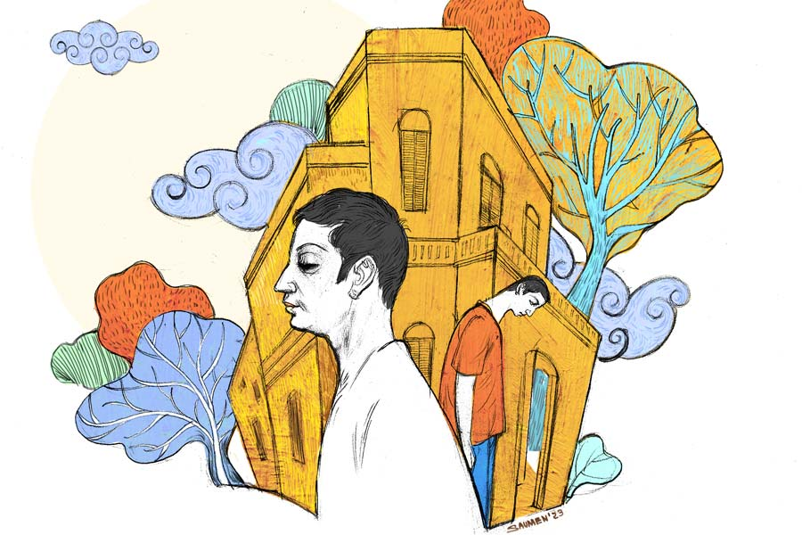

 
 <h1 align=center>বাড়ি</h1>
<h2 align=center>মৌমিতা চক্রবর্তী</h2> শশাঙ্ক মন দিয়ে ফাইলের কাজ সারছিল। মার্চ মাস। ইয়ার-এন্ডিং। কাজের পাহাড়। বাড়ি ফিরতে প্রায় ডিনার টাইম। মেখলিপুরে রাত আসে তাড়াতাড়ি। এ তো কলকাতা শহর নয়! তবে শশাঙ্কর বেশ লাগে এখানে। বছর সাতেকের বেশি হয়ে গেল এখানে। তখনও মিষ্টু জন্মায়নি। এখন মিষ্টু আর রঞ্জিতারও পছন্দ মেখলিপুর। ঠান্ডা শান্ত সবুজ, ভিজে ভিজে মফস্সল। রাস্তা জুড়ে বড় বড় গাছ। তাদের গাঢ় ছায়া। স্বচ্ছ নীলচে আকাশ, জমাট ঘাস আর পাখিদের অবাধ নির্ভয় আনাগোনা। অহেতুক তাড়াহুড়ো নেই কারও। রাস্তায় চেনা মুখ পড়লে দুটো ভালমন্দ খোঁজখবর নেওয়ার ফুরসত মেলে।

হঠাৎই শশাঙ্কর ফোনটা বেজে উঠল। বিকেল চারটে তখন। অজানা নম্বর স্ক্রিনে দোল খাচ্ছে। শশাঙ্ক সামান্য বিরক্তি নিয়ে ফোনটা ধরে, বলে, “হ্যালো!”

“দাদা...” ও পারের কণ্ঠস্বরে ঢোঁক গেলার শব্দ শুনতে পাওয়া যায়।

শশাঙ্ক বলে, “কে বলছেন!”

“আমি ফেসবুকে বাড়ি বিক্রির অ্যাডটা দিয়েছিলাম। আপনার সঙ্গে এক বার ফোনে কথা হয়েছিল...”

“হ্যাঁ হ্যাঁ... কী যেন নাম আপনার...” শশাঙ্কর মনে পড়ে গেছে। কী যেন নাম বলেছিল ছেলেটা! ইস্, বড্ড ভুলে যাচ্ছে আজকাল! নম্বরটাও সেভ করে রাখতে পারেনি।

ও পারের মৃদু কণ্ঠস্বর বলে উঠল, “আমি স্বপ্নময়।”

“হ্যাঁ হ্যাঁ... স্যরি ভাই.... কী যে হয়েছে, ভুলে যাচ্ছি ভীষণ।”

“ইট’স ওকে দাদা। আজ এক বার বাড়িটা দেখে যেতে পারবেন? তা হলে খুব ভাল হয় আর কী... ”

শশাঙ্ক প্রথমেই এক বার না বলবে ভাবল। আচমকা কী যেন একটা হল। বলল, “আচ্ছা ঘণ্টাখানেকের মধ্যে পৌঁছে যাচ্ছি। আপনি অ্যাড্রেসটা টেক্সট করে দিন প্লিজ়।”

“ধন্যবাদ দাদা। আমি এখুনি পাঠিয়ে দিচ্ছি।”

শশাঙ্ক ঝড়ের বেগে কিছুটা কাজ গুটিয়ে পাশের টেবিলের অনন্তকে খানিক ক্ষণ সামলে নিতে বলল। এ সব বোঝাপড়া এখানে চলে। সবটাই তো পারস্পরিক! বাইক স্টার্ট দেওয়ার আগে মোবাইলে স্বপ্নময়ের পাঠানো ঠিকানায় চোখ বুলিয়ে নিল। যে দিন থেকে এই মেখলিপুরেই পাকাপাকি ভাবে থাকবে বলে সিদ্ধান্ত নিয়েছে ও আর রঞ্জিতা, সে দিন থেকে তো কম বাড়ি দেখা হয়নি! জমি কিনে বাড়ি করা বড্ড হ্যাপা। দাঁড়িয়ে থেকে কাজ করানোর সময় নেই শশাঙ্কর। আর রঞ্জিতার আবার ফ্ল্যাট পছন্দ নয়। এক টুকরো মাটি না থাকলে সে গাছ লাগাবে কোথায়!

শশাঙ্ক ফেসবুকের ল্যান্ড সেল অ্যান্ড পারচেজ় গ্রুপগুলো নিয়মিত ফলো করে। অর্থ সামর্থ্য আর বিজ্ঞাপন মাপে মাপে মিললে তবে ফোন নম্বর নেয়। কিন্তু এখনও পর্যন্ত সে ভাবে মনে ধরেনি।

বেশ খানিকটা যাওয়ার পর শশাঙ্ক ভাবে, ঠিক রাস্তায় সে যাচ্ছে তো! ভাবতেই পিছন থেকে একটা ডাক শুনতে পায়।

“দাদা!”

শশাঙ্ক বাইক থামায়।

ছেলেটি সামনে এগিয়ে এসে বলে, “আমি স্বপ্নময়... আপনি...”

“তুমি আমায় আইডেন্টিফাই করলে কী করে!”

ছেলেটি অল্প হাসার চেষ্টা করল। হাতের ফোনটা পকেটে ঢুকিয়ে বলল, “চলুন, এই গলিতেই...”

স্বপ্নময়কে বাইকের পিছনের সিটে বসিয়ে ওর নির্দেশ মতো এসে থামে একটি বাড়ির সামনে। শশাঙ্ক এক নজরে দেখে নেয় বাড়িটাকে। বেশ ভাল... সামনের দিকে বারান্দা, গ্রিলের গেট। ভিতরের যেটুকু দেখা যাচ্ছে, তাতে নতুনের ছোঁয়া না থাকুক মান্ধাতার আমলের গন্ধটা নেই।

স্বপ্নময় বলে উঠল, “দাদা, এ দিকে আসুন। ওই বাড়িটা।”

এই বাড়িটা নয়! মনের সুখটুকু কেমন যেন নড়ে গেল শশাঙ্কর। দীর্ঘশ্বাস ছেড়ে সে এগোতে থাকে। বসন্তকাল। বিকেল গড়িয়েও আকাশ উজ্জ্বল। বাড়ির রোয়াকে বসে মহিলারা গল্প করছিল। শশাঙ্ককে দেখে মেয়েলি নিচুস্বরে কী যেন বলাবলি করল নিজেদের মধ্যে।

বাড়ির সামনের অংশের খুব কাছে পৌঁছতেই ভিতরে ঢোকার ক্ষীণতম বাসনা ফুরিয়ে এল শশাঙ্কর। পলস্তারা-খসা দেওয়ালে রঙের চিহ্নমাত্র নেই। সামনেটা কেমন বোঁচা। বারান্দা বা রোয়াক বলে কিছু নেই। হাড় বার করা দেওয়ালের মাঝে জীর্ণ ফুসফুসের মতো একটা জানলা ঝুলছে। গ্রিলের দারিদ্র প্রকট। এক পাশে ক্ষয়াটে দরজা।

স্বপ্নময় দরজা ঠেলে ভিতরে ঢোকে। ঢুকতেই একটা সঙ্কীর্ণ গলি মতো। ভীষণ অন্ধকার। বাইরের অপরিমিত আলো থেকে এখানে এসে শশাঙ্ক কিছুই দেখতে পাচ্ছিল না ঠিক করে। স্বপ্নময় তখনই একটা লাইট জ্বালিয়ে ঠিক বালবের নীচে দাঁড়িয়ে বলল, “আসুন দাদা।”

শশাঙ্ক এত ক্ষণে যেন ছেলেটিকে স্পষ্ট দেখল। লম্বাটে গড়নের বছর বাইশের যুবক। ফর্সা রং। গালে অল্প দাড়ি। খাড়া নাকের গঠনে আত্মপ্রত্যয়। চোখ দুটোয় অনিশ্চয়তা। ক্লান্ত দৃষ্টি। ঝাঁকড়া চুলে কপাল অল্প দেখা যায়। শশাঙ্কর যেন অদ্ভুত মায়া পড়ে গেল ছেলেটার উপর। ওর চেহারায় সারল্য আর অসহায়তা এসে পাশাপাশি দাঁড়িয়েছে।

স্বপ্নময় বলে, “আসলে সন্ধে হয়ে আসছে তো, তাই গলিটা অন্ধকার। সকালে আপনাকে লাইট জ্বালাতে হবে না, দেখবেন...”

শশাঙ্ক কথা বাড়াল না। স্বপ্নময় ঘুরিয়ে ফিরিয়ে বাড়ি দেখাতে শুরু করল। ছোট্ট উঠোন। সেখান থেকে ঘর উঠেছে। ঘুপচি ঘর। তার মধ্যে আরও ঘুপচি বিছানা। ভিতরের দেওয়াল নোনা-ধরা। ঝুরঝুরে জট পাকানো সিমেন্ট বালি ছড়িয়ে রয়েছে তেলচিটে বালিশ বিছানায়। ফাটল ধরা আয়নার ঢাকায় বুড়ো টিয়াপাখিটি দীর্ঘ দিন লেজ ঝুলিয়ে বসে থাকতে থাকতে বিবর্ণ হয়ে পড়েছে। তবে উলের বুনোট এখনও সংহত। হয়তো রান্নাঘরে জায়গার অপ্রতুলতায় মুড়ির টিন, চালের ড্রাম, জলের বালতি ঘরের একটা কোণ জুড়ে পড়ে রয়েছে। ক্যালেন্ডার ছাড়া সবেতেই মলিনতা স্পষ্ট। দুটো ঘর দেখানোর পর স্বপ্নময় বলে, “দাদা, ওপরে চলুন।”

শশাঙ্ক পা টিপে টিপে ওঠে। কলতলার পাশেই সিঁড়ি। দুপুরে খাওয়ার পর মাজা বাসনগুলো সিঁড়িতে ছড়ানো। আলো বাতাসের কার্পণ্যে বাসনের ঝরে পড়া জল এখনো শুকোয়নি। শশাঙ্ক ঘোলাটে আশা নিয়ে উপরে উঠতে থাকে। ভাবে, নীচের অংশ স্যাঁতসেঁতে হলেও দোতলা কিছুটা দিলদরিয়া হবে। কিন্তু কোথায় কী! নীচতলা যদি কাদাটে হয়, তবে জরাজীর্ণ উপরতলার ঘরগুলোকে মরচে-ধরা ছাড়া আর কিছু বলা যায় না। স্বপ্নময় বলে, “আমার দুই কাকুও আগে থাকতেন। সকলে মিলে থাকতে বেশ অসুবিধে হচ্ছিল... তাই ওরা আলাদা করে বাড়ি করেছে। বাড়িটা বিক্রি হলে ভাগে যা পাব তাতে আমরাও...”

কথা শেষ না করতেই কোণের ঘর থেকে বৃদ্ধের তুমুল কাশির শব্দ শোনা গেল। শশাঙ্ক সে দিকে কান করতে স্বপ্নময় বলে, “বাবা। দীর্ঘ দিন ধরে অ্যাজ়মায় ভুগছেন। কত ডাক্তার দেখাচ্ছি। কত ওষুধ। সারছে না।”

শশাঙ্ক সন্ত্রস্ত পায়ে বৃদ্ধের ঘরের দিকে এগোয়। রোগ আর অভাব মানুষটাকে বেশি বয়স্ক করে তুলেছে। ছেলের চোখের দিকে স্থির চেয়ে রয়েছেন। ছেলের কাঁধে সমস্ত দায়িত্ব চাপিয়ে তিনি যেন আসল আসামি।

স্বপ্নময় বলে, “চলুন ছাদ থেকে এক বার ঘুরিয়ে নিয়ে আসি।”

এই বড় আকাশের নীচে এক চিলতে ছাদ। স্বপ্নময় খুব উৎসুক হয়ে বলল, “এই ইট-পাতা রাস্তাটা খুব তাড়াতাড়িই ঢালাই হয়ে যাবে। এখান দিয়ে যাতায়াত করতে পারবেন। বাড়ির পিছনের গেট দিয়ে। দোতলার রাস্তার দিকের জানলাটা খুলে রাখতে পারবেন সারা রাত।”

স্বপ্নময়ের চোখ দুটো চকচক করে উঠল। যে ছকের চিত্র সে আঁকল, তা এক কালে তাদের পরিকল্পনা ছিল। মানুষ বর্তমানের অসুবিধে, অতীতের গৌরবগাথা আর ভবিষ্যতের সম্ভাবনায় দিন কাটায়।

ছাদ থেকে নামার সময় শশাঙ্ক খেয়াল করে, ইটের ঢেলা দিয়ে আয়তাকার ছক কাটা। কিত কিত খেলার ঘর। কোথাও লম্বা টানা দালানে এক্কাদোক্কার ঘর কাটা। একটা সময় এ বাড়ি লোকে মুখরিত ছিল, হাসি ছিল কান্না ছিল, ভাইবোনেদের খেলা ছিল, উৎসব ছিল। প্রতিটি জীর্ণতার খাঁজ বরাবর খেলা করছে স্মৃতির আঁকিবুকি।

গলি দিয়ে বাড়ি ফেরার পথে স্বপ্নময়ের মায়ের সঙ্গে পরিচয় হল। অভিমানী চোখ দুটো ছলছলে। হয়তো বিয়ে হয়ে আসা ইস্তক মেয়েলি গুণে এই বাড়িটিকে বড় বেশি আপন করেছিলেন, স্নেহস্পর্শে সাবলীল ও প্রাণময় করে তুলেছিলেন। জীবনের শেষ দিনগুলো চেনা সুখে আর অচেনা অসুখে কাটবে বলে কল্পনা করেছিলেন, আজ সেই পরমাশ্রয়টুকু হারাতে বসেছেন। চোখের ঘোলাটে তারায় একটাই প্রশ্ন, বাকি জীবনটা কোথায় কাটবে!

ফেরার পথে বাইক স্টার্ট দেওয়ার আগে স্বপ্নময় শশাঙ্কর গা ঘেঁষে দাঁড়ায়। বলে, “দাদা, কিছু তো বলুন! ভাল লাগেনি, না! রিমডেলিং করে ফেললে কিন্তু আবার...”

“না ভাই, তেমন নয়। বাড়িতে একটু আলোচনা করি...”

স্বপ্নময় যেন কিছুটা মুষড়ে পড়ল। সে ধরা গলায় বলল, “আসলে দাদা... এক কালে বাবা কাজ করতেন। এখন সবই আমার ওপর। এ বছরই বি এসসি কোয়ালিফাই করেছি। পড়াটা আর এগোতে পারা যাবে না বোধহয়। খুব শখ ছিল মাস্টার্স করার। কাকারা চাপ দিচ্ছে...বাড়ি বিক্রি করে সকলে ভাগ বুঝে নেবে। এই অবস্থায়... দাদা দেখবেন তো যদি একটা কাজ পাওয়া যায় কোথাও। আপনার তো অনেক চেনাজানা!” কথাটা বলেই কিছুটা লজ্জা পেল স্বপ্নময়। একটা ঢোঁক গিলে বলল, “অফিসে তো অনেক রকম লোক নেয়... ফাইল দেওয়া, কাগজ দেওয়া, জল দেওয়া। দাদা, আমি টয়লেট ক্লিনও করতে পারব কিন্তু!” স্বপ্নময়ের চোখ দুটো বাঘের মতো জ্বলজ্বল করে ওঠে।

এর পর মাস তিনেক গড়িয়ে গেছে। শশাঙ্কর জীবন উৎসব-আড়ম্বরহীনতায় এগিয়ে চলেছে। নাহ... স্বপ্নময়ের বাড়িটা তার পছন্দ হয়নি। বর্ণনা শুনে রঞ্জিতা একেবারেই নাকচ করে দিয়েছে। এর মধ্যে বহু বাড়ি দেখেছে দু’জনে মিলে। একটা প্রায় ফাইনাল। যেটুকু লোন করতে হবে, তাতে অসুবিধে হবে না শশাঙ্কর।

এক দিন টেনিস খেলে রাতে বাড়ি ফিরছে শশাঙ্ক। রাস্তা শুনশান। এ রাস্তায় বড় একটা লোক থাকে না। দু’-চারটে সাইকেল চলে আপন তালে। দু’ধারে বড় বড় গাছ। শশাঙ্ক ধীর গতিতে বাইক চালাচ্ছিল। হঠাৎ কেউ একটা সামনে এসে পড়ায় ইমার্জেন্সি ব্রেক কষে। সিট থেকে নিজেও খানিকটা উঠে আসে আচমকা। নিজেকে সামলে নিয়ে খুব অশ্রাব্য একটা গালি দিতে যাবে, তখনই চেনা স্বর বলে ওঠে, “দাদা...”

“কে! স্বপ্নময়?” অন্ধকার ভীষণ। আলো আঁধারিতে চেহারা অস্পষ্ট, “তুমি এখানে কী করছ! মুখে দাগ কিসের? আর কপালে ও কী...’’

স্বপ্নময় বলে, “দাদা... আমাকে একটা কাজ দেখে দেবেন বলেছিলেন যে, হবে না দাদা?”

শশাঙ্ক কী যেন বলতে যাচ্ছিল তার আগেই স্বপ্নময় চোখের নিমেষে হারিয়ে গেল। শশাঙ্ক চোখ রগড়াল বারদুয়েক। গলার শ্লেষ্মা পরিষ্কার করে জোরে ডাকল, “স্বপ্নময়, স্বপ্নময়... তুমি কোথায় গেলে!”

উত্তর এল না। বরং শশাঙ্কর কণ্ঠস্বর বড় গাছেদের গায়ে ঠোক্কর খেয়ে বিকট শোনাল। গায়ে কাঁটা দিয়ে উঠল তার। সত্যি স্বপ্নময়? না মনের ভুল? শশাঙ্ক বাইক স্টার্ট করে ছুট দিল।

পরদিন অফিস যাওয়ার আগে স্বপ্নময়ের বাড়ির দিকে গেল শশাঙ্ক। বর্ষার জলে যেন আরও খানিকটা ধুয়ে গেছে, কিছু যেন মুছে গেছে। কড়া নাড়তে গিয়েও সাহস পেল না শশাঙ্ক। পথচলতি এক যুবককে ডেকে জিজ্ঞাসা করল, “ভাই, এখানে স্বপ্নময় নামে এক জন...”

যুবকটি মাথা নিচু করে থাকল কিছু ক্ষণ। তার পর সজল চোখে বলল, “তিন দিন হল অ্যাক্সিডেন্টে মারা গেছে স্বপ্ন। খুব ভাল ছেলে ছিল। কী যে চিন্তা করছিল রাস্তায় কে জানে! আচমকা একটা লরি এসে... অ্যাক্সিডেন্টে মুখটা একেবারে...”

শশাঙ্কর শরীর টলে ওঠে। স্বপ্নময়ের মা-বাবা এখন কোথায়? তাঁদের কে দেখবে? তাঁরা তো অসুস্থ, তাঁদের চিকিৎসারই বা কী হবে? বাড়ি বিক্রি হয়ে গেলে তাঁরা কোথায় যাবেন? প্রাচীন বাড়িটি বহু উত্তরহীন প্রশ্ন নিয়ে দাঁড়িয়ে থাকে নিষ্প্রাণ।

বাড়িটার দিকে আর তাকাতে পারে না শশাঙ্ক। মাথা নিচু করে ফেরার পথ ধরে।