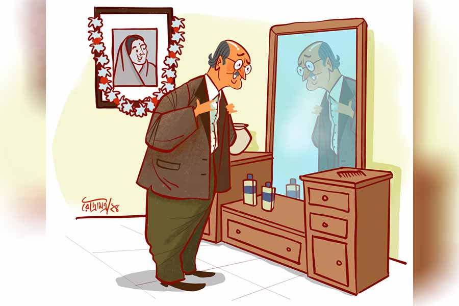

 
 <h1 align=center>বিকেলের ঘেঁটু ফুল</h1>
<h2 align=center>রাজশ্রী বসু অধিকারী</h2> দশ বাই বারো ঘরের দেওয়াল জুড়ে প্রায় চার ফুট চওড়া ছ’ফুট লম্বা ড্রেসিং টেবিল। তার সামনে ঘুরে-ফিরে নিজেকে দেখেন ঘেঁটুবাবু। ঘেঁটু হল ঘটোৎকচের শর্ট ফর্ম। ঘটোৎকচ সেনশর্মা তিন দিন হল বহু টাকা দিয়ে এই আয়না কিনে এনেছেন। কয়েক দিন থেকেই ওঁর মনে হচ্ছে নিজেকে ঘুরে-ফিরে ভাল করে দেখার মধ্যে এক অপার আনন্দ আছে, যা উনি সারা জীবনে কোনও দিন জানতেন না। তাই ছোট্ট একখানা ঝোলানো আয়না নিয়েই কেটে গেল সারা জীবনের দাড়ি কামানো আর গোঁফ আঁচড়ানো। চুলের বালাই নেই মাথায়, তাই আঁচড়ানোর পাটও নেই। কিন্তু নিজের শরীরও যে এক দেখার বস্তু, তা-ই তো জানা ছিল না। সবে মাসখানেক হল অনেক না-জানা কথা নতুন করে জ্ঞানের পরিধি বাড়িয়ে তুলছে। এ এক অন্য রকম বোধ। নিজেকে নতুন করে চেনা। ভাল-লাগার আবেশে কলজেটা যেন ফাটি-ফাটি করে ওঠে।

আজ একটু তাড়াতাড়ি নীচে নামতে হবে। এক মিনিটও নষ্ট করা চলবে না। আজই যা বলার বলে ফেলতে হবে। তিন দিন তিন রাত ভেবে মনস্থির করে ফেলেছেন তিনি।

এক মাত্র খয়েরি কোটখানা বারকয়েক ঝেড়ে গায়ে দিয়েই ফেললেন। চোখ আয়নার দিকে। নাঃ, একটা নতুন ব্লেজ়ার কিনলে হত। এটার বয়স নয়-নয় করেও প্রায় বাইশ বছর হল। রংটাও জায়গায় জায়গায় সাদাটে ঠেকছে। সন্ধে নেমেছে তাই রক্ষে। রংটা বোঝা যাবে না। প্যান্টটার বয়সও প্রায় তাঁর যৌবনকালের সমান। জামাকাপড়ের প্রতি তো কোনও দিন নজর দেননি। চিরকাল তার কাছে পোশাক ছিল শুধু্ আব্রু রক্ষার ব্যবস্থা। দুটো দুটো চারটে হলেই যথেষ্ট। সঙ্গে বাড়িতে পরার জন্য আদি অকৃত্রিম চেক লুঙ্গি। হালে সব কিছুতেই যেন খুঁত ধরা পড়ছে। অথচ আগে শিবানী যখন বেঁচে ছিলেন, ওঁর শত অনুরোধেও কোনও দিন মনে হয়নি একটু সাজসজ্জা করে স্ত্রীর মন রক্ষা করেন। এই আয়নাটা কিনেও শিবানীকে বার বার স্মরণ করতে হয়েছে। মনে হয়েছে, সে যেন বাঁধানো ছবির মধ্যে থেকে দাঁত বার করে হাসছে।

সে যাকগে, পুরনো কথা যত তাড়াতাড়ি বিস্মরণ হয় ততই মঙ্গল। স্ত্রীবিয়োগের পর একা একা তো তাঁর স্মৃতি আঁকড়ে তিরিশ বছর কাটালেন। এখন যদি মন চায় নতুন করে জীবন শুরু করতে, তাতে তিনি কোনও দোষ দেখেন না। আসল কথা হল, তিনি একা চাইলেই তো হবে না! যার কথা শয়নে স্বপনে ভেবে চলেছেন, তাকেও তো উল্টো দিকের কথা ভাবতে হবে! টাকমাথায় হাত বুলিয়ে নিয়ে হাতের তেলোয় গাদাখানেক ময়শ্চারাইজ়ার ঢেলে সারা মুখে লেপে নেন ঘটোৎকচবাবু। এতে চামড়া বেশ নরম থাকে। তার চেয়েও বড় কথা হল মুখ থেকে ভুরভুর করে সুন্দর গন্ধ বেরোয়। সে দিনও রোজিনা বলছিল, “হাউ সুইট স্মেল ইজ় দ্যাট, কুথাকে পেইয়েছেন গ?”

“আপনার লাইগবে? আইনব আর এক বোতল? আমনার স্কিন আরও মুলাম হব ইটা মাইখলে...”  সঙ্গে সঙ্গে ঘটোৎকচ বিগলিত হেসে বলেছিলেন।

ইভনিং ওয়াক শেষে নিজের ফ্ল্যাটে ফেরার আগে অন্ধকার প্যাসেজে রোজিনা ঘটোৎকচের নাকটা আলতো হাতে মুলে দিয়ে মুচকি হেসে বলেছিল “ন-ও-ও-টি!”

তার জেরে পরের দিনেই এসে গেছে আর একখানা সবচেয়ে বড় মাপের শিশি। সেটা যখন দিয়েছিলেন, তখনও রোজিনা একমুখ হেসে হাতে নিয়ে কাঁধের ব্যাগে বোতলটা পাচার করেই বলেছিল, “ইটা আবার কি দরকার ছিল? আপনি না, সত্যি... যা-আ-তা-আ...”

সেই সুযোগে ঘটোৎকচ রোজিনার হাতটা সেই যে মুঠোর মধ্যে নিয়েছিলেন সে দিন, পুরো ওয়াকিংটা ওই ভাবেই কেটেছে। আহা এ যেন এক অসম্ভব সুখস্বপ্ন, ভাবলেই বুকের ভিতরটা শিরশির, ঝিরঝির করে ওঠে, নতুন বসন্তের কচি পাতার মতো।

কিন্তু এ ভাবে শুধু হেঁটে হেঁটে আর কত দিন! এ বার তাঁকে মুখ ফুটে বলতে হবে। জীবন-নৌকোয় বাঁধতে হবে, সা রে গা মা পা সাধতে হবে, ছক্কা ব্যাটিং করতে হবে।

ঘটোৎকচবাবু সুরের ছন্দে ছন্দে আগামী কর্মপন্থা আরও এক বার ঝালিয়ে নেন।

সঙ্গে সঙ্গেই দরজায় দাঁড়িয়ে রাত-দিনের কাজের মেয়েটা তার কাঁসার বাসনের ঝনঝনানিকে লজ্জা দেওয়া গলায় তারস্বরে চেঁচিয়ে ওঠে, “অ দাদু-উ-উ! এই গরমে ধুমসো কোটখনা গায়ে দিলে যে বড়? পেগলে গেছ, না কি?”

বিস্বাদ মুখে ঘটোৎকচ বলেন, “আঃ বিনি! তোকে কত বার না বলেছি দাদু-ফাদু বলবি না!”

“অ মাগো! দাদুকে দাদু বলব না তো কী বলব? সেই যে দিন এলাম, সে দিন থেকেই তো তোমাকে দাদু বলে ডাকছি। এত দিন পরে নতুন করে কী বলব তোমাকে, শুনি?”

কটকট করে কথা শুনিয়ে দেয় বিনি। এই ক্যাম্পাসে দশ তলার উপরে থেকে থেকে সে-ও আর আগের মতো নেই। এখন সে অনেক বোঝে, অনেক জানে। এগিয়ে এসে বলে, “অ্যাত্তগুলো ময়েশ্চারিঝার ঢেলেছ যে? সাবানের ফেনার মতো লাগছে তো মুখটা। দু’ফোঁটা দিলেই তো কাজ হয়। বুঝি না বাপু যত অনাসৃষ্টি কাণ্ড!”

“চুপ কর! সব তাতে তোর কথা বলার কী আছে অত? তুই যা তো এখান থেকে...” বলে ঘটোৎকচবাবু শেষ বারের মতো গোঁফটা আঁচড়ে নেন। বিনি বিরক্ত হয়ে চলে যাচ্ছিল। স্বর বদলে ডাকেন, “বিনি, বাবা শুনে যা তো এ দিকে এক বার...”

“কী হল আবার? এই বললে যেতে, এই আবার ডাকছ। তোমার পুরো মাথাই নষ্ট...”

কোমরে হাত দিয়ে বিনি এসে দাঁড়ায় ঘরের মাঝখানে। অত্যন্ত বিরক্তচোখে তাকায় ড্রেসিং টেবিলটার দিকে, “সত্যি বাবা! কী যে তোমার পছন্দ বুঝি না। বলা নেই কওয়া নেই এই দামড়া আয়নাটা কিনে আনলে। বিচ্ছিরি! আমাকে বললে ওই মোড়ের দোকান থেকে ভাল ফান্নিচার চয়েস করে দিতাম।”

“হ্যাঁ তা আর নয়! ওই দোকানে যে তোমার প্রাণভোমরা আছে, আমি কী আর জানি না!” ঘটোৎকচবাবু বিরক্ত মুখে জবাব দিয়েও আবার সঙ্গে সঙ্গেই নিজেকে পাল্টে নেন, গলায় মধু ঢেলে বলেন, “হ্যাঁ রে, একটা কথা বল তো সত্যি করে, আমাকে কি খুব বুড়ো লাগে? সবে তো বাহাত্তর হল। হাত পা চোখ কান সব তো ঠিক আছে... বুড়ো বলতে পারবে কি লোকে আমাকে? বল না বল, কোনও রাখঢাক না করেই বল...আমি একটুও রাগ করব না।”

বিনি হাঁ করে শোনে। প্রথমে হেসে গড়াতে যাচ্ছিল। কিন্তু সে বেশ চালাকচতুর। তাই মত বদলে পলকে আটকে ফেলে হাসি। চোখে-মুখে অবাক ভাব ফুটিয়ে বলে, “অ মা! তুমি আবার বুড়ো হলে কোথায় গো! তোমার মতো বয়সে লোকে তো পেরথম বিয়ে করে আজকাল! তোমাকে দেখে কি পঁয়তিরি-চল্লিশের বেশি লাগে নাকি! শোনো, ভাল কথা, তিনশোটা টাকা দিয়ো তো, কিছু জিনিসপত্তর আনতে হবে দোকান থেকে। একদম বাড়ন্ত।”

যদিও ঘটোৎকচবাবু বরাবর বাজারখরচের প্রত্যেকটির হিসাব নিয়ে তবেই টাকা ছাড়েন। কিন্তু বিনি আজ তাঁর মন ভাল করে দিয়েছে। হৃষ্টচিত্তে টাকা দিয়ে ঘরের বাইরে পা রাখেন। লিফ্টের বাটনে আঙুল ছুঁইয়ে মনটা ছটফট করে ওঠে। বড্ড যেন দেরি হচ্ছে লিফ্ট আসতে। মন মানতে চাইছে না আজ আর। কাল রোজিনাকে বলে রেখেছিলেন আজ একটা বিশেষ কথা বলবেন, বলা হয়নি। পরশুও বলে রেখেছিলেন, সে দিনও হয়নি। হয়নি মানে, বলি-বলি করে অস্বস্তিতে আর বলতে পারেননি। আজ বলবেনই বলবেন।

চিরদিন এই দামি কমপ্লেক্সে থাকতেন না তিনি। মেদিনীপুর থেকে এসে শেয়ালদায় প্রথমে লোহার দোকানের কর্মচারী। তার পর নিজের অধ্যবসায়ে হার্ডওয়্যারের ব্যবসা। বাড়িওয়ালার অনুমতিতে দোকান শুরু হল ভাড়াঘরের পাশের গলিতে এক টুকরো টিন-ঢাকা গোডাউনে। সেখান থেকে বড়বাজারে বড়সড় দোকান। তার পর শ্যামবাজারে। আর পিছন ফিরে তাকাতে হয়নি। পয়সাই পয়সা। মা লক্ষ্মী দু’হাত ভরে আশীর্বাদ করে গেছেন জীবনভর। কিন্তু মা লক্ষ্মীর পুজো করতে করতে কখন যে ঘরের লক্ষ্মী চোখ বুজলেন, কখন বাহাত্তরের কোঠায় চলে এল বয়সটা! ঘটোৎকচবাবুর এখন কেবলই মনে হয়, এই জীবনটা বৃথাই গেল। না হল কোনও রোম্যান্স, না কোনও আনন্দ। এত দিন পরে এসে মনে হয়, জীবন মানে বোধহয় শুধুই টাকা নয়। কিন্তু শুধু মনে মনে হা-হুতাশ করে বাকি জীবনটুকুকেও বইয়ে ফেলার মানুষ তিনি নন। তাই দেখেশুনে রাজারহাটের ‘পশ’ এরিয়ায় দশ তলায় ফ্ল্যাট কিনে ফেলেছেন বছর দুই আগে। দোকানগুলো লিজ়ে দিয়েছেন লাভ রেখে। মনের মতো অবসর যাপনের ইচ্ছে তাঁর।

প্রথম দিকে এইটুকুই ছিল। এখন জীবনকে পূর্ণ উপভোগ করার বাসনা চেপেছে। তার সূত্রপাত মাসখানেক আগে। যে দিন প্রথম দেখলেন ছ’তলার রোজিনা মিত্রকে, সেই দিনটা যেন নবজীবনের শুরু। নীচের ডিপার্টমেন্ট স্টোরে ছাপা-ছাপা হাঁটু-ঝুল ফ্রক পরা ফর্সা টুকটুকে গোলগাল মধু-মধু বছর ষাটের মহিলাটির সঙ্গে দৃষ্টি এবং বাক্যবিনিময়। আহা! কী যে মিষ্টি চাউনি তার! ঘটোৎকচবাবুর লৌহাবৃত একাকী হৃদয়ের বদ্ধ কপাট যেন চুরচুর হয়ে ভেঙে পড়ল। কিউ-তে রোজিনার পিছনেই ছিলেন তিনি। ও জিনিস কিনে ক্যাশ দিচ্ছিল। কিছু টাকা কম পড়েছিল বোধহয়। ভারী লজ্জা লজ্জা মুখে পিছনে তাকিয়ে বলল, “দু’খানা পাঁচশো টাকার নোট হবে নাকি? ফ্ল্যাটে গিয়ে ফেরত দিচ্ছি...”

“হ্যাঁ হ্যাঁ, এই নিন...” সঙ্গে সঙ্গে এগিয়ে দিয়েছিলেন তিনি। তার পর রোজিনার মাল হাতে নিয়ে ওর ফ্ল্যাটে গিয়ে পৌঁছেও দিয়েছিলেন। রোজিনা গল্প করল অনেক। কালো চা খাওয়াল। আর কথার ফাঁকে ফাঁকে টাকাটা দিতে ভুলে গেল। তাতে কী! সেটা অবশ্য ঘটোৎকচবাবুর পক্ষে ভালই হয়েছিল।

তার পর দিন আবার গেলেন। তার পর দিন আবার। তার পর শুরু হল এক সঙ্গে ইভনিং ওয়াক। সে অত্যন্ত মধুময় পর্ব। ঘটোৎকচবাবুর মনে হল, তাঁর এত দিনের যত ফাঁকা জায়গা সবটা রোজিনা ভরে দেবে। তত দিনে জানা হয়ে গেছে, রোজিনাও তার মতোই একা। সঙ্গী বলতে শুধু একটা কুকুর। স্বামী-পুত্র-কন্যা কেউ নেই। তারা নেই, না কি কোনও দিন ছিলও না, তা পরিষ্কার নয়। তাতেই বা কী! যা কিছু অজানা সব আজই জেনে নেবেন। প্রস্তাবটাও আজই দেবেন।

ঘটোৎকচবাবু পায়ে পায়ে নেমে আসেন রোজিনার ফ্ল্যাটের দরজায়। আলতো করে ডোরবেলে আঙুল ছোঁয়ান, যেন সদ্য প্রেমে-পড়া তরুণ প্রেমিকার গালে আলতো টোকা দিচ্ছে।

অন্যান্য দিন রোজিনার কুকুর পাশের ঘরে বাঁধা-ই থাকে। আজ কাজের লোকটি দরজা খোলামাত্রই চারপায়ে ছুটে এল সে। ভৌ ভৌ ভৌ... ডেকেই যায় ঘটোৎকচবাবুর দুই কাঁধে পা রেখে। নাক ঠেকিয়ে গাল শুঁকছে। উঃ! কী বিদঘুটে কুকুর রে বাবা! ঘটোৎকচবাবু না নড়তে পারেন না সরতে।

দূরে দাঁড়িয়ে কাজের লোকটা দাঁত বার করে হাসছে।

“ওকে সরাও না বাপু। দেখছ, এ বার আমায় চাটতে চাইছে। কামড়ে-টামড়ে দেবে...”

“আপনি বাবু জিকোর ময়েশ্চার মেখেছেন, গন্ধ পেয়েছে তো, তাই এমন করছে।”

“কী? আমি ওর...” ঘটোৎকচবাবু বুঝতে চেষ্টা করেন কী বলছে লোকটা। পলকে মাথায় ঢুকেও যায়। সেই স্কিন কেয়ারের বোতলটার সদ্গতি হয়েছে এই চতুষ্পদ বাপধনের শরীরে! তাই একে এমন চকচকে লাগছে! ছি ছি...!

কত ভালবেসে রোজিনাকে দিয়েছিলেন বিরাট শিশিটা! আর রোজিনাও কত ভালবেসে ওঁর নাক মুলে দিয়েছিল, সব মনে পড়ে যায়। তার এই গতি! ছি ছি ছি!

চলে যাওয়ার জন্য পা বাড়ান তিনি। রোজিনা ভিতরে ছিল। সে এত ক্ষণে এসেছে ড্রয়িংরুমে। পিছন থেকে তার স্পেশ্যাল মেদিনীপুরি গলা শোনা যায়, “জিকো... তুমাকে না বইললম দুষ্টামি না কইরতে... যা-আ-ও ভিতরে যাও... গো...”

জিকো ভিতরের দিকে আর ঘটোৎকচ বাইরের দিকে পা বাড়ান। দেওয়ালে ঝুলন্ত শিবানীর ফিকফিক হাসিসমেত মুখটা মনে পড়ে যায় ঘটোৎকচবাবুর। নাঃ! রোমান্স-ফোমান্স তাঁর জন্য নয়। যার হয় না নয়ে, তার হয় না নব্বুইয়ে।

ময়শ্চারাইজ়ারের দুঃখে মনটা হু-হু করে ওঠে তাঁর।

ছবি: রৌদ্র মিত্র