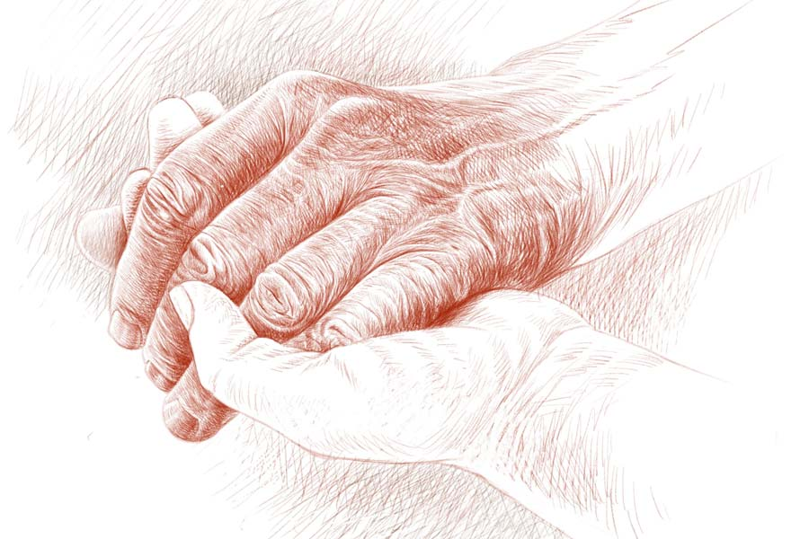

 
 <h1 align=center>বিচ্ছেদ</h1>
<h2 align=center>তন্ময় সরকার</h2> ঘটনার আরম্ভ দিন কুড়ি আগে। এক রাতের খাবারের টেবিলে নিভা বললেন, “শুভ, তোর বাবার অবস্থা কিন্তু দিন-দিন খারাপ হচ্ছে। ক’দিন ধরে বলছি, কান দিচ্ছিস না। শেষে তোকেই ভুগতে হবে।”

শুভম যেন আকাশ থেকে পড়ল, “ক’দিন ধরে বলছ মানে? কই, আমি তো শুনিনি!”

“তা শুনবি কেন?” ঝাঁঝিয়ে উঠলেন নিভা, “বাড়ি ঢোকা ইস্তক অত কানভারী করলে মা-বাবার কথা কি আর কানে যায়!”

শুভম বুঝল মায়ের কথার তির ডাইনিং টেবিলের কাচে রিফ্লেক্ট করে স্ত্রী অস্মিতার দিকে ধাবিত হচ্ছে। কিন্তু শুভমের মতো দায়িত্বশীল ছেলের বিরুদ্ধে এমন অভিযোগ মোটেই ন্যায্য নয়। তবু মায়ের কথার পাল্টা জবাব সে দিল না। মাকে শক্ত কথা বলে কষ্ট দিতে তার কষ্ট হয়।

পরদিন এক জন নামডাকওয়ালা ইএনটি সার্জনের কাছে চিত্তবাবুকে নিয়ে গেল শুভম। রোগী দেখে ডাক্তার সংহিতা হালদার ভুরু কোঁচকালেন, “এই রোগ পনেরো বছরের কমবয়সি বাচ্চাদের হয়, বয়স্কদের জেনারেলি হতে দেখা যায় না। গতিক ভাল ঠেকছে না!”

সুতরাং একগাদা টেস্ট লিখলেন ডাক্তার। কিন্তু প্রেসক্রিপশনের পাতায় ওষুধের কোনও নামগন্ধ নেই।

“একটা কিছু ওষুধ... প্লিজ় ডক্টর... আসলে খুব কষ্ট পাচ্ছেন...” খুব বিনয়ের সুরে শুভম অনুরোধ করল।

“নো মেডিসিন বিফোর প্রপার ডায়াগনোসিস,” ডাক্তার হালদার টান-টান বললেন, “রোগটা সুবিধের লাগছে না। কোনও ম্যালিগন্যান্সি আছে কি না সেটা আগে বুঝতে হবে।”

ম্যালিগন্যান্সি! ক্যান্সার হয়েছে বলে সন্দেহ করছেন না কি ডাক্তার! বুকটা ধড়াস করে উঠল শুভমের।

টেস্টগুলো দামি। রিপোর্ট তাড়াতাড়ি চাই। বিস্তর দৌড়ঝাঁপ করেও চার দিনের আগে রিপোর্টগুলো এক সঙ্গে করা গেল না। চিত্তবাবুকে নিয়ে চলাফেরা করাও খুব মুশকিল। কারণ তিনি চোখে মোটেই দেখেন না, আর বাঁ পা খোঁড়া।

রিপোর্ট নিয়ে যখন সংহিতা হালদারের সামনে ফেলল শুভম, তত ক্ষণে চিত্তবাবু যন্ত্রণায় আধমরা। খাদ্যনালি পুরো বন্ধ, এক বিন্দু জল গড়াচ্ছে না গলা দিয়ে, কথা জড়ানো, আর মুখ থেকে সর্বক্ষণ লালা ঝরছে।

“কী বুঝলেন ম্যাডাম?” উদ্বেগে গলা শুকিয়ে গিয়েছে শুভমের।

তর্জনী দিয়ে চিত্তবাবুর ডান কান ঘেঁষে চোয়াল আর গলা নির্দেশ করলেন ডাক্তার, “প্যারোটিড গ্ল্যান্ডে ভয়ঙ্কর ইনফেকশন, সঙ্গে ডান দিকের টনসিল ফুলে ঢোল। এখনই কোনও মেডিক্যাল কলেজে নিয়ে যান। একটু পরেই শ্বাসকষ্ট শুরু হবে।”

“কোনও নার্সিংহোমে ইমার্জেন্সি অ্যাডমিট করিয়ে কি আপাতত রিলিফ দেওয়া যাবে? বাবাকেএই অবস্থায় কলকাতায় নিয়ে যাওয়া... বুঝতেই পারছেন, হি হ্যাজ় আদার চ্যালেঞ্জেস...”

ডাক্তার বললেন, “লোকাল নার্সিং হোমের পক্ষে এই রোগী হ্যান্ডল করা অসম্ভব। হয় কোনও মেডিক্যাল কলেজ, না হলে...”

না হলে কলকাতারই বড়লোকি কোনও প্রাইভেট হাসপাতাল, এমনই বোঝাতে চাইলেন ডাক্তার হালদার।

“কোনও ওষুধ…”

“এ সব ট্যাবলেট খাওয়ানোর কেস নয়। আপনি ইমিডিয়েট রওনা হোন, দেরি করলে বিপদ হবে!”

বিপদ হতে কিছু বাকি কী আছে! আর সে যখন আসে, জ্ঞাতিগুষ্টি সঙ্গে নিয়ে আসে। সে-রাতে পঞ্চাশ কিলোমিটার দূরে কলকাতার একটি মেডিক্যাল কলেজে বাবাকে নিয়ে পৌঁছতে পেরেছিল শুভম, কিন্তু ভর্তি করাতে পারেনি। রোগীর তুলনায় অপর্যাপ্ত বেড। রাত বারোটায় ফিরে আসতে হল বাড়ি। চিত্তবাবুকে দেখে মনে হল, তিনি আর বড়জোর কয়েক ঘণ্টা। নিভা অনেক কষ্টে দু’চামচ হেলথ ড্রিঙ্ক গেলালেন বটে, কিন্তু সেটুকু গলাধঃকরণ করার যন্ত্রণায় কাপড়চোপড় আর বিছানা নষ্ট করে ফেললেন চিত্তবাবু।

বাবার মুখের দিকে চেয়ে জলে ভরে এল শুভমের চোখ। তার পরেই একটি গোপন ভাবনা যেন সান্ত্বনার সুরে বলল, অনেক বছর তো হল, আর কেন! আশি বছর তো চাট্টিখানি কথা নয়! এখন অহেতুক ভাঙা কুলোর মতো বেঁচে থাকার কী মানে? আর যদি মরেও যায়, লোকে বলবে না যে, অকালে বিনা চিকিৎসায় লোকটা চলে গেল! আশি বছর একটা আদর্শ মরার বয়স!

পরক্ষণেই সুতীর্থর কথা মনে এল, তার পাঁচ বছরের ছেলে৷ শুভমের আশি বছর বয়সে সুতীর্থ যদি তাকে নিয়ে এমন ভাবে! ভাবতেই, নিজেকে ধিক্কার দিল শুভম, ছি!

পরদিন খুব ভোরে সে চিত্তবাবুকে নিয়ে রওনা হল আর একটি মেডিক্যাল কলেজের উদ্দেশে। চিত্তবাবুর তখন শ্বাসকষ্ট শুরু হয়েছে।

আউটডোরের ডাক্তারটির অল্প বয়স। গাবলু-গুবলু। মনে হয়, ছোট থেকে মায়ের হাতে অনেক ঘি-মাখন আর আদর-যত্ন খেয়ে বড় হয়েছে। মুখটাও কেমন মায়া মাখা। সে কতকগুলো ইন্টার্ন ছেলেমেয়েকে নিয়ে চিত্তবাবুর মুখের মধ্যে এক প্রকার হামলে পড়ল, “দেখেছিস! টনসিল প্লেটটা লেফট সাইডে কেমন শিফট করে গেছে!”

শুভম কাতর স্বরে ডাক্তারের মনোযোগ আকর্ষণ করল, “যে ভাবে হোক অ্যাডমিশন করে নিন, স্যর। এই পেশেন্ট নিয়ে কোথায় যাব বলুন? আর রাঘব বোয়ালের পেটে যাওয়ার সাধ্যি আমাদের নেই।”

“রাঘব বোয়াল!”

মুখ কাঁচুমাচু করে শুভম বলে, “আমাদের মতো চুনোপুঁটির পক্ষে প্রাইভেট হসপিটালগুলো তো...”

ডাক্তার সমবেদনার সঙ্গে ঘাড় নাড়ল। সম্ভবত ছেলেটির ভিতরে এখনও দয়ামায়া আছে। হয়তো অল্প বয়স বলে।

“দাঁড়ান, স্যর এলে আমি সে ভাবেই বলছি যাতে ভর্তি নিয়ে নেন।”

স্যর, অর্থাৎ বড় ডাক্তার। আশঙ্কায় মনে মনে প্রমাদ গুনল শুভম, যদি তিনি ভর্তি না করেন! চিত্তবাবু তত ক্ষণে যন্ত্রণা আর শ্বাসকষ্টে ছটফট করছেন।

শুভম যা আশঙ্কা করেছিল তা-ই হল। বড় ডাক্তার এলেন, এবং বললেন, “ভর্তি হবে না। কোভিড নেগেটিভ রিপোর্ট ছাড়া এখন পেশেন্ট ভর্তি সম্ভব নয়।”

“আরটিপিসিআর করিয়ে রিপোর্ট পেতে-পেতে তো...”

“কথাটা ঠিক,” মাথা দোলালেন সিনিয়র ডাক্তার, “আপাতত আইসোলেশন বেডে রেখে করোনা টেস্ট আমরাই করিয়ে নিতে পারি... তবুও ভর্তি হবে না। ওয়ার্ডে প্রচুর ব্ল্যাক ফাঙ্গাসের পেশেন্ট। এটা জেনে নিশ্চয়ই আপনারা রোগী ভর্তি করতে চাইবেন না!”

ব্ল্যাক ফাঙ্গাস! শুনেই বুকটা কেঁপে উঠল। কিন্তু ও রোগ তো ছোঁয়াচে নয়। যাদের করোনা হয়ে সেরে গিয়েছে কিন্তু ইমিউনিটি ঠেকেছে একদম তলানিতে, ব্ল্যাক ফাঙ্গাস তাদেরই ধরে।

“আমাদের তাতে আপত্তি নেই, স্যর। প্লিজ় বাবাকে ভর্তি করে নিন।”

*****

দু’ঘণ্টার মধ্যে চিত্তবাবুর চিকিৎসা চালু হয়ে গেল, ইঞ্জেকশন স্যালাইন অক্সিজেন। কিন্তু বিপদের জ্ঞাতিকুল কি অত সহজে ছেড়ে যাবে? সুতরাং সমস্যা হল, এই সম্পূর্ণ পরনির্ভরশীল মানুষটার দেখাশোনা কে করবে? কোভিড প্রতিরোধে দেশব্যাপী লকডাউন। ট্রেন-বাস বন্ধ। স্টাফদের জন্য যেটুকু চলছে তাতে হাসপাতালের স্বীকৃতিহীন আয়াদের ওঠার অনুমতি নেই। ফলে আয়াশূন্য ওয়ার্ডে শুয়ে আছেন অর্ধমৃত চিত্তবাবু, আর তাঁর দিকে অসহায় দৃষ্টিতে চেয়ে আছে শুভম।

“ডাক্তারবাবুর পারমিশন নিয়ে তুমিই থাকো না বাবার কাছে। বাড়ির লোকের চেয়ে ভাল দেখাশোনা আর কে করতে পারবে?” পরামর্শ দিল ওয়ার্ডের বয়স্ক গ্রুপ-ডি স্টাফ।

এক বার মা আর অস্মিতার মুখ মনে পড়ল। যদি ওদেরকে এখানে সেটিং করা যেত! কিন্তু যাবে না। পুরুষ ওয়ার্ডে মহিলা অ্যাটেন্ডেন্ট থাকার নিয়ম নেই।

কিন্তু শুভম কি পারবে? সামান্য ছেলের পটি পরিষ্কার করেনি কোনও দিন। কিন্তু না-পেরে উপায়ই বা কী!

শুভম এখন ভোর পাঁচটার মধ্যে প্রাতঃকৃত্য, স্নান সেরে নেয়। তার পর থেকে বাবার সেবা করতে শুরু করে। ছ’টা বাজতেই নার্সরা এসে পড়েন। চ্যানেল দিয়ে ইঞ্জেকশন-স্যালাইন চালায়, শুভমের হাতে বড়ি গুঁজে দিয়ে যায়, “এটা সকালে খাওয়ার পরে খাইয়ে দেবেন।”

শুভম বাবার জন্যে চা-বিস্কুট আনে, সেগুলো খাওয়ানোর পর ধরে-ধরে টয়লেটে নিয়ে যায়, একেবারে স্নান করিয়ে পরিষ্কার জামাকাপড় পরিয়ে বেডে এনে বসায়। ডাক্তার ভিজ়িটে আসেন, টিপে-চেপে হাঁ-করিয়ে ঘুরিয়ে-ফিরিয়ে চিত্তবাবুকে দেখেন, আর একটার পর একটা টেস্ট লেখেন। শুভম বাবাকে হুইলচেয়ারে বসিয়ে বিভিন্ন জায়গায় সেই সব টেস্ট করাতে নিয়ে যায়, কখনও এফএনএসি, কখনও এমআরআই। তবু ডাক্তারবাবুদের সন্দেহ কিছুতেই কাটে না। এ দিকে চিত্তবাবু দিনে-দিনে সুস্থ হতে থাকেন।

দুপুরে প্লেটে খাবার মেখে বাবাকে খাওয়াতে বসে শুভম। চিত্তবাবু বলেন, “এ তো আর মুখে রোচে না, খোকন। বড্ড বিস্বাদ।”

শুভম শিশু ভোলানোর মতো বলে, “খেতে খারাপ হলেও স্বাস্থ্যের পক্ষে খুবই ভাল। হালকা রান্না। এই দেখো, আজ মাংস হয়েছে।”

চিত্তবাবু দেখতে পান না। তিনি হাঁ করেন। চামচে করে ডাল-ভাত আর এক টুকরো মাংস তাঁর মুখে দেয় শুভম। চিত্তবাবু ধীরে ধীরে চিবোন।

এই সময় গভীর দৃষ্টিতে বাবাকে দেখে শুভম। কত বছর পর এত সূক্ষ্ম ভাবে সে বাবাকে দেখছে। মনে হয়, সেই শৈশবে বাবার কোলে চেপে তাঁর গালে হামি দিয়েছিল, আর অনেক বছর পর এই আবার দেখা হয়েছে। কী বিচ্ছিরি রকম ঝুলে গিয়েছে বাবার শরীরের চামড়া, কী খুনখুনে বুড়ো হয়ে গিয়েছে তার সুস্থ সবল বাবা! কবে হল এ সব!

রাতে কোনও বেড ফাঁকা পেলে শুভম সেখানে শুয়ে পড়ে, না পেলে ওয়ার্ডের মেঝেয় বেডশিট পেতে শোয়। কিন্তু ঘুম হয় না। ডাক্তার ভুল কিছু বলেননি। এই পনেরো দিনে একটা ব্ল্যাক ফাঙ্গাসে আক্রান্ত রোগী চোখের সামনে মরে গেল। বাকিদের দু’জন চোখ হারিয়েছে, এক জন চোয়াল আর নাকের হাড়। এক তরুণ মাড়ি-সহ সমগ্র দাঁতের পাটি বলিদান দিয়েছে। তাদেরই কেউ গভীর রাতে গুঙিয়ে ওঠে। ঘুম ভেঙে যায়।

শুভম উঠে বাবার কাছে আসে। জিজ্ঞেস করে, “ঘুম আসছে না, বাবু?”

“না রে খোকন! এখানকার বেডগুলো খুব ছোট। এত অল্প জায়গায় শোওয়া যায়?”

“একটু কষ্ট করো। তাড়াতাড়িই তোমার ছুটি হয়ে যাবে।”

ছুটি হলে শুভমও রেহাই পায়। এই হাসপাতালের সংসার আর টানা যাচ্ছে না। ও দিকে টানা অফিস কামাই। চাকরিটা নিশ্চিত যাবে। সব থেকে অসুবিধে, হঠাৎ-হঠাৎ ছেলে সুতীর্থর কথা মনে পড়ছে আর বুকটা ফাঁকা হয়ে যাচ্ছে। কখনও তন্দ্রার মধ্যে যেন সে ডেকে উঠছে, ‘বাবা... বাবা... তুমি কখন বাড়ি আসবে?’

*****

হাসপাতালের এই অস্থায়ী সংসার থেকে আজ ছুটি হয়েছে চিত্তবাবুর। আরও সপ্তাহখানেক পর সেই সিনিয়র ডাক্তার শেষ পর্যন্ত নিশ্চিত হয়েছেন যে, চিত্তবাবুর ক্যান্সার হয়নি। প্রথমে সার্জারি করে পুঁজ বের করার কথা ভাবলেও, তার আর দরকার পড়েনি। এই বয়সেও ওষুধে দারুণ রেসপন্স করেছেন চিত্তবাবু। সুতরাং সকালের ভিজ়িটের পর মেল ওয়ার্ডের পাঁচ নম্বর ফাইল খুলে ডিসচার্জ লিখে দিয়েছেন ডাক্তার কমলেশ সিদ্ধান্ত।

“বাবু, রেডি হতে হবে। আজ আমরা বাড়ি যাব।”

শুভমের কথা শুনে যেন চমকে উঠলেন চিত্তবাবু, “সে কী! বাড়ি চলে যাব! কেন?”

চিত্তবাবুর ভাব দেখে হেসে ফেলল শুভম, “বাড়ি যাবে না! তোমার অসুখ সেরে গেছে। ডাক্তার ছুটি লিখে দিয়েছেন। তুমিই তো ক’দিন আগে বলছিলে...”

চিত্তবাবুকে ব্যথিত দেখাল। চোখে দেখেন না কিছুই, তবু তাঁর চোখের দিকে তাকিয়ে বোঝা গেল, তিনি গভীর চিন্তায় মগ্ন হয়ে পড়েছেন। হাতড়ে শুভমকে খুঁজলেন। শুভম হাত এগিয়ে দিল। ছেলের হাত ধরে চিত্তবাবু করুণ স্বরে বললেন, “ডাক্তারকে বলে আর ক’টা দিন থেকে যাওয়া যায় না, খোকন?”

শুভম বিস্মিত, “কী বলছ! কেন?”

চিত্তবাবু কাঁপা গলায় বললেন, “কত বছর পরে আমার খোকনকে এত কাছে পেলাম! আর কি কখনও এ ভাবে পাব?”

চমকে উঠে বাবার দিকে চেয়ে রইল শুভম।

আজ দু’জন বাড়ি ফিরবে।