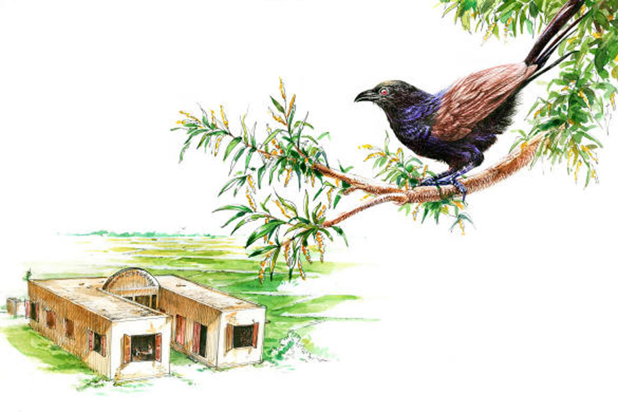

 
 <h1 align=center>বিজনবাস</h1>
<h2 align=center>কমলেশ কুমার</h2> উমাপদ মাস্টারমশাই দীর্ঘশ্বাস ফেললেন। পড়ানোর মাঝখানে অন্যমনস্ক হয়ে গেছেন সাময়িক। পল্টু, কানাই, শৌনকদের দিকে তাকিয়ে বললেন, “তোরা নিজেদের যতটা অসহায় ভাববি, অন্যেরা তোদের ততটাই দুর্বল করে দেওয়ার চেষ্টা করবে। নিজেদের শক্ত রাখতে হবে। লক্ষ্য অনুযায়ী এগিয়ে যেতে হবে।”

বৈশালী উঠে দাঁড়াল। ক্লাস টেনের ফার্স্ট গার্ল সে। পড়াশোনায় তুখোড়। অনবদ্য অভিনয়-দক্ষতা। ওরও আজ মনটা বিষণ্ণ। খবরটা শুনে থেকে ওর মনে শান্তি নেই।

উমাপদ স্যরের দিকে তাকিয়ে ধরা-ধরা গলায় বৈশালী বলল, “আমাদের এর পর কী হবে স্যর? সাত হাজারের উপর বাংলা মিডিয়াম স্কুল বন্ধ হয়ে যাচ্ছে এই রাজ্যে। আমরাও রয়েছি সেই তালিকায়। আমরা কি কিছুই করতে পারি না! বাংলা স্কুল মানেই কি খারাপ!”

গলায় আটকে থাকা কষ্টটা উমাপদ স্যর জোর করে গিলে নিলেন। প্রায় তিরিশ বছর ধরে তিনি এই বসন্তনগর কুমুদকুমারী হাই স্কুলে পড়াচ্ছেন। প্রথম দিকে প্রায় দু’হাজার ছাত্র ছিল এখানে। এখন তিয়াত্তর। তিন জন শিক্ষক। দু’জন শিক্ষিকা। প্রধান শিক্ষক উমাপদ চক্রবর্তীকে ধরে ছয়।

উমাপদ স্যর নিজেকে সামলে নিয়ে বললেন, “শুধু ভাষার ভিত্তিতে স্কুল ভাল বা খারাপ হয় না বৈশালী। বাংলা মাধ্যম স্কুলে পরিকাঠামোগত অসুবিধে আছে ঠিকই, কিন্তু লেখাপড়ার মান অন্য কোনও মাধ্যমের চেয়ে খারাপ নয়।”

“জানি স্যর,” শৌনক বলল, “আমাদের কুমুদকুমারী হাই স্কুলের কত প্রাক্তন ছাত্রছাত্রী দেশে-বিদেশে প্রতিষ্ঠিত। আপনার মুখেই শুনেছি, জার্মানি, ফ্রান্স, ইটালিতে এই স্কুলের অনেক ছাত্র বড় চাকরি করে।”

“সে সব দিন আজকের মতো আরামদায়ক ছিল না। মাথার উপরে ফ্যান ঘুরত না। পানীয় জল বলতে একটা টিউবওয়েল। একটু ঝড়বৃষ্টি হলেই কারেন্ট অফ হয়ে যেত। তিন দিন-চার দিন কারেন্ট আসত না। ছেলেমেয়েরা হ্যারিকেনের আলোয় লেখাপড়া করত।”

পাঞ্জাবির পকেট থেকে রুমাল বার করে মুখটা মুছতে মুছতে বললেন, “অধ্যয়নই ছাত্রদের তপস্যা— কথাটা যারা মেনে চলে, তারা এক দিন উন্নতি করে। জীবনে সংগ্রাম না থাকলে মানুষ এগোতে পারে না। খারাপ জিনিসগুলোই বেশি করে প্রলোভনের ফাঁদ তৈরি করে। সে সব বর্জন করে ভালটাকে গ্রহণ করতে হবে।”

উমাপদ স্যর জানলা দিয়ে বাইরে চোখ রাখলেন। দিগন্তপ্রসারিত মাঠে সবুজ ধানগাছ বৈশাখের তপ্ত দুপুরে দুলে-দুলে উঠছে। হাওয়ায় একটা গরম ভাব থাকলেও এই প্রাচীন স্কুলটির মোটা দেওয়াল ভেদ করে সূর্যের তাপ সে ভাবে ঢুকতে পারে না। একটা কুবোপাখি অনেক ক্ষণ ক্লাসরুমের বাইরের সোনাঝুরি গাছটার উপরে বসে ডেকেই চলেছে।

গতকাল খবরটা এসেছে স্কুলে। এত কম সংখ্যক ছাত্রছাত্রী নিয়ে কুমুদকুমারী স্কুল আগামী দিনে পথ চলতে পারবে না। বন্ধ করে দেওয়া হবে স্কুলটিকে। পাশের অধিক সংখ্যক ছাত্রছাত্রীবিশিষ্ট কোনও স্কুলে শিক্ষক-শিক্ষিকাদের বদলি করা হবে। 

উমাপদ স্যরের কাছে এই স্কুল মন্দিরের মতো। কোনও কোনও দিন নিজের হাতে বাথরুমও পরিষ্কার করেন। এই স্কুলের প্রতিটি ইট কাঠ পাথর স্যরের শরীরের অংশ।

নিজের মনেই বলে চললেন স্যর, “শয়ে শয়ে ছাত্রছাত্রী পাশ করে বেরিয়েছে এখান থেকে। তাদের আমরা খুব বকতাম, জানিস! পিঠে বেতের দাগ বসিয়ে দিতাম কারও কারও। তবুও কোনও অভিভাবক নালিশ জানাতে আসেননি কোনও দিন। ছেলেমেয়েদের মনেও অসন্তোষের লেশমাত্র ছিল না। আগের দিন যাকে মারতাম, পরের দিন তাকে পিঠে আদর করে হাত বুলিয়ে দিতাম।”

উমাপদ স্যরের গলাটা ধরে এল, “তাদেরই মধ্যে কেউ কেউ নর্থ ক্যারোলিনা, লুক্সেমবার্গ, বেলজিয়াম, নেদারল্যান্ডসে ছড়িয়ে আছে আজ। ভাষাটা কোনও অন্তরায় হতে পারে না। কোনও দিন হয়নি। তা হলে বসন্তনগরের ছেলেমেয়েরা বিদেশে তাদের জায়গা করে নিতে পারত না।”

স্পন্দন নামে ছেলেটি উঠে দাঁড়াল এ বার। কাঁদো কাঁদো মুখ করে বলল, “আমরা আমাদের সবটুকু দিয়ে পরিশ্রম করছি স্যর। যদি মাধ্যমিকে দারুণ ভাল রেজ়াল্ট করতে পারি, সরকার নিশ্চয়ই আমাদের স্কুলটার কথা বিবেচনা করবে!”

স্পন্দনের কথায় স্যর ম্লান হাসলেন। স্কুলের সর্বত্র তাঁর সজাগ দৃষ্টি। স্কুলের সামনে বিরাট কিচেন-গার্ডেন বানিয়েছেন তিনি। নানা আনাজপাতি নিয়মিত সেখানে উৎপন্ন হয়, তা দিয়ে মিড-ডে মিলের রান্না হয়। স্কুলের প্রতিটি দেওয়াল মহাপুরুষদের সংক্ষিপ্ত জীবনী আর উক্তি দিয়ে সাজানো।

স্পন্দনের দিকে তাকিয়ে উমাপদ স্যর বললেন, “আমরা মাতৃভাষার সঙ্গে ইংরেজির নিয়মিত চর্চা করিয়েছি ছেলেমেয়েদের। কিন্তু এখন ইংরেজি মাধ্যমে পড়াশোনার ঝোঁক বেড়েছে। বেসরকারি ইংরেজি স্কুল ফুলেফেঁপে উঠেছে। আমাদের মতো বাংলা মাধ্যম স্কুল ক্রমশ রুগ্ণ হয়ে পড়েছে। আমরাও হয়তো বিশ্বাসযোগ্যতা হারিয়েছি! পঠনপাঠনের মাধ্যমই যখন বদলে যাচ্ছে, তখন বাংলা ভাষা কী করে তার জমি ধরে রাখবে, বল?”

“আমরা যদি বাড়ি বাড়ি গিয়ে অভিভাবকদের সচেতন করি স্যর! এত সুন্দর করে পড়ান আপনারা, এত বড় খেলার মাঠ, মিড-ডে মিল, সরকারি প্রকল্প... এত কিছু ছেড়ে তারা যদি বেসরকারি স্কুলে না যায়, তা হলেই তো আবার আমাদের স্কুলে ছাত্রছাত্রীদের রমরমা হবে, তাই না স্যর?” বৈশালীর গলায় আগ্রহ। 

উমাপদ স্যর জানেন, এ এক কঠিন সময়। ক্লাস টেনের এই সব কিশোর-কিশোরীরা তাঁর মতামত, ব্যাখ্যা কিংবা মনোভাব কিছুই বুঝবে না। তবু আজ তাঁর চুপ থাকতে ইচ্ছে করছে না। বার বার আবেগপ্রবণ হয়ে পড়ছেন। কেমন যেন একটা চাপা কষ্টে শরীর তোলপাড় করে উঠছে। বার বার মনে হচ্ছে, বাংলা মাধ্যম স্কুল একটার পর একটা বন্ধ হয়ে যাচ্ছে, মানে বাংলার বাচ্চাদের অনুভূতি বা আবেগ প্রকাশের কণ্ঠ রোধ হয়ে যাচ্ছে। অভিব্যক্তির স্বতঃস্ফূর্ত প্রকাশ কি মাতৃভাষা ছাড়া সম্ভব!

“কিন্তু আমরা অভিভাবকদের কাছে কী করে পৌঁছব স্যর? কী বলব তাঁদের?” বড় উদ্বিগ্ন শোনাল শৌনকের গলা।

উমাপদ স্যর দেখলেন, অস্তিত্বের সঙ্কট মানুষকে কেমন এক ধাক্কায় বড় করে দেয়। ক্লাস টেনের ছাত্রছাত্রীরাও এক দিনে অনেক কিছু বুঝে গিয়েছে যেন। তারা তাদের স্কুলের অস্তিত্ব টিকিয়ে রাখতে বেপরোয়া হয়ে উঠেছে। তিনি ছাত্রছাত্রীদের শিখিয়েছেন, স্বপ্নপূরণই জীবনের একমাত্র লক্ষ্য নয়। আবার স্বপ্ন ছাড়া জীবন অর্থহীন।

বৈশালী দৃঢ় কণ্ঠে বলল, “আপনি আমাদের শিখিয়েছেন স্যর, চলার পথে বাধা আসতেই পারে, তা বলে থেমে যেতে নেই। আজ বসন্তনগর কুমুদকুমারী হাই স্কুল ইংরেজি মাধ্যম স্কুলের সঙ্গে পাল্লা দিয়ে পিছিয়ে পড়বে, ছাত্রসংখ্যা কমে যাওয়ার ফলে তার মৃত্যুঘণ্টা বেজে যাবে, আমরা জীবন থাকতে সেটা হতে দেব না স্যর। সেই ছোট্টবেলা থেকে এই স্কুলের হাত ধরেই আমাদের একটু একটু করে বেড়ে ওঠা, এই স্কুল আমরা বন্ধ হয়ে যেতে দেব না। আপনি বলুন আমরা কী ভাবে এগোতে পারি!”

উমাপদ স্যর গভীর ভাবে শ্বাস নিলেন এক বার। তিনি বিশ্বাস করেন, সাফল্যের ভিত্তিতে নয়, মানুষকে বিচার করতে হয় তার ব্যর্থতা এবং ব্যর্থতার পর ঘুরে দাঁড়ানোর ভিত্তিতে। অসংখ্য সফল ছাত্রছাত্রীকে তিনি আলোর সন্ধান দিয়েছেন এটাও যেমন সত্যি, আজ বাতাসের বেগে কমতে থাকা ছাত্রছাত্রীর জন্যই এই স্কুল বন্ধ হতে বসেছে, এটাও তেমনই সত্যি। এই ব্যর্থতার দায় তিনি এড়িয়ে যেতে পারেন না। কাগজে বেরোনোর পর থেকে আলোচনার কেন্দ্রবিন্দুতে চলে এসেছে এই স্কুল। হাটে-বাজারে চর্চার বিষয়বস্তু হয়ে উঠেছে কুমুদকুমারী হাই স্কুল আর তার প্রধান শিক্ষক উমাপদ চক্রবর্তী। এটা যে কত বড় যন্ত্রণার, উমাপদ স্যর কাউকে বোঝাতে পারবেন না।

“তোদের সাফল্যের ভিত্তিতেই এই স্কুলের গৌরব সূচিত হতে পারে,” বলে চললেন উমাপদ স্যর, “এমন কিছু করে দেখা, যেটা অন্যদের ধরাছোঁয়ার বাইরে। আমি জানি তোরা সেটা পারবি।” একটু থেমে স্যর বললেন, “আগামী মাসের পনেরো তারিখ আমাদের বার্ষিক সাংস্কৃতিক অনুষ্ঠান। আমাদের স্কুলের এই অনুষ্ঠানের সুনাম সারা জেলা জুড়ে। আমন্ত্রিত হয়ে আসবেন বহু সরকারি আধিকারিক। উপস্থিত থাকবেন এলাকার বহু মানুষ। তাঁদের সামনে অসাধারণ কিছু করে দেখা তোরা।”

“আমাদের প্রমাণ করে দিতে হবে স্যর, আমরা পরিশ্রমী, তাই কারও সহানুভূতির প্রত্যাশী নই। ভাষার জন্য একটি স্কুল বন্ধ হয়ে যেতে পারে না,” বলে চলল বৈশালী, “আমরা মাধ্যমিক পরীক্ষায় খুব ভাল রেজ়াল্ট করতে মরিয়া স্যর। আর স্কুলের সাংস্কৃতিক অনুষ্ঠানে ‘ওথেলো’ নাটকটা মঞ্চস্থ করব বলে ঠিক করেছি। আমরা রবীন্দ্রনাথ ঠাকুর থেকে বাংলার আধুনিক কবিদের কবিতাও যেমন আবৃত্তি করব, তেমনই আমরা ওয়ার্ডসওয়ার্থ, ব্লেক, কিটস, কোলরিজ-এর কবিতাও আবৃত্তি করব। অনুষ্ঠানের একটা বড় অংশ জুড়ে থাকবে ইংরেজি ভাষার নাটক, কবিতা, নিজেদের লেখা প্রবন্ধ পাঠ। আমরা দেখিয়ে দেব, ইংরেজি মাধ্যম স্কুলের চেয়ে আমরা কোনও অংশে কম যাই না। তাতে হয়তো অনেক অভিভাবকও তাঁদের ছেলেমেয়েদের আমাদের স্কুলে ভর্তি করতে আগ্রহী হবেন। আমরা প্রমাণ করব, ভাষা কখনও মানুষের প্রতিবন্ধক হতে পারে না...”

আরও অনেক কথা বলে চলল বৈশালী। উমাপদ স্যর দেখতে পাচ্ছেন, তাঁর চোখের সামনে ক্লাস টেনের ছেলেমেয়েরা কত কিছু আলোচনা করে চলেছে, এক ঝাঁক উজ্জ্বল পায়রার মতো তারা ডানা ঝাপটাতে শুরু করেছে আগামীর অন্তহীন ভবিষ্যতের দিকে। অবহেলিত বাংলা ভাষার জন্য আজকের প্রজন্মের গুটিকয়েক ছেলেমেয়ে গাঢ় কুয়াশা থেকে উঠে এসে এক অদ্ভুত মায়াপৃথিবী রচনা করতে চাইছে যেন। ভবিষ্যতের কথা কেউ জানে না। কিন্তু ঘুরে দাঁড়ানোর এই লড়াই বদলে দিতে পারে অনেক কিছু। যদি কিছু না-ও হয়, এটুকু তো সান্ত্বনা থাকবে যে, সকলে সাধ্যমতো চেষ্টা করেছিল!

স্কুল উঠে যাওয়ার পূর্বাভাস যদি কালো মেঘ হয়, সামনে ছাত্রছাত্রীদের দৃঢ়প্রতিজ্ঞ মুখে রুপোলি রোদের রেখা দেখতে পাচ্ছিলেন মাস্টারমশাই।