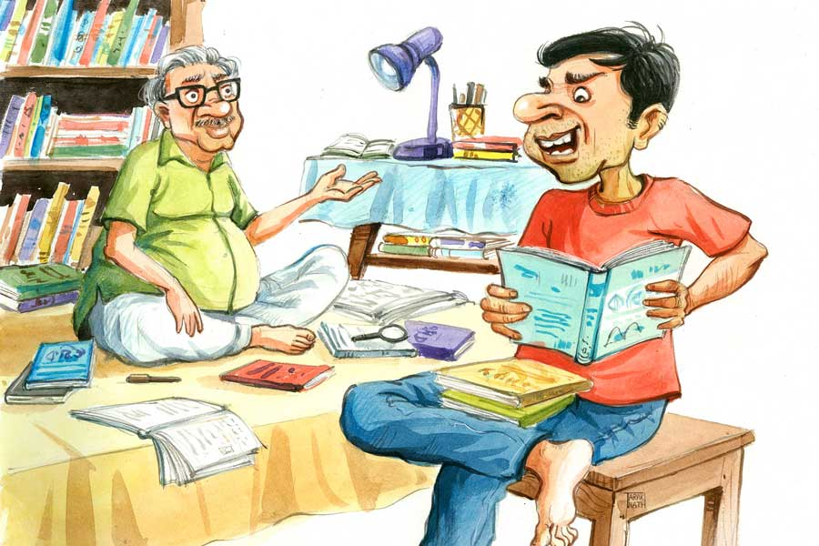

 
 <h1 align=center>বিজয়মাল্যর দিগ্বিজয়</h1>
<h2 align=center>দেবপ্রিয়া সরকার</h2> কাল অনেক রাত পর্যন্ত সাহিত্য উৎসবের ব্যানার, ফেস্টুন টাঙিয়ে, বাড়ি ফিরতে দেরি হয়ে গিয়েছিল ভজার, মানে জয়পুর শহরের উঠতি কবি ভজহরি ভট্চাজের। দাপুটে সাহিত্যিক সুকোমল সিংহের ডান হাত ভজা। এ বছরেরর সাহিত্য উৎসবের আহ্বায়ক এবং আয়োজক, দুটোই সুকোমল সিংহের ‘সবজান্তা সাহিত্যগোষ্ঠী’। তাই অনেক দায়িত্ব ভজার কাঁধে। লেখাপড়ায় ভাটা পড়েছে ইদানীং। তার উপর বাবা-মায়ের চাকরির খোঁটা, প্রেমিকা মল্লিকার ফ্যাঁচফ্যাঁচ হজম করে মনটা তেতো হয়ে আছে ভীষণ। সুকোমল সিংহ প্রভাবশালী মানুষ, তিনি কথা দিয়েছেন সাহিত্য উৎসব মিটে গেলেই তাঁর বাল্যবন্ধু ননীগোপাল নিয়োগীর মুরগির ফার্মে ভজাকে একটা কাজের ব্যবস্থা করে দেবেন। ভজা পাতি পাস গ্র্যাজুয়েট। কোট, টাই পরে মাল্টিন্যাশনাল কোম্পানির কেউকেটা হওয়ার স্বপ্ন ভজা দেখে না। আপাতত মাস গেলে মায়ের হাতে কিছু টাকা দিতে পারলেই সে খুশি। সুকোমলদা, নরেনদা, চপলকাকুর মতো বাঘা বাঘা সাহিত্যবোদ্ধারা ভজার কবিতার হেব্বি তারিফ করেন। তাই ভজা ভাবে এক বার যদি সাহিত্যজগতের মাটিতে ঝান্ডা গাড়তে পারে, তা হলে এ সব মুরগি ফার্ম-টার্মের চাকরিকে তুড়ি মেরে উড়িয়ে সটান হাজির হবে মল্লিকার জাঁদরেল বাপ তারাপদ তালুকদারের কাছে, আর শাহরুখ খানের স্টাইলে তার সামনে থেকে তুলে নিয়ে যাবে মল্লিকাকে। তারাপদ বিস্ফারিত চোখে অমরীশ পুরীর মতো চেয়ে থাকবে শুধু!

“ভজা আছিস না কি? এই ভজা!”

চপলকাকুর গলার স্বর শুনে ধড়মড় করে বিছানা ছেড়ে উঠে পড়ল ভজা। সবজান্তা সাহিত্যগোষ্ঠীর কোষাধ্যক্ষ চপল চক্কোত্তি, শহরের সিনিয়র সাহিত্যিক। আজকাল বহু আনকোরা কবি-লেখক দু’-চারটে কবিতা, গপ্প লিখেই অনেক বেশি প্রচারের আলোয় চলে আসছে। তাই শেষ বয়সে এসে কিছুটা মুষড়ে থাকেন চপলকাকু। এহেন চপল চক্কোত্তির এই সাতসকালে আগমনে অবাক হল ভজা। গায়ে স্যান্ডো গেঞ্জি গলাতে গলাতে জিজ্ঞেস করল, “কী হয়েছে চপলকাকু? কোনও সমস্যা?”

চপল চক্কোত্তি ভজার বাবার আরামকেদারায় শরীর ছেড়ে দিয়ে অস্ফুটে বললেন, “সমস্যা কি আর একটা রে ভজা? জীবনটাই একটা জলজ্যান্ত সমস্যার ডিপো।”

“তা কোন সমস্যার কারণে তুমি আমার বাড়িতে এলে সেটা আগে খোলসা করো।”

“বলছি রে বলছি, আগে এট্টুখানি গলাটা ভিজোতে দে।”

ভজার মা চা দিয়ে যেতে সুড়ুত করে চায়ের কাপে চুমুক দিয়ে চপল চক্কোত্তি বললেন, “ব্যাপারটা খুব জটিল, বুঝলি। ওই সাহিত্য উৎসবের স্পনসর সংক্রান্ত। সেই যে বিজয়মাল্যবাবু...ওঁকে চিনিস তো?”

“বিজয়মাল্য! ওকে কে না চেনে? বিরাট মালদার। এখন কী সব টাকাপয়সার ঘাপলা করে শুনেছি দেশত্যাগী হয়েছে। কিন্তু সে জয়পুর লিট ফেস্টে টাকা দিতে যাবে কেন? সাহিত্যের সহিত ওঁয়াদের কী?”

“ওরে গর্দভ! আমি বলছি সরকারি অফিসার বিজয়মাল্য ব্যানার্জির কথা।”

“বিজয়মাল্য দ্য পোয়েট, মাইক্রো স্টোরি রাইটার! কালই দেখলাম নতুন বই নিয়ে দাঁত-কেলানো ছবি দিয়েছে ফেসবুকে। এই নিয়ে সতেরো নম্বর বই বেরোল লোকটার। ওর ওই বিটকেল পদ্য আর ন্যাকা-বোকা পরকীয়া কেউ পড়ে?”

“ওরে ভজা, তুই সেই বোকাই রইলি। কানাকে কানা, খোঁড়াকে খোঁড়া কি বলতে আছে? শোন, বিজয়মাল্যর বই বিক্রিতে আমাদের কী এসে যায়? ও হল সোনার ডিম পাড়া মুরগি। লিট ফেস্টের জন্য বেশ কিছু স্পনসর জোগাড় করে দেবে বলেছে। চাঁদাও দেবে মোটা অঙ্কের। তবে আজকাল বিজয়মাল্যর মুডটা বিগড়ে আছে। একটা বেয়াড়া সমস্যা তাড়া করে বেড়াচ্ছে ওকে। শেষকালে আবার কথার খেলাপ না করে, তা হলে আমাদের সাহিত্য উৎসবের বাজেটে কাটছাঁট করতে হবে অনেকটা। তাই তো তোর কাছে ছুটে এলাম।”

“আমি কী করতে পারি?”

“খুব সহজ কাজ, বিজয়মাল্যর সমস্যার সমাধান বাতলে দে।”

“একটু ঝেড়ে কাশো। বিজয়মাল্য আর সমস্যার ডিটেল বলো।”

“শোন, বিজয়মাল্য ব্যানার্জি মোটা মাইনের সরকারি আমলা। শহরের এলিট পাড়ায় ঝাঁচকচকে বাড়ি, লেটেস্ট মডেলের গাড়ি, জিম-পার্লারে নিত্য যাতায়াত করা জ়িরো ফিগারের বৌ, পটাপট ইংলিশ বলা বাচ্চা...কী নেই ওর? তবু মনে মনে ভারী অসুখী বিজয়মাল্য।”

“কেন? শালা সোনার চামচে মুখে নিয়ে জন্মেছে, তবুও সুখ নেই? আমার মতো বেকার ভাতার লাইনে দাঁড়ানো পাবলিক হলে বুঝত কত ধানে কত চাল!”

“বিজয়মাল্যর অসুখের কারণ ওর সাহিত্যপ্রীতি। বিজয়মাল্যর হঠাৎ সাধ জেগেছে সাহিত্যিক হওয়ার।”

“এ আর কী সমস্যা! একটু-আধটু বাংলা আর কারেন্ট অ্যাফেয়ার্স জানলেই আজকাল আধুনিক কবি থেকে রহস্য রোমাঞ্চ লেখক, যা খুশি হওয়া যায়। আজকাল তো সবাই লেখক। পাঠক আর কোথায়!”

“এত সোজা নয়। সম্পাদক-প্রকাশকদের সঙ্গে ভাল সম্পর্ক এবং ডোনেশনের জন্য প্রচুর কাগজে বিজয়মাল্যর লেখা ছাপা হয় ঠিকই, কিন্তু জনপ্রিয়তায় সে শশাঙ্কশেখরের ধারে-কাছেও আসে না।”

“যাহ্! কেসটা তো বিজয়মাল্য ব্যানার্জির, এর মধ্যে আবার শশাঙ্কশেখর শাসমল কোত্থেকে এল?”

একটা ফিচেল হাসি হাসলেন চপল চক্কোত্তি। বললেন, “গল্পের টুইস্টটা তো এখানেই। শশাঙ্কশেখর হল বিজয়মাল্যর লতায়-পাতায় আত্মীয়। ওর দিদির দেওরের সম্বন্ধীর ভায়রাভাই। শশাঙ্কশেখরের জনপ্রিয়তার কাছে প্রতি মুহূর্তে হেরে যাচ্ছে বিজয়মাল্য আর মাথা হেঁট হচ্ছে দিদির। তার ওপর সুকোমল এ বারের ‘সবজান্তা সাহিত্য সম্মান’ দিতে চলেছে শশাঙ্ককে। এই সংবাদ পাওয়ার পর থেকে বিজয়মাল্য স্পনসর জোগাড়, টাকাপয়সা, বিজ্ঞাপন সমস্ত দিক থেকেই গাঁইগুঁই শুরু করেছে। যে হেতু ঘোষণা হয়ে গিয়েছে তাই পুরস্কার প্রাপকের নাম সুকোমল বদলাতে পারছে না, আবার বিজয়মাল্যকে চটালেও মুশকিল! রীতিমতো ধর্মসঙ্কট!”

এত ক্ষণে ঘটনা ভজার মগজে ঢুকেছে। সে মাথা চুলকে বলল, “শশাঙ্কশেখরকে কাটানো যায় না?”

“উঁহু। ওর ফ্যান বেস প্রচুর! নামীদামি প্রকাশক-সম্পাদকের সঙ্গে দহরম মহরম। কোনও কারণ ছাড়া ওকে বাদ দিলে বিস্তর জলঘোলা হবে। সবজান্তা সাহিত্যগোষ্ঠীর নিরপেক্ষতা নিয়ে প্রশ্ন উঠবে। সুকোমলের পিছনেও পড়ে যাবে লোকজন। বঙ্গবাজারের লেখকদের তো চিনিস, টোয়েন্টি পার্সেন্টের হাতে কলম, এইট্টি পার্সেন্টের হাতে কাঠি।”

“সুকোমলদা কী বলছে?”

“আর সুকোমল! সে কাল থেকে আমাশার যন্ত্রণায় কুপোকাত। গুনে গুনে একুশ বার বড় বাইরে গিয়ে এখন ঘরে শুয়ে স্যালাইন টানছে। তুই ইয়ং ব্লাড। তোদের ব্রেন এখনও অনেক শার্প, তাই তোর সঙ্গেই পরামর্শ করতে এলাম।”

একটা লম্বা শ্বাস ছেড়ে বললেন চপলকাকু। ভজা ভুরু কুঁচকে ভাবল কিছু ক্ষণ। তার পর বলল, “আসল প্রবলেম ওই শশাঙ্কশেখর। ওকে রাস্তা থেকে সরিয়ে দিলেই কেল্লাফতে।”

“একদম ঠিক পয়েন্ট ধরেছিস। ব্যাটা দু’-চারটে নামী পত্রিকায় লিখল কী লিখল না, সকলে একেবারে মাথায় তুলে নাচতে লেগেছে আর আমি চল্লিশ বছর ধরে কলম পিষছি তবুও লোকে খোঁজ রাখে না! ছোঃ!”

ভজা মুচকি হাসল। বুড়ো চপলের শশাঙ্কশেখরকে নিয়ে জ্বালাটার আঁচ পেয়েছে সে।

“মালটা কি নেশাটেশা করে? মদ, গাঁজা, আফিম? মেয়েছেলের লাফড়া আছে কোনও? ওই কী বলে এক্সট্রাম্যারিটাল-ট্যারিটাল?”

“নাহ্, কোনও নেশা তেমন শশাঙ্কশেখরের আছে বলে তো শুনিনি কখনও। সে খুবই ছাপোষা স্ত্রৈণ বলেই পরিচিত। এই নিয়ে হাসি-ঠাট্টা হয় হামেশাই।”

“তা হলে? কোনও স্ক্যান্ডেল ফ্যান্ডেলে জড়াতে পারলে কাজটা সহজ হত। এই সামান্য কারণে মার্ডারের সুপারি তো আর দিতে পারি না! তা ছাড়া লোকটা লেখে ভাল। ওর কবিতা আমি পড়েছি বেশ কিছু।”

“বিপদের সময় শত্রুভজনা করিসনি রে ভজা! সমাধানের উপায় ভাব। উৎসব শুরু হতে আর মাত্র দু’দিন বাকি।”

হঠাৎ ভজার মাথায় বিদ্যুৎ খেলে গেল। শশাঙ্কশেখরের কবিতার সমালোচনা পড়তে গিয়ে এক বার দেখেছিল, সমালোচক লিখেছিলেন ওঁর কবিতায় নাকি কবি কিঙ্কর কীর্তনীয়ার প্রভাব আছে। যদি কিঙ্কর আর শশাঙ্কের লেখায় কিছু মিল খুঁজে পাওয়া যায়, তবে অনায়াসেই শশাঙ্ককে লেখা চুরির দায়ে ফাঁসানো যাবে। অসাধু লেখককে পুরস্কার দেওয়ার প্রশ্নই আসে না। সুতরাং এক ওষুধে শশাঙ্কর ঘুড়ি কেটে যাবে, ও দিকে বিজয়মাল্য আরও বেশি পয়সা ঢালবে উৎসবে। ভজা তার ফন্দিটা চপলকাকুকে বলার সঙ্গে সঙ্গেই উত্তেজনায় লাফিয়ে ওঠেন তিনি। খুশিতে ডগমগ ভজা বলে, “আমায় একটা দিন সময় দাও চপলকাকু, এর মধ্যেই আমি সব কাজ সেরে ফেলব। তুমি শুধু আমাকে বিজয়মাল্যর ফোন নম্বরটা দিয়ে যেয়ো। আমি এক বার সিধুজ্যাঠার বাড়ি থেকে ঘুরে আসি।”

“সিধুজ্যাঠা! সেটা আবার কে?”

হেসে উঠে ভজা বলে, “আরে ফেলু মিত্তিরের যেমন সিধু জ্যাঠা ছিলেন জ্ঞানের সাগর, তেমনই আমাদেরও আছে এক জন তথ্যের গোডাউন। মুরাকামি থেকে মুকুন্দ দাস সব ওর ঠোঁটস্থ। শ্রীমানের নাম পরিতোষ পোদ্দার। আমরা মজা করে ওকে সিধুজ্যাঠা বলে ডাকি।”

চপল চক্কোত্তিকে বিদায় দিয়ে স্নানখাওয়া সেরে ভজা রওনা দিল পরিতোষের বাড়ির উদ্দেশে। আগেই ফোনে কথা হয়ে গিয়েছিল, তাই পরিতোষ গোটাদশেক বই নিয়ে বসেছিল খাটের ওপরে। কিঙ্কর কীর্তনীয়ার কবিতার সঙ্গে মিলিয়ে দেখছিল শশাঙ্কশেখরের পদ্য। বিস্তর খাটুনির পর অবশেষে উদ্দেশ্য সিদ্ধি হল দু’জনের। কিঙ্করের একটা কবিতার সঙ্গে শশাঙ্কের একটা লেখার ভাষাগত মিল চোখে পড়ল। পাক্কা পৌনে পাঁচখানা শব্দ হুবহু এক! ভজা ‘ইউরেকা!’ বলে চেঁচিয়ে উঠল।

রাতে বাড়ি এসে একখানা ফেসবুক পোস্ট করল শশাঙ্কশেখরের মুন্ডুপাত করে। হ্যাশট্যাগ দিল, “শশাঙ্কশেখর নামটি বড়/ চুরি তুমিও করতে পারো?” ব্যস কাম তামাম। এ বার বাকি শুধু পোস্টটা ভাইরাল করা। বিজয়মাল্য প্রথমে শেয়ার করতে আপত্তি করছিল। হাজার হোক শশাঙ্ক তার আত্মীয়। তার পর ভজাই তাকে ফেক প্রোফাইল খুলে পোস্টটা শেয়ার করার সহজ সমাধান শেখাল।

যেমন ভাবনা তেমন কাজ। ‘সমুদ্র গুপ্ত’ নামে এক ফেসবুক প্রোফাইল থেকে মুহূর্তের মধ্যে কয়েকশো কবি, সাহিত্যিক, সম্পাদক, পাঠকের কাছে পৌঁছে গেল শশাঙ্কশেখরের কুকীর্তির খবর। চপল চক্কোত্তির আশঙ্কা ছিল আদৌ ভজার টোটকা কাজ করবে কিনা! ভজা ফোনে প্রত্যয়ী স্বরে বলল, “চপলকাকু, ভজহরি ভট্চাজ অত কাঁচা কাজ করে না। আজকাল লোকে শুধু ট্যাগলাইন পড়েই ভালমন্দের বিচার করে। ভেতরের জিনিস তলিয়ে দেখার সময় কারও নেই। সব পরের মুখে ঝাল-খাওয়া সাহিত্যবোদ্ধা। এটা ফেসবুক পোস্ট নয়, বোমার ফর্মুলা। দেখবে কাল কেমন আরডিএক্সের মতো বিস্ফোরণ ঘটায়।”

যথারীতি পরদিন সকাল থেকেই ফোন, মেসেজের বন্যায় ভেসে গেলেন সুকোমল, চপলরা। ভজার কপালেও বাহবা জুটল এমন এক জন ভণ্ড সাহিত্যিকের মুখোশ খুলে দেওয়ার জন্যে। প্রত্যাশা মতোই জমে উঠল সবজান্তার সাহিত্য উৎসব। মঞ্চ থেকে গ্যালারি, সাহিত্যসাধক থেকে বইপ্রেমী সকলের জটলায় শুধুই একটা আলোচনা, শশাঙ্কশেখরের পদ্য চুরি। মিটিংয়ে বসল সবজান্তা কমিটি। কুম্ভীলক বৃত্তিকে প্রশ্রয় দিতে নারাজ তাঁরা। কোনও অসাধু কবিকে সম্মাননা প্রদান নৈব নৈব চ। নতুন সম্মাননা প্রাপক হিসেবে চপল চক্কোত্তি প্রস্তাব করলেন বিজয়মাল্য ব্যানার্জির নাম। কিছুটা দ্বিধা থাকলেও শেষমেশ কমিটি মেনে নিল প্রস্তাব।

দর্শকাসনের সামনের সারিতে হাসি হাসি মুখে বসেছিলেন রুক্মিণী রক্ষিত। চপল চক্কোত্তি ভজাকে কনুই দিয়ে ঠেলে বললেন, “রুক্মিণীকে দেখেছিস? কেমন গ্ল্যামার বেড়েছে ইদানীং! আজকাল শশাঙ্কর পরেই ওর কবিতা। নেক্সট টার্গেটকে চিনে রাখ।”

ভজা আড়চোখে দেখে নিল রুক্মিণীকে। মঞ্চে তখন দিগ্বিজয়ী বীরের মতো দাঁড়িয়ে আছে বিজয়মাল্য, হাতে জ্বলজ্বল করছে সবজান্তার সোনালি মেমেন্টো।