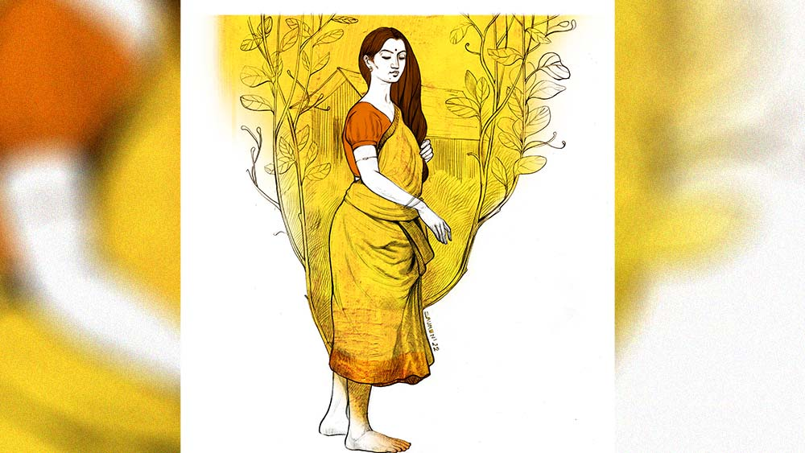

 
 <h1 align=center>বিদ্যাসাগরের বৌ</h1>
<h2 align=center>কিশলয় জানা</h2> সক্কাল সক্কাল হেমাঙ্গিনীর মেজাজ খারাপ হয়ে গেল।

হবে না-ই বা কেন? সকালবেলা তার হাজার একটা কাজ। সেই কোন কাকভোরে উঠে ঘরদোর ঝাঁট দেওয়া, গোবরছড়া দিয়ে উঠোন নিকোনো, তার পর গোয়ালের গরু দুটোকে খড়-জাবনা মেখে দেওয়া, কাঁথাকানিগুলো বার করে এনে রোদে ফেলা— তার পর স্নান সেরে রান্নাশালে ঢোকা। বাবুর আবার সকালবেলায় দু’বার চা চাই। শখের শেষ নেই, অথচ ভাঁড়ে মা ভবানী। কোনও রকমে চা আর মুড়ি বাড়িয়ে দিয়ে তাকে আনাজের খেতে ছুটতে হয়। নিমাই যখন ছিল, তখন তাকেই পাঠাত হেমাঙ্গিনী ঠেলেঠুলে। তা সে কি যেতে চাইত? জোয়ান ছেলে পড়ে পড়ে ঘুমোবে বেলা দশটা অবধি। গাঁয়ের কোন ছেলে এমন করে? কতই না বলেছে হেমাঙ্গিনী, “তোরে দেখছি বাবুয়ানায় ধরেছে! শহুরে বাবুদের মতো বেলা দশটায় উঠে আমার কোন সগ্গে বাতি দিবি তুই ? হ্যাঁ রে!”

ঘুমচোখে নিমাই রাগ করত, “মেলা ফ্যাচফ্যাচ কোরো না তো! দিলে ঘুমটা মাটি করে! কী সুন্দর ক্যাটরিনার সঙ্গে পেরেম করছি, তা সহ্য হল না তোমার।”

রাগে দুম দুম করে পা ফেলে পুকুরঘাটে মুখ ধুতে চলে যেত সে।

সামান্য যে দু’-চার কাঠা জমি আছে, তাতে ধানের সময় ধান বোনা, অন্য সময় সরষে, বেগুন এই সব লাগায় হেমাঙ্গিনী। উঠোনের বেড়ার গায়ে গায়ে নিজের হাতে কোদাল দিয়ে জমি তৈরি করে তাতে বোনে শাক-পাতা, হলুদ, ধনে-মৌরি। চালে লকলকিয়ে বাড়ছে কুমড়ো আর পুঁই। পাশে দু’খানা নারকেল গাছ। আর পেঁপে গাছও কয়েকটা। কলাঝাড়ও আছে কিছু, তবে সে খিড়কি পুকুরের ধারে। নিমাই বেঁচে থাকতে এক বার গঞ্জের হাট থেকে আখ এনেছিল, তারই আগাখানা পুঁতে দিয়েছিল সে। দু’বছরে বেশ সতেজ হয়ে উঠেছে। ভাল জাত। গাঁটে গাঁটে রস। কিন্তু খেতে আর পারে না নিজে। ও দিকে তাকালেই হু হু করে ওঠে বুকের ভিতরটা। ছেলেটাকে যে কোন নিশিতে টেনে নিয়ে গিয়েছিল কে জানে! না হলে রেতের বেলা রেলের লাইনের ধারে কী করতে গিয়েছিল সে! জানত না, রেতের মেল ট্রেনগুলান কাউকে দেখে থামে না! নিজের খেয়ালে ছুটে চলে। সক্কালবেলা গাঁয়ের ছেলেরা যখন খবর নিয়ে এল, হেমাঙ্গিনী শুনেই অজ্ঞান হয়ে পড়েছিল।

কিন্তু এ সংসারে অজ্ঞান হয়ে থাকলে কি আর চলে? লোকটা ফ্যালফ্যাল করে চেয়ে বসেছিল মাথায় হাত দিয়ে। পুত্রশোক বলে কথা! হেমাঙ্গিনী সামলে নিয়ে বলেছিল, “ওঠো, যেতে হবে তো। পুলিশবাবুদের কাচ থেকে নিমাইরে না আনলে তার কাজ হবে কী করে?”

লোকটা কাঁচুমাচু ভঙ্গিতে বলেছিল, “এ কী কাণ্ডি ঘটাল ছেলেটা বল দিনি! এই ভাবে এ বয়সে বাপ-মাকে শোকতাপে ফেলতে হয়? বুদ্ধিশুদ্ধি তো হল না আর। কত করে বললাম, পড় পড়, লেখাপড়া না করলে কি আর জ্ঞান পাকে? তা কে শোনে কার কথা? তিন-তিন বার মাধ্যমিক ফেল করে লেখাপড়ায় জলাঞ্জলি দিয়ে মদ-জুয়া ধরল। কী পেলি তাতে? সেই তো নেশার ঘোরে লাইনে কাটা পড়ে মরলি!”

হেমাঙ্গিনী এত শোকতাপের মাঝেও বিরক্ত হয়েছিল, বলেছিল, “এ সব কথা এখন বোলো না! তা ছাড়া কাল তো নিমাই ঘরেই শুয়ে ছিল। আমি দেখেচি। খাবার পরে দেখলাম বিড়ি নিয়ে পিছনবাগে গেল। তুমি তখন দাওয়ায় বসে বই পড়ছিলে। তোমার সামনে তো সে খায় নে। আবার আমি তাকে মানা করেচি বলে ঘরের মধ্যেও খেতে পারে নে। তার পর কী যে হল! চল, যেতি হবে। ভাগ্যে এই ছিল। ছেলের মুখে আগুন দেওয়া।”

দীর্ঘনিঃশ্বাস ফেলে ডুকরে কেঁদে উঠেছিল হেমাঙ্গিনী।

লোকটা আরও বিব্রত হয়ে বলল, “কেঁদো না হেম, কাঁদলে কি আর নিমাই ফিরে আসবে? তার চেয়ে চলো, যাই। দেখি, কী কত্তে হবে!”

ছেলেরা অপেক্ষা করছিল, নিমাইয়েরই সঙ্গীসাথী সব। সঙ্গে গাঁয়ের মাতব্বর কিছু। তাদের এক জন বলল, “সঙ্গে কিছু মালকড়ি নিয়ে চলো বিদ্যাসাগর। পুলিশবাবুদের টাকা না দিলে বডি ছাড়বেনি!”

“টাকা? টাকা কোথায় পাব?” অসহায়ের মতো হেমাঙ্গিনীর দিকে তাকিয়েছে বিদ্যাসাগর, “আছে কিছু তোমার কাছে হেম?”

অনেক কষ্টে হেমাঙ্গিনী জমিয়েছিল ধান বেচা, কলা-মুলো বেচা কিছু টাকা। তাই নিয়েছিল সঙ্গে। আর কী নেবে সে? বিয়ের সময় হাতে-গলায় আর কানে সোনা নিয়ে এসেছিল। হাত আর গলা বহু আগেই খালি হয়েছে, আছে শুধু কানে ফিঙফিঙে এক জোড়া রিং— ওটুকুই কেবল বাঁচাতে পেরেছে অভাবের সংসারে। তা-ও বুঝি যেতে বসেছে। কিন্তু সে আর কী করবে? লোকটার যদি একটুকুও হুঁশ থাকে!

সাধে কি সে গাল পাড়ে যখন তখন? তার বাপ লেখাপড়া জানত না। তার দাদারাও লেখাপড়ার ধারে কাছে ঘেঁষল না। প্রাথমিক বিদ্যালয় অবৈতনিক হলেও তাদের তাতে বয়েই গেল! হেমাঙ্গিনী অবশ্য ক্লাস থ্রি পর্যন্ত পড়েছিল। তাতেই তার বাপ বলত, “আমার একটাই ইচ্ছে ছিল, মেয়ের জন্য যে জামাই আনব, সে যেন শিক্ষিত হয়। আমাদের মতো গোমুখ্যু না হয়ে থাকে। মেয়েকে লেখাপড়া শিখিয়েছি, জামাইকে তার চেয়ে বেশি লেখাপড়া কত্তে হবে।” সম্বন্ধটা আনার পরে বলেছিল, “তা এই যতীন ছেলেটি সামান্য নয়, একেবারে কলেজ পাশ দিয়েছে! নেহাত গরিব ঘরের ছেলে। কিন্তু নিজের বুদ্ধির জোরে জলপানি পেয়ে কলেজ পাশ করেছে। ওদের দাবিদাওয়া নেই কিছু। কেবল ছেলের মা অসুস্থ, তার দেখাশোনা, রান্নাবান্না এ সবের ভার নিতে হবে। বাকি নির্ঝঞ্ঝাট পরিবার। মেয়ে আমাদের সুখেই থাকবে।”

মা গাঁইগুঁই করেছিল একটু, “ছেলে যে কামকাজ কিছু করে না গো। নিকষ্যি বেকার!”

বাবা বিরক্ত হয়ে বলেছিল, “থামো দিনি। কলেজ পাশ ছেলে, কত দিন বেকার থাকবে? চাকরি নিজের পায়ে হেঁটে বাড়ি বয়ে আসবে। ভাবতে পাচ্চ, আমাদের মতো পরিবারের মেয়ে কি না মাস্টারের ঘরের বৌ হবে! কত পুন্যি করলে এমনটা হয় বলো তো? বিদ্যাসাগরের মতো জামাই কি আর জুটবে কখনও? এখন চাকরি করে না তো কী হয়েছে, যখন করবে তখন আরও দশটা চাকরি তোমার জামাইয়ের পায়ে পায়ে ঘুরবে!”

যতীনের পায়ে পায়ে দশটা কেন, একটাও চাকরি ঘোরেনি। কোনও চাকরিই নিজে এসে তার বাড়ির দরজায় ঘা দেয়নি। দেবে কেন? তার কি টাকা আছে? মাস্টারের চাকরি কি অতই সোজা? ছেলের হাতের মোয়া? সব জায়গায় এক কথা, ফেলো কড়ি মাখো তেল। লাখো লাখো টাকা দিয়ে সম্মান কেনার লোকের যেমন অভাব নেই, তেমনই অভাব নেই নেতা মন্ত্রী সান্ত্রীর ছেলেমেয়েদেরও। ফলে চাকরি পড়ে থাকছে না, সে চাকরির পরীক্ষা হোক ছাই না হোক। স্কুলে স্কুলে ঘুরে আর নিজের বায়োডেটা জমা দিয়ে দিয়ে রোজ যতীন ক্লান্ত মুখে ফিরে আসত। প্রথম প্রথম দিনের শেষে স্বামীর অভুক্ত চেহারার দিকে তাকিয়ে হেমাঙ্গিনী মনে মনে ভাবত, আজ না হয়েছে তো কী হয়েছে! কাল ঠিক হবে।

বৃথা আশায় থেকে থেকে শেষ পর্যন্ত যখন চাকরি পাওয়ার বয়স পেরিয়ে গেল, তখন যতীনের মা মারা গেছেন, নিমাই বড় হয়েছে, হেমাঙ্গিনী আরও শীর্ণ হয়েছে, কণ্ঠার হাড় বেরিয়ে পড়েছে। লজ্জায় সে আর বাপের বাড়ি অবধি যায় না। অবশ্য বাপ-মা গত হওয়ার পর থেকে দাদাদের দিক থেকেও আর বেকার বোন-ভগ্নীপতিকে বাড়িতে ডাকার কোনও গরজ নেই। যতীন কোনও রকমে গঞ্জের সুবল সাহার দোকানে খাতা লেখার কাজ পেয়েছিল। সামান্য মাইনে, গাধার খাটুনি। সুবলের বিশাল ধান-চাল-মশলাপাতির আড়ত। কেরোসিনের ডিলার। একটা ওষুধের দোকানও আছে হেলথ সেন্টারের লাগোয়া জমিতে। তা তার কী দয়া হয়েছিল, সে যতীনকে কাজটা দিয়েছিল। কিন্তু কথায় বলে, কপালে নেইকো ঘি, ঠকঠকালে হবে কী? সে চাকরিও তার গেল।    

সুবল সাহার নাতি কলকাতায় থাকে। সেখানে কলেজে পড়ে। চকরাবকরা জামা, জিন্স, হাতে দামি মোবাইল। রকমসকমই আলাদা। সে তার বন্ধুদের সঙ্গে করে গ্রামের বাড়িতে বেড়াতে নিয়ে এসেছিল। তা দুপুরবেলা দোকানের গায়ে বসে সে নাকি তার ইংরেজি বিদ্যা জাহির করছিল। যতীন ছাড়া দোকানের অন্যান্য কর্মচারী সব মুগ্ধ হয়ে তাকিয়েছিল তার দিকে। যতীনের মুগ্ধ না হওয়ার কারণ, ছেলেটির ভুলভাল ইংরেজি। সে গোড়ায় চোখ-কান বুজেই ছিল। কিন্তু শেষে আর থাকতে পারেনি, ভুল ধরিয়ে দিয়ে বলেছে, “তুমি বাবা ন্যারেশন আর ভয়েস চেঞ্জটা ভাল করে শেখো। তা ছাড়া অ্যাডভার্ব আর অ্যাডজেকটিভের তফাতও বোঝো না মনে হচ্ছে। কেবল ‘ইয়া ইয়া’ করলেই ইংরেজি বলা যায় না বাবা!”

সুবলের নাতির প্রেস্টিজ একেবারে পাংচার। বন্ধুরা রয়েছে, দোকানের অন্যান্য কর্মচারী রয়েছে, সর্বোপরি দাদু রয়েছে। সকলের সামনে তাকে অপমান! সে “কর্মচারী কর্মচারীর মতো থাকুন, জ্ঞান দিতে আসবেন না,” বলে তখনকার মতো চলে তো গেল। পরের দিন কাজে যেতে বোঝা গেল, ব্যাপারটা মেটেনি। সুবল সাহা সে মাসের মাইনে ধরিয়ে বলল, “তোমায় আর এখানে কাজে রাখতে পারব না বাপু। তুমি তো মুনিবের মান রাখতেই জানো না। বিদ্যেসাগর হয়েচ তো অন্যত্র কাজ দেখো। তোমায় কাজে বহাল রাখলে নাতি আর বাড়ি আসবে না বলে দিয়েছে। মুরোদ নেই কুল্যে, বিদ্যেসাগরী ফলাতে এয়েচ!”

শুনে হেমাঙ্গিনী বিস্তর চিৎকার করেছিল। যদিও বা মাস গেলে দু’-দশ টাকা আসছিল, তাও গেল! ঝাঁঝ মিশিয়ে বলেছিল, “তোমায় অত জ্ঞান দিতে যেতে কে বলেছিল? তাদের ছেলে ভুল বলুক, আর ঠিক, তাতে তোমার কী! এখন আঙুল চোষো। বিদ্যেসাগর হয়েছেন! লেখাপড়া দিয়ে সগ্গের সিঁড়ি বানাবেন! ছেলে-বৌকে দুবেলা দু’মুঠো খেতে দিতে পারে না, কেবল বিদ্যে ফলানো। জীবনখানা কালি হয়ে গেল গা!”

শুনে লোকটা মাথা নিচু করে বসে থাকে। প্রতিবাদ করে না। সত্যিই তো, সে ছেলে-বৌকে খেতে দিতে পারে না। বরং ওই হেমাঙ্গিনী যদি না থাকত, তা হলে তারই দু’বেলা খাওয়া জুটত কি না সন্দেহ। গালিগালাজ করতে করতে হেমাঙ্গিনীর মুখ দিয়ে ফেনা উঠে যায়। আজকাল কথায় কথায় সে ‘বিদ্যেসাগর’ বলে ব্যঙ্গ করে যতীনকে।

যতীন যথারীতি চুপ।

নিমাই যাওয়ার পর থেকে হেমাঙ্গিনীর মেজাজ সব সময় সপ্তমে। সে নিজে আনাজের খেতে কাজ করতে যাওয়ার আগে সকালবেলায় গ্রামের কিছু কুঁচোকাঁচাকে পড়ায়। বর্ণপরিচয়, ধারাপাত, নব-গণিত, ইংরেজি র‌্যাপিড-রিডার। অনেকেই টাকাপয়সা দিতে পারে না। খেতের আনাজপাতি নিয়ে আসে। নিমাই চলে গিয়ে দু’টি পেট এখন। খেতের ধান আর উঠোনের আনাজ, তার সঙ্গে শাকপাতা— তা দিয়ে চলে যায়। হেমাঙ্গিনী ব্যবস্থা করেছে, পড়ুয়ারা বাড়ি থেকে মুড়ি নিয়ে আসে মাস মাইনের বদলে। সেই মুড়ি দিয়েই সকালের জলখাবার, রাতের খাবারও হয়ে যায় দু’জনের। নিমাই চলে যাওয়ার পর থেকে সাঁঝে আর উনুন ধরায় না হেমাঙ্গিনী।

আজ সকালবেলা চা-মুড়ি দিয়ে খেতের কাজে বেরুবে, এমন সময় যতীন বলল, “হেম, রোজ রোজ আর এই মুড়ি-বাতাসা চিবুতে ভাল লাগে না। একটু চানাচুর এনো না। কত দিন চানাচুর খাইনি।”   

শুনে আপাদমস্তক জ্বলে গেল হেমাঙ্গিনীর, “বলি চানাচুর কি মাগনা মেলে? না কি বিদ্যেসাগরের বৌ বলে আমাকে ‘ফিরি’তে দেবে? ক’ পয়সা কবে হাতে এনে দিয়েচ তার হিসেব দাও তো!”

যতীন লজ্জায় মরে যায়। কুঁচোকাঁচারা পড়া থামিয়ে হাঁ করে তাকিয়ে থাকে। তাড়াতাড়ি হেমাঙ্গিনী তাদের বলে, “থামলি কেন বাবারা? পড় পড়... ওরে সক্কালবেলার এই সময়টা হল মাহেন্দ্রক্ষণ। এখন মন দিয়ে পড়লে যে জ্ঞান হয়, তা অন্য সময় শত বার পড়লেও হবে না!”

এমন সময় বেড়ার বাইরে থেকে আওয়াজ ভেসে আসে, “বলি বিদ্যেসাগর, আসব না কি হে?”

কে এল এই অসময়ে? হেমাঙ্গিনী ঘাড় উঁচু করে দেখে গাঁয়ের মাতব্বর লোকাল পার্টির দুলাল দাঁ। হাড়বজ্জাত লোকটা। কিন্তু সে কেন এখানে? তার উপর এমন ভাবে ‘বিদ্যেসাগর’ বলে ডাকল, তাতে স্পষ্টই বোঝা যায়, ব্যঙ্গ করছে। অথচ নিজে ক্লাস এইট ফেল।

যতীন উঠে দাঁড়াল। বলল, “আজ্ঞে, আসুন!”

দুলাল ঢুকে এল। সঙ্গে আরও জনা তিনেক। সব ক’টাই ভোটের সময় বোমা বাঁধা আর বুথ জ্যাম করা বা ভোটারদের চমকানোর দায়িত্বে থাকে। দুলাল বলল, “দেখো, তুমি কাজ খুঁজছিলে বলেই বলা। আমায় হারান বলছিল, তোমার একটা কাজের যদি ব্যবস্থা করে দিই। তা ভাবলুম, সকলের সেবা করেই তো এই পরানখানা উচ্ছুগ্গু করলাম, তা তোমারটাই বা বাকি থাকে কেন?”

হারানের দুই ছেলে-মেয়ে যতীনের কাছে পড়ে গত বার ভাল রেজ়াল্ট করেছে। আগে ফেল করত। হারান সেই আনন্দে পুকুরের বড় রুই আর গঞ্জের ময়রার দোকানের রসগোল্লা দিয়ে গিয়েছিল।

দুলাল বলল, “তা আমায় হারান বলল, সে তোমায় জব কার্ড করিয়ে দিয়েছে। ঠিক কথা তো?”

হ্যাঁ, জব কার্ড হারানই জোর করে করিয়ে দিয়েছিল। বলেছিল, “থাকুক না। আপনার যোগ্য কাজ যদি পঞ্চায়েতের কাছে থাকে, তারা ডাকবে। কিন্তু কার্ড না থাকলে যতই আপনি যোগ্য হন, তাদের ডাকার উপায় থাকবে না।”

যতীন মাথা নেড়ে সায় দেয়।

দুলাল বলে, “আমার বাড়ির পশ্চিম দিকে যে নাবাল জমি আছে, সেখানে পুকুর কাটা হবে। কোদাল চালাতে পারো তো, নাকি কেবল বই পড়ে বিদ্যেসাগর হয়েছ? না হলেঝুড়ি নিয়ে যেয়ো, মাটি তুলো। টাকা এলে আমাদের পার্টির কমিশন দশ শতাংশ কেটে রেখে বাকি টাকা তোমার অ্যাকাউন্টে ঢুকে যাবে, কথা দিচ্ছি ধরতে পারো।”

ঝাঁ করে মাথায় রক্ত উঠে গেল হেমাঙ্গিনীর। সে এগিয়ে এসে বলল, “মাস্টারমশাই এত লেখাপড়াশিখে আপনার জমিতে পুকুর কাটার কাজ করবেন? উনি কাজ করবেন না। হারানবাবু জোর করেছিল, তাইতে জব কেরাড করেছেন। আপনারা আসুন। এ কাজের দরকার নেই। ওঁর কথা যে ভেবেছেন এই ঢের!”

বলে স্বামীর দিকে তাকিয়ে ঝাঁঝিয়ে বলে উঠল, “তুমি হাঁ করে কী শুনছ? বাচ্চাগুলো যে বসে রয়েচে। যাও যাও, পড়াও দেখি। যেটা তোমায় মানায় সেটাই করো। এই হেমাঙ্গিনী যত দিন আছে, তোমার খাওয়া-পরার অভাব হবে না। বিদ্যেসাগর বিদ্যে দান করুক, তার বৌ রয়েছে, বাকি ভাবনা তার। আমার খেতের কাজে যেতে দেরি হয়ে গেল আজ!”

বলে হেমাঙ্গিনী দ্রুত চলে গেল ফসলের তদবির-তদারক করতে।