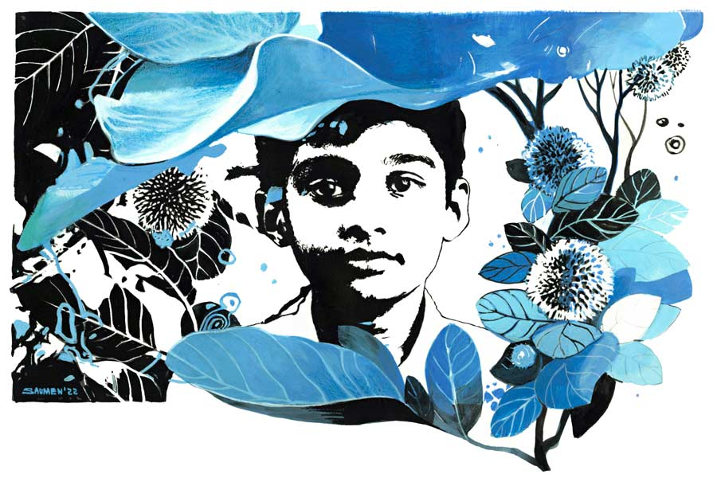

 
 <h1 align=center>বিনিসুতোয়</h1>
<h2 align=center>মৌসুমী চৌধুরী</h2> বাবার সঙ্গে আজই সৌম্য এই বাড়িতে এসেছে। সৌম্য বোঝে এত দিন বাবা একাই এখানে আসতেন। অনেক সময়ই এক রাত কাটিয়ে পরের দিন বাড়ি ফিরতেন। সেই সময় বাড়িতে ময়নাদিদি তার একার জন্য রান্না করে দিত। আর পাশের বাড়ির রুবিনা চাচির ছেলে ইকবাল তার সঙ্গে রাতে ঘুমোত। আজ তারা বাবা-ছেলে দু’জনেই সব ছেড়েছুড়ে এখানে চলে এসেছে চিরদিনের জন্য। ছেড়ে এসেছে খিদিরপুরের ঘিঞ্জি গলিতে তাদের নিজেদের বাড়িটি। আসবার সময় রুবিনাচাচি জিজ্ঞেস করেছিলেন, “কী রে সৌম্য, কোথায় চললি তোরা?”

সৌম্য তখনও জানত না তারা ঠিক কোথায় যাচ্ছে। সৌম্যর বদলে উত্তর দিয়েছিলেন বাবা, “সল্টলেকে, বৌদি। ওখানেই থাকব এখন থেকে।”

“ওহ্! তা এখানকার পাট একেবারে উঠিয়ে দিলেন বুঝি? বাড়িটা কি বিক্রি করে দেবেন?” কৌতূহলী রুবিনাচাচি জানতে চান।

“নাহ্, মাঝে সাঝে আসব এখানে। তার পর, দেখা যাক...” উদাস গলায় উত্তর দিয়েছিলেন বাবা।

কমলিকা আন্টির এই বাড়িটা সল্টলেকের এক অভিজাত পাড়ায়। এখানে চার দিকে আকাশছোঁয়া বাড়িঘর। পাড়াটি খুব বড় বড় আবাসন, মার্কেট কমপ্লেক্স, পার্ক, শপিং মল দিয়ে ঘেরা। বেশ সাজানো গোছানো। তাদের খিদিরপুরের বাড়ির মতো মফস্সলি ছোঁয়া এখানে নেই। মনটা একটু ভারী হয়ে আসে সৌম্যর। খুব মনে পড়ে তাদের পাড়ার মোড়ের সেই কদম গাছটার কথা। তার পড়ার ঘরের জানালা দিয়ে দেখা যেত গাছটাকে। মা চলে যাবার পর ঝাঁকড়া গাছটা যেন তাকে ছায়ায় মায়ায়  আগলে রাখত। বাবা সকাল সাড়ে আটটায় অফিসে বেরিয়ে যেতেন। সল্টলেকে সেক্টর ফাইভে অফিস। আর বাবা চলে যাওয়ার পর সকালের সেই সময়টায় একা একা ঘরে বসে পড়ত সৌম্য। হঠাৎ কদম গাছের ছায়াটা তার পড়ার টেবিলে হেলে পড়লে ঘড়ি না দেখেও সৌম্য বুঝতে পারত, তার স্কুলের জন্য তৈরি হওয়ার সময় হয়ে গেছে। গাছটা যেন মায়ের মতো আঁচলে ঘাড়-গলা মুছিয়ে দিয়ে বলত,

“বাবু, ওঠো, স্নান সেরে নাও। স্কুলে যেতে হবে তো।”

বিকেলে স্কুল থেকে ফেরার পথে পশ্চিম দিকে সূর্য ঢলে পড়লে কদম গাছের ছায়াটা দীর্ঘ হয়ে উঠত। তার তলায় দাঁড়িয়ে সৌম্য যেন শুনতে পেত, “বাড়ি ফিরে হাতমুখ ধুয়ে খেয়ে নাও। কিছু খেয়ে মাঠে খেলতে যাবে। আলো পড়ে এলেই ফিরে আসবে কিন্তু...”

গাছটার গায়ে পরম মমতায় হাত বুলিয়ে মাকে অনুভব করতে চাইত সৌম্য।

অনেক দিন ধরেই মা ভুগছিলেন। বোন টিবি অ্যাকিউট স্টেজে চলে গিয়েছিল। অসুস্থ মায়ের মাথার কাছে গিয়ে প্রায়ই নাকের সামনে হাত রেখে সৌম্য পরখ করত নিঃশ্বাস পড়ছে কি না। প্রতি বারই নিঃশ্বাস হাতে এসে লাগলে স্বস্তি হত। আর যে দিন মা চলে গেলেন, সেটা ছিল এক কুয়াশাময় শীতের সকাল। অফিস টুর সেরে কিছু ক্ষণ আগেই দিল্লি থেকে ফিরে এসেছিলেন বাবা। প্রতি দিনের মতো সৌম্য তার হাতটা মায়ের নাকের কাছে নিয়ে গিয়ে অনুভব করেছিল, নিঃশ্বাস আর পড়ছে না। মায়ের শরীরটাও বরফের মতো ঠান্ডা। তার চিৎকার শুনে ছুটে এসেছিলেন বাবা। হঠাৎ ডুকরে কেঁদে উঠে সেই যে মুখে কুলুপ এঁটেছিলেন, অনেক দিন পর্যন্ত কোনও কথা বলেননি আর। একটা কষ্ট তখন সৌম্যর হাড়-পাঁজর কুরে কুরে খেত। মা নেই, বাবাও যেন অনেক দূরের এক দ্বীপ! এক দিন মাথায় তেল মাখিয়ে দিতে দিতে ময়নাদিদি বলেছিল, “এই বয়সে পুরুষ মানুষ কি একলা থাকতে পারে না কি? দাদাবাবু ভালই করেছেন কমলিকা ম্যাডামকে বিয়ে করে...”

সে দিনও বুকের মাঝে হাজার হাতুড়ির ঘা অনুভব করেছিল সৌম্য। না না না... তার মায়ের জায়গায় অন্য কেউ আসতে পারে না। কেউ না... নিষ্ফল আক্রোশে ফেটে পড়েছিল অদেখা কমলিকা আন্টির উপরে। তা হলে বাবার অফিসের সহকর্মী এই মহিলাটিই বাবাকে তার কাছ থেকে কেড়ে নিয়েছে! দূরে সরিয়ে নিয়েছে তার একমাত্র অবলম্বনকে। একটা হিংসার আগুন দাউদাউ করে পুড়িয়ে দিচ্ছিল সৌম্যকে। তার পর বাবা এক দিন ওকে কমলিকা আন্টির কথা জানান। টেন পাশ করার পরে বাবা তাকে ভর্তি করে দেন সল্টলেকের এক নামী স্কুলে। তার পর আজ তো পাকাপাকি ভাবে তারা এ বাড়িতে চলে এসেছে। এখান থেকে তার স্কুলটাও বেশ কাছে।

সাত-পাঁচ ভাবতে ভাবতে অন্যমনস্ক হয়ে পড়েছিল সৌম্য। হঠাৎ দেখে, তার সামনে দাঁড়িয়ে এক সুন্দরী মহিলা। বব ছাঁট চুল। গায়ের রঙ পাকা গমের মতো। অপরূপ স্নিগ্ধ চেহারা। পরনে একটা রংবাহারি কাফতান। আর সঙ্গে ভারী মিষ্টি দেখতে একটি কিশোরী মেয়ে। পরনে বারমুডা আর টপ। মুখখানা বেশ আদুরে। বাবা পরিচয় করিয়ে দিলেন সৌম্যর সঙ্গে, “ইনিই কমলিকা। প্রণাম কর।”

প্রণাম করতে গেলে একটু যেন পিছিয়ে যান কমলিকা আন্টি। তার পর আলতো করে সৌম্যর চিবুক ছুঁয়ে আদর করে বলেন, “আহা! থাক থাক, খুব বড় হও বাবু।”

কত্ত দিন পর মায়ের মতো কেউ তাকে ‘বাবু’ বলে ডাকল। মনটা দ্রব হয়ে আসে সৌম্যর।

আর তখনই চোখ পড়ে সঙ্গের কিশোরীটির দিকে। রাগে যেন তার চোখ জ্বলছে। যেন এখুনি ভস্ম করে দেবে সৌম্যকে। কমলিকা আন্টি পরিচয় করিয়ে দেন, “এ হচ্ছে মিঠি। আমার মেয়ে। ক্লাস টেনে পড়ে। তোমার বোন... ”

তার দিকে তাকিয়ে মুখ বেঁকিয়ে মিঠি বলে ওঠে, “বোন না ছাই! আমার কোনও দাদা-ফাদা নেই। যত্তসব সাব-স্ট্যান্ডার্ড লোকজন।”

বলেই দুমদুম করে ভিতরের দিকে ভারী পর্দার আড়ালে মিলিয়ে যায় মিঠি।

অপমানে কান ঝাঁ-ঝাঁ করে ওঠে সৌম্যর। বাবার মুখটাও কালো হয়ে আসে। অপ্রস্তুত মুখে বাবার দিকে তাকিয়ে কমলিকা আন্টি বলেন, “দিন দিন ভারী জেদি আর রাফ হয়ে উঠছে মেয়েটা। তুমি কিছু মনে কোরো না, সূর্য। প্রথম প্রথম তো। ধীরে ধীরে ঠিক হয়ে যাবে। সৌম্যর সঙ্গে বড় হতে হতে ও ঠিক শুধরে যাবে।”

বাবা স্বাভাবিক হওয়ার চেষ্টা করলেও সৌম্যর মনে তীব্র অপমানের একটা কাঁটা খচখচ করে বিঁধতে থাকে।

এই বাড়িটি দু’হাজার স্কোয়ার ফুটের একটি অভিজাত ফ্ল্যাট। সুন্দর ইন্টিরিয়র ডিজ়াইন করা হলঘর, বারান্দা, কিচেন, চিলড্রেন’স বেডরুম, মাস্টার বেডরুম, ড্রয়িংরুম। বারান্দা আর ড্রয়িংরুম নানা বাহারি প্ল্যান্টে সাজানো। সুদৃশ্য টবের সবুজ গাছপালাগুলো চোখের আরাম দিলেও, খুব কৃত্রিম। কদম গাছটার কথা মনে পড়ে কান্না পায় তার।

এই বাড়িতে চিলড্রেন’স বেডরুমগুলোর মধ্যে একটি বরাদ্দ হয় সৌম্যর জন্য। আর একটায় থাকে মিঠি। বাবা আর কমলিকা আন্টি থাকেন মাস্টার বেডরুমে। খাওয়া আর স্নান ছাড়া সৌম্য নিজের ঘর থেকে বিশেষ একটা বেরোয় না। কমলিকা আন্টি আবাসনের জিমে, সুইমিং পুলে যেতে বলেন। কিন্তু সৌম্যর ভাল লাগে না। এখানে খেলার মাঠ নেই, কোনও বন্ধু নেই। বাবাকেও সে ভাবে পায় না সে। বাবা অফিস আর কমলিকা আন্টিকে নিয়েই ব্যস্ত থাকেন। মিঠির মুখোমুখি হলে সে সৌম্যকে খুব অপমান করে। কথায় কথায় তাদের মধ্যবিত্তপনা নিয়ে খোঁটা দেয়। নানা ভাবে তাকে বিদ্রুপ করে।

এ বাড়িতে ব্রেকফাস্ট আর ডিনার সবাই এক সঙ্গে খায়। এদের জলখাবার পাস্তা, ফ্রেঞ্চ টোস্ট, ফ্রেঞ্চ অমলেট, ডিমসেদ্ধ, চিজ় স্যান্ডুইচ, চিকেন স্যান্ডুইচ। এগুলো ভাল লাগে না সৌম্যর। তার রুটি আর আলু-কুমড়োর ছোকা, লুচি-আলুর দম, ছোলার ডাল খেতে খুব ইচ্ছে করে। ডাইনিং টেবিলে কমলিকা আন্টি অবশ্য অনেক সময় স্নেহভরে জিজ্ঞেস করেন, “ব্রেকফাস্টে তোমার কী পছন্দ, বাবু? বললে সেটাই তোমায় করে দেওয়া হবে।”

লজ্জায় মুখ ফুটে কিছু বলতে পারে না সৌম্য। কেমন যেন বাধো-বাধো ঠেকে।

টেবিলে অন্য প্রান্তে ব্যঙ্গের হাসি হেসে মিঠি বলে ওঠে, “ব্রেকফাস্টে এ সব খাবার কখনও চোখে দেখেছে নাকি ও!  মাম, তুমিও পারো!”

কমলিকা আন্টি চোখ পাকিয়ে শাসন করেন মিঠিকে। কিন্তু সে থোড়াই কেয়ার করে! কাঁধ ঝাঁকিয়ে উঠে পড়ে খাওয়া ছেড়ে!

হতাশ গলায় কমলিকা আন্টি বলেন, “দিন দিন ওর বাবার মতো রাফ হয়ে উঠছে মেয়েটা। কিছু বখাটে ছেলে-মেয়ে বন্ধুও জুটিয়েছে। আরও বিগড়ে যাচ্ছে দিন দিন। বড় চিন্তা হয়, সূর্য।”

সৌম্য আর তার বাবা মুখ নিচু করে থাকে। বাবা কোনও উত্তর দেন না।

কমলিকা আন্টির সঙ্গে মিঠির বাবার ডিভোর্স হয়ে গেছে বেশ কয়েক বছর হল। কোর্টের নির্দেশে মিঠি তার বাবার কাছে গিয়ে থাকে উইকএন্ডে। সোমবার ফিরে আসে। তার বাবার ড্রাইভার এসে মিঠিকে নিয়ে যায়, ফিরিয়েও দিয়ে যায়।

সে দিন খুব সকালে বাবা আর কমলিকা আন্টি অফিসে বেরিয়ে গিয়েছিলেন। অফিসে তাঁদের গুরুত্বপূর্ণ মিটিং ছিল। বিদেশ থেকে কোম্পানির চিফ ম্যানেজিং ডিরেক্টর আসবেন। আসবেন আরও গুরুত্বপূর্ণ অতিথিরা। যাওয়ার আগে কমলিকা আন্টি সৌম্যকে বলে গিয়েছিলেন, “মিঠিকে একটু দেখো, বাবু। ওর বখাটে বন্ধুগুলো যেন এখানে এসে আসর জমাতে না পারে। আমাদের আজ ফিরতে ফিরতে বেশ খানিকটা রাত হয়ে যাবে।”

কিছু বলেনি সৌম্য। বড়দের মুখের উপর সে আপত্তি করতে পারে না। সেটাই তার মায়ের শিক্ষা।

বেলা বাড়লে একে একে বাড়িতে আসে মিঠির বন্ধুরা। চার-পাঁচ জন ছেলে মেয়ে। সকলেই আধুনিক পোশাক পরা। কারও চুল ফিকে কমলা, কারও চুল হাইড-অ্যান্ড-সিক কালার করা, কারও হাতে আর ঘাড়ে ট্যাটু। তাদের এক জনের হাতে ফুড প্যাকেট আর পানীয়ের বোতল। রান্নার মালতীমাসিকে তার জন্য রান্না করতে বারণ করে মিঠি। সৌম্য কমলিকা আন্টির কথা মনে করে নেহাতই যন্ত্রের মতো মিঠিকে বারণ করার চেষ্টা করেছিল, “এ সব কোরো না, মিঠি। মায়ের কথা শোনো প্লিজ়। তোমার মা খুব দুঃখ পাবেন।”

তার কথা তুড়ি মেরে উড়িয়ে দিয়ে মিঠি বলেছিল, “আমাকে নিয়ে ভাবতে হবে না। নিজের লাইফ নিয়ে ভাবো। আমাদের বাড়িতে উঠে এসে মৌরসিপাট্টা গেড়ে বসেছ, ভাল কথা। কিন্তু আমার কাজে দখলদারি করতে এসো না। এটা আমার বাপির দেওয়া ফ্ল্যাট। ওই বিচটার নয়...”

মিঠির বন্ধুরা সব খ্যা-খ্যা করে হেসে ওঠে। অপমানে কান-মাথা গরম হয়ে ওঠে সৌম্যর।

আর কথা বাড়ায় না সে।

তার পর পাশের ঘরে চলছিল মিঠিদের দেদার আড্ডা আর হইহুল্লোড়। দুপুরবেলা খাওয়া-দাওয়ার পর চোখটা সবে একটু লেগে গিয়েছিল সৌম্যর। হঠাৎ কানে আসে মিঠির আর্ত চিৎকার। দৌড়ে নিজের ঘর থেকে বেরোয় সে। বিস্ফারিত চোখে দেখে— ড্রয়িংরুমের সোফার উপর একটি ছেলে মিঠিকে জাপটে ধরে তার জামাকাপড় টেনেহিঁচড়ে খোলার চেষ্টা করছে। আর অন্যরা পাশের ঘরে মদের গ্লাস হাতে ভাবলেশহীন মুখে সিনেমা দেখার মতো ‘এনজয়’ করে চলেছে। ও দিকে অঝোরে কেঁদে যাচ্ছে মিঠি, “না, না রুদ্র। প্লিজ়... ছেড়ে দে আমায়। তোর পায়ে পড়ি...”

রুদ্র নামের ছেলেটি বলছে, “কাম অন, মিঠি। আমাদের তো বিয়ে হবেই, তা  হলে আর...”

ছুটে গিয়ে ছেলেটার মুখে সজোরে একটা পাঞ্চ মারে সৌম্য। ছেলেটা ঘুরে তাকে আঘাত করার চেষ্টা করলে তাকে কষে একটা নি-শট দিয়ে ধরাশায়ী করে দেয়। খিদিরপুরে ‘মিলন তীর্থ’ ক্লাবের ক্যারাটে চ্যাম্পিয়ন সৌম্য রায় যেন জ্বলে উঠেছিল সেই মুহূর্তে...

ঘটনার আকস্মিকতায় একেবারে ঘাবড়ে যায় মিঠির বন্ধুরা। তারা রুদ্রকে টেনে-হিঁচড়ে সরিয়ে দেয়। তার পর গনগনে চোখে সৌম্যকে দেখতে দেখতে একে একে বেরিয়ে চলে যায় সবাই। তারা চলে যেতেই দড়াম করে দরজাটা বন্ধ করে দেয় সৌম্য। আর কাঁদতে কাঁদতে দৌড়ে নিজের ঘরে ঢুকে মিঠিও দরজা বন্ধ করে দেয়।

পরের দিন মিঠিকে আর দেখতে পেল না সে সারাটা দিন। খাবার টেবিলেও নয়। কমলিকা আন্টির কাছে জানতে পারে, মিঠির নাকি খুব শরীর খারাপ। এ সপ্তাহে  বাবার কাছেও যাবে না সে। সন্ধেবেলা নিজের ঘরে গান শুনছিল সৌম্য। হঠাৎ তার দরজায় ঠকঠক শব্দ। দরজা খুলে দেখে, শুকনো কাঁচুমাচু মুখে মিঠি দাঁড়িয়ে আছে। মুখ নিচু করে মিঠি বলে, “তোমার সঙ্গে কিছু কথা আছে। এক বার আমার ঘরের বারান্দায় আসতে পারবে প্লিজ়?”

এই দুই মাসে সৌম্য কখনও মিঠির ঘর বা বারান্দার দিকে আসেনি। এই ফ্ল্যাটবাড়িতে দুটো বারান্দা। একটা বারান্দা মিঠির ঘরের সঙ্গে লাগোয়া, আর একটা কমলিকা আন্টি আর বাবার বেডরুম সংলগ্ন। বাবা আর আন্টি অফিস থেকে এখনও ফেরেননি। বাড়িতে এখন শুধু সে, মিঠি আর মালতীমাসি। মিঠির বারান্দায় পা রাখতেই টবে যত্নের গাছগাছালি থেকে একটা বুনো গন্ধ  নাক ছুঁয়ে দিল সৌম্যর। বেতের দোলনায় গা এলিয়ে অন্যমনস্ক ভাবে বসে ছিল মিঠি। সে যেতেই উঠে দাঁড়াল। একটি সুদৃশ্য টি-টেবিলের দু’পাশে দু’টো বেতের চেয়ারে বসল তারা। দূরে ইট-কাঠ-পাথরের জঙ্গলে একটু একটু করে সন্ধে নামছে। ধীরে ধীরে যেন নারী হয়ে উঠছে কিশোরী সন্ধ্যা। নিয়নের নেকলেস পরে সেজে উঠছে কল্লোলিনী। হাওয়ায় দুলছে কামিনীর সুগন্ধ। সৌম্য দেখে, টবের কামিনী গাছটা ফুলে ফুলে সাদা হয়ে আছে। হঠাৎ যেন বহু দূর থেকে মিঠি বলে ওঠে, “আমাকে ক্ষমা করে দিয়ো, প্লিজ়। তোমার সঙ্গে আমি খুব রুড বিহেভিয়ার করেছি, সৌম্য। আয়্যাম রিয়েলি ভেরি সরি।”

সৌম্য উত্তরে বলে, “ইট’স ওকে, মিঠি। এ ভাবে বলার কিছুই নেই। গতকালের পরিস্থিতিতে তোমার জায়গায় অন্য যে কেউ থাকলেও আমি একই কাজ করতাম।”

মিঠি চুপ করে থাকে। তাদের দু’জনের মাঝে বয়ে যেতে থাকে কামিনীর সুগন্ধি মিশেলের বাতাস। কোনও কথা খুঁজে না পেয়ে সৌম্য বলে, “আমি তা হলে ঘরে যাই। পড়তে বসতে হবে।”

হঠাৎ কেঁদে ফেলে মিঠি, “যেয়ো না। একটু বোসো না, প্লিজ়। আই ফিল ভেরি লোনলি, সৌম্য। মাম আর আমার মাম নেই। কেমন যেন দূরের কোনও মানুষ হয়ে গেছে... ”

কান্না বাঁধ ভেঙে বেরিয়ে আসতে থাকে মিঠির ভিতর থেকে। একটু থমকে যায় সৌম্য।

নিজের ভিতরটাকে হঠাৎ যেন মিঠির মধ্যে দেখতে পায় সে।