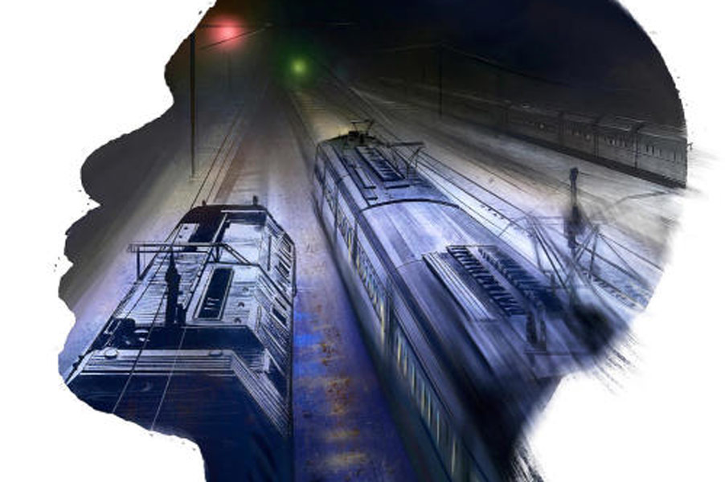

 
 <h1 align=center>বিপিএল ট্রেন</h1>
<h2 align=center>সুব্রত নাগ</h2> পাপটা শালা আজকেও পিছনে লেগেছে। কিছু ক্ষণ পিছু ধাওয়া করবে; তার পর লাট-বেলাটের মতো গমগম আওয়াজ তুলে নাক উঁচিয়ে বেরিয়ে যাবে ধরাছোঁয়ার বাইরে। পিছনে পড়ে থাকবে সমরের মতো কিছু ফেলটুস, ফালতু প্যাসেঞ্জার, যাদের টানতে টানতে বার বার হেঁপো রোগীর মতো বেদম হয়ে যাবে ট্রেনটা।

ডেলি প্যাসেঞ্জার হালদারদা বলেছিলেন এক দিন, “বিপিএল ট্রেন আমাদের ভায়া। এর চেয়ে বেটার সার্ভিস আশা কোরো না।”

হাসি পেয়েছিল সমরের। মানুষের মতো ট্রেনেরও কি বিপিএল-এপিএল থাকে নাকি? থাকে হয়তো। নইলে রাজধানী, শতাব্দী, দুরন্ত, বন্দে ভারত— এই সব ট্রেন গতির ঝড় তুলে রাইট টাইমে পৌঁছে যায় কী করে? ঝকঝকে এসি কম্পার্টমেন্ট, নরম গদিওয়ালা বার্থে বালিশ-কম্বল নিয়ে ফ্লুরোসেন্ট আলো মেখে যারা বসে অথবা শুয়ে থাকে; রেল কোম্পানির দেওয়া দামি আইসক্রিম কিংবা কফি খেতে খেতে গল্প করে, তারা নিশ্চয়ই এপিএল ট্রেনের এপিএল যাত্রী। আর ওদের মতো রদ্দিমার্কা ট্রেনের রংচটা কামরায় যারা ওঠে; যেখানে বাথরুমে জল নেই, আলো জ্বলে না, অর্ধেক ফ্যান ঘোরে না— তারা নিশ্চয়ই বিপিএল ট্রেনের খদ্দের। রেল কোম্পানিকে মনে মনে তুমুল গালাগাল দেয় সমর, ‘কেন রে? আমরা কি টিকিট কাটি না? আমাদের পয়সার দাম নেই? সময়ের দাম নেই?’

ভিড়টা আজ বেশ কম। মালপত্র-ভর্তি ভারী ব্যাগ দুটো বাঙ্কে রেখে জানলার ধারে বসে এক ভাঁড় চা কিনে আয়েশি মেজাজে চুমুক দেয় সমর। বর্ধমানে ট্রেনে উঠে জানলার ধারের সিট পাওয়া ভাগ্যের ব্যাপার।

ট্রেনটা হাওড়া থেকে বর্ধমান অবধি খারাপ আসে না। বেশির ভাগ দিনই টাইমেই ঢোকে। তার পর দু’নম্বর প্ল্যাটফর্মে সেই যে গেঁড়ে বসে, কোনও দিন পনেরো মিনিট, কোনও দিন কুড়ি, কখনও আধ ঘণ্টাও আটকে থাকে হাওড়া-ধানবাদ সুপারফাস্টের জন্য। বড়সাহেব আসবেন; দু’মিনিটের জন্য দাঁড়াবেন; মুচকি হাসি ছুড়ে দেবেন সমরদের ট্রেনের দিকে, তার পর কলার তুলে হেলতে দুলতে বেরিয়ে যাবেন স্টেশন ছেড়ে। উপেক্ষিত ট্রেনের ড্রাইভার হাঁ করে তাকিয়ে থাকবে, কখন তার সিগন্যাল হলুদ হয়।

ইদানীং আর একটা কায়দাও হয়েছে। বর্ধমান স্টেশনে বেশি ক্ষণ দাঁড় না করিয়ে তালিত কিংবা খানা জংশনে লাল চোখ দেখিয়ে থামিয়ে দেবে ট্রেনটাকে। বিড়ি ধরানোর জন্য সমরের মতো কিছু প্যাসেঞ্জার নেমে আসে প্ল্যাটফর্মে। ভুল করেই বোধহয় ইঞ্জিনটা দু’-এক বার হুইসল মারে, হয়তো কখন ছাড়বে জানতে চায়। বিড়িতে শেষ সুখটানটা মেরে ধোঁয়ার কুণ্ডলী হাওয়ায় ভাসিয়ে বিড়বিড় করে সমর, “ছাড়বে না রে বিপিএল ট্রেন, ছাড়বে না তোকে। প্রত্যেক স্টেশনে তোকে থামানোর জন্য ডিসট্যান্ট সিগন্যাল লাল হয়ে থাকবে। ঠিক যেমন আমাদের থামানোর জন্য জীবনের প্রত্যেক স্টপেজে লাল আলো জ্বলতে থাকে।”

ট্রেনের পিছন দিকে নজর দিতেই দূরে অন্ধকারে একটা আলোকবিন্দু দেখা যায়। সমর বোঝে, সুপারফাস্ট এপিএল আসছে। অন্ধকার চিরে আলোকবৃত্ত ক্রমশ বড় হয়, কাঁপতে থাকে রেললাইন। তার আসার জন্য সমস্ত সিগন্যাল হলুদ; কোথাও কোনও বাধা নেই, প্রতিবন্ধকতা নেই। ধানবাদ পর্যন্ত লাইন তার জন্য উন্মুক্ত। চলার গতি ইচ্ছেমতো বাড়িয়ে কমিয়ে সুপারফাস্ট তার জার্নি উপভোগ করে, ঠিক এপিএল যাত্রীদের মতোই। ওদের জীবনেও তো লালবাতির হুমকি নেই, শুধু হলুদ বাতির অবাধ প্রশ্রয়।

ঝোড়ো গতিতে আলোকিত কামরাগুলো যখন মিলিয়ে যায়, তালিত কিংবা খানা জংশনে নিস্তব্ধতা আবার জমাট বাঁধে। ছোট স্টেশনের বিক্ষিপ্ত কিছু আলো চার পাশের জমাট অন্ধকারের সঙ্গে পাল্লা দিতে না পেরে ঝিমোতে থাকে। হঠাৎই সমরদের ট্রেনটা হুইসল দেয়। সিগন্যাল হলুদ হয়েছে দেখে প্ল্যাটফর্মে পায়চারি করা প্যাসেঞ্জাররা ট্রেনে ওঠে। ধুঁকতে ধুঁকতে ট্রেন এগোয়, স্পিড তুলতে ভরসা পায় না ড্রাইভার। কী জানি আবার কখন লালবাতির হুমকিতে থামতে হয়। দু’-এক জন রসিক যাত্রী মন্তব্য করে, “ড্রাইভারের ফোন নম্বরটা জানা থাকলে ফোন করে দাদাকে একটু টেনে চালাতে বলতাম।” পাশ থেকে কেউ শুধরে দেয়, “এ কি বাস-রাস্তা যে, ড্রাইভার নিজের খুশিমতো যাবে? সিগন্যাল না দিলে টানবে কী করে?”

টানার কথা উঠলেই ত্রিশ বছর আগের সেই দিনটার কথা মনে পড়ে যায় সমরের। ইন্টার-স্কুল দু’শো মিটার রেস। ওদের জেলা স্কুলের মাঠে প্রতি বছর বড় করে হত স্পোর্টসটা। সমরের বাবা বরুণ সাহার মুদির দোকানে খাতা লিখত। তেমন পুষ্টিকর খাবার না মিললেও ছোট থেকেই হরিণের মতো দৌড়ত সমর। কিন্তু সে বার... কানাঘুষোয় সমর শুনেছিল জেলা স্কুলে অতীশ নামে একটা ছেলে ভর্তি হয়েছে। দারুণ স্প্রিন্টার। বাপ শাঁসালো অফিসার। বড়লোকের ছেলেরা সাধারণত দৌড়ঝাঁপে নামত না, ফুটবলে লাথি মারত না। ওদের দেখা যেত ক্রিকেট কিংবা ব্যাডমিন্টন মাঠে। কিন্তু অতীশ ছিল ব্যতিক্রম।

দু’শো মিটার স্টার্টিং ব্লক থেকে ছিটকে বেরোনোর পর পঞ্চাশ মিটার পর্যন্ত সমরই এগিয়ে ছিল। তার পরেই বুঝেছিল, বিপদ আসছে। হিংস্র শ্বাপদের মতো ধাওয়া করে অতীশ তাকে প্রায় ছুঁয়ে ফেলেছে। গতি বাড়াতে চেষ্টা করে সমর, তবু একশো মিটারের আগেই অতীশ তাকে পিছনে ফেলে এগিয়ে যায়। মাঠের বাইরে থেকে সমরের জন্মরুগ্ণ দাদা অমরের নিঃসঙ্গ চিৎকার ভেসে এসেছিল, ‘‘টান ভাই, টান...”

আপ্রাণ টেনেছিল সমর, তবু পরিষ্কার দু’মিটার ব্যবধানে জিতেছিল অতীশ। ভিকট্রি স্ট্যান্ডে ওর বুকে ঝলমল করছিল গোল্ড মেডেলটা। ভাইয়ের বুকে ঝোলানো সিলভার মেডেলটায় হাত বোলাতে বোলাতে দাদা বলেছিল, “ওদের দুধ-ডিম ভিটামিন খাওয়া শরীর। শুনলাম, ওই ছেলেটার নিজস্ব ট্রেনারও আছে। তুই তো তবু অনেকটা টেনেছিস।”

বেশি দিন বাঁচেনি দাদা; আঠারো বছরেই চলে গিয়েছিল। এখনও যদি আলটপকা দাদার কথা মনে হয়, মাঠের বাইরে থেকে অসহায় আর্ত চিৎকারটা শুনতে পায় সমর, “টান ভাই, আরও, আরও জোরে টান...”

দাদার মতো বাবাও বলত, “টান সমু, টান...” তবে দাদার মতো দৌড়ের মাঠে নয়, বাবা বলত স্কুলের পরীক্ষার সময়। অ্যানুয়াল পরীক্ষা দিতে যাওয়ার আগে দুই ভাই যখন বাবা মা-কে প্রণাম করত, ওদের মাথায় হাত রেখে চোখ বন্ধ করে বিড়বিড় করে কী যেন বলত বাবা। তখন মনে হত মায়ের মতো বাবাও হয়তো বলছে, ‘‘দুগ্গা! দুগ্গা!” কিন্তু এখন মনে হয় বাবা আসলে বলত, “টান সমু, টান— অঙ্কে টান, ইংরেজিতে টান...”

কবে আর টানতে পারত সমর? মার্কশিটটা কাঁপা-কাঁপা হাতে বাবার দিকে এগিয়ে দিয়ে আড়চোখে অসময়ে টাক পড়ে যাওয়া, গাল তুবড়ে যাওয়া, ক্ষয়াটে লোকটাকে দেখত। ক্লাস ফাইভ থেকে মাধ্যমিক— কোনও বার নম্বর দেখে বাবার ফ্যাকাশে মুখে হাসির জ্যোৎস্না ঝিলমিলিয়ে ওঠেনি। মা হয়তো পাশ থেকে উঁকি মেরে বলত, “ইতিহাসে পঞ্চাশ পেয়েছে, দেখো...”

বাবা দীর্ঘশ্বাস ফেলে বলত, “অঙ্কে আবার ফেল, সতেরো!”

মা বলত, “তোমাকে কত বার বলেছি, অঙ্কের একটা মাস্টার রাখো। মাধব মাস্টার নাকি ভাল পড়ায়, কথা বলো না এক বার।”

মায়ের হাতে মার্কশিটটা গুঁজে দিয়ে বাবা বলত, “দেখি, এ মাসটায় টানাটানি যাচ্ছে, সামনের মাসে বরং...” বছর ঘুরে যেত; সেই সামনের মাস আর আসত না। মাধব মাস্টারের কাছে আর যাওয়া হয়নি সমরের। অঙ্কের সতেরো কখনও হত ষোলো, কখনও উনিশ। তার জন্য বকেনি বাবা, আসলে নিজেও তো কখনও সংসার টানার অঙ্কটা ঠিকমতো কষতে পারেনি। আজীবন কুঁকড়ে গিয়ে, ঠোক্কর খেয়ে ছাপান্ন বছরের বিবর্ণ, নিষ্ফল জীবনের শেষে যখন থামল বাবা, তখন সমর কলেজের গণ্ডি পেরিয়েছে। শ্রাদ্ধশান্তি চুকে যাবার পর অসহায় মা জিজ্ঞেস করেছিল, “এ বার কী হবে রে?”

মালা-চন্দন পরা, দেওয়ালে টাঙানো ফোটো হয়ে যাওয়া বাবার মুখের দিকে তাকিয়ে সমর বলেছিল, “কী আবার হবে? এ বার আমাকে টানতে হবে।”

সেই থেকে সমর টানছে। খুচরো ব্যবসা, দোকানে খাতা লেখা, ঠিকাদারির কাজ দেখাশোনা, মার্কশিটের নম্বরের মতো কোনও কাজই ঠিকমতো টানতে পারেনি সমর। ইদানীং পাঁচমিশালি অর্ডার সাপ্লায়ারের কাজ ধরেছে। সপ্তাহে দু’দিন বর্ধমান থেকে মাল তুলে অর্ডার মতো সিউড়ির দোকানে দোকানে সাপ্লাই দেয়।

মাঝে মাঝে চুল আঁচড়াতে গিয়ে আয়নায় নিজেকে দেখে চমকে যায় সমর। কাচের ও দিকে কে? সমর নিজে? ক্রমশ পাতলা হয়ে আসা মাথার চুল, কোটরে ঢুকে যাওয়া চোখ, তুবড়ে যাওয়া গাল! কে ও? কুড়ি বছর আগে এই লোকটাই বরুণ সাহার দোকানে খাতা লিখত না? এই লোকটাই তো নিঃশব্দে চিৎকার করে বলত, “টান, সমু... টান...”

আর কত টানবে ও? বড় বড় ভারী দুটো ব্যাগ টানতে টানতে বর্ধমান স্টেশনের এক নম্বর প্ল্যাটফর্ম থেকে ওভারব্রিজ বেয়ে অন্য প্ল্যাটফর্মে নামতে গিয়ে বেদম হয়ে যায় সমর। সংসারের জোয়াল টেনে বেদম হয়ে পড়ে বৌ সোমাও। অভাব-অনটন নিয়ে বিশেষ গলা না তুললেও সমরের মায়ের মতো সোমাও মাঝেমধ্যে বলে, “ছেলেটা ইংরেজিতে বড় কাঁচা। চল্লিশের বেশি পায় না। ওদের নীহার স্যর খুব ভাল ইংরেজি পড়ান, দেখো না এক বার...”

ফ্যাঁসফেঁসে গলায় সমর জিজ্ঞেস করে, “কত নেয়-টেয় জানো?”

“কে যেন বলছিল তিনশো...”

তিনশো! মাধব মাস্টার নিত পঞ্চাশ। সে টাকাও কোনও দিন জোগাড় করতে পারেনি সমরের বাবা। দিন বদলের হিসেবে পঞ্চাশ টাকাই বোধহয় তিনশোয় দাঁড়িয়েছে। মুদির দোকানে খাতা লেখা বাবার মতোই অর্ডার সাপ্লায়ার সমর বলে, “এই মাসে একটু অসুবিধে চলছে, দেখি সামনের মাসে চেষ্টা করে...”

সোমা আঙুলে শাড়ির খুঁট জড়ায়; দু’-এক বার ইতস্তত করে বলে, “বাবু খুব সুন্দর ছবি আঁকে। স্কুলে সবাই নাকি ওর আঁকার প্রশংসা করে।”

সোমা আরও একটু সময় নেয়; আঙুলে আরও কয়েক বার শাড়ি জড়ায়। তার পর ঝেড়ে কাশে, “বাবুর বন্ধু দিপুদের বাড়ি এক ভদ্রলোক আঁকা শেখাতে আসেন। খুব ভাল শেখান...” সোমা মাথাটা নামিয়ে বলে, “বেশি নয়, দু’শো টাকা নেন।”

তিনশো প্লাস দু’শো, মোট পাঁচশো! প্রতি মাসে! গলা শুকিয়ে আসে সমরের। ঘরের ফ্যানটার স্পিড যেন হঠাৎই কমে যায়। বাবু ইতিমধ্যেই ওর আঁকার খাতাটা নিয়ে এসে দেখায়, “দেখো বাবা, দেখো, ভাল হয়নি ছবিগুলো?”

ছবিগুলো দেখতে দেখতে বরুণ সাহার দোকানে খাতা লিখত যে লোকটা, তাকে ছাপিয়ে যাওয়ার প্রবল ইচ্ছে জাগে সমরের। ছেলের মাথায় হাত বোলাতে বোলাতে বলে, “শেখাব বাবা, তোকে আঁকা শেখাব। আমি খেলার মাঠে টানতে পারিনি, তোকে কিন্তু আঁকার মাঠে টানতে হবে। টানতে পারবি তো?”

বর্ধমান থেকে রাইট টাইমে ছেড়ে আসার পরে তালিত কিংবা খানা স্টেশনেও যখন দাঁড়াল না ট্রেনটা, মনটা বেশ ফুরফুরে হয়ে ওঠে সমরের। আজই কি তবে সেই দিন, যে দিন হাওড়া-ধানবাদ সুপারফাস্ট ওদের ট্রেনের কাছে মাথা নোয়াবে? আজই কি তা হলে ট্রেনটা রাত সোয়া ন’টার মধ্যে সিউড়ি পৌঁছবে? অন্তত এক দিনের জন্যও?

রোদের তাপ মুছে গিয়ে সন্ধে নামার মুখে ঝিরঝিরে ঠান্ডা হাওয়া আসছে জানলা দিয়ে। আরামে চোখ বুজে এসেছিল কয়েক মুহূর্তের জন্য। কিন্তু হঠাৎই ষষ্ঠেন্দ্রিয়ে বিপদসঙ্কেত ধরা পড়ে। চটকে যায় তন্দ্রা, চোখ পাতে পাশের লাইনে। কাঁপছে না লাইন দুটো? কান পাতে বাতাসে, সেই শব্দটা শোনা যাচ্ছে যেন! তবে কি আজকেও পিছু ছাড়বে না পাপটা? ট্রেনের স্পিডটাও যেন কমে আসছে! আবার লালবাতির শাসানি?

সিট ছেড়ে ছিটকে উঠে দরজার কাছে যায় সমর। খোলা দরজা দিয়ে পিছনে তাকাতেই ভয়ের ঠান্ডা স্রোত নামে পিঠ বেয়ে। ওই তো! সুপারফাস্টের সাদা ইঞ্জিনটা লাইন কাঁপিয়ে বুনো মোষের মতো ছুটে আসছে। সমরদের ট্রেনের ড্রাইভার কি বুঝতে পারছে না?

“স্পিড তুলুন ড্রাইভারসাহেব!” দাঁতে দাঁত পিষল সমর। নাক-উঁচু, কলার-তোলা অফিসারদের ট্রেন এ ভাবেই পাশ দিয়ে বেরিয়ে যায় রোজ। অতীশও এক দিন এ ভাবেই নিঃশব্দে অতিক্রম করে গিয়েছিল, ধরতে পারেনি সমর। ড্রাইভারটাও বোধহয় বিপদ আঁচ করে স্পিড বাড়াচ্ছে এ বার। ‘চল ব্যাটা, বাঘের বাচ্চা। দেখিয়ে দে দৌড় কাকে বলে।’ কিন্তু জোর হাওয়ার ঝাপটা মেরে সুপারফাস্টও যে এসে পড়ল পাশের লাইনে। উদ্দাম গতিতে একটার পর একটা ঝকঝকে কামরাগুলো পেরিয়ে যাচ্ছে। গতির ঝড়ে পাথর ছিটকোচ্ছে; লাইনের সঙ্গে চাকার ঠোকাঠুকিতে আগুনের ফুলকি ফিনকি দিয়ে উঠছে। তিনটে এসি কম্পার্টমেন্টে ঠান্ডা হাওয়া গায়ে মেখে নরম গদিতে সারি সারি অতীশ বসে আছে। ত্রিশ বছর আগের মতো আজকেও অতিক্রম করে যাচ্ছে তারা। মামদোবাজি নাকি? বার বার এ ভাবেই হেরে যাবে? এক বারও  জিতবে না? একটা শেষ চেষ্টা করতেই হবে। দরজার হাতল দুটো ধরে গলা ফাটিয়ে চিৎকার করে সমর, “টান... বিপিএল ট্রেন... ছাড়িস না! টান... টান...”