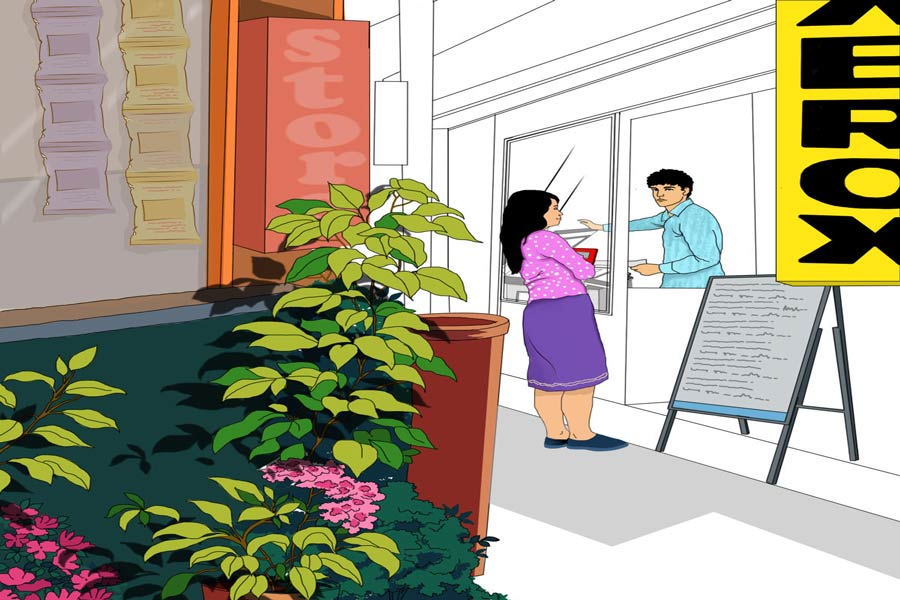

 
 <h1 align=center>বিফল বাসনা</h1>
<h2 align=center>বাসুদেব মালাকর</h2> 

পইপই করে বারণ করেছিলাম, পায়ে ধরতে বাকি রেখেছিলাম শুধু! তা-ও বিল্বকে ফেরাতে পারিনি। সেই যে একটা অনুচিত, অযোগ্য, বেমানান সম্পর্কের কালীদহে ডুবে গেল সে, তা থেকে আর তুলে আনতে পারলাম না ওকে।

আমরা পাঁচ জন— আমি, পলাশ, আদিত্য, সমর ও বিল্ব— ছোটবেলার বন্ধু। বাকিরা নানা দিকে ছিটকে গেলেও আমরা আজও আগের মতোই আছি। চার জনই ছোট-বড় চাকরি জুটিয়ে নিয়েছি। গ্র্যাজুয়েশন শেষ করার পর, বিল্ব কিছু দিন চাকরির চেষ্টা করে ব্যবসায় মন দিল। এখনও ছুটির দিন সন্ধ্যায় আমরা সবাই বিল্বর দোকানে জড়ো হই। আগে এ জায়গাটা গ্রামই ছিল। এখন বিশাল বিশাল ঘরবাড়ি, দোকানপাট, বিডিও অফিস, পেট্রল পাম্প হয়ে পুরোদস্তুর শহর!

বড় রাস্তার পাশে বিল্বদের একটু জমি ছিল। ওর বাবা নিরঞ্জনবাবু ছিলেন প্রাইমারি স্কুলের শিক্ষক। তিনি সেখানে একটা বই-খাতা-পেনসিলের দোকান করেছিলেন। রাস্তার দু’পারে ছেলেদের ও মেয়েদের দুটো হাই স্কুল— দোকান মোটামুটি ভালই চলত। খানিকটা দূরে টিনের ছাউনির বাড়ি ছিল ওদের। সকাল দশটায় বিল্বর মা দোকানে এসে বসলে নিরঞ্জনবাবু স্নান-খাওয়া সেরে স্কুলে চলে যেতেন। আবার বিকেলে এসে বসতেন। তখন শিক্ষকদের বেতন ছিল অনিয়মিত ও নামমাত্র। বিল্বর দাদা শতদল লেখাপড়ায় ভাল ছিল। চার জনের সংসার চালানো, দুই ছেলের লেখাপড়া, টিউশন— দোকানটা অপরিহার্য ছিল। বিল্ব এখন সেই দোকানটাই চালায়। ভালই চলছে। একটা কাজ-জানা ছেলেকে রেখে ফোটোকপির মেশিন-সহ সাইবার কাফেও খুলেছে। ওটাই এখন আপাতত একমাত্র সাইবার কাফে এখানে।

বিল্বর মরণ হয়েছিল ক্লাস টুয়েলভে পড়ার সময়। তখন শুধু সরস্বতী পুজোর দিন বিকেলে আমরা মেয়ে-স্কুলে ঢুকতে পারতাম। ওরা একটা প্রদর্শনী করেছিল সে বার। ছবি, হাতের কাজ, বিজ্ঞানের সাধারণ কিছু নমুনা দিয়ে। অক্সিজেনের অভাবে কী ভাবে আগুন নিবে যায়, এমন একটা এগজ়িবিটের সামনে এসে বিল্ব সে বার আঠার মতো সেঁটে গেল! টেবিলের ও-পারে ছিল লাবণি।

সেই থেকে সমস্ত মেয়েদের থেকে বিল্ব চোখ সরিয়ে নিল। আমরা পাশ-টাশ করে বেরোলাম। বিয়ে করলাম, বাচ্চাকাচ্চাও হল। কিন্তু বিল্ব লাবণিতেই ডুবে রইল! এক দিন বিল্ব প্রোপোজ়ও করেছিল, লাবণি বলেছিল, “আমার এক জন আছে! তা ছাড়া টিনের ঘরের বেকার ছেলের সঙ্গে প্রেম— তুমি ভাবলে কী করে! ছ্যা!” কোথাও দেখা হলে লাবণি মুখ ফিরিয়ে নিত।

লাবণি নিজেও কোনও সম্পর্কে একাগ্র ছিল না। ভালবাসার সত্যি-মিথ্যে বোঝার মতো মন ও মেধাও ছিল না হয়তো। তার রূপের আগুন ছিল, অনেক পতঙ্গও ছিল। সে-ও তাদের প্রশ্রয় দিত। বিভিন্ন ছেলের সঙ্গে ওকে সিনেমা-থিয়েটার-জলসা-রেস্তরাঁ-জেলার বইমেলা কিংবা অন্যান্য মেলায় দেখেছি আমরা। লোকে বলত ঢলানি! ছোট্ট শহর— একেবারে অজ্ঞাতসারে কিছু করাও সহজ ছিল না। বিল্বকে সব শুনে বলত, “ভ্যাট! আমার মতো ভালবাসতে কেউ পারবে না ওকে! ও সেটা জানে!”... উন্মাদকে কিছু বোঝানোর চেষ্টা করা বৃথা।

দিন তো বসে থাকে না। নিরঞ্জনবাবু মারা গেলেন। শতদল ভাল চাকরি পেয়ে বিয়ে করল। ব্যাঙ্ক লোন নিয়ে পুরনো বাড়ি ভেঙে নতুন বাড়ি করবে বলে মায়ের কাছ থেকে বসতবাড়িটা নিজের নামে লিখিয়ে নেওয়ার আগে শতদল বিল্বকে বলল, “মায়ের ভার তোকে নিতে হবে না কখনও। দোকানের জমিটার উপরও আমি কোনও দাবি করব না, ওটা তোর। আমি এই বাড়িটা নিচ্ছি।”

বিল্ব সহজেই রাজি হয়ে গেল। দোকানের পিছনেই নতুন সংসার পাতল সে। তার সমস্ত অস্তিত্ব জুড়ে অলীক ঐশ্বর্য নিয়ে লাবণি বসবাস করে— গাছতলাও তার কাছে রাজপ্রাসাদ!

বয়স বাড়ল আমাদের। লাবণিও আর তত যুবতী নেই। তার বাবা ভুবন পাল পক্ষাঘাতে দীর্ঘ দিন শয্যাশায়ী, সঞ্চিত অর্থও সব জলের মতো বেরিয়ে গিয়েছে। সেই সঙ্গে ওদের ব্যবসাও ডুবেছে। লাবণির চেহারা মলিন হয়েছে, সেই পতঙ্গের দলও যথারীতি নেই আর।

ভিন রাজ্যের এক ডাক্তারবাবুকে ই-মেলে একগাদা প্রেসক্রিপশন পাঠাবে বলে এক দিন বিল্বর সাইবার কাফেতে এসেছিল লাবণি। বিল্ব জিজ্ঞেস করেছিল, “এগুলো কার?”

লাবণি বলে, “কার আবার! আমার।”

বিল্ব জিজ্ঞেস করে, “কী অসুখ হয়েছে?”

“শুনে কী লাভ? বলবই বা কেন?”

“না বলতে চাইলে থাক।”

লাবণি ম্লান হেসে বলে, “কী করবে শুনে? এ অনেক টাকার ধাক্কা! তুমি দেবে?”

নাছোড়বান্দা বিল্ব জানতে চায়, “কত টাকা?”

“হাসপাতাল বলেছে, লাখ দশেক খরচ করতে পারলে বাঁচার আশা আছে।”

বিল্ব সিদ্ধান্ত নিয়েছে, দোকানটা বিক্রি করে দেবে। কথাবার্তা অনেক দূর এগোল। আমরা বললাম, “যে তোকে ভালই বাসল না, তার জন্য নিজের একমাত্র আশ্রয়টুকুও হারাবি! কেন রে?”

উন্মাদটা উত্তরে বলল, “কে বলল, ভালবাসে না? আমার ভালবাসা ইগনোর করা অত সহজ নয়!”

আগামী বুধবার দোকান বিক্রির কথাবার্তা পাকা হবে। ওখানে মার্কেট হবে শুনছি। রাতে আমরা শেষ বারের মতো আড্ডা দিতে এসেছি। বিল্ব চা বলেছে। দোকানের ছেলেটি, রজত, চা নিয়ে ঢুকে বিল্বকে বলল, “বিলুদা, চা-দোকানে শুনে এলাম, সে দিন যে শালবাগানের ভুবন পালের মেয়ে দোকানে এসেছিল— যার প্রেসক্রিপশন ই-মেল করলাম— একটু আগে সে ভাসানপুকুরে ডুবে মারা গেছে!”

বিল্ব লাফ দিয়ে উঠে বলল, “কী বলছিস! নেশা করেছিস নাকি!”

পলাশ বিল্বকে শক্ত করে জড়িয়ে ধরল!

বিল্বই ঠিক ছিল। আমরা লাবণিকে ভুল ভেবেছিলাম। ও না মরলে বিল্ব নিরাশ্রয় হয়ে পথে বসত। ভাল না বাসলে কি কেউ ই-মেলের উত্তরের অপেক্ষা না করেই, নিজে মরে অন্যকে বাঁচায়!

