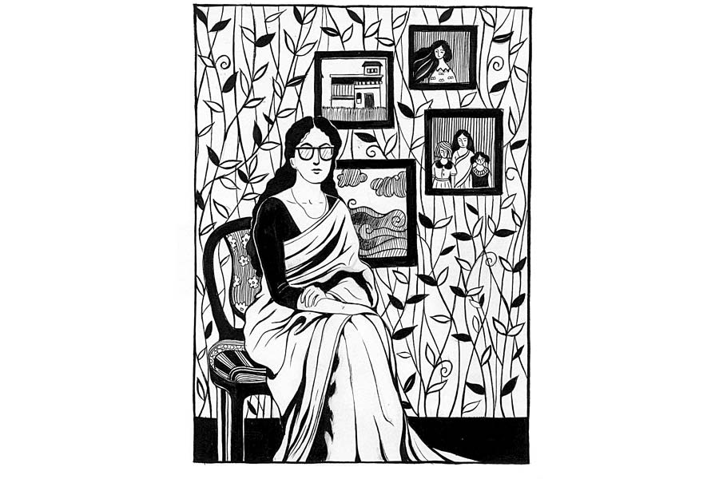

 
 <h1 align=center>বিবি সংবাদ</h1>
<h2 align=center>সোমজা দাস</h2> সিদ্ধান্তটা শেষ অবধি নিয়েই ফেললেন সুদক্ষিণা বটব্যাল। গোড়ার দিকটা না বললে পাঠক অবশ্য বুঝবেন না যে, সুদক্ষিণা বটব্যাল কেন এই বাহান্ন বছর বয়সে বিয়ে করবেন বলে মনস্থ করেছেন!     

তিন দশক আগের কথা। তখন সুদক্ষিণার বয়স সবে বাইশ। দীঘল চেহারা, নিটোল গড়ন। নাক-নকশা সুন্দর। কমলাদেবী গার্লস স্কুলে সদ্য চাকরি পেয়েছেন। সেই ধ্যাদ্ধেড়ে গোবিন্দপুরে। সত্যিই সে গ্রামের নাম গোবিন্দপুর। আর ধ্যাদ্ধেড়ে তো বটেই। পাকা রাস্তা, ইলেকট্রিসিটি, রিকশা কিছুই নেই। কলকাতা থেকে ট্রেনে বালি। সেখান থেকে এক ঘণ্টা বাস। তার পর আধ ঘণ্টা হাঁটা। কপাল ভাল থাকলে প্যাডেল-ভ্যান জোটে, যাকে লোকাল লোকেরা বলেন ‘হেলিকপ্টার’। প্রথম দিন এই অদ্ভুত নামকরণ শুনে নতুন জয়েন করা সহশিক্ষিকারা যখন হেসে লুটোপুটি খাচ্ছিলেন, সুদক্ষিণা শুধু ভুরু কুঁচকে বলেছিলেন, “ননসেন্স!”    

এর পিছনেও ইতিহাস আছে। সুদক্ষিণার বাবা ছিলেন বিলেত-ফেরত ব্যারিস্টার। বাড়িতে কাঁটা-চামচ ছাড়া খাওয়ার চল ছিল না। সুদক্ষিণা ও তার ভাইবোন সব গির্জার স্কুলে লেখাপড়া করেছে। ব্যারিস্টার সাহেব পঞ্চাশের আগেই পৃথিবীর মায়া কাটালেন। দেখা গেল ভদ্রলোক জীবনে ব্যয় করেছেন বেশি, বাড়িটা ছাড়া আর কিছু সঞ্চয় রেখে যেতে পারেননি। সুদক্ষিণা ভাইবোনদের মধ্যে সবচেয়ে বড়। সংসারের হাল ধরতে হল তাঁকেই। গম্ভীর সুদক্ষিণা আরও বেশি গম্ভীর হয়ে উঠলেন।  

কমলাদেবী ইশকুলে ইংরেজির মাস্টারনি হিসেবে যোগ দিয়েছিলেন সুদক্ষিণা। কিন্তু কার্যক্ষেত্রে দেখা গেল, ইশকুল আছে। ছাত্রী অপ্রতুল। কৈশোরে পা দেওয়ার আগেই গ্রামের মেয়েদের বিয়ে হয়ে যায় এখানে। ইংরেজি শেখা নিয়ে কারও মাথাব্যথা নেই। প্রৌঢ়া বড় দিদিমণি বললেন, “সেলাই-ফোঁড়াই জানো কিছু? তা হলে বরং সে সব শিখিয়ে দিয়ো একটু আধটু। মেয়েগুলোর লাভ হবে।”    

বছর খানেক সে ভাবেই কাটল। অন্য শিক্ষিকাদের সঙ্গে সুদক্ষিণার বন্ধুত্ব হল না মোটে। কার সঙ্গে মিশবেন তিনি? ওই যে অভয়া চাটুজ্জে, দুপুরে টিফিনে গপগপ শব্দ করে হাত দিয়ে ভাত খায়। নন্দা সামন্ত কথা বলতে গেলেই থুতু ছেটে। দেখেশুনে সুদক্ষিণা চোয়াল শক্ত করে বলেন, “আটারলি ডিসগাস্টিং!”

তবু সহ্য করে ছিলেন সুদক্ষিণা। কিন্তু সমস্যা এল সম্পূর্ণ ভিন্ন অভিমুখ থেকে। কমলাদেবী ইশকুলটি দুঃস্থ বটে, কিন্তু গোবিন্দপুরের ছেলেদের বিদ্যাভবন, শম্ভুচরণ বয়েজ় হাই স্কুলের এ অঞ্চলে বেশ নাম ডাক। সেখান থেকেই ব্যথা শুরু হল।   

দুই স্কুলের অ্যানুয়াল স্পোর্টস এক সঙ্গে হত। সে বার সুদক্ষিণার উপর দায়িত্ব পড়েছিল তাঁর স্কুলের মেয়েদের খেলার মাঠে সামলে রাখার। মেয়েরা সুদক্ষিণাকে ভয় করত। শুধু মেয়েরাই বা কেন, ইশকুলের দারোয়ান থেকে বড়দিদিমণি পর্যন্ত সকলেই অল্পবিস্তর ভয় তাকে পেতই। কিন্তু সেই লোকটা সুদক্ষিণাকে ভয় পাওয়া তো দূরের কথা, দেখা হতেই মুচকি হেসে বললেন কিনা, “তা আপনিই বুঝি বিলিতি মাস্টারনি?”    

যেমন চাষাড়ে কথাবার্তা, তেমনিই বিশ্রী ব্যবহার লোকটার! বয়স তিরিশের কমই হবে। শম্ভুচরণ বয়েজ়ের বাংলার মাস্টার।

“আমার নাম সুদক্ষিণা বটব্যাল,” কড়া গলায় বলেছিল সুদক্ষিণা।    

লোকটা হ্যা-হ্যা করে হেসে বলেছিল, “তা দিদিমণি তো দিব্যি বাংলা বলতে পারেন। তবে যে ছেলেরা বলে মেয়ে-স্কুলের ইংরেজি দিদিমণি ইস্কাবনের বিবির মতো খাঁটি মেমসাহেব! আমি তো ভাবলুম, ইংরেজি ছাড়া বুঝি বলেনই না। আমার আবার ইংরেজি তেমন মজবুত নয়। তাই ভয়ে ভয়ে ছিলাম।”

তার পর সারা দিন ধরে, “দিদিমণি বুঝি একেবারেই হাসেন না”, “দিদিমণির নাম শুনলেই আমার ছাত্ররা কেন এত ভয় পায় আজ বুঝলাম”, “আচ্ছা সারা ক্ষণ অমন ফটাস ফটাস করে ইংরিজি কইতে মুখে ব্যথা করে না?” বলে বলে মাথা খারাপ করে দিয়েছিল। বাধ্য হয়ে দিনের শেষে বলে বসেছিলেন সুদক্ষিণা, “আপনি বেজায় অসভ্য লোক তো! ভদ্রমহিলার সঙ্গে কী ভাবে বিহেভ করতে হয় জানেন না? গ্রামে থাকেন বলে বিন্দুমাত্র ম্যানার্স জানবেন না? আপনি না শিক্ষক?”

লোকটা দমেনি। খানিক ক্ষণ বড় বড় চোখে সুদক্ষিণার দিকে তাকিয়ে থেকে বলেছিল, “আরিব্বাস! আপনি সত্যিই এত কথা কইতে পারেন? আমি তো ভেবেছিলাম…”

ফুঁসে উঠেছিলেন সুদক্ষিণাও, “কী ভেবেছিলেন, আমি বোবা? আপনি নাগাড়ে বকবক করে যাবেন, আর আমি চুপটি করে সয়ে যাব?”

লোকটা উত্তর দিয়েছিল, “আরে না না, বোবা কেন হবেন? বালাই ষাট! না মানে… থাক…”

“থাকবে কেন? বলুন কী ভেবেছিলেন?” রুক্ষস্বরে প্রশ্ন করেছিলেন সুদক্ষিণা।

লোকটা মুচকি হেসে বলেছিল, “আপনাদের বড়দিদিমণি আমার কাকিমা হন। তা তিনি বলেন আপনি নাকি বড়লোকের বেয়াড়া, নাক-উঁচু, বদমেজাজি মেয়ে। কারও সঙ্গে মেশেন না। সকলকে তুচ্ছতাচ্ছিল্য করেন। তা দেখলাম, তেমন তো নয়। এই তো আমায় কত কথা বললেন।” 

সুদক্ষিণা কিছু ক্ষণ কটমট করে চেয়ে গটগট করে বেরিয়ে গিয়েছিলেন মাঠ ছেড়ে। পিছনে অসভ্য লোকটার খুকখুক হাসি কানে এসেছিল।   

এর কিছু দিন পর সরকারি ব্যাঙ্কে চাকরি পেয়ে কলকাতা ফিরে আসেন সুদক্ষিণা। তার আগে লোকটার নাম জানা হয়ে গেছিল। সত্যসুন্দর দত্ত। যেমন নাম, তেমনই ব্যবহার।

এর পর সময় বয়ে গেছে ঝড়ের বেগে। ছোট ভাইবোনদের মানুষ করা, বিয়ে দেওয়া, বৃদ্ধা মায়ের দেখাশোনা আরও সব দায়িত্ব শেষ করে যখন সুদক্ষিণা আয়নার দিকে তাকালেন, দেখলেন চুলের ফাঁকে রুপোলি রং ধরেছে। চোখের পাশে হাঁসের পায়ের ছাপ। মুখের ভাবে রুক্ষতা। যেন বড় ক্লান্ত চেহারা।

কিন্তু হলে কী হবে! সুদক্ষিণা জন্মগোঁয়ার। ভাঙবেন, কিন্তু মচকাবেন না। বন্ধু তাঁর কোনও কালেই ছিল না। অধস্তনরা তাঁকে ভয় পায়, সমবয়সিরা দূরে দূরে থাকে। বাবার বাড়িতে দুই ভাই পরিবার নিয়ে থাকে। বোনের বিয়ে হয়েছে দিল্লিতে। তার বড় সংসার। দিদির খোঁজ নেওয়ার সময় পায় না, প্রয়োজনও হয়তো বোধ করে না। বরং বৌদিদের সঙ্গে ফোনে গল্পগুজব প্রায়ই করে, জানে সুদক্ষিণা। বাবার অবর্তমানে অভিভাবক হতে গিয়ে কারও কাছের মানুষ তিনি হয়ে উঠতে পারেননি।          

এক সঙ্গে থাকতে থাকতে আজকাল ভাইবৌদের অসন্তোষ স্পষ্ট টের পান সুদক্ষিণা। তার ব্যক্তিত্বের সামনে কেউ সহজ হতে পারে না। সুদক্ষিণার অভিভাবকত্ব মেনে চলা তাদের পক্ষে কষ্টকর হয়।   

কয়েক মাস আগে থেকেই মনে হচ্ছিল, এ বার তল্পি গোটাতে হবে। সেই মতো রিয়াল-এস্টেট এজেন্টের থেকে ভাড়ার ঘরের খোঁজখবর রাখছিলেন। সেই এজেন্টই নিয়ে এসেছিল খবরটা। দক্ষিণ কলকাতায় দোতলা বাড়ি। দোতলায় মালিক একাই থাকেন। বয়স্ক মানুষ। বছর খানেকের মধ্যে রিটায়ার করবেন। একতলাটা ভাড়া দেওয়ার জন্য ভাল পরিবার খুঁজছেন।    

রবিবার এজেন্টের সঙ্গে বাড়িটা দেখতে গেলেন সুদক্ষিণা। এখনও কাউকে কিছু জানাননি। বাড়ি পছন্দ হলে জানাবেন। গলির ভেতর ছোটখাটো বাড়ি, বেশ ছিমছাম। গৃহকর্তার রুচির প্রশংসা করতে হয়।

ডোরবেল টিপতে যিনি দরজা খুললেন, তাকে দেখে খানিক ক্ষণ ভুরু কুঁচকে তাকিয়ে রইলেন সুদক্ষিণা। বয়সের কিছু চিহ্ন ছাড়া চেহারায় খুব বেশি বদল হয়নি। হাসিটা এখনও সেই আগের মতোই ফিচেল। সত্যসুন্দর বললেন, “আপনার জন্যই অপেক্ষা করছিলাম।”

“আপনি জানতেন আমি আসব?” সবিস্ময়ে জিজ্ঞেস করলেন সুদক্ষিণা।

মাথা নেড়ে হাসলেন সত্যসুন্দর, “এজেন্টের মুখে নাম শুনেই চিনেছি।” 

কথায় কথায় দ্রুত কেটে গেল সময়। এজেন্ট ছোকরা ভাবছিল, তার দক্ষিণাটা না ফসকে যায়। সত্যসুন্দর তাকে আশ্বস্ত করে বিদায় করলেন।  

“বিয়ে করেননি?” কেন কে জানে জিজ্ঞাসা করে ফেললেন সুদক্ষিণা।

“আপনি কেন করেননি?” সত্যসুন্দরও হেসে জিজ্ঞেস করলেন।

“আমার কারণটা আলাদা। দায়দায়িত্ব ছিল,” বললেন সুদক্ষিণা।

“আমি করেছিলাম। বিয়ের এক বছরের মধ্যে বাচ্চা হতে গিয়ে বৌ মারা গেল। সেই থেকে একাই আছি, দিব্যি আছি,” বললেন সত্যসুন্দর।    

“কলকাতায় এলেন কবে?” জানতে চাইলেন সুদক্ষিণা।

“স্ত্রী মারা যেতে মন টিকছিল না গোবিন্দপুরে। বদলি নিয়ে চলে এলাম। আপনার ঠিকানা ছিল আমার কাছে। সাহস হয়নি দেখা করার।”

“আমার ঠিকানা? কী করে পেলেন?” অবাক হন সুদক্ষিণা।

সত্যসুন্দর হেসে বললেন, “ভুলে গেলেন? আপনার স্কুলের বড়দিদিমণি আমার কাকিমা!” 

সুদক্ষিণা অবাক চোখে তাকালেন সত্যসুন্দরের মুখের দিকে। ফিচেল হাসিটা ঠোঁটের কোণে লেগে আছে এখনও। মনে পড়ে গেল গোবিন্দপুর থেকে চলে আসার আগের দিন সন্ধেয় সত্যসুন্দরের বলা কথাগুলো।

সে সময় কেমন একটা বিষণ্ণতা আচ্ছন্ন করে ফেলেছিল সুদক্ষিণাকে। বার বার মনে হচ্ছিল, গোবিন্দপুর থেকে চলে গেলে এখানকার কথা খুব মনে পড়বে। আর মনে পড়বে হাড়জ্বালানে, গায়ে-পড়া লোকটার কথা! ভাবতে ভাবতে বাড়ির দিকে এগোচ্ছিলেন। ঠিক তখনই সত্যসুন্দর এসে দাঁড়িয়েছিলেন সামনে।   

“চলে যাচ্ছেন?”    

“হুম!”

“বেশ। আবার দেখা হবে,” মুচকি হেসে বলেছিলেন তিনি।

“না। কোনও দিনই দেখা হবে না,” জোর দিয়ে বলেছিলেন সুদক্ষিণা।

“হবে।”

সত্যসুন্দর চলে যেতে সে দিন সুদক্ষিণার চোখদুটো কী অজ্ঞাত কারণে জ্বালা করে উঠেছিল। কাঁপা গলায় বলেছিলেন, “ইনকরিজিবল!”

আজ মুখোমুখি বসে সত্যসুন্দর জিজ্ঞেস করলেন, “দেখা হল তো?”

সুদক্ষিণা চোখ নামালেন। ঠোঁটে হাসি টলমল করছে তাঁর। নিজেরই মনে হল, বহু যুগ পরে হাসলেন তিনি! 

সুদক্ষিণা আর সত্যসুন্দর বিয়ে করবেন সিদ্ধান্ত নিয়েছেন। সত্যসুন্দর শুধু বলেছিলেন, “ইংরেজিতে কিন্তু আমি এখনও দড় নই।” শুনে সুদক্ষিণা লাজুক হেসে বলেছিলেন, “আমি বাংলা বলতে জানি।”   

বাড়ি ভাড়া নেওয়ার আর দরকার পড়েনি সুদক্ষিণার। তবে এজেন্টের দক্ষিণাটা মিটিয়ে দিয়েছেন তিনি। সুদক্ষিণার ভাইবোনদের মত মেলেনি অবশ্য। বড় ভাই মুখের উপরেই বলেছিল, “এই বয়সে আর লোক হাসানোর দরকারটা কী?”    

সুদক্ষিণা উত্তর দেননি। শুধু মুচকি হেসেছিলেন। বাড়িসুদ্ধ লোক হাঁ করে তাকিয়েছিল তাঁর মুখের দিকে।

সুদক্ষিণা যে হাসতেও পারেন, এর আগে কে কবে জানত!