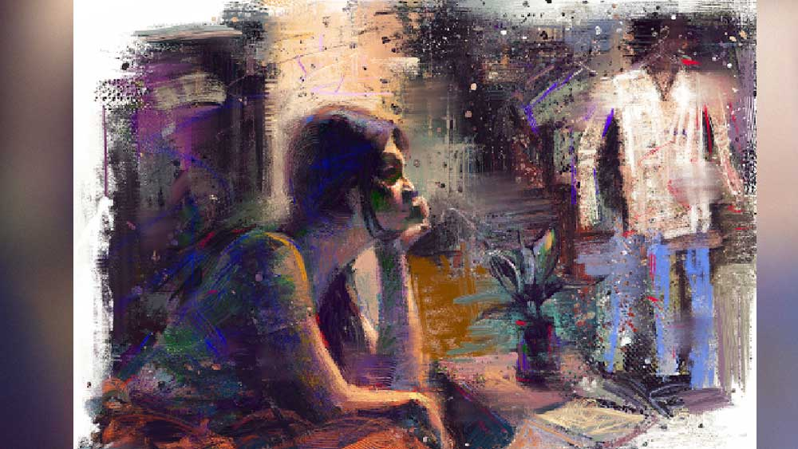

 

<h1 align=center>বিভূতি অথবা...</h1>
<h2 align=center>অভিজিৎ তরফদার</h2>
ব   াইরে বেশ ঠান্ডা। অথচ সোয়েটার, শাল, কিছুই গায়ে দেয়নি বিভূতি। বেরনোর সময় পইপই করে বলল। কানে কথা তুললে তো! বয়স হচ্ছে। আলটপকা ঠান্ডা লেগে গেলে তখন ভোগাবে। ভাবতে ভাবতে পাশে হাঁটছিল মিতালি। হঠাৎ নিঃশ্বাস বন্ধ হয়ে গেল।   বিভূতির বাঁ হাতের কনুইয়ের কাছটা খপ করে ধরল মিতালি। বিভূতি তাকাল, “কী হল? হোঁচট খেলে নাকি? দেখে পা ফেলো।”   মিতালি আঙুল তুলে দেখাল। বিভূতি আঙুল লক্ষ করে দেখবার চেষ্টা করে বলল, “কী দেখাচ্ছ? কিছু দেখতে পেলাম না তো?”   পাশেই বিয়েবাড়ি। বিয়েবাড়ির গেট। গেটের ওপর আলো। আলো জ্বলছে-নিভছে। আর সেই আলোয় ফুটে উঠছে— ‘মিতালি ওয়েড্স বিভাস’। বাংলা করলে, মিতালি বিভাসকে বিয়ে করছে।   বিভূতি দ্বিতীয় বার প্রশ্নটা করলে মিতালি বলল, “কিছু না, চলো।”   তবু বিভূতির পাশে হেঁটে যেতে যেতে যতক্ষণ দেখা যায়, লেখাটা পড়তেই থাকল মিতালি, ‘মিতালি ওয়েড্স বিভাস’...   মিতালি তখন সদ্য গ্র্যাজুয়েট। সম্বন্ধটা আসতে বাবা দু’বার ভাবেনি। বলেছিল, “হলই বা তেমন লেখাপড়া-না-জানা। খোঁজ নিয়েছি, সৎ চরিত্রবান ছেলে। বাবার ফেলে যাওয়া ব্যবসা নিজে পরিশ্রম করে দাঁড় করিয়েছে। বাবা-মার একমাত্র সন্তান, দায় বলতে কিছু নেই। এমন পাত্র আমি হাতছাড়া করতে চাই না।”   মিতালি এসে দেখেছিল বাবা খুব একটা ভুল বলেনি। দিনে আট-দশ কাপ চা ছাড়া কোনও নেশা নেই। আর হ্যাঁ, পুরনো দিনের সিনেমা, ‘সপ্তপদী’, ‘হারানো সুর’, ‘পথে হল দেরী’ হলে রিলিজ় করলে সঙ্গে সঙ্গে দেখা চাই। তবে একা নয়, সঙ্গে মিতালিকে নিয়েই দেখতে ভালবাসে বিভূতি। টিভি-তে ছোট স্ক্রিনে সিনেমা দেখে মন ওঠে না বিভূতির।   বিয়ের বছরচারেকের মধ্যে বিভূতির মা-ও হঠাৎ করে চলে গেলেন। প্রথম দিকে অসহায় লাগলেও সামলে নিল মিতালি। ততদিনে এসে গিয়েছে নতুন অতিথি মিষ্টু। তাকে নিয়ে ব্যস্ততার মধ্য দিয়ে কয়েকটা বছর কোথা দিয়ে যে কেটে গেল টেরই পায়নি। সেও এখন আর ছোট নেই। দক্ষিণ ভারতে ডাক্তারি পড়ে। একগাদা টাকা খরচ করে ডাক্তারি পড়ানোর পেছনেও বিভূতির অঙ্ক আছে। বিভূতির ওষুধের দোকান। সেখানে ডাক্তার বসলে ব্যবসা ডবল ইঞ্জিনে হু হু করে ছুটবে।   সবই ঠিক আছে, কিন্তু...   ওই ‘কিন্তু’টাই মিতালির মাথা থেকে যাচ্ছে না। সেই বিয়েবাড়ি, আর বিয়েবাড়ির গেটে জ্বলতে নিভতে থাকা লেখা— ‘মিতালি ওয়েড্স বিভাস’।   খাবার টেবিলে বসে রুটি-তরকারি দিয়ে জলখাবার সারছিল বিভূতি। মুড়ি-চিঁড়ে-রুটি-তরকারি এসবই বিভূতির বেশি পছন্দ। নীচে লুঙ্গি, ওপরে একখানা শাল। গ্রীষ্মকালে শালখানাও থাকে না। ফুলস্পিডে ফ্যান চালিয়ে খালি গায়ে বসে খাবার খায়। লোমশ পিঠের ওপর ফোঁটা ফোঁটা ঘাম জমে ওঠে।   দেখতে দেখতে হঠাৎ একটা চিন্তা মাথায় এল মিতালির। আচ্ছা, বিভাসও কি লুঙ্গি পরে? খালি গায়ে বসে জলখাবার খায়? বিভাসেরও কি পিঠভর্তি থোকা থোকা লোম? খেয়ে উঠে বিভাসও কি বিভূতির মতোই ‘ঘেউ’ করে ঢেঁকুর তোলে?   জামাকাপড় পাল্টে বেরোবার সময় ঠাকুরের ছবির সামনে হাতজোড় করে দাঁড়ানো অভ্যেস বিভূতির। প্যান্টের ওপর শার্ট পরেছে। শার্টটা গুঁজে পরা নয়। ভুঁড়ির ওপর ঝুলছে। আচ্ছা, বিভূতি যদি শার্টখানা প্যান্টের মধ্যে গুঁজে দেয়, ভুঁড়িটা কি তা হলে ছোট মনে হবে? প্যান্টে একটা বেল্ট লাগালে কেমন হয়?   দরজার পাশেই জুতোর স্ট্যান্ড। সেখান থেকে চামড়ার চপ্পলখানা পায়ে গলিয়ে বেরোতে বেরোতে বিভূতি বলল, “বেরোলাম। ফিরতে দেরি হতে পারে, চিন্তা কোরো না।”   বিভূতির পায়ের দিকে তাকিয়ে মিতালির মনে হল, প্যান্টের সঙ্গে চটি একদম মানায় না। শু হলেই ভাল হত। শীতকালে পা দুটো ঢাকা থাকে। অবশ্য দু’-তিনজোড়া মোজাও কিনতে হবে। মুশকিল একটাই, বিভূতিকে রাজি করানো।   বিভূতি গলির মুখ অবধি পৌঁছলে দরজা বন্ধ করে ভেতরে ঢুকল মিতালি। আর তখনই মনে হল, বিভাসও নিশ্চয়ই প্যান্ট-শার্টই পরে। আজকাল বিয়েবাড়ি ছাড়া ধুতি-পাঞ্জাবি পরার চল প্রায় নেই। কিন্তু নীচে? বিভাসও কি চপ্পলই পরে?   ক’টা দিন যেতে না যেতেই মিতালি দেখল, বিভূতি নয়, এমনকি মিষ্টুও নয়, সে সারাদিন বিভাসের কথাই ভাবছে।   বিভাস কি ফর্সা? নাকি বিভূতির মতোই কালো? বিভাসের হাইটও কি পাঁচ ফুট আট ইঞ্চি? বিভূতির মতো বিভাসও কি ব্যাকব্রাশ করে চুল আঁচড়ায়? বিভূতির আজকাল মাথার সামনের দিকে টাক পড়তে শুরু করেছে। বিভাসের তো বয়স কম, নিশ্চয়ই এখনও মাথাভর্তি চুল। বিভাস কি রোগা? রোগা না হোক, ছিপছিপে তো নিশ্চয়ই। বিভূতির মতো ভুঁড়ি যে ওর এখনও হয়নি, তা মিতালি দিব্যি করে বলতে পারে। বিভাসও কি পুরনো বাংলা সিনেমার পোকা? বিভাসের প্রিয় নায়ক কে? বিভূতির চোখে উত্তম কুমারের পর আর কোনও নায়ক জন্মায়নি। বিভাসও কি তাই? সৌমিত্রকে ভাল লাগে বিভাসের? এখনকার হিরো? হৃতিক রোশনকে পছন্দ করে বিভাস?   স্নান করে গালে ক্রিম ঘষতে ঘষতে মিতালির মনে পড়ল, বলে বলেও বিভূতিকে ক্রিম বা ময়েশ্চারাইজ়ার ব্যবহার করাতে পারেনি। ডিওডোর‌্যান্ট-পারফিউমেও বিভূতির বিস্তর আপত্তি। তাই কাছাকাছি হলে বিভূতির ঘামের গন্ধই নাকে লেগে থাকে মিতালির।   বিভাস নিশ্চয়ই পারফিউম ব্যবহার করে। নিদেনপক্ষে ডিওডোর‌্যান্ট। বিভাস আর মিতালি যখন ঘনিষ্ঠ হয়, পারফিউমের গন্ধে চোখ জড়িয়ে আসে মিতালির।   ভাবতে গিয়েই মিতালি দেখল, তারও হাত কাঁপছে। বুকের ভেতর ঢিবঢিব শব্দ।   তাড়াতাড়ি ভাবনাটাকে সরিয়ে ফোনের কাছে গেল। মিষ্টুকে ধরল।      যে প্রশ্নটা ক’দিন ধরেই মিতালিকে তাড়া করে ফিরছে, এবার সেটার মুখোমুখি দাঁড়াল মিতালি।   মানুষ হিসেবে বিভূতি খারাপ নয়। কেয়ারিং। মিতালি ছাড়া অন্য কেউ বিভূতির জীবনে আছে তাও নয়। কিন্তু সেটাই কি সব? বিভূতির স্বভাবে অনেক কিছুই আছে, যা মিতালি মেনে নিয়েছে। কিন্তু মেনে নেওয়া আর পছন্দ করা তো এক জিনিস নয়।   খেতে বসে মুখে চকাম চকাম করে আওয়াজ করে বিভূতি। অনেক ক্ষণ কথা বললে বিভূতির কষে থুতু জমে। ঘুমোলে প্রচণ্ড জোরে বিভূতির নাক ডাকে। চেষ্টা করলেও বিভূতি এগুলো পাল্টে ফেলতে পারবে না। তবে এমন কিছু দোষ বিভূতির আছে, যেগুলোকে দোষ বলে না ধরলেও চলে, কিন্তু সেগুলো তার খারাপ দিক অবশ্যই। সেগুলো কি বিভূতি পাল্টে ফেলতে পারে না?   মিতালি তো পেরেছে। সচেতনভাবে নিজেকে বদলেছে। বিয়ের পর প্রথম ক’টা বছর লেগেছে গা থেকে ঘষে ঘষে জনাই রোড তুলে ফেলতে। মুখের ফাউন্ডেশন থেকে চোখের মাস্কারা, সবেতেই মিতালি এখন অন্য মিতালি। হাঁটা-চলা, পছন্দ-অপছন্দ, হাবভাব সব মিলিয়েই বদলে গেছে সে। আগের মিতালিকে যারাই দেখেছে, এখন দেখলে আর চিনতেই পারবে না। হাঁটাচলা, হাবভাব, পছন্দ-অপছন্দ বদলেছে তো বটেই,  কথাবার্তাতেও মিতালি এখন অনেক চৌখস। নিয়মিত সিরিয়াল দেখে আর পুজোসংখ্যার গল্প উপন্যাস পড়ে মিতালি বুঝতে পেরেছে, কথার মধ্যে একটা দুটো ইংরেজি শব্দ ঠিকমতো ঢুকিয়ে দিতে পারলে স্মার্টনেস আসে। সেইভাবে মিতালিও নিজেকে তৈরি করে নিয়েছে।   প্রশ্ন হল, মিতালি পেরেছে, তা হলে বিভূতিই বা পারবে না কেন?   উত্তরটা মিতালিই দেয়, পারবে। পারতে হবে। মিতালি বিভূতিকে 
হেল্প করবে।   পরদিন সকাল। রোজকার মতো খেতে বসতে যাচ্ছে বিভূতি, কোলের ওপর ধপাস করে কী একটা পড়ল। বিভূতি দেখল, পাজামা-পাঞ্জাবি। পাশে সরিয়ে রাখতে যাচ্ছে, এমন সময় মিতালি হামলে পড়ল, “কী হল? পাশে রাখছ যে! লুঙ্গিটা খুলে পাজামা পরে নাও। আজ থেকে আর বাড়িতে লুঙ্গি নয়, পাজামা পাঞ্জাবি।”   বেরনোর সময় বিভূতি দেখল, জুতোর তাকে নতুন একজোড়া শু। চপ্পলটা খুঁজতে যাচ্ছে, মিতালি আবার সামনে, “না, আর চটি নয়। এবার থেকে জুতো। পায়ে গলাও। দেখি মাপে ঠিক হল কি না।”   একটা মোটা ফ্রেমের চশমা পরে বিভূতি। কিছুদিন হল ছোট লেখা পড়তে চশমা লাগছে। চশমাটা কোথাও খুঁজে পাচ্ছে না, সামনে এসে দাঁড়াল মিতালি।   “কী খুঁজছ?”   “আমার চশমাটা...”   “এই নাও। নতুন ফ্রেম। মাপটাও বদলে এনেছি। এবার থেকে এই চশমা, এই খাপ। মনে থাকে যেন।”   জীবনেও প্যান্টে গুঁজে শার্ট পরেনি বিভূতি। মিতালি নিজেএকদিন প্যান্টের মধ্যে শার্ট গুঁজে দিয়ে একটা নতুন কেনা বেল্ট কোমরে পরিয়ে দিয়ে বিভূতিকে বলল, “যাও এবার আয়নার সামনে দাঁড়িয়ে দেখো। নিজেকে চিনতেই পারবে না।”   বিভূতি মানুষটা প্রকৃতিগতভাবে শান্ত। ঝগড়াঝাঁটি পছন্দ করে না। মিতালি যেভাবে সংসারটা চালায়, তাতে বিভূতি মনে মনে কৃতজ্ঞতাই পোষণ করে। তা ছাড়া মিতালি বৌ হয়ে আসার পর থেকেই তার ব্যবসার বাড়বাড়ন্ত। তাই বিরক্ত হলেও মিতালির নতুন উৎপাত মেনেই নিয়েছিল বিভূতি। তবু একদিন জিজ্ঞেস করেই ফেলল।   বিভূতির চুলে আজকাল পাক ধরেছে। সঙ্গে টাক পড়ে যাওয়ায় হঠাৎই যেন বয়সটা বেশি দেখায়। মিতালি নিজেই একদিন বিভূতির চুল ডাই করে দিল। তার পর চিরুনি এনে বিভূতির পাট করা চুল নিজেই আঁচড়ে পিছিয়ে গিয়ে ঘুরিয়ে ফিরিয়ে দেখে বলল, “হেয়ারস্টাইলটা বদলে দিলাম। দেখবে? দাঁড়াও, আয়নাটা নিয়ে আসি।”   হাত-আয়নাটা মিতালিকে ফেরত দিয়ে বিভূতি বলল, “একটা প্রশ্ন করব?”   “করো, তার আগে বলো কেমন দেখাচ্ছে?”   “ভাল।”   “ভাল মানে! দুর্দান্ত। অন্য রকম। অনেক ইয়াং। মনে হচ্ছে বয়স দশ বছর কমে গিয়েছে।”   “এবার প্রশ্নটার উত্তর দাও।”   “বলো, কী প্রশ্ন?”   “এই পুতুলখেলা আর কত দিন চলবে?”   “কেন, তোমার খারাপ লাগছে?”   “খারাপ-ভালর কথা নয়। ক্লান্ত লাগছে। অনেক দিন তো হল। আর পারা যাচ্ছে না। তা ছাড়া, যখনই আয়নায় নিজেকে দেখি, চিনতে পারি না। মনে হয়, এই লোকটা বিভূতি সরখেল হতেই পারে না।”   “ঠিক বলেছে তো!”   চোখদুটো জ্বলজ্বল করে উঠল মিতালির। কাছে ঘেঁষে এল বিভূতির। ডিওডোর‌্যান্টের গন্ধ নিল বুক ভরে। তার পর চোখে চোখ রেখে আদুরে গলায় প্রশ্ন করল, “এবার আমি একটা প্রশ্ন করি?”   “একটা কেন, দশটা প্রশ্ন করো।”   “তোমাকে যদি ‘বিভাস’ বলে ডাকি, মাইন্ড করবে?”      