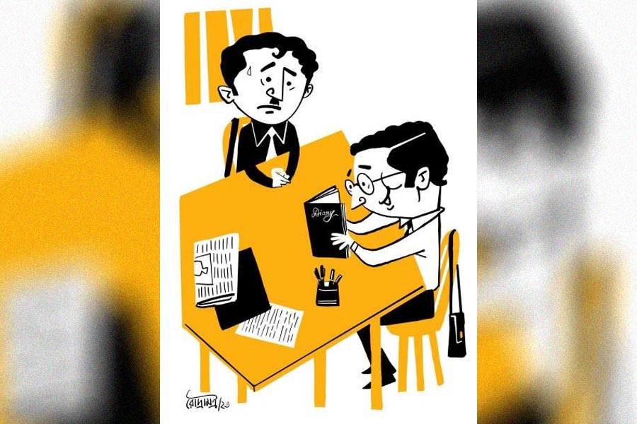

 
 <h1 align=center>বিমলবাবুর কাব্যচর্চা</h1>
<h2 align=center>চঞ্চলকুমার ঘোষ</h2> বিমলবাবু সরকারি অফিসে চাকরি করেন। পৈতৃক বাড়ি, বাপ-ঠাকুরদা যা রেখে গিয়েছেন, সঙ্গে নিজের আয়— সব মিলিয়ে সচ্ছল অবস্থা। বাড়িতে স্ত্রী রমা আর বারো বছরের ছেলে ঐশিক। সুখী সংসার। বছরে দু’তিন বার বেড়াতে যাওয়া ছাড়া কোনও নেশা নেই বিমলবাবুর। বিয়ের আগে একটু বই পড়ার অভ্যেস ছিল, এখন খবরের কাগজ আর অফিসের ফাইল ছাড়া কিছু পড়া হয়ে ওঠে না। অফিস থেকে বাড়ি ফিরে রাতের খাওয়া পর্যন্ত টিভি সিরিয়াল ছেড়ে নড়েন না বিমলবাবু।

সেই মানুষটার হঠাৎ পরিবর্তন। অফিস থেকে ফিরে বিমলবাবু এখন খাতা-কলম নিয়ে বসে পড়েন। টিভি সিরিয়াল একেবারে বন্ধ। প্রথম কয়েক দিন রমা আশ্চর্য হয়ে গিয়েছিলেন। মানুষটার হলটা কী! পনেরো বছর হল তাদের বিয়ে হয়েছে, এমন তো আগে হয়নি।

দিন দশেক আগেকার কথা। বিমলবাবুর অফিসে একটা সাংস্কৃতিক অনুষ্ঠান ছিল। সেই উপলক্ষে আমন্ত্রণ করা হয়েছিল বিশিষ্ট কবি অরুণকিরণ রায়কে। সামনে থেকে কোনও দিন কোনও কবি-সাহিত্যিক দেখেননি বিমলবাবু। নিজের কয়েকটা কবিতা আবৃত্তি করলেন কবি। অফিসের সকলেই মন্ত্রমুগ্ধ। সবচেয়ে আশ্চর্য, অফিসের বড়সাহেব, যাঁর দাপটে বাঘে গরুতে এক ঘাটে জল খায়, তিনিও বিগলিত কবিকে দেখে।

বাড়ি ফিরে একটা কথাই বার বার মনে হচ্ছিল বিমলবাবুর, অফিসের ফাইল ঘেঁটে আর টাকাপয়সার হিসাব করে এতগুলো বছর কাটিয়ে, না পেলেন সম্মান, না পেলেন খাতির। অন্যের কাছে কম্পিউটার-ক্যালকুলেটরের মতো আজ তিনিও একটা যন্ত্র ছাড়া আর কিছু নন।

রাতে ভাল ঘুম হল না। ভোর হতেই উঠে পড়লেন। বারান্দায় চেয়ার পেতে বসলেন। সামনের বাগানে জবাগাছে ফুল ফুটেছে। হঠাৎ মনে হল যদি কবি এই ফুল দেখতেন, তা হলে কী করতেন? শুধু কি দেখতেন, না কিছু লিখে ফেলতেন! অনেক ক্ষণ ভেবেচিন্তে মনে হল, কবি নিশ্চয়ই এই ফুল দেখে নিশ্চয়ই দশ লাইনের একটা কবিতা লিখে ফেলতেন।

উঠে পড়লেন বিমলবাবু। আলমারিতে রাখা নতুন ডায়েরি আর কলম নিয়ে ফিরে এলেন। চুপ করে বসে রইলেন। জুতসই কোনও লাইন মনে পড়ছে না। ভাবছেন অনেক কিছু। কোনওটাই মনে ধরছে না। কেমন অস্থির লাগে। মাথার ভিতরটা দপদপ করে ওঠে। বিমলবাবুর মনে হল, এখন আর লেখা হবে না। কলম বন্ধ করে উঠে পড়লেন।

সব কবিরই কি প্রথম দিকে এই রকম হয়? কোনও কবির সঙ্গেই বিমলবাবুর পরিচয় নেই যে, প্রশ্ন করে জানবেন। একটা উপায় হতে পারে, কবি ভদ্রলোক যিনি অফিসে এসেছিলেন, কথাবার্তা শুনে বেশ ভাল বলেই মনে হয়েছে। ওঁর পরামর্শ নেওয়া যেতে পারে।

অফিসে জিজ্ঞেস করতেই জানা গেল, ডেসপ্যাচ সেকশনের অনিলের সঙ্গে কবির আলাপ আছে। অনিল নিজেও কবিতা লেখে। আগের বছর বইমেলায় কবিতার বই বেরিয়েছে। একটু ভেবে নিলেন বিমলবাবু। এখন নিজের কথা বলা যাবে না। অন্য কারও কথা বলতে হবে। কাজ করছিল অনিল। তার সামনে বসে বললেন, “একটা কথা ছিল অনিল। শুনলাম তুমি কবিতা লেখো?”

 অনিল অমায়িক হেসে বলল, “ওই আর কী। গত বছর একটা বই বার করেছি। নাম রেখেছি ‘কাকের মতো হতে চাই’। এ বছর বইমেলায় আর একটা কবিতার বই বার করার ইচ্ছে আছে। দেখা যাক কী হয়।”

একটু ইতস্তত করেন বিমলবাবু, “আসলে আমার ভাইপো একটু-আধটু কবিতা লেখে।”

সঙ্গে সঙ্গে অনিল বলে, “আপনার ভাইপোকে আমার কাছে পাঠিয়ে দেবেন বিমলদা। আমি শিখিয়ে দেব কী করে কবিতা লিখতে হয়।”

এ বার কী বলবেন ভেবে পান না বিমলবাবু। বললেন, “কী জানো অনিল, ভাইপো ভীষণ মুখচোরা আর লাজুক। তুমি বরং আমাকে বলো, আমি ভাইপোকে বলে দেব।”

অনিল মুখ তুলে খোলা জানালা দিয়ে বাইরের দিকে তাকিয়ে স্থির হয়ে গেল। কোনও নড়াচড়া নেই। চোখের দৃষ্টি স্থির। বিমলবাবুর মনে হল, এই হচ্ছে আসল কবির ভাব। কয়েক মিনিট পর বিমলবাবুর দিকে মুখ ফেরাল অনিল। যেন ভাবের রাজ্য থেকে বাস্তবে নেমে এল। ঠোঁট ফাঁক হয়ে একটা শব্দ বেরোল, “অপূর্ব!”

কী অপূর্ব, বুঝে উঠতে পারেন না বিমলবাবু। আড়চোখে এক বার সারা ঘরে চোখ বুলিয়ে নিলেন। অপূর্ব কোনও কিছুই চোখে পড়ল না তাঁর। আমতা আমতা করে জিজ্ঞেস করলেন, “কী অপূর্ব, অনিল?”

“কিছু নয়। শুধু একটা শব্দ। এই ‘অপূর্ব’ শব্দটা দিয়েই আপনি একটা কবিতা লিখতে পারেন। যেমন,

কী অপূর্ব তুমি লীলাময়ী!

গ্রীষ্মের দিনে তাজা ম্যাঙ্গোর শরবত।

গরম দুধের মাঝে ভাজা সেমোলিনা,

শীতের সন্ধ্যায় লালুর দোকানের গরম ফিশফ্রাই

কিংবা হাইড্রেনের ধারে ফোটা ডবকা হাসনুহানা

কী অপূর্ব তুমি! দুনিয়ায় খুঁজে দেখি, নেই তো তুলনা!

কবিতা শেষ করেই বিমলবাবুর কাঁধে চাপড় মারল অনিল, “কী রকম লাগল বিমলদা?”

বিমলবাবু বিগলিত হাসি ছড়িয়ে বললেন, “তোমার মধ্যে এত প্রতিভা! জানতামই না ভাই।”

লজ্জা পায় অনিল, “ওই আর কী! ভাবছি দু’তিনটে কবিতার বই বেরিয়ে গেলে চাকরি ছেড়ে দেব। বড় কবি হওয়ার জন্য অনেক কিছু ত্যাগ করতে হয়। দাঁড়ান, আমার একটা কবিতার বই আপনাকে দিই। অফিসে কাউকে দেখাবেন না। সব শালা আমায় হিংসে করে।”

সন্ধেয় বাড়ি ফিরে অনিলের কবিতার বইটা নিয়ে বসলেন। মন দিয়ে পড়ে মনে হল আরও পড়তে হবে। পরের দিন অফিস থেকে বেরিয়ে সোজা কলেজ স্ট্রিট। দু’হাজার টাকার কাব্যগ্রন্থ কিনে বাড়ি ফেরেন বিমলবাবু। মাইকেল থেকে জীবনানন্দ। কবিতা পড়তে-পড়তে কেমন ভাব জাগে। কী সুন্দর পরপর শব্দ সাজিয়ে লিখেছেন কবিরা। মনে হল, চেষ্টা করলে তিনিও পারবেন।

রবিবার দুপুরে খেয়েদেয়ে শুয়ে ছিলেন বিমলবাবু। হঠাৎ একটা শব্দ মনে আসতেই এক লাফে বিছানা থেকে উঠে ডায়েরি বার করে লিখে ফেলেন, ‘ললনা’। তার পর লেখেন,

‘হে সুন্দরী ললনা, তব ওষ্ঠপ্রান্তে

আমি এঁকে দিই চকিত চুম্বন…’

তার পরই আটকে যায় কলম। মনের ভিতরে কবিতাটা কেমন হাঁকুপাঁকু করে। কিন্তু একটাও শব্দ আসে না। সব বড় কবিরই নিশ্চয় এই রকম হয়। এ তো টুথপেস্ট নয়, চাপ দিলেই হুড়হুড় করে বেরিয়ে আসবে। ডায়েরি বন্ধ করে উঠে পড়লেন। তার পরই মনে হল, ভাষাটা কি পুরনো-পুরনো লাগছে? ‘চকিত চুম্বন’-এর জায়গায় ‘চকাস হামি’ হলে কি বেটার হত? ঠিক বুঝতে পারলেন না।

মাসখানেক যেতেই বিমলবাবু বুঝলেন, ব্যাপার ততটা জটিল নয়। গত এক মাসে বেশ কয়েকটা কবিতা লিখেছেন। দু’-এক বার রমাকে শোনানোর চেষ্টা করেছেন। হেসেই গড়িয়ে পড়েছে রমা, “তুমি কবিতা লিখছ, আমার কী হবে গো!”

ওইখানে ব্যাপারটায় ইতি টেনেছেন বিমলবাবুর। ভিতরে চাপা উদ্বেগ। কবিতাগুলো কেমন হচ্ছে, যদি কারও একটু মতামত পাওয়া যেত। চেনাজানার মধ্যে আছে একমাত্র অনিল। ছেলেটা ভাল, ওকে দেখানো যেতে পারে। অফিসে টিফিনে অনিলের কাছে গিয়ে বসলেন বিমলবাবু। চার দিকে চেয়ে নিয়ে বললেন, “অনিল, তোমার সঙ্গে একটা দরকারি কথা আছে। কেউ যেন কিছু জানতে না পারে।”

“নিশ্চিন্তে থাকুন বিমলদা, কেউ কিছু জানবে না। কী হয়েছে?”

ব্যাগ থেকে ডায়েরিটা বার করলেন বিমলবাবু। চাপা গলায় বললেন, “এতে কয়েকটা কবিতা আছে। কেমন হয়েছে একটু বলবে?”

মুখটা গম্ভীর করে বিমলবাবুর দিকে চেয়ে অনিল বলল, “সত্যি কথা বলুন তো বিমলদা, কার কবিতা?”

নতুন বৌয়ের মতো লাজে রাঙা বিমলবাবু বললেন, “আমারই।”

সঙ্গে সঙ্গে টেবিল চাপড়ে ওঠে অনিল, “এই খবর এত দিন চেপে রেখেছিলেন আমার কাছে!”

“আসলে শখের লেখা, বুঝতেই পারছ, কাউকে পড়াইনি। তুমি যদি দেখে একটু বলো।”

একটা-একটা করে পাতা ওল্টায় অনিল। আট-দশটা কবিতা পড়ে বলে, “দাদা কী লিখেছেন!”

বিমলবাবুর মুখ শুকিয়ে যায়, “কেন ভাই, কিছু হয়নি?”

চোখ গোল গোল করে অনিল বলে, “আপনার পায়ের ধুলো নিতে হয় দাদা। এই প্রতিভা এত দিন লুকিয়ে রেখেছিলেন! কী কবিতা! যেমন ভাব, তেমনি ভাষা। আর ছন্দ! শক্তি, সুনীলের পর এত ভাল কবিতা আমি পড়িনি দাদা।”

আবেগ আর উচ্ছ্বাসে কী বলবেন, ভেবে পান না বিমলবাবু। খপ করে অনিলের হাতটা চেপে ধরে বললেন, “তুমি সত্যি বলছ?”

“কবি হয়ে কি কবিকে মিথ্যে বলতে পারি! আমার কথা বিশ্বাস না হলে অন্য কাউকে পড়াতে পারেন।”

“না না, কাউকে পড়াতে হবে না। তুমি বলেছ তাতেই হবে।”

“দাদা, একটা কথা বলি। আপনি আরও কবিতা লিখুন। গোটা পঞ্চাশ হলেই বইমেলায় আপনার কবিতার বই বার করে দেব।”

“আমার কবিতার বই? কী বলছ তুমি! কী করে বই বার করব?”

“ও সব দায়িত্ব আমার। আপনি শুধু লিখে যান। কে বলতে পারে, প্রথম বইটাই হয়তো অ্যাকাডেমি পুরস্কার পেয়ে গেল। তখন কি আর এই অনিলকে চিনতে পারবেন!”

কিছু বলতে গিয়েও বলতে পারেন না বিমলবাবু। অনিলের হাতটা নিজের হাতের মধ্যে নিয়ে চেপে ধরেন। বেশ কিছু ক্ষণ পর অস্ফুটে বললেন, “তোমার ঋণ জীবনে শোধ করতে পারব না।”

“তবে একটা কথা দাদা, প্রথম বার হয়তো কিছু খরচ হতে পারে। তার পর থেকে দেখবেন উল্টো ঘটনা। চেক নিয়ে প্রকাশকরা আপনার বাড়ির সামনে লাইন করে দাঁড়িয়ে আছে।”

আবেগ বেড়ে যায় বিমলবাবুর। শয়নে স্বপনে কবিতা ছাড়া আর কিছুই ভাবতে পারেন না। স্ত্রী, পুত্র, সংসার ভুলে কবিতা লিখে চলেন।

অনিল আসে। তাড়া দেয়, “বইমেলা যে এসে গেল দাদা। কম্পোজ়, প্রুফ দেখা, ছাপা, কভার আঁকা, বাইন্ডিং, সব গুছিয়ে নিতে সময় লাগবে।”

বিমলবাবুর ব্যস্ততা বাড়ে। পঞ্চাশটা কবিতা লেখা হতেই অনিলের হাতে সব লেখা তুলে দিয়ে বললেন, “এ বার তোমার দায়িত্ব। বইয়ের কী নাম হবে বলো তো?”

অনিল অল্প ক্ষণ চুপ করে থেকে বলল, “একটা নাম আমি ভেবেছি, ‘কাকের বাসায় কোকিল’।”

অস্বস্তি লাগে বিমলবাবুর, “নামটা কেমন যেন লাগছে অনিল?”

“এ রকম নাম আধুনিক কবিতার নতুন ট্রেন্ড। ভাল কথা, প্রকাশক বলেছেন কিছু অ্যাডভান্স লাগবে। বই বিক্রি হলেই সব শোধ করে দেবেন।”

“কত দিতে হবে?”

“আপাতত দশ হাজার দিন।”

“ঠিক আছে, কাল দিয়ে দেব।”

“সামনের মাসের মধ্যে আপনার বই বেরিয়ে যাবে।”

রাতে স্বপ্ন দেখেন বিমলবাবু। রবীন্দ্রনাথের মতো তার কবিতার বইও লোকের ঘরে ঘরে ঘুরছে। তাঁকে নিয়ে আলোচনা হচ্ছে।

হঠাৎ অনিল আসে, “প্রকাশকের হঠাৎ একটু অসুবিধে হয়ে গিয়েছে দাদা। আপনার বইটা মাঝপথে আটকে পড়েছে। কিছু টাকা লাগবে। বইমেলার পরই আপনার টাকা ফেরত পেয়ে যাবেন।”

“কত দিতে হবে?”

“আপাতত কুড়ি হাজার দিন।”

প্রথম বই প্রকাশ হচ্ছে। এখন বিমলবাবুর দরাজ হাত। ছটফট করেন, কবে নিজের চোখে ছাপা বই দেখবেন। অনিল বলে, “দাদা, বইটা হার্ড বাইন্ডিং করান। একটু খরচ হবে। তবে দেখতে দারুণ লাগবে।”

“যেটা ভাল হয় তুমি করো।”

“তা হলে আর হাজার দশেক দিলেই হবে।”

বইমেলার শুরুর দিন দুয়েক পর, অনিল খবর দেয়, “কাল বইমেলায় আপনার বই উদ্বোধন। চারটের মধ্যে চলে আসবেন। ৩২২ নম্বর স্টল।”

পরদিন অফিস ছুটি নেন বিমলবাবু। রমাকে বললেন, “তুমি যাবে না কি আমার বই উদ্বোধনে?”

“গয়না কিনতে গেলে যেতাম। বই দিয়ে কী হবে!” জবাব দেয় রমা।

একাই যান বিমলবাবু। নতুন পাঞ্জাবি-পায়জামা। কাঁধে শান্তিনিকেতনি ব্যাগ। এই প্রথম বইমেলায় এলেন। কত স্টল। থরে থরে সাজানো কত বই। বুকের মধ্যে অদ্ভুত রোমাঞ্চ লাগে। ৩২২ নম্বর স্টল, পুরো আধ ঘণ্টা খোঁজার পর পেলেন। যা ভেবেছিলেন তেমন কিছু নয়। এক কোণে খুব ছোট স্টল। অল্প কিছু বই তাকে সাজানো। অনিল আর তিন-চার জন ভদ্রলোক দাঁড়িয়ে। প্রকাশক নরেনবাবু ভিতরে বসে।

বিমলবাবুকে দেখেই অনিল বলে ওঠে, “আসুন দাদা। আপনার জন্যই আমরা অপেক্ষা করছিলাম। ইনি হচ্ছেন বিখ্যাত কবি সোমেন সরকার। আপনার বই উদ্বোধন করবেন।”

নরেনবাবু একটা করে বই সকলের হাতে দিলেন। বুকের মধ্যে কেমন শিরশির করে ওঠে বিমলবাবুর। প্রথম সন্তানের মতো প্রথম বই। সবাই বই তুলে ধরে। একটা মেয়ে মোবাইলে ছবি তোলে। দশটা বই বিমলবাবুকে দেওয়া হয়।

অনিল বলে, “সব বই এখনও ছেপে আসেনি। এলে আপনাকে আরও কিছু দেব। যারাই আপনার বই পড়েছে, সবাই প্রশংসা করছে।”

পাশ থেকে নরেনবাবু বললেন, “আপনি তো মশাই ছাইচাপা আগুন। পরের বইটা লিখে ফেলুন। পয়লা বৈশাখ বার করব।”

বিমলবাবু বিগলিত মুখে বললেন, “চেষ্টা করব। প্রথম বার বইমেলায় এলাম। একটু ঘুরে দেখি।”

বেরিয়ে পড়লেন বিমলবাবু। বুকে চাপা উত্তেজনা। রবীন্দ্রনাথ, নজরুল, জীবনানন্দের মতো তিনিও এখন এক জন কবি। সামনে চায়ের স্টল। পকেটে হাত দিতেই থমকে গেলেন। কাঁধের ব্যাগটা স্টলে রেখে এসেছেন।

নরেনবাবুর স্টলের মুখে আসতেই কানে এল নরেনবাবু কিছু বলছে আর অনিল খুব হাসছে। সন্দেহ হল, কাছে গিয়ে কান পাতলেন।

নরেনবাবু বলছেন, “বিমলবাবুর মতো আর দু’-চারটে মুরগি পেলেই কয়েক বছরে বাড়ি, গাড়ি করে ফেলতে পারব।”

অনিল সঙ্গে সঙ্গে বলে, “কবিতার ‘ক’ লিখতে জানেন না বিমলদা। সব ছাইভস্ম। যা টুপি পরিয়েছি, পয়লা বৈশাখের বইটাও পেয়ে যাব। গোটা দশেক কবিতা বেশি চাইলেই পঞ্চাশ হাজার হেসেখেলে। আমার কিন্তু টোয়েন্টি পারসেন্ট দাদা...”

নরেনবাবু কিছু বলেন। শুনতে পান না বিমলবাবু। চার পাশ কেমন ঝাপসা হয়ে আসে।