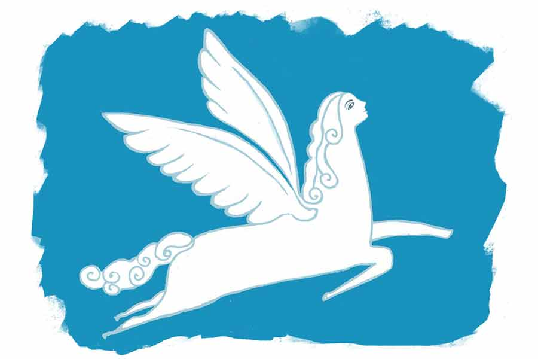

 
 <h1 align=center>বিরাজের বৌ</h1>
<h2 align=center>সুস্মিতা নাথ</h2> 

বিরাজ ফোন রাখতেই মিনতি বলল, “অবশেষে খবর এল! রেলে কাটা, না? ভালই হল, বাইরে গিয়ে মরেছে, আপদ গেছে।”

খবরের কাগজ পড়ছিল সাধন। থানা থেকে ফোন এসেছে শুনে তার কৌতূহলী চোখ এখন ছেলের দিকে। স্ত্রীর কথার রেশ টেনে বলল, “নিজেই মরল, নাকি কেউ মেরে ফেলে গেল, কে জানে! তা পুলিশ কিছু বলল রে?”

“আরে না না!” বিরক্ত হয় বিরাজ, “শুধু বলল, রেললাইনের ধারে একটা মেয়েছেলের বডি পাওয়া গেছে, ওটাকে শনাক্ত করতে হবে।”

মিনতি বলল, “নিশ্চিত ওই মেয়েই হবে। চার দিন ধরে গায়েব। নিশ্চয়ই কেউ তুলে নিয়ে ভোগ-টোগ করে চলন্ত ট্রেনের মুখে বডি ফেলে গেছে! ইশ! মানসম্মান আর রাখল না। মরলি তো মরলি, নষ্ট হয়ে মরলি! আরও যা একা একা মাসির বাড়ি! কত বারণ করলাম, বললাম, ফোন করে খবর নিলেই তো পারো, যাওয়ার কী দরকার? কিন্তু শুনল না। মাসির জন্যে দরদ একেবারে উথলে উঠেছিল। এ বার বোঝ। গেল তো প্রাণটা!”

বসুধা, বিরাজের একমাত্র বোন, এত ক্ষণ চুপ করে বসে সবার কথা শুনছিল। সে এ বার জিজ্ঞেস করল, “তুই কি এখনই বেরোবি দাদা?”

বিরাজ কিছু বলার আগেই মিনতি বলে উঠল, “এখনই যাস না বিজু। পেট ভরে জলখাবার খেয়ে তার পরে যা। খানিক পরেই আবার হাঙ্গামা শুরু হবে। বডি আনা, সৎকার, কুটুম ডাকা... ঝামেলা কি একটা? উফ! কী বিপাকেই না ফেলল হতচ্ছাড়ি!”

সাধন বলল, “সেই ভাল। তবে আমি বলি কী, জলখাবারের ঝামেলায় না গিয়ে একেবারে ভাতই বসিয়ে দাও। সঙ্গে ডাল আর মাছের ঝোল হলেই হবে। আগে সবাই খেয়ে নিই। বডি এসে গেলে আর নাওয়া-খাওয়ার ফুরসত হবে না।”

সহমত হল বিরাজও। বলল, “তা-ই করো। বেশি দেরি করা যাবে না। বুঝতেই পারছ পুলিশের ব্যাপার।”

শীতের সকাল বলে এত ক্ষণ বিছানার মধ্যেই কম্বল জড়িয়ে বসে ছিল মিনতি। এখন তাড়া বুঝে খাট থেকে নামতে নামতে বলল, “পোড়ারমুখী যে কী সমস্যায় ফেলল, সে আমিই টের পাচ্ছি। তিন বেলা খুন্তি নাড়তে নাড়তে হাত ব্যথা হয়ে গেল। রাজ্যির এঁটো বাসন জমা হয়ে আছে। একটা কাজের লোক পাচ্ছি না... এই ঠান্ডায় এত ধকল সয়?”

“আগে যে বৌটা কাজ করত, মালতী না কী যেন নাম, তাকে ডেকে নাও না,” বলল সাধন।

“তাকে কি আর ডাকিনি ভেবেছ? কালই ডেকেছিলাম। কিন্তু সে মেয়ের এখন ভারী দেমাক হয়েছে। মুখের উপরে পারবে না বলে চলে গেল।”

বসুধা বলল, “মালতীকে দোষ দিচ্ছ কেন মা? তুমিই তো ওকে হঠাৎ ছাড়িয়ে দিয়েছিলে। দাদার বিয়ের পরে রান্নার লোক, কাজের লোক, সবাইকে এক ধাক্কায় ছাড়ালে?”

“ছাড়াব না তো কী?” ফুঁসে ওঠে মিনতি, “পরের মেয়েকে কি বসিয়ে বসিয়ে খাওয়াতাম নাকি? এক জনের খাওয়া-পরার খরচ কি কম? কে জানত যে, ও মেয়ে এমন নচ্ছার?”

বসুধা আর তর্কে যায় না। কেবল বলল, “আমি বাসনগুলো ধুয়ে নেব মা। তুমি রান্না বসাও।”

কিন্তু তাতেও মিনতির আপত্তি। এ আপত্তির কারণ অবশ্য সন্তানস্নেহ। বলে, “থাক, তোমার আর বাসন মেজে হাত কালি করতে হবে না। তোমারও তো বিয়ে দিতে হবে, নাকি? অমন বাসন-ঘষা খড়খড়ে হাত দেখলে কোনও পাত্র পছন্দ করবে?”

যাকে মৃত ভেবে এমন নির্বিকারচিত্ত কথাবার্তা চলছে, সে হল এ বাড়ির পুত্রবধূ একতা। মঙ্গলবার, অর্থাৎ চার দিন আগে অসুস্থ মাসিকে দেখতে বেরিয়েছিল সে। এর পর থেকে তার আর কোনও খোঁজ নেই। জানা গেছে, বাঁশদ্রোণীর মাসির বাড়ি সে যায়ইনি। যায়নি বিজয়গড়ের বাবার বাড়িতেও। এমনকি তার মুঠোফোনটাও নীরব, নিঃসাড়। ফোন করেও লাভ হচ্ছে না। গড়িয়া থেকে বাঁশদ্রোণীর সামান্য পথটুকুতেই অদ্ভুত ভাবে হারিয়ে গেছে সে।

আনাজ আর বঁটি এনে এ ঘরেই কুটনো কুটতে বসেছে মিনতি। গ্যাসের দুই উনুনে ভাত ও ডাল চাপিয়ে এসেছে। পেঁয়াজের খোসা ছাড়াতে ছাড়াতে ছেলেকে বলল, “এই ফাঁকে তোর শ্বশুরবাড়িতে খবরটা দিয়ে দে। তারাই গিয়ে লাশ শনাক্ত করুক।”

বিরাজ নিমতেতো মুখ করে বলে, “কোনও লাভ আছে? দেখছ না কেমন হাত তুলে রেখেছে! যেন সব দায়িত্ব আমাদের। কেন, তাদেরও কি মেয়ে নয়? খবরটা জেনে ওর বাপ-মা এক বারও এল?” রাগে গজগজ করে সে।

বিরাজের অভিযোগ মিথ্যে নয়। মেয়ে নিখোঁজ হওয়ার খবর পেয়েও একতার বাপের বাড়ির লোকেরা আশ্চর্য রকমের উদাসীন। ওর বাবা নির্লিপ্ত ভঙ্গিতে বলেছিল, “তোমাদের বাড়ির বৌ, নিখোঁজও তোমাদের বাড়ি থেকেই, কাজেই তাকে খোঁজার দায়িত্ব তো তোমাদেরই।”

একতার মা আরও এক কাঠি উপরে উঠে বলেছিল, “তোমাদের মধ্যে কোনও ঝগড়াঝাঁটি হয়নি তো?”

শুনেই তেলেবেগুনে জ্বলে বিরাজ ফোনেই খিঁচিয়ে উঠেছিল, “আপনি কি আমাকেই দোষী ঠাওরাচ্ছেন? স্বামী-স্ত্রীর ঝগড়া কোন বাড়িতে না হয়? তাই বলে সব বাড়ির বৌ পালায়?”

শাশুড়ি আর কথা বাড়ায়নি। তবে ওর শ্বশুর বলেছিল, “দেখো বিরাজ, আমাদের ইচ্ছের বিরুদ্ধে একতা তোমাকে বিয়ে করেছে। ইদানীং তোমাদের মধ্যে নানা অশান্তির কথা আমাদের কানে আসছিল। কিন্তু আমরা মেয়ের হয়ে কিছু বলতে যাইনি। যে মেয়ে তার বাবা-মায়ের অমতে বিয়ে করে, তার ফল তাকেই ভোগ করতে হবে। লোকলজ্জা এড়াতে তোমাদের সামাজিক বিয়ে দিয়েছি ঠিকই, কিন্তু এর পরে আমাদের আর কোনও দায় নেই।”

যতই হম্বিতম্বি করুক, শ্বশুরের কথা শুনে চুপসে গিয়েছিল বিরাজ। কারণ একতা নিখোঁজ হওয়ার আগের রাতে একটু অশান্তি হয়েছিল বইকি। প্রথমে রাগারাগি, তার পরে বেশ দু’-চার ঘা মেরেওছিল একতাকে। বিয়ের দেড় বছরে বহু বার এমন মারধর করেছে। হয়তো সে দিন একটু বেশিই হয়ে গিয়েছিল। একতার বাঁ গালে এমন একটা থাপ্পড় মেরেছিল যে, ওর ঠোঁটের কোণ থেকে রক্ত বেরিয়ে এসেছিল। তা-ই বলে ঘর ছেড়ে পালাবে! সবই কি বিরাজের দোষ? নেশার ঘোরে সব সময় অত হিসেব করে চলা যায় না কি! একতা কেন ওকে উত্ত্যক্ত করল? বাড়ি ফিরতেই কেন সুইটিেক নিয়ে জেরা শুরু করল?

ইদানীং সুইটিকে নিয়ে রোজ অশান্তি করত একতা। অসহ্য লাগত বিরাজের। অম্লান দত্তর বিধবা সুইটির ঢলঢলে যৌবন। যেমন রসে টুসটুস শরীর, তেমনই চলনবলন। এমন মেয়েছেলে কোন পুরুষমানুষকে না টানে? সুইটি যা আনন্দ দেয়, তার সিকিভাগও কি দিতে পারত একতা? সামান্য ক’টা ঘরের কাজ করেই নাকি তার দম শেষ হয়ে যায়। বিছানায় এসে ক্লান্ত ন্যাতপ্যাতে শরীরে মড়ার মতো পড়ে থাকে। সেটা কি বিরাজের দোষ?

এ সব তো শ্বশুর-শাশুড়িকে বলা যায় না। ফোন রেখে দিয়েছিল বিরাজ।

চা করে এনেছে বসুধা। সবাইকে চা দিয়ে নিজেও কাপ নিয়ে বসল। চায়ে চুমুক দিয়ে মিনতি বলে, “আমি তো প্রথম থেকেই বলছি, বিজুকে পুরো ঠকিয়েছে ওরা। প্রথমে মেয়ের রূপ দেখিয়ে ফাঁদে ফেলে ফাঁসিয়েছে। তার পর কম খরচে মেয়ে গছিয়ে দিয়েছে। না দিল গাড়ি-বাড়ি, না দিল সোনাদানা। ক্যাশও দেওয়ারও যা ছিরি... কোনও মতে বিয়েটা সেরেছে।”

বসুধা বলে, “তবে বৌদিকে দেখতে কিন্তু খুব সুন্দর। শিক্ষিতও।”

“ধুত্তোর সুন্দর!” ঝামরে ওঠে মিনতি, “রূপ আর দু’-চারটে পাশের সার্টিফিকেট ধুয়ে কি জল খাব? টাকা ছাড়া দুনিয়াতে কিছুর দাম নেই।”

“তা হলে বৌদিকে চাকরি করতে দিলে না কেন? ভাল একটা চাকরি তো বৌদি পেয়েছিলই।”

“থাম তো! বৌদির হয়ে ওকালতি করতে হবে না তোকে!” এ বার গর্জে ওঠে বিরাজ। মেয়েছেলের বেশি চোপা তার ভাল লাগে না! তা ছাড়া এও সত্যি যে, একতাকে সে-ই চাকরি করতে দেয়নি। ঘরের মেয়ে-বৌদের বেশি বাইরে না বেরোনোই ভাল। ওতে স্বভাব ছোঁকছোঁকানি হয়ে যায়। কিচ্ছু ভুল করেনি বিরাজ।

সাধন ছেলেকে সান্ত্বনা দেয়, “মাথা গরম করিস না বিজু। মন্দের ভাল হয়েছে। আবার তোর বিয়ে দেব। এ বার দেখেশুনে দেব। কাঙাল ঘরের মেয়েছেলের আর দরকার নেই। শ্রাদ্ধ সেরেই পাত্রী দেখা শুরু করে দেব।”

কথায় কথায় বেলা গড়াচ্ছিল। ভাত-ডাল নামিয়ে মাছ ভাজতে লেগেছে মিনতি। ফের বিরাজের ফোন বেজে উঠল। থানা থেকেই। বিরাজ ফোন ধরে, বাকিরা কান খাড়া করে।

সংক্ষিপ্ত একটা বার্তা আসে। বিরাজ ফোন রাখতেই চরম কৌতূহলে সাধন এবং মিনতি একযোগে বলে ওঠে, “কী বলল ওরা?”

থমথমে মুখে বিরাজ বলে, “রেললাইনের বডিটা অন্য কারও। শনাক্ত হয়ে গেছে।”

মুহূর্তেই নৈঃশব্দ্যে ছেয়ে গেল ঘর। মিনতির কুটনো কোটা থেমে গেল, বিরাজের মুখচোখ ইস্পাতকঠিন হয়ে উঠল, সাধনের চা হাতেই জুড়োতে লাগল। যেন চরম হতাশায় ডুবে নিথর হয়ে গেছে তিনটে মানুষ।

তখন সকলের অলক্ষে ঘরের কোণে বসে থাকা বসুধার মুঠোফোনে টাইপ হয়, “কেমন আছো বৌদি?”

আনসেভড নম্বর থেকে উত্তর আসে, “ঠিক আছি গো। সবাই আমায় বিঘ্নেশের দিদি ভেবে খুব যত্নে রেখেছে। প্রচুর মেয়ে এখানে নানা কাজ শেখে। আমি ওদের ইংরেজি শেখাচ্ছি, গানও শেখাই। সারা দিন হইহুল্লোড় করে কেটে যায়। শুধু মাঝেমধ্যে তোমাদের কথা, আমার বাবার কথা খুব মনে পড়ে।”

বসুধা টাইপ করে, “এ বার সব পিছুটান ভুলে নতুন করে বাঁচো ।”

কিছু ক্ষণ নীরবতার পর জবাব আসে, “চেষ্টা করছি ঠাকুরঝি।”

“আবার চাকরির পরীক্ষাগুলোয় বোসো। ঠিক পারবে। মাথা উঁচু করে বাঁচবে। তত দিন বিষয়টা গোপনই থাক। নইলে প্রতিহিংসায় তোমার জীবন দুর্বিষহ করে তুলবে দাদা।”

ভালবাসার চিহ্ন-সহ প্রত্যুত্তর আসে, “তুমি এবং বিঘ্নেশ আমার জন্যে যা করলে, আমি ভুলব না ঠাকুরঝি। এমন ননদ আর হবু নন্দাই পাওয়া ভাগ্যের কথা।”

“আমি কিছুই করিনি বৌদি,” লিখল বসুধা, “যা করেছে সব বিঘ্নেশ এবং ওর স্বেচ্ছাসেবী সংস্থা। আমি শুধু দাদা মা এবং বাবার পাপ কিছুটা ধুতে চেষ্টা করেছি। তোমার কষ্ট আর চোখে দেখা যাচ্ছিল না।”

