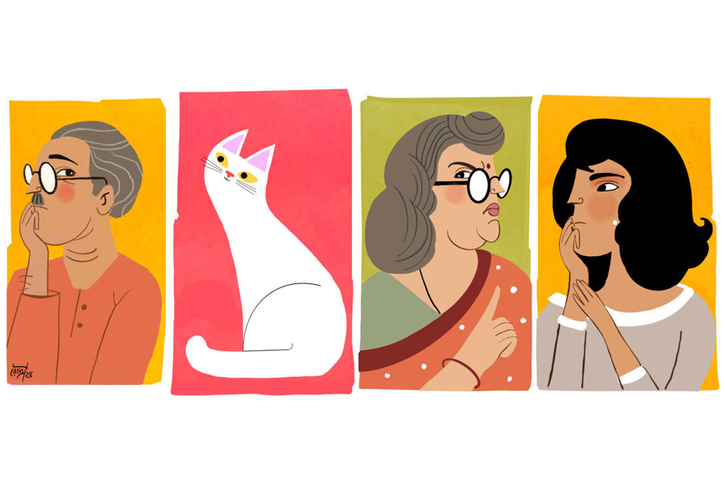

 
 <h1 align=center>বিরিয়ানির আলু</h1>
<h2 align=center>রাজদীপ ভট্টাচার্য</h2> মা  গতকাল রাতেই বলেছিলেন যে, পরের দিন স্কুলে অ্যানুয়াল কালচারাল প্রোগ্রাম আছে। খুব সকাল সকাল বেরিয়ে যেতে হবে। আসলে গত বছর হেডমিস্ট্রেস হয়ে মা জয়েন করেছেন সেই ধ্যাদ্ধেড়ে গোবিন্দপুরের এক স্কুলে। এই গড়িয়া থেকে ট্রেনে ক্যানিং স্টেশন। সেখানে নদী পেরিয়ে মোটরভ্যানে আরও খানিকটা গিয়ে তবে স্কুল, আবার সেই ভাবেই ফেরা। সন্ধে সাতটার আগে মা ফিরছে না বুঝেই হর্ষকে ফোন লাগিয়েছিল শ্রাবন্তী, “দুপুরে চলে এসো, বাড়ি ফাঁকা।”

দ্বিপ্রাহরিক আনন্দের কথা ভেবে কেমন রোম খাড়া হয়ে যাচ্ছিল বার বার। নেলপালিশের শিশিটা নিয়ে পায়ের নখে লাল রং ঘষছিল যত্ন করে। হঠাৎ গলার শব্দে হাত নড়ে গিয়ে ধেবড়ে গেল নেলপালিশ।

কে বলল কথাটা? আশপাশে তো কেউ নেই। ছ’তলার এই ফ্ল্যাটে এক স্পাইডারম্যান ছাড়া আর কেউ বাইরে থেকে উঁকি মেরে কথা বলতে পারে না। তখনই দরজার কাছে মেঝেতে বসে পুটুস ঘাড় ঘুরিয়ে আবার বলে উঠল, “ব্যাপারটা কি ঠিক হচ্ছে?”

হতভম্ব শ্রাবন্তীকে আরও ঘাবড়ে দিয়ে চোখ বন্ধ করে ও আবার বলল, “মা বাড়িতে না থাকলে এই যে মাঝেমধ্যেই বয়ফ্রেন্ডকে ডেকে নিচ্ছ, চুমুচাকতি, ইন্টু-বিন্টু সবই ঘরে বসে চালাচ্ছ, এর পর বড় কিছু ঘটে গেলে তখন সবটা আর মজার থাকবে কি?”

এগারোটা বাজলেও একটা শীত-শীত ভাব বাতাসে আছে। তবু পুটুসকে এ ভাবে কথা বলতে দেখে নাকের ডগায় ঘাম জমছিল শ্রাবন্তীর। এমএ ক্লাসে ভর্তি হওয়ার পর একটু বেশিই সাহসী হয়ে গেছে ও। হর্ষর সঙ্গে সম্পর্কটা মজবুত হয়েছে এর মধ্যে। তা ছাড়া ও দিকে বাবার সঙ্গে মায়ের মন-কষাকষি চরমে। ফলে বাবা আলাদা থাকতে শুরু করেছেন মাসখানেক হল। সব মিলিয়ে বেশ হচপচ কন্ডিশন। এই একঘেয়েমি কাটাতেই মাঝে মাঝে রুটিনের বাইরে বেরিয়ে খোলা হাওয়ায় ঘোড়া ছোটাতে ইচ্ছে করে শ্রাবন্তীর।

“সবেরই একটা সময় আছে। পড়োনি, ছাত্রাণাম্ অধ্যয়নং তপঃ…”

হতচকিত ভাবটা ক্রমশ কমে আসছিল শ্রাবন্তীর। ও বলল, “জ্ঞান তো ভালই দিতে শিখেছিস। শোন, আমার লাইফ, আমি ঠিক করব যে কী করব আর কী করব না। তুই চুকলি কাটতে আসবি না এর মধ্যে।”

“এই হল মুশকিল। আয়নায় নিজের ভিতরটা দেখতে পাও না।”

“ও আচ্ছা! তা তুই দেখতে পাস, আমার ভিতরে কী কিলবিল করছে?”

“দেখতে না পেলেও বুঝতে তো পারি। তা ছাড়া এটা তো মানবে যে, বিড়ালের ঘ্রাণশক্তি ওই তোমাদের মতো মানুষদের চেয়ে অনেক বেশি।”

“তার মানে তুই সব গন্ধ পাস! আরেব্বাস… তা আমার ভিতরে কী গন্ধ পাস শুনি।”

“অসুখের! দুঃখের! বেদনার!”

“চমৎকার। এর পর ডাক্তারবাবু বলে ডাকব তোকে। ওষুধপত্র দিবি! প্রেসক্রিপশন লিখতে পারবি তো?”

“হ্যাটা করতে ভালই পারো! তবু স্বীকার করতে পারো না সত্যিটা।”

“এর আবার সত্যি-মিথ্যে কী! পৃথিবীতে সবার কিছু না কিছু দুঃখ, বেদনা থাকে। আবার আনন্দও থাকে। এ সব মাইন্ডগেম খেলে আমার সঙ্গে লাভ হবে না। ডাক্তারি ছেড়ে এ বার জ্যোতিষীর লাইনে চলে যাচ্ছিস!”

“কিন্তু সেই বেদনার কারণ খুঁড়ে সমূলে উপড়ে ফেললে হয় না? তুমি তো আর এখন কচি খুকিটি নেই!”

“কী বলতে চাইছিস খুলে বল। অত ভণিতা করতে হবে না।”

“তুমি নিজেই স্বীকার করছ যে, বিস্তর দুঃখ আছে তোমার, তাই তো?”

“বিস্তর কি না জানি না! সবই আপেক্ষিক। আরও কত বেশি দুঃখী মানুষ আছে চার পাশে। তার বেলা কি বলবি? বিস্তর স্কোয়ার? কিউব?”

“কাজের থেকে আজকাল বেশি ফালতু বকো! পয়েন্টে এসো। তোমার মূল দুঃখের কারণ কী?”

“যদি বুদ্ধদেবের লাইনে ভাবি, তা হলে ‘আসক্তি’।”

“ইউনিভার্সিটিতে পড়ে তুমি পুরো আঁতেল-মার্কা হয়ে গেছ। কোনও কিছু মাটির লেভেলে ভাবতে পারো না! তুমি স্রেফ শ্রাবন্তী চ্যাটার্জি। এমএ সেকেন্ড ইয়ার। তোমার দুঃখ-হতাশার প্রধান কারণ কী সেটা বলো।”

“তা হলে বলতে হয়, এই বাবার এক সঙ্গে না থাকা। স্পেশালি বাবাকে আমি ভীষণ মিস করি।”

“তা ছাইপাঁশ করে সময় নষ্ট না করে ব্যাপারটা কী করে মেটানো যায়, সেটা ভাবলেই সব দিক থেকে ভাল হয় না?”

“সে আমি মেটানোর কে? বাবা-মা দু’জনেই ম্যাচিয়োর। তারা ঠিক করবে তাদেরটা, তাই না?”

“কিন্তু তুমিও তো সাফারার। তাদের কাজের প্রভাব তাদের মধ্যে সীমাবদ্ধ থাকলে তুমি হাওয়া লাগিয়ে ঘুরতেই পারতে। সেটা তো হচ্ছে না।”

“তা ঠিক! কিন্তু এ ক্ষেত্রে আমার করণীয় কী?”

“আরে বাবা, তুমি তাদের দু’জনের মধ্যে আসল আঠা। তাই তোমার ভূমিকা এ ক্ষেত্রে অনেক।”

“সে বুঝলাম। কিন্তু আমার মাথায় কিছু আসছে না।”

“বাবার লাস্ট খোঁজ নিয়েছ কবে? সেটা তো তোমার একটা ডিউটি, তাই না? তুমি না হয় মায়ের সঙ্গে আছ, আর সেই মানুষটা?”

“গত রবিবার বাবা ফোন করেছিল। বেহালায় ঠাকুমার ওখান থেকে অফিস করছে। ওই বাড়িতে একটা ঘর তো আমাদের আছেই।”

“বাহ। দিন পাঁচেক আগে বাবা ফোন করেছিল বলে কথা হয়েছে। তার পর থেকে তুমি এক বারও ফোন করতে পারলে না? প্রেশারের ওষুধটা ঠিকমতো খাচ্ছে কি না, শরীর ঠিকঠাক আছে কি না, এ সবও তো জানা যায় নাকি!”

“এটা ভাল বলেছিস। আজ এক বার ফোন করতে হবে। আসলে মা যা বদরাগী! তার উপর হেডমাস্টারনি হওয়ার পর থেকে স্কুলের ভুলভাল চাপে আরও মেজাজ চড়ে গেছে। বাবা তাই বাড়াবাড়ি হলে মাঝে মাঝে বিদ্রোহ করে বসে আর কী!”

“হুম। সবই তো বোঝো। তা হলে শুভস্য শীঘ্রম্‌। ফোন লাগাও।”

“এখনই? পরে করতাম না-হয়!”

“নো! আভি… ইসি ওয়ক্ত!”

ফোন করতেই বাবা উদ্বিগ্ন স্বরে বলে ওঠেন, “কী হল! তৃষ্ণা ঠিক আছে? সবার শরীর-টরীর ভাল তো?”

“হ্যাঁ, আমরা ঠিক আছি। তোমার শরীর কেমন আছে? ওষুধপত্র খাচ্ছ তো ঠিকঠাক?”

বাবার গলা কেমন নরম শোনায়। বলে, “মা নেই ফ্ল্যাটে? তুই একা?”

“মা তো সেই সাড়ে সাতটায় বেরিয়ে গেছে। আজ স্কুলে প্রোগ্রাম আছে তাই। ফিরতে অনেক দেরি হবে। আর আমার আজ ক্লাস নেই। তাই যাইনি। একাই রয়েছি।”

বলতেই পাশ থেকে চোখ বড় করল পুটুস। চাপা গলায় বলল, “বাহ, কী নেমকহারাম! আমি কেউ না?”

জিভ কেটে চোখ কুঁচকে ভুলটা ক্ষমা করে দিতে ইশারা করল শ্রাবন্তী। ও দিকে কথা বলেই যাচ্ছিলেন বাবা, “তুই ফোন করলি, আর কী আশ্চর্য আমি এখন কদমতলায় অফিসের কাজে এসেছি। কাজ সেরে এক বার দেখে আসব নাকি তোকে?”

কী সর্বনাশ! কদমতলা থেকে মোড় ঘুরলেই ওদের গ্রিনভিউ আবাসন। কিন্তু বাবাকে এখন কী বলবে শ্রাবন্তী! হর্ষ আসতে এখনও ঘণ্টাদুয়েক দেরি অবশ্য। ওর ভিতর থেকে কে যেন বলে ওঠে, “চলে এসো। এক সঙ্গে খাব দু’জনে।”

ফোন নামাতেই পুটুস একটা হাই তুলে বলল, “কেমন বিরিয়ানি-বিরিয়ানি গন্ধ পাচ্ছি!”

“খুব লোভী হয়েছ! আজ মা কাতলা মাছের ঝোল আর ভাত করে গেছে। আর কিছুর সময় পায়নি!”

“ঠিক আছে, যাও স্নান সেরে রেডি হয়ে নাও বাবা আসার আগেই।”

শ্রাবন্তী প্রথমে হর্ষকে একটা হোয়াটসঅ্যাপ করল যে আজ আর আসতে হবে না। তার পর স্নান করে এসে বইপত্র গুছিয়ে তুলে রাখল।

বারোটা নাগাদ ডোরবেল বাজতেই বুঝল বাবা এসে গেছেন। পুটুস সোফা থেকে ওর দিকে তাকাল চোখ টেরিয়ে। উঠে দরজা খুলতেই দেখল বাবার হাতে বড় প্যাকেট। ভিতরে দুটো বিরিয়ানির কন্টেনার। দরজা বন্ধ করে ঘুরে পুটুসের দিকে তাকাতেই ও একটা বড় হাই তুলল। যেন, ব্যাপারটা জানাই ছিল।

সোফায় গিয়ে বসলেন বাবা। কেমন ক্লান্ত দেখাচ্ছে মানুষটাকে। দেখে মায়া লাগছিল শ্রাবন্তীর। বলল, “তুমি একটু হাতমুখ ধুয়ে এসে বোসো। এসিটা চালিয়ে দেব?”

“আরে না না। ও সব লাগবে না। তুই বোস একটু আমার কাছে এসে।”

শ্রাবন্তী সোফায় বসে বহু দিন পরে বাবার গায়ে হেলান দিল। দু’জনেই চুপচাপ। ছোটবেলার মতো হলে এত ক্ষণে বাবার গলা ধরে ঝুলে পড়ত। বড় বয়সে আর অত সহজ হতে পারে না কেউ।

বরাবরই মা ভীষণ কড়া। ছোটবেলা থেকেই রুটিন ভেঙে কিছু একটা করে ফেললে মায়ের শাসন থেকে বাঁচানোর একমাত্র মানুষ ছিলেন বাবা। চিরকাল মায়ের সামনে ঢাল হয়ে দাঁড়িয়েছেন। ছুটির দিনে বাবার স্কুটিতে চড়ে সে ঘুরে বেড়িয়েছে এ মাথা থেকে ও মাথায়। মা-কে লুকিয়ে কোল্ড ড্রিঙ্কস, তেঁতুলের আচার কিংবা ফুচকা খাওয়া— এ সবের একমাত্র সঙ্গী বরাবর এই সোমনাথ চ্যাটার্জি।

পায়ের কাছে পুটুস এসে লেজ নাড়িয়ে ঘোর কাটিয়ে দিল। তাকাতেই শ্রাবন্তী স্পষ্ট শুনল, “বিরিয়ানি কি ঠান্ডা করে তার পর খাবে?”

চমকে বাবার দিকে তাকাল শ্রাবন্তী। নাহ! কোনও ভাবান্তর নেই। তার মানে পুটুসের কথা ও বাদে আর কেউ আপাতত শুনতে পাচ্ছে না। একটা ভয় অন্তত কাটল। ও বলল, “যাও বাবা, হাতমুখ ধুয়ে এসো। আমি খাবারটা টেবিলে বেড়ে ফেলছি। কিন্তু মা এসে যদি দেখে তার রান্না করা ভাত-মাছের ঝোল দুপুরে খাইনি, তা হলে আবার সব মাথায় তুলবে যে!”

“একটা কিছু বলে দিবি! এক কাজ কর, তোর মা যা রেঁধেছে সেটা আমায় দিয়ে দে। আমি বিরিয়ানি তেমন ভালওবাসি না। তুই কিছু একটা গুল মেরে রাতেও বাকিটা খেয়ে নিস।”

সোমনাথবাবু উঠে বাথরুমে গেলেন। প্লেটে বাবার জন্য ভাত আর কাতলা মাছের ঝোল দিয়ে নিজে একটা বিরিয়ানি খুলে নিয়ে বসল শ্রাবন্তী। মুখ তুলে তাকাতেই পুটুসের হাভাতে চাউনি নজরে এল। ওর প্লেটে একটা মাটনের টুকরো দিল। তত ক্ষণে বাবা বেরিয়ে হাতমুখ মুছে এসে বসলেন। দু’জনে খাওয়া শুরু করতে না করতেই বেজে উঠল ডোরবেল।

একটা উত্তেজনা জড়িয়ে ধরল দু’জনকেই। হর্ষই এসে পড়ল না তো! ভাবতে ভাবতে ধীর পায়ে উঠে শ্রাবন্তী লকটা খুলতেই ঝড়ের মতো ঘরে ঢুকলেন ওর মা। বাবা-মেয়ে দু’জনেই থতমত খেয়ে গেল তাকে দেখে। আর সোমনাথকে দেখে হতচকিত হয়ে গেলেন তৃষ্ণা চ্যাটার্জি। কাঁধের ব্যাগ নামিয়ে রেখে মুখ খুললেন, “তা হলে বাড়িতে আমি না থাকলে আসতে অসুবিধে নেই কিছু! আমিই দু’চোখের বিষ!”

“বাবা এখানেই কদমতলা মোড়ে একটা কাজে এসেছিল। তাই আমি ফোনে চলে আসতে বললাম।”

“হুম, তাই বিরিয়ানি নিয়ে চলে এলেন মেয়েকে খাওয়াতে। আমি তো না খাইয়ে রেখেছি। অখাদ্য-কুখাদ্য সাপ্লাই না দিলে চলছিল না!”

পরিস্থিতি বিগড়ে যাচ্ছে দেখে সোমনাথবাবু উঠে পড়লেন চেয়ার থেকে। বেসিনের দিকে এগোতেই আবার তৃষ্ণা বাজখাঁই গলায় বললেন, “যেখানে বসেছিলে সেখানেই চুপচাপ বসে পড়ো যদি ভাল চাও!”

স্লো-মোশনে নিজেকে রিওয়াইন্ড করলেন সোমনাথ চ্যাটার্জি। ম্যাক্সিটা নিয়ে বাথরুমে ঢুকলেন তৃষ্ণা। বাবা আর মেয়ে মুখ কালো করে চেয়ারে স্থাণু হয়ে বসে রইল তার পুনরাবির্ভাবের দিকে তাকিয়ে। নীরবতা ভেঙে পুটুস বলে উঠল, “তোমার মা কিন্তু আসলে মাটন বিরিয়ানি ভীষণ ভালবাসে।”

চমকে উঠল শ্রাবন্তী। মুচকি হেসে আর একটা প্লেট টেনে নিয়ে তাতে খানিকটা গরম বিরিয়ানি বেড়ে দিল। মাটনের বেশ বড় পিসটা টপিং-এর মতো সাজাল। পাশে একটা বোম্বাই সাইজ়ের আলু। তৃষ্ণা চ্যাটার্জি ফ্রেশ হয়ে বেরিয়ে এক বার ঘুরে তাকালেন ওদের দিকে, “সব স্ট্যাচু হয়ে বসে আছ কেন? আমার সামনে খেতে লজ্জা করছে নাকি!”

শ্রাবন্তী বলল, “তোমাকেও দিয়েছি অল্প করে। চলে এসো।”

“ও সব ছাইপাঁশ আমি গিলি না। তোমাদের রুচি, তোমরা খাও।”

এত ক্ষণে মুখ খুললেন সোমনাথ, “তা হলে আমি কিন্তু উঠে চলে যাব এ বার। মেয়ে দিয়েছে… এসে বোসো।”

মিনিটখানেক কেটে গেল নিঃশব্দে। ও দিক থেকে আর বল ফেরত এল না। তার বদলে তিয়াত্তর কেজির তৃষ্ণা চ্যাটার্জি স্বয়ং এসে বসলেন টেবিলে। মন দিয়ে কাতলা মাছের কাঁটা বাছতে বাছতে সোমনাথবাবু বলে উঠলেন, “লাস্ট চেকআপে তিনশোর কাছাকাছি সুগার ছিল বনি। অত বড় আলুটা মায়ের প্লেট থেকে তুই নিয়ে নে।”

তত ক্ষণে নরম আলুর আধখানা ভেঙে গালে পুরে দিয়েছেন জাঁদরেল হেডমিস্ট্রেস তৃষ্ণা চ্যাটার্জি। তাঁর পায়ের কাছে লেজ নাড়িয়ে ‘মিয়াঁও’ করে ডেকে উঠল পুটুস।