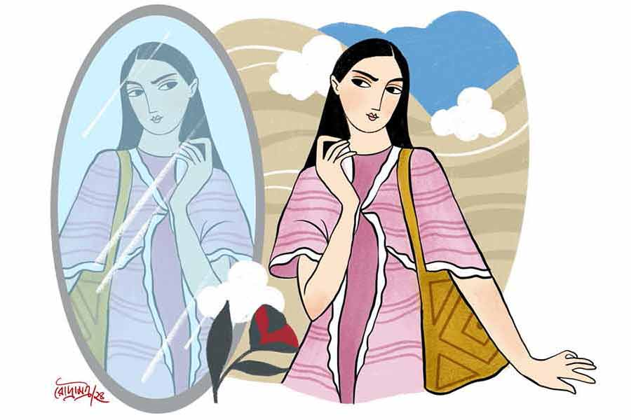

 
 <h1 align=center>বিরোধী পক্ষ</h1>
<h2 align=center>মহুয়া চৌধুরী</h2> 

অন্তরা ওর হাতের উপর মেলে ধরল পেঁয়াজি ওড়নাখানা। তার ফর্সা রঙে কী চমৎকার মানিয়েছে ভেবে, তারিফ করতে লাগল নিজের মনে। আর সেটা বুঝে ফেলে তক্ষুনি বদরসিক ছোটকা দুম করে বলে বসল, “হে বালিকে, জানি তোমার মেলানিন কিছু কম। তবুও কিন্তু সায়েবসুবোদের দেশে গেলে ওরা তোমাকে ‘ব্ল্যাক’ই বলবে, বুঝেছ? তোমার সঙ্গে প্রতিমাপিসির গায়ের রঙের ফারাক ধরতেই পারবে না।”

ছোটকার তখন সবে বিয়ে হয়েছে। পাশে বসে নতুন কাকিমা খিলখিল করে হেসে সারা।

অন্তরা তখন তেরো কি চোদ্দো। অঙ্ক, সায়েন্স বাদে, স্কুলের টেস্টগুলো মোটামুটি উতরে দেয়। তার বাইরে ফিল্ম ম্যাগাজ়িন ছাড়া বই ছোঁয়ার পাট নেই। কাজেই কথাটা তার মাথার ঢোকেনি। তবে রাগে গা জ্বালা করে উঠেছিল। বেশ বুঝেছিল, এ আসলে তাকে হ্যাটা করা। প্রতিমাপিসি এ বাড়িতে বাসন মাজে। হাকুচ কালো।

কাকিমা নকল ধমক দিয়েছিল বরকে, “আহ! ছেলেমানুষকে ও কী রকম ঠাট্টা!” তার পর অন্তরার দিকে ফিরে বলেছিল, “তোমার ছোটকার খালি জ্বালাতন করার মতলব। আসলে মেলানিন বলে এক রকমের জিনিস থাকে মানুষের শরীরে। যার যত বেশি, তার রং তত ময়লা। তুমি ফর্সা কি না, তাই বলছে অমন।”

কাকিমা মিটিমিটি হাসিটা অন্তরার মনে হয়েছিল ন্যাকামি। চটে কাঁই হয়েছিল সে। কিন্তু কী বলবে ভেবে পায়নি। বিয়ের পর থেকে ছোটকা যেন এক্কেবারে নতুন বৌয়ের কোলবালিশ হয়ে গেছে।

আসল কারণটা বুঝতে বেশি দেরি হয়নি অন্তরার। হিংসে। স্রেফ হিংসে। কাকিমার নিজের গায়ের রং ময়লা যে! ওগুলো আসলে তো ওরই কথা। ছোটকাকে দিয়ে বলিয়েছে।

তবু আত্মীয়স্বজনের কী বাড়াবাড়ি নতুন বৌকে নিয়ে। কেমন টানা টানা চোখ, কেমন বাঁশির মতো নাক, তার উপর ফিজ়িক্স অনার্স নিয়ে বি এসসি... হ্যানাত্যানা।

“অঙ্ক আর সায়েন্সে তো টায়ে-টায়ে পাস করিস। যে ক’দিন কাকিমা আছে, বইটইগুলো আনিস, কাকিমা বুঝিয়ে দেবে’খন,” নতুন বৌয়ের সঙ্গে পরিচয় করতে এসে বলেছিলেন স্পষ্টবক্তা সুধামাসি।

রাগে দাঁতে দাঁত চেপেছিল সে। বয়ে গেছে তার সায়েন্স নিয়ে পড়তে! পরে গায়ের ঝাল মেটাতে পাশের ঘরে গিয়ে ছুড়ে ফেলেছিল ভারী কাঁসার ঘটিখানা। ঝনঝনিয়ে মেঝেতে ঘুরপাক খেতে লাগল সেটা।

মা ছুটে এসেছিলেন। পিছন পিছন সুধামাসি, কাকিমাও।

“পড়ে গেল হাত ফস্কে...” হাঁড়িমুখ করে বলেছিল সে।

দেখা গেল সুধামাসি কেবল স্পষ্টবক্তাই নন, বুদ্ধিও ধরেন যথেষ্ট। হেসে বললেন, “লেখাপড়ার কথায় রাগ হয়েছে মেয়ের। কেন রে? খারাপ কী বলেছি? যে যাতে ভাল, তার কাছ থেকে তা শিখে নিলে মান যায় না।” রাগে আগুন হয়ে মা অত বড় মেয়েকে চড় মারতে হাত উঁচিয়েছিলেন। কাকি ধরে ফেলল চট করে।

রাগে-অপমানে জ্বলে যাচ্ছিল সে। মা, কাকি, সুধামাসি... এই বিশ্বসংসারের সবার উপর।

আজকাল সব সময়ে বাড়িতে কেউ এলেই কান খাড়া করে থাকে অন্তরা। ওর প্রশংসা কেউ করছে কি না? নাহ! ইদানীং যার যত আহ্লাদে গদগদ কথাবার্তা, সমস্ত কাকিমাকে নিয়েই। মেজাজ খিঁচড়ে থাকে ওর সর্বক্ষণ। আসল কথা স্পটলাইট— স্পটলাইট চাই ওর উপর। সব সময়ে। কখনওই বা সেটা সরে যাবে কেন?

সেই ছোট্ট থেকে “ওম্‌মা কি মিষ্টি! এক্কেবারে পুতুলের মতো!” শুনে শুনে বড় হয়েছে সে।

তার বাবা নামকরা ডাক্তার। আত্মীয়স্বজন নিজেদের দরকারে প্রায়ই আসে এ বাড়িতে। যে কোনও রোগের ব্যাপারে পরামর্শ নিয়ে থাকে। প্রয়োজনে বন্ধু ডাক্তারদের সঙ্গে কথা বলে বিশেষজ্ঞের অ্যাপয়েন্টমেন্টের বন্দোবস্তও তার বাবাই করে দেন।

অন্তরার জন্যে চকলেট, টফি আনে উপকৃত আত্মীয়-বন্ধুরা। অন্তরা ভাল করেই জানে, ভালবেসে কেউ কিছু আনে না। তাকে উপলক্ষ করে আসলে আনে বাবাকে তেল দিতে! ওদের নিজেদের ছেলেমেয়েগুলো কেলে-কুচ্ছিত যে! মনে মনে তাই সব্বাই হিংসে করে তাকে।

সুধামাসি আরও খারাপ। বাবার থেকে দরকার হলে সুবিধে সে-ও কম নেয় না। কিন্তু তাকে ক্যাটকেটে কথাগুলো বলতে কখনও ছাড়ে না।

ভাগ্যিস কাকিমা এ বাড়িতে থাকবে না। অন্তরা রোজ ঘুম ভেঙে গোনে আট... সাত... ছয়... কাকিমা বেঙ্গালুরু যেতে আর ক’দিন বাকি। যাওয়ার আগের রাতে, কাকিমা আদর করে নিজের উপহারে পাওয়া চব্বিশ শেডের বিদেশি লিপস্টিকের প্যাকেট তুলে দিলেন ওর হাতে। বললেন, “লিপস্টিকগুলো দারুণ মানাবে। এত সুন্দর কমপ্লেকশন তোমার!” বলে গাল টিপে দিলেন।

সব দেখানোপনা। ভাল সাজার চেষ্টা। মনে মনে বলল, ‘নেকি!’

গত দু’বছর থেকে লাভ লেটার পেতে শুরু করেছে অন্তরা। চুপি চুপি সাইকেল করে পাশ ঘেঁষে যাওয়ার সময়ে টপ করে সামনে ফেলে দেয় ছেলেগুলো। তার পরই পাঁইপাঁই করে চাকা ঘুরিয়ে ধাঁ! ওদের কোনও দিন পাত্তাও দেয় না সে। কিন্তু সমস্ত চিঠিগুলো ভাঁজ করে রেখে দিয়েছে নিজের পড়ার ড্রয়ারে। মাঝে মাঝে খুলে পড়ে। আপনমনে মুখ টিপে হাসে। তার পরই গিয়ে দাঁড়ায় আয়নার সামনে।

বলা বাহুল্য মাকে এ সব জানায়নি। মায়ের সঙ্গে কখনই পটে না তার। শিউলি, কাবেরী, সুজাতাকে দেখায় নতুন চিঠি পাওয়ামাত্র। সাধারণ ঘরের গোবেচারা মেয়ে ওরা। এক ক্লাসে পড়ে। সে তাদের ভাল ভাল টিফিন খাওয়ায়। সিনেমা দেখায়। অন্তরাকে তারা প্রায় পুজো করে বলতে গেলে। ওর রূপের প্রশংসায়, ওদের বনেদি পরিবারের প্রশংসায় পঞ্চমুখ সব সময়ে। গোটা ক্লাসে আড়ালে কে কী বলে অন্তরার সম্বন্ধে, সে সমস্ত খবর ওদের কাছ থেকে পাওয়া যায়। এই সে দিন ঋতুর সঙ্গে ব্যাপক ঝামেলা হয়ে গেল। ও নাকি কাকে বলছে, “মিথ্যেই ডান্স ক্লাসে যাওয়া অন্তরার। ওর দ্বারা নাচ হবে না। পায়ের স্টেপ কখনও তালে ফেলতেই পারে না।”

অন্তরা ছুতো করে ঝগড়া বাধাল। কোত্থেকে যেন শেখা কুৎসিত গালাগালও দিয়ে ফেলল, ঝগড়ার মধ্যে। ঋতু জম্পেশ একটা থাপ্পড় বসিয়ে দিল উত্তরে। অন্তরা কেঁদে কেঁদে মুখ লাল করে ফেলেছে। পরের ক্লাস ড্রয়িংয়ের। এক মাঝবয়সি ভদ্রলোক এই বালিকা বিদ্যালয়ের একমাত্র পুরুষ শিক্ষক। অন্তরা সম্বন্ধে তাঁর মুগ্ধতার কথা কারওই অজানা নয়। অন্তরা নিজেই এ নিয়ে শিউলিদের সঙ্গে হাসাহাসি করে।

সে দিন তিনি আসার আগে থেকেই ডেস্কে মাথা রেখে সে ফুলে ফুলে উঠতে লাগল কান্নায়। শিউলি, কাবেরী, সুজাতারা ঘিরে ধরে সান্ত্বনা দিতে লাগল ওকে। সমরেশবাবুর আকুল প্রশ্নের জবাব তারাই দিল সমস্বরে, “ঋতু ওকে মেরেছে স্যর!”

“ঋতু, মেরেছ তুমি ওকে? পাড়ার মস্তান হবে দেখছি ক’দিন পরে?’ ক্রুদ্ধ সমরেশবাবু ঋতু কিছু বলার আগেই যেন প্রশ্নের উত্তর পেয়ে গেছেন।

“ও আগে আমাকে খু-উ-ব খারাপ একটা কথা বলেছিল স্যর!” উত্তেজিত হয়ে ঋতু বলে।

“কী কথা?”

ঋতু চুপ।

“কী এমন কথা বলেছিল যে তুমি ওকে এ ভাবে মারবে! বলো...” ক্রমাগত গলা চড়ছে সমরেশবাবুর।

“আমি উচ্চারণ করতেই পারব না স্যর, অ্যাত্ত খারাপ!” প্রবল অস্বস্তিতে ঋতু বলে।

শিউলিদের দলটা শিউরে ওঠে, “অন্তরা কখনও খারাপ কথা মুখ দিয়ে বার করে না স্যর।”

“আমার বাড়ির শিক্ষা অমন নয় স্যর, বিশ্বাস করুন!” কান্নামাখা মুখ তুলে অন্তরা কোনও মতে বলে। হাতজোড় করে। সামনে আয়না না থাকলেও সে বুঝতে পারে, তাকে খুব ভাল দেখাচ্ছে।

সমরেশবাবু ঋতুকে ক্লাস থেকে বার করে দেন। গোটা পিরিয়ড বাইরে দাঁড়িয়ে থাকে সে। ক্লাস শেষ হয়ে গেলে, সমরেশবাবু তাকে ওয়ার্নিং দিয়ে যান, “দ্বিতীয় দিন এমন শুনলে গার্জিয়ান কল হবে মনে রেখো।”

সে দিন থেকে অন্তরাকে ঋতু যে কতখানি হিংসে করে, সে খবর দিগ্বিদিকে রাষ্ট্র হয়ে যায়। ঋতু তার ঘোষিত বিরোধী পক্ষ হয়ে ওঠে। শুধু অঙ্কের শিক্ষিকা প্রণতিদি এক দিন ভরা ক্লাসে সকলের সামনে তীক্ষ্ণ স্বরে অন্তরাকে প্রশ্ন করেন, “তুমি কিছুই করলে না, আর ঋতু শুধু শুধু তোমাকে মারল? ওকে তো আমার কোনও দিনই পাগল মনে হয়নি।”

অন্যের ঝামেলায় জড়াতে চায় না সাধারণত কেউ। সবাই চুপ করে থাকে। এমনকি প্রণতিদির তীব্র চাউনির সামনে শিউলি, কাবেরী, সুজাতারাও কুঁকড়ে যায়। অন্তরাকে সমর্থন করার সাহস পায় না। উঠে দাঁড়িয়ে অন্তরা তুতলে যায়। কোনও মতে বলে, “ও আমাকে খুব হিংসে করে ম্যাডাম। ও আমাকে... অথচ আমি কোনও দিনই...” বলতে বলতে ফোঁপাতে থাকে সে।

“এটা কান্নার জায়গা নয়। চাইলে বাইরে গিয়ে কাঁদো...” প্রণতিদির গলায় বিদ্রুপ। অঙ্ক বইয়ের নতুন চ্যাপ্টার খোলেন তিনি।

অন্তরা পরে শিউলিদের আচ্ছা করে দাবড়ানি দেয়, “তোরা একটাও কথা বললি না আমার হয়ে? আসলে তোরাও হিংসে করিস আমায়!”

তারাও বিরোধী পক্ষ হয়ে যায়। অন্তরা অবশ্য কায়দা করে নিজের উঁচু জায়গাটা বজায় রাখে। শেষ পর্যন্ত ওরা মিনতি করামাত্র সন্ধি করে নেয়। নইলে উপায় নেই। স্পটলাইট, স্পটলাইট! বড্ড দরকার যে ওর।

এক সময়ে স্কুলজীবনের পরে কলেজও শেষ হয়। সে চায় অনেক টাকা আর স্পটলাইট। স্পটলাইট যার উপর পড়ে, তারই জন্যে রাখা থাকে হিংসে। সোনালি গুঁড়োর মতো অন্যের হিংসে। সে নিজেই জানে না, হিংসেগুঁড়ি দু’হাত ভরে নিয়ে মাখতে আসলে বড্ড সুখ হয় তার!

ঠিক বয়সেই তার বিয়ের সম্বন্ধ খোঁজেন বাবা।

ঘটা করে বিয়ে হয় অন্তরার। কনের সাজে রানির মতো দেখায় তাকে। আয়নায় নিজেকে দেখে সে। শিউলিদের, ওর সব ক’টা তুতো বোন, বৌদিকে, কাকিমাকে কী ম্যাড়মেড়ে যে দেখাচ্ছে ওর পাশে! দেঁতো হাসি হেসে হিংসেয় জ্বলে যাচ্ছে ওরা। আড়চোখে ঠিক দেখে নিয়েছে অন্তরা।

পাত্র চার্টার্ড অ্যাকাউন্টেন্ট। বিনয়ী, ভদ্র। নিজস্ব ফার্ম। টাকার পাহাড়। যেমন খুশি খরচ করে অন্তরা। প্রচুর কাজের লোক। তার গায়ে আঁচটিও লাগে না। একটিমাত্র সন্তান। ছেলে। তাকে নামজাদা বোর্ডিং স্কুলে পাঠিয়ে দেয় অন্তরা। বেশি ঝামেলা পোয়ানো তার একেবারেই পছন্দ নয়।

চল্লিশ পেরনোর পর ফেসবুকে আজকাল অন্তরা খুব সড়গড় হয়ে উঠেছে। রোজ রকমারি সাজে, নানা ভঙ্গিতে পোস্ট দেওয়া তার প্যাশন। ‘অসাম’, ‘ওয়ান্ডারফুল’, ‘লুকিং ফ্যাবুলাস’, ‘সুন্দরী সখি আমার’... প্রতিটা পোস্টে লাইক আর কমেন্টের বন্যা বয়ে যায়। সে হিসাব রাখে, কে কমেন্ট করল না। কে আগে করত অথচ ইদানীং বন্ধ করে দিয়েছে। কে-ই বা অন্যদের পোস্টে লাইক দেয়, কিন্তু তাকে অগ্রাহ্য করে। তখন ঠান্ডা ঘরে বসে তার নাকের পাটা ফুলে ফুলে ওঠে। সে তাদের উদ্দেশে কড়া কড়া বার্তা লেখে— ‘আমার জন্মদিনে একটু উইশ করারও সৌজন্য নেই কারও, অথচ সোমাকে কত লোকে উইশ করেছে! কী ভাগ্যবতী রে সোমা তুই! কেউ ভালবাসে না আমায়। এ পৃথিবীতে আমি একা...’ ইত্যাদি।

ফেসবুক গ্রুপে অনেকেই তাকে চোখে দেখেনি, কিন্তু বাঁশি শুনে চিনে ফেলেছে সক্কলে। সামনাসামনি যাদের সঙ্গে চেনা, সেই সব লোকজন ভার্চুয়ালি তার পিঠ চুলকোয়। আর আড়ালে হাসাহাসির ধুম পড়ে যায়।

সময় তার মতো করে বয়ে চলে। একবিংশ শতকের মাঝামাঝি পেরিয়ে গেছে। আজকালকার উঠতি ছেলেমেয়ের দল ফেসবুকের নাম শুনলে ঠোঁট ওল্টায়। ও সব নাকি বুড়োদের পাস টাইম।

এক দিন ভারী কেতার এক বৃদ্ধাবাসের সামনে একটা দামি গাড়ি এসে দাঁড়ায়। পরিণত যৌবনের এক সুদর্শন ভদ্রলোক নামেন। সঙ্গে এক বৃদ্ধা। তাঁর হাঁটা দেখলেই বোঝা যায় হাঁটুর ব্যথায় কাবু। ভাঙা গাল। মুখে অজস্র বলিরেখা।

ভদ্রলোক চার্টার্ড অ্যাকাউন্ট্যান্ট। কয়েক বছর আগে তাঁর বাবা মারা যাওয়ার পর, তাঁদের নিজস্ব ফার্মের এখন তিনিই মালিক। তাঁদের পাঁচ হাজার স্কোয়ার ফুটের ছিমছাম ফ্ল্যাটে তিনি বা তাঁর স্ত্রী, কেউই অদরকারি কোনও কিছু রাখতে চান না।

বৃদ্ধাবাসে রেখে যাওয়া বৃদ্ধা, নিজের সিঙ্গল রুমে সারা দিন চুপচাপ থাকেন। কারও সঙ্গে বিশেষ কথা বলেন না। শুধু রাত হলে ঘরের আয়নার সামনে গিয়ে দাঁড়ান। কদাকার এক বুড়ি তাঁর দিকে তাকিয়ে থাকে রোজ। একমাত্র তার সঙ্গেই তাঁর যত কথা। কর্কশ গলায় বৃদ্ধা সেই কদাকার বুড়িকে বলেন, “বজ্জাত বুড়ি, হিংসুটি! ওই তো চেহারার ছিরি। তাই আমাকে দেখে তোর অত হিংসে। যা দূর হ’ চোখের সামনে থেকে!”

নাছোড়বান্দা, শয়তান, লোলুপ চোখের সেই বুড়ি যায় না কিছুতেই। কেবলই তাঁর সামনে থেকে ভেংচি কাটে। ভেংচি কাটতেই থাকে। অবিকল তাঁরই মতো করে!

