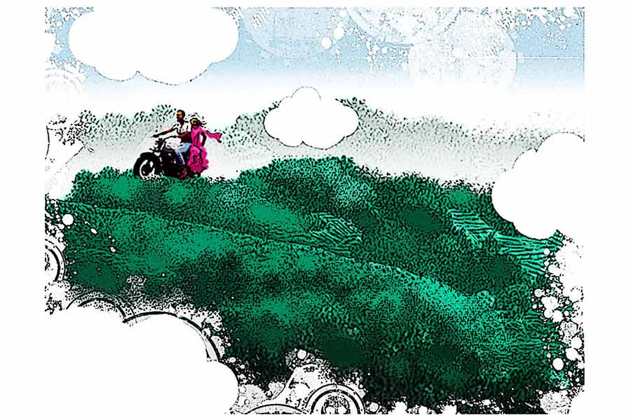

 
 <h1 align=center>বিয়ে থেকে পালিয়ে</h1>
<h2 align=center>অনির্বাণ জানা</h2> 

রিনির চন্দন-পরা মুখটাকে মনে হচ্ছিল অপার্থিব সুন্দর। ঠোঁটের ঠিক উপরে অভ্রর টুকরোয় চাঁদের আলো পড়ে চিকচিক করছে। সেই কৃতজ্ঞতায় আকাশের চাঁদও শক্তি স্পোর্টিং ক্লাবের মাঠে সমস্ত জ্যোৎস্না উপুড় করে ছড়িয়ে দিয়েছে। অয়নের মনে হচ্ছিল, ওই অভ্রটায় চুমু খেতে না পারলে জীবনটাই বৃথা হয়ে যাবে। অয়নের স্কুটারটা বেশ লোভী-লোভী মুখ করে ঘাড় কাত করে ওদের দেখছে। স্কুটারটাকে একটু আড়াল করে অয়ন রিনির মুখোমুখি দাঁড়ায়।

স্কুটারটা বেশ বদরাগী এবং মেজাজি। প্রায় ঘণ্টাখানেক আগে রিনির ফোনটা পাওয়ার পর প্রথম বাধা দিয়েছিল এই লজঝড়ে স্কুটারটাই। তিনি কিছুতেই স্টার্ট নেবেন না। শত পদাঘাতেও অবিচল। মাঝেমধ্যে দু’-এক বার গরগর আওয়াজ করেছে। আওয়াজটাকে বাংলায় তর্জমা করলে নির্ঘাত কিছু অসাংবিধানিক কথা বেরোত। তিনি স্টার্ট নেওয়ার পরেও বেশ টেনশন ছিল। কারণ সরকার চক্রবৃদ্ধি হারে তেলের দাম বাড়ানোর সঙ্গে সঙ্গে অয়নের স্কুটারে তেল ভরার হার ক্রমশ কমে এসেছে। প্রাইভেট টিউশনির টাকায় যাকে দিন কাটাতে হয়, তার নিজেকে আরবের তেল কোম্পানির শেখ ভাবলে চলে না। স্কুটারটা কাল থেকে রিজ়ার্ভে চলছে। ফলে রিনির বাড়ির পিছন দিকের রাস্তায় ঠিকঠাক পৌঁছনো নিয়ে অয়নের বেশ দুশ্চিন্তা ছিল।

আসলে মনের দিক থেকে একেবারেই প্রস্তুত ছিল না অয়ন। থাকবেই বা কী করে? আজ অনিমেষের সঙ্গে রিনির বিয়ে। পুরো ক্লাব কিছু ক্ষণ পরে নেমন্তন্নে যাবে। ওয়ার্ম-আপ করার জন্য তিন বোতল দামি মদ ক্লাবের ক্যাবিনেটে রাখা আছে। যাওয়ার আগে অল্পস্বল্প আর ফিরে এসে ফ্রি-স্টাইল মদ্যপানের প্রোগ্রাম আছে। ক্লাবে ওদের বয়সি মেম্বারদের মধ্যে প্রথম বিয়ে বলে কথা! ক্যাবিনেটের চাবি অয়নের কাছে। সেফ লোক, মদ্যপান করে না। অয়ন বিকেল থাকতে ক্লাবে চলে এসেছে আজ। ক্যাবিনেট খুলে বোতলগুলো দেখতে দেখতে নিজের কথা ভাবছিল ও।

একটা অস্বস্তিকর বয়সে রিনির প্রেমে পড়েছিল অয়ন। ক্লাস থ্রি-টা প্রেমে পড়ার জন্য আদর্শ বয়স নয়। শক্তি স্পোর্টিং ক্লাবের মাঠে ছোটদের স্পোর্টস হচ্ছিল। একদম গুটলিদের জন্য ছিল ‘যেমন খুশি সাজো’। ক্লাস টু-তে পড়া রিনি পরি সেজেছিল। অয়ন ঠিক তার আগে দৌড়ে লাস্টের আগে শেষ করেছে। আরও দু’-একটা ইভেন্টে প্রায় একই রকম ফলাফল ওর। অঙ্ক দৌড়ে যোগের অঙ্ক ও তিন বার চেক করেছিল। আসলে ক’দিন আগে অ্যানুয়াল পরীক্ষায় খাতা জমা দেওয়ার আগে চেক করেনি বলে মায়ের কাছে তুমুল সংবর্ধনা পেয়েছিল। এ বার সেই রিস্ক নেয়নি শুনে মাঠ থেকে বেরোনোর সঙ্গে সঙ্গে মা কান মুলে দিয়েছে। আস্তে করে ‘গাধা’ও বলেছে। তার পর থেকে অয়নের পিছনে লেজের মতো কি একটা সুড়সুড় করছিল। মোট কথা, প্রাইজ় ডিস্ট্রিবিউশন দেখার মতো মনের অবস্থা ছিল না ওর। কিন্তু পাড়ার অনেক কাকিমাই মায়ের বান্ধবী। তাদের ছেলেমেয়েরা প্রাইজ় নেবে। সুতরাং অয়নদের দাঁড়িয়ে যেতে হয়েছিল। সেই কনে-দেখা বিকেলে পরির মতোই ‘গো অ্যাজ় ইউ লাইক’-এ ফার্স্ট প্রাইজ় নিতে উঠেছিল রিনি।

সেই দিন রাতে দ্বিতীয় বার অয়নের স্বপ্নে প্রাইজ় নিতে উঠেছিল রিনি। তার পর থেকে স্বপ্নে যাতায়াতটা বজায় রেখেছে সে। বয়সের সঙ্গে সঙ্গে ভিক্টরি স্ট্যান্ডটার পরিবর্তন হয়েছে বটে, কিন্তু নায়িকার পরিবর্তন হয়নি। অয়নেরও প্রভূত পরিবর্তন হয়েছে। বিশ্রী কুটকুটে দাড়ি হয়েছে, গলার স্বরে ফাটা হাঁড়ির আওয়াজ। আরও যে আনুষঙ্গিক পরিবর্তন হওয়ার কথা, সেগুলোও পুরোপুরি হয়েছে। কিন্তু সবার মতে আগের মতোই অয়ন মাথা-ভর্তি গোবরের মালিক। এই মালিকানার জন্য অয়ন জীবনে কোনও কাজই ঠিক সময়ে করতে পারেনি।

রিনি ওদের পাড়াতেই থাকে। মোটেই অসূর্যম্পশ্যা নয়। সবার সঙ্গেই মেশে-টেশে। ফলে পাড়ার রিনির বয়সের প্লাস-মাইনাস চার বছরের মধ্যে যে সব ছেলেরা পড়ে, তাদের মধ্যে চাপা একটা প্রতিযোগিতা চলছিল। প্রত্যেকেরই ধারণা টালিগঞ্জ কিংবা মুম্বইয়ের আশপাশে জন্মানোর কথা ছিল রিনির, ভুল করে মফস্সলে জন্মে ফেলেছে। তাই এই মফস্সলেই ওকে বৌ করে রেখে দেওয়ার নৈতিক দায়িত্ব স্থানীয় জনগণের। ফলে এই অঞ্চলে কেউ উদাস মুখে, না-কাটা খোঁচা-খোঁচা দাড়ি নিয়ে ঘুরছে মানে নির্ঘাত সে শহিদ হয়েছে। বাকি সবাই বুঝে নেয়, সে বেচারি নৈতিক দায়িত্ব পালন করার প্রস্তাব পেশ করেছিল রিনির কাছে, এবং পত্রপাঠ সেটি খারিজ হয়েছে।

অয়নও বার দুয়েক চেষ্টা করেছিল রিনিকে সেই কথাটা বলার। ওর রিনির উপর প্রায় জন্মগত অধিকার (ক্লাস থ্রি-তে পড়ার আগে মানুষ জন্মায় নাকি!)। অয়ন এক বার সিদ্ধান্ত নিয়ে ফেলেছিল, এক বছর ফেল করে রিনির জন্য অপেক্ষা করবে। দু’জনে এক ক্লাসে চলে এলেই প্রাইভেট টিউশনগুলো এক সঙ্গে নেওয়া যাবে। কিন্তু বাবা-মার মুখ মনে পড়ে যেতে আর সে চেষ্টা করেনি। ওর বাবা-মার হিটলার-লগ্নে জন্ম। সব সময় অত্যাচার করার জন্য মুখিয়ে থাকে।

ক্লাস টেনে পড়ার সময় প্রথম সুযোগ আসে। সরস্বতী পুজো, দোল আর ভ্যালেন্টাইন’স ডে-র ত্র্যহস্পর্শে পড়া আধুনিক বঙ্গজীবনের এক মন উচাটন করা সময়। সব সময় যেন ‘বাতাসে বহিছে প্রেম,/ নয়নে লাগিল নেশা/ কারা যে ডাকিল পিছে,/ বসন্ত এসে গেছে’। ক্লাবে ঠিক হল, সরস্বতী পুজোর পর বসন্তোৎসব হবে। রিনি গান গাইবে। অয়নকে ছোটবেলায় গান শেখানো হয়েছিল। অনেক গায়িকা পাওয়া গেলেও গায়কের ভয়ানক অভাব। অয়ন এক বার ইচ্ছে প্রকাশ করতেই সবাই রাজি। আসলে অয়নকে কেউ রিনির ব্যাপারে ধর্তব্যের মধ্যে রাখেনি। হাতে পাওয়া ক’দিন খুব গান প্র্যাকটিস করেছিল অয়ন। কিন্তু ছাদের উপর বা বাথরুমের ভিতর গান গাওয়ার সঙ্গে স্টেজে মাইকের সামনে গাওয়ার বিস্তর পার্থক্য। হিটলার বাবা-মার জন্য অয়ন ঘরে গান প্র্যাকটিস করার সুযোগ পায়নি। মাইকে গান গাইলে দূরে বসানো সাউন্ডবক্সগুলো যে ভেংচি কেটে গাওয়া গানটা ফিরিয়ে দেয়, সেটা ওর জানা ছিল না। ‘যদি প্রেম দিলে না প্রাণে/ কেন ভোরের আকাশ ভরে দিলে এমন গানে গানে?’— তবু অয়ন মনপ্রাণ দিয়ে গেয়েছিল। অনুষ্ঠানের পরে ক্লাবের পিছনে আধো অন্ধকার আধো শুক্লপক্ষের জ্যোৎস্না। সবাই অনুষ্ঠান নিয়ে কথা বলছে। হঠাৎই যেন আলাদা হয়ে এসে রিনি অয়নের মুখোমুখি দাঁড়ায়।

“বেশ ভাল গাও তো অয়নদা!” রিনির গলায় বিস্ময় মাখানো ছিল। অয়ন উত্তর দিতে গিয়ে দেখল, ওর নাগালের মধ্যে কোনও কথা নেই। কিছু ক্ষণ দাঁড়িয়ে থেকে ‘থ্যাউ’ বলে একটা আওয়াজ করে চুপ করে যায় অয়ন। আসলে ‘থ্যাংক ইউ’ আর ‘ওই আর কী’ কথা দুটো কী রকম ভাবে যেন পায়ে পা জড়িয়ে ‘থ্যাউ’ হয়ে গেছে। কিছুটা ঘাবড়ে গিয়ে রিনি আস্তে আস্তে সেখান থেকে সরে যায়।

দ্বিতীয় বার এক অকালবৃষ্টির সন্ধ্যা। রিনি সুবীরবাবুর কাছ থেকে প্রাইভেট টিউশনি পড়ে ফিরছিল। আর বাড়িতে বাবার বন্ধু এসেছে বলে মিষ্টি কিনতে বেরিয়েছিল অয়ন। অয়নের ছাতাটা বেশ বড়সড়। সুবীরবাবুর বাড়ির বারান্দা থেকে রিনি চেঁচিয়ে ডাকে ওকে। বাড়িতে ছেড়ে আসতে বলে। আলগোছে রিনির মাথায় ছাতাটা ধরে ও প্রায় ভিজতে ভিজতে গিয়েছিল সারাটা পথ। রিনির বাড়ির দরজার কাছে এসে বুঝতে পারে, সেই কথাটা বলার এটাই উপযুক্ত সময়। রিনি একটু সময় নিয়ে অনেক ধন্যবাদ জানিয়ে বাড়ির ভিতরে ঢুকে যায়। অয়ন ছত্রপতি শিবাজি হয়ে চুপচাপ দাঁড়িয়ে থাকে। মাথার গোবর তখনও কথাগুলো সাজিয়ে উঠতে পারেনি। এর পর ছাতাটা দেখলেই অয়নের কান্না পেত। ‘এক আকেলি ছতরিমে যব আধে আধে ভিগ রহে থে/ আধে সুখে আধে গিলে সুখা তো ম্যায় লে আয়ি থি’। ছাতাটা বাকি জীবনে অয়নের জন্য ‘ইজাজ়ত’-এর গান হয়ে রয়ে গেল।

এর ক’দিন পরেই কাটা ঘায়ে নুনের ছিটের মতো জানা গেল, অনিমেষ এবং রিনির প্রেম চলছে। সে বছর পর পর বেশ কয়েকটা কালবৈশাখী ঝড় উঠেছিল। অভিজ্ঞ লোকে বলে, সেগুলো নাকি হাজার হাজার যুবকের দীর্ঘশ্বাসের ফল।

সে যাই হোক, অনিমেষ তখন ইঞ্জিনিয়ারিং পড়ছে। গত পাঁচ বছরে অনেক পরিবর্তন ঘটেছে। অনিমেষ পাস করে ঘ্যামা একটা চাকরি পেয়েছে। যথারীতি ওর রিনির সঙ্গে সম্পর্কটাও সবাই মেনে নিয়েছে। ক্লাবে সবাই খুব হইচই করছে। অনিমেষের ঘাড় ভেঙে তিনটে মদের বোতলের পয়সাও জোগাড় হয়েছে। তবে অনিমেষের শর্ত আছে— মদ খেয়ে বিয়েবাড়ি যাওয়া চলবে না। সুতরাং সবাই ঠিক করে নিয়েছে যে, অল্প একটু চড়িয়ে সবাই বিয়েবাড়ি যাবে। ফিরে এসে আরও একপ্রস্ত নরক গুলজার হবে।

আর পৃথিবীর সব মাতালরাই জানে, কোনও অর্থ দিয়ে মদের দাম হিসাব করা যায় না। সেই জন্য মদের বোতলের পাহারাদারদের দেশপ্রাণ সৈনিকের মতো সৎ, সাহসী, দৃঢ়চেতা এবং নির্লোভ হতে হয়। এই সব গুণগুলো অয়নের অল্পস্বল্প আছে ভেবে সর্বসম্মতিক্রমে ক্লাবের ক্যাবিনেটের চাবি অয়নের হাতে তুলে দেওয়া হয়েছে।

অয়ন আজ প্রাইভেট টিউশনি করতে যায়নি, সন্ধ্যা নামতেই ক্লাবে চলে এসেছে। ক্যাবিনেট খুলে মদের বোতলগুলো এক বার দেখে নিয়েছে। সব ঠিক আছে। বোতলগুলো ঘিরে ক্লাব সদস্যদের মধ্যে পারস্পরিক সন্দেহের একটা বাতাবরণ তৈরি হয়েছে। একটা বোতল খুলে দেখে অয়ন। বিশ্রী গন্ধ, মানুষ খায় কী করে? কৌতূহলে এক ছিপি মুখে ঢালে। ভয়ঙ্কর বাজে খেতে। অন্নপ্রাশনের মেনু এ সব খেলে অনায়াসে বলে ফেলা যায়। অয়ন যখন এই সব চিন্তায় ব্যস্ত, তখন ফোনটা এল। অচেনা নম্বর দেখে প্রথমে ধরছিল না ও। নির্ঘাত ছাত্রের বাড়ি থেকে ফোন। অয়নের ছাত্র অয়নের মতোই, বুদ্ধির বৃহস্পতি। এক দিন তার সঙ্গে জ্ঞানের আদানপ্রদান না ঘটালে মহাভারতের শুদ্ধতার কোনও হানি ঘটবে না। স্বাভাবিক কারণে অয়নের মনটা আজ ভাল নেই। কেউ না বুঝুক, নিজেকে তো আর ফাঁকি দেওয়া যায় না! ফোন ধরা মানেই ছেলেটাকে আবার পড়াতে যেতে হবে।

তবু ফোন ধরে অয়ন। কারেন্টের শক বেশ কয়েক বার খেয়েছে। কিন্তু এ রকম হাই ভোল্টেজ শক কখনও লাগেনি। ফোনের ও প্রান্তে রিনি। প্রথমে কথাগুলো বুঝতে পারছিল না অয়ন। সত্যি রিনি ওকে ডাকছে? ওর নাকি এই বিয়েতে মত নেই। ও নাকি অয়নের জন্যই অপেক্ষা করে ছিল। ভেবেছিল, রিনির বিয়ে হচ্ছে শুনে অয়ন ছুটে আসবে। শেষ মুহূর্তে এখন আর উপায় নেই, তাই অয়নকে ফোন করেছে। অয়নের ফোন নম্বর ওর কাছে অনেক দিন থেকে সেভ করা আছে। অয়ন বোকার মতো কিছু ক্ষণ দাঁড়িয়ে থাকে। তার পর স্খলিত স্বরে বলে, “তুমি বাড়ির পিছন দিকে চলে এসো। আমি এখনই যাচ্ছি।”

স্কুটারটা আর বেগড়বাঁই করেনি। রিনিদের বাড়িতে সানাই বাজছে। বাড়ির পিছন দিকটা অন্ধকার। দেখে, পুরোদস্তুর কনের সাজে দাঁড়িয়ে আছে রিনি। ভয়ার্ত চোখে এ দিক-ও দিক তাকাচ্ছে। স্কুটারটার স্টার্ট বন্ধ করার রিস্ক নেয়নি অয়ন। স্টার্ট বন্ধ করলে আবার যদি বিগড়ে যায় তো কেলেঙ্কারির একশেষ হবে। পাবলিক ওকে কিক মেরে চিরতরে স্টার্ট বন্ধ করিয়ে দেবে। রিনি পিছনে উঠতেই দ্রুত বড় রাস্তার দিকে বাঁক নেয় অয়ন। শক্তি স্পোর্টিং ক্লাবের লাগোয়া মাঠটার এক পাশে একটা বটগাছ আছে। ওখানে রিনিকে দাঁড় করিয়ে খুব তাড়াতাড়ি বেশ কিছুটা পেট্রল কিনে আনতে হবে। তার পর হাইওয়ে দিয়ে পালাতে পালাতে কোথায় যাওয়া যায় ভাবতে হবে।

শক্তি স্পোর্টিং ক্লাবের মাঠটায় গাড়িটাকে দাঁড় করিয়ে রিনির দিকে তাকায় অয়ন। মানুষ এত সুন্দর দেখতে হতে পারে? এক বার চাঁদ আর এক বার রিনির মুখের দিকে তাকিয়ে হাউহাউ করে কেঁদে ফেলে অয়ন। চোখের জল আটকাতে বোকার মতো চোখ বোজে ও।

আশপাশের চেঁচামেচিতে চোখ খোলে অয়ন। ক্লাবের ছেলেপুলেরা ওকে ঘিরে দাঁড়িয়ে আছে।

“শালা গদ্দার! পুরো একটা বোতল হাপিস করে দিয়েছে!” এক জন সপাটে চড় মারে ওকে, “মালটা বিয়েবাড়ি যাবে কী করে? উঠে তো দাঁড়াতেই পারছে না।”

সহৃদয় এক ক্লাব মেম্বার মুখে-চোখে জল দেয় ওর। এক জন মুচকি হেসে বলে, “তোরও রিনির ওপর আলু ছিল নাকি রে? তুমিও মুক্তোর মালা টার্গেট করোনি তো সোনা? নয়তো দেবদাস সিন কেন বাবা?”

সবাই হা হা করে হেসে ওঠে।

রিনিদের বাড়ি থেকে সানাইয়ের আওয়াজ ভেসে আসে। বর এসে গেল বোধহয়। অয়ন ক্লাবের মেঝেতে শুয়ে আনমনে কাঁদতে থাকে।

ছবি: প্রসেনজিৎ নাথ

