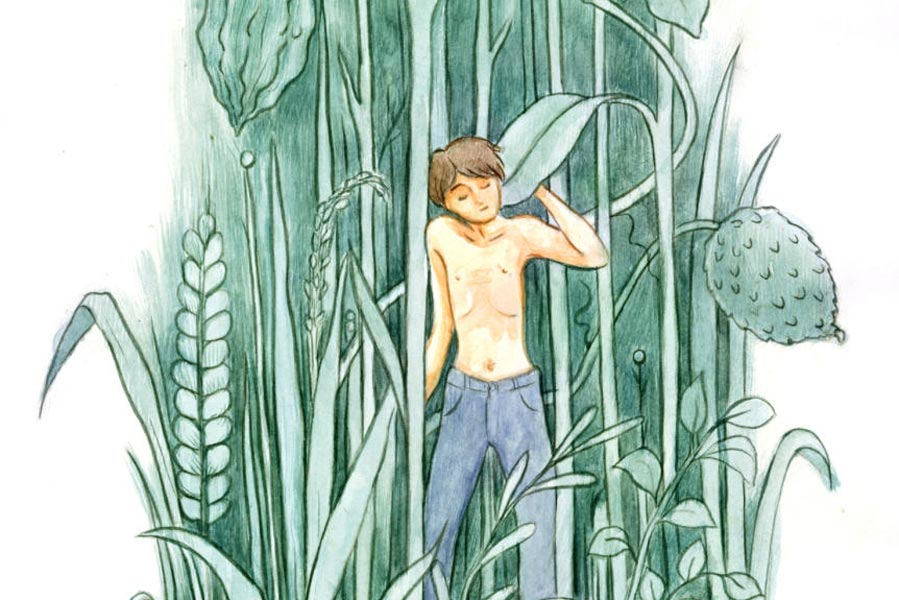

 
 <h1 align=center>বুকানের স্বপ্ন</h1>
<h2 align=center>ঋতুপর্ণা রুদ্র</h2> দু’বছর আগে রণজয় চলে যাওয়ার পর থেকে তিন- কামরার ফ্ল্যাটে একাই থাকেন শিপ্রা। বয়স হল সাতাত্তর। ছেলে-বৌমা বাসা বেঁধেছে দুবাইতে। তারা নিয়মিত ফোন করে মায়ের খবর নেয়। শিপ্রাও এক বার ঘুরে এসেছেন দুবাই থেকে, কিন্তু বেশি দিন ওদের ব্যস্ত জীবনের মধ্যে না থাকাই ভাল, এই তাঁর মত।

ফ্ল্যাটে একা থাকাটা শিপ্রা মানিয়ে নিয়েছেন। স্বাধীনতা আছে বটে, সঙ্গে আছে তীব্র একাকিত্ব। শিপ্রা বই পড়েন, টিভি দেখেন, অবসরে ফোন করেন আত্মীয়-বন্ধুদের। নিজের মনের মতো রান্না করে নেন, বারান্দায় ছোট করে বাগান করেছেন, ভাল থাকার চেষ্টা করেন সর্বদা। আর চেষ্টা করেন সাবধানে থাকার। একা মানুষ, অসুস্থ হলেই বিপদ। তবুও সে দিন বাথরুমে, কেমন করে যেন পা পিছলে পড়ে গেলেন। ভাগ্য ভাল, খুব বেশি কিছু হয়নি, কিন্তু ডান হাতে খুব চোট লেগেছে। পারিবারিক ডাক্তার এসে দেখে গেলেন এক বার। কিছু ওষুধ দিয়ে, নিদান দিলেন পরিপূর্ণ বিশ্রামের। অন্তত এক মাস। ডান হাত যত কম ব্যবহার করা যায়, ততই ভাল। রান্না করা, আনাজপাতি কাটা একেবারেই চলবে না।

শিপ্রা প্রথমে ভাবলেন, রান্নার লোক রাখবেন। কিন্তু পাশের ফ্ল্যাটের রাখী বলল, “মাসিমা, লোক পেতে আপনার সময় লাগবে, তার পর কামাই করলেও সমস্যা। তার চেয়ে হোম ডেলিভারি বলে দিন না। বাজার করার ঝামেলাও নেই, পরে হাত ঠিক হলে আবার নিজে করে নেবেন। আমি ফোন নম্বর দিচ্ছি আপনাকে।”

প্রস্তাবটা শিপ্রার বেশ পছন্দ হল, পরদিন থেকেই খাবার দিতে বলে দিলেন। দুপুর বারোটার মধ্যে খাবার দিয়ে যাবে। সরু চালের ভাত, ডাল, ভাজা, তরকারি, মাছ আর চাটনি।

পরদিন ঠিক পৌনে বারোটায় ডোরবেল বাজল। দরজায় একটি অল্পবয়সি ছেলে দাঁড়িয়ে, হাতে মস্ত ব্যাগ। শ্যামলা ছিপছিপে চেহারা, ভারি মিষ্টি মুখখানি। খালি বাটিগুলো টেবিলে সাজিয়ে রেখেছিলেন শিপ্রা, হাতে ক্রেপ ব্যান্ডেজ দেখে ছেলেটি বলল, “আমি সাহায্য করব মাসিমা?”

শিপ্রা মাথা হেলান। জুতো খুলে ঘরে ঢুকে টিফিন কেরিয়ারের খাবার নিপুণ হস্তে বাটিতে বাটিতে ঢেলে রাখে ছেলেটি। খাবারের পরিমাণ দেখে শিপ্রা বোঝেন, রাখী ঠিকই বলেছিল। এই খাবারে দু’বেলাই চলে যাবে তাঁর। খালি টিফিন কেরিয়ার ব্যাগে গুছিয়ে নিয়ে, ছেলেটি মিষ্টি করে হাসে শিপ্রার দিকে তাকিয়ে।

“তোমার নাম কী বাবা?”

“আমার নাম বুকান। খাবার ডেলিভারি দিই সকাল সাড়ে দশটা থেকে, আপনার বাড়িতে দিয়ে কাজ শেষ হল।”

“বাহ, তুমি খাও কখন?”

“এই তো মাসিমা, এ বারে বাড়ি যাব। স্নান-খাওয়া সেরে একটু বিশ্রাম নিয়ে, বিকেলে একটা কারখানায় কাজে যাই।”

বুকান বেরিয়ে যাওয়ার পরে খেতে বসেন শিপ্রা। সুন্দর স্বাদ প্রতিটি পদে। এই ব্যবস্থাই ভাল হয়েছে।

পরদিন, তার পরদিন এবং প্রতিদিনই খাবার দেওয়ার পরে বুকান, শিপ্রার সঙ্গে কিছু ক্ষণ গল্প করে যায়। তিনিও জল-মিষ্টি এগিয়ে দেন ওকে। বুকান লজ্জা পায়, আবার খেয়েও নেয়।

“কোথায় থাকো বুকান?”

“এই তো ঠাকুরতলা মোড়েই আমাদের বাড়ি। ছোট একতলা বাড়ি, দুটো ঘর। উঠোনটা বড়। জানেন মাসিমা, উঠোনের এক পাশে বাঁধানো কুয়োতলা আছে।”

“বাহ, অনেক গাছপালা আছে তোমাদের বাড়িতে?”

“আছে তো। বাড়ির চার পাশ বাগানে ঘেরা। আমাদের বাগানটা বিশাল। কিছু জমি বাবা মারা যাওয়ার পরে বিক্রি করে দিয়েছি, তাও আছে অনেকটা। বাবার গাছের শখ ছিল, অনেক গাছ আছে।”

শিপ্রার মামাবাড়ি ছিল মালদহের এক গ্রামে। ছোটবেলায় দেখা বিশাল আমবাগানের স্মৃতি মনে ভেসে আসে হঠাৎ।

“বাহ! কী কী গাছ আছে তোমাদের বাড়ি?”

“আম, কাঁঠাল, নারকেল, বিলিতি আমড়া। কালোজাম গাছে এত মিষ্টি জাম হয়, সবাই বলে কালো আঙুর। তা ছাড়া কাগজি লেবু, নিম, ছাতিম, কারিপাতা, তেজপাতার গাছও আছে। আপনি খুব গাছ ভালবাসেন, তাই না মাসিমা?”

“খুব। ফ্ল্যাটবাড়িতে তো জায়গা নেই তেমন। ওই বারান্দায় টবে কয়েকটা গাছ লাগিয়েছি। ফুলের গাছ নেই তোমাদের?”

“আছে তো। জবা, কাঞ্চন, অশোক, রঙ্গন, শীতকালে ডালিয়া, চন্দ্রমল্লিকা, গাঁদা, পিটুনিয়া, বিগোনিয়া ফোটে। স্বপ্না আনাজেরও চাষ করে। উচ্ছেলতা, ঢেঁড়স, পুঁইগাছ, পেঁপে, লঙ্কা। এক দিকে কুমড়ো মাচা আছে। শীতে লাউ, ফুলকপি হয়। আনাজ কিনতেই হয় না।”

“বৌমার নাম স্বপ্না?”

লাজুক হাসে বুকান, “হ্যাঁ, খুব ভাল মেয়ে মাসিমা। কিন্তু এখন বলি সাবধানে থাকতে, কথা শোনে না।”

ঠিক বোঝেন না শিপ্রা, জিজ্ঞেস করেন, “সাবধানে কেন?”

লাজুক হাসে বুকান, “সাত মাস চলছে এখন।”

আজকাল খাবার নামিয়ে দিয়ে সঙ্গে সঙ্গে চলে যায় না বুকান, বারান্দায় গিয়ে শিপ্রার গাছের টবগুলোর যত্ন করে। কঞ্চি দিয়ে গোড়া খুঁচিয়ে মাটি আলগা করে দেয়, শুকনো পাতা ফেলে দেয়, লতানে ফুলগাছটাকে দড়ি দিয়ে গ্রিলে বাঁধে। বুকানও খুব গাছ ভালবাসে। শিপ্রা একটা চেয়ার নিয়ে বারান্দায় বসেন তখন, কাজের ফাঁকে অফুরন্ত গল্প চলতে থাকে। সকাল থেকেই শিপ্রা তাড়ায় থাকেন আজকাল, স্নান সেরে নেন। কাজের মেয়ে চা-জলখাবার করে দিলে, আরও দু’কাপ চা ফ্লাস্কে রেখে দিতে বলেন।

আসলে শিপ্রা বুকানের জন্য অপেক্ষা করেন। ওই সময়টুকু সুধায় ভরে দেয় সারা দিন,  মনের মধ্যে অনির্বচনীয় স্নেহ অনুভব করেন। সাড়ে এগারোটা নাগাদ চা খাওয়ার অভ্যেস ছিল আগে, আজকাল বুকান এলে দু’জনে চায়ের কাপ নিয়ে বসেন। বুকানের কথা বলার ভঙ্গি বড় মায়াময়।

“জানেন মাসিমা, আজ পুকুরে মাছের চারা ছাড়া হল। বর্ষা আসছে।”

অবাক হলেন শিপ্রা, “তোমাদের পুকুরও আছে?”

“বাগানের এক ধারে পুকুর, অনেক মাছ আছে। চ্যাং, পুঁটি, সিলভার কার্প, রুই, কাতলা। মাছ আমরা বিক্রি করি না, নিজেরাই খাই। আত্মীয়, প্রতিবেশীদের দিই। গত বছর চার কেজির রুই উঠেছিল জালে। এ বারে রুই আর মৃগেলের চারা ছাড়া হল। ছোট মৃগেলের পোনায় খুব স্বাদ। বেলে মাছ খান তো? স্বপ্না দারুণ বেলে মাছের ঝাল রান্না করে।” বুকান চলে যাওয়ার পরেও শিপ্রা কিছু ক্ষণ ঘোরের মধ্যে থাকেন। বুকানের বলা কথাগুলো ছায়াছবির মতো চোখে ভেসে ওঠে। ওর বাড়িটা, যেন ছায়াঘেরা শান্তির নীড়। একতলা বাড়ি, টালির লাল চালের উপরে লাউ গাছ ফনফনিয়ে বেড়েছে, বড় লাউ, চালকুমড়ো ফলে আছে। এক পাশে ফুলের বাগান। স্বপ্না রোজ সকালে স্নান করে জবা, টগর তুলে ঠাকুরের আসন সাজায়। স্ফীতোদরা স্বপ্না, এখন কিছুটা শ্লথ, তবুও তার সব কাজ নিজের হাতে করা চাই।

“জানেন মাসিমা, আমগাছের ডালে কাঠের দোলনা বেঁধেছিলাম। গত বছর, চাঁদনি রাতে আমরা দু’জনে দোল খেতাম। আমাদের লালি কুকুরটা পাশে বসে থাকত। স্বপ্নার শরীর ভাল নয় বলে আর উঠতে দিই না। কাল খুব বায়না করছিল।”

“ভাল করেছ, মাথা ঘুরে গেলে বিপদ হবে। আর তো ক’টা দিন, তার পরে তিন জনে বসে দোল খাবে!” হা-হা করে হেসে ওঠেন দু’জনেই।

“বুকান, স্বপ্নার সঙ্গে কিন্তু এখন আর ঝগড়াঝাঁটি করবে না, এই সময়ে মন প্রফুল্ল রাখতে হয়। আমার বাবা বলতেন, মা হাসিখুশি থাকলে সন্তানও হাসিখুশি হবে।”

“আমি কোনও দিন ওর সঙ্গে ঝগড়া করি না, বিশ্বাস করুন। ও বয়সে অনেক ছোট তো, খালি দুরন্তপনা করে। কালকে লগি দিয়ে উঁচু গাছ থেকে পেঁপে পাড়তে গেছে, আর বকুনি খেয়েছে। গ্রামের মেয়ে তো, গাছপালা খুব ভালবাসে।”

“আজ কী কী রান্না করল স্বপ্না?”

“আজ আমাদের নিরামিষ হয় মাসিমা। টকের ডাল করেছে চালতা দিয়ে, কুমড়োফুলের বড়া চালের গুঁড়ো দিয়ে, বাগানের সব আনাজ দিয়ে বড় করে একটা ঝোল, আর তার সঙ্গে কাঁচা পোস্তবাটা।”

“এ রকম খাবার হলে আমিষ ফেলে নিরামিষই খাবে সবাই।”

“স্বপ্নার হাতের রান্না খেলে কেউ ভুলতে পারে না মাসিমা। আপনি সুস্থ হয়ে গেলে, এক বার যাবেন আমাদের বাড়ি?”

“নিশ্চয়ই যাব বাবা, আগে তোমাদের সন্তান আসুক পৃথিবীতে। তার পর এক দিন যাব, তাকেও আশীর্বাদ করে আসব, স্বপ্নার হাতের রান্নাও খাব।”

রাতে ছেলে ফোন করলে, শিপ্রা শতমুখে বুকানের আর স্বপ্নার গল্প করেন। ছেলে একটু বিরক্ত হয় যেন, “মা, তোমার বুকানের গল্প শুনে আমি কী করব? খাবার ঠিকঠাক দিচ্ছে তো, তা হলেই হল। এখন শোনো, আমি কী বলছি...”

শিপ্রা চুপ করে যান, মন দিয়ে ছেলের কথা শোনেন। রাতে একা শুয়ে চোখের সামনে ভেসে ওঠে ছোট্ট একটা বাড়ি, চার পাশে অনেক গাছ। চাঁদের আলোয় ভেসে যাচ্ছে সেই বাগান, ফুলের গন্ধে বাতাস ম-ম করছে। আমগাছের ডালে দোলনা টাঙানো, হাওয়ায় নিজে নিজেই সেটা দুলছে সামান্য। পুকুরের জলে ঘাই মেরে যাচ্ছে কাতলা। আর ক’দিন পরই বাঁধানো উঠোনে খেলা করবে দামাল শিশু। স্বর্গ বোধহয় এমনই হয়। খুব যেতে ইচ্ছে করে শিপ্রার।

দু’দিন ছিলেন না শিপ্রা, ননদ এসে গাড়ি করে নিয়ে গিয়েছিল ওঁর মেয়ের সাধ উপলক্ষে। অনুষ্ঠানবাড়ির হইচইয়ের মধ্যেও বুকানের জন্য মন কেমন করেছে শিপ্রার। যে দিন সন্ধেবেলা ফিরলেন, সে দিন মাসের টাকা নিতে এলেন হোম ডেলিভারির মালিক ভদ্রলোক।

“মাসিমা, কাল থেকে আবার খাবার আসবে তো?”

শিপ্রা ফ্রিজের দিকে তাকান, ননদ শুক্লা অনেক খাবার পাঠিয়েছে। শিপ্রার হাতের ব্যথাও প্রায় নেই। তবুও বুকানকে দেখতে পাবেন ভেবে, শিপ্রা বলেন, “হ্যাঁ, পাঠিয়ে দেবেন।”

“কাল থেকে একটি মেয়ে আসবে খাবার দিতে, কৃষ্ণা ওর নাম। বুকান ছেড়ে দিয়েছে।” শিপ্রার বুকটা ধক করে ওঠে। জিজ্ঞেস করেন, “কেন? ওর বৌয়ের বাচ্চা হওয়ার কথা ছিল। সেই জন্য?”

ভদ্রলোক অবাক হয়ে যান, “বৌ? বুকান তো বিয়ে করেনি!”

“করেছে। স্বপ্না ওর বৌয়ের নাম। ওদের অত বড় বাগান, পুকুর ওই সব দেখে রাখে।”

ভদ্রলোক মাথা নাড়েন, “আপনার ভুল হচ্ছে মাসিমা, বুকানের তিন কুলে কেউ নেই। অরফ্যানেজে বড় হয়েছে। একুশ বছরের পরে তারা রাখে না। গত কয়েক বছর আমাদের পাড়ার একটা কারখানায় কাজ করত, তাদেরই বারান্দায় রাতে শুত। আমার পরিচিত ছেলে, তাই ডেকে হোম ডেলিভারির কাজটা দিই। তা করছিল কয়েক মাস, কী হল কে জানে। আমাকে বলল, তারকেশ্বরের দিকে কোন কারখানায় নাকি কাজ পেয়েছে। এ দিকে পাউরুটি কারখানার কাজ, আমার কাজ সব ছেড়ে দিয়ে চলে গেল।”

শিপ্রার মাথা ঘুরে ওঠে, ধরা গলায় বলেন, “খাওয়াদাওয়া কোথায় করত ও? আপনার কাছে বুঝি?”

“না না। আমার কাছে ডেলিভারি হিসেবে টাকা পেত। ওই বারান্দার এক কোণে দুটো ভাতে-ভাত ফুটিয়ে নিত নিজেই। ও বুঝি আপনাকে এই সব গালগল্প শুনিয়েছে? কী যে বলি! আচ্ছা, আসছি মাসিমা।”

শিপ্রা কলের পুতুলের মতো মাথা নাড়েন। বারান্দায় বুকানের দেওয়া রেন লিলির চারাটা হাওয়ায় অল্প দুলছে। শিপ্রার দু’চোখ বেয়ে হু-হু করে জল গড়ায়। তিন কুলে কেউ না-থাকা ছেলেটা বোধহয় স্বপ্ন নিয়েই বাঁচত। সেই স্বপ্নে হয়তো বারান্দার এক কোণে সানকিতে মাখা আলুসেদ্ধ-ভাতে টকের ডাল আর পোস্তবাটার আমদানি হত। ছেঁড়া মাদুরে শুয়ে, গরমে ঘুম ভেঙে গেলে, প্রিয়তমা এসে পাখার বাতাস করে ওকে ঘুম পাড়াত। সেই ওর স্ত্রী, সেই ওর অদেখা জননী, একাধারে মমতাময়ী, আবার দুষ্টুও। জ্যোৎস্নারাতে ঘুম ভেঙে, যে আমগাছের ডালে বাঁধা দোলনায় দুলতে চায়। সকালে স্নান করে বুকানের নামে সিঁদুর পরে, যে গাছের ফুল তুলে ঠাকুরের আসনে দিয়ে প্রণাম করে। রাতে বুকানের হাত নিজের পেটে রেখে বলে, ‘কী হবে বলো তো, ছেলে না মেয়ে?’

শিপ্রার অঝোরে কাঁদেন। তারকেশ্বরের অচেনা কারখানায় দুটো পয়সা আর একটু আশ্রয়ের জন্য উদয়াস্ত পরিশ্রম করা নিঃসঙ্গ, অসহায় ছেলেটার কথা ভেবে মাতৃহৃদয় উদ্বেল হয়ে ওঠে। গাছের চারাটায় হাত বুলিয়ে মনে মনে বলেন, ‘বুকানের সব স্বপ্ন সত্যি কোরো ঠাকুর।’