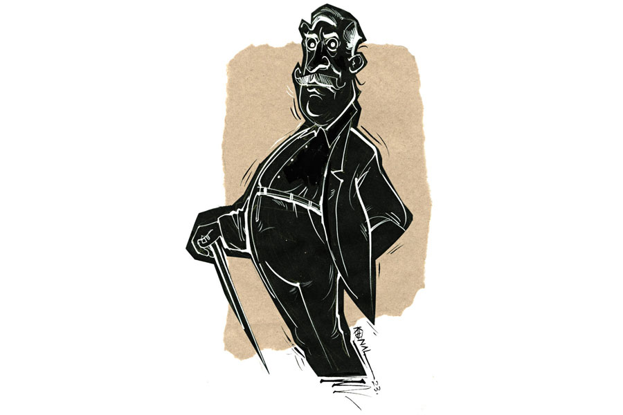

 
 <h1 align=center>বুধুবাবুর বোধোদয়</h1>
<h2 align=center>সোমজা দাস</h2> বুধুবাবু, মানে বোধিসত্ত্ব চাকলাদার যত দিন বেঁচে ছিলেন, তত দিন আশপাশের কাউকে একটি দিনের জন্য তিষ্ঠোতে দেননি। লোকে আড়ালে তাঁর নাম দিয়েছিল ‘হিটলার’। রাশভারী বুধুবাবু এক সময় উচ্চপদস্থ সরকারি আধিকারিক ছিলেন। সেই থেকে সারা দুনিয়াকে তিনি নিজের অধস্তন মনে করে ছড়ি ঘোরানোর শিল্পটি আয়ত্ত করেছিলেন। চাকরি জীবন শেষ হয়েছে বহু দিন, কিন্তু অভ্যেসটা যায়নি। কয়েকটা উদাহরণ দিলে ব্যাপারটা বোঝা যাবে।

মনে করা যাক, বুধুবাবু বাজারে যাচ্ছেন। পাড়ার চয়ন এ বাজারে চাকরিবাকরি না পেলেও প্রাইভেট টিউশনি করে মোটের উপর মন্দ রোজগার করে না। ছাত্র পড়িয়েই পুরনো টালির চালের ঘরের জায়গায় দোতলা বাড়ি তুলেছে। একটা নতুন বাইকও কিনেছে। গত বছর বিয়ে করেছে পাঁচ বছরের পুরনো প্রেমিকাকে। বুধুবাবু বাজারে যাওয়ার পথে দেখলেন চয়ন বাজারের ব্যাগ নিয়ে বাইক চালিয়ে বাড়ি ফিরছে। অন্য কেউ হলে হয়তো চোখাচোখি হলে মাথা নাড়ত, বড়জোর বলত ‘ভাল তো?’

কিন্তু বুধুবাবু তো অন্য কেউ নন।

তিনি হাত তুলে চয়নকে থামতে ইশারা করলেন। চয়ন প্রমাদ গুনল মনে মনে। বুধুবাবুর সামনে এসে ব্রেক কষল, “ভাল আছেন কাকাবাবু?”

বুধুবাবু আড়চোখে তার বাইকটা দেখে নিয়ে বললেন, “ধুলো উড়িয়ে বেড়ালেই হবে? একটা চাকরিবাকরিও তো হল না এত দিনে!”

চয়ন ক্ষুব্ধ হল হয়তো, কিন্তু তার অভিব্যক্তিতে সেটা প্রকাশ পেল না। বিনীত ভঙ্গিতে বলল, “আপনাদের আশীর্বাদে টিউশনিটা মোটামুটি চলছে কাকাবাবু।”

বুধুবাবু হাত তুলে নিবৃত্ত করলেন তাকে। হুঙ্কার ছেড়ে বললেন, “আলসেমির কোনও অজুহাত হয় না মনে রেখো। টিউশনি একটা প্রফেশন হল? আমার ছেলে পুলককে তো সেই ছোটবেলা থেকে দেখেছ। বয়সে তোমার থেকে কত ছোট! ইঞ্জিনিয়ারিং পাশ করে বড় কোম্পানিতে চাকরি করছে! আজ না হোক কাল বিদেশে চলে যাবে। তুমিও এ বার নিজের জীবনটা নিয়ে সিরিয়াসলি ভাবো। সময় চলিয়া যায় নদীর স্রোতের প্রায়, কথাটা মনে রেখো।”

চয়ন উত্তর দেয়নি। গুরুজনদের মুখে মুখে জবাব দেওয়া তার স্বভাব নয় বলেই দেয়নি। তা বলে সকলে তো আর চয়ন নয়। যেমন ধরা যাক কমলিনী বসু। এ পাড়ায় নতুন এসেছে মেয়েটি। পেশায় ফোটোগ্রাফার। মায়ের সঙ্গে থাকে।

বুধুবাবু যত দিন চাকরিবাকরি করতেন, তত দিন তাঁর জীবন বাড়ি ও অফিসের মধ্যেই সীমাবদ্ধ ছিল। এর বাইরে তাকানোর ফুরসত পাননি। অবসরের পর দেখলেন, চার দিকে অনিয়ম। সুতরাং বয়োজ্যেষ্ঠ হিসেবে সব দিকে নজর রাখার দায়িত্ব তাঁর উপর বর্তায় বইকি!

কমলিনীর কথায় আসি। বুধুবাবু এমনিতে যথেষ্ট আধুনিকমনস্ক। কিন্তু তা বলে উচ্ছৃঙ্খলতা তিনি মোটেই বরদাস্ত করতে পারেন না। মেয়েমানুষ অমন হাঁটু-কাটা পেন্টুল পরে জলে-জঙ্গলে ছবি তুলে বেড়াবে, এ কেমন সৃষ্টিছাড়া কথা! অতএব এক দিন বিকেলে হাঁটতে বেরিয়ে কমলিনীদের বাড়িতে পৌঁছে গেলেন তিনি। কমলিনী বাড়িতে ছিল না। কিন্তু তার মা ছিলেন। ভদ্রমহিলা বুধুবাবুকে দেখে প্রাথমিক ভাবে একটু অবাক হলেও আন্তরিক ভঙ্গিতে বললেন, “আসুন দাদা। ভিতরে আসুন।”

বুধুবাবু গ্রাম্ভারি চালে ভিতরে ঢুকে চার দিকে নজর ঘুরিয়ে দেখলেন। অল্প সময়ের মধ্যে সংসার বেশ গুছিয়ে ফেলেছে মা-মেয়েতে।

“বসুন না। চা খাবেন তো?” জিজ্ঞেস করলেন কমলিনীর মা।

বুধুবাবু বললেন, “আমি বিকেলে চা খেয়ে বেরিয়েছি। দিনে দু’বারের বেশি চা খাই না। নিয়ম মেনে চলি বলে এই বয়সেও পাঁচ কিলোমিটার টানা হাঁটতে পারি, বুঝলেন। নিয়ম, নিয়মটা জীবনে খুব জরুরি।”

“হ্যাঁ, তা তো বটেই,” মৃদুকণ্ঠে বললেন প্রৌঢ়া।

বুধুবাবু গলা খাঁকরে বললেন, “এই যে আপনার মেয়ে, ওই একটিমাত্র সন্তান তো আপনার?”

উপর-নীচে মাথা নাড়লেন কমলিনীর মা।

বুধুবাবু বললেন, “বলতে বাধ্য হচ্ছি, আপনি মেয়েকে উপযুক্ত শিক্ষা দেননি। এই যে হাটে-ঘাটে-মাঠে ঘুরে ঘুরে ছবি তুলে চলেছে, এটা একটা জীবন হল?”

কমলিনীর মা কিছু বলতে গেলেন। তাঁকে থামিয়ে বুধুবাবু বললেন, “দেখুন, অযাচিত জ্ঞান দেওয়া আমার স্বভাব নয়। কিন্তু এটাও সত্যি যে আপনি আপনার মেয়েকে সুশিক্ষা দিতে পারেননি। আসলে আপনারও দোষ নেই। একা মেয়েমানুষ আপনি, কত দিকই বা সামলাবেন? আপনার স্বামী বেঁচে থাকলে হয়তো তিনি শক্ত হাতে রাশ টানতে পারতেন।”

কমলিনীর মা চিন্তিত মুখে বললেন, “সে তো ঠিকই। যা-ই হোক, আপনি প্রথম বার আমাদের বাড়ি এলেন। চা না খেয়েই চলে যাবেন?”

বুধুবাবুর কাজ হয়ে গেছিল। তাই উঠে দাঁড়িয়ে গম্ভীরমুখে বললেন, “না থাক, আজ চলি। কিন্তু যেটা বললাম মনে রাখবেন। শিগগির শক্ত হাতে মেয়ের রাশ টানুন।”

ব্যাপারটা সেখানেই শেষ হতে পারত। কিন্তু হয়নি। এর দিন দুয়েক পরেই তাঁকে রাস্তায় পাকড়াও করেছিল ঢ্যাঁটা মেয়েটা। চোখ পাকিয়ে জিজ্ঞেস করেছিল, “আপনি আমাদের বাড়ি গিয়ে আমার মাকে কী বলে এসেছেন?”

বুধুবাবু ভয় পাওয়ার পাত্র নন। বললেন, “গুরুজনদের সঙ্গে কী ভাবে কথা বলতে হয় সেই শিক্ষাও তো হয়নি দেখছি!”

কমলিনী জ্বলন্ত দৃষ্টিতে তাকিয়ে ছিল কিছু ক্ষণ। তার পর বলেছিল, “সেই শিক্ষাটা আছে বলেই আজ শুধু কথাটুকুই বললাম। মনে রাখবেন, অন্যদের জীবন নিজের রুলবুক অনুসারে চালানো যায় না। সে চেষ্টা করলে নিজেই ঠকবেন।”

এ ভাবেই চলছিল। বুধুবাবু সকলের উপর ছড়ি ঘুরিয়ে বেশ ছিলেন। কিন্তু বেশি দিন চলল না। আজ সকালে বারান্দায় শীতের রোদে পিঠ মেলে বসে খবরের কাগজ পড়ছিলেন তিনি। চায়ে চুমুক দিয়ে নাকটা কোঁচকালেন। পরবর্তী মিনিট পনেরো নারীর সাংসারিক কর্তব্য নিয়ে স্ত্রীকে একপ্রস্ত লেকচার ঝাড়লেন। বুধুবাবুর স্ত্রী মনোলীনাদেবী সাদাসিধে মানুষ। প্রতিবাদ দূরে থাক, স্বামীর কথাকেই বেদবাক্য মেনে জীবনের বারো আনা কাটিয়ে দিয়েছেন। আজও তার অন্যথা হল না।

মনোলীনাদেবী ভিতরে যেতে বুধুবাবু আবার খবরের কাগজে চোখ রেখেছেন কি রাখেননি, বুকের বাঁ দিক চেপে ধরে গড়িয়ে পড়লেন। ব্যস, আর উঠলেন না। ডাক্তার এলেন। বেলা বারোটা নাগাদ তাঁকে মৃত হিসেবে ঘোষণা করলেন ডাক্তার।

এই অবধি সব ঠিকঠাক ছিল। জীবিত অবস্থায় ভূতপ্রেতে বিশ্বাস ছিল না বোধিসত্ত্ব চাকলাদারের। কিন্তু মৃত্যুর অব্যবহিত পরেই তিনি নিজেকে ভরহীন এক অদৃশ্য সত্তা হিসেবে আবিষ্কার করলেন। তাঁর এত দিনের বিশ্বাসে জোর ধাক্কা লাগল বটে, তবে কিছু ক্ষণের মধ্যেই তিনি অনুভব করলেন পরিস্থিতিটা মন্দ নয়। বেশ একটা থ্রিলিং ব্যাপার আছে। কেউ তাঁকে দেখতে পাচ্ছে না, অথচ তিনি দিব্যি সকলকে দেখতে পাচ্ছেন। সব কথা শুনতে পাচ্ছেন। ইদানীং বাত-ব্যাধিতে ভুগছিলেন। মৃত্যুর পর আর কোমরে বেদনা বোধ হচ্ছে না।

বেশ কিছু ক্ষণ হাওয়ায় ভেসে ঘুরে বেড়ালেন তিনি। বাড়িতে শোকের পরিবেশ। লোকজন আসা-যাওয়া করছে। বেশি ভিড়ভাট্টা কোনও দিনই পছন্দ করেন না বুধুবাবু। ভাবলেন নিজের ঘরে গিয়ে একটু বিশ্রাম নেবেন।

ঘরের দরজাটা ভেজানো। ভিতরে নিচু গলায় কথাবার্তা শোনা যাচ্ছে। একটি গলা তাঁর ছেলে পুলকের। অপর জন কে দেখার জন্য ছায়াশরীর গলিয়ে দিলেন দুই কপাটের ফাঁক দিয়ে। পুলক বিছানায় বসে আছে। সামনে দাঁড়িয়ে আছে চয়ন। চাপা গলায় বলছে, “টাকা নিয়ে চিন্তা করিস না। সে ব্যবস্থা হয়ে যাবে। কিন্তু তুই তিন বছর ধরে চাকরি করেও এ ভাবে টাকা নয়ছয় করেছিস, এটা তোর বাড়ির লোক জানে?”

পুলক মাথা নেড়ে ধরা গলায় বলল, “না। বাবাকে তো জানো তুমি চয়নদা। কোনও দিন কারও কথা শুনেছে বাবা যে আমার কথা শুনবে? বন্ধুদের কথায় শেয়ার ট্রেডিং শুরু করেছিলাম। প্রথম প্রথম টাকা ভালই বাড়ছিল। তাই দেখে সঞ্চয়ের প্রায় পুরোটাই ইনভেস্ট করে দিয়েছিলাম। এ রকম হবে বুঝতে পারিনি, বিশ্বাস করো। এখন এমন অবস্থা যে, বাবাকে শ্মশানে নিয়ে যাওয়ার টাকাটুকুও আমার হাতে নেই। তার পরেও শ্রাদ্ধশান্তি, আরও সব কাজ আছে। বাবা তো মায়ের হাতেও টাকা দিতেন না। তাই তাঁর কাছে যে হাত পাতব, সে উপায়ও নেই।”

চয়ন পুলকের কাঁধে হাত রেখে সান্ত্বনার সুরে বলল, “এত ভাবিস না। যা লাগবে আমার থেকে নিয়ে নিস। সময়-সুযোগ মতো ফেরত দিলেই চলবে। তাড়া নেই।”

পুলকের চোখে জল স্পষ্ট দেখতে পাচ্ছেন বুধুবাবু। একটা দীর্ঘশ্বাস ফেলে বাইরে এলেন তিনি। অফিসের পুরনো সহকর্মীরা এসেছে অনেকে। সুপ্রিয়া চন্দ ছিল বুধুবাবুর অফিসের জুনিয়ার স্টাফ। ঠোঁটকাটা মেয়েটিকে কোনও দিনই পছন্দ করতেন না তিনি। আজ দেখলেন সুপ্রিয়া মনোলীনার পাশে বসে আছে। মনোলীনার হাত নিজের হাতে নিয়ে বলছে, “বৌদি, মনকে শক্ত করো। দাদা সব সময় তোমার পাশেই আছেন।”

মনোলীনা শাড়ির আঁচল তুলে চোখ মুছলেন। বিষণ্ণ হেসে মৃদুকণ্ঠে বললেন, “তোমাদের দাদা আমার পাশে কোনও দিনই ছিলেন না। আমরা আসলে তাঁর রাজত্বের প্রজা ছাড়া কখনও কিছু ছিলাম না। তুমি হয়তো আমাকে মন্দ ভাববে, কিন্তু আজ তোমার দাদা আমাদের ছেড়ে যাওয়ার সময় আমার শেকলটাও কেটে দিয়ে গেছেন।”

বুধুবাবু দেখছেন। এই মানুষগুলো তাঁর একান্ত আপন ছিল। এই বাড়িটা তার নিজের ছিল। আজ মৃত্যুর কয়েক ঘণ্টার মধ্যে তাঁকে জানতে হল, তাঁর পরিবারের কেউ তাকে আপন বলে ভাবতেই পারেনি! ছেলে তার সমস্যার কথা বাবাকে বলতে সাহস করেনি! তাঁর মৃত্যুতে স্ত্রী স্বস্তি বোধ করছেন! অভিমানে স্তব্ধ হয়ে সেখানেই দাঁড়িয়ে রইলেন কিছু ক্ষণ। তিনি নেই বেশ কয়েক ঘণ্টা হল। অথচ তাঁকে ছাড়া কিছু তো আটকে নেই কোথাও। জীবন চলেছে জীবনের মতো। কোথাও কিছু থেমে নেই।

ভাবতে ভাবতে বাড়ি ছেড়ে রাস্তায় বেরিয়ে এসেছিলেন বুধুবাবু। একটু হয়তো অন্যমনস্ক হয়ে পড়েছিলেন। হঠাৎ তার গা ঘেঁষে একটা গাড়ি ছুটে গেল। গাড়ির গতিতে তাঁর সূক্ষ্ম দেহের কিছু অংশ রেণুর মতো ছড়িয়ে পড়ল বাতাসে। বেশ বিরক্ত বোধ করলেন তিনি। অপেক্ষা করলেন, বেশ কিছুটা সময় লাগল সেগুলি স্বস্থানে ফিরে আসতে।

গাড়িটা কমলিনীদের গেটের সামনে গিয়ে দাঁড়িয়েছে। জনাকয়েক ছেলেমেয়ে গাড়ি থেকে নেমে ওই বাড়িতে ঢুকে গেল। কৌতূহল বোধ করলেন বুধুবাবু। এক বার ভাবলেন, এত লোকের মাঝখানে যাওয়া কি ঠিক হবে। পরমুহূর্তে মনে পড়ল, এখন তিনি বিদেহী। যেখানে খুশি যেতে পারেন।

সদর দরজা বন্ধ দেখে এক মুহূর্তে দাঁড়ালেন তিনি। তার পর দেহটা যথাসম্ভব সঙ্কুচিত করে চাবি গলানোর ফুটো দিয়ে ভিতরে প্রবেশ করলেন। ঘরের ভিতরে চেয়ারে বসে আছে কমলিনী। বেশ কয়েকটা বুম তার দিকে তাক করা। গলায় সংবাদসংস্থার পরিচয়পত্র ঝোলানো একটি ছেলে জিজ্ঞেস করল, “আপনার তোলা ছবি নানা দেশি-বিদেশি পত্রপত্রিকায় প্রকাশিত হয়েছে অনেক বার। এ বার আপনার ‘আ ভিলেজ গার্ল’ ছবিটি ন্যাশনাল ফোটোগ্রাফি অ্যাওয়ার্ডের জন্য নির্বাচিত। কেমন লাগছে?”

কমলিনী হাসিমুখে বলল, “অবশ্যই খুব ভাল লাগছে।”

“আপনার এই সাফল্যে কার অবদান সবচেয়ে বেশি?”

কমলিনী একটু চুপ করে থেকে তার পর বলল, “কৃতিত্ব পুরোটাই আমার মায়ের। কলকাতা ইউনিভার্সিটির ইকনমিক্সে গোল্ড মেডেলিস্ট আমার মা, নামী মাউন্টেনিয়ারও ছিলেন। রিজ়ার্ভ ব্যাঙ্ক অব ইন্ডিয়ায় উচ্চপদস্থ অফিসার ছিলেন এক সময়। তিনিই আমাকে শিখিয়েছেন নিজের শর্তে বাঁচতে। শিখিয়েছেন কোনও পরিস্থিতিতেই নিজের ভাল লাগার সঙ্গে আপস না করার মন্ত্র। সিঙ্গল মাদার হয়ে সমাজকে বুড়ো আঙুল দেখিয়ে বড় করেছেন আমাকে। মেডিক্যালের লাস্ট ইয়ারে ফোটোগ্রাফির নেশায় আমি যখন পড়া ছাড়লাম, মা তখনও আমাকে সমর্থন করেছিলেন। বলেছিলেন, যা ভাল লাগে তাই করতে। আমি তা-ই করেছি।”

বুধুবাবু আর দাঁড়ালেন না। সারা জীবন ধরে তিনি যা কিছু ঠিক বলে জেনেছেন, মৃত্যুর কয়েক ঘণ্টার মধ্যে জানলেন সে সবই তাঁর ভুল। এত বছর ধরে শুধু ভুলের পাহাড় খাড়া করেছেন তিনি। সেই পাহাড়চুড়োয় বসে থেকেছেন অন্ধ, গর্বিত সম্রাটের মতো। নিজের আশপাশের লোকেদের দিকে তাকিয়ে দেখেননি, তাদের ভাবনার অংশীদারিত্ব চাননি কোনও দিন।

আজ এই খোলা আকাশের নীচে দাঁড়িয়ে তিনি উপলব্ধি করছেন, এ জগতে তাঁর জায়গা এতটুকুই, সামান্য কয়েকটি অদৃশ্য অণুপ্রমাণ। আজ বুঝতে পারছেন তিনি, প্রতিটি মানুষের ভূমিকা এই পৃথিবীতে অত্যন্ত সীমিত। তবু মানুষ রয়ে যায়, বেঁচে থাকে অন্যদের সুখস্মৃতিতে, ভালবাসায়। একটা আস্ত জীবন পেয়েছিলেন তিনি বাঁচার মতো করে বাঁচার জন্য। অথচ কার্যকালে তাকে হেলায় হারিয়েছেন।

আজ এই মুহূর্তে পড়ন্ত গোধুলির আলোয় নিজেকে ধীরে ধীরে ক্ষয়ে যেতে দেখছেন বুধু চাকলাদার, মিশে যাচ্ছেন আলোয়, বাতাসে। বেঁচে থাকতে শেষ কবে কেঁদেছিলেন মনে পড়ে না। আজ যাওয়ার বেলায় চাইলেও চোখে জল আসছে না। পরজন্ম বলে যদি সত্যিই কিছু থাকে, আবার না-হয় নতুন করে শুরু করবেন সব কিছু। জানতে চেষ্টা করবেন, সবার জন্য সবার মধ্যে বেঁচে থাকায় সুখ ঠিক কতটা!

ছবি: কুনাল বর্মণ