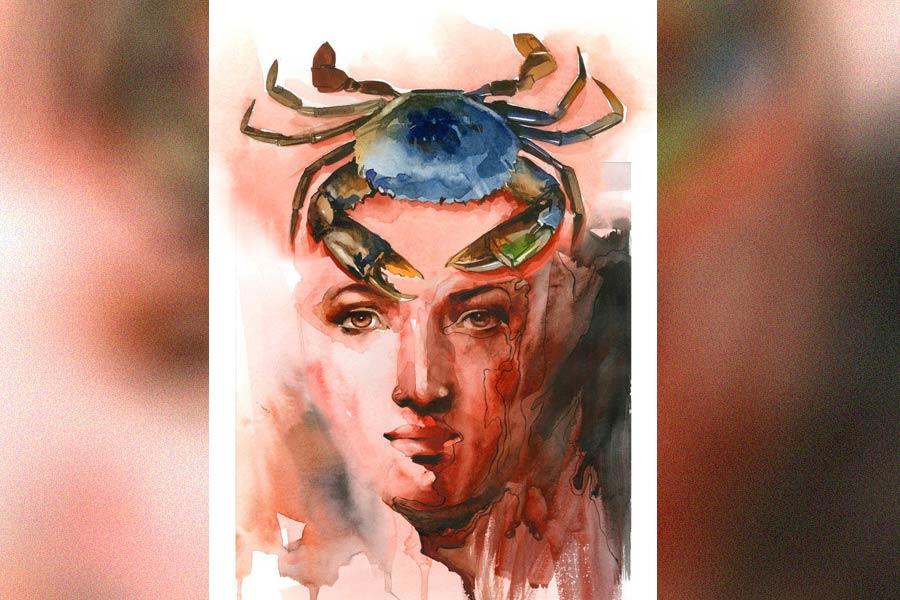

 
 <h1 align=center>বৃশ্চিক দংশন</h1>
<h2 align=center>তমাল গঙ্গোপাধ্যায়</h2> এক কালে রায়মঙ্গল আর বিদ্যেধরীর মোহনার কিছু আগে শিবনাথ চক্রবর্তীদের বিঘে পনেরো এলাকা জুড়ে বিশাল আমবাগান ছিল। বছর কুড়ি আগে সেই বাগান সরকারি খাতায় ‘খাস জমি’ হিসাবে নথিভুক্ত হওয়ার গোপন খবর জানার পরে কয়েকটি বাগদী পরিবার প্রথমে সেই বাগানে অস্থায়ী বাসা বেঁধে বসবাস শুরু করে দিল। দরমার বেড়া। বাঁশের খুঁটি। প্লাস্টিকের ছাউনি।

চক্রবর্তী পরিবারের অনেক শরিক, অধিকাংশ শরিক ভারতের বিভিন্ন শহরে চাকরি করতেন। পৈতৃক জমির প্রতি তাঁদের বিশেষ টান ছিল না। প্রাচীন ভিটে এখন ধ্বংসস্তূপ। চক্রবর্তীদের এক শরিক কলকাতা শহরে থাকতেন। চক্রবর্তী পরিবারের সেই সদস্যের বৎসরান্তে এক বার গ্রামে আগমন ঘটত আমবাগান আর পুকুর লিজ়ের টাকার আকর্ষণে। আমবাগানে যে গোটা পাঁচেক ঘর উঠেছে, সে খবর তিনি পেলেন। গুরুত্ব দেওয়া প্রয়োজন মনে করলেন না। ফলে আমবাগানে অস্থায়ী ঘরের সংখ্যা ক্রমেই বাড়তে শুরু করল। বছর দুয়েকের মধ্যেই আমবাগান ‘বাগদী কলোনি’তে পরিণত হল। আমগাছের বড় বড় ডাল কেটে সেই ডাল দিয়েই তৈরি হল ঘরের খুঁটি। অস্থায়ী বাসিন্দারা জমির পাট্টা পেলেন। চক্রবর্তীদের আমবাগানে কয়েকটি গাছ ছাড়া বাগানের আর কোনও অস্তিত্ব থাকল না। 

দুই নদীর মাঝখানে হঠাৎ গজিয়ে ওঠা কলোনি দেখতে দেখতে বেশ জমজমাট হয়ে গেল।

কলোনির চার দিকে মাছের ভেড়ি। সেখানে বাগদা চিংড়ি থেকে ভেটকি সব রকমের মাছের রমরমা কারবার। কিছু দূরের গঞ্জে মাছের আড়ত। মাছ আড়তে চালান হয়। আড়ত থেকে চালান হয় কলকাতায়। আকারে বড় চিংড়ি রফতানি হয় বিদেশে, আর ছোট চিংড়ি কলকাতাবাসীর ভাগ্যে জোটে। বাগদী কলোনির বাসিন্দাদের কাজের অভাব হল না। নেট দিয়ে তৈরি এক ধরনের জাল দিয়ে নদীর নোনা জলে মাছের মীন বা বাচ্চা ধরে বিভিন্ন ভেড়ি-মালিকদের কাছে বিক্রি করা থেকে শুরু করে ভেড়িতে জাল ফেলে মাছ ধরে কলোনির বাসিন্দাদের রোজগার বেশ ভালই শুরু হল। সরকারি সাহায্যে কয়েকটি পাকা ঘর তৈরি হয়ে গেল, আর কিছু ঘর দরমার বেড়া আর টালির ছাউনি সম্বল করে দাঁড়িয়ে রইল।

*****

গরিব-অভাবী মানুষের হাতে বাড়তি টাকা অনেক উটকো সমস্যার জন্ম দেয়। ফলে সন্ধ্যার পরেই বাগদী কলোনির শেষ প্রান্তে প্রথমে একটা চোলাই মদের ঠেক গড়ে উঠল। যে মানুষগুলো এত দিন উৎসব অনুষ্ঠানে তাড়ি অথবা হাঁড়িয়া খেয়ে আনন্দ করত, এখন তারা সকলেই রাতারাতি চোলাইয়ের ভক্ত হয়ে গেল। চোলাই থেকে বাংলা সবই চলত। সন্ধের পর জুয়ার আসর। কয়েক জন সুযোগসন্ধানী দেহোপজীবিনীর আবির্ভাবে কলোনির বাতাস ক্রমেই দূষিত হতে শুরু করল। বাড়ির পুরুষরা রাত হলেই নেশার ঠেকে আসর জমিয়ে, রাতে বাড়িতে ফিরে নিজের বৌকে পিটিয়ে পুরুষত্ব জাহির করে মদ্যপানের সুনাম অক্ষত রাখত।

এই বাগদী কলোনির অন্যতম বাসিন্দা ছিল মনা বাগদী। মনার ভাল নাম ছিল মনোয়ারা। পিতৃদত্ত নাম সময়ের সঙ্গে সঙ্গে পরিবর্তিত হয়ে ছোট আকার ধারণ করল। দু’টি সন্তানের জন্ম দেওয়ার পর মনা বাগদীর স্বামী এক দিন বিষাক্ত চোলাই খেয়ে, দুটি নাবালক সন্তানের দায় মনোয়ারার উপর চাপিয়ে জীবন থেকে অব্যাহতি নিল।

দুই সন্তানের এক জনের বয়স তিন, অপর জনের চার। মনা বাগদীর বয়স তখন মাত্র কুড়ি। চেহারার জৌলুস বেশ আকর্ষণীয়। অভাবের সংসারে দয়া দেখিয়ে ফায়দা লোটার আশায় বেশ কিছু ছেলে-ছোকরার উৎপাত শুরু হয়ে গেল। মনোয়ারা নিজেকে শক্ত রাখার চেষ্টায় বঁটি নিয়ে কয়েক জনের দিকে তেড়ে গেল। অবশেষে ছেলে-ছোকরার দল মনোয়ারার বাড়ির বেশ কিছু টালি ঢিল মেরে ভেঙে নিজেদের আশাভঙ্গের বেদনায় কিছু প্রলেপ লাগিয়ে বিদায় নিল।

বঁটি দেখিয়ে পুরুষ হায়নাদের লোলুপ দৃষ্টি আটকানো যায়, কিন্তু সন্তানদের খিদে মেটানো যায় না। তার জন্য টাকার প্রয়োজন। মনোয়ারার বাবা মেয়ের বিয়ে দিয়ে কন্যাদায় থেকে নিস্তার পেয়েছেন। তিনি মনোয়ারার স্বামী মারা যাওয়ার খবর পেয়ে মাত্র এক বার এসেছিলেন, আর মনোয়ারার সংসারের খবর নেওয়ার প্রয়োজন মনে করেননি।

মনোয়ারা জাল ফেলে মাছ ধরতে জানে না। মাঠের কাজ জানে না। ফলে তার সন্তানদের অধিকাংশ দিন এক বেলা খাবার জোটে, রাতে উপোস। অবশেষে মনোয়ারা নদীর মোহনায় চিংড়ি মাছের মীন বা বাচ্চা ধরার চেষ্টা শুরু করল। কিন্তু নদীতে খুব সকালে না পৌঁছলে কিছুই পাওয়া যায় না। এ দিকে ছোট বাচ্চাদের ঘরে রেখে রাত থাকতে মনোয়ারা নদীতে যেতে পারে না। ফলে মাছের বাচ্চা মনোয়ারার ভাগ্যে ঠিকমতো জোটে না।   

অনেক চিন্তা করে মনোয়ারা অন্য একটা উপায় বার করল। নদীর পাড়ে বড় বড় গর্ত। তার ভিতরে কাঁকড়াদের বাস। মনোয়ারা সেই গর্ত থেকে কাঁকড়া ধরা শুরু করল। প্রথম প্রথম কাঁকড়ার কামড়ে মনোয়ারার আঙুল থেকে রক্ত বেরোত। আঙুল নীল হয়ে যেত। তবু সন্তানদের মুখে খাবার তুলে দিতে পেরে মনোয়ারা শান্তি পেত। নীল হয়ে যাওয়া আঙুলের যন্ত্রণা সন্তানদের মুখের হাসি দেখে কিছুটা কমে যেত।

এই ভাবে মনোয়ারা কাঁকড়া ধরার একটা নিজস্ব টেকনিক আবিষ্কার করে ফেলল। কাঁকড়ার কামড় থেকে আঙুল বাঁচিয়ে ভাল কাঁকড়া ধরতে শিখে গেল। তিনটে বড় বড় কাঁকড়া ধরতে পারলেই দু’বেলার খাবারের সংস্থান হয়ে যায়। কাঁকড়া বিক্রি হয় অন্য আড়তে। সেই সব কাঁকড়া এক্সপোর্ট হয়। মনোয়ারা বাগদীর জীবন এই উপায়ে বেশ ভালই চলছিল, কিন্তু সমস্যা এল অন্য দিক থেকে। মনোয়ারার সন্তানগুলোর মাঝে মাঝেই জ্বর হত। এলাকার একমাত্র হাতুড়ে ডাক্তারের ওষুধে এক জন কিছুটা সুস্থ হতে না হতেই অপর সন্তানের শরীরে জ্বরের উপসর্গ শুরু হয়ে যেত।

অবশেষে সেই ডাক্তার নিদান দিলেন, “নিজের ঘরটা পাকা ঘর করে নে মনা। এখন বর্ষাকাল, এর পর শীত আসবে। তখন তোর ওই দরমার বেড়া, টালির ছাউনি আর মাটির মেঝের জন্য তোর বাচ্চাগুলোর আবার জ্বর হবে।”

মনোয়ারা বলল, “টাকা কোমনে পাবো গো ডাক্তার? বর্ষাকালে ভাঙা টালি থেকে বৃষ্টির পানি পড়ে। ভাঙা টালি বদলাতে পারি নে, তুমি আমারে ঘর করার কথা বলতেছ! আমার বিছানা ভিজে যায় কিন্তু উপায় নেই তাই রাতের বেলা ওখানেই বাচ্চাগুলোরে নে শুতি হয়।”

“মেম্বারকে গিয়ে বল। মেম্বার যদি চায় তোর ঘর পাকা করে দিতে পারবে,” পরামর্শ দেন ডাক্তার।

ডাক্তারের কথা মনোয়ারার মনে আশা জাগাল। সে পঞ্চায়েত মেম্বারকে চেনে। এক দিন এলাকার মেম্বার সফিনকুল তার বাড়িতে এসে বলেছিল, “কোনও অসুবিধে হলে আমাকে জানাবি মনা। তোর বর আমাদের দলের লোক ছিল। তোর সুবিধে-অসুবিধে দেখার দায় আমার।”

*****

মনোয়ারা অনেক আশা নিয়ে এক দুপুরে এলাকার মেম্বার সফিনকুলের বাড়ি গেল।

অবিবাহিত সফিনকুল তখন নিজের বাইরের ঘরের বিছানায় দিবানিদ্রার চেষ্টা করছে। নিজের পেল্লায় বাড়ির দরজায় ধাক্কার শব্দ শুনে বিছানা থেকে উঠে দরজা খুলে অবাক হয়ে বলল, “কী রে মনোয়ারা? এই দুপুরবেলা তুই কেন এসেছিস?”

“মেম্বার, তুমি নাকি সকলের ঘর পাকা করে দাও! তোমার অনেক ক্ষমতা। আমার বাচ্চাগুলোর কেবল জ্বর হয়। ভাঙা ঘরে বিষ্টিতে ভেজে, শীতে কাঁপে। কিছুতেই সারে না। আমার ঘরটা পাকা করে দোবা?”

“দেখ মনা, সকলের ঘর তো পাকা হয়নি। ওরা সব নিজেরা করে নিয়েছে। আমার হাতে ক্ষমতা থাকলে তোর ঘর আমি সকলের আগে পাকা করে দিতাম!” সফিনকুল দায় এড়ানোর চেষ্টা করে।   

“এক বারটি করে দাও না গো মেম্বার। তোমার এই উপকার আমি চেরটা কাল মনে রেখে দোব।”

“মনা, আমি কেবলমাত্র সই করি। বাকি সব কিছু ওই ইঞ্জিনিয়ারদের উপর নির্ভর করে। মেম্বারদের কথা ওরা পাত্তা দেয় না।”

“তুমি চাইলেই পারো। ঘরটা পাকা করে দাও না গো মেম্বার!” কোনও উপায় না পেয়ে মনোয়ারা মেম্বার সফিনকুলের পা দুটো জড়িয়ে ধরে।

সফিনকুল কতকটা নিরুপায় হয়ে বলে, “আচ্ছা, তুই হাজার কুড়ি টাকা নিয়ে আমার সঙ্গে দেখা করিস। আমি এক বার চেষ্টা করে দেখতে পারি, তোকে এই কথা আমি দিতে পারি। ঘর না দিতে পারলে তুই তোর ­টাকা ফেরত পাবি।”

“কুড়ি হাজার! ও মেম্বার, এত টাকা যে আমি জীবনে কোনও দিন দেখিনি গো।” কথা শেষ করে মনোয়ারা মেম্বার সফিনকুলের পা দুটো আরও শক্ত করে জড়িয়ে ধরে। সফিনকুল প্রথমে মনোয়ারার শরীরের স্পর্শ ঠিক বুঝতে পারছিল না, কিন্তু এখন বেশ অনুভব করতে পারল মনোয়ারার যৌবনের স্পর্শ। তার শরীর জেগে উঠল।

সফিনকুল নিজের হাত দিয়ে মনোয়ারাকে তুলে কোমল স্বরে বলল, “দেখ মনোয়ারা, এই দুনিয়ায় কোনও কিছুই মাগনা পাওয়া যায় না, বিনিময়ে কিছু দিতে হয়। যদি তুই কিছু দিস তবে আমি চেষ্টা করতে পারি।”

“আমারে একটা পাকা ঘর দাও মেম্বার, আমি তোমার কথা সারা জীবন মনে রাখব,” মনোয়ারার কণ্ঠে করুণ আকুতি।

“উপকার কেউ মনে রাখে না রে মনা। এটা নগদে দেনা-পাওনার যুগ। যদি মনে রাখতেই চাস, তা হলে ঘরের দরজাটা বন্ধ করে আমার বিছানায় এসে বোস। আমি বুঝিয়ে বলছি তোর কী কী কাগজ লাগবে, কোথায় কী দরখাস্ত করতে হবে, দেখি তোর জন্য কী করতে পারি।”

মনা বাগদী মেম্বারের চোখের ভাষা আর কথার ইঙ্গিত থেকে সব কিছুই বুঝতে পারল। প্রথমে ভাবল এই ঘর থেকে সে এখুনি চলে যায়, কিন্তু পরক্ষণে নিজের সন্তানদের কষ্টের কথা তার মনে পড়ে গেল।

সে দরজার সামনে গিয়ে ঘরের আগলটা দিয়ে ধীরে ধীরে মেম্বারের খাটের দিকে এগিয়ে গিয়ে নিজের দু’চোখের পাতা বন্ধ করে কেবল তার সন্তানদের হাসিমুখগুলো খোঁজার চেষ্টা করল। সন্তানদের মুখে হাসি ফোটানোর জন্য তাকে এক সময় কাঁকড়ার দাঁড়া সহ্য করতে হয়েছে, আর আজ দাঁতে দাঁত চেপে সহ্য করতে হচ্ছে এক বৃশ্চিকের কামড়।

সফিনকুল ঠিকই বলেছে, মাগনা কিছু পাওয়া যায় না। কিছু পেতে হলে জীবনের দাঁত-নখ সহ্য করতে হয়। অসহায় মনোয়ারার দু’গাল বেয়ে ক্ষীণ জলের ধারা নামে। এ বার হয়তো তার ঘরটা পাকা হবে...