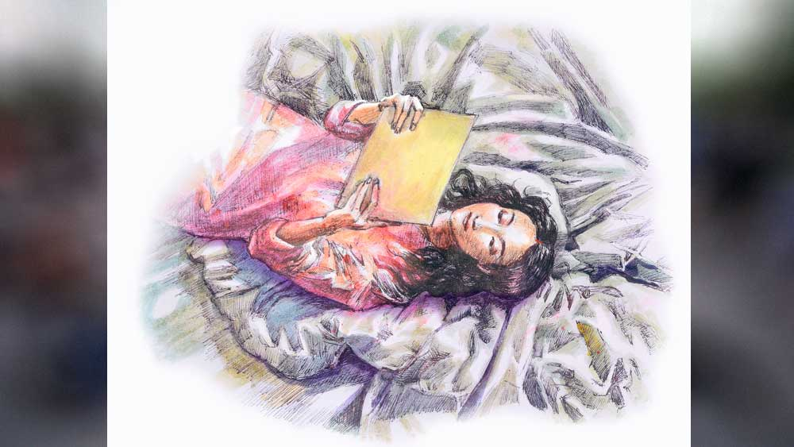

 

<h1 align=center>বৃশ্চিকবৃত্ত</h1>
<h2 align=center>সুপ্রিয় চৌধুরী</h2>
   যেতে যেতে মনের মধ্যে এটা-সেটা ভাবনার যাওয়া-আসা। পাঞ্জিপাড়া থেকে ভিকির ফোন আসার পর প্রায় হপ্তাদুয়েক হতে চলল, মামুদের দিক থেকে কোন ইস্পেশাল নড়াচড়া দেখা যায়নি মহল্লায়। ওকেও কেউ কিছু পুছতাছ করেনি এ ব্যাপারে। মনে হচ্ছে ওর ব্যাপারে কিছু জানতে পারেনি ড্রেসওয়ালারা। কম সে কম ছে-সাত মাহিনা সাপ্লাই আনা-নেওয়ার কাজ করবে না, ঠিক করে নিয়েছে সদানন্দ। প্রথমে তো ভেবেছিল মহল্লায় কাস্টমার ধরার কাজেও বেরোবে না মাস দু’-তিনেক। অনেক ভেবেচিন্তে মত পাল্টেছে। বলা নেই, কওয়া নেই, এ ভাবে অচানক ফট করে কাজ বন্ধ করে ঘরে বসে গেলে চার পাশে সবার সন্দেহ হয়ে যাবে। দুনিয়ার যত্ত হারামির ঠিকানা ওদের মহল্লা। কোত্থেকে কার মনে শালা কী খোট ঢুকে যাবে, এ-কান, ও-কান, পাঁচকান হতে হতে সিধে পৌঁছে যাবে মামুদের টেবিলে। তা ছাড়া রাস্তায় বেরোলেই যখন দু’-দশ টাকা পকেটে ঢোকে, তখন সেই লছমিকে পায়ে না ঠেলাই ভাল। হাঁটার গতি বাড়িয়ে দিল সদানন্দ।   নতুনবাজারের কাছে সরকারি মালের দোকানটার গ্রিল লাগানো কাউন্টারের ভেতর হাত ঢুকিয়ে রামের একটা পাঁইট কিনল সদানন্দ। দোকান থেকে বেরিয়ে এসে নিমতলা স্ট্রিট ধরে হাঁটা লাগাল সোজা। জোড়াবাগানের সরু গলিটার কাছে আসতেই একটা লোক। পাতলাপানা চেহারা, এগিয়ে এল সামনে। মুখে এক গাল হাসি, “নমস্তে সদানন্দ ভাই! চিনতে পারছ?”   “কওন হ্যায় আপ?” ভুরু কুঁচকে প্রশ্ন করল সদানন্দ।   “সে কী দাদা, সেই যে মাসদুয়েক আগে তোমার কাছে এসেছিলাম, হেব্বি একটা মালের কাছে নিয়ে গেছিলে। মনে পড়ছে?”   মনে মনে ঘাম দিয়ে জ্বর ছাড়ল সদানন্দর। যাক বাবা, কাস্টমার! ভেতরে-ভেতরে তো বেশ ঘাবড়েই গেছিল। হাজারটা কাস্টমারের সঙ্গে মুলাকাত বাতচিত হয় রোজ, খুব বাঁধা পার্টি না হলে কোন শালার মুখ আর মনে থাকে অত। মুখে সেটা প্রকাশ না করে কান এঁটো করা একটা হাসি হাসল সদানন্দ, “হাঁ হাঁ, এ বার মনে পড়েছে! লেকিন মহল্লায় না গিয়ে এখানে কেন?”   কথার জবাবে সদানন্দের কাঁধে সোৎসাহে একটা চাপড় মেরে হেসে উঠল লোকটা, “আরে বস, ও দিকেই তো যাচ্ছিলুম। কিন্তু কী যোগাযোগ দেখো, রাস্তাতেই তোমার সঙ্গে দেখা হয়ে গেল!”   মনে মনে খুশিতে ফুটছিল সদানন্দ। ওফ, কী কপাল শালা! আসার সময় বাবা ভূতনাথের থানে প্রার্থনা জানিয়ে এসেছিল। বাবার অপার দয়া! মহল্লায় অন্য দালালদের সঙ্গে একটা কাস্টমার নিয়ে ঝেলঝাল ঝামেলা নেই, কুত্তার কামড়াকামড়ি নেই। ছপ্পর ফাড়কে হাতকা সামনে কাস্টমার লাকে ফেক দিয়া ভোলেনাথ।   “বহোত আচ্ছা হুয়া স্যর!” খুশিটা ফুটে বেরোল সদানন্দের গলায়, “চলিয়ে চলিয়ে, অওর ভি আচ্ছে মাল কে পাস লেকে জাউঙ্গা আপকো।”   জবাবে মুচকি হেসে চোখ টিপল লোকটা, “এ বার একা আসিনি। সঙ্গে কয়েকজন বন্ধু আছে।”   শোনামাত্র দমচাপা খুশিটা এক লাফে একশো গুণ বেড়ে গেল সদানন্দর! জিয়াদা কাস্টমার মতলব জিয়াদা কমিশন।   “কাঁহা হায় ওহলোগ?” খুশিটাকে ঢোঁক গিলে জিজ্ঞেস করল সদানন্দ।   “গাড়িতে বসে আছে,” আঙুল তুলে সামনে দেখাল লোকটা।   গলির মুখে ফুটপাত ঘেঁষে পার্ক করা একটা সাদা সুমো। দ্রুত ফুট পেরিয়ে গাড়ির মাঝখানের দরজাটা খুলে ধরল লোকটা। ভেতরে বসা একটা লোক। দানবের মতো চেহারা। পেছনের সিটে একটা মেয়ে। চমকে উঠল সদানন্দ! সোনাগাছিতে মেয়ে নিয়ে এসেছে কেন? কিছু বুঝে ওঠার আগেই সুনীলের হাতের হ্যাঁচকা টানে একটা চড়াইছানার মতো গাড়ির মধ্যে ঢুকে গেল সদানন্দের শরীরটা। পরমুহূর্তেই পিছন থেকে ঘাড়ের ওপর মার্শাল আর্টের নিপুণ কায়দায় এসে আছড়ে পড়া মোক্ষম একটা সাইড কাট রদ্দা। সঙ্গে সঙ্গে জ্ঞান হারাল সদানন্দ!      খাটে শুয়ে রিপোর্টের কাগজটার দিকে একদৃষ্টে তাকিয়ে ছিল শ্রীপর্ণা। আজই হাতে পেয়েছে রিপোর্টটা। বুক বেয়ে উঠে আসা থিরথিরে একটা কাঁপুনি। গত মাসে পিরিয়ড হয়নি। এ মাসেও না। ক’দিন আগে সদর হাসপাতালে গিয়েছিল। ফেরার পথে ওষুধের দোকান থেকে প্রেগন্যান্সি কিট কিনেছিল একটা। কিটের রিপোর্ট প‌জ়িটিভ দেখিয়েছিল। এখনই রুদ্রকে ফোন করা দরকার, মনের মধ্যে তীব্র ইচ্ছেটা ঝিলিক দিয়ে উঠেছিল প্রথমেই। অতি কষ্টে সংযত করেছিল নিজেকে। নাহ, আগে হাসপাতালে ইউরিন টেস্টের রিপোর্টটা আসুক। তখন দেখা যাবে। সেই রিপোর্টও আজ একই কথা বলছে। এর একটাই মানে হয়। সে আসছে! দুটো খুব দুঃখী মানুষের কোনও মতে টিকে থাকা, ভীষণ নড়বড়ে সম্পর্কের সেতুটায় পাকা গাঁথনি পড়তে চলেছে আবার।   খুব আলতো করে পেটে হাত বোলাল শ্রীপর্ণা।   “তুমি মিমো না মিমি? বাইরে আসতে ইচ্ছে করছে?” খুব আদুরে একটা গলায় জিজ্ঞেস করল ফিসফিস করে। চোখের জলে ভিজে যাচ্ছে রংচটা আটপৌরে ম্যাক্সি। তবু ভারী মিষ্টি একটা হাসি ঠোঁটের কোণে।   “একটু অপেক্ষা করো...” পরম মমতায় 
ফের এক বার পেটে হাত বোলাল শ্রীপর্ণা, “আরও কয়েকটা দিন তোমাকে থাকতে হবে ওখানে। তবে সবার আগে তোমার বাবাকে খবরটা 
জানানো দরকার।”   কাঁপা কাঁপা আঙুলে মোবাইলের বোতামে চাপ দিল শ্রীপর্ণা।   লকআপের কড়িকাঠে গাঁথা লোহার আংটা থেকে ঝোলা দড়িটায় বাঁধা সদানন্দের পা দুটো। আর একই সঙ্গে পিছমোড়া করে বাঁধা হাতজোড়াও। দু’পাশে দাঁড়ানো সুনীল আর মজিদসাহেব। হাতে পাঁচহাতি ডান্ডা, দু’জনেরই। সপাসপ মার পড়ছে সদানন্দের পিঠে, পাছায়, পায়ের গোছে। নারকীয় যন্ত্রণায় ষাঁড়ের মতো চেঁচাচ্ছিল সদানন্দ। মিনিটপাঁচেকের মধ্যে সে চিৎকার পরিণত হল আর্তনাদ আর গোঙানি-মেশানো প্রবল কান্নায়।   “বলছি, বলছি স্যর, সব বাত কবুল করছি! আর পিটবেন না মেহেরবানি করে।”   সামনে একটা কাঠের চেয়ারে বসা রুদ্র। চোখের ইশারায় দড়ির বাঁধনটা ঢিলে করে দিল সুনীল। আস্তে আস্তে নেমে এল সদানন্দ। মৃগীগ্রস্ত রোগীর মতো থরথর করে কাঁপছিল শরীরটা। দু’চোখে বাঘের তাড়া খাওয়া হরিণের ত্রাস!   “হাত-পায়ের দড়ি খুলে দে সুনীল,” শান্ত গলায় বলল রুদ্র।   দড়ি খুলে যত্ন করে সদানন্দকে রুদ্রর সামনে রাখা চেয়ারটায় বসিয়ে দিল সুনীল। একটু দূরে লক-আপের দরজায় হেলান দিয়ে দাঁড়িয়ে থাকা তারকের দিকে তাকাল রুদ্র, বলল, “একটু চা খাওয়া সবাইকে, তারক। গলাটা শুকিয়ে গেছে একেবারে।”   তারকের সামনে একটা ছোট প্লাস্টিকের টুল। তার ওপর একটা থার্মোফ্লাস্ক আর কয়েকটা কাগজের কাপ। কাপে কাপে ঢেলে এগিয়ে ধরল সবার দিকে। চেয়ারে বসা সদানন্দ। ত্রাস আতঙ্ক আর যন্ত্রণায় কাঁপছে থরথর করে। চোখে জল। নাকমুখ দিয়ে লালা ঝরছে অঝোরে। সারা শরীরে দাগড়া দাগড়া রুলের মারের কালচে-নীল দাগ। ওর সামনে ঝুঁকে পড়ল রুদ্র। গলার আওয়াজ একদম শান্ত। রাগের কোনও চিহ্নই নেই সেখানে।   “প্রথমেই যদি সব কিছু ঠিকঠাক কবুল করে ফেলতে, তা হলে এই সব ঝামেলার মধ্যে যেতে হত না আমাদের।” আলতো করে সদানন্দের পিঠে হাত বোলাল রুদ্র, “তাও তো আমি মজিদসায়েব আর সুনীলকে একটু রয়েসয়ে চালাতে বলেছিলাম। ওরা ঠিকঠাক চালালে প্রত্যেক বার চামড়া কেটে উঠে আসত রুলের সঙ্গে। নাও, চা খাও।”   চায়ের কাপটা সদানন্দের দিকে এগিয়ে দিল রুদ্র। কাঁপা কাঁপা হাতে কাপটা ধরে বড় বড় কয়েকটা চুমুকে শেষ করল সদানন্দ। ওর হাত থেকে কাপটা নিয়ে লক-আপের এক কোণে ছুড়ে ফেলে দিল রুদ্র। পকেট থেকে সিগারেটের প্যাকেট বার করে মজিদসাহেবকে একটা দিয়ে প্যাকেটটা বাড়িয়ে ধরল সদানন্দের সামনে।   “চলে?”   “না স্যর,” কাঁপতে কাঁপতে জবাব দিল সদানন্দ। অতঃপর নিজে একটা ধরিয়ে এক মুখ ধোঁয়া ছাড়ল রুদ্র। তার পর সরাসরি চোখ রাখল সদানন্দর চোখে। “নাও, চালু হয়ে যাও এ বার।”   “নে নে, আর ন্যাকড়া জড়াসনে,” পাশ থেকে  মজিদসাহেবের খড়খড়ে গলা, “ও সব আমার মোট্টে পছন্দ হয় না। ডাঁয়া বাঁয়া তাল ঠোকাঠুকি অনেক হল। এ বার শুরু কর লম্বা দেখে একটা রাগপ্রধান। দেখিস, কোনও কিছু চেপেচুপে রাখার ফুক্কুড়ি করিসনি যেন আবার। আমরা কিন্তু ঠিক ধরে ফেলব। তখন আবার ওই…” কড়িকাঠে গাঁথা আংটাটার দিকে আঙুল তুলে দেখালেন মজিদ।   “না-আ-আ স্যর!” ভয়ার্ত গলায় চিৎকার করে উঠল সদানন্দ। মজিদসাহেবের চোখের হালকা ইশারায় চুপ করে গেল সবাই। চেয়ারের ওপর রেখে স্মার্টফোনের অডিয়ো রেকর্ডিং সিস্টেমটা চালু করে দিল সন্তোষী।   “তোর মতো খানকিচ্ছেলে চুনোপুঁটি ভাড়ুয়ার একার কাজ এটা নয়। বল আর কে কে ছিল তোর পেছনে?” কাঁকর চিবোনো গলায় প্রথম প্রশ্নটা ছুড়ে দিলেন মজিদ। ঠিক এই সময় বেজে উঠল রুদ্রর পকেটের মোবাইলটা। বার করে স্ক্রিনে নম্বরটা দেখেই চেয়ার ছেড়ে উঠে দাঁড়াল রুদ্র।   “আমি একটু আসছি মজিদসাহেব। আপনারা ইন্টারোগেশন চালিয়ে যান,” তারকের ইশারায় দরজা খুলে দিল লক-আপ ডিউটি কনস্টেবল। দ্রুতপায়ে লকআপের বাইরে বেরিয়ে গেল রুদ্র।   আটকে আটকে যাচ্ছিল শ্রীপর্ণার কথাগুলো। বোধহয় টাওয়ারের সমস্যা। করিডর ধরে লনে বেরিয়ে এল রুদ্র। এখানে অনেকটা স্পষ্ট কথাগুলো, “শোনো, একটা কথা বলার ছিল, পর পর দু’মাস পিরিয়ড মিস হয়েছে আমার। হসপিটালের রিপোর্ট বলছে প্রেগন্যান্সি টেস্টের রিপোর্ট পজিটিভ।”   কেমন যেন লজ্জা-জড়ানো শোনাচ্ছিল কথাগুলো। ঠিক সেই পুরনো পর্ণা! ঠিক যে ভাবে রুদ্রকে মিমোর আসার খবর শুনিয়েছিল অনেকগুলো বছর আগে। গলাটা হুবহু সে রকম! নাকি রুদ্ররই শোনার ভুল! রুদ্র সর্বশক্তি দিয়ে ফোনটাকে সাঁড়াশির মতো পাঁচ আঙুলের মুঠোয় চেপে ধরছিল ক্রমাগত।   “কাল সকালেই আমি আসছি ওখানে!” ঘোর কাটিয়ে বলে উঠল রুদ্র। জবাবে লাইনের ও প্রান্তে খুব মৃদু হাসির শব্দ, “শোনো, পাগলামি কোরো না একদম। আমি একদম ঠিক আছি। এত আর্লি স্টেজে তাড়াহুড়ো করে ছুটে আসার কোনও দরকার নেই। প্রয়োজন হলে আমিই তোমাকে বলব। তা ছাড়া এত চিন্তা করছ কেন? মেয়েরা রয়েছে, গ্রামের সবাই রয়েছে। সব ঠিক হয়ে যাবে। তুমি শুধু যত তাড়াতাড়ি সম্ভব তোমার কাজটা সেরে ফিরে এসো। আর হ্যাঁ, হড়বড় করে কোনও রিস্ক নিতে যেয়ো না। সাবধানে থেকো। সিগারেটটা কম খেয়ো। ঠান্ডা লাগিয়ো না। আরও এক জন আসতে চলেছে সংসারে। সব সময় মনে রাখবে কথাটা। ছাড়ছি এখন।”   “ঠিক আছে,” জবাবে দুটোমাত্র শব্দ বেরোল রুদ্রর মুখ দিয়ে। ও প্রান্তে কেটে গেল লাইনটা।   হেডকোয়ার্টারের বিশাল খোলা চত্বরে চুপ করে দাঁড়িয়ে ছিল রুদ্র। ভিতরে ভিতরে একটু আগেই উথালপাথাল করে দেওয়া ঝড়টার রেশ কাটেনি এখনও। এত দিন বাদে! সে আসছে! সব কিছু ঠিকঠাক জোড়া লেগে যাবে আবার সেই আগের মতো! কী ভীষণ অস্থির লাগছে! উত্তেজনা কাটাতে ফের একটা সিগারেট ধরাল রুদ্র। তার পর দ্রুত পা চালিয়ে এগিয়ে গেল করিডরের দিকে।   রুদ্রকে আসতে দেখে লক-আপের দরজা খুলে দিল ডিউটি কনস্টেবল। সোজা এসে লক-আপের ভেতর ঢুকল রুদ্র। মাঝখানে চেয়ারে বসা সদানন্দ। মাথাটা এলিয়ে পড়েছে এক ধারে।   মজিদসাহেবের দিকে তাকিয়ে প্রশ্ন করল রুদ্র, “কনফেস করেছে কিছু?”   “অলমোস্ট সব,” পরিতৃপ্তির ছাপ মজিদ আলির চোখেমুখে, “কৌশল্যা সিং নামে সোনাগাছির নটোরিয়াস এক জন বাড়িওয়ালির হয়ে মেনলি কাজ করে ও। মেয়ে আনার কাজে প্রায়ই নেপাল যেত। মোস্ট ইম্পর্ট্যান্ট যেটা, রাজারহাটে একটা ফ্ল্যাটে মাঝে-মাঝেই বেশ কিছু নাবালিকা মেয়েকে এনে রাখত সদানন্দ, যাদের নাকি প্রফেশনে নামানো হয়নি কোনও দিন। পানিট্যাঙ্কি বর্ডার এলাকা দিয়ে মেয়েগুলোকে নিয়ে আসত ও। এ ছাড়াও নর্থ বেঙ্গলে বিহার ঘেঁষা গোটাদুয়েক রেড লাইট এরিয়াকে ট্রানজ়িট পয়েন্ট হিসেবে ব্যবহার করত হারামিটা। তবে মেয়েগুলোকে রেড লাইট এরিয়ার মধ্যে রাখা হত না কখনওই। ওই এলাকার নটোরিয়াস কিছু পিম্প, যাদের সঙ্গে খুব মাখামাখি ছিল শালার, তারাই এলাকার বাইরে নর্ম্যাল কোনও একটা রেসিডেনশিয়াল এরিয়ায় থাকার ব্যবস্থা করে দিত। তার জন্য অবশ্য মোটা খসাতে হত গ্যাঁট থেকে, জেরার মুখে নিজেই কবুল করেছে মালটা।”   “ওর মধ্যে এক জনকে আমি নিজে ইন্টারোগেট করেছিলাম স্যর,” পাশ থেকে বলল সন্তোষী, “ছেলেটার নাম ভিকি। নট কমিউনিটির ছেলে। ওরাই ওখানে ওই রেড লাইট এরিয়াগুলো কন্ট্রোল করে। জেরার সময় সব কিছু ডিনাই করেছিল ছেলেটা। আমার মনে হয় ইমিডিয়েটলি ওই ভিকি আর ওর পুরো গ্যাংটাকে গ্রিপে নেওয়া দরকার।”         